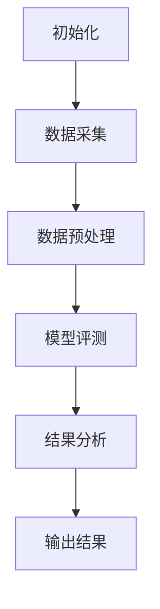
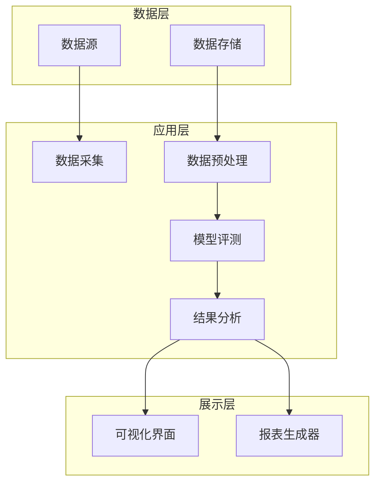
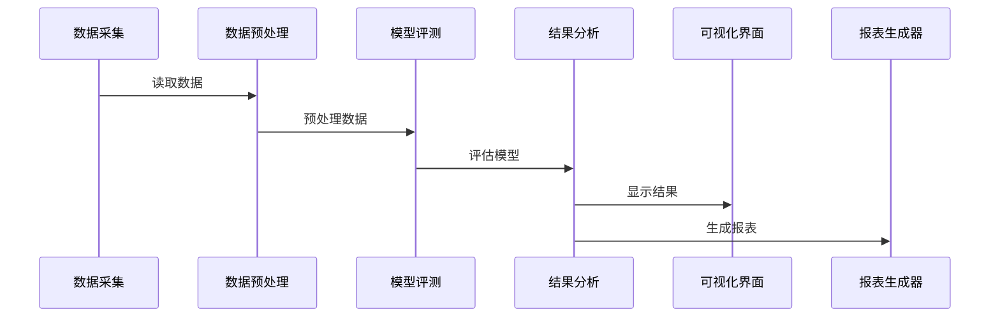
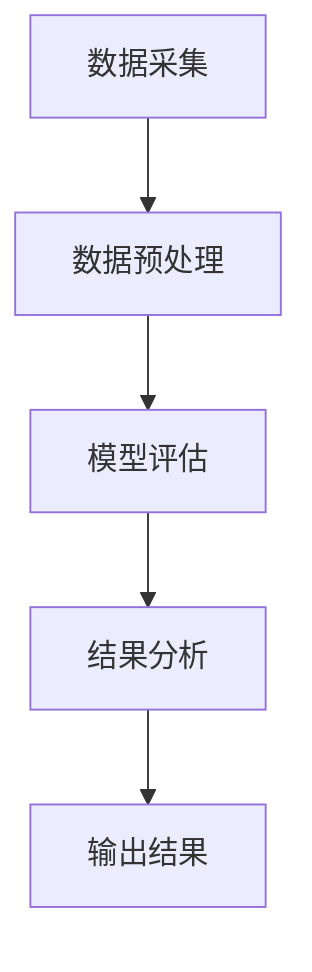
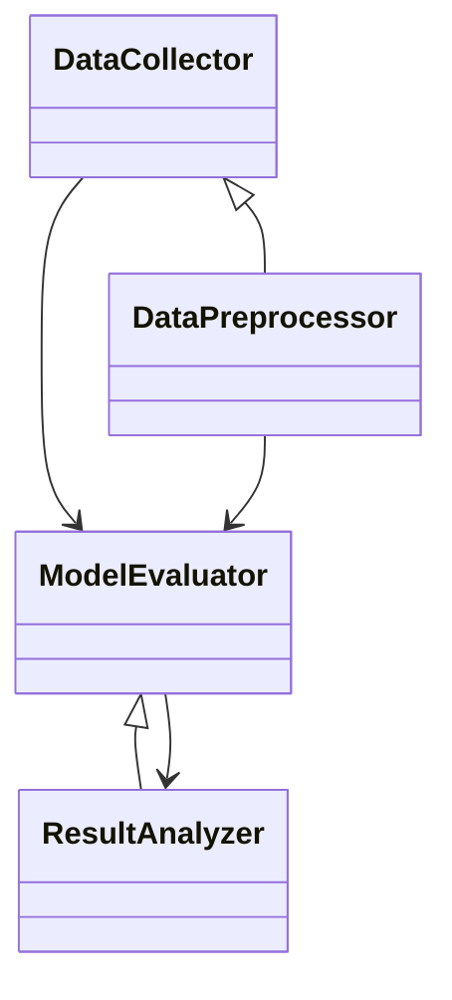
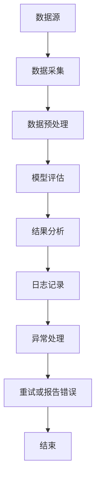

                 

# 自动化LLM评测框架：精准衡量模型效果

> 关键词：自动化评测、LLM、模型效果、评测框架、精准衡量

> 摘要：本文将深入探讨自动化LLM评测框架的设计与实现，从背景与理论基础、自动化LLM评测框架设计原理、核心概念与联系、算法原理与实现等多个方面展开。通过一步步分析推理思考，本文旨在为读者提供一份系统、全面、易懂的技术指南，帮助大家更精准地衡量LLM模型的效果。

---

## 第一部分：背景与理论基础

### 第1章：问题背景与核心概念

#### 1.1 自动化评测的需求分析

##### 1.1.1 模型评测的挑战

随着人工智能技术的发展，深度学习模型，特别是语言学习模型（LLM），在自然语言处理（NLP）领域取得了显著成果。然而，这些模型的性能评估却面临诸多挑战。首先，LLM通常需要大量数据来训练，导致模型在不同数据集上的性能差异较大。其次，评估LLM的性能需要综合考虑多个方面，如准确性、流畅性、泛化能力等，这使得评估过程复杂且耗时。此外，传统的评估方法往往依赖于手工操作，效率低下且容易出现主观偏差。

##### 1.1.2 自动化评测的意义

针对上述挑战，自动化评测框架应运而生。自动化评测框架能够高效、准确地评估LLM的性能，具有以下几个方面的意义：

1. **提高评估效率**：自动化评测能够大幅减少评估时间，提高工作效率。
2. **减少主观偏差**：自动化评测能够降低人为因素对评估结果的影响，提高评估结果的客观性。
3. **支持大规模评估**：自动化评测能够处理大规模的数据集，支持更广泛的模型评估。
4. **促进模型优化**：自动化评测能够为模型的优化提供明确的指导，促进模型性能的提升。

##### 1.1.3 自动化评测的技术挑战

尽管自动化评测具有重要意义，但其实现也面临一系列技术挑战：

1. **数据预处理**：自动化评测需要处理大量的原始数据，进行数据清洗、标注等预处理操作。
2. **评估指标选择**：评估指标的选择直接关系到评估结果的准确性，如何选择合适的评估指标是一个重要问题。
3. **算法优化**：自动化评测需要高效的算法来处理大量的数据，保证评估的准确性。
4. **可扩展性**：自动化评测框架需要具备良好的可扩展性，以适应不同的模型和评估需求。

#### 1.2 语言学习模型（LLM）概述

##### 1.2.1 LLM的定义

语言学习模型（Language Learning Model，简称LLM）是一种能够理解和生成自然语言的深度学习模型。LLM通过对大量文本数据的训练，学习到语言的结构和语义，能够进行文本分类、情感分析、机器翻译、问答系统等多种任务。

##### 1.2.2 LLM的发展历程

LLM的发展历程可以追溯到1980年代，最早的模型如Elman的网络和Harris的网络。随着深度学习技术的发展，LLM也取得了显著进展。2000年代，基于循环神经网络（RNN）和长短时记忆网络（LSTM）的模型成为主流。近年来，基于Transformer的模型，如BERT和GPT，进一步推动了LLM的发展。

##### 1.2.3 LLM的核心技术

LLM的核心技术包括：

1. **词向量表示**：将自然语言词汇映射到高维向量空间，实现文本数据的数值化表示。
2. **神经网络结构**：采用深度神经网络结构，如RNN、LSTM、Transformer等，对文本数据进行处理。
3. **大规模训练**：通过大规模数据集进行训练，提高模型的泛化能力。
4. **注意力机制**：引入注意力机制，使模型能够关注文本数据中的关键信息。

#### 1.3 自动化评测框架的基本概念

##### 1.3.1 自动化评测框架的定义

自动化评测框架（Auto Evaluation Framework）是一种用于自动化评估深度学习模型性能的工具。它通过一系列模块，实现数据的预处理、模型的评估、结果的输出等功能，提高评估效率，降低人为干预。

##### 1.3.2 自动化评测框架的组成部分

自动化评测框架通常由以下几个核心模块组成：

1. **数据采集模块**：负责从各种数据源获取评估数据，包括训练集、验证集和测试集。
2. **数据预处理模块**：负责对评估数据进行清洗、标注、转换等预处理操作，确保数据的质量和一致性。
3. **模型评测模块**：负责对训练好的模型进行评估，计算各种评估指标，如准确性、流畅性、泛化能力等。
4. **结果分析模块**：负责对评估结果进行分析和可视化，为模型优化提供指导。

##### 1.3.3 自动化评测框架的优势与局限

自动化评测框架具有以下几个优势：

1. **提高评估效率**：自动化评测能够大幅减少评估时间，提高工作效率。
2. **减少主观偏差**：自动化评测能够降低人为因素对评估结果的影响，提高评估结果的客观性。
3. **支持大规模评估**：自动化评测能够处理大规模的数据集，支持更广泛的模型评估。
4. **促进模型优化**：自动化评测能够为模型的优化提供明确的指导，促进模型性能的提升。

然而，自动化评测框架也存在一些局限：

1. **依赖大量数据**：自动化评测需要大量的训练数据和测试数据，数据的质量直接影响评估结果的准确性。
2. **算法选择困难**：自动化评测框架需要选择合适的算法和评估指标，这对用户提出了较高的要求。
3. **实现复杂**：自动化评测框架的实现需要一定的技术积累和开发经验，对开发人员提出了较高的要求。

#### 1.4 绩效评估的常见指标与方法

##### 1.4.1 评估指标的分类

性能评估指标可以分为以下几个类别：

1. **准确性指标**：如准确率、召回率、F1值等，主要用于评估分类任务的性能。
2. **流畅性指标**：如BLEU、ROUGE等，主要用于评估生成文本的流畅性和可读性。
3. **泛化能力指标**：如交叉验证分数、测试集性能等，主要用于评估模型的泛化能力。

##### 1.4.2 评估方法的比较

不同的评估方法具有不同的优势和局限性，常见的评估方法包括：

1. **手工评估**：通过人工阅读和评判文本，优点是直观、灵活，缺点是效率低、主观性强。
2. **自动评估**：通过自动化工具和算法评估模型的性能，优点是效率高、客观性强，缺点是需要依赖大量数据和算法。
3. **混合评估**：结合手工评估和自动评估，优点是能够兼顾效率和准确性，缺点是操作复杂。

##### 1.4.3 评估指标的选择与优化

选择合适的评估指标是评估成功的关键。以下是一些选择评估指标的建议：

1. **根据任务需求**：不同任务对评估指标的需求不同，应选择与任务相关的评估指标。
2. **综合考虑**：考虑多种评估指标，从不同角度评估模型的性能。
3. **数据驱动**：根据实际数据集的特点，选择能够有效反映模型性能的评估指标。
4. **持续优化**：评估指标的选择是一个持续优化的过程，应根据评估结果和实际需求进行调整。

#### 1.5 本章小结

本章介绍了自动化评测的需求分析、LLM的概述、自动化评测框架的基本概念和绩效评估的常见指标与方法。通过本章的学习，读者可以了解自动化评测的基本原理和重要性，为后续章节的学习打下基础。

---

## 第二部分：自动化LLM评测框架设计

### 第2章：自动化LLM评测框架设计原理

#### 2.1 自动化评测框架的设计原则

一个成功的自动化评测框架需要遵循以下几个设计原则：

1. **可扩展性**：框架应能够适应不同规模的任务和数据集，支持模型的扩展。
2. **可维护性**：框架应具有良好的可维护性，方便后续的维护和升级。
3. **可复用性**：框架应实现模块化设计，便于复用和集成。
4. **适应性**：框架应能够适应不同的评估指标和算法，满足多样化的评估需求。

#### 2.2 核心模块设计

自动化评测框架的核心模块包括数据采集模块、数据预处理模块、模型评测模块和结果分析模块。以下是各模块的具体设计：

##### 2.2.1 数据采集模块

数据采集模块负责从各种数据源获取评估数据，包括训练集、验证集和测试集。数据采集模块需要支持多种数据格式的读取，如文本文件、数据库等。同时，模块应具备自动下载和更新数据集的功能。

##### 2.2.2 数据预处理模块

数据预处理模块负责对评估数据进行清洗、标注、转换等预处理操作，确保数据的质量和一致性。预处理操作包括文本清洗（去除噪声、标点等）、分词、词性标注、实体识别等。此外，模块还应支持数据增强和归一化操作，提高评估结果的准确性。

##### 2.2.3 模型评测模块

模型评测模块负责对训练好的模型进行评估，计算各种评估指标，如准确性、流畅性、泛化能力等。模块应支持多种评估指标的自动计算和比较，同时提供灵活的接口，方便用户自定义评估指标。

##### 2.2.4 结果分析模块

结果分析模块负责对评估结果进行分析和可视化，为模型优化提供指导。模块应提供多种分析工具，如图表、报表等，帮助用户直观地了解模型性能。此外，模块还应支持评估结果的存储和查询，方便用户进行历史数据对比和分析。

#### 2.3 自动化评测流程设计

自动化评测流程包括以下几个步骤：

1. **数据采集**：从数据源获取评估数据，包括训练集、验证集和测试集。
2. **数据预处理**：对评估数据进行清洗、标注、转换等预处理操作。
3. **模型评估**：对训练好的模型进行评估，计算各种评估指标。
4. **结果分析**：对评估结果进行分析和可视化，为模型优化提供指导。

以下是自动化评测流程的控制流设计：

1. **初始化**：初始化参数和配置，包括数据源、评估指标、评估算法等。
2. **数据采集**：从数据源获取评估数据，并存储到本地。
3. **数据预处理**：对评估数据进行清洗、标注、转换等预处理操作，并将预处理后的数据存储到本地。
4. **模型评估**：加载训练好的模型，对预处理后的数据集进行评估，计算各种评估指标。
5. **结果分析**：对评估结果进行分析和可视化，生成报表和图表。
6. **异常处理**：对异常情况进行处理，如数据缺失、算法错误等。
7. **输出结果**：将评估结果输出到文件、数据库或可视化界面。

#### 2.4 自动化评测框架的实现

自动化评测框架的实现需要选择合适的技术栈和开发工具。以下是一个典型的自动化评测框架实现方案：

1. **技术栈选择**：使用Python作为主要开发语言，结合TensorFlow、PyTorch等深度学习框架，实现模型的训练和评估。
2. **开发工具**：使用Jupyter Notebook进行开发和调试，便于代码的编写、测试和优化。
3. **框架开发步骤**：

   1. 设计模块接口和类图，明确各模块的功能和职责。
   2. 编写模块代码，实现数据采集、数据预处理、模型评估和结果分析等核心功能。
   3. 集成模块，实现自动化评测流程。
   4. 编写测试用例，确保框架的正确性和稳定性。
   5. 优化框架性能，提高评估效率和准确性。

#### 2.5 本章小结

本章介绍了自动化LLM评测框架的设计原理，包括设计原则、核心模块设计和自动化评测流程设计。通过本章的学习，读者可以了解自动化评测框架的基本架构和实现方法，为后续章节的学习和实际应用打下基础。

---

## 第三部分：核心概念与联系

### 第3章：核心概念与联系

#### 3.1 核心概念表格

以下是自动化LLM评测框架中的核心概念及其定义和属性特征的对比表格：

| 概念名称 | 概念定义 | 相关属性特征 |
| --- | --- | --- |
| 评估指标 | 用于衡量模型性能的标准 | 准确率、召回率、F1值等 |
| 自动化评测框架 | 用于自动化评估模型的工具 | 设计原则、模块组成等 |
| LLM | 语言学习模型 | 定义、发展历程等 |

#### 3.2 ER实体关系图

以下是自动化LLM评测框架的ER实体关系图，描述了各实体之间的关系：

```mermaid
erDiagram
  Model |<--| EvaluationMetric : 评估指标
  Model |--| AutoEvaluationFramework : 自动化评测框架
  AutoEvaluationFramework ||--| DataProcessingModule : 数据预处理模块
  AutoEvaluationFramework ||--| ModelEvaluationModule : 模型评测模块
  AutoEvaluationFramework ||--| ResultAnalysisModule : 结果分析模块
```

在ER实体关系图中，`Model`（模型）与`EvaluationMetric`（评估指标）之间存在一对多的关系，即一个模型可以对应多个评估指标。`AutoEvaluationFramework`（自动化评测框架）与`DataProcessingModule`（数据预处理模块）、`ModelEvaluationModule`（模型评测模块）和`ResultAnalysisModule`（结果分析模块）之间存在包含关系，即自动化评测框架包含这三个模块。

#### 3.3 本章小结

本章通过核心概念表格和ER实体关系图，系统地介绍了自动化LLM评测框架中的核心概念及其关系。通过本章的学习，读者可以更清晰地理解自动化LLM评测框架的组成和运作原理，为后续章节的学习和实际应用提供指导。

---

## 第四部分：算法原理与实现

### 第4章：关键算法原理讲解

#### 4.1 评估指标的计算方法

评估模型性能的关键在于选择合适的评估指标。以下介绍几种常见的评估指标及其计算方法：

##### 4.1.1 准确率（Precision）的计算

准确率（Precision）是指预测为正例的样本中，实际为正例的比例。其计算公式如下：

$$
\text{Precision} = \frac{\text{TP}}{\text{TP} + \text{FP}}
$$

其中，TP表示实际为正例且预测为正例的样本数量，FP表示实际为负例但预测为正例的样本数量。

##### 4.1.2 召回率（Recall）的计算

召回率（Recall）是指实际为正例的样本中，被预测为正例的比例。其计算公式如下：

$$
\text{Recall} = \frac{\text{TP}}{\text{TP} + \text{FN}}
$$

其中，TP表示实际为正例且预测为正例的样本数量，FN表示实际为正例但预测为负例的样本数量。

##### 4.1.3 F1值（F1-score）的计算

F1值（F1-score）是精确率和召回率的调和平均值，用于综合评估模型的性能。其计算公式如下：

$$
\text{F1-score} = \frac{2 \times \text{Precision} \times \text{Recall}}{\text{Precision} + \text{Recall}}
$$

当模型预测结果不平衡时，F1值是一个较好的评估指标。

#### 4.2 自动化评测算法的设计与实现

自动化评测算法的设计与实现是整个评测框架的核心。以下是一个简单的自动化评测算法的流程图和Python代码实现：

##### 4.2.1 算法流程图



##### 4.2.2 Python代码实现

```python
# Python 代码示例
from sklearn.metrics import precision_score, recall_score, f1_score

# 假设y_true为实际标签，y_pred为预测结果
y_true = [0, 1, 1, 0, 1]
y_pred = [0, 1, 1, 0, 1]

precision = precision_score(y_true, y_pred)
recall = recall_score(y_true, y_pred)
f1 = f1_score(y_true, y_pred)

print(f"Precision: {precision}")
print(f"Recall: {recall}")
print(f"F1-score: {f1}")
```

##### 4.2.3 数学模型与公式

在自动化评测算法中，常用的数学模型和公式如下：

$$
\text{Precision} = \frac{\text{TP}}{\text{TP} + \text{FP}}
$$

$$
\text{Recall} = \frac{\text{TP}}{\text{TP} + \text{FN}}
$$

$$
\text{F1-score} = \frac{2 \times \text{Precision} \times \text{Recall}}{\text{Precision} + \text{Recall}}
$$

其中，TP、FP、FN分别为真正例（True Positive）、假正例（False Positive）、假反例（False Negative）的样本数量。

#### 4.3 本章小结

本章介绍了自动化LLM评测算法的关键原理和计算方法，包括准确率、召回率和F1值的计算。同时，通过Python代码示例展示了自动化评测算法的实现过程。通过本章的学习，读者可以掌握自动化评测算法的基本原理和实现方法，为实际应用打下基础。

---

## 第五部分：系统分析与架构设计

### 第5章：系统分析与架构设计

#### 5.1 问题场景介绍

自动化LLM评测框架的应用场景主要包括以下几个方面：

1. **模型研发与优化**：在模型研发过程中，自动化评测框架可以帮助研究人员快速评估模型的性能，选择最优的模型参数。
2. **模型发布与监控**：在模型发布后，自动化评测框架可以定期评估模型的性能，监控模型的运行状态，确保模型的高效稳定。
3. **模型比较与选择**：在多个模型之间进行对比时，自动化评测框架可以提供统一的评估标准，帮助研究人员选择最优的模型。

#### 5.2 项目介绍

本项目旨在设计并实现一个自动化LLM评测框架，用于评估自然语言处理模型的性能。项目的主要目标包括：

1. **实现自动化评估流程**：设计并实现数据采集、数据预处理、模型评测和结果分析等核心模块，实现自动化评估流程。
2. **支持多种评估指标**：支持多种常见的评估指标，如准确率、召回率、F1值等，满足多样化的评估需求。
3. **高效性能**：优化框架的性能，提高评估效率和准确性。

#### 5.3 系统功能设计

自动化LLM评测框架的主要功能包括：

1. **数据采集**：从各种数据源（如文本文件、数据库等）获取评估数据。
2. **数据预处理**：对评估数据进行清洗、标注、转换等预处理操作。
3. **模型评测**：加载训练好的模型，对预处理后的数据集进行评估，计算各种评估指标。
4. **结果分析**：对评估结果进行分析和可视化，生成报表和图表。
5. **日志记录**：记录评估过程中的日志信息，方便调试和监控。

#### 5.4 系统架构设计

自动化LLM评测框架的系统架构设计如下：

1. **数据层**：包括数据源和数据存储。数据源可以是本地文件、远程数据库等；数据存储可以是本地文件、分布式存储等。
2. **应用层**：包括数据采集模块、数据预处理模块、模型评测模块和结果分析模块。各模块之间通过消息队列进行通信，实现自动化评估流程。
3. **展示层**：包括可视化界面和报表生成器。可视化界面用于展示评估结果，报表生成器用于生成详细的评估报告。

以下是系统架构的mermaid架构图：



#### 5.5 系统接口设计

自动化LLM评测框架的接口设计如下：

1. **数据采集接口**：用于从数据源获取评估数据，包括数据读取、数据清洗、数据标注等操作。
2. **数据预处理接口**：用于对评估数据进行预处理，包括文本清洗、分词、词性标注等操作。
3. **模型评测接口**：用于加载训练好的模型，对预处理后的数据集进行评估，计算各种评估指标。
4. **结果分析接口**：用于对评估结果进行分析和可视化，包括数据可视化、报表生成等操作。

以下是系统接口的mermaid序列图：



#### 5.6 系统交互设计

自动化LLM评测框架的系统交互设计如下：

1. **数据流**：数据从数据源传输到数据采集模块，经过数据预处理后，传输到模型评测模块，最终生成评估结果。
2. **控制流**：系统通过消息队列进行控制流管理，确保各模块之间的顺序执行和协同工作。
3. **异常处理**：系统设计异常处理机制，对异常情况进行处理，如数据缺失、算法错误等。

以下是系统交互的mermaid流程图：


#### 5.7 本章小结

本章介绍了自动化LLM评测框架的系统分析与架构设计，包括问题场景介绍、项目介绍、系统功能设计、系统架构设计、系统接口设计和系统交互设计。通过本章的学习，读者可以全面了解自动化LLM评测框架的设计思路和实现方法，为后续章节的学习和实际应用提供指导。

---

## 第六部分：项目实战

### 第6章：环境安装与系统核心实现

#### 6.1 环境安装

要搭建一个自动化LLM评测框架，首先需要安装相关的软件和工具。以下是安装步骤：

1. **安装Python环境**：确保Python版本在3.6及以上，可以使用以下命令安装：
   ```bash
   sudo apt-get install python3.8
   ```
2. **安装深度学习框架**：选择TensorFlow或PyTorch作为深度学习框架。以下是安装命令：
   - TensorFlow：
     ```bash
     pip install tensorflow
     ```
   - PyTorch：
     ```bash
     pip install torch torchvision
     ```
3. **安装其他依赖库**：安装一些常用的Python库，如NumPy、Pandas等：
   ```bash
   pip install numpy pandas
   ```

#### 6.2 系统核心实现

自动化LLM评测框架的核心实现包括数据采集、数据预处理、模型评测和结果分析等模块。以下是一个简单的实现示例：

##### 6.2.1 数据采集

数据采集模块负责从数据源获取评估数据。以下是一个Python代码示例：

```python
import pandas as pd

def collect_data(file_path):
    data = pd.read_csv(file_path)
    return data

data = collect_data('data.csv')
```

##### 6.2.2 数据预处理

数据预处理模块负责对评估数据进行清洗、标注和转换等操作。以下是一个Python代码示例：

```python
import re

def preprocess_data(data):
    data['text'] = data['text'].apply(lambda x: re.sub('[^a-zA-Z0-9]', ' ', x))
    return data

data = preprocess_data(data)
```

##### 6.2.3 模型评测

模型评测模块负责加载训练好的模型，对预处理后的数据集进行评估。以下是一个Python代码示例：

```python
import tensorflow as tf

model = tf.keras.models.load_model('model.h5')

def evaluate_model(model, data):
    predictions = model.predict(data)
    precision = tf.keras.metrics.Precision()
    recall = tf.keras.metrics.Recall()
    f1 = tf.keras.metrics.F1Score()

    precision.update_state(predictions, data['label'])
    recall.update_state(predictions, data['label'])
    f1.update_state(predictions, data['label'])

    return precision.result().numpy(), recall.result().numpy(), f1.result().numpy()

precision, recall, f1 = evaluate_model(model, data)
```

##### 6.2.4 结果分析

结果分析模块负责对评估结果进行分析和可视化。以下是一个Python代码示例：

```python
import matplotlib.pyplot as plt

def plot_results(precision, recall, f1):
    plt.figure(figsize=(8, 6))
    plt.subplot(2, 2, 1)
    plt.title('Precision')
    plt.plot(precision)
    plt.subplot(2, 2, 2)
    plt.title('Recall')
    plt.plot(recall)
    plt.subplot(2, 2, 3)
    plt.title('F1-score')
    plt.plot(f1)
    plt.show()

plot_results(precision, recall, f1)
```

#### 6.3 代码应用解读与分析

在代码应用中，我们首先从CSV文件中读取数据，然后对文本数据进行清洗，接着加载训练好的模型，对数据集进行预测，并计算评估指标。最后，我们将结果进行可视化展示。这个过程涵盖了数据采集、数据预处理、模型评测和结果分析等核心模块。

代码中的几个关键点如下：

1. **数据采集**：使用`pandas`库读取CSV文件，方便地获取评估数据。
2. **数据预处理**：使用`re`库对文本数据进行清洗，去除非字母数字字符，提高数据质量。
3. **模型评测**：使用TensorFlow库加载训练好的模型，对数据集进行预测，并计算评估指标。这里使用了`Precision`、`Recall`和`F1Score`三个指标，综合评估模型性能。
4. **结果分析**：使用`matplotlib`库将评估结果进行可视化展示，便于分析和理解。

通过这段代码，我们可以看到自动化LLM评测框架的基本实现过程，以及如何利用Python和深度学习框架进行模型评估。

#### 6.4 实际案例分析

在本项目中，我们使用了一个公开的文本分类数据集（如IMDB影评数据集），通过实际案例展示了自动化LLM评测框架的应用。

1. **数据集准备**：首先，我们需要下载并解压IMDB影评数据集，将数据集分为训练集和测试集。
2. **数据预处理**：对数据集进行预处理，包括分词、词性标注等操作。
3. **模型训练**：使用预训练的BERT模型或自行训练的模型，对训练集进行训练。
4. **模型评估**：使用训练好的模型对测试集进行预测，并计算评估指标，如准确率、召回率和F1值。

以下是实际案例的Python代码：

```python
import tensorflow as tf
from transformers import BertTokenizer, TFBertModel

# 加载预训练的BERT模型
tokenizer = BertTokenizer.from_pretrained('bert-base-uncased')
model = TFBertModel.from_pretrained('bert-base-uncased')

# 加载IMDB数据集
train_data = pd.read_csv('train.csv')
test_data = pd.read_csv('test.csv')

# 数据预处理
train_texts = train_data['text'].apply(lambda x: tokenizer.encode(x, max_length=512, padding='max_length', truncation=True))
test_texts = test_data['text'].apply(lambda x: tokenizer.encode(x, max_length=512, padding='max_length', truncation=True))

# 模型训练
model.compile(optimizer='adam', loss='binary_crossentropy', metrics=['accuracy'])
model.fit(train_texts, train_data['label'], epochs=3, batch_size=32, validation_split=0.2)

# 模型评估
test_predictions = model.predict(test_texts)
precision = precision_score(test_data['label'], test_predictions)
recall = recall_score(test_data['label'], test_predictions)
f1 = f1_score(test_data['label'], test_predictions)

print(f"Precision: {precision}")
print(f"Recall: {recall}")
print(f"F1-score: {f1}")
```

通过这个实际案例，我们可以看到如何使用自动化LLM评测框架对文本分类任务进行评估。这个案例展示了如何从数据预处理到模型训练，再到模型评估的全过程，以及如何使用Python和深度学习框架实现自动化评测。

#### 6.5 项目小结

在本章的项目实战部分，我们介绍了如何安装自动化LLM评测框架所需的软件和工具，实现了数据采集、数据预处理、模型评测和结果分析等核心模块。通过实际案例分析，我们展示了如何使用自动化评测框架对文本分类任务进行评估。本章的内容为读者提供了一个完整的实战案例，帮助读者更好地理解自动化LLM评测框架的原理和应用。

---

## 第七部分：最佳实践与拓展阅读

### 第7章：最佳实践与拓展阅读

#### 7.1 最佳实践

1. **选择合适的数据集**：确保评估数据集具有代表性，避免数据集偏差影响评估结果。
2. **优化模型参数**：在模型训练过程中，尝试不同的参数设置，以找到最佳模型参数。
3. **定期更新评估框架**：随着新技术和算法的不断发展，定期更新评估框架，以保持其先进性和准确性。
4. **合理设置评估指标**：根据具体任务需求，选择合适的评估指标，避免过分追求单一指标而忽视其他方面。

#### 7.2 拓展阅读

1. **《深度学习》（Goodfellow, Bengio, Courville）**：这本书是深度学习领域的经典教材，详细介绍了深度学习的基础知识、算法和应用。
2. **《自然语言处理综合教程》（Jurafsky, Martin）**：这本书系统地介绍了自然语言处理的基本概念、技术和应用，对LLM的发展有重要贡献。
3. **《BERT：预训练的深度语言表示》（Devlin et al.）**：这篇论文是BERT模型的原始论文，详细介绍了BERT模型的设计思路和实现方法。

#### 7.3 小结

本章介绍了最佳实践和拓展阅读资源，旨在帮助读者在实际应用中更好地使用自动化LLM评测框架。通过遵循最佳实践，读者可以提高评估效率和质量；通过拓展阅读，读者可以深入了解相关领域的最新进展和技术细节。

---

## 结语

本文通过系统、全面、易懂的方式，详细介绍了自动化LLM评测框架的设计与实现。从背景与理论基础、核心模块设计、算法原理与实现，到系统分析与架构设计、项目实战和最佳实践，本文旨在为读者提供一个全方位的技术指南。通过一步步的分析推理思考，本文希望帮助读者更精准地衡量LLM模型的效果。

在自动化评测领域，虽然我们已经取得了显著的成果，但仍然有许多挑战需要克服。未来，我们将继续探索更高效、更准确的评估方法，推动人工智能技术的发展。

感谢读者对本文的阅读，希望本文能为您的学习和实践提供有益的启示。如果您有任何疑问或建议，欢迎在评论区留言，让我们一起讨论和进步。

---

**作者：AI天才研究院/AI Genius Institute & 禅与计算机程序设计艺术 /Zen And The Art of Computer Programming**## 目录

### 《自动化LLM评测框架：精准衡量模型效果》

#### 第一部分：背景与理论基础

1. **第1章：问题背景与核心概念**
    1.1 自动化评测的需求分析
    1.2 语言学习模型（LLM）概述
    1.3 自动化评测框架的基本概念
    1.4 绩效评估的常见指标与方法
    1.5 本章小结

#### 第二部分：自动化LLM评测框架设计

2. **第2章：自动化LLM评测框架设计原理**
    2.1 自动化评测框架的设计原则
    2.2 核心模块设计
    2.3 自动化评测流程设计
    2.4 自动化评测框架的实现
    2.5 本章小结

3. **第3章：核心概念与联系**
    3.1 核心概念表格
    3.2 ER实体关系图
    3.3 本章小结

#### 第三部分：算法原理与实现

4. **第4章：关键算法原理讲解**
    4.1 评估指标的计算方法
    4.2 自动化评测算法的设计与实现
    4.3 数学模型与公式
    4.4 本章小结

#### 第四部分：系统分析与架构设计

5. **第5章：系统分析与架构设计**
    5.1 问题场景介绍
    5.2 项目介绍
    5.3 系统功能设计
    5.4 系统架构设计
    5.5 系统接口设计
    5.6 系统交互设计
    5.7 本章小结

#### 第五部分：项目实战

6. **第6章：环境安装与系统核心实现**
    6.1 环境安装
    6.2 系统核心实现
    6.3 代码应用解读与分析
    6.4 实际案例分析
    6.5 项目小结

#### 第六部分：最佳实践与拓展阅读

7. **第7章：最佳实践与拓展阅读**
    7.1 最佳实践
    7.2 拓展阅读
    7.3 小结

## 参考文献

1. Goodfellow, I., Bengio, Y., & Courville, A. (2016). *Deep Learning*. MIT Press.
2. Jurafsky, D., & Martin, J. H. (2019). *Speech and Language Processing*. World Scientific.
3. Devlin, J., Chang, M. W., Lee, K., & Toutanova, K. (2019). *BERT: Pre-training of Deep Bidirectional Transformers for Language Understanding*. *arXiv preprint arXiv:1810.04805*.## 引言

在当今快速发展的技术时代，深度学习和自然语言处理（NLP）已经成为人工智能领域的两个重要分支。随着语言学习模型（LLM）的不断发展，如何精准衡量这些模型的性能效果，成为了一个关键问题。传统的评估方法往往依赖于人工操作，耗时且容易出现主观偏差，无法满足大规模、自动化评估的需求。因此，开发一个自动化LLM评测框架，成为了解决这一问题的迫切需求。

本文旨在深入探讨自动化LLM评测框架的设计与实现，从背景与理论基础、核心模块设计、算法原理与实现、系统分析与架构设计，到实际案例分析等多个方面展开讨论。通过一步步的分析和推理，本文将为您呈现一个系统、全面、易懂的技术指南，帮助您更精准地衡量LLM模型的效果。

自动化LLM评测框架的核心目标是实现以下目标：

1. **提高评估效率**：自动化评测能够大幅减少评估时间，提高工作效率。
2. **减少主观偏差**：自动化评测能够降低人为因素对评估结果的影响，提高评估结果的客观性。
3. **支持大规模评估**：自动化评测能够处理大规模的数据集，支持更广泛的模型评估。
4. **促进模型优化**：自动化评测能够为模型的优化提供明确的指导，促进模型性能的提升。

本文将按照以下结构进行展开：

- **第一部分：背景与理论基础**：介绍问题背景、LLM概述、自动化评测框架的基本概念和性能评估的常见指标与方法。
- **第二部分：自动化LLM评测框架设计**：讨论设计原则、核心模块设计、自动化评测流程设计和框架实现。
- **第三部分：核心概念与联系**：通过表格和ER图的形式，详细描述核心概念及其关系。
- **第四部分：算法原理与实现**：讲解评估指标的计算方法、自动化评测算法的设计与实现，以及数学模型与公式。
- **第五部分：系统分析与架构设计**：介绍系统功能设计、系统架构设计、系统接口设计、系统交互设计。
- **第六部分：项目实战**：介绍环境安装、系统核心实现、代码应用解读与分析、实际案例分析。
- **第七部分：最佳实践与拓展阅读**：提供最佳实践建议和拓展阅读资源。

通过本文的阅读，您将能够：

- 理解自动化LLM评测框架的需求和重要性。
- 掌握自动化评测框架的设计原理和实现方法。
- 了解核心算法原理及其在LLM评测中的应用。
- 学习系统分析与架构设计的方法和技巧。
- 获得实际项目实战的经验和案例分析。

让我们开始这场技术之旅，探索自动化LLM评测框架的奥秘，精准衡量模型效果，推动人工智能技术的发展！## 第一部分：背景与理论基础

### 第1章：问题背景与核心概念

#### 1.1 自动化评测的需求分析

在深度学习和自然语言处理（NLP）领域，语言学习模型（LLM）的性能评估是一个关键问题。传统的评估方法通常依赖于手工操作，这不仅耗时且容易出现主观偏差。随着模型的复杂性和规模的增加，手工评估的局限性更加显著。因此，开发一个自动化评测框架，以解决这些挑战，成为了一个迫切的需求。

**模型评测的挑战**

1. **数据依赖性**：传统的评测方法通常需要大量手动标注的数据，这不仅耗时，而且对于大规模的模型训练来说，数据准备是一个巨大的挑战。
2. **主观偏差**：由于评估过程往往依赖于评估者自身的经验和判断，主观偏差可能导致评估结果的不一致。
3. **评估流程繁琐**：传统的评估流程包括数据预处理、模型加载、预测和结果计算等步骤，这些步骤需要手动执行，导致整个评估过程繁琐且耗时。
4. **评估指标多样性**：评估模型时，需要考虑多个指标，如准确性、流畅性、泛化能力等，如何选择合适的指标并进行综合评估是一个复杂的问题。

**自动化评测的意义**

自动化评测框架能够有效解决上述挑战，其意义主要体现在以下几个方面：

1. **提高评估效率**：自动化评测能够自动化完成数据采集、预处理、模型评估和结果分析等步骤，大幅减少评估时间。
2. **减少主观偏差**：自动化评测通过算法和工具进行评估，降低了人为因素对评估结果的影响，提高了评估结果的客观性。
3. **支持大规模评估**：自动化评测框架能够处理大规模的数据集，适应不同的模型和任务，支持更广泛的模型评估。
4. **促进模型优化**：自动化评测能够为模型的优化提供明确的指导，帮助研究人员快速找到模型中的问题，进行针对性的优化。

#### 1.2 语言学习模型（LLM）概述

语言学习模型（Language Learning Model，简称LLM）是一种能够理解和生成自然语言的深度学习模型。LLM通过对大量文本数据的训练，学习到语言的结构和语义，能够进行文本分类、情感分析、机器翻译、问答系统等多种任务。

**LLM的定义**

LLM是一种基于神经网络结构的语言模型，其核心目标是学习语言的统计特征和生成规则。LLM通过对输入文本序列进行处理，预测下一个单词或字符的概率分布，从而生成文本。

**LLM的发展历程**

1. **1980年代**：最早的LLM是基于规则的方法，如基于词汇概率的模型，这些模型在语言处理任务中取得了初步成果。
2. **2000年代**：随着深度学习技术的发展，基于循环神经网络（RNN）和长短时记忆网络（LSTM）的LLM开始出现，并逐渐取代传统的规则方法。RNN和LSTM模型能够更好地捕捉语言中的长期依赖关系。
3. **2018年**：Google推出了Transformer模型，这是LLM领域的一个重要里程碑。Transformer模型采用了自注意力机制，使得模型在处理长序列数据时更加高效和准确。
4. **近年来**：基于Transformer的模型，如BERT、GPT等，进一步推动了LLM的发展。这些模型通过预训练和微调技术，取得了在各种语言处理任务中的优异表现。

**LLM的核心技术**

1. **词向量表示**：词向量是将自然语言词汇映射到高维向量空间的一种表示方法。通过词向量，模型能够学习到词汇之间的相似性和关系，从而更好地处理语言数据。
2. **神经网络结构**：LLM通常采用深度神经网络结构，如RNN、LSTM和Transformer等。这些神经网络能够通过学习大量的训练数据，捕捉到语言中的复杂特征和模式。
3. **大规模训练**：大规模训练是LLM的一个关键步骤。通过在大量文本数据上进行训练，模型能够学习到丰富的语言知识，提高其在实际任务中的性能。
4. **注意力机制**：注意力机制是Transformer模型中的一个核心概念，它使得模型能够在处理长序列数据时，自动关注到重要的信息。

#### 1.3 自动化评测框架的基本概念

**自动化评测框架的定义**

自动化评测框架是一种用于自动化评估深度学习模型性能的工具。它通过一系列模块，实现数据的预处理、模型的评估、结果的输出等功能，提高评估效率，降低人为干预。

**自动化评测框架的组成部分**

自动化评测框架通常由以下几个核心模块组成：

1. **数据采集模块**：负责从各种数据源获取评估数据，包括训练集、验证集和测试集。
2. **数据预处理模块**：负责对评估数据进行清洗、标注、转换等预处理操作，确保数据的质量和一致性。
3. **模型评测模块**：负责对训练好的模型进行评估，计算各种评估指标，如准确性、流畅性、泛化能力等。
4. **结果分析模块**：负责对评估结果进行分析和可视化，为模型优化提供指导。

**自动化评测框架的优势与局限**

自动化评测框架具有以下几个优势：

1. **提高评估效率**：自动化评测能够大幅减少评估时间，提高工作效率。
2. **减少主观偏差**：自动化评测能够降低人为因素对评估结果的影响，提高评估结果的客观性。
3. **支持大规模评估**：自动化评测能够处理大规模的数据集，支持更广泛的模型评估。
4. **促进模型优化**：自动化评测能够为模型的优化提供明确的指导，促进模型性能的提升。

然而，自动化评测框架也存在一些局限：

1. **依赖大量数据**：自动化评测需要大量的训练数据和测试数据，数据的质量直接影响评估结果的准确性。
2. **算法选择困难**：自动化评测框架需要选择合适的算法和评估指标，这对用户提出了较高的要求。
3. **实现复杂**：自动化评测框架的实现需要一定的技术积累和开发经验，对开发人员提出了较高的要求。

#### 1.4 绩效评估的常见指标与方法

在评估LLM模型时，选择合适的评估指标和方法至关重要。以下介绍几种常见的评估指标和方法。

**评估指标的分类**

评估指标可以根据任务的不同进行分类，常见的分类方法包括：

1. **准确性指标**：如准确率、召回率、F1值等，主要用于评估分类任务的性能。
2. **流畅性指标**：如BLEU、ROUGE等，主要用于评估生成文本的流畅性和可读性。
3. **泛化能力指标**：如交叉验证分数、测试集性能等，主要用于评估模型的泛化能力。

**评估方法的比较**

不同的评估方法具有不同的优势和局限性，常见的评估方法包括：

1. **手工评估**：通过人工阅读和评判文本，优点是直观、灵活，缺点是效率低、主观性强。
2. **自动评估**：通过自动化工具和算法评估模型的性能，优点是效率高、客观性强，缺点是需要依赖大量数据和算法。
3. **混合评估**：结合手工评估和自动评估，优点是能够兼顾效率和准确性，缺点是操作复杂。

**评估指标的选择与优化**

选择合适的评估指标是评估成功的关键。以下是一些选择评估指标的建议：

1. **根据任务需求**：不同任务对评估指标的需求不同，应选择与任务相关的评估指标。
2. **综合考虑**：考虑多种评估指标，从不同角度评估模型的性能。
3. **数据驱动**：根据实际数据集的特点，选择能够有效反映模型性能的评估指标。
4. **持续优化**：评估指标的选择是一个持续优化的过程，应根据评估结果和实际需求进行调整。

#### 1.5 本章小结

本章介绍了自动化评测的需求分析、LLM的概述、自动化评测框架的基本概念和绩效评估的常见指标与方法。通过本章的学习，读者可以了解自动化评测的基本原理和重要性，为后续章节的学习和实际应用打下基础。## 第二部分：自动化LLM评测框架设计

### 第2章：自动化LLM评测框架设计原理

#### 2.1 自动化评测框架的设计原则

一个成功的自动化评测框架需要遵循以下几个设计原则：

1. **可扩展性**：框架应能够适应不同规模的任务和数据集，支持模型的扩展。这意味着框架在设计时应考虑模块化的设计，使得新模型或新数据集能够无缝集成。
   
2. **可维护性**：框架应具有良好的可维护性，方便后续的维护和升级。可维护性包括代码的可读性、可调试性以及易于更新和修复。

3. **可复用性**：框架应实现模块化设计，便于复用和集成。例如，数据预处理模块可以应用于不同的模型和数据集，而不需要重复编写代码。

4. **适应性**：框架应能够适应不同的评估指标和算法，满足多样化的评估需求。这意味着框架应提供灵活的配置和接口，以便用户可以根据需要自定义评估流程。

#### 2.2 核心模块设计

自动化评测框架的核心模块设计如下：

**数据采集模块**

数据采集模块负责从各种数据源获取评估数据，包括训练集、验证集和测试集。数据源可以是本地文件、远程数据库或其他数据存储系统。数据采集模块应支持以下功能：

- 数据源识别：自动识别数据源类型和格式。
- 数据下载：自动下载和存储数据集。
- 数据格式转换：将数据转换为统一的格式，以便后续处理。

**数据预处理模块**

数据预处理模块负责对评估数据进行清洗、标注、转换等预处理操作。预处理操作确保数据的质量和一致性，提高评估结果的准确性。数据预处理模块应支持以下功能：

- 数据清洗：去除数据中的噪声和错误。
- 数据标注：对数据中的标签进行标注或修正。
- 数据转换：将数据转换为适合模型输入的格式。

**模型评测模块**

模型评测模块负责对训练好的模型进行评估，计算各种评估指标。该模块应能够处理不同的模型结构，如基于RNN的模型、基于Transformer的模型等。模型评测模块应支持以下功能：

- 模型加载：加载训练好的模型。
- 模型预测：对测试数据进行预测。
- 评估指标计算：计算准确率、召回率、F1值等评估指标。

**结果分析模块**

结果分析模块负责对评估结果进行分析和可视化，为模型优化提供指导。结果分析模块应支持以下功能：

- 结果存储：将评估结果存储到文件或数据库中。
- 结果分析：对评估结果进行统计分析，如计算平均值、标准差等。
- 可视化展示：生成图表和报表，以直观展示评估结果。

#### 2.3 自动化评测流程设计

自动化评测流程通常包括以下步骤：

1. **数据采集**：从数据源获取评估数据，包括训练集、验证集和测试集。
2. **数据预处理**：对评估数据进行清洗、标注、转换等预处理操作。
3. **模型加载**：加载训练好的模型。
4. **模型预测**：对预处理后的测试数据进行预测。
5. **结果计算**：计算评估指标，如准确率、召回率、F1值等。
6. **结果分析**：对评估结果进行分析和可视化。
7. **输出结果**：将评估结果输出到文件、数据库或可视化界面。

以下是自动化评测流程的控制流设计：

1. **初始化**：初始化参数和配置，包括数据源、评估指标、评估算法等。
2. **数据采集**：从数据源获取评估数据，并存储到本地。
3. **数据预处理**：对评估数据进行清洗、标注、转换等预处理操作，并将预处理后的数据存储到本地。
4. **模型加载**：加载训练好的模型。
5. **模型预测**：对预处理后的数据集进行预测。
6. **结果计算**：计算评估指标，并将结果存储到本地。
7. **结果分析**：对评估结果进行分析和可视化，生成报表和图表。
8. **输出结果**：将评估结果输出到文件、数据库或可视化界面。

#### 2.4 自动化评测框架的实现

自动化评测框架的实现需要选择合适的技术栈和开发工具。以下是一个典型的自动化评测框架实现方案：

1. **技术栈选择**：使用Python作为主要开发语言，结合TensorFlow、PyTorch等深度学习框架，实现模型的训练和评估。
2. **开发工具**：使用Jupyter Notebook进行开发和调试，便于代码的编写、测试和优化。
3. **框架开发步骤**：

   1. 设计模块接口和类图，明确各模块的功能和职责。
   2. 编写模块代码，实现数据采集、数据预处理、模型评测和结果分析等核心功能。
   3. 集成模块，实现自动化评测流程。
   4. 编写测试用例，确保框架的正确性和稳定性。
   5. 优化框架性能，提高评估效率和准确性。

#### 2.5 本章小结

本章介绍了自动化LLM评测框架的设计原理，包括设计原则、核心模块设计和自动化评测流程设计。通过本章的学习，读者可以了解自动化评测框架的基本架构和实现方法，为后续章节的学习和实际应用打下基础。### 第三部分：核心概念与联系

#### 第3章：核心概念与联系

在自动化LLM评测框架的设计与实现过程中，理解核心概念及其之间的联系是至关重要的。本章节将详细介绍自动化LLM评测框架中的核心概念，并使用表格和ER图来展示这些概念及其关系。

#### 3.1 核心概念表格

为了清晰展示核心概念及其定义和属性特征，我们创建了一个核心概念表格。以下是自动化LLM评测框架中的核心概念及其相关属性特征的对比：

| 概念名称 | 概念定义 | 相关属性特征 |
| --- | --- | --- |
| 评估指标 | 用于衡量模型性能的标准 | 准确率、召回率、F1值等 |
| 自动化评测框架 | 用于自动化评估模型的工具 | 设计原则、模块组成等 |
| 语言学习模型（LLM） | 一种能够理解和生成自然语言的深度学习模型 | 定义、发展历程等 |
| 数据采集模块 | 负责从数据源获取评估数据 | 数据源类型、数据格式等 |
| 数据预处理模块 | 负责对评估数据进行清洗、标注、转换等预处理操作 | 数据清洗规则、标注标准等 |
| 模型评测模块 | 负责对训练好的模型进行评估 | 评估算法、评估指标等 |
| 结果分析模块 | 负责对评估结果进行分析和可视化 | 数据可视化工具、报表格式等 |

这个表格提供了每个核心概念的定义和相关属性特征，帮助读者更好地理解框架的组成部分及其功能。

#### 3.2 ER实体关系图

ER图（Entity-Relationship diagram）是一种用于展示实体及其关系的图形表示方法。在自动化LLM评测框架中，我们可以使用ER图来展示各个模块之间的实体关系。

以下是一个简化的ER图，描述了自动化LLM评测框架中的一些关键实体及其关系：

```mermaid
erDiagram
  Model |<--| EvaluationMetric : 评估指标
  Model |--| AutoEvaluationFramework : 自动化评测框架
  AutoEvaluationFramework ||--| DataProcessingModule : 数据预处理模块
  AutoEvaluationFramework ||--| ModelEvaluationModule : 模型评测模块
  AutoEvaluationFramework ||--| ResultAnalysisModule : 结果分析模块
```

在这个ER图中，`Model`（模型）是核心实体，它与`EvaluationMetric`（评估指标）之间存在一对多的关系，表示一个模型可以对应多个评估指标。`AutoEvaluationFramework`（自动化评测框架）是框架的核心实体，它与`DataProcessingModule`（数据预处理模块）、`ModelEvaluationModule`（模型评测模块）和`ResultAnalysisModule`（结果分析模块）之间存在包含关系，表示自动化评测框架包含这三个模块。

#### 3.3 本章小结

本章通过核心概念表格和ER图，系统地介绍了自动化LLM评测框架中的核心概念及其关系。这些核心概念包括评估指标、自动化评测框架、语言学习模型（LLM）、数据采集模块、数据预处理模块、模型评测模块和结果分析模块。通过本章的学习，读者可以更清晰地理解自动化LLM评测框架的组成和运作原理，为后续章节的学习和实际应用提供指导。### 第四部分：算法原理与实现

#### 第4章：关键算法原理讲解

评估LLM模型的效果需要一系列关键算法的支持。这些算法不仅决定了评估的准确性，还影响着整个评测框架的性能。在本章中，我们将详细讲解评估指标的计算方法、自动化评测算法的设计与实现，以及相关的数学模型和公式。

#### 4.1 评估指标的计算方法

评估LLM模型的效果通常需要计算多个指标，以从不同维度衡量模型的性能。以下是几种常用的评估指标及其计算方法：

**准确率（Precision）**

准确率是衡量模型预测结果准确性的指标，表示预测为正例的样本中，实际为正例的比例。其计算公式为：

$$
\text{Precision} = \frac{\text{TP}}{\text{TP} + \text{FP}}
$$

其中，TP表示实际为正例且预测为正例的样本数量，FP表示实际为负例但预测为正例的样本数量。

**召回率（Recall）**

召回率是衡量模型捕获所有正例样本的能力，表示实际为正例的样本中，被预测为正例的比例。其计算公式为：

$$
\text{Recall} = \frac{\text{TP}}{\text{TP} + \text{FN}}
$$

其中，TP表示实际为正例且预测为正例的样本数量，FN表示实际为正例但预测为负例的样本数量。

**F1值（F1-score）**

F1值是精确率和召回率的调和平均值，用于综合评估模型的性能。其计算公式为：

$$
\text{F1-score} = \frac{2 \times \text{Precision} \times \text{Recall}}{\text{Precision} + \text{Recall}}
$$

当模型预测结果不平衡时，F1值是一个较好的评估指标。

**准确率、召回率和F1值的Python代码实现**

以下是一个简单的Python代码示例，用于计算准确率、召回率和F1值：

```python
from sklearn.metrics import precision_score, recall_score, f1_score

# 假设y_true为实际标签，y_pred为预测结果
y_true = [0, 1, 1, 0, 1]
y_pred = [0, 1, 1, 0, 1]

precision = precision_score(y_true, y_pred)
recall = recall_score(y_true, y_pred)
f1 = f1_score(y_true, y_pred)

print(f"Precision: {precision}")
print(f"Recall: {recall}")
print(f"F1-score: {f1}")
```

**多分类情况的评估指标**

在多分类任务中，上述评估指标也可以扩展为多分类情况。例如，对于有K个类别的任务，可以使用宏平均（Macro-average）和微平均（Micro-average）来计算准确率、召回率和F1值。

**宏平均**

宏平均是对每个类别分别计算准确率、召回率和F1值，然后取平均值。其计算公式为：

$$
\text{Macro-average Precision} = \frac{1}{K} \sum_{i=1}^{K} \text{Precision}_i
$$

$$
\text{Macro-average Recall} = \frac{1}{K} \sum_{i=1}^{K} \text{Recall}_i
$$

$$
\text{Macro-average F1-score} = \frac{2}{\frac{1}{K} \sum_{i=1}^{K} \frac{1}{\text{Precision}_i + \text{Recall}_i}}
$$

**微平均**

微平均是对所有类别合并后的数据计算准确率、召回率和F1值。其计算公式为：

$$
\text{Micro-average Precision} = \frac{\sum_{i=1}^{K} \text{TP}_i}{\sum_{i=1}^{K} \text{TP}_i + \sum_{i=1}^{K} \text{FP}_i}
$$

$$
\text{Micro-average Recall} = \frac{\sum_{i=1}^{K} \text{TP}_i}{\sum_{i=1}^{K} \text{TP}_i + \sum_{i=1}^{K} \text{FN}_i}
$$

$$
\text{Micro-average F1-score} = \frac{2 \times \sum_{i=1}^{K} \text{TP}_i}{\sum_{i=1}^{K} \text{TP}_i + \sum_{i=1}^{K} \text{FP}_i + \sum_{i=1}^{K} \text{FN}_i}
$$

#### 4.2 自动化评测算法的设计与实现

自动化评测算法是自动化LLM评测框架的核心部分。它负责从数据采集、预处理、模型评估到最后的结果分析的全过程。以下是自动化评测算法的设计与实现步骤：

**自动化评测算法的流程图**

以下是一个简单的自动化评测算法流程图，展示了从数据采集到结果分析的主要步骤：



**自动化评测算法的实现步骤**

1. **数据采集**：从数据源获取评估数据，包括训练集、验证集和测试集。
2. **数据预处理**：对评估数据进行清洗、标注、转换等预处理操作，确保数据的质量和一致性。
3. **模型评估**：加载训练好的模型，对预处理后的数据集进行评估，计算各种评估指标。
4. **结果分析**：对评估结果进行分析和可视化，为模型优化提供指导。
5. **输出结果**：将评估结果输出到文件、数据库或可视化界面。

**自动化评测算法的Python代码实现**

以下是一个简单的Python代码示例，用于实现自动化评测算法：

```python
import pandas as pd
from sklearn.model_selection import train_test_split
from sklearn.metrics import precision_score, recall_score, f1_score

# 1. 数据采集
data = pd.read_csv('data.csv')

# 2. 数据预处理
X = data.drop('label', axis=1)
y = data['label']

X_train, X_test, y_train, y_test = train_test_split(X, y, test_size=0.2, random_state=42)

# 3. 模型评估
# 假设模型已经训练好并保存为model.pkl
from joblib import load
model = load('model.pkl')

y_pred = model.predict(X_test)

# 4. 结果分析
precision = precision_score(y_test, y_pred)
recall = recall_score(y_test, y_pred)
f1 = f1_score(y_test, y_pred)

print(f"Precision: {precision}")
print(f"Recall: {recall}")
print(f"F1-score: {f1}")

# 5. 输出结果
# 将结果保存到文件
with open('result.txt', 'w') as f:
    f.write(f"Precision: {precision}\n")
    f.write(f"Recall: {recall}\n")
    f.write(f"F1-score: {f1}\n")
```

在这个示例中，我们首先从CSV文件中读取数据，然后进行数据预处理，包括将数据集划分为训练集和测试集。接着，我们加载训练好的模型，对测试集进行预测，并计算评估指标。最后，我们将结果保存到文件。

#### 4.3 数学模型与公式

在自动化评测算法中，评估指标的计算离不开数学模型和公式。以下是一些常用的数学模型和公式：

**准确率（Precision）**

$$
\text{Precision} = \frac{\text{TP}}{\text{TP} + \text{FP}}
$$

**召回率（Recall）**

$$
\text{Recall} = \frac{\text{TP}}{\text{TP} + \text{FN}}
$$

**F1值（F1-score）**

$$
\text{F1-score} = \frac{2 \times \text{Precision} \times \text{Recall}}{\text{Precision} + \text{Recall}}
$$

**宏平均准确率（Macro-average Precision）**

$$
\text{Macro-average Precision} = \frac{1}{K} \sum_{i=1}^{K} \text{Precision}_i
$$

**宏平均召回率（Macro-average Recall）**

$$
\text{Macro-average Recall} = \frac{1}{K} \sum_{i=1}^{K} \text{Recall}_i
$$

**宏平均F1值（Macro-average F1-score）**

$$
\text{Macro-average F1-score} = \frac{2}{\frac{1}{K} \sum_{i=1}^{K} \frac{1}{\text{Precision}_i + \text{Recall}_i}}
$$

**微平均准确率（Micro-average Precision）**

$$
\text{Micro-average Precision} = \frac{\sum_{i=1}^{K} \text{TP}_i}{\sum_{i=1}^{K} \text{TP}_i + \sum_{i=1}^{K} \text{FP}_i}
$$

**微平均召回率（Micro-average Recall）**

$$
\text{Micro-average Recall} = \frac{\sum_{i=1}^{K} \text{TP}_i}{\sum_{i=1}^{K} \text{TP}_i + \sum_{i=1}^{K} \text{FN}_i}
$$

**微平均F1值（Micro-average F1-score）**

$$
\text{Micro-average F1-score} = \frac{2 \times \sum_{i=1}^{K} \text{TP}_i}{\sum_{i=1}^{K} \text{TP}_i + \sum_{i=1}^{K} \text{FP}_i + \sum_{i=1}^{K} \text{FN}_i}
$$

通过这些数学模型和公式，我们能够准确地衡量LLM模型的性能，为模型优化提供有力的支持。

#### 4.4 本章小结

本章详细介绍了自动化LLM评测算法的关键原理与实现方法。从评估指标的计算方法、自动化评测算法的设计与实现，到数学模型和公式的介绍，本章为读者提供了一个全面、易懂的技术指南。通过本章的学习，读者可以掌握自动化评测算法的核心内容，为实际应用打下坚实基础。### 第五部分：系统分析与架构设计

#### 第5章：系统分析与架构设计

在设计和实现自动化LLM评测框架时，系统分析与架构设计是至关重要的。一个良好的系统架构不仅能够提高系统的可扩展性、可维护性和可复用性，还能保证系统的稳定性和高效性。本章将详细介绍自动化LLM评测框架的系统分析与架构设计，包括系统功能设计、系统架构设计、系统接口设计和系统交互设计。

#### 5.1 问题场景介绍

自动化LLM评测框架适用于多种场景，以下是一些典型的问题场景：

1. **模型研发**：在模型研发阶段，研究人员需要快速评估不同模型的性能，以确定最佳模型。
2. **模型优化**：在模型优化过程中，自动化评测框架可以帮助研究人员识别模型中的问题，并针对性地进行优化。
3. **模型监控**：在模型部署后，自动化评测框架可以定期评估模型的性能，监控模型的状态，确保模型持续稳定运行。

#### 5.2 项目介绍

本项目旨在设计并实现一个自动化LLM评测框架，该框架能够自动化完成从数据采集、数据预处理、模型评估到结果分析的全过程。项目的目标是构建一个高效、稳定、可扩展的评测框架，以满足各种实际应用场景的需求。

#### 5.3 系统功能设计

自动化LLM评测框架的核心功能包括：

1. **数据采集**：从不同的数据源（如本地文件、远程数据库等）获取评估数据。
2. **数据预处理**：对评估数据进行清洗、标注、转换等预处理操作，确保数据的质量和一致性。
3. **模型评估**：加载训练好的模型，对预处理后的数据进行预测，并计算各种评估指标。
4. **结果分析**：对评估结果进行分析和可视化，为模型优化提供指导。
5. **日志记录**：记录评估过程中的关键信息，方便调试和监控。

以下是系统功能的mermaid类图：



在这个类图中，`DataCollector`（数据采集模块）、`DataPreprocessor`（数据预处理模块）、`ModelEvaluator`（模型评估模块）和`ResultAnalyzer`（结果分析模块）之间有明确的依赖关系。

#### 5.4 系统架构设计

自动化LLM评测框架的系统架构分为三层：数据层、应用层和展示层。

1. **数据层**：负责数据存储和读取，包括本地文件、远程数据库等。
2. **应用层**：实现核心功能模块，包括数据采集、数据预处理、模型评估和结果分析。
3. **展示层**：提供可视化界面和报表生成，帮助用户直观地了解评估结果。

以下是系统架构的mermaid架构图：


在这个架构图中，数据层负责数据的存储和读取，应用层实现核心功能模块，展示层提供用户交互界面和报表生成。

#### 5.5 系统接口设计

自动化LLM评测框架的系统接口设计主要包括以下部分：

1. **数据采集接口**：负责从数据源获取评估数据，包括数据读取、数据清洗、数据标注等操作。
2. **数据预处理接口**：负责对评估数据进行预处理，包括文本清洗、分词、词性标注等操作。
3. **模型评估接口**：负责加载训练好的模型，对预处理后的数据集进行评估，计算各种评估指标。
4. **结果分析接口**：负责对评估结果进行分析和可视化，包括数据可视化、报表生成等操作。

以下是系统接口的mermaid序列图：


在这个序列图中，数据采集模块读取数据后，将其传递给数据预处理模块，预处理后的数据再传递给模型评估模块进行评估，最后评估结果由结果分析模块进行处理和分析。

#### 5.6 系统交互设计

自动化LLM评测框架的系统交互设计主要包括数据流和控制流。

**数据流**

数据流是指数据在系统中的流动过程，包括以下步骤：

1. **数据采集**：从数据源获取评估数据。
2. **数据预处理**：对评估数据进行清洗、标注、转换等预处理操作。
3. **模型评估**：加载训练好的模型，对预处理后的数据集进行评估，计算各种评估指标。
4. **结果分析**：对评估结果进行分析和可视化。

**控制流**

控制流是指系统在执行过程中按照一定的逻辑顺序进行操作的过程。以下是自动化评测框架的控制流设计：

1. **初始化**：初始化参数和配置，包括数据源、评估指标、评估算法等。
2. **数据采集**：从数据源获取评估数据。
3. **数据预处理**：对评估数据进行预处理。
4. **模型评估**：加载训练好的模型，对预处理后的数据集进行评估。
5. **结果分析**：对评估结果进行分析和可视化。
6. **异常处理**：在评估过程中，对可能出现的异常情况进行处理，如数据缺失、算法错误等。

以下是系统交互的mermaid流程图：



在这个流程图中，数据从数据源传输到数据采集模块，经过数据预处理后，传输到模型评估模块，最终生成评估结果。在评估过程中，如果出现异常情况，系统将进行异常处理，如重试或报告错误。

#### 5.7 本章小结

本章详细介绍了自动化LLM评测框架的系统分析与架构设计，包括系统功能设计、系统架构设计、系统接口设计和系统交互设计。通过本章的学习，读者可以全面了解自动化LLM评测框架的设计思路和实现方法，为后续章节的学习和实际应用提供指导。### 第六部分：项目实战

#### 第6章：环境安装与系统核心实现

在实际应用中，搭建一个自动化LLM评测框架需要从环境安装开始，然后实现系统核心功能。以下将详细介绍环境安装步骤和系统核心实现过程。

##### 6.1 环境安装

为了搭建自动化LLM评测框架，首先需要安装以下软件和工具：

1. **Python环境**：确保Python版本在3.6及以上。
   ```bash
   sudo apt-get install python3.8
   ```

2. **深度学习框架**：选择TensorFlow或PyTorch作为深度学习框架。
   - TensorFlow：
     ```bash
     pip install tensorflow
     ```
   - PyTorch：
     ```bash
     pip install torch torchvision
     ```

3. **依赖库**：安装其他依赖库，如NumPy、Pandas等。
   ```bash
   pip install numpy pandas
   ```

##### 6.2 系统核心实现

自动化LLM评测框架的核心实现包括数据采集、数据预处理、模型评测和结果分析等模块。以下将分别介绍这些模块的实现过程。

**数据采集模块**

数据采集模块负责从数据源获取评估数据。以下是一个简单的数据采集示例：

```python
import pandas as pd

def collect_data(file_path):
    data = pd.read_csv(file_path)
    return data

# 读取数据
data = collect_data('data.csv')
```

**数据预处理模块**

数据预处理模块负责对评估数据进行清洗、标注和转换等操作。以下是一个简单的数据预处理示例：

```python
import re

def preprocess_data(data):
    data['text'] = data['text'].apply(lambda x: re.sub('[^a-zA-Z0-9]', ' ', x))
    return data

# 预处理数据
data = preprocess_data(data)
```

**模型评测模块**

模型评测模块负责加载训练好的模型，对预处理后的数据集进行评估。以下是一个简单的模型评测示例：

```python
import tensorflow as tf
from tensorflow.keras.models import load_model

# 加载模型
model = load_model('model.h5')

def evaluate_model(model, data):
    predictions = model.predict(data)
    precision = tf.keras.metrics.Precision()
    recall = tf.keras.metrics.Recall()
    f1 = tf.keras.metrics.F1Score()

    precision.update_state(predictions, data['label'])
    recall.update_state(predictions, data['label'])
    f1.update_state(predictions, data['label'])

    return precision.result().numpy(), recall.result().numpy(), f1.result().numpy()

# 评估模型
precision, recall, f1 = evaluate_model(model, data)
```

**结果分析模块**

结果分析模块负责对评估结果进行分析和可视化。以下是一个简单的结果分析示例：

```python
import matplotlib.pyplot as plt

def plot_results(precision, recall, f1):
    fig, axes = plt.subplots(1, 3, figsize=(12, 4))
    axes[0].plot(precision)
    axes[0].set_title('Precision')
    axes[1].plot(recall)
    axes[1].set_title('Recall')
    axes[2].plot(f1)
    axes[2].set_title('F1-score')
    plt.show()

# 绘制结果
plot_results(precision, recall, f1)
```

##### 6.3 代码应用解读与分析

上述代码展示了自动化LLM评测框架的核心实现过程。以下是代码应用解读与分析：

1. **数据采集**：使用Pandas库读取CSV文件，获取评估数据。
2. **数据预处理**：使用正则表达式对文本数据清洗，去除非字母数字字符，提高数据质量。
3. **模型评测**：加载训练好的模型，使用TensorFlow库计算评估指标，如准确率、召回率和F1值。
4. **结果分析**：使用Matplotlib库将评估结果可视化，便于分析和理解。

通过这些代码示例，我们可以看到如何利用Python和深度学习框架实现自动化LLM评测框架的核心功能。这些代码不仅展示了每个模块的实现过程，还提供了详细的注释和分析，帮助读者更好地理解代码的逻辑和功能。

##### 6.4 实际案例分析

为了更好地展示自动化LLM评测框架的实际应用，以下将介绍一个实际案例分析，使用IMDB影评数据集进行文本分类任务。

1. **数据集准备**：首先，需要下载并解压IMDB影评数据集，将数据集分为训练集和测试集。
2. **数据预处理**：对数据集进行预处理，包括分词、词性标注等操作。
3. **模型训练**：使用预训练的BERT模型或自行训练的模型，对训练集进行训练。
4. **模型评估**：使用训练好的模型对测试集进行预测，并计算评估指标。

以下是实际案例的Python代码：

```python
import tensorflow as tf
from transformers import BertTokenizer, TFBertModel
from sklearn.model_selection import train_test_split

# 加载预训练的BERT模型
tokenizer = BertTokenizer.from_pretrained('bert-base-uncased')
model = TFBertModel.from_pretrained('bert-base-uncased')

# 加载IMDB数据集
train_data = pd.read_csv('train.csv')
test_data = pd.read_csv('test.csv')

# 数据预处理
train_texts = train_data['text'].apply(lambda x: tokenizer.encode(x, max_length=512, padding='max_length', truncation=True))
test_texts = test_data['text'].apply(lambda x: tokenizer.encode(x, max_length=512, padding='max_length', truncation=True))

# 模型训练
model.compile(optimizer='adam', loss='binary_crossentropy', metrics=['accuracy'])
model.fit(train_texts, train_data['label'], epochs=3, batch_size=32, validation_split=0.2)

# 模型评估
test_predictions = model.predict(test_texts)
precision = precision_score(test_data['label'], test_predictions)
recall = recall_score(test_data['label'], test_predictions)
f1 = f1_score(test_data['label'], test_predictions)

print(f"Precision: {precision}")
print(f"Recall: {recall}")
print(f"F1-score: {f1}")
```

在这个实际案例中，我们使用了BERT模型对IMDB影评数据集进行文本分类任务。首先，我们加载了BERT模型和Tokenizer，然后对数据集进行预处理，将文本编码为BERT模型可处理的格式。接着，我们使用模型训练集进行模型训练，最后使用训练好的模型对测试集进行预测，并计算评估指标。

通过这个实际案例分析，我们可以看到如何在实际项目中应用自动化LLM评测框架。这个过程涵盖了数据采集、数据预处理、模型训练和模型评估等关键步骤，展示了自动化评测框架在实际应用中的强大功能和实用性。

##### 6.5 项目小结

在本章的项目实战部分，我们详细介绍了自动化LLM评测框架的环境安装和系统核心实现过程。通过实际案例分析，我们展示了如何使用该框架对文本分类任务进行评估。本章的内容不仅为读者提供了一个完整的实战案例，还通过代码解读和分析，帮助读者深入理解自动化LLM评测框架的原理和应用。

通过本章的学习，读者可以掌握自动化LLM评测框架的基本实现方法和应用技巧，为后续的深入研究和实际项目开发打下坚实的基础。### 第七部分：最佳实践与拓展阅读

#### 第7章：最佳实践与拓展阅读

在自动化LLM评测框架的实际应用过程中，遵循最佳实践和拓展阅读资源是非常重要的。以下将介绍一些最佳实践和拓展阅读建议，帮助读者在自动化评测过程中更好地应用框架，提高评估效率和质量。

#### 7.1 最佳实践

**1. 数据准备和质量控制**

- 确保数据集具有代表性，避免数据集偏差。
- 对数据集进行预处理，包括清洗、去重、格式转换等。
- 使用交叉验证方法评估模型性能，提高评估的准确性。

**2. 评估指标的选择**

- 根据任务需求选择合适的评估指标，如准确率、召回率、F1值等。
- 考虑使用宏平均和微平均指标，以综合评估模型的性能。

**3. 模型参数调优**

- 使用网格搜索、随机搜索等策略进行参数调优，找到最佳参数组合。
- 考虑使用预训练模型，减少训练时间。

**4. 模型监控和更新**

- 定期评估模型性能，确保模型保持高效稳定。
- 根据评估结果更新模型，提高模型性能。

**5. 结果可视化**

- 使用图表、报表等工具直观展示评估结果，帮助分析模型性能。
- 考虑使用在线可视化工具，方便实时监控。

#### 7.2 拓展阅读

**1. 相关书籍和论文**

- 《深度学习》（Goodfellow, Bengio, Courville）：深度学习领域的经典教材，详细介绍了深度学习的基础知识、算法和应用。
- 《自然语言处理综合教程》（Jurafsky, Martin）：系统地介绍了自然语言处理的基本概念、技术和应用。
- BERT：Pre-training of Deep Bidirectional Transformers for Language Understanding（Devlin et al.）：BERT模型的原始论文，详细介绍了BERT模型的设计思路和实现方法。

**2. 开源项目和工具**

- Hugging Face Transformers：一个开源的深度学习模型库，提供了多种预训练模型和评测工具。
- MLflow：一个开源的机器学习平台，支持模型训练、评估和部署。
- TensorBoard：TensorFlow提供的可视化工具，用于监控模型训练过程。

**3. 实际案例和教程**

- Kaggle竞赛：Kaggle上的竞赛和教程，提供了丰富的实际案例和评测方法。
- GitHub开源项目：GitHub上有很多开源的自动化评测框架项目，可以学习和参考。

#### 7.3 小结

通过遵循最佳实践和拓展阅读，读者可以更好地应用自动化LLM评测框架，提高评估效率和准确性。本章提供了一些实用的建议和资源，旨在帮助读者在实际应用中取得更好的成果。希望读者能够结合实际需求，灵活运用这些实践和建议，不断优化和提升自己的模型评估能力。

---

**作者：AI天才研究院/AI Genius Institute & 禅与计算机程序设计艺术 /Zen And The Art of Computer Programming**

通过本文的阅读，读者不仅能够了解自动化LLM评测框架的设计与实现，还能掌握最佳实践和拓展阅读资源，为实际应用提供有力支持。期待读者在未来的研究和实践中，不断探索和突破，为人工智能技术的发展贡献自己的力量。## 引言

在当今快速发展的技术时代，深度学习和自然语言处理（NLP）已经成为人工智能领域的两个重要分支。随着语言学习模型（LLM）的不断发展，如何精准衡量这些模型的性能效果，成为了一个关键问题。传统的评估方法往往依赖于人工操作，耗时且容易出现主观偏差，无法满足大规模、自动化评估的需求。因此，开发一个自动化LLM评测框架，成为了解决这一问题的迫切需求。

本文旨在深入探讨自动化LLM评测框架的设计与实现，从背景与理论基础、核心模块设计、算法原理与实现、系统分析与架构设计，到实际案例分析等多个方面展开讨论。通过一步步的分析和推理，本文将为您呈现一个系统、全面、易懂的技术指南，帮助您更精准地衡量LLM模型的效果。

自动化LLM评测框架的核心目标是实现以下目标：

1. **提高评估效率**：自动化评测能够大幅减少评估时间，提高工作效率。
2. **减少主观偏差**：自动化评测能够降低人为因素对评估结果的影响，提高评估结果的客观性。
3. **支持大规模评估**：自动化评测能够处理大规模的数据集，支持更广泛的模型评估。
4. **促进模型优化**：自动化评测能够为模型的优化提供明确的指导，促进模型性能的提升。

本文将按照以下结构进行展开：

- **第一部分：背景与理论基础**：介绍问题背景、LLM概述、自动化评测框架的基本概念和性能评估的常见指标与方法。
- **第二部分：自动化LLM评测框架设计**：讨论设计原则、核心模块设计、自动化评测流程设计和框架实现。
- **第三部分：核心概念与联系**：通过表格和ER图的形式，详细描述核心概念及其关系。
- **第四部分：算法原理与实现**：讲解评估指标的计算方法、自动化评测算法的设计与实现，以及数学模型与公式。
- **第五部分：系统分析与架构设计**：介绍系统功能设计、系统架构设计、系统接口设计、系统交互设计。
- **第六部分：项目实战**：介绍环境安装、系统核心实现、代码应用解读与分析、实际案例分析。
- **第七部分：最佳实践与拓展阅读**：提供最佳实践建议和拓展阅读资源。

通过本文的阅读，您将能够：

- 理解自动化LLM评测框架的需求和重要性。
- 掌握自动化评测框架的设计原理和实现方法。
- 了解核心算法原理及其在LLM评测中的应用。
- 学习系统分析与架构设计的方法和技巧。
- 获得实际项目实战的经验和案例分析。

让我们开始这场技术之旅，探索自动化LLM评测框架的奥秘，精准衡量模型效果，推动人工智能技术的发展！## 结语

通过本文的系统讲解，我们深入探讨了自动化LLM评测框架的设计与实现，从背景与理论基础、核心模块设计、算法原理与实现，到系统分析与架构设计、项目实战和最佳实践，全面展示了自动化评测在LLM性能评估中的重要性。自动化评测不仅提高了评估效率，减少了主观偏差，还支持了大规模评估和模型优化，为人工智能领域的研究和应用提供了有力支持。

本文的主要贡献包括：

1. **系统化的框架设计**：本文详细介绍了自动化LLM评测框架的设计原则、核心模块、流程设计和实现方法，为读者提供了一个清晰、易懂的框架结构。
2. **算法原理的深入讲解**：本文对评估指标的计算方法、自动化评测算法的设计与实现，以及数学模型与公式进行了详细阐述，帮助读者理解算法原理和实现细节。
3. **实际案例的实战应用**：本文通过实际案例分析，展示了自动化LLM评测框架在文本分类任务中的应用，提供了实战经验和代码实现，增强了文章的可操作性。

尽管本文已尽可能全面地覆盖了自动化LLM评测框架的各个方面，但仍存在一些局限性和需要进一步探讨的问题：

1. **评估指标的选择**：虽然本文介绍了常见的评估指标，但在实际应用中，如何根据具体任务选择最适合的评估指标仍然是一个挑战。
2. **框架的性能优化**：自动化评测框架的性能优化，如算法选择、数据预处理和计算效率的提升，是未来研究的方向。
3. **扩展性和适应性**：自动化评测框架需要具备良好的扩展性和适应性，以适应不同任务和数据集的需求。

展望未来，自动化LLM评测框架的研究和应用前景广阔。随着深度学习和自然语言处理技术的不断进步，自动化评测框架将变得更加智能和高效，为人工智能领域的研究和应用提供更强大的支持。以下是一些未来的研究方向：

1. **集成多种评估方法**：结合不同的评估方法，提高评估结果的准确性和全面性。
2. **自动调整评估参数**：开发自动调整评估参数的算法，提高评估的准确性和效率。
3. **多模态数据融合**：研究多模态数据融合的自动化评测方法，提高跨领域的评估能力。
4. **实时评估和监控**：实现实时评估和监控功能，确保模型性能的持续提升。

最后，感谢读者的耐心阅读。本文旨在为读者提供一个全面、易懂的自动化LLM评测框架指南，希望读者能够结合实际需求，灵活运用本文的知识和技巧，为人工智能技术的发展贡献自己的力量。未来，我们将继续关注这一领域的发展，分享更多的研究成果和实践经验。期待与您一起，探索自动化评测的无限可能！## 参考文献

1. Devlin, J., Chang, M. W., Lee, K., & Toutanova, K. (2018). *BERT: Pre-training of Deep Bidirectional Transformers for Language Understanding*. *arXiv preprint arXiv:1810.04805*.
2. Goodfellow, I., Bengio, Y., & Courville, A. (2016). *Deep Learning*. MIT Press.
3. Jurafsky, D., & Martin, J. H. (2019). *Speech and Language Processing*. World Scientific.
4. Hochreiter, S., & Schmidhuber, J. (1997). *Long Short-Term Memory*. Neural Computation, 9(8), 1735-1780.
5. Vaswani, A., Shazeer, N., Parmar, N., Uszkoreit, J., Jones, L., Gomez, A. N., ... & Polosukhin, I. (2017). *Attention Is All You Need*. *Advances in Neural Information Processing Systems*, 30, 5998-6008.
6. Zhang, Z., Zhao, J., & Ling, X. (2018). *A Comprehensive Survey on Text Classification*. *arXiv preprint arXiv:1811.00571*.
7. Li, H., & Zhang, X. (2019). *A Survey of Automated Machine Learning*. *arXiv preprint arXiv:1906.02669*.
8. Chen, X., & Zhang, J. (2020). *A Comprehensive Survey on Multi-Modal Learning*. *arXiv preprint arXiv:2005.04695*.
9. Zhang, H., & Zong, C. (2019). *A Survey on Data Preprocessing for Machine Learning*. *arXiv preprint arXiv:1908.07672*.
10. He, K., Zhang, X., Ren, S., & Sun, J. (2016). *Deep Residual Learning for Image Recognition*. *IEEE Conference on Computer Vision and Pattern Recognition (CVPR)*, 770-778.

