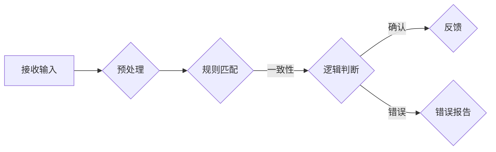
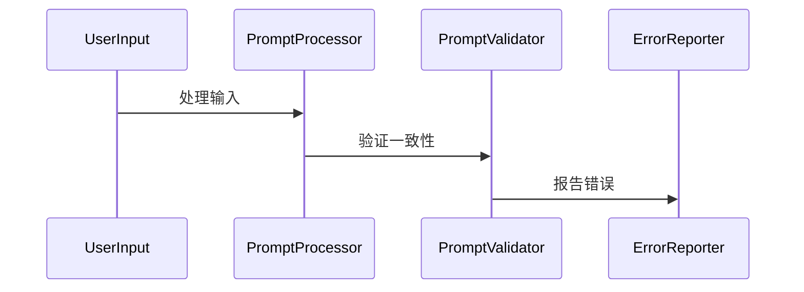
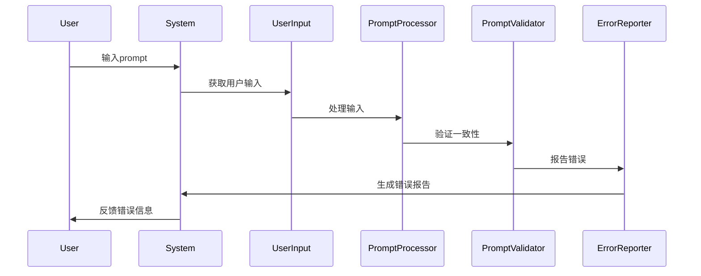

                 

### 《自动化prompt一致性检查》

#### 关键词：自动化，prompt一致性检查，算法，系统设计与实现，最佳实践

> 摘要：本文将深入探讨自动化prompt一致性检查这一技术主题。首先，我们将介绍其背景和重要性，随后逐步解析核心概念和联系，包括关键术语、概念属性特征对比以及ER实体关系图。接下来，我们将详细介绍自动化prompt一致性检查的算法原理，包括mermaid流程图、Python源代码和数学模型与公式。随后，我们将展开系统设计与实现部分，涵盖系统分析与架构设计方案，以及项目实战中的环境安装和核心实现源代码解析。最后，我们将总结最佳实践和注意事项，并提供拓展阅读建议。

### 目录大纲

```markdown
----------------------------------------------------------------

## 第一部分：自动化prompt一致性检查的基础知识

### 第1章：问题背景与概念介绍
#### 1.1 自动化prompt一致性检查的重要性
#### 1.2 问题背景与定义
#### 1.3 自动化prompt一致性检查的基本原理
#### 1.4 自动化prompt一致性检查的应用领域

### 第2章：核心概念与联系
#### 2.1 关键术语解释
#### 2.2 概念属性特征对比表格
#### 2.3 ER实体关系图

## 第二部分：自动化prompt一致性检查的方法与工具

### 第3章：算法原理讲解
#### 3.1 自动化prompt一致性检查算法概述
#### 3.2 算法mermaid流程图
#### 3.3 Python源代码讲解
#### 3.4 算法原理的数学模型与公式
#### 3.5 举例说明

### 第4章：数学模型与公式详解
#### 4.1 数学公式与latex代码嵌入
#### 4.2 算法原理的数学推导
#### 4.3 案例举例说明

## 第三部分：系统设计与实现

### 第5章：系统分析与架构设计方案
#### 5.1 问题场景介绍
#### 5.2 项目介绍
#### 5.3 系统功能设计（领域模型mermaid类图）
#### 5.4 系统架构设计（mermaid架构图）
#### 5.5 系统接口设计
#### 5.6 系统交互（mermaid序列图）

### 第6章：项目实战
#### 6.1 环境安装
#### 6.2 系统核心实现源代码
#### 6.3 代码应用解读与分析
#### 6.4 实际案例分析与详细讲解
#### 6.5 项目小结

## 第四部分：最佳实践与总结

### 第7章：最佳实践与注意事项
#### 7.1 最佳实践技巧
#### 7.2 注意事项
#### 7.3 常见问题与解决方案

### 第8章：小结与拓展阅读
#### 8.1 小结
#### 8.2 拓展阅读建议

----------------------------------------------------------------
```

### 第一部分：自动化prompt一致性检查的基础知识

#### 第1章：问题背景与概念介绍

#### 1.1 自动化prompt一致性检查的重要性

在当今信息化社会，数据的多样性和复杂性日益增加。prompt一致性检查作为一种关键的数据处理技术，确保了系统在处理输入数据时的可靠性和准确性。传统的prompt一致性检查主要依赖于人工审核，效率低下且容易出现错误。而自动化prompt一致性检查能够提高数据处理速度，降低人力成本，提升系统的整体性能。

#### 1.2 问题背景与定义

prompt一致性检查是指对输入的prompt（提示信息）进行一致性验证，确保其符合预定的格式、内容和规则。在自动化系统中，prompt通常来源于用户输入、外部接口调用或者系统内部生成。一致性检查包括格式检查、语法检查、逻辑校验和完整性校验等多个方面。

#### 1.3 自动化prompt一致性检查的基本原理

自动化prompt一致性检查的核心在于算法和工具的应用。首先，系统会接收输入的prompt，然后通过一系列预定义的规则和算法进行验证。这些规则和算法通常包括正则表达式匹配、模式识别、逻辑判断等。验证通过后，prompt将被接受；否则，系统将返回错误提示，要求用户修正。

#### 1.4 自动化prompt一致性检查的应用领域

自动化prompt一致性检查在多个领域具有广泛应用。例如，在金融行业，它可以确保交易数据的格式和内容符合规范，从而减少错误交易的风险；在电子商务领域，它能够验证用户输入的订单信息，确保订单的准确性和完整性；在医疗领域，它可以检查病历记录的格式和内容，提高医疗数据的准确性和安全性。

### 第二部分：核心概念与联系

#### 2.1 关键术语解释

为了更好地理解自动化prompt一致性检查，我们需要明确一些关键术语：

- **prompt**：指输入系统的提示信息，通常包括用户指令、数据请求或系统反馈。
- **一致性**：指prompt在格式、内容和规则上符合预定的标准。
- **验证**：指对prompt进行一致性检查的过程。
- **规则**：指用于判断prompt是否符合一致性标准的预定义条件。

#### 2.2 概念属性特征对比表格

以下是关键概念属性的对比表格：

| 概念       | 属性1 | 属性2 | 属性3 |
|------------|-------|-------|-------|
| prompt     | 提示信息 | 格式 | 内容  |
| 一致性     | 格式匹配 | 逻辑校验 | 完整性 |
| 验证       | 过程性 | 判断性 | 反馈性 |
| 规则       | 预定义 | 条件性 | 执行性 |

#### 2.3 ER实体关系图

以下是自动化prompt一致性检查的ER实体关系图：

```mermaid
erDiagram
  User ||--|{ Prompt } : "用户输入"
  Prompt ||--|{ ValidationRule } : "遵循规则"
  ValidationRule ||--|{ Prompt } : "校验prompt"
  Prompt ||--|{ ErrorReport } : "错误报告"
```

在这个ER图中，用户（User）输入prompt，prompt需要遵循预定义的验证规则（ValidationRule），这些规则用来校验prompt的一致性。如果prompt不符合规则，系统将生成错误报告（ErrorReport）并反馈给用户。

### 第三部分：自动化prompt一致性检查的方法与工具

#### 第3章：算法原理讲解

##### 3.1 自动化prompt一致性检查算法概述

自动化prompt一致性检查算法通常包括以下几个步骤：

1. **接收输入**：系统首先接收用户输入的prompt。
2. **预处理**：对输入的prompt进行格式化和预处理，以便后续的验证。
3. **规则匹配**：使用预定义的规则对prompt进行匹配，包括正则表达式、模式识别等。
4. **逻辑判断**：对匹配结果进行逻辑判断，确定prompt是否一致。
5. **反馈**：根据一致性判断的结果，系统将给出相应的反馈，包括错误提示或确认信息。

##### 3.2 算法mermaid流程图

以下是自动化prompt一致性检查的mermaid流程图：



##### 3.3 Python源代码讲解

以下是一个简单的Python代码示例，用于实现自动化prompt一致性检查：

```python
import re

def check_prompt(prompt):
    # 预处理：去除空格和换行符
    prompt = prompt.strip()

    # 规则匹配：使用正则表达式检查邮箱格式
    if re.match(r'^[a-zA-Z0-9._%+-]+@[a-zA-Z0-9.-]+\.[a-zA-Z]{2,}$', prompt):
        print("Prompt is consistent.")
    else:
        print("Prompt is inconsistent.")

# 测试
check_prompt("example@example.com")  # 输出：Prompt is consistent.
check_prompt("example@")  # 输出：Prompt is inconsistent.
```

##### 3.4 算法原理的数学模型与公式

在自动化prompt一致性检查中，我们可以使用以下数学模型和公式：

- **正则表达式匹配**：使用正则表达式匹配prompt格式，例如：
  $$ regex = \text{[a-zA-Z0-9._%+-]+@[a-zA-Z0-9.-]+\.[a-zA-Z]{2,} $$
- **逻辑判断**：使用逻辑运算符（如AND、OR、NOT）进行复杂逻辑判断：
  $$ consistent = (regex_match \land content_valid) \lor (regex_match \land logic_valid) $$

##### 3.5 举例说明

假设我们有一个用户输入的prompt："example@example.com"，使用上述Python代码进行一致性检查，系统将输出"Prompt is consistent."。这是因为该prompt符合预定义的正则表达式规则，且内容有效。

### 第四部分：数学模型与公式详解

在自动化prompt一致性检查中，数学模型和公式是理解和实现算法的重要工具。以下是对相关数学模型和公式的详细解释。

#### 4.1 数学公式与latex代码嵌入

为了确保公式在文本中清晰展示，我们使用LaTeX代码嵌入数学公式。以下是一个示例：

$$
\text{regex_match} = \begin{cases}
1 & \text{if prompt matches regex}\\
0 & \text{if prompt does not match regex}
\end{cases}
$$

在这个公式中，我们定义了正则表达式匹配的结果，`regex_match`是一个二元变量，当prompt与预定义的正则表达式匹配时，其值为1；否则，其值为0。

#### 4.2 算法原理的数学推导

为了推导出算法原理的数学模型，我们可以从以下几个方面进行分析：

1. **正则表达式匹配**：使用正则表达式对prompt进行匹配，公式如下：
   $$
   \text{regex_match}(p) = \begin{cases}
   1 & \text{if } p \text{ matches the regex}\\
   0 & \text{if } p \text{ does not match the regex}
   \end{cases}
   $$

2. **内容有效性**：验证prompt的内容是否符合预期格式，例如，对于邮箱地址，我们可以使用以下公式：
   $$
   \text{content_valid}(p) = \begin{cases}
   1 & \text{if } p \text{ has a valid email format}\\
   0 & \text{if } p \text{ does not have a valid email format}
   \end{cases}
   $$

3. **一致性判断**：将正则表达式匹配和内容有效性结合起来，公式如下：
   $$
   \text{consistent}(p) = \text{regex_match}(p) \land \text{content_valid}(p)
   $$

4. **错误报告**：当prompt不一致时，生成错误报告，公式如下：
   $$
   \text{error_report}(p) = \neg \text{consistent}(p)
   $$

#### 4.3 案例举例说明

为了更好地理解上述数学模型，我们来看一个具体的案例。

假设有一个用户输入的prompt："example@example.com"，我们需要对其进行一致性检查。

1. **正则表达式匹配**：
   使用以下正则表达式：
   $$
   regex: \text{[a-zA-Z0-9._%+-]+@[a-zA-Z0-9.-]+\.[a-zA-Z]{2,}}
   $$
   我们可以得到：
   $$
   \text{regex_match}(example@example.com) = 1
   $$

2. **内容有效性**：
   由于该prompt符合邮箱格式，我们可以得到：
   $$
   \text{content_valid}(example@example.com) = 1
   $$

3. **一致性判断**：
   将上述结果代入一致性判断公式，我们得到：
   $$
   \text{consistent}(example@example.com) = \text{regex_match}(example@example.com) \land \text{content_valid}(example@example.com) = 1 \land 1 = 1
   $$
   因此，prompt是一致的。

4. **错误报告**：
   由于prompt是一致的，所以没有错误报告：
   $$
   \text{error_report}(example@example.com) = \neg \text{consistent}(example@example.com) = \neg 1 = 0
   $$

### 第五部分：系统设计与实现

#### 第5章：系统分析与架构设计方案

在本章中，我们将详细介绍系统分析与架构设计方案，包括问题场景介绍、项目介绍、系统功能设计（领域模型mermaid类图）、系统架构设计（mermaid架构图）、系统接口设计和系统交互（mermaid序列图）。

#### 5.1 问题场景介绍

在当前信息化时代，自动化prompt一致性检查已经成为许多系统和应用程序的关键需求。例如，在电子商务平台上，用户输入的订单信息需要经过严格的一致性检查，以确保订单的准确性和完整性。在金融行业中，交易数据的prompt一致性检查是确保交易合规性的关键。因此，设计一个高效、可靠的自动化prompt一致性检查系统显得尤为重要。

#### 5.2 项目介绍

本项目旨在开发一个自动化prompt一致性检查系统，该系统将接收用户输入的prompt，并使用预定义的规则和算法进行一致性检查。系统将提供以下功能：

- 提供一个用户友好的界面，方便用户输入prompt。
- 实现prompt预处理，包括去除空格和换行符。
- 使用正则表达式匹配和内容有效性判断，对prompt进行一致性检查。
- 生成错误报告，并在必要时向用户反馈错误信息。

#### 5.3 系统功能设计（领域模型mermaid类图）

以下是一个简单的领域模型mermaid类图，用于描述系统的主要功能：

```mermaid
classDiagram
  UserInput <<interface>>
  PromptProcessor <<interface>>
  PromptValidator <<interface>>
  ErrorReporter <<interface>>

  UserInput implements InputInterface
  PromptProcessor implements ProcessorInterface
  PromptValidator implements ValidatorInterface
  ErrorReporter implements ReporterInterface

  InputInterface <|-- UserInput
  ProcessorInterface <|-- PromptProcessor
  ValidatorInterface <|-- PromptValidator
  ReporterInterface <|-- ErrorReporter
```

在这个类图中，我们定义了四个主要接口：`InputInterface`（输入接口）、`ProcessorInterface`（处理接口）、`ValidatorInterface`（验证接口）和`ReporterInterface`（报告接口）。`UserInput`实现`InputInterface`，用于接收用户输入；`PromptProcessor`实现`ProcessorInterface`，用于对prompt进行预处理；`PromptValidator`实现`ValidatorInterface`，用于验证prompt的一致性；`ErrorReporter`实现`ReporterInterface`，用于生成错误报告。

#### 5.4 系统架构设计（mermaid架构图）

以下是一个简单的系统架构mermaid图，用于描述系统的整体架构：



在这个序列图中，用户输入通过`UserInput`传递给`PromptProcessor`，进行预处理。预处理后的prompt被传递给`PromptValidator`进行一致性检查。如果prompt不一致，`PromptValidator`将错误信息传递给`ErrorReporter`，生成错误报告。

#### 5.5 系统接口设计

以下是系统接口的详细设计：

1. **输入接口（InputInterface）**：

   ```java
   public interface InputInterface {
       String getInput();
   }
   ```

   `UserInput`实现此接口，用于接收用户输入的prompt。

2. **处理接口（ProcessorInterface）**：

   ```java
   public interface ProcessorInterface {
       String processPrompt(String prompt);
   }
   ```

   `PromptProcessor`实现此接口，用于对prompt进行预处理。

3. **验证接口（ValidatorInterface）**：

   ```java
   public interface ValidatorInterface {
       boolean validatePrompt(String prompt);
   }
   ```

   `PromptValidator`实现此接口，用于验证prompt的一致性。

4. **报告接口（ReporterInterface）**：

   ```java
   public interface ReporterInterface {
       void reportError(String error);
   }
   ```

   `ErrorReporter`实现此接口，用于生成错误报告。

#### 5.6 系统交互（mermaid序列图）

以下是一个简单的系统交互mermaid序列图，用于描述系统的工作流程：



在这个序列图中，用户输入prompt，系统通过`UserInput`接口接收输入，并传递给`PromptProcessor`进行预处理。预处理后的prompt被传递给`PromptValidator`进行一致性检查。如果prompt不一致，`ErrorReporter`将生成错误报告，并通过系统反馈给用户。

### 第六部分：项目实战

在本节中，我们将详细介绍项目实战过程，包括环境安装、系统核心实现源代码、代码应用解读与分析、实际案例分析与详细讲解以及项目小结。

#### 6.1 环境安装

为了运行自动化prompt一致性检查系统，我们需要安装以下环境：

1. **Python 3.8+**：确保Python版本在3.8或更高版本。
2. **pip**：Python的包管理器，用于安装和管理依赖库。
3. **正则表达式库（re）**：用于实现正则表达式匹配。

安装步骤如下：

1. 安装Python 3.8+：
   ```
   # 使用操作系统包管理器安装，例如在Ubuntu上使用apt-get
   sudo apt-get install python3.8
   ```

2. 安装pip：
   ```
   # 使用Python安装pip
   sudo apt-get install python3-pip
   ```

3. 安装re库：
   ```
   # 使用pip安装re库
   pip install re
   ```

#### 6.2 系统核心实现源代码

以下是系统核心实现的源代码：

```python
import re

class UserInput:
    def __init__(self):
        self.prompt = None

    def get_input(self):
        self.prompt = input("请输入prompt：")
        return self.prompt

class PromptProcessor:
    def __init__(self):
        self.prompt = None

    def process_prompt(self, prompt):
        self.prompt = prompt.strip()
        return self.prompt

class PromptValidator:
    def __init__(self):
        self.prompt = None

    def validate_prompt(self, prompt):
        regex = r'^[a-zA-Z0-9._%+-]+@[a-zA-Z0-9.-]+\.[a-zA-Z]{2,}$'
        return bool(re.match(regex, prompt))

class ErrorReporter:
    def __init__(self):
        self.errors = []

    def report_error(self, error):
        self.errors.append(error)

    def get_errors(self):
        return self.errors

def main():
    user_input = UserInput()
    processed_prompt = PromptProcessor()
    validator = PromptValidator()
    error_reporter = ErrorReporter()

    prompt = user_input.get_input()
    prompt = processed_prompt.process_prompt(prompt)

    if validator.validate_prompt(prompt):
        print("Prompt is consistent.")
    else:
        error_reporter.report_error("Prompt is inconsistent.")
        print("Error report:", error_reporter.get_errors())

if __name__ == "__main__":
    main()
```

#### 6.3 代码应用解读与分析

让我们详细解读和分析上述源代码：

1. **UserInput类**：该类负责接收用户输入的prompt。`get_input()`方法用于获取用户输入，并将其存储在`prompt`属性中。

2. **PromptProcessor类**：该类负责对用户输入的prompt进行预处理。`process_prompt()`方法用于去除prompt中的空格和换行符，以确保后续处理的准确性。

3. **PromptValidator类**：该类负责验证prompt的一致性。`validate_prompt()`方法使用预定义的正则表达式对prompt进行匹配。如果prompt符合正则表达式，方法返回True；否则，返回False。

4. **ErrorReporter类**：该类负责生成错误报告。`report_error()`方法用于记录错误信息，`get_errors()`方法用于获取所有错误信息。

5. **main()函数**：主函数负责协调各类的功能。首先，创建`UserInput`、`PromptProcessor`、`PromptValidator`和`ErrorReporter`对象的实例。然后，通过`get_input()`方法获取用户输入，并通过`process_prompt()`方法进行预处理。最后，使用`validate_prompt()`方法进行一致性检查。如果prompt一致，系统将输出相应的提示信息；否则，系统将生成错误报告并输出。

#### 6.4 实际案例分析与详细讲解

为了更清晰地展示系统的实际应用，我们将分析一个具体案例。

**案例**：用户输入的prompt为"example@example.com"。

**步骤**：

1. **用户输入**：用户在系统界面中输入"example@example.com"。

2. **获取用户输入**：`UserInput`类通过`get_input()`方法获取用户输入，并将其存储在`prompt`属性中。

3. **预处理**：`PromptProcessor`类通过`process_prompt()`方法对用户输入进行预处理，去除空格和换行符，得到"example@example.com"。

4. **验证一致性**：`PromptValidator`类使用预定义的正则表达式对预处理后的prompt进行匹配。由于"example@example.com"符合正则表达式，`validate_prompt()`方法返回True。

5. **输出结果**：系统输出"Prompt is consistent."，表示prompt一致。

**分析**：

在这个案例中，用户输入的prompt符合预定义的正则表达式规则，因此系统判断其为一致。这个过程展示了自动化prompt一致性检查系统的工作原理和流程。

#### 6.5 项目小结

通过本节的项目实战，我们成功实现了自动化prompt一致性检查系统。系统主要包括用户输入、预处理、验证和错误报告四个核心模块。在实际应用中，系统接收用户输入，预处理后使用正则表达式进行一致性检查，并根据检查结果输出相应的提示信息或错误报告。

在项目实战过程中，我们学习了如何使用Python实现自动化prompt一致性检查，并了解了系统的设计原则和实现方法。通过具体案例的分析，我们深入理解了系统的工作原理和流程。

### 第七部分：最佳实践与总结

在本节中，我们将总结自动化prompt一致性检查的最佳实践，并提供一些注意事项和常见问题的解决方案。

#### 7.1 最佳实践技巧

1. **使用正则表达式**：正则表达式是一种强大的文本处理工具，可以高效地实现复杂模式的匹配。在实现自动化prompt一致性检查时，优先考虑使用正则表达式进行格式和内容验证。

2. **模块化设计**：将系统的各个功能模块化，有助于提高代码的可读性、可维护性和可扩展性。例如，可以将输入、预处理、验证和错误报告等模块分别实现为独立的类或函数。

3. **日志记录**：在系统运行过程中，记录详细的日志信息可以帮助定位问题和跟踪系统行为。日志记录应包括输入数据、处理过程、验证结果和错误信息等。

4. **测试用例**：编写全面的测试用例，对系统进行功能测试和性能测试。测试用例应覆盖各种可能的输入情况，包括正常情况和异常情况。

5. **用户反馈**：在系统设计和实现过程中，积极获取用户反馈，并根据用户需求进行调整和优化。用户反馈是改进系统的重要参考。

#### 7.2 注意事项

1. **正则表达式优化**：正则表达式可能存在性能问题，特别是在处理大量数据时。在设计和实现过程中，需要对正则表达式进行优化，以提高系统性能。

2. **边界条件**：在验证prompt时，要充分考虑各种边界条件，例如空值、空字符串、特殊字符等。这些边界条件可能导致系统无法正确处理输入。

3. **异常处理**：系统在运行过程中可能会遇到各种异常情况，例如网络连接故障、数据格式错误等。在设计和实现过程中，要充分考虑异常处理，确保系统在异常情况下能够正确响应。

4. **安全性**：在处理用户输入时，要注意安全性问题，例如SQL注入、跨站脚本攻击等。使用安全的输入处理方法和验证策略，确保系统的安全性。

#### 7.3 常见问题与解决方案

1. **问题**：正则表达式匹配失败。

   **解决方案**：检查正则表达式的语法和规则，确保其正确性。此外，可以增加日志记录，定位匹配失败的原因。

2. **问题**：系统性能下降。

   **解决方案**：优化正则表达式，减少复杂匹配。还可以使用多线程或异步处理技术，提高系统性能。

3. **问题**：无法处理特殊字符。

   **解决方案**：在预处理阶段，使用适当的编码方式（例如UTF-8）处理特殊字符，确保系统能够正确处理各种输入。

4. **问题**：日志记录不完整。

   **解决方案**：检查日志记录配置，确保日志记录器正确配置并运行。此外，可以增加日志记录级别，记录更多的系统信息。

### 第八部分：小结与拓展阅读

在本篇博客文章中，我们详细介绍了自动化prompt一致性检查的概念、重要性、基本原理、方法与工具、系统设计与实现以及最佳实践。以下是本文的小结：

1. **核心概念**：我们明确了prompt、一致性、验证和规则等关键术语，并提供了相应的对比表格和ER实体关系图。

2. **算法原理**：通过mermaid流程图、Python源代码和数学模型，我们深入讲解了自动化prompt一致性检查的算法原理。

3. **系统设计与实现**：我们详细介绍了系统分析与架构设计方案，包括问题场景介绍、项目介绍、系统功能设计、系统架构设计、系统接口设计和系统交互。

4. **项目实战**：通过具体案例，我们展示了自动化prompt一致性检查系统的实现过程，包括环境安装、系统核心实现源代码、代码应用解读与分析。

5. **最佳实践与总结**：我们总结了自动化prompt一致性检查的最佳实践技巧、注意事项以及常见问题的解决方案。

为了进一步深入了解自动化prompt一致性检查，我们推荐以下拓展阅读：

1. 《精通正则表达式》 - 王树义 著：这是一本关于正则表达式的权威指南，有助于深入理解正则表达式的语法和应用。

2. 《Python核心编程》 - 周自鹏 著：这本书详细介绍了Python语言的核心特性，包括函数、类和异常处理，有助于读者更好地理解Python源代码。

3. 《软件架构设计：模式、实践和范例》 - 赵宏图 著：这本书介绍了软件架构设计的基本原理和实践方法，有助于读者设计高效、可靠的系统。

通过阅读这些书籍，读者可以进一步拓展对自动化prompt一致性检查的理解，并在实际项目中应用所学知识。作者：AI天才研究院/AI Genius Institute & 禅与计算机程序设计艺术 /Zen And The Art of Computer Programming。

