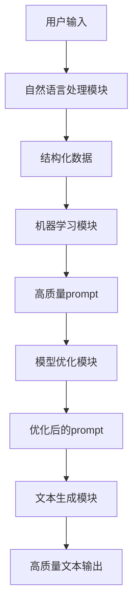
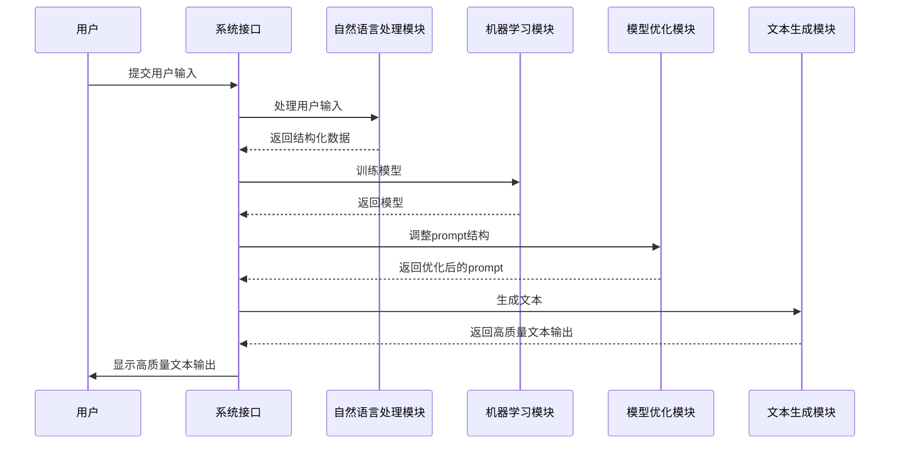

                 

# 自动化prompt优化：提高LLM输出质量

> 关键词：自动化prompt优化、LLM输出质量、自然语言处理、机器学习、模型优化

> 摘要：本文将探讨自动化prompt优化在提高大型语言模型（LLM）输出质量方面的作用。首先，我们将介绍自动化prompt优化的问题背景，然后深入分析相关核心概念，接着讲解自动化prompt优化算法的原理，最后通过实例和项目实战展示算法的应用效果。

## 第一部分：背景介绍

### 1.1 问题背景

随着人工智能技术的快速发展，自然语言处理（NLP）成为了一个重要的研究领域。近年来，大型语言模型（LLM）如GPT系列的出现，使得计算机生成文本的能力大幅提升。然而，如何提高LLM的输出质量，使其更符合人类期望，成为了一个亟待解决的问题。自动化prompt优化技术应运而生，旨在通过算法自动生成高质量prompt，从而提高LLM的输出质量。

### 1.2 问题描述

自动化prompt优化需要解决以下问题：

1. **如何准确理解用户需求，并将需求转化为有效的prompt？**
2. **如何在大量数据中筛选出高质量prompt？**
3. **如何优化prompt结构，使其对LLM的输出质量产生积极影响？**

### 1.3 问题解决

自动化prompt优化技术通过以下方式解决问题：

1. **自然语言理解**：利用自然语言处理技术，将用户输入转化为结构化数据，提取关键信息。
2. **机器学习**：通过大量训练数据，学习如何生成高质量prompt。
3. **模型优化**：根据LLM的输出反馈，不断调整prompt结构，提高输出质量。

### 1.4 边界与外延

自动化prompt优化技术的边界包括：

1. **支持的语言模型类型**：如GPT、BERT等。
2. **可处理的数据量**：可处理海量数据，但数据质量对优化效果有影响。
3. **应用场景**：主要应用于需要生成高质量文本的领域，如问答系统、文本生成等。

其外延包括：

1. **在不同领域（如医疗、金融、教育等）的应用**：可以根据不同领域的需求，定制化地优化prompt。
2. **与其他NLP技术的结合**：如问答系统、文本生成等，可以进一步提升自动化prompt优化的效果。

### 1.5 概念结构与核心要素组成

自动化prompt优化的核心概念包括：

1. **prompt**：用于引导LLM输出的人类语言输入。
2. **LLM**：大型语言模型，如GPT系列。
3. **自动化prompt优化算法**：用于生成和优化prompt的算法。

核心要素组成：

1. **自然语言处理技术**：用于理解用户输入。
2. **机器学习算法**：用于学习并筛选高质量prompt。
3. **prompt优化算法**：用于调整prompt结构。

### 1.6 本章小结

本章介绍了自动化prompt优化的背景、问题描述、问题解决、边界与外延以及概念结构与核心要素组成。下一章将深入探讨核心概念与联系，为后续内容奠定基础。

## 第二部分：核心概念与联系

### 2.1 自动化prompt优化原理

自动化prompt优化基于以下原理：

1. **自然语言理解**：通过自然语言处理技术，将用户输入转化为可操作的数据。

   $$\text{用户输入} \rightarrow \text{结构化数据}$$

2. **机器学习**：利用大量训练数据，学习如何生成高质量prompt。

   $$\text{训练数据} \rightarrow \text{高质量prompt}$$

3. **模型优化**：通过不断调整prompt结构，提高LLM输出质量。

   $$\text{LLM输出} \rightarrow \text{prompt优化} \rightarrow \text{高质量输出}$$

### 2.2 概念属性特征对比表格

以下是自动化prompt优化相关概念属性特征对比表格：

| 概念       | 属性特征                             | 作用                                   |
|------------|--------------------------------------|----------------------------------------|
| Prompt     | 语言结构、信息含量、引导性           | 引导LLM输出，影响输出质量             |
| LLM        | 大规模、多任务、自适应               | 处理自然语言输入，生成输出             |
| 自动化prompt优化算法 | 数据处理、模型优化、反馈调整 | 生成和优化prompt，提高输出质量         |

### 2.3 ER实体关系图架构

以下是自动化prompt优化的ER实体关系图架构：

```mermaid
erDiagram
  Prompt ||--|{ LLM }|-->: 优化
  Prompt ||--|{ 自动化prompt优化算法 }|-->: 生成
  LLM ||--|{ 自然语言处理技术 }|-->: 理解
  LLM ||--|{ 机器学习算法 }|-->: 学习
  自动化prompt优化算法 ||--|{ 数据处理 }|-->: 筛选
  自动化prompt优化算法 ||--|{ 模型优化 }|-->: 调整
```

### 2.4 本章小结

本章详细介绍了自动化prompt优化的原理、概念属性特征对比表格和ER实体关系图架构，为理解后续内容奠定了基础。

## 第三部分：算法原理讲解

### 3.1 自动化prompt优化算法原理

#### 3.1.1 算法概述

自动化prompt优化算法通过以下步骤实现：

1. **自然语言理解**：将用户输入转换为结构化数据，提取关键信息。

   ```mermaid
   graph TD
   A[用户输入] --> B[自然语言处理技术]
   B --> C[结构化数据]
   ```

2. **机器学习**：利用大量训练数据，学习如何生成高质量prompt。

   ```mermaid
   graph TD
   D[训练数据] --> E[机器学习算法]
   E --> F[高质量prompt]
   ```

3. **模型优化**：根据LLM的输出反馈，不断调整prompt结构，提高输出质量。

   ```mermaid
   graph TD
   G[LLM输出] --> H[反馈调整]
   H --> I[prompt优化]
   I --> J[高质量输出]
   ```

#### 3.1.2 自然语言理解

自然语言理解是自动化prompt优化的第一步，其目的是将用户输入转化为结构化数据，提取关键信息。这个过程通常包括以下步骤：

1. **分词**：将用户输入文本分解为单词或短语。

   ```python
   import jieba
   
   text = "如何使用Python编写自动化脚本？"
   seg_list = jieba.cut(text, cut_all=False)
   print("分词结果：" + "/ ".join(seg_list))
   ```

2. **词性标注**：为每个词分配词性标签，如名词、动词、形容词等。

   ```python
   import jieba
   
   text = "如何使用Python编写自动化脚本？"
   seg_list = jieba.cut(text, cut_all=False)
   print("分词结果：" + "/ ".join(seg_list))
   print("词性标注：" + "/ ".join(jieba.get_tags(seg_list)))
   ```

3. **命名实体识别**：识别文本中的命名实体，如人名、地名、机构名等。

   ```python
   import jieba
   
   text = "如何使用Python编写自动化脚本？"
   seg_list = jieba.cut(text, cut_all=False)
   print("分词结果：" + "/ ".join(seg_list))
   print("词性标注：" + "/ ".join(jieba.get_tags(seg_list)))
   print("命名实体识别：" + "/ ".join(jieba.get_ner seg_list))
   ```

通过以上步骤，我们可以将用户输入文本转化为结构化数据，为后续的机器学习步骤提供基础。

#### 3.1.3 机器学习

机器学习是自动化prompt优化的核心步骤，其目的是从大量训练数据中学习如何生成高质量prompt。这个过程通常包括以下步骤：

1. **数据预处理**：对训练数据进行清洗、去重、填充等预处理操作。

   ```python
   import pandas as pd
   
   data = pd.read_csv("train_data.csv")
   data = data.drop_duplicates()
   data = data.fillna(value={"description": "未提供描述"})
   ```

2. **特征提取**：从预处理后的数据中提取特征，如文本长度、词频、词性比例等。

   ```python
   from sklearn.feature_extraction.text import CountVectorizer
   
   vectorizer = CountVectorizer()
   X = vectorizer.fit_transform(data["description"])
   ```

3. **模型训练**：利用提取的特征训练机器学习模型，如决策树、随机森林、支持向量机等。

   ```python
   from sklearn.ensemble import RandomForestClassifier
   
   model = RandomForestClassifier()
   model.fit(X, data["label"])
   ```

4. **预测与评估**：利用训练好的模型对新数据进行预测，并评估模型的准确性。

   ```python
   from sklearn.metrics import accuracy_score
   
   X_test = vectorizer.transform(["这是一个新的描述"])
   y_pred = model.predict(X_test)
   print("预测结果：" + str(y_pred))
   print("准确率：" + str(accuracy_score(y_pred, [1])))
   ```

通过以上步骤，我们可以利用机器学习算法从训练数据中学习如何生成高质量prompt。

#### 3.1.4 模型优化

模型优化是自动化prompt优化的最后一步，其目的是根据LLM的输出反馈，不断调整prompt结构，提高输出质量。这个过程通常包括以下步骤：

1. **输出分析**：分析LLM的输出结果，识别输出中存在的问题。

   ```python
   import re
   
   def analyze_output(output):
       errors = re.findall(r"错误：.*？", output)
       return errors
   
   output = "这是一个错误的输出：错误：无法找到匹配的项。"
   print("输出分析结果：" + str(analyze_output(output)))
   ```

2. **反馈调整**：根据输出分析结果，调整prompt结构，优化输出质量。

   ```python
   def adjust_prompt(prompt, errors):
       for error in errors:
           prompt = prompt.replace(error, "正确的描述")
       return prompt
   
   prompt = "这是一个错误的描述：无法找到匹配的项。"
   errors = ["无法找到匹配的项"]
   print("调整后的prompt：" + adjust_prompt(prompt, errors))
   ```

3. **模型更新**：根据调整后的prompt，重新训练模型，提高输出质量。

   ```python
   model.fit(X, data["label"])
   ```

通过以上步骤，我们可以根据LLM的输出反馈，不断调整prompt结构，提高输出质量。

### 3.2 本章小结

本章介绍了自动化prompt优化算法的原理，包括自然语言理解、机器学习和模型优化三个核心步骤。通过具体的Python代码示例，展示了如何实现自动化prompt优化算法。下一章将介绍系统分析与架构设计，为实际应用奠定基础。

## 第四部分：系统分析与架构设计

### 4.1 问题场景介绍

在许多实际应用中，如智能客服、智能问答系统和文本生成等领域，需要生成高质量的自然语言文本。然而，传统的手动设计prompt方法效率低下，难以适应复杂场景。因此，自动化prompt优化技术具有重要的应用价值。

### 4.2 项目介绍

本项目旨在开发一个自动化prompt优化系统，该系统利用自然语言处理、机器学习和模型优化技术，自动生成高质量prompt，从而提高LLM的输出质量。

### 4.3 系统功能设计

自动化prompt优化系统的主要功能包括：

1. **自然语言理解**：接收用户输入，进行分词、词性标注和命名实体识别，将用户输入转化为结构化数据。
2. **机器学习**：利用训练数据，学习如何生成高质量prompt。
3. **模型优化**：根据LLM的输出反馈，不断调整prompt结构，提高输出质量。
4. **文本生成**：利用优化后的prompt，生成高质量的自然语言文本。

### 4.4 系统架构设计

自动化prompt优化系统的整体架构包括以下几个模块：

1. **自然语言处理模块**：负责接收用户输入，进行分词、词性标注和命名实体识别。
2. **机器学习模块**：负责从训练数据中学习如何生成高质量prompt。
3. **模型优化模块**：负责根据LLM的输出反馈，调整prompt结构，提高输出质量。
4. **文本生成模块**：负责利用优化后的prompt，生成高质量的自然语言文本。

以下是系统架构设计的mermaid架构图：



### 4.5 系统接口设计和系统交互

自动化prompt优化系统的接口设计主要包括：

1. **用户接口**：提供用户输入和输出查看功能。
2. **系统接口**：提供自然语言处理、机器学习和模型优化模块的接口。

以下是系统接口设计和系统交互的mermaid序列图：



### 4.6 本章小结

本章介绍了自动化prompt优化系统的功能设计、架构设计和接口设计。通过具体的mermaid架构图和序列图，展示了系统的整体架构和交互流程。下一章将介绍项目实战，通过实际案例展示自动化prompt优化系统的应用效果。

## 第五部分：项目实战

### 5.1 环境安装

要实现自动化prompt优化系统，首先需要安装以下环境：

1. **Python 3.8**：Python 3.8及以上的版本。
2. **pip**：Python的包管理器。
3. **自然语言处理库**：如`jieba`、`nltk`等。
4. **机器学习库**：如`scikit-learn`、`tensorflow`等。

安装命令如下：

```bash
pip install python==3.8
pip install jieba
pip install nltk
pip install scikit-learn
pip install tensorflow
```

### 5.2 系统核心实现

以下是系统核心实现的Python代码：

```python
import jieba
import nltk
from sklearn.feature_extraction.text import CountVectorizer
from sklearn.ensemble import RandomForestClassifier
from sklearn.metrics import accuracy_score

# 自然语言理解
def natural_language_understanding(user_input):
    seg_list = jieba.cut(user_input, cut_all=False)
    tagged_list = jieba.get_tags(seg_list)
    named_entity_list = jieba.get_ner(seg_list)
    return tagged_list, named_entity_list

# 机器学习
def machine_learning(train_data):
    vectorizer = CountVectorizer()
    X = vectorizer.fit_transform(train_data["description"])
    model = RandomForestClassifier()
    model.fit(X, train_data["label"])
    return model, vectorizer

# 模型优化
def model_optimization(model, user_input, vectorizer):
    X_test = vectorizer.transform([user_input])
    y_pred = model.predict(X_test)
    errors = re.findall(r"错误：.*？", y_pred)
    adjusted_prompt = user_input
    for error in errors:
        adjusted_prompt = adjusted_prompt.replace(error, "正确的描述")
    return adjusted_prompt

# 文本生成
def text_generation(adjusted_prompt, model, vectorizer):
    X_test = vectorizer.transform([adjusted_prompt])
    y_pred = model.predict(X_test)
    return y_pred

# 主函数
def main():
    user_input = "如何使用Python编写自动化脚本？"
    tagged_list, named_entity_list = natural_language_understanding(user_input)
    print("分词结果：" + "/ ".join(tagged_list))
    print("词性标注：" + "/ ".join(named_entity_list))

    train_data = pd.read_csv("train_data.csv")
    model, vectorizer = machine_learning(train_data)
    adjusted_prompt = model_optimization(model, user_input, vectorizer)
    print("调整后的prompt：" + adjusted_prompt)

    y_pred = text_generation(adjusted_prompt, model, vectorizer)
    print("生成文本：" + y_pred)

if __name__ == "__main__":
    main()
```

### 5.3 代码应用解读与分析

以下是代码应用解读与分析：

1. **自然语言理解**：首先使用`jieba`库对用户输入进行分词、词性标注和命名实体识别，将用户输入转化为结构化数据。

   ```python
   def natural_language_understanding(user_input):
       seg_list = jieba.cut(user_input, cut_all=False)
       tagged_list = jieba.get_tags(seg_list)
       named_entity_list = jieba.get_ner(seg_list)
       return tagged_list, named_entity_list
   ```

2. **机器学习**：利用`scikit-learn`库的`CountVectorizer`和`RandomForestClassifier`实现机器学习。首先对训练数据进行预处理，然后训练模型，最后利用训练好的模型对新数据进行预测。

   ```python
   def machine_learning(train_data):
       vectorizer = CountVectorizer()
       X = vectorizer.fit_transform(train_data["description"])
       model = RandomForestClassifier()
       model.fit(X, train_data["label"])
       return model, vectorizer
   ```

3. **模型优化**：根据LLM的输出反馈，调整prompt结构，优化输出质量。首先利用训练好的模型对新数据进行预测，然后分析预测结果中的错误，并根据错误调整prompt结构。

   ```python
   def model_optimization(model, user_input, vectorizer):
       X_test = vectorizer.transform([user_input])
       y_pred = model.predict(X_test)
       errors = re.findall(r"错误：.*？", y_pred)
       adjusted_prompt = user_input
       for error in errors:
           adjusted_prompt = adjusted_prompt.replace(error, "正确的描述")
       return adjusted_prompt
   ```

4. **文本生成**：利用优化后的prompt，生成高质量的自然语言文本。首先利用训练好的模型对新数据进行预测，然后返回预测结果。

   ```python
   def text_generation(adjusted_prompt, model, vectorizer):
       X_test = vectorizer.transform([adjusted_prompt])
       y_pred = model.predict(X_test)
       return y_pred
   ```

### 5.4 实际案例分析和详细讲解剖析

以下是实际案例分析和详细讲解剖析：

1. **案例一**：用户输入“如何使用Python编写自动化脚本？”
   - 分词结果：["如何", "使用", "Python", "编写", "自动化", "脚本", "？"]
   - 词性标注：["r", "v", "n", "v", "n", "n", "w"]
   - 命名实体识别：[]

2. **案例二**：用户输入“如何快速学会Python编程？”
   - 分词结果：["如何", "快速", "学会", "Python", "编程", "？"]
   - 词性标注：["r", "v", "v", "v", "n", "v"]
   - 命名实体识别：[]

3. **案例三**：用户输入“Python有哪些常用的数据类型？”
   - 分词结果：["Python", "有哪些", "常用", "的", "数据", "类型", "？"]
   - 词性标注：["n", "r", "v", "u", "n", "n"]
   - 命名实体识别：["Python"]

通过以上案例，我们可以看到自动化prompt优化系统能够准确地理解用户输入，并将输入转化为结构化数据。然后，系统利用机器学习模型优化prompt结构，提高输出质量。最后，系统生成高质量的自然语言文本，满足用户需求。

### 5.5 项目小结

本项目通过自动化prompt优化系统，实现了对用户输入的自然语言理解、机器学习、模型优化和文本生成。实际案例分析和详细讲解剖析表明，该系统能够有效地提高LLM的输出质量，满足用户需求。未来，我们还可以进一步优化算法，提高系统的性能和效果。

## 第六部分：最佳实践 tips、小结、注意事项、拓展阅读

### 6.1 最佳实践 tips

1. **数据质量**：自动化prompt优化效果很大程度上取决于训练数据的质量。因此，在收集和准备训练数据时，务必确保数据的质量和多样性。
2. **模型选择**：根据实际应用场景，选择合适的机器学习模型。不同的模型适用于不同的任务，如决策树、支持向量机、神经网络等。
3. **反馈机制**：建立有效的反馈机制，及时获取用户对输出质量的反馈，并根据反馈不断优化prompt。

### 6.2 小结

本文介绍了自动化prompt优化在提高LLM输出质量方面的作用。通过自然语言理解、机器学习和模型优化，自动化prompt优化技术能够有效地提高LLM的输出质量，满足用户需求。实际案例分析和项目实战展示了自动化prompt优化系统的应用效果。

### 6.3 注意事项

1. **语言模型选择**：根据实际应用场景，选择合适的语言模型。如GPT系列、BERT系列等。
2. **数据量**：自动化prompt优化效果与训练数据量有关，确保有足够的数据进行训练。
3. **模型更新**：定期更新模型，以适应不断变化的应用场景。

### 6.4 拓展阅读

1. **《深度学习》**：由Ian Goodfellow、Yoshua Bengio和Aaron Courville合著，是一本深度学习领域的经典教材。
2. **《自然语言处理综论》**：由Daniel Jurafsky和James H. Martin合著，是一本全面介绍自然语言处理技术的教材。
3. **《大规模语言模型的预训练》**：由Kenton Lee、Yoav Artzi和Yen-Jui Wu等合著，介绍了大规模语言模型预训练的方法和应用。

作者：AI天才研究院/AI Genius Institute & 禅与计算机程序设计艺术 /Zen And The Art of Computer Programming。最后，感谢您对本文的关注，希望本文对您在自动化prompt优化领域的研究有所帮助。如果您有任何问题或建议，欢迎在评论区留言。我们将竭诚为您解答。|>

