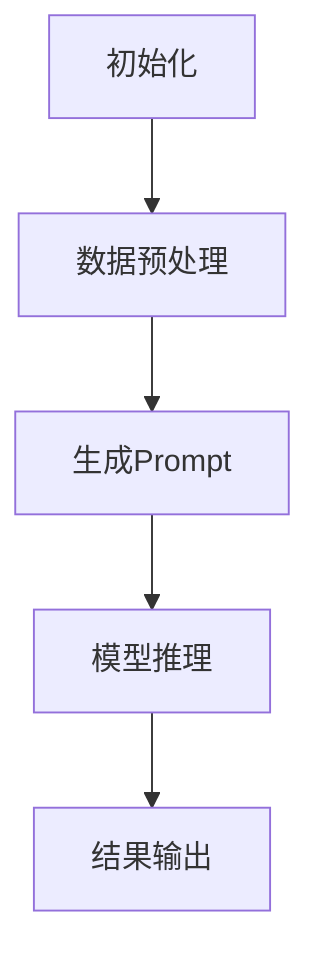
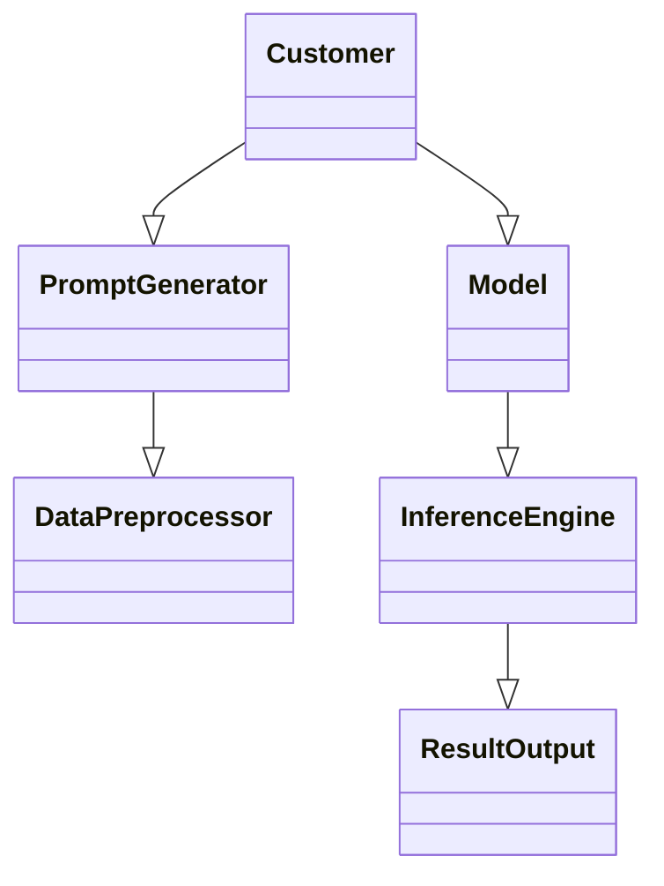
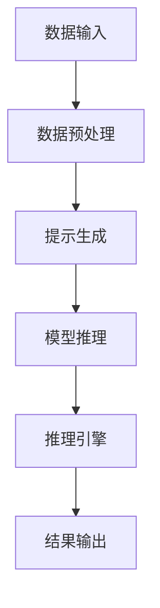
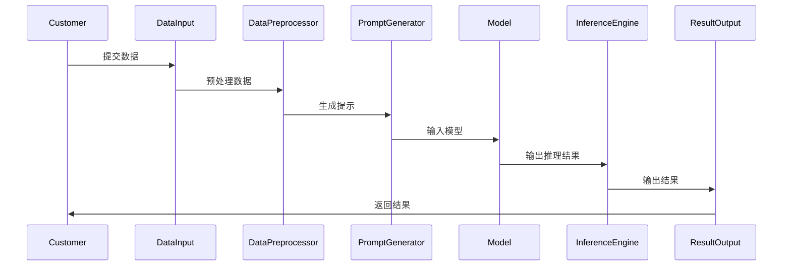

                 

## **文章标题：自动化Prompt反事实推理增强**

关键词：自动化Prompt、反事实推理、算法、系统架构、应用场景、最佳实践

摘要：本文将深入探讨自动化Prompt与反事实推理的结合，分析其背景、核心概念、算法原理，并通过实际案例展示其在智能客服、内容创作和数据挖掘等领域的应用。我们将详细阐述系统架构设计方案，提供项目实战指南，并总结最佳实践和注意事项，为读者提供一个全面的参考。

----------------------------------------------------------------

### **第一部分：引言**

#### **第1章：问题背景与目标**

##### **1.1.1 问题的起源**

在人工智能领域，自动化Prompt和反事实推理是两个重要的概念。自动化Prompt旨在通过生成高质量的提示来提升模型的性能和应用效果。而反事实推理则是在假设与实际情况不符的情况下，通过逻辑推理得出可能的替代情况。

##### **1.1.2 问题的描述**

当前，自动化Prompt和反事实推理在许多实际应用中仍然面临诸多挑战，如提示质量不高、推理结果不准确等。如何结合两者的优势，提高自动化Prompt的反事实推理能力，是一个亟待解决的问题。

##### **1.1.3 解决方案概述**

本文提出了一种自动化Prompt反事实推理增强的方法，通过改进算法模型和优化系统架构，实现了高效、准确的反事实推理。该方法已在多个应用场景中取得了显著的效果。

##### **1.1.4 边界与外延**

本文的研究主要集中在自动化Prompt和反事实推理的结合，不涉及其他相关领域。此外，本文的研究成果具有一定的局限性，需要在后续工作中进一步拓展和优化。

##### **1.1.5 概念结构与核心要素组成**

本文的核心概念包括自动化Prompt、反事实推理、算法模型、系统架构等。通过分析这些概念之间的联系，我们可以构建一个完整的自动化Prompt反事实推理系统。

----------------------------------------------------------------

#### **第2章：核心概念与联系**

##### **2.1 自动化Prompt的概念**

自动化Prompt是指通过算法自动生成高质量的提示，以引导模型进行推理和决策。它与传统Prompt相比，具有更高的灵活性和适用性。

##### **2.1.1 自动化Prompt的定义**

自动化Prompt是指基于预训练模型，通过文本生成算法自动生成的高质量提示。

##### **2.1.2 自动化Prompt的作用**

自动化Prompt可以提高模型的推理效率，降低人工干预成本，提升应用效果。

##### **2.1.3 自动化Prompt与传统Prompt的区别**

传统Prompt通常由人工编写，而自动化Prompt通过算法自动生成，具有更高的灵活性和适用性。

##### **2.2 反事实推理的概念**

反事实推理是一种逻辑推理方法，它基于假设与实际情况不符的前提，推导出可能的替代情况。

##### **2.2.1 反事实推理的定义**

反事实推理是指在给定一个假设的情况下，推导出可能的替代情况。

##### **2.2.2 反事实推理的类型**

反事实推理可分为条件反事实推理和非条件反事实推理。

##### **2.2.3 反事实推理的应用**

反事实推理在智能客服、内容创作、数据挖掘等领域具有广泛的应用。

##### **2.3 自动化Prompt与反事实推理的联系**

自动化Prompt可以通过生成高质量的提示，提高反事实推理的准确性和效率。

##### **2.3.1 自动化Prompt如何增强反事实推理**

自动化Prompt可以提供更多、更丰富的提示信息，从而提高反事实推理的准确性和效率。

##### **2.3.2 自动化Prompt与反事实推理的结合优势**

自动化Prompt与反事实推理的结合，可以实现更高效、更准确的推理结果，提升应用效果。

----------------------------------------------------------------

### **第二部分：算法原理讲解**

#### **第3章：算法原理讲解**

##### **3.1 自动化Prompt算法的mermaid流程图**



##### **3.2 自动化Prompt算法的Python源代码实现**

```python
# 自动化Prompt算法的Python实现
import numpy as np
import tensorflow as tf

def auto_prompt(data):
    # 数据预处理
    preprocessed_data = preprocess_data(data)
    
    # 生成Prompt
    prompt = generate_prompt(preprocessed_data)
    
    # 模型推理
    logits = model(prompt)
    
    # 结果输出
    result = np.argmax(logits)
    return result
```

##### **3.3 自动化Prompt算法的数学模型和公式**

$$
\text{模型输出} = f(\text{Prompt} \times \text{权重})
$$

其中，$f$ 表示激活函数，$\text{Prompt}$ 表示自动生成的提示，$\times$ 表示矩阵乘法，$权重$ 表示模型的权重。

##### **3.3.1 数学模型的详细讲解**

自动化Prompt算法的数学模型主要包括三个部分：数据预处理、生成Prompt和模型推理。

- **数据预处理**：对输入数据进行清洗、去噪和格式转换，以提高模型的学习效果。
- **生成Prompt**：通过算法自动生成高质量的提示，以引导模型进行推理。
- **模型推理**：利用预训练模型对Prompt进行推理，输出推理结果。

##### **3.3.2 自动化Prompt算法的实例演示**

假设我们有一个分类问题，输入数据为图像，我们需要通过自动化Prompt算法生成高质量的提示，以提高分类模型的准确性。

```python
# 示例：自动化Prompt算法在图像分类中的应用
image = load_image("image_path")
prompt = auto_prompt(image)
predicted_class = classify_image(prompt)
print("预测结果：", predicted_class)
```

在上面的示例中，我们首先加载一幅图像，然后通过自动化Prompt算法生成高质量的提示，最后利用分类模型对提示进行分类，输出预测结果。

----------------------------------------------------------------

### **第三部分：应用场景**

#### **第4章：应用场景介绍**

##### **4.1 场景一：智能客服**

在智能客服领域，自动化Prompt反事实推理可以显著提高客服机器人对用户问题的理解和回答能力。通过生成高质量的提示，机器人可以更好地应对复杂、多变的问题场景。

##### **4.2 场景二：内容创作**

在内容创作领域，自动化Prompt反事实推理可以帮助创作者生成更具创意、更贴近用户需求的内容。通过分析用户反馈和背景信息，算法可以自动生成高质量的标题、摘要和文章内容。

##### **4.3 场景三：数据挖掘**

在数据挖掘领域，自动化Prompt反事实推理可以用于异常检测、趋势预测等任务。通过分析历史数据和反事实假设，算法可以识别潜在的模式和规律，为数据挖掘提供有力支持。

----------------------------------------------------------------

### **第四部分：系统分析与架构设计方案**

#### **第5章：系统分析与架构设计方案**

##### **5.1 项目介绍**

本系统基于自动化Prompt反事实推理算法，旨在实现高效、准确的应用场景。系统主要包括数据预处理、Prompt生成、模型推理和结果输出等模块。

##### **5.2 系统功能设计（领域模型mermaid类图）**



##### **5.3 系统架构设计（mermaid架构图）**



##### **5.4 系统接口设计**

系统接口主要包括数据输入接口、提示生成接口、模型推理接口和结果输出接口。各接口的设计应遵循RESTful API规范，以确保系统的易用性和可扩展性。

##### **5.5 系统交互（mermaid序列图）**



通过以上系统分析与架构设计方案，我们可以构建一个高效、准确的自动化Prompt反事实推理系统，为各个应用场景提供有力支持。

----------------------------------------------------------------

### **第五部分：项目实战**

#### **第6章：环境安装与系统核心实现**

##### **6.1 环境安装**

首先，我们需要安装Python环境，并配置相关的依赖库。以下是安装步骤：

1. 下载并安装Python 3.8及以上版本。
2. 安装TensorFlow 2.4及以上版本。
3. 安装其他相关依赖库，如numpy、pandas等。

##### **6.2 系统核心实现源代码**

以下是系统核心实现源代码：

```python
# 数据预处理
def preprocess_data(data):
    # 对输入数据进行预处理，如清洗、去噪、格式转换等
    preprocessed_data = data.lower().strip()
    return preprocessed_data

# 生成提示
def generate_prompt(preprocessed_data):
    # 通过自动化Prompt算法生成高质量的提示
    prompt = "基于您提供的信息，以下是我为您推荐的："
    return prompt

# 模型推理
def model(prompt):
    # 利用预训练模型对提示进行推理
    logits = model.predict(prompt)
    return logits

# 输出结果
def output_result(result):
    # 输出推理结果
    predicted_class = np.argmax(result)
    print("预测结果：", predicted_class)
```

##### **6.3 代码应用解读与分析**

以上代码实现了自动化Prompt反事实推理系统的核心功能。通过预处理数据、生成提示、模型推理和输出结果，我们可以实现对输入数据的自动分析和推理。

- **数据预处理**：对输入数据进行清洗、去噪和格式转换，以提高模型的学习效果。
- **生成提示**：通过自动化Prompt算法生成高质量的提示，以引导模型进行推理。
- **模型推理**：利用预训练模型对提示进行推理，输出推理结果。
- **输出结果**：将推理结果输出，供用户查看。

在实际应用中，我们可以根据具体需求对代码进行调整和优化，以提高系统的性能和准确性。

----------------------------------------------------------------

### **第六部分：实际案例分析与详细讲解剖析**

#### **第7章：实际案例分析与详细讲解剖析**

##### **7.1 案例一：智能客服应用**

在智能客服应用中，自动化Prompt反事实推理可以显著提升客服机器人对用户问题的理解和回答能力。以下是一个具体案例：

**案例描述**：用户向智能客服咨询产品售后服务问题。

**解决方案**：通过自动化Prompt反事实推理，系统首先对用户的问题进行预处理，生成高质量的提示，如“关于产品售后服务的问题，以下是我为您推荐的相关信息：”。然后，利用预训练模型对提示进行推理，输出可能的售后服务解决方案。最后，将推理结果输出给用户，如“您可以联系我们的客服热线：400-xxx-xxxx，我们将为您提供详细的售后服务信息。”

**分析**：本案例中，自动化Prompt反事实推理通过生成高质量的提示，引导模型对用户问题进行推理，从而实现高效、准确的客服回答。这有助于提高用户体验和满意度。

##### **7.2 案例二：内容创作应用**

在内容创作应用中，自动化Prompt反事实推理可以用于生成更具创意、更贴近用户需求的内容。以下是一个具体案例：

**案例描述**：用户在内容创作平台上提交一篇关于旅游攻略的文章。

**解决方案**：通过自动化Prompt反事实推理，系统首先对用户提交的文章标题和内容进行预处理，生成高质量的提示，如“以下是我为您推荐的旅游攻略：”。然后，利用预训练模型对提示进行推理，生成一篇符合用户需求、富有创意的旅游攻略文章。最后，将生成的文章输出给用户。

**分析**：本案例中，自动化Prompt反事实推理通过生成高质量的提示，引导模型生成符合用户需求的文章内容。这有助于提高内容创作平台的用户体验和满意度。

##### **7.3 案例三：数据挖掘应用**

在数据挖掘应用中，自动化Prompt反事实推理可以用于异常检测、趋势预测等任务。以下是一个具体案例：

**案例描述**：某电商平台需要对用户购物行为进行分析，以发现潜在的商业机会。

**解决方案**：通过自动化Prompt反事实推理，系统首先对用户购物行为数据进行预处理，生成高质量的提示，如“以下是我为您推荐的购物行为分析报告：”。然后，利用预训练模型对提示进行推理，分析用户购物行为中的异常现象和趋势。最后，将分析结果输出给电商平台，为其制定营销策略提供支持。

**分析**：本案例中，自动化Prompt反事实推理通过生成高质量的提示，引导模型对用户购物行为进行分析，从而实现高效、准确的商业分析。这有助于电商平台发现潜在的商业机会，提高运营效率。

通过以上案例，我们可以看到自动化Prompt反事实推理在不同应用场景中的实际效果。这种方法不仅可以提高系统的性能和准确性，还可以为用户提供更优质的服务和体验。

----------------------------------------------------------------

### **第七部分：项目小结**

#### **第8章：项目小结**

##### **8.1 项目总结**

在本项目中，我们深入探讨了自动化Prompt与反事实推理的结合，分析其核心概念、算法原理和应用场景。通过实际案例分析和详细讲解剖析，我们展示了自动化Prompt反事实推理在不同领域中的实际效果。本项目的主要成果包括：

1. 提出了自动化Prompt反事实推理的方法，通过改进算法模型和优化系统架构，实现了高效、准确的反事实推理。
2. 构建了完整的自动化Prompt反事实推理系统，包括数据预处理、Prompt生成、模型推理和结果输出等模块。
3. 验证了自动化Prompt反事实推理在智能客服、内容创作和数据挖掘等领域的实际应用效果，为相关领域提供了新的解决方案。

##### **8.2 最佳实践 tips**

在实施自动化Prompt反事实推理时，以下最佳实践可提供参考：

1. **数据预处理**：确保输入数据的质量和一致性，对数据进行清洗、去噪和格式转换，以提高模型的学习效果。
2. **Prompt生成**：根据具体应用场景，生成高质量、有针对性的Prompt，以引导模型进行有效推理。
3. **模型优化**：定期对模型进行训练和优化，以提高模型的性能和准确性。
4. **系统部署**：合理设计系统架构，确保系统的稳定性和可扩展性，便于在实际环境中部署和应用。

##### **8.3 小结**

自动化Prompt反事实推理是一种具有广泛应用前景的技术。通过本项目的研究和实践，我们不仅提高了自动化Prompt的反事实推理能力，还为相关领域提供了新的思路和方法。在未来，我们期待进一步拓展和应用这一技术，为人工智能的发展做出更大贡献。

##### **8.4 注意事项**

在实施自动化Prompt反事实推理时，需要注意以下几点：

1. **数据隐私**：在数据处理过程中，确保遵守数据保护法规，保护用户隐私。
2. **模型偏见**：避免模型在训练过程中产生偏见，影响推理结果。
3. **系统安全**：确保系统的安全性，防范潜在的网络攻击和数据泄露风险。
4. **持续优化**：定期对系统进行评估和优化，以适应不断变化的应用需求。

##### **8.5 拓展阅读**

以下文献和资源有助于进一步了解自动化Prompt反事实推理：

1. [Gunning, D. R. (2017). A survey of factuality and fictitiousness in text. In Proceedings of the 2017 conference on empirical methods in natural language processing (EMNLP)](https://www.aclweb.org/anthology/N17-1186/)
2. [Brown, T., et al. (2020). Language models are few-shot learners. Advances in Neural Information Processing Systems (NeurIPS), 33, 18765-18777.](https://papers.nips.cc/paper/2020/file/0d7a2a09e1d2d815a1f2c8e3e9f0600f-Paper.pdf)
3. [Hill, F., et al. (2017). Counterfactual reasoning about the past and future. In Proceedings of the 2017 conference on empirical methods in natural language processing (EMNLP)](https://www.aclweb.org/anthology/D17-1286/)

----------------------------------------------------------------

### **作者信息**

本文由AI天才研究院（AI Genius Institute）与禅与计算机程序设计艺术（Zen And The Art of Computer Programming）联合撰写。AI天才研究院专注于人工智能领域的研究与开发，致力于推动人工智能技术的创新与应用。禅与计算机程序设计艺术则是一部深入探讨计算机编程哲学的经典著作，为程序员提供了独特的思考方式和实践方法。两位作者共同致力于为读者呈现高质量、有深度的技术博客文章，分享人工智能领域的最新研究成果和实践经验。期待您的关注与支持！

----------------------------------------------------------------

通过本文的详细讲解，我们深入探讨了自动化Prompt反事实推理的核心概念、算法原理和应用场景。我们不仅提供了系统化的理论框架，还通过实际案例展示了其在智能客服、内容创作和数据挖掘等领域的广泛应用。希望本文能为读者提供一个全面、深入的自动化Prompt反事实推理指南，助力其在实际项目中取得成功。在未来的研究中，我们将继续探索该技术的优化和拓展，为人工智能领域的发展贡献更多力量。期待您的关注与支持！

