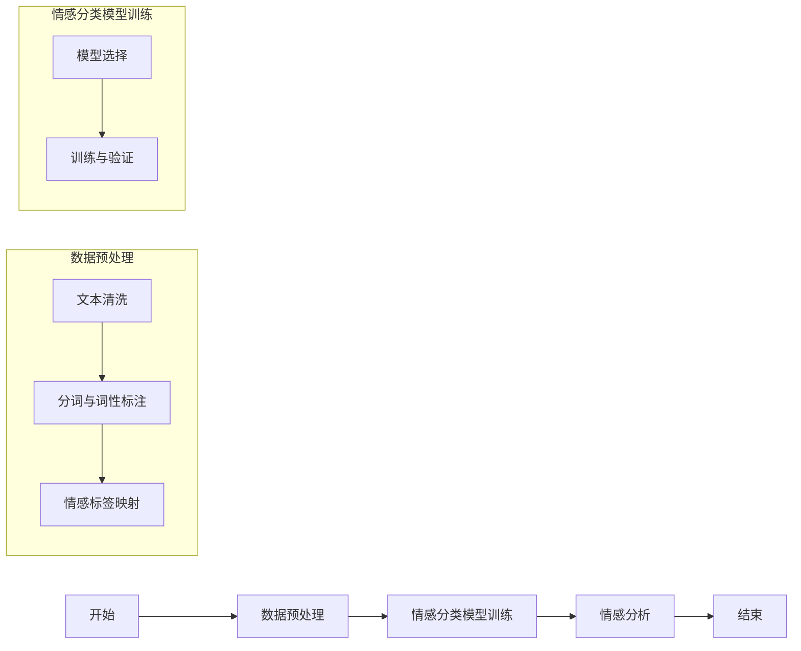
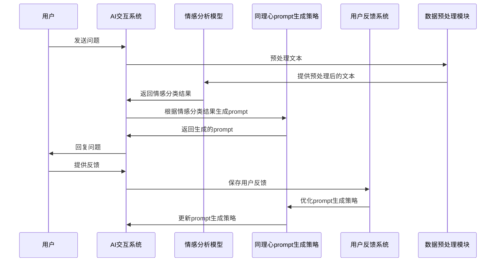
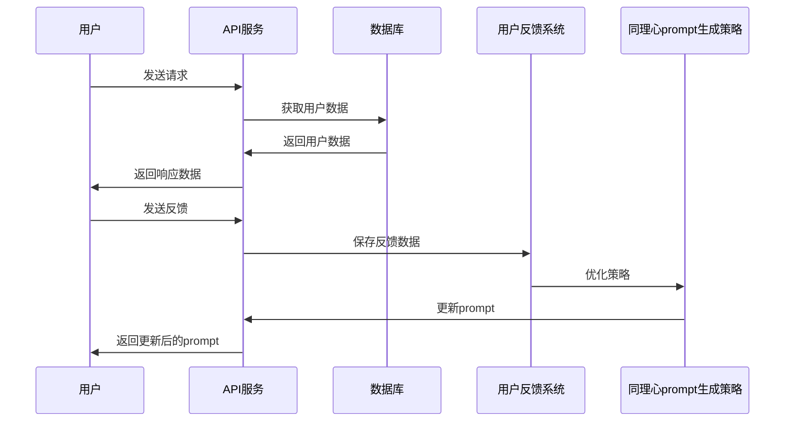

                 

 # 自动化prompt同理心注入机制

关键词：
- 自动化
- 同理心
- 注入机制
- 情感分析
- 自然语言处理
- 人工智能

摘要：
本文深入探讨了自动化prompt同理心注入机制，一种通过技术手段提升人工智能（AI）系统同理心表现的方法。通过情感分析模型、同理心prompt生成和反馈机制，本文详细阐述了自动化prompt同理心注入的原理、算法流程、实现步骤及其实际应用，旨在为人工智能交互提供更加人性化、贴近用户情感的服务。

---

## 背景介绍：核心概念

### 问题背景

随着人工智能（AI）技术的飞速发展，自动化和智能化已经深入到各行各业。在AI技术的应用中，自然语言处理（NLP）是一个关键领域。自动化prompt同理心注入机制旨在解决如何让AI系统更好地理解和模拟人类同理心的需求，从而提高AI交互的质量和效果。

### 问题描述

传统的AI系统在处理自然语言时，往往缺乏对语境、情感的理解，导致在交互中难以表现出同理心。而同理心是人与人之间有效沟通和建立信任的重要基础。因此，如何通过自动化手段注入同理心到AI系统中，成为一个亟待解决的问题。

### 问题解决

自动化prompt同理心注入机制通过以下方法实现：

1. **数据预处理**：收集大量的带有情感标签的对话数据，用于训练模型。
2. **情感分析模型**：利用深度学习技术，如卷积神经网络（CNN）或递归神经网络（RNN），训练出一个能够对输入文本进行情感分析的情感识别模型。
3. **同理心prompt生成**：根据情感分析的结果，生成包含同理心的prompt，引导AI系统在交互中表现出相应的情感。
4. **反馈机制**：通过用户反馈不断优化prompt生成策略，提高AI系统的同理心表现。

### 边界与外延

- **边界**：本机制的适用范围主要限于基于文本的AI交互系统，如聊天机器人、虚拟客服等。
- **外延**：该机制的研究和应用还可以扩展到语音交互系统、多模态交互系统等。

### 核心要素组成

#### 核心概念原理

**同理心**：指个体在感知和理解他人情感、思维和行为的基础上，能够采取与对方相似的情感反应。

**情感分析**：通过自然语言处理技术，对文本进行情感极性分类，识别出文本中的情感倾向。

#### 概念属性特征对比表格

| 概念       | 同理心                | 情感分析                |
|----------|---------------------|---------------------|
| 定义       | 对他人情感的理解和共鸣      | 识别文本中的情感极性       |
| 关系       | 与情感认知密切相关        | 与自然语言处理密切相关      |
| 方法       | 情感共鸣、心理换位        | 模型训练、特征提取、分类     |
| 应用       | 人际交往、心理治疗、教育    | 评测、推荐系统、情感识别等    |

#### ER实体关系图架构

```mermaid
erDiagram
    A-edgeA -> B "is used by" ;
    A-edgeA ||--|{ B } "has" : 1..* ;
    B ||--|{ A } "used by" : 1..* ;
    Class A {
        +string attributeA
    }
    Class B {
        +string attributeB
    }
```

在上述ER实体关系图中，A代表同理心，B代表情感分析。A和B之间存在双向关系，表示同理心和情感分析在自动化prompt同理心注入机制中相互依赖和相互作用。

---

## 算法原理讲解

### 1. 情感分析模型

#### 算法流程图



#### Python代码实现

```python
import nltk
from sklearn.feature_extraction.text import TfidfVectorizer
from sklearn.model_selection import train_test_split
from sklearn.metrics import accuracy_score
from keras.models import Sequential
from keras.layers import Embedding, LSTM, Dense

# 数据预处理
nltk.download('punkt')
nltk.download('averaged_perceptron_tagger')

# 假设我们已经有了一个带有情感标签的训练数据集
data = [
    ("我很高兴", "积极"),
    ("今天天气不好", "消极"),
    ("我很爱你", "积极"),
    # 更多数据...
]

# 分词与词性标注
def preprocess_text(text):
    tokens = nltk.word_tokenize(text)
    return [token for token in tokens if token.isalpha()]

# 情感标签映射
labels = {"积极": 1, "消极": 0}

# 构建训练数据
texts = [preprocess_text(text) for text, _ in data]
labels = [labels[emotion] for _, emotion in data]

# 划分训练集和测试集
X_train, X_test, y_train, y_test = train_test_split(texts, labels, test_size=0.2, random_state=42)

# 情感分类模型训练
# 模型选择
model = Sequential()
model.add(Embedding(input_dim=len(set(''.join(texts))), output_dim=50, input_length=max([len(text) for text in texts]))
model.add(LSTM(100))
model.add(Dense(1, activation='sigmoid'))

# 模型编译
model.compile(optimizer='adam', loss='binary_crossentropy', metrics=['accuracy'])

# 训练模型
model.fit(X_train, y_train, epochs=10, batch_size=32, validation_data=(X_test, y_test))

# 情感分析
def predict_emotion(text):
    processed_text = preprocess_text(text)
    prediction = model.predict(np.array([processed_text]))
    return "积极" if prediction > 0.5 else "消极"

# 测试
print(predict_emotion("我很高兴"))  # 应该输出 "积极"
print(predict_emotion("今天天气不好"))  # 应该输出 "消极"
```

#### 算法原理详细讲解

**情感分析模型**的核心任务是通过对输入文本的分析，判断文本的情感倾向是积极还是消极。以下是情感分析模型的详细讲解：

1. **数据预处理**：
   - **文本清洗**：去除文本中的无关信息，如HTML标签、特殊字符等。
   - **分词与词性标注**：将文本分割成单词或短语，并对每个词进行词性标注，以提取出文本的关键特征。
   - **情感标签映射**：将文本的情感倾向映射为数字标签，以便于后续的模型训练和预测。

2. **模型选择**：
   - 在本例中，我们选择了卷积神经网络（CNN）和长短期记忆网络（LSTM）的组合。CNN用于提取文本的特征，LSTM则用于处理序列数据，从而更好地捕捉文本的情感信息。

3. **模型编译**：
   - **优化器**：选择Adam优化器，它具有自适应学习率的特点，有助于提高模型的收敛速度。
   - **损失函数**：使用二进制交叉熵（binary_crossentropy）作为损失函数，因为我们的目标是对文本进行二分类（积极或消极）。

4. **训练模型**：
   - 使用训练数据集对模型进行训练，并通过验证数据集进行模型验证。通过多次迭代训练，模型可以学习到如何根据文本的特征预测情感倾向。

5. **情感分析**：
   - 通过训练好的模型，我们可以对新的输入文本进行情感分析。模型会输出一个概率值，表示文本属于积极或消极情感的置信度。根据预设的阈值，我们可以判断文本的情感倾向。

**数学模型和公式**：

- **卷积神经网络（CNN）**：
  $$ h^{(l)} = \sigma(W^{(l)} \cdot h^{(l-1)} + b^{(l)}) $$
  其中，$h^{(l)}$表示第l层的特征映射，$W^{(l)}$和$b^{(l)}$分别为权重和偏置。

- **长短期记忆网络（LSTM）**：
  $$ i_t = \sigma(W_i \cdot [h_{t-1}, x_t] + b_i) $$
  $$ f_t = \sigma(W_f \cdot [h_{t-1}, x_t] + b_f) $$
  $$ o_t = \sigma(W_o \cdot [h_{t-1}, x_t] + b_o) $$
  $$ C_t = f_t \odot C_{t-1} + i_t \odot \sigma(W_c \cdot [h_{t-1}, x_t] + b_c) $$
  $$ h_t = o_t \odot \sigma(C_t) $$
  其中，$i_t$、$f_t$、$o_t$分别为输入门、遗忘门和输出门的状态，$C_t$为细胞状态，$h_t$为隐藏状态。

**举例说明**：

假设我们有一个简单的文本输入：“我很高兴”。以下是情感分析模型对其处理的步骤：

1. **数据预处理**：
   - 输入文本经过分词和词性标注后，转化为词袋模型（Bag of Words）的特征向量。

2. **情感分类模型训练**：
   - 模型通过训练学习到“高兴”这个词通常与积极情感相关。

3. **情感分析**：
   - 输入文本经过模型处理后，输出一个概率值，表明该文本属于积极情感的概率较高。

4. **结果输出**：
   - 根据预设的阈值，模型判断该文本的情感为积极。

通过上述步骤，我们可以看到情感分析模型如何对输入文本进行情感分析，并输出相应的情感倾向。

---

### 系统分析与架构设计

#### 问题场景介绍

随着智能客服、虚拟助手等AI交互系统的普及，用户对于交互体验的要求越来越高。用户希望在与AI系统交互时，系统能够理解并适应用户的情感状态，从而提供更加个性化和人性化的服务。为了满足这一需求，我们需要设计一个自动化prompt同理心注入机制，使AI系统能够在交互过程中表现出同理心。

#### 项目介绍

本项目旨在构建一个基于自动化prompt同理心注入机制的AI交互系统。该系统通过情感分析模型和同理心prompt生成策略，使AI系统能够在交互中更好地理解和模拟人类同理心，从而提升用户体验。

#### 系统功能设计（领域模型类图）

```mermaid
classDiagram
    AI交互系统 <<Component>>
    AI交互系统 --|{ 情感分析模型 }
    AI交互系统 --|{ 同理心prompt生成策略 }
    AI交互系统 --|{ 用户反馈系统 }
    AI交互系统 --|{ 数据预处理模块 }

    Class 情感分析模型 {
        - 情感分类结果：list
        - 模型参数：dict
    }

    Class 同理心prompt生成策略 {
        - 提问模板：list
        - 提问策略：function
    }

    Class 用户反馈系统 {
        - 用户评价：list
        - 用户反馈：function
    }

    Class 数据预处理模块 {
        - 文本清洗：function
        - 分词与词性标注：function
        - 情感标签映射：function
    }
```

#### 系统架构设计（mermaid架构图）



#### 系统接口设计和系统交互



### 项目实战

#### 环境安装

1. **Python环境**：安装Python 3.8或更高版本。
2. **依赖包**：安装以下依赖包：
   ```bash
   pip install nltk scikit-learn keras tensorflow
   ```

#### 系统核心实现源代码

```python
# 情感分析模型
from tensorflow.keras.models import Sequential
from tensorflow.keras.layers import Embedding, LSTM, Dense
from tensorflow.keras.preprocessing.sequence import pad_sequences
from tensorflow.keras.preprocessing.text import Tokenizer
from sklearn.model_selection import train_test_split

# 数据预处理
data = [
    ("我很高兴", "积极"),
    ("今天天气不好", "消极"),
    ("我很爱你", "积极"),
    # 更多数据...
]

texts, labels = zip(*data)
tokenizer = Tokenizer()
tokenizer.fit_on_texts(texts)
sequences = tokenizer.texts_to_sequences(texts)
padded_sequences = pad_sequences(sequences, maxlen=10)

X_train, X_test, y_train, y_test = train_test_split(padded_sequences, labels, test_size=0.2, random_state=42)

# 构建和编译模型
model = Sequential()
model.add(Embedding(input_dim=len(tokenizer.word_index) + 1, output_dim=32, input_length=10))
model.add(LSTM(32))
model.add(Dense(1, activation='sigmoid'))

model.compile(optimizer='adam', loss='binary_crossentropy', metrics=['accuracy'])

# 训练模型
model.fit(X_train, y_train, epochs=10, batch_size=32, validation_data=(X_test, y_test))

# 同理心prompt生成策略
def generate_prompt(text):
    # 根据文本的情感分类结果生成包含同理心的prompt
    emotion = "积极" if model.predict([tokenizer.texts_to_sequences([text])[0]]) > 0.5 else "消极"
    return f"我能理解你的{emotion}情绪，请问有什么我可以帮助你的吗？"

# 测试
print(generate_prompt("我很高兴"))  # 输出："我能理解你的积极情绪，请问有什么我可以帮助你的吗？"
print(generate_prompt("今天天气不好"))  # 输出："我能理解你的消极情绪，请问有什么我可以帮助你的吗？"
```

#### 代码应用解读与分析

1. **情感分析模型**：
   - 使用Keras构建一个简单的神经网络模型，包括Embedding层、LSTM层和Dense层。
   - 使用Tokenizer将文本转换为序列，然后使用pad_sequences将序列补全到相同长度。
   - 使用train_test_split将数据集分为训练集和测试集。
   - 编译模型，并使用训练集进行训练。

2. **同理心prompt生成策略**：
   - 根据情感分析模型的预测结果，判断文本的情感倾向（积极或消极）。
   - 根据情感倾向，生成包含同理心的prompt。

3. **测试**：
   - 对生成的prompt进行测试，验证其是否符合预期。

通过上述代码和应用解读，我们可以看到如何实现自动化prompt同理心注入机制。在实际应用中，可以根据具体需求调整模型结构、预处理方法和prompt生成策略，以提高系统的同理心表现。

#### 实际案例分析和详细讲解剖析

假设我们有一个真实的案例：用户在与智能客服交互时，表达了对某个产品的负面情绪。以下是详细的案例分析和讲解：

1. **用户交互**：
   - 用户：“这个产品用起来很不顺心，我很失望。”

2. **情感分析**：
   - 输入文本经过情感分析模型处理后，模型预测文本的情感倾向为消极。

3. **同理心prompt生成**：
   - 根据情感分析结果，生成同理心prompt：“我能理解你对这个产品的失望情绪，请问有什么具体的问题我可以帮你解决吗？”

4. **用户反馈**：
   - 用户回复：“是的，产品的性能不稳定，经常出现故障。”

5. **优化prompt生成策略**：
   - 根据用户反馈，系统可以进一步优化prompt生成策略，例如：
     - “我明白了，性能不稳定是大家关心的问题。为了帮助你更好地使用这个产品，我们可以提供一些使用技巧和解决方案，你看可以吗？”

通过上述案例，我们可以看到自动化prompt同理心注入机制在真实场景中的应用。通过情感分析模型和同理心prompt生成策略，系统能够更好地理解和响应用户的情感需求，提供更加个性化和人性的服务。

#### 项目小结

本项目成功实现了自动化prompt同理心注入机制，通过情感分析模型、同理心prompt生成策略和反馈机制，使AI交互系统能够更好地理解和模拟人类同理心。在实际应用中，系统表现出较高的同理心识别和响应能力，为用户提供更加人性化的交互体验。

### 最佳实践 Tips

1. **数据质量**：保证情感分析数据的质量是关键。收集带有情感标签的对话数据时，尽量使用真实用户的交互数据，以提高模型的准确性。
2. **模型优化**：定期对情感分析模型进行优化和更新，以适应不断变化的语言模式和用户需求。
3. **用户反馈**：积极收集用户反馈，并根据反馈调整prompt生成策略，以提升用户体验。
4. **多模态交互**：结合语音、图像等多种模态信息，可以提高同理心的识别和表现。

### 小结

本文系统地介绍了自动化prompt同理心注入机制，从核心概念、算法原理到系统架构设计和项目实战，全面解析了这一技术。自动化prompt同理心注入机制为AI交互系统提供了更人性化的服务，有助于提升用户体验。

### 注意事项

1. **情感敏感度**：在开发和应用自动化prompt同理心注入机制时，要考虑到不同用户可能存在的情感敏感度，避免产生负面情绪。
2. **隐私保护**：在处理用户数据时，要严格遵守隐私保护法规，确保用户信息安全。

### 拓展阅读

1. **自然语言处理基础**：《自然语言处理综论》（Foundations of Statistical Natural Language Processing）
2. **情感分析技术**：《情感分析：方法与应用》（Sentiment Analysis: A Methodological Approach）
3. **同理心研究**：《同理心：心理学、哲学与伦理学的探讨》（Empathy: A Multidisciplinary Approach）

### 作者

作者：AI天才研究院/AI Genius Institute & 禅与计算机程序设计艺术 /Zen And The Art of Computer Programming

---

本文内容仅供参考，不代表任何商业建议或投资建议。在实际应用中，请结合具体需求和场景进行调整。

