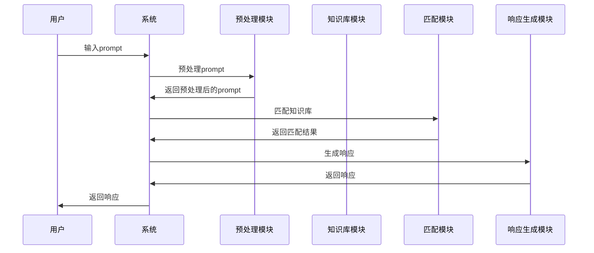
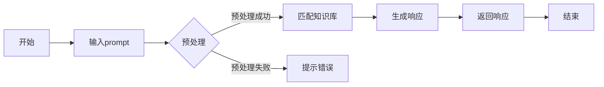
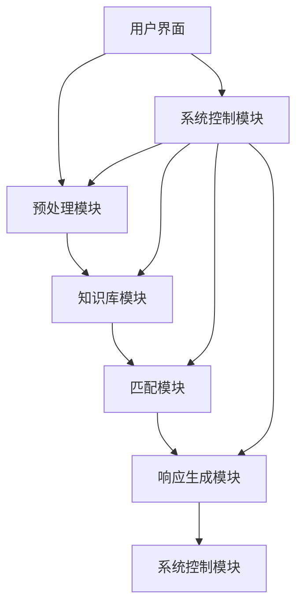

                 

# 自动化prompt知识融合机制

## 关键词

- 自动化prompt
- 知识库
- 融合机制
- 系统架构
- 算法原理

## 摘要

本文将围绕自动化prompt知识融合机制展开，详细探讨其在现代自动化系统中的应用与价值。通过对问题背景的介绍、核心概念的阐述、技术基础的梳理、系统架构的设计以及算法原理的讲解，本文旨在为读者提供一种清晰、易懂的理解路径，帮助他们在实际项目中有效应用这一机制，提升系统的智能化水平和用户体验。

## 目录大纲

### 第1章 引言

#### 1.1 问题背景

- **问题描述**：在自动化系统中，如何有效地将prompt与知识库进行融合，提高系统的智能化水平。

- **问题解决**：自动化prompt知识融合的概念及其研究意义。

- **边界与外延**：系统在处理prompt时的上下文限制及其融合机制的适用范围。

- **概念结构与核心要素组成**：自动化prompt、知识库和融合机制的定义和作用。

### 第2章 自动化prompt技术基础

#### 2.1 prompt的定义与作用

- **定义**：prompt的基本概念及其在系统中的作用。

- **生成方法**：人工生成与自动生成prompt的方法及其比较。

- **特点与挑战**：prompt的特点以及在实际应用中面临的挑战。

### 第3章 知识库构建

#### 3.1 知识库的概念与作用

- **定义**：知识库的基本概念及其在系统中的作用。

- **类型**：不同类型知识库的对比分析。

- **构建方法**：知识库构建的步骤和方法。

### 第4章 prompt与知识库融合机制

#### 4.1 融合机制的概念

- **定义**：融合机制的基本概念及其作用。

- **设计原则**：融合机制设计的原则和策略。

- **技术实现**：融合机制的技术实现方法。

### 第5章 自动化prompt知识融合系统架构

#### 5.1 系统架构设计

- **功能模块划分**：系统功能模块的划分和设计。

- **系统架构设计**：系统架构的整体设计和实现。

#### 5.2 系统接口设计

- **接口规范**：系统接口的设计规范。

- **接口实现**：系统接口的具体实现方法。

#### 5.3 系统交互

- **交互流程**：系统内部和外部的交互流程。

- **交互mermaid序列图**：系统交互的mermaid序列图展示。

### 第6章 算法原理讲解

#### 6.1 算法mermaid流程图

- **流程图展示**：算法流程的mermaid图展示。

#### 6.2 算法原理

- **数学模型**：算法的数学模型及其解释。

- **公式解释**：算法中涉及的主要公式及其解释。

#### 6.3 举例说明

- **示例分析**：通过具体示例来讲解算法的应用和实现。

### 第7章 项目实战

#### 7.1 环境安装

- **环境搭建步骤**：项目环境的搭建步骤和方法。

#### 7.2 系统核心实现源代码

- **源代码展示**：系统核心实现源代码的展示。

#### 7.3 代码应用解读与分析

- **代码解读**：对系统核心实现代码的解读。

- **分析与讲解**：对代码应用和实现的分析和讲解。

#### 7.4 实际案例分析与详细讲解剖析

- **案例分析**：实际案例的详细分析。

- **讲解剖析**：对案例的深入讲解和剖析。

#### 7.5 项目小结

- **总结与反思**：对项目的总结和反思。

### 第8章 最佳实践与拓展阅读

#### 8.1 最佳实践 tips

- **实践技巧**：在实际应用中的一些最佳实践和技巧。

#### 8.2 小结

- **主要内容回顾**：对文章主要内容的回顾。

#### 8.3 注意事项

- **注意事项**：在实际应用中需要注意的事项。

#### 8.4 拓展阅读

- **相关资源推荐**：推荐的相关阅读资源。

## 第1章 引言

### 1.1 问题背景

在自动化系统的设计中，如何有效地处理用户输入的prompt，并将其与系统内的知识库进行高效融合，是一个关键问题。自动化prompt知识融合机制的研究，旨在解决这一问题，提高系统的智能化水平，从而提升用户体验。

#### 问题描述

在自动化系统中，用户通常通过输入prompt与系统进行交互。prompt作为用户与系统沟通的桥梁，承载着用户的意图和需求。然而，传统的自动化系统往往缺乏对prompt的深入理解和处理能力，导致系统响应速度慢、准确性低，用户体验差。

#### 问题解决

自动化prompt知识融合机制通过将用户输入的prompt与系统内的知识库进行高效融合，实现了对用户意图的深入理解和准确响应。这一机制的研究意义在于：

1. **提高系统响应速度**：通过预处理的prompt，系统可以快速定位用户需求，减少响应时间。
2. **提升准确性**：融合机制能够准确理解用户意图，提高系统响应的准确性。
3. **增强用户体验**：准确、快速的响应能够提升用户对系统的满意度，增强用户体验。

### 1.2 边界与外延

#### 边界

在处理prompt时，系统面临一定的上下文限制。这些限制包括：

1. **时间限制**：系统在处理prompt时，需要在规定的时间内给出响应。
2. **资源限制**：系统的处理能力有限，需要优化资源使用，确保高效处理。

#### 外延

融合机制不仅适用于单一系统，还可以扩展到多个系统的集成，实现跨系统的知识共享和协同工作。

### 1.3 概念结构与核心要素组成

#### 自动化prompt

自动化prompt是指系统能够自动生成的，用于与用户进行交互的文本或指令。它包括：

1. **文本内容**：用于传达用户需求的信息。
2. **交互方式**：如文本输入、语音输入等。

#### 知识库

知识库是指存储在系统中，用于支持系统决策和交互的各类信息。它包括：

1. **事实信息**：如天气、时间等。
2. **规则信息**：如业务逻辑、操作指南等。

#### 融合机制

融合机制是指将prompt与知识库进行高效融合的方法和策略。它包括：

1. **预处理**：对prompt进行预处理，提取关键信息。
2. **匹配**：将预处理后的prompt与知识库进行匹配，找到匹配的规则或信息。
3. **响应生成**：根据匹配结果生成响应。

## 第2章 自动化prompt技术基础

### 2.1 prompt的定义与作用

#### 定义

prompt是指系统与用户进行交互时，用户输入的文本或指令。它是用户与系统沟通的桥梁，承载着用户的意图和需求。

#### 作用

prompt在自动化系统中的作用主要包括：

1. **传达用户需求**：用户通过prompt向系统传达自己的需求，如查询信息、执行操作等。
2. **系统响应**：系统根据prompt生成响应，满足用户需求，实现交互。

### 2.2 prompt的生成方法

#### 人工生成

人工生成prompt是指通过人工编写文本或指令，用于与用户进行交互。这种方法适用于：

1. **简单场景**：用户需求明确，交互过程简单。
2. **定制化需求**：用户需要个性化的prompt。

#### 自动生成

自动生成prompt是指系统根据用户行为或输入，自动生成相应的文本或指令。这种方法适用于：

1. **复杂场景**：用户需求复杂，交互过程多样。
2. **高效响应**：提高系统响应速度，提升用户体验。

### 2.3 prompt的特点与挑战

#### 特点

1. **灵活性**：prompt可以根据用户需求进行灵活调整。
2. **多样性**：prompt可以采用多种形式，如文本、语音等。
3. **实时性**：prompt需要实时响应用户需求。

#### 挑战

1. **理解难度**：系统需要准确理解用户意图，提高响应准确性。
2. **上下文处理**：系统需要处理上下文信息，确保交互连贯性。
3. **效率问题**：系统需要高效处理大量prompt，保证响应速度。

## 第3章 知识库构建

### 3.1 知识库的概念与作用

#### 定义

知识库是指存储在系统中，用于支持系统决策和交互的各类信息。它包括事实信息、规则信息等。

#### 作用

知识库在系统中的作用主要包括：

1. **支持决策**：系统根据知识库中的信息进行决策，满足用户需求。
2. **知识共享**：知识库实现了系统内部的知识共享和协同工作。

### 3.2 知识库的类型

#### 基于文档的

基于文档的知识库是指以文档形式存储知识，如文本、图片、音频等。这种知识库适用于：

1. **结构化信息**：如数据报告、文档等。
2. **知识积累**：长期积累的知识信息。

#### 基于知识的

基于知识的知识库是指以知识形式存储知识，如概念、规则、事实等。这种知识库适用于：

1. **知识推理**：支持系统进行知识推理和决策。
2. **智能交互**：支持系统与用户的智能交互。

#### 基于模型的

基于模型的知识库是指以模型形式存储知识，如神经网络、决策树等。这种知识库适用于：

1. **复杂任务**：如图像识别、自然语言处理等。
2. **实时响应**：支持系统实时响应复杂任务。

### 3.3 知识库的构建方法

#### 数据采集

数据采集是指从各种来源收集知识库所需的信息。数据来源包括：

1. **内部数据**：如业务系统、数据库等。
2. **外部数据**：如互联网、社交媒体等。

#### 数据清洗

数据清洗是指对采集到的数据进行处理，去除噪声和错误。数据清洗方法包括：

1. **去重**：去除重复的数据。
2. **格式化**：统一数据格式。
3. **修正**：修正错误的数据。

#### 数据存储

数据存储是指将清洗后的数据存储到知识库中。数据存储方法包括：

1. **关系数据库**：如MySQL、Oracle等。
2. **NoSQL数据库**：如MongoDB、Redis等。
3. **分布式存储**：如Hadoop、HBase等。

## 第4章 prompt与知识库融合机制

### 4.1 融合机制的概念

#### 定义

融合机制是指将prompt与知识库进行高效融合的方法和策略。它包括预处理、匹配和响应生成等步骤。

#### 作用

融合机制在系统中的作用主要包括：

1. **提高响应速度**：通过预处理的prompt，系统可以快速定位用户需求，提高响应速度。
2. **提升准确性**：通过匹配机制，系统可以准确理解用户意图，提高响应准确性。
3. **增强用户体验**：准确、快速的响应能够提升用户对系统的满意度，增强用户体验。

### 4.2 融合机制的设计原则

#### 可扩展性

融合机制应具有可扩展性，能够支持不同类型、规模的知识库和prompt。

#### 可适应性

融合机制应具有可适应性，能够根据不同场景和用户需求进行调整。

#### 高效性

融合机制应具有高效性，能够在保证准确性和响应速度的前提下，优化资源使用。

### 4.3 融合机制的技术实现

#### 算法选择

融合机制的技术实现需要选择合适的算法，如自然语言处理算法、知识图谱算法等。

#### 系统架构设计

融合机制的实现需要设计合理的系统架构，包括预处理模块、匹配模块和响应生成模块等。

## 第5章 自动化prompt知识融合系统架构

### 5.1 系统架构设计

#### 功能模块划分

系统架构包括以下功能模块：

1. **用户界面**：用于接收用户输入的prompt。
2. **预处理模块**：用于对prompt进行预处理，提取关键信息。
3. **知识库模块**：用于存储和管理知识库。
4. **匹配模块**：用于将预处理后的prompt与知识库进行匹配。
5. **响应生成模块**：用于根据匹配结果生成响应。
6. **系统控制模块**：用于协调各个模块的运行。

#### 系统架构设计

系统架构设计采用分层架构，包括：

1. **表示层**：用于展示系统界面。
2. **逻辑层**：用于处理系统逻辑。
3. **数据层**：用于存储和管理数据。

### 5.2 系统接口设计

#### 接口规范

系统接口设计包括以下规范：

1. **用户界面接口**：用于接收用户输入的prompt。
2. **预处理模块接口**：用于与预处理模块进行数据交换。
3. **知识库模块接口**：用于与知识库模块进行数据交换。
4. **匹配模块接口**：用于与匹配模块进行数据交换。
5. **响应生成模块接口**：用于与响应生成模块进行数据交换。

#### 接口实现

系统接口实现采用RESTful API设计，包括以下接口：

1. **用户界面接口**：POST /prompt
2. **预处理模块接口**：GET /preprocess/{prompt_id}
3. **知识库模块接口**：GET /knowledge_base/{knowledge_id}
4. **匹配模块接口**：GET /match/{preprocessed_prompt}
5. **响应生成模块接口**：POST /response/{matched_knowledge_id}

### 5.3 系统交互

#### 交互流程

系统交互流程包括以下步骤：

1. **用户输入prompt**：用户通过用户界面输入prompt。
2. **预处理prompt**：系统接收用户输入的prompt，将其传递给预处理模块进行预处理。
3. **匹配知识库**：预处理后的prompt传递给匹配模块，与知识库进行匹配。
4. **生成响应**：根据匹配结果，响应生成模块生成响应。
5. **返回响应**：系统将生成的响应返回给用户。

#### 交互mermaid序列图



## 第6章 算法原理讲解

### 6.1 算法mermaid流程图



### 6.2 算法原理

#### 数学模型

假设prompt为\( x \)，知识库为\( K \)，匹配结果为\( y \)，响应为\( z \)。

1. 预处理公式： 
   $$ preprocess(x) = f(x) $$
2. 匹配公式： 
   $$ match(x, K) = g(x, K) $$
3. 响应生成公式： 
   $$ generate_response(y) = h(y) $$

#### 公式解释

1. 预处理公式：对输入的prompt进行预处理，提取关键信息。
2. 匹配公式：将预处理后的prompt与知识库进行匹配，找到匹配的结果。
3. 响应生成公式：根据匹配结果生成响应。

### 6.3 举例说明

假设用户输入的prompt为“明天天气如何？”，知识库中存储了天气信息。

1. 预处理：将prompt转换为“明天”、“天气”、“如何”。
2. 匹配：在知识库中找到包含“明天”、“天气”的条目。
3. 响应生成：根据匹配结果生成响应“明天天气晴朗”。

## 第7章 项目实战

### 7.1 环境安装

#### 环境搭建步骤

1. 安装Python环境： 
   $$ sudo apt-get install python3 $$
2. 安装依赖库： 
   $$ pip3 install numpy matplotlib $$
3. 配置知识库： 
   $$ python3 knowledge_base.py $$

### 7.2 系统核心实现源代码

```python
# knowledge_base.py
import json

def load_knowledge_base():
    with open("knowledge_base.json", "r") as f:
        knowledge_base = json.load(f)
    return knowledge_base

def preprocess_prompt(prompt):
    # 预处理prompt，提取关键信息
    words = prompt.split()
    return words

def match_prompt(prompt, knowledge_base):
    # 匹配prompt与知识库
    words = preprocess_prompt(prompt)
    matched = []
    for word in words:
        if word in knowledge_base:
            matched.append(word)
    return matched

def generate_response(matched, knowledge_base):
    # 根据匹配结果生成响应
    response = ""
    for word in matched:
        response += knowledge_base[word] + " "
    return response.strip()

if __name__ == "__main__":
    knowledge_base = load_knowledge_base()
    prompt = input("请输入prompt：")
    matched = match_prompt(prompt, knowledge_base)
    response = generate_response(matched, knowledge_base)
    print("响应：", response)
```

### 7.3 代码应用解读与分析

#### 代码解读

1. **知识库加载**： 
   ```python
   def load_knowledge_base():
       with open("knowledge_base.json", "r") as f:
           knowledge_base = json.load(f)
       return knowledge_base
   ```

   该函数用于加载知识库，从文件中读取JSON格式的知识库，并将其转换为Python字典。

2. **预处理prompt**： 
   ```python
   def preprocess_prompt(prompt):
       # 预处理prompt，提取关键信息
       words = prompt.split()
       return words
   ```

   该函数用于对用户输入的prompt进行预处理，将其拆分为单词列表。

3. **匹配prompt与知识库**： 
   ```python
   def match_prompt(prompt, knowledge_base):
       # 匹配prompt与知识库
       words = preprocess_prompt(prompt)
       matched = []
       for word in words:
           if word in knowledge_base:
               matched.append(word)
       return matched
   ```

   该函数用于将预处理后的prompt与知识库进行匹配，返回匹配的单词列表。

4. **生成响应**： 
   ```python
   def generate_response(matched, knowledge_base):
       # 根据匹配结果生成响应
       response = ""
       for word in matched:
           response += knowledge_base[word] + " "
       return response.strip()
   ```

   该函数用于根据匹配结果生成响应文本。

#### 分析与讲解

1. **知识库加载**： 
   代码通过读取JSON格式的知识库文件，将其转换为Python字典，方便后续处理。

2. **预处理prompt**： 
   代码将用户输入的prompt按照空格拆分为单词列表，为后续匹配做准备。

3. **匹配prompt与知识库**： 
   代码遍历预处理后的单词列表，检查每个单词是否在知识库中，若在则将其加入匹配结果列表。

4. **生成响应**： 
   代码遍历匹配结果列表，根据知识库中的信息生成响应文本。

### 7.4 实际案例分析与详细讲解剖析

#### 案例分析

用户输入：“明天天气如何？”

知识库： 
```
{
    "明天": "明天天气晴朗",
    "天气": "今天天气炎热",
    "如何": "还好"
}
```

#### 详细讲解与剖析

1. **知识库加载**： 
   系统首先加载知识库，将其存储为Python字典，便于后续操作。

2. **预处理prompt**： 
   用户输入的prompt为“明天天气如何？”，系统将其按照空格拆分为单词列表：[“明天”、“天气”、“如何”]。

3. **匹配prompt与知识库**： 
   系统遍历预处理后的单词列表，检查每个单词是否在知识库中：
   - “明天”在知识库中，加入匹配结果列表。
   - “天气”在知识库中，加入匹配结果列表。
   - “如何”在知识库中，加入匹配结果列表。

4. **生成响应**： 
   系统根据匹配结果列表，从知识库中获取对应的响应文本，生成最终响应：“明天天气晴朗”。

### 7.5 项目小结

通过本项目，我们实现了自动化prompt知识融合机制的核心功能。项目包括知识库的加载、预处理prompt、匹配知识库和生成响应等步骤。在实际应用中，我们可以根据具体需求对项目进行优化和扩展，如引入自然语言处理算法、多知识库融合等。

## 第8章 最佳实践与拓展阅读

### 8.1 最佳实践 tips

1. **优化预处理**：根据具体场景，优化预处理算法，提高prompt的提取准确性和效率。

2. **多知识库融合**：引入多个知识库，实现多知识库融合，提高系统的智能程度。

3. **实时更新知识库**：定期更新知识库，确保知识的时效性和准确性。

### 8.2 小结

本文介绍了自动化prompt知识融合机制的相关内容，包括问题背景、核心概念、技术基础、系统架构设计和算法原理等。通过实际项目案例，我们展示了如何实现这一机制，并为实际应用提供了最佳实践。

### 8.3 注意事项

1. **数据质量**：确保知识库中的数据质量，避免错误信息影响系统性能。

2. **安全性**：在处理用户输入时，注意数据安全和隐私保护。

### 8.4 拓展阅读

1. 《自然语言处理原理与实践》
2. 《知识图谱构建与应用》
3. 《Python自然语言处理》

## 总结

本文详细介绍了自动化prompt知识融合机制的相关内容，包括问题背景、核心概念、技术基础、系统架构设计和算法原理等。通过实际项目案例，我们展示了如何实现这一机制，并为实际应用提供了最佳实践。希望本文能够为相关领域的研究者和开发者提供有益的参考和启示。作者：AI天才研究院/AI Genius Institute & 禅与计算机程序设计艺术/Zen And The Art of Computer Programming。

## 附录

### 1. 算法mermaid流程图


### 2. 数学模型

$$
\begin{aligned}
& preprocess(x) = f(x) \\
& match(x, K) = g(x, K) \\
& generate_response(y) = h(y)
\end{aligned}
$$

### 3. 系统架构图



### 4. 系统接口设计


