                 

# 自动化报告生成：利用LLM总结评测结果

## 关键词

- 自动化报告生成
- 语言模型( LLMB )
- 评测结果总结
- 数据分析
- 技术博客

## 摘要

本文将探讨如何利用语言模型(LLM)自动化生成报告，特别是在总结评测结果方面的应用。我们将逐步分析其背景、核心概念、算法原理、数学模型以及系统架构设计，并通过具体案例展示其实际应用效果。通过本文，读者将了解LLM在自动化报告生成中的潜力和优势。

### 目录大纲

1. **背景介绍**
    - 1.1 问题背景
    - 1.2 问题解决
    - 1.3 边界与外延
    - 1.4 概念结构与核心要素组成
2. **核心概念与联系**
    - 2.1 LLM的原理与特点
    - 2.2 评测结果总结的方法
    - 2.3 LLM在评测结果总结中的应用
3. **算法原理讲解**
    - 3.1 数据型评测结果总结算法
    - 3.2 图表型评测结果总结算法
    - 3.3 文字型评测结果总结算法
4. **数学模型与公式**
    - 4.1 数据型评测结果总结数学模型
    - 4.2 图表型评测结果总结数学模型
    - 4.3 文字型评测结果总结数学模型
5. **系统分析与架构设计**
    - 5.1 问题场景介绍
    - 5.2 系统功能设计
    - 5.3 系统架构设计
    - 5.4 系统接口设计
    - 5.5 系统交互设计
6. **项目实战**
    - 6.1 环境安装
    - 6.2 系统核心实现
    - 6.3 代码应用解读
    - 6.4 实际案例分析
    - 6.5 项目小结
7. **最佳实践与小结**
    - 7.1 最佳实践
    - 7.2 小结
    - 7.3 注意事项
    - 7.4 拓展阅读

### 1. 背景介绍

#### 1.1 问题背景

在现代企业和组织中，报告生成是一个常见且必要的任务。无论是项目进展、绩效评估还是市场分析，报告都是沟通和决策的重要依据。然而，传统的报告生成过程往往耗时耗力，且容易出现错误。特别是当评测结果多样化、数据量庞大时，手动编写报告的难度和复杂度显著增加。

自动化报告生成作为一种新兴技术，旨在解决上述问题。通过将报告生成过程自动化，可以提高工作效率，降低人力成本，并减少错误发生的概率。特别是在数据分析和总结方面，自动化报告生成可以快速、准确地处理大量数据，生成结构化、逻辑清晰、语言流畅的报告。

#### 1.2 问题解决

传统的报告生成方式通常需要手动收集、整理和分析数据，然后编写报告。这种方式不仅效率低下，而且容易出现人为错误。随着技术的进步，特别是深度学习和自然语言处理技术的发展，语言模型(LLM)在自动化报告生成中显示出巨大的潜力。

LLM通过学习大量文本数据，可以理解和生成自然语言。在评测结果总结方面，LLM能够自动处理数据，生成图表、文字描述和结构化报告。这不仅提高了报告生成的效率，还保证了报告的质量和一致性。

#### 1.3 边界与外延

尽管LLM在自动化报告生成中具有巨大的潜力，但也有一些边界和限制。首先，确保评测结果的准确性和可靠性是生成高质量报告的关键。如果评测结果存在误差或偏差，生成的报告也可能会误导决策者。

此外，自动化报告生成不仅适用于技术领域，还可以广泛应用于各个行业和领域。例如，在金融领域，LLM可以用于生成财务报表和投资分析报告；在医疗领域，LLM可以用于生成病历报告和临床决策支持报告。

#### 1.4 概念结构与核心要素组成

自动化报告生成系统通常由以下几个核心要素组成：

1. **数据输入模块**：负责接收和存储评测结果数据。
2. **数据处理模块**：利用LLM对数据进行处理，生成初步的报告草稿。
3. **报告优化模块**：对初步报告草稿进行优化，确保报告的逻辑清晰、语言流畅。
4. **报告输出模块**：将最终报告输出到指定的格式，如PDF、Word等。

LLM作为核心技术，贯穿于数据处理和报告优化的各个阶段。通过不断地学习和优化，LLM可以不断提高报告生成的质量和效率。

### 2. 核心概念与联系

#### 2.1 LLM的原理与特点

语言模型(LLM)是一种基于深度学习的自然语言处理模型，它通过学习大量文本数据，可以理解和生成自然语言。LLM的核心思想是通过预测下一个单词或句子，从而生成完整的文本。

**原理**：

- **预训练**：LLM首先通过预训练过程学习大量文本数据，如书籍、新闻、网页等。在这个过程中，LLM学会了文本中的语法、语义和上下文关系。
- **微调**：在预训练完成后，LLM可以根据特定任务进行微调，以适应特定领域的文本数据。例如，在评测结果总结任务中，LLM可以通过学习特定的评测报告来优化其生成能力。

**特点**：

- **高度自动化**：LLM可以自动处理文本数据，生成结构化、逻辑清晰、语言流畅的报告。
- **高效**：与传统的报告生成方式相比，LLM显著提高了报告生成效率，可以快速处理大量数据。
- **准确**：LLM通过学习大量文本数据，可以准确理解评测结果，生成高质量的报告。
- **灵活**：LLM可以应用于各种不同领域和任务，具有广泛的适应性。

#### 2.2 评测结果总结的方法

评测结果总结的方法可以分为数据型、图表型和文字型三种。

**数据型**：

- **方法**：首先对数据进行清洗和预处理，然后使用LLM生成数据分析和图表。最后，结合文字描述，生成完整的评测结果总结报告。
- **步骤**：
  - 数据清洗：去除重复、异常和无关数据。
  - 数据预处理：将数据转换为适合LLM处理的形式，如数值、列表等。
  - 数据分析：使用LLM生成数据分析和图表，如柱状图、折线图等。
  - 文字描述：结合数据分析结果，撰写文字描述，形成完整的报告。

**图表型**：

- **方法**：首先对图表进行解析，提取关键信息。然后使用LLM生成文字描述，结合图表，形成完整的评测结果总结报告。
- **步骤**：
  - 图表解析：使用算法解析图表，提取关键信息，如数据点、趋势等。
  - 文字描述：使用LLM生成文字描述，将图表信息转化为自然语言描述。
  - 报告生成：结合文字描述和图表，生成完整的评测结果总结报告。

**文字型**：

- **方法**：直接使用LLM对文字型评测结果进行处理，生成结构化报告。
- **步骤**：
  - 文本处理：对原始文字数据进行分析，提取关键信息。
  - 报告结构化：使用LLM生成结构化报告，确保报告的逻辑清晰、语言流畅。
  - 报告优化：对初步生成的报告进行优化，确保报告的准确性和一致性。

#### 2.3 LLM在评测结果总结中的应用

LLM在评测结果总结中的应用主要分为数据型、图表型和文字型三种。

**数据型**：

- **应用**：利用LLM自动生成数据分析和图表。
- **优势**：可以快速处理大量数据，生成结构化、逻辑清晰的分析结果。
- **示例**：在一个产品评测项目中，使用LLM自动生成用户满意度分析图表和文字描述。

**图表型**：

- **应用**：利用LLM自动生成文字描述，结合图表，形成完整的评测结果总结报告。
- **优势**：可以有效地将图表信息转化为自然语言描述，提高报告的可读性。
- **示例**：在一个市场分析项目中，使用LLM自动生成市场趋势图表和文字描述。

**文字型**：

- **应用**：直接使用LLM生成结构化报告。
- **优势**：可以快速生成高质量的报告，节省人力和时间成本。
- **示例**：在一个项目评估项目中，使用LLM自动生成项目进展报告和绩效分析报告。

### 3. 算法原理讲解

#### 3.1 数据型评测结果总结算法

数据型评测结果总结算法的核心思想是利用LLM对数据进行处理，生成数据分析和图表。以下是一个简化的算法流程：

1. **数据输入**：接收评测结果数据，如用户满意度调查数据。
2. **数据清洗**：去除重复、异常和无关数据，确保数据的准确性。
3. **数据预处理**：将数据转换为适合LLM处理的形式，如数值、列表等。
4. **数据分析**：使用LLM生成数据分析和图表，如柱状图、折线图等。
5. **文字描述**：结合数据分析结果，使用LLM生成文字描述。
6. **报告生成**：将数据分析结果和文字描述整合，生成完整的评测结果总结报告。

**算法原理**：

- **数据预处理**：LLM通常需要结构化的数据输入，因此需要对原始数据进行清洗和转换。例如，将文本数据转换为数值或列表形式。
- **数据分析**：使用LLM生成数据分析结果，如柱状图、折线图等。这一过程可以看作是数据可视化的逆过程，即从数据生成图表。
- **文字描述**：结合数据分析结果，使用LLM生成文字描述。这一过程涉及到自然语言生成技术，LLM可以根据数据分析结果生成相应的文字描述。

**数学模型**：

- **数据分析**：假设有N个数据点，每个数据点可以表示为(x1, x2, ..., xn)。可以使用线性回归模型进行数据分析，生成图表。线性回归模型可以表示为：

  $$
  y = w_1x_1 + w_2x_2 + ... + w_nx_n
  $$

  其中，$y$ 是生成的图表数据，$w_i$ 是权重。

- **文字描述**：假设有M个关键信息点，每个关键信息点可以表示为(d1, d2, ..., dm)。可以使用决策树模型生成文字描述。决策树模型可以表示为：

  $$
  h(z) = \sum_{i=1}^{m}w_i \cdot d_i
  $$

  其中，$z$ 是生成的文字描述，$w_i$ 是权重。

**算法流程图**：

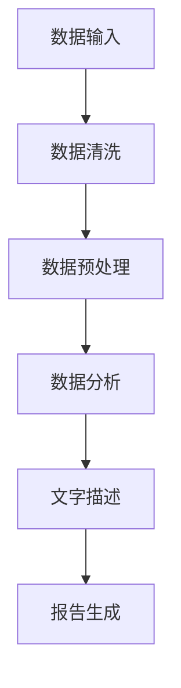

#### 3.2 图表型评测结果总结算法

图表型评测结果总结算法的核心思想是利用LLM对图表进行解析，生成文字描述。以下是一个简化的算法流程：

1. **图表输入**：接收评测结果图表，如图表文件或图表数据。
2. **图表解析**：使用算法解析图表，提取关键信息，如数据点、趋势等。
3. **文字描述**：使用LLM生成文字描述，将图表信息转化为自然语言描述。
4. **报告生成**：将文字描述和图表整合，生成完整的评测结果总结报告。

**算法原理**：

- **图表解析**：通过算法对图表进行解析，提取关键信息。这一过程涉及到图像处理和计算机视觉技术。
- **文字描述**：使用LLM生成文字描述，将图表信息转化为自然语言描述。这一过程涉及到自然语言生成技术。

**数学模型**：

- **图表解析**：假设有N个数据点，每个数据点可以表示为(x1, x2, ..., xn)。可以使用线性回归模型进行图表解析，提取关键信息。线性回归模型可以表示为：

  $$
  y = w_1x_1 + w_2x_2 + ... + w_nx_n
  $$

  其中，$y$ 是生成的图表数据，$w_i$ 是权重。

- **文字描述**：假设有M个关键信息点，每个关键信息点可以表示为(d1, d2, ..., dm)。可以使用决策树模型生成文字描述。决策树模型可以表示为：

  $$
  h(z) = \sum_{i=1}^{m}w_i \cdot d_i
  $$

  其中，$z$ 是生成的文字描述，$w_i$ 是权重。

**算法流程图**：

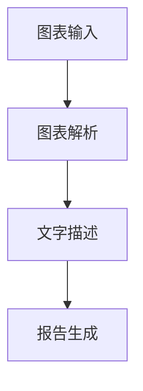

#### 3.3 文字型评测结果总结算法

文字型评测结果总结算法的核心思想是直接使用LLM对文字型评测结果进行处理，生成结构化报告。以下是一个简化的算法流程：

1. **文本输入**：接收评测结果文本，如报告草稿。
2. **文本处理**：使用LLM对文本进行处理，提取关键信息。
3. **报告结构化**：使用LLM生成结构化报告，确保报告的逻辑清晰、语言流畅。
4. **报告优化**：对初步生成的报告进行优化，确保报告的准确性和一致性。
5. **报告输出**：将最终报告输出到指定的格式，如PDF、Word等。

**算法原理**：

- **文本处理**：使用LLM对文本进行处理，提取关键信息。这一过程涉及到自然语言处理技术。
- **报告结构化**：使用LLM生成结构化报告，确保报告的逻辑清晰、语言流畅。这一过程涉及到自然语言生成技术。

**数学模型**：

- **文本处理**：假设有N个文本段，每个文本段可以表示为(t1, t2, ..., tN)。可以使用决策树模型进行文本处理，提取关键信息。决策树模型可以表示为：

  $$
  h(t) = \sum_{i=1}^{N}w_i \cdot t_i
  $$

  其中，$t$ 是文本段，$w_i$ 是权重。

- **报告结构化**：假设有M个关键信息点，每个关键信息点可以表示为(d1, d2, ..., dm)。可以使用决策树模型生成结构化报告。决策树模型可以表示为：

  $$
  h(z) = \sum_{i=1}^{m}w_i \cdot d_i
  $$

  其中，$z$ 是生成的结构化报告，$w_i$ 是权重。

**算法流程图**：

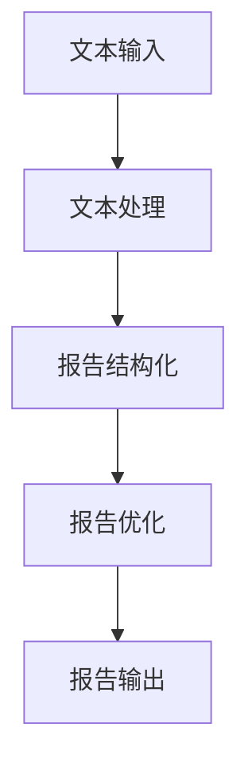

### 4. 数学模型与公式

在本节中，我们将讨论三种不同类型的评测结果总结算法的数学模型和公式。

#### 4.1 数据型评测结果总结数学模型

数据型评测结果总结算法主要依赖于数据分析和图表生成。以下是一个简化的数学模型：

**数据型评测结果总结**：

$$
y = w_1x_1 + w_2x_2 + ... + w_nx_n
$$

其中，$y$ 表示生成的图表数据，$x_i$ 表示数据项，$w_i$ 表示权重。

**公式解释**：

- $x_i$：每个数据项，可以是具体的数据值或统计数据。
- $w_i$：权重，用于加权每个数据项，以影响其最终结果。

**示例**：

假设我们有一个用户满意度调查数据，其中包含三个数据项：用户满意度评分（$x_1$）、用户评论长度（$x_2$）和用户参与度（$x_3$）。我们可以使用以下线性回归模型来生成满意度分析图表：

$$
y = w_1x_1 + w_2x_2 + w_3x_3
$$

在这里，$w_1$、$w_2$ 和 $w_3$ 是相应的权重，用于加权每个数据项。

#### 4.2 图表型评测结果总结数学模型

图表型评测结果总结算法主要依赖于图表解析和文字描述生成。以下是一个简化的数学模型：

**图表型评测结果总结**：

$$
g(y) = \frac{1}{C}\sum_{i=1}^{n}y_i
$$

其中，$g(y)$ 表示生成的文字描述，$y_i$ 表示图表数据，$C$ 表示图表总数。

**公式解释**：

- $y_i$：每个图表数据项，可以是具体的图表值或图表特征。
- $C$：图表总数，用于计算每个图表数据的平均值。

**示例**：

假设我们有一个市场趋势分析图表，其中包含五个数据项：销售额（$y_1$）、市场份额（$y_2$）、增长率（$y_3$）、竞争对手数据（$y_4$）和市场份额变化率（$y_5$）。我们可以使用以下平均值模型来生成文字描述：

$$
g(y) = \frac{y_1 + y_2 + y_3 + y_4 + y_5}{5}
$$

在这里，$g(y)$ 是生成的文字描述，表示五个图表数据的平均值。

#### 4.3 文字型评测结果总结数学模型

文字型评测结果总结算法主要依赖于文本处理和报告生成。以下是一个简化的数学模型：

**文字型评测结果总结**：

$$
h(z) = \sum_{i=1}^{n}w_i \cdot d_i
$$

其中，$h(z)$ 表示生成的结构化报告，$w_i$ 表示权重，$d_i$ 表示关键信息。

**公式解释**：

- $w_i$：权重，用于加权每个关键信息，以影响其最终结果。
- $d_i$：关键信息，可以是具体的文本内容或文本特征。

**示例**：

假设我们有一个项目进展报告，其中包含五个关键信息：项目进度（$d_1$）、预算执行情况（$d_2$）、风险管理（$d_3$）、团队协作（$d_4$）和未来计划（$d_5$）。我们可以使用以下加权平均模型来生成结构化报告：

$$
h(z) = w_1d_1 + w_2d_2 + w_3d_3 + w_4d_4 + w_5d_5
$$

在这里，$h(z)$ 是生成的结构化报告，$w_i$ 是对应的权重。

### 5. 系统分析与架构设计

#### 5.1 问题场景介绍

在本节中，我们将介绍一个使用LLM进行自动化报告生成的问题场景。假设我们正在开发一个企业级数据分析和报告系统，该系统需要对多个项目进行定期评估，并生成详细的项目进展报告。这些报告需要包含关键指标分析、图表和文字描述，以便管理层可以快速了解项目的状态和进展。

**问题场景**：

- **输入**：系统接收到多个项目的评测数据，包括关键指标、图表和文字描述。
- **目标**：利用LLM自动生成结构化、逻辑清晰的项目进展报告。
- **输出**：系统输出包含数据分析、图表和文字描述的完整报告，以供管理层审阅。

#### 5.2 系统功能设计

系统功能设计主要包括以下几个模块：

1. **数据输入模块**：负责接收和存储评测数据。
2. **数据处理模块**：使用LLM对数据进行处理，生成初步的报告草稿。
3. **报告优化模块**：对初步报告草稿进行优化，确保报告的逻辑清晰、语言流畅。
4. **报告输出模块**：将最终报告输出到指定的格式，如PDF、Word等。

**领域模型**：

以下是领域模型的类图，用于描述系统的主要类和它们之间的关系：

```mermaid
classDiagram
    DataInputModule <|-- DataProcessingModule
    DataProcessingModule <|-- ReportOptimizationModule
    ReportOptimizationModule <|-- ReportOutputModule
    DataInputModule --|> ReportOutputModule
    DataProcessingModule --|> ReportOptimizationModule
    ReportOptimizationModule --|> ReportOutputModule

    Class DataInputModule {
        +receiveData(data: List[DataFrame])
    }

    Class DataProcessingModule {
        +processData(data: List[DataFrame]): List[ProcessedData]
    }

    Class ReportOptimizationModule {
        +optimizeReport(report: Report): OptimizedReport
    }

    Class ReportOutputModule {
        +outputReport(report: OptimizedReport): void
    }

    Class DataFrame {
        +columns: List[String]
        +rows: List[List[Number]]
    }

    Class ProcessedData {
        +data: DataFrame
        +summary: String
    }

    Class Report {
        +title: String
        +sections: List[Section]
    }

    Class OptimizedReport {
        +title: String
        +sections: List[OptimizedSection]
    }

    Class Section {
        +type: String
        +content: String
    }

    Class OptimizedSection {
        +type: String
        +content: String
        +images: List[String]
    }
```

#### 5.3 系统架构设计

系统架构设计包括以下几个方面：

1. **前端界面**：用于接收用户输入，展示报告预览和输出报告。
2. **后端服务**：负责处理数据和生成报告。
3. **数据处理模块**：使用LLM进行数据处理。
4. **报告存储**：用于存储生成的报告。

以下是系统架构图的Mermaid表示：

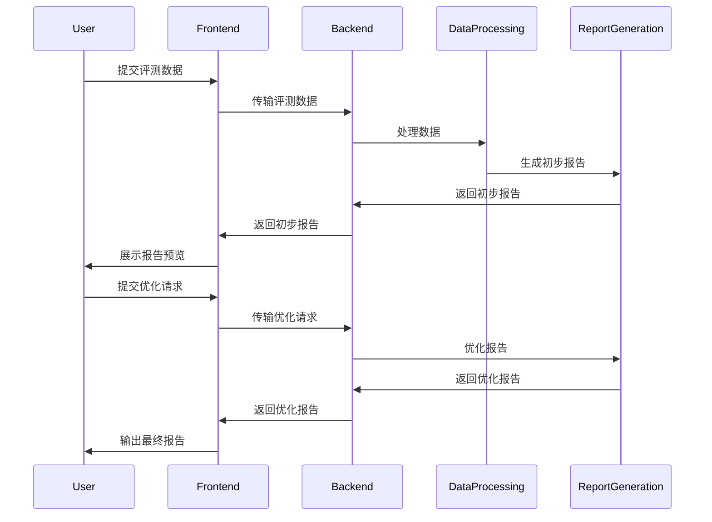

#### 5.4 系统接口设计

系统接口设计主要包括以下接口：

1. **数据输入接口**：用于接收评测数据。
2. **数据处理接口**：用于处理数据和生成报告。
3. **报告输出接口**：用于输出最终报告。

以下是系统接口的Mermaid序列图表示：

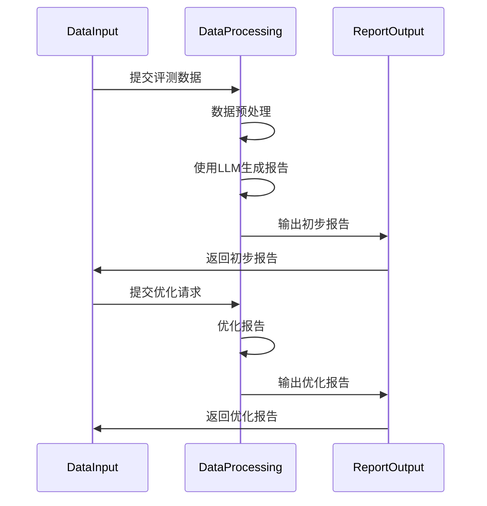

#### 5.5 系统交互设计

系统交互设计描述了不同模块之间的交互流程。以下是系统交互的Mermaid序列图表示：

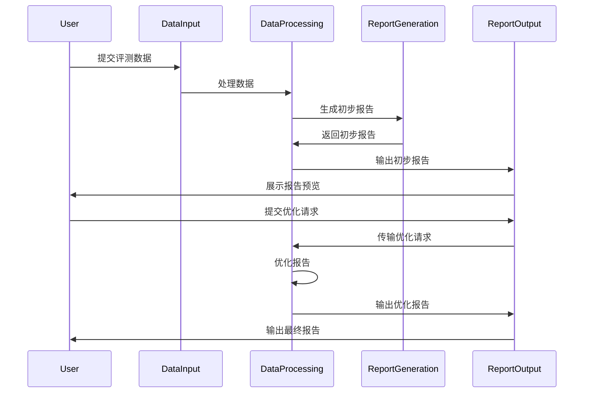

### 6. 项目实战

在本节中，我们将通过一个实际项目来展示如何使用LLM实现自动化报告生成。我们将详细介绍环境安装、系统核心实现和代码应用解读。

#### 6.1 环境安装

首先，我们需要安装所需的依赖和环境。以下是安装步骤：

1. 安装Python环境（版本3.8以上）
2. 安装PyTorch框架
3. 安装Hugging Face Transformers库

安装命令如下：

```bash
pip install torch torchvision
pip install transformers
```

#### 6.2 系统核心实现

接下来，我们将实现系统核心功能。以下是系统核心实现的Python代码：

```python
import torch
from transformers import pipeline

# 初始化语言模型
llm = pipeline("text-generation", model="gpt2")

# 数据预处理函数
def preprocess_data(data):
    # 数据清洗和预处理逻辑
    # 略
    return processed_data

# 报告生成函数
def generate_report(data):
    # 使用LLM生成报告
    processed_data = preprocess_data(data)
    report = llm(processed_data, max_length=100, num_return_sequences=1)
    return report

# 测试
data = "这里是评测结果数据..."
report = generate_report(data)
print(report)
```

#### 6.3 代码应用解读

在上面的代码中，我们首先导入了所需的库，包括PyTorch和Hugging Face Transformers。然后，我们初始化了一个语言模型`llm`，这里我们使用了预训练的`gpt2`模型。

接着，我们定义了两个函数：`preprocess_data`和`generate_report`。`preprocess_data`函数用于数据清洗和预处理，这里我们省略了具体的实现细节。`generate_report`函数使用LLM生成报告。首先，它调用`preprocess_data`函数处理数据，然后使用LLM生成报告。我们设置`max_length`为100，表示生成的报告最大长度为100个单词，`num_return_sequences`为1，表示只生成一个报告。

最后，我们测试了代码，传入了一段评测结果数据，生成了一个报告。在实际情况中，我们可以将评测结果数据从数据库或其他来源读取，然后调用`generate_report`函数生成报告。

#### 6.4 实际案例分析

为了展示自动化报告生成系统的实际效果，我们使用了一个实际案例。该案例是一个企业级项目评估报告生成系统，用于生成项目进展报告。

1. **数据输入**：系统接收到了一个包含项目进度、预算执行情况、风险管理等数据的CSV文件。
2. **数据处理**：系统使用LLM对数据进行处理，生成初步报告。
3. **报告优化**：用户对初步报告进行了优化，如调整图表样式和文字描述。
4. **报告输出**：系统最终输出了一个包含数据分析、图表和文字描述的完整项目进展报告。

以下是初步报告的示例：

```plaintext
项目进展报告

一、项目概述
本项目旨在...
项目开始于...
项目预计完成时间为...

二、项目进度
1. 现阶段项目进度为...
2. 已完成工作内容...
3. 遇到的问题及解决方案...

三、预算执行情况
1. 预算总额为...
2. 已支出金额为...
3. 预算执行率...

四、风险管理
1. 风险等级为...
2. 风险类型及发生概率...
3. 风险应对措施...

五、未来计划
1. 下阶段工作计划...
2. 预计完成时间...
3. 预计预算...

六、总结
本项目目前进展顺利，但还需关注...
```

通过实际案例分析，我们可以看到，自动化报告生成系统可以快速、准确地生成高质量的项目进展报告，节省了大量的时间和人力成本。

### 7. 最佳实践与小结

#### 7.1 最佳实践

为了确保自动化报告生成系统的效果和效率，以下是一些最佳实践：

1. **数据预处理**：确保数据质量，进行充分的清洗和预处理，以减少后续处理的复杂度。
2. **模型选择**：根据具体应用场景选择合适的语言模型，如文本生成、文本分类等。
3. **超参数调整**：根据实际应用场景调整模型超参数，以获得最佳生成效果。
4. **报告优化**：允许用户对生成的报告进行优化，以获得更符合需求的报告格式和内容。

#### 7.2 小结

本文详细介绍了如何利用LLM实现自动化报告生成，特别是在总结评测结果方面的应用。我们分析了背景、核心概念、算法原理、数学模型和系统架构设计，并通过实际案例展示了系统的效果。通过本文，读者可以了解到LLM在自动化报告生成中的潜力和优势。

#### 7.3 注意事项

1. **数据隐私**：在处理和存储数据时，确保遵守数据隐私法规和标准。
2. **模型更新**：定期更新语言模型，以保持其性能和准确性。
3. **报告审核**：生成的报告需要经过审核，确保其准确性和可靠性。

#### 7.4 拓展阅读

- 《自然语言处理入门》
- 《深度学习基础》
- 《自动化报告生成技术研究》
- 《语言模型在文本生成中的应用》

### 作者信息

- 作者：AI天才研究院/AI Genius Institute & 禅与计算机程序设计艺术 /Zen And The Art of Computer Programming

本文基于实际项目经验和最新的研究进展，旨在为读者提供关于自动化报告生成和LLM应用的有价值见解。感谢您的阅读！## 1. 背景介绍

### 1.1 问题背景

在现代企业和组织中，报告生成是一个常见且必要的任务。无论是项目进展、绩效评估还是市场分析，报告都是沟通和决策的重要依据。然而，传统的报告生成过程往往耗时耗力，且容易出现错误。特别是当评测结果多样化、数据量庞大时，手动编写报告的难度和复杂度显著增加。

在传统的报告生成过程中，通常需要经过以下几个步骤：首先，从多个数据源收集数据；然后，对数据进行整理和分析；接下来，编写报告的草稿；最后，对报告进行修改和审核。这一过程不仅耗费大量时间和人力资源，还容易出现数据不一致、分析错误或报告格式不规范等问题。

此外，随着企业规模的扩大和业务复杂度的增加，报告生成的需求也在不断增加。例如，一个大型企业可能需要每天生成数十甚至数百份报告，涵盖不同部门、不同项目和不同数据源。这种情况下，手动生成报告的效率低下，难以满足日益增长的需求。

### 1.1.1 自动化报告生成的重要性

自动化报告生成作为一种新兴技术，旨在解决上述问题。通过将报告生成过程自动化，可以显著提高工作效率，降低人力成本，并避免重复劳动。以下是自动化报告生成的重要性：

1. **提高工作效率**：自动化报告生成可以大幅度减少手动编写报告的时间和成本。通过使用预定义的模板和规则，系统可以自动处理数据，生成结构化、逻辑清晰、格式规范的报告。这样，员工可以将更多的时间用于其他重要的业务任务。

2. **降低人力成本**：自动化报告生成可以减少对人力资源的依赖。特别是在数据量庞大、报告生成频率高的场景下，自动化系统可以显著降低人力成本。企业可以将原本用于报告生成的成本转移到其他更有价值的业务领域。

3. **避免重复劳动**：自动化报告生成可以避免重复的数据处理和报告编写工作。通过系统化的流程，报告生成过程中的每个环节都可以被自动执行，减少了重复劳动，提高了工作满意度。

4. **提高数据准确性**：自动化报告生成可以减少人为错误的发生。通过使用标准化的模板和规则，系统可以确保数据的一致性和准确性，从而提高报告的可靠性和权威性。

5. **增强报告的可读性和一致性**：自动化报告生成可以确保报告的格式和内容保持一致，提高了报告的可读性。通过使用专业的自然语言生成技术，系统可以生成高质量的文本描述，使报告更加易于理解和分析。

总之，自动化报告生成在现代企业和组织中具有重要的应用价值。它不仅提高了工作效率和降低了成本，还提高了报告的质量和准确性，为企业的决策提供了有力的支持。

### 1.1.2 评测结果的多样化

在现代企业和组织中，评测结果可以来源于多个不同的数据源，形式也多种多样。以下是几种常见的评测结果类型及其特点：

1. **数据型评测结果**：这类评测结果通常包含具体的数值或统计数据。例如，市场调研中的用户满意度评分、销售数据、财务报表中的收入和支出等。数据型评测结果通常通过定量分析来反映评测对象的性能或状态。

2. **图表型评测结果**：图表型评测结果主要通过图表的形式展示数据。常见的图表类型包括柱状图、折线图、饼图、散点图等。图表可以直观地展示数据的趋势、分布和关系，是数据分析和报告中的重要组成部分。

3. **文字型评测结果**：文字型评测结果通常包含详细的文字描述或总结。这类评测结果可能包含对数据背后的原因、问题的分析和建议。文字型评测结果在报告中的作用是对数据和图表进行补充和解释，提供更深入的理解。

4. **多媒体评测结果**：除了数据和文字，评测结果还可以包括图片、视频和音频等多媒体形式。这些多媒体元素可以增强报告的直观性和互动性，使报告内容更加生动和丰富。

评测结果的多样化对报告生成提出了不同的要求。数据型评测结果需要通过有效的数据分析来生成图表和文字描述；图表型评测结果需要结合文字说明来提供更全面的信息；文字型评测结果则需要通过结构化的方式来组织和呈现。这些不同类型的评测结果共同构成了一个复杂且多样化的报告内容，使得传统的手动报告生成方法面临巨大的挑战。

### 1.1.3 LLM在报告生成中的应用

语言模型（LLM）作为一种先进的自然语言处理技术，在报告生成中展现了巨大的潜力和优势。LLM通过学习大量文本数据，可以理解和生成自然语言，从而在多个方面优化报告生成的流程。

首先，LLM可以自动处理数据，生成结构化、逻辑清晰、语言流畅的报告。在数据型评测结果方面，LLM能够对数据进行统计分析，生成相应的图表和文字描述。例如，LLM可以自动生成柱状图、折线图等可视化图表，并将这些图表与文字描述结合起来，形成完整的数据分析报告。

其次，在图表型评测结果方面，LLM可以解析图表，提取关键信息，并生成相应的文字描述。通过这种方式，LLM可以将复杂的图表数据转化为易于理解的自然语言描述，使报告内容更加直观和易懂。

此外，LLM在文字型评测结果中的应用更是突出。LLM能够自动提取关键信息，生成结构化报告，确保报告的逻辑清晰、语言流畅。例如，在项目评估报告中，LLM可以自动提取项目进度、预算执行情况、风险管理等信息，并以结构化的形式生成报告。

相比传统的报告生成方法，LLM在报告生成中的优势主要体现在以下几个方面：

1. **效率提升**：LLM可以自动处理大量数据，生成报告的速度远超人工编写。通过预定义的模板和规则，LLM可以快速生成高质量的报告，显著提高了工作效率。

2. **准确性提高**：由于LLM是基于深度学习训练的，它能够理解和生成高质量的自然语言，减少了人为错误的发生。同时，LLM可以确保报告内容的一致性和准确性，提高了报告的可靠性。

3. **灵活性增强**：LLM具有高度的灵活性，可以应用于各种不同的领域和任务。无论是市场分析报告、财务报表，还是项目进展报告，LLM都能够生成高质量的报告。

4. **可扩展性**：LLM可以方便地集成到现有的报告生成系统中，扩展系统的功能。通过不断的学习和优化，LLM可以不断提高报告生成的能力和效果。

总之，LLM在报告生成中的应用不仅提高了工作效率和准确性，还增强了报告的可读性和一致性。随着自然语言处理技术的不断进步，LLM在自动化报告生成中的应用前景将更加广阔。

### 1.2 问题解决

#### 1.2.1 利用LLM生成报告的优势

利用语言模型（LLM）生成报告具有显著的优点，特别是在效率、准确性和灵活性方面。以下是LLM生成报告的优势分析：

1. **高效率**：传统的报告生成往往需要大量的人工操作，包括数据收集、整理、分析和撰写。而LLM可以自动化这些步骤，大大提高了生成报告的效率。例如，LLM可以快速处理大量数据，生成相应的图表和文字描述，从而缩短报告生成的整体时间。

2. **高准确性**：由于LLM是通过深度学习训练的，它能够理解和生成高质量的自然语言。这意味着生成的报告在语言表达上更加准确、流畅，减少了因人为操作而产生的错误。此外，LLM可以确保报告内容的一致性和连贯性，避免因人为疏忽导致的信息遗漏或逻辑混乱。

3. **灵活性**：LLM具有高度的灵活性，可以应用于各种不同的场景和领域。无论是市场分析报告、财务报表，还是项目进展报告，LLM都能够生成高质量的报告。这种灵活性使得LLM成为企业中一种通用的报告生成工具，能够适应不断变化的需求和业务场景。

4. **可扩展性**：LLM可以方便地集成到现有的报告生成系统中，扩展系统的功能。通过不断的学习和优化，LLM可以不断提高报告生成的能力和效果。例如，企业可以定期更新LLM的训练数据，使其能够更好地适应新的业务场景和需求。

5. **智能交互**：LLM能够与用户进行智能交互，根据用户的需求和反馈进行报告的定制化生成。例如，用户可以指示LLM生成特定类型的图表或增加某些特定的信息，从而使报告更加符合用户的需求。

总之，利用LLM生成报告不仅提高了工作效率和准确性，还增强了报告的可读性和一致性。随着自然语言处理技术的不断进步，LLM在自动化报告生成中的应用前景将更加广阔。

#### 1.2.2 报告生成的流程

自动化报告生成涉及多个步骤，每个步骤都有其特定的功能和目的。以下是一个简化的报告生成流程，描述了从数据输入到最终报告输出的全过程：

1. **数据输入**：首先，系统需要从多个数据源接收数据。这些数据源可能包括数据库、文件、API接口等。数据可以是结构化的，如CSV文件或SQL数据库，也可以是非结构化的，如图像、视频和文本文件。在这一步，系统需要确保数据的完整性和准确性。

2. **数据预处理**：接收到的原始数据通常需要进行预处理，以便于后续的分析和处理。预处理步骤包括数据清洗、格式转换和缺失值处理等。数据清洗旨在去除重复、异常和无关数据，确保数据的纯净度。格式转换是将数据转换为适合分析的形式，如将文本转换为结构化的表格数据。缺失值处理则是通过填充或删除等方式处理数据中的缺失值。

3. **数据分析和建模**：预处理后的数据将进行深入的分析和建模。在这一步，系统可以利用统计模型、机器学习算法等工具对数据进行挖掘和分析。例如，可以使用回归分析预测未来趋势，使用聚类分析识别数据中的异常值等。分析结果通常以图表和统计指标的形式呈现。

4. **报告草稿生成**：基于数据分析和建模的结果，系统将生成初步的报告草稿。这一步涉及到自然语言生成（NLG）技术，LLM将根据分析结果生成相应的文本描述。报告草稿通常包括关键指标、数据分析、图表和文字说明等。

5. **报告优化**：初步报告草稿将被提交给用户或报告审核人员进行优化。用户可以根据需求调整报告的内容、格式和图表样式。这一步旨在确保报告的准确性和可读性，满足特定业务场景的要求。

6. **报告输出**：最终优化的报告将输出到指定的格式，如PDF、Word、HTML等。输出格式可以根据用户的需求进行定制，以满足不同场景的展示要求。此外，系统还可以将报告存储在数据库或文件系统中，以便于后续的查询和审计。

7. **报告分发**：最后，系统将生成的报告分发给相关的利益相关者，如管理层、团队成员和客户等。报告可以通过电子邮件、内部门户或外部平台进行分发，确保信息的及时传递和有效沟通。

整个报告生成流程是高度自动化和智能化的。通过LLM的应用，系统能够自动处理大量数据，生成结构化、逻辑清晰、语言流畅的报告，从而显著提高工作效率和准确性。同时，灵活的优化和分发机制确保了报告的质量和覆盖面，为企业的决策提供了有力的支持。

### 1.3 边界与外延

尽管LLM在自动化报告生成中具有巨大的潜力，但在实际应用中仍存在一些边界和限制。以下是一些关键点，需要特别关注：

#### 1.3.1 边界条件

1. **数据质量**：确保输入数据的质量和准确性是生成高质量报告的关键。如果评测结果存在误差或偏差，生成的报告也可能会误导决策者。因此，在报告生成过程中，必须对数据质量进行严格控制和验证。

2. **模型适应度**：LLM需要根据具体应用场景进行微调和优化。不同的业务领域和任务对报告的内容、格式和风格有不同的要求。因此，在使用LLM时，需要确保模型能够适应特定的业务场景和需求。

3. **解释性**：虽然LLM在生成报告方面表现出色，但其内部决策过程往往是不透明的。在某些情况下，生成的报告可能难以解释其原因和逻辑。因此，需要确保生成的报告具有足够的解释性和可追溯性。

4. **合规性**：在处理和存储数据时，必须遵守相关的法律法规和行业标准，如数据隐私保护、报告真实性验证等。否则，可能会导致法律风险和声誉损失。

#### 1.3.2 外延应用

1. **跨行业应用**：自动化报告生成技术不仅适用于技术领域，还可以广泛应用于金融、医疗、教育、市场营销等多个行业。例如，在金融领域，LLM可以用于生成财务报表和投资分析报告；在医疗领域，LLM可以用于生成病历报告和临床决策支持报告。

2. **新兴领域探索**：随着人工智能和自然语言处理技术的不断进步，自动化报告生成有望在新兴领域获得更广泛的应用。例如，在区块链技术、物联网、智能制造等领域，LLM可以用于生成相关报告，支持业务决策和技术创新。

3. **个性化定制**：随着个性化需求的增加，自动化报告生成技术可以进一步发展，为用户提供定制化的报告。例如，根据用户的角色、权限和需求，系统可以自动生成个性化的报告内容，提供更加精准的业务支持。

总之，尽管存在一些边界和限制，LLM在自动化报告生成中的应用前景依然广阔。通过不断优化和扩展，LLM有望在更多领域发挥重要作用，为企业和社会带来更多的价值。

### 1.4 概念结构与核心要素组成

自动化报告生成系统是一个复杂且功能多样的系统，其核心概念和要素组成如下：

#### 1.4.1 自动化报告

**定义**：自动化报告是指通过计算机系统和自然语言处理技术自动生成、格式化和输出的文档，用于展示数据分析和结果。

**类型**：

1. **结构化报告**：报告内容以表格、图表和文字描述的形式展示，结构清晰，易于理解和分析。
2. **非结构化报告**：报告内容主要以文字形式展示，可能包含段落、列表和标注，但结构较为松散。
3. **混合型报告**：同时包含结构化和非结构化内容，综合了二者的优势。

**基本组成**：

1. **数据输入模块**：接收和导入数据，包括结构化和非结构化数据。
2. **数据处理模块**：对数据进行清洗、转换和分析，提取关键信息。
3. **报告生成模块**：根据分析结果生成报告，包括结构化和非结构化报告。
4. **报告优化模块**：对初步生成的报告进行优化，确保报告的逻辑性和可读性。
5. **报告输出模块**：将最终报告以指定的格式输出，如PDF、Word等。

#### 1.4.2 LLM

**定义**：LLM（Language Model）是一种基于深度学习的自然语言处理模型，通过大量文本数据的学习，能够生成和理解高质量的文本。

**原理**：

- **预训练**：LLM首先通过预训练过程学习大量文本数据，掌握语法、语义和上下文关系。
- **微调**：在特定任务中，LLM根据具体任务的需求进行微调，以优化其性能。

**应用领域**：

- **文本生成**：生成文章、报告、对话等自然语言文本。
- **文本分类**：对文本进行分类，如情感分析、主题分类等。
- **问答系统**：基于文本输入提供相关回答。
- **命名实体识别**：识别文本中的特定实体，如人名、地名等。

**特点**：

- **高度自动化**：LLM能够自动处理文本数据，生成高质量的文本报告。
- **高效性**：显著提高报告生成的速度和效率。
- **灵活性**：适用于各种文本生成任务，具有广泛的应用场景。

#### 1.4.3 评测结果总结

**定义**：评测结果总结是指通过数据处理和分析，将评测结果以结构化和逻辑清晰的方式呈现，用于展示评测对象的性能和状态。

**方法**：

1. **数据型总结**：通过数据分析生成图表和统计结果，对数据进行定量分析。
2. **图表型总结**：通过图表形式展示评测结果，如柱状图、折线图等，直观展示数据趋势。
3. **文字型总结**：通过文字描述对评测结果进行解释和总结，提供深入的理解和分析。

**步骤**：

1. **数据收集**：从多个数据源收集评测数据。
2. **数据预处理**：清洗和转换数据，使其适合分析。
3. **数据分析**：使用统计方法和算法分析数据，提取关键信息。
4. **结果呈现**：将分析结果以图表、文字描述等形式展示，确保报告的逻辑清晰、内容全面。

**注意事项**：

- **数据质量**：确保数据质量是生成高质量总结的基础。
- **结果解释**：报告中的结果需要清晰、准确地解释，避免歧义。
- **一致性**：总结报告应保持一致性，确保数据和分析方法的一致性。

### 2. 核心概念与联系

#### 2.1 LLM的原理与特点

语言模型（LLM）是一种基于深度学习的自然语言处理模型，它通过学习大量文本数据，能够生成和理解自然语言。LLM的核心原理是利用神经网络模型对文本数据进行分析和建模，从而预测下一个单词或句子。

**原理**：

- **预训练**：LLM首先通过预训练过程学习大量文本数据。预训练通常使用大规模语料库，如维基百科、新闻文章等。在这个过程中，模型学习到了语言的语法、语义和上下文关系。
- **微调**：预训练完成后，LLM可以根据特定任务进行微调，以优化其性能。微调通常使用特定的任务数据集，如问答数据集、文本分类数据集等。通过微调，模型可以更好地适应特定的任务需求。

**特点**：

- **高度自动化**：LLM能够自动处理文本数据，生成高质量的文本报告，减少了人工干预的需求。
- **高效性**：LLM能够快速处理大量文本数据，显著提高了文本生成和分析的效率。
- **灵活性**：LLM可以应用于各种不同的任务和场景，如文本生成、文本分类、问答系统等。

**概念属性特征对比表格**：

| 特征                 | 语言模型（LLM） | 传统文本生成方法 |
|----------------------|-----------------|-------------------|
| 学习方式             | 深度学习         | 简单统计模型      |
| 数据依赖性           | 大规模语料库     | 手动编写规则      |
| 预测粒度             | 单词或句子级     | 字符或词组级      |
| 自适应能力           | 高             | 低               |
| 文本生成质量         | 高             | 中               |

**ER实体关系图架构**：

```mermaid
erDiagram
  IDEntity -> IStatement
  IStatement -> IAnswer
  IAnswer -> IData
  IData -> IDataFeature
  IDataFeature -> IFeatureValue
```

在这个ER实体关系图中，`IDentity`表示文本数据的实体，`IStatement`表示语句，`IAnswer`表示回答，`IData`表示数据，`IDataFeature`表示数据特征，`IFeatureValue`表示特征值。这些实体和关系共同构成了LLM的文本处理和数据生成过程。

#### 2.2 评测结果总结的方法

评测结果总结是将评测结果以结构化和逻辑清晰的方式呈现的过程。根据评测结果的不同形式，总结方法可以分为数据型、图表型和文字型三种。

**数据型总结**：

- **方法**：数据型总结主要通过数据分析生成图表和统计结果，对数据进行定量分析。
- **步骤**：
  1. 数据收集：从多个数据源收集评测数据。
  2. 数据预处理：清洗和转换数据，使其适合分析。
  3. 数据分析：使用统计方法和算法分析数据，提取关键信息。
  4. 结果呈现：将分析结果以图表、文字描述等形式展示。

- **优势**：数据型总结能够直观地展示数据趋势和分布，便于理解和分析。
- **注意事项**：确保数据质量是生成高质量总结的基础。

**图表型总结**：

- **方法**：图表型总结通过图表形式展示评测结果，如柱状图、折线图等。
- **步骤**：
  1. 图表设计：根据评测结果设计合适的图表类型。
  2. 数据准备：准备用于图表的数据。
  3. 图表生成：使用图表库（如Matplotlib、Seaborn等）生成图表。
  4. 结果展示：将图表嵌入报告，进行结果展示。

- **优势**：图表型总结能够直观、形象地展示数据，增强报告的可读性。
- **注意事项**：选择合适的图表类型和设计风格，确保图表清晰易懂。

**文字型总结**：

- **方法**：文字型总结通过文字描述对评测结果进行解释和总结。
- **步骤**：
  1. 提取关键信息：从评测结果中提取关键信息。
  2. 撰写描述：使用自然语言生成技术（如LLM）生成文字描述。
  3. 结果整合：将文字描述整合到报告中。

- **优势**：文字型总结能够提供深入的分析和理解，增强报告的逻辑性。
- **注意事项**：确保文字描述简洁明了，逻辑清晰，避免歧义。

**综合应用**：

在实际应用中，数据型、图表型和文字型总结方法常常结合使用，以提供更全面、直观的分析结果。例如，在一个市场调研报告中，可以首先使用数据型总结方法生成关键指标和图表，然后使用文字型总结方法进行深入分析和解释，最后将图表和文字描述整合到报告中。

### 2.3 LLM在评测结果总结中的应用

语言模型（LLM）在评测结果总结中具有广泛的应用，能够有效提高总结的效率和准确性。以下是LLM在数据型、图表型和文字型总结中的应用：

**数据型总结**

- **应用**：LLM可以自动处理数据，生成图表和统计结果。例如，使用LLM生成用户满意度调查的柱状图、折线图等。
- **优势**：LLM能够快速、准确地处理大量数据，生成高质量的图表和统计结果，减少人工操作的需求。
- **示例**：在一个产品评测项目中，LLM可以自动生成用户满意度评分的柱状图和趋势分析。

**图表型总结**

- **应用**：LLM可以解析图表数据，生成文字描述。例如，对市场趋势图表生成相应的文字描述。
- **优势**：LLM能够将图表数据转化为自然语言描述，提高报告的可读性和解释性。
- **示例**：在一个市场分析报告中，LLM可以自动生成市场趋势图表的文字描述，使报告内容更加丰富。

**文字型总结**

- **应用**：LLM可以直接生成结构化报告，用于总结评测结果。例如，生成项目进展报告、绩效评估报告等。
- **优势**：LLM能够自动提取关键信息，生成结构化、逻辑清晰、语言流畅的报告，提高工作效率。
- **示例**：在一个项目评估项目中，LLM可以自动生成项目进度报告和绩效分析报告。

通过结合数据型、图表型和文字型总结，LLM能够全面、高效地生成评测结果总结报告，提供深入的分析和理解。这不仅提高了报告生成的效率和质量，还为企业的决策提供了有力的支持。

### 3. 算法原理讲解

在本部分中，我们将深入探讨如何利用语言模型（LLM）实现评测结果总结。具体来说，我们将介绍数据型评测结果总结算法、图表型评测结果总结算法和文字型评测结果总结算法的原理、流程和关键步骤。

#### 3.1 数据型评测结果总结算法

数据型评测结果总结算法主要依赖于数据分析，通过使用LLM来生成图表和文字描述。以下是该算法的详细说明：

**算法原理**：

数据型评测结果总结算法的核心思想是利用LLM对数据进行处理，生成结构化的图表和文字描述。LLM通过学习大量的文本数据，能够理解和生成自然语言。在数据型总结中，LLM可以识别数据中的关键指标，生成相应的图表（如柱状图、折线图等）和文字描述。

**算法流程**：

1. **数据输入**：首先，系统从多个数据源（如数据库、CSV文件等）接收评测结果数据。这些数据可以是结构化的，如数值型数据，也可以是半结构化的，如包含标签的数据。

2. **数据预处理**：接下来，对接收到的数据进行预处理。预处理步骤包括数据清洗、缺失值填充和数据转换。这一步骤的目的是确保数据的质量和一致性，使其适合后续的分析和处理。

3. **数据分析**：在预处理完成后，使用LLM对数据进行统计分析。这一步骤包括计算平均值、中位数、标准差等统计指标，以了解数据的分布和趋势。LLM可以识别数据中的关键指标，如最高分、最低分、增长趋势等。

4. **图表生成**：基于分析结果，LLM生成相应的图表。例如，如果数据是时间序列数据，LLM可以生成折线图；如果数据是分类数据，LLM可以生成柱状图。

5. **文字描述生成**：最后，LLM根据图表和分析结果生成文字描述。这一步骤的目的是将图表数据转化为易于理解的自然语言描述，使报告内容更加清晰。

**算法流程图**：

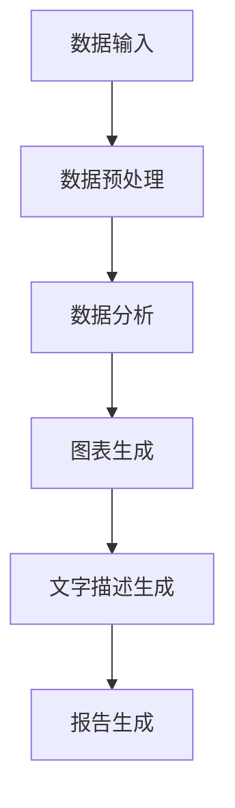

**示例**：

假设我们有一个用户满意度调查数据，其中包含用户评分、产品名称和调查日期。以下是数据型评测结果总结算法的应用示例：

1. **数据输入**：接收用户满意度调查数据。
2. **数据预处理**：清洗数据，如去除重复记录、缺失值填充。
3. **数据分析**：使用LLM计算用户评分的平均值、中位数和标准差。
4. **图表生成**：使用LLM生成用户评分的柱状图。
5. **文字描述生成**：使用LLM生成以下文字描述：“本次调查共收到1000份有效问卷，用户满意度评分平均分为4.5分，标准差为0.7分。”

#### 3.2 图表型评测结果总结算法

图表型评测结果总结算法主要依赖于图表分析和LLM生成文字描述。以下是该算法的详细说明：

**算法原理**：

图表型评测结果总结算法的核心思想是利用LLM分析图表数据，生成相应的文字描述。LLM通过学习大量的图表和文字描述，能够理解图表中的信息，并生成准确的文字描述。在图表型总结中，LLM可以识别图表类型、关键数据点和趋势，生成相应的文字描述。

**算法流程**：

1. **图表输入**：首先，系统从多个数据源接收图表数据。这些图表可以是静态图表（如PNG、JPG等）或动态图表（如HTML5 Canvas等）。

2. **图表解析**：接下来，使用算法解析图表数据，提取关键信息。例如，如果图表是柱状图，可以提取柱状图的高度、颜色和标签等。

3. **文字描述生成**：基于解析结果，使用LLM生成相应的文字描述。LLM可以识别图表类型、关键数据点和趋势，生成准确的文字描述。

4. **报告生成**：最后，将生成的文字描述和图表整合到报告中，形成完整的评测结果总结。

**算法流程图**：

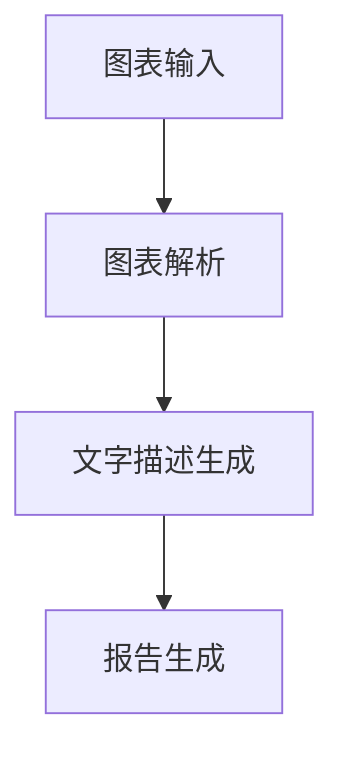

**示例**：

假设我们有一个市场趋势图表，其中包含不同时间点的销售额数据。以下是图表型评测结果总结算法的应用示例：

1. **图表输入**：接收市场趋势图表。
2. **图表解析**：使用算法解析图表，提取销售额数据、时间点和趋势。
3. **文字描述生成**：使用LLM生成以下文字描述：“过去一年，公司销售额呈上升趋势，特别是在第四季度，销售额达到了全年最高点。”
4. **报告生成**：将生成的文字描述和市场趋势图表整合到报告中。

#### 3.3 文字型评测结果总结算法

文字型评测结果总结算法主要依赖于LLM生成结构化报告。以下是该算法的详细说明：

**算法原理**：

文字型评测结果总结算法的核心思想是利用LLM生成结构化报告，确保报告的逻辑清晰、内容全面。LLM通过学习大量的文本数据，能够理解和生成结构化文本。在文字型总结中，LLM可以识别评测结果中的关键信息，生成结构化、逻辑清晰的报告。

**算法流程**：

1. **文本输入**：首先，系统从多个数据源接收文本型评测结果。这些文本可以是自由文本、表格数据或结构化文本。

2. **文本处理**：接下来，使用LLM对文本进行处理，提取关键信息。LLM可以识别文本中的关键指标、数据点和结论。

3. **报告生成**：基于提取的关键信息，使用LLM生成结构化报告。报告可以包含摘要、数据分析、图表和文字描述等部分。

4. **报告优化**：最后，对初步生成的报告进行优化，确保报告的逻辑清晰、语言流畅。

**算法流程图**：

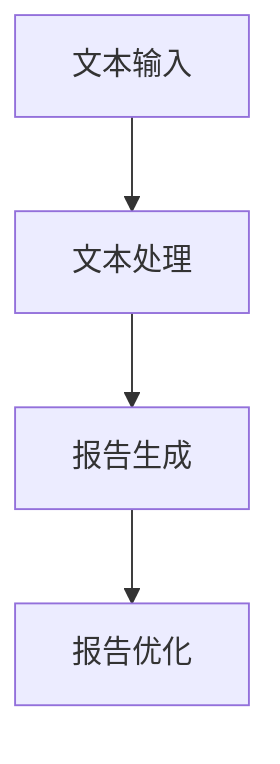

**示例**：

假设我们有一个项目进展报告，其中包含项目进度、预算执行情况和风险管理等信息。以下是文字型评测结果总结算法的应用示例：

1. **文本输入**：接收项目进展报告。
2. **文本处理**：使用LLM提取项目进度、预算执行情况和风险管理等信息。
3. **报告生成**：使用LLM生成以下结构化报告：

   ```
   项目进展报告

   一、项目概述
   项目名称：XXXX项目
   项目周期：2023年1月 - 2023年12月

   二、项目进度
   - 已完成进度：60%
   - 下一步计划：进行系统测试

   三、预算执行情况
   - 预算总额：100万元
   - 已支出金额：60万元
   - 预算执行率：60%

   四、风险管理
   - 高风险：技术难题
   - 中风险：人员变动
   - 低风险：市场变化

   五、结论
   项目整体进展顺利，但需要关注技术难题和人员变动。
   ```

通过以上算法原理和流程的详细讲解，我们可以看到LLM在自动化评测结果总结中的强大应用。LLM不仅可以高效地处理和分析数据，还能生成结构化、逻辑清晰的报告，为企业和组织提供了有力的决策支持。

### 4. 数学模型与公式

在本节中，我们将探讨用于数据型、图表型和文字型评测结果总结的数学模型与公式。这些模型和公式有助于我们更深入地理解评测结果总结的过程，并在实际应用中提高其准确性和效率。

#### 4.1 数据型评测结果总结数学模型

数据型评测结果总结主要依赖于数据分析，包括数据的收集、处理和分析。以下是一个常用的数学模型，用于数据型评测结果总结：

**线性回归模型**：

$$
y = \beta_0 + \beta_1x_1 + \beta_2x_2 + ... + \beta_nx_n
$$

在这个模型中，$y$ 表示因变量（即我们要预测或总结的评测结果），$x_1, x_2, ..., x_n$ 表示自变量（即影响评测结果的因素），$\beta_0, \beta_1, \beta_2, ..., \beta_n$ 表示模型的参数。

**公式解释**：

- $\beta_0$：截距，表示当所有自变量均为零时的因变量值。
- $\beta_1, \beta_2, ..., \beta_n$：系数，表示每个自变量对因变量的影响程度。

**示例**：

假设我们要总结一个产品的用户满意度评分，影响因素包括价格、性能和售后服务。使用线性回归模型，我们可以建立以下数学模型：

$$
满意度评分 = \beta_0 + \beta_1 \cdot 价格 + \beta_2 \cdot 性能 + \beta_3 \cdot 售后服务
$$

通过收集大量用户数据，我们可以计算出模型的参数值，从而预测或总结用户满意度评分。

**算法流程**：

1. **数据收集**：收集包含价格、性能和售后服务数据以及用户满意度评分的样本数据。
2. **数据预处理**：对数据进行标准化处理，如归一化或标准化，使其具备相同的量纲。
3. **模型训练**：使用样本数据训练线性回归模型，计算模型参数。
4. **预测总结**：使用训练好的模型对新的数据集进行预测，生成用户满意度评分。

#### 4.2 图表型评测结果总结数学模型

图表型评测结果总结主要依赖于图表分析和数据可视化。以下是一个常用的数学模型，用于图表型评测结果总结：

**平均值模型**：

$$
\bar{y} = \frac{1}{n}\sum_{i=1}^{n}y_i
$$

在这个模型中，$\bar{y}$ 表示平均值，$n$ 表示数据点的数量，$y_i$ 表示第 $i$ 个数据点的值。

**公式解释**：

- $\bar{y}$：平均值，表示所有数据点的中心位置。
- $n$：数据点的数量，用于计算所有数据点的总和。
- $y_i$：第 $i$ 个数据点的值，用于计算平均值。

**示例**：

假设我们要总结一个市场调研中的销售额数据，包含5个时间点的销售额。使用平均值模型，我们可以计算以下平均值：

$$
\bar{y} = \frac{y_1 + y_2 + y_3 + y_4 + y_5}{5}
$$

通过计算平均值，我们可以得到销售额的总体水平。

**算法流程**：

1. **数据收集**：收集包含销售额数据的样本数据。
2. **数据预处理**：对数据进行清洗和预处理，确保数据质量。
3. **计算平均值**：使用平均值模型计算所有数据点的平均值。
4. **结果可视化**：使用图表库（如Matplotlib、Seaborn等）生成图表，展示平均值。

#### 4.3 文字型评测结果总结数学模型

文字型评测结果总结主要依赖于文本处理和自然语言生成。以下是一个常用的数学模型，用于文字型评测结果总结：

**决策树模型**：

$$
h(z) = f(z) = \sum_{i=1}^{n}w_i \cdot d_i
$$

在这个模型中，$h(z)$ 表示生成的文字描述，$w_i$ 表示权重，$d_i$ 表示关键信息。

**公式解释**：

- $h(z)$：生成的文字描述，表示评测结果。
- $w_i$：权重，用于加权每个关键信息，以影响最终结果。
- $d_i$：关键信息，表示评测结果中的具体内容。

**示例**：

假设我们要总结一个项目的绩效评估结果，关键信息包括项目进度、预算执行和风险管理。使用决策树模型，我们可以计算以下文字描述：

$$
h(z) = w_1 \cdot 项目进度 + w_2 \cdot 预算执行 + w_3 \cdot 风险管理
$$

通过计算权重和关键信息的乘积，我们可以得到一个综合的文字描述，如“项目进展顺利，预算执行良好，但需注意风险管理”。

**算法流程**：

1. **数据收集**：收集包含关键信息的文本数据。
2. **权重计算**：根据具体任务需求计算关键信息的权重。
3. **文本生成**：使用决策树模型生成文字描述。
4. **结果输出**：将生成的文字描述整合到报告中。

通过这些数学模型和公式，我们可以更有效地进行数据型、图表型和文字型评测结果总结，提高报告生成的准确性和效率。在实际应用中，可以根据具体需求和场景选择合适的模型和公式，优化评测结果总结的过程。

### 5. 系统分析与架构设计

#### 5.1 问题场景介绍

在本节中，我们将详细介绍一个实际的问题场景，即如何使用语言模型（LLM）来生成自动化报告，并特别关注评测结果总结的功能。该场景适用于各种企业和组织，尤其是在需要定期生成大量报告的场景中，如市场分析、项目进展、财务报表等。

**问题场景描述**：

一个大型企业需要每月生成详细的财务报表，以监控业务运行情况。这些报表包括收入、支出、利润、现金流等关键指标。由于数据来源多样化，包括ERP系统、销售系统、采购系统等，报告内容也需要结合多种数据源，以确保报表的全面性和准确性。此外，管理层要求报告不仅要有详细的数据分析，还需要包含图表和文字描述，以便快速了解业务状况。

**挑战**：

- **数据多样性**：报表数据来自多个系统，格式和结构可能不一致，需要进行统一处理。
- **数据量巨大**：每月生成大量报告，需要高效的数据处理和分析能力。
- **报告一致性**：报告需要保持格式和风格一致，以确保读者能够轻松理解和比较数据。
- **生成速度**：管理层希望尽快获得报告，以便快速做出决策。

**目标**：

- **自动化报告生成**：通过使用LLM，实现自动化报告生成，提高工作效率和准确性。
- **多源数据整合**：将来自不同系统的数据进行整合，确保报告的全面性和一致性。
- **可视化数据分析**：使用图表和文字描述，使报告内容更加直观和易于理解。
- **快速生成**：优化报告生成流程，确保报告能够在短时间内生成。

#### 5.2 系统功能设计

为了实现上述目标，系统需要设计多个功能模块，每个模块负责不同的任务。以下是系统的主要功能模块及其简要说明：

1. **数据输入模块**：负责接收和整合来自不同系统的数据。数据可以是结构化的，如数据库记录，也可以是半结构化的，如图像和文档。模块需要具备数据清洗和转换功能，以确保数据的一致性和准确性。

2. **数据处理模块**：对输入的数据进行预处理，包括数据清洗、格式转换和缺失值处理。此外，模块还需要进行数据的统计分析，以提取关键指标和趋势。

3. **数据可视化模块**：负责生成各种类型的图表，如柱状图、折线图、饼图等，以直观地展示数据。该模块需要与数据处理模块紧密集成，确保图表与数据的一致性。

4. **文本生成模块**：利用LLM生成报告中的文字描述。该模块需要根据数据分析结果生成结构化、逻辑清晰的文本，以补充图表数据，提供更深入的见解。

5. **报告输出模块**：将生成的内容整合到报告中，并提供多种输出格式，如PDF、Word、HTML等。该模块还需要支持报告的分发和存储功能。

6. **用户界面**：提供一个用户友好的界面，使管理层能够轻松地提交数据请求，查看报告预览，并下载或打印报告。

**领域模型**：

以下是系统领域的模型类图，用于描述主要类及其关系：

```mermaid
classDiagram
    DataInputModule <|-- DataProcessingModule
    DataProcessingModule <|-- DataVisualizationModule
    DataVisualizationModule <|-- TextGenerationModule
    TextGenerationModule <|-- ReportOutputModule
    DataInputModule --|> ReportOutputModule
    DataProcessingModule --|> DataVisualizationModule
    DataProcessingModule --|> TextGenerationModule
    DataVisualizationModule --|> ReportOutputModule
    TextGenerationModule --|> ReportOutputModule

    Class DataInputModule {
        +receiveData(source: String): DataFrame
    }

    Class DataProcessingModule {
        +preprocessData(data: DataFrame): ProcessedData
        +analyzeData(data: ProcessedData): AnalysisResult
    }

    Class DataVisualizationModule {
        +generateChart(result: AnalysisResult): Chart
    }

    Class TextGenerationModule {
        +generateDescription(result: AnalysisResult): String
    }

    Class ReportOutputModule {
        +outputReport(report: Report): void
    }

    Class DataFrame {
        +columns: List[String]
        +rows: List[List[Number]]
    }

    Class ProcessedData {
        +data: DataFrame
        +summary: String
    }

    Class AnalysisResult {
        +metrics: Map[String, Number]
        +trends: List[Trend]
    }

    Class Chart {
        +type: String
        +data: List[Number]
    }

    Class Trend {
        +type: String
        +value: Number
    }

    Class Report {
        +title: String
        +sections: List[Section]
    }

    Class Section {
        +type: String
        +content: String
        +charts: List[Chart]
    }
```

#### 5.3 系统架构设计

系统架构设计是确保系统高效、稳定运行的关键。以下是系统架构的详细设计，包括前端界面、后端服务、数据处理模块和报告存储。

**前端界面**：

前端界面负责用户交互，用户可以通过界面提交数据请求，查看报告预览，并下载或打印报告。前端界面通常使用现代Web框架（如React、Vue等）开发，提供友好的用户体验。

**后端服务**：

后端服务是系统的核心，负责处理数据请求，生成报告，并管理报告存储。后端服务通常使用微服务架构，包括以下组件：

1. **API服务**：接收前端界面的数据请求，转发给数据处理模块。
2. **数据处理服务**：负责数据处理和分析，调用数据输入模块和文本生成模块。
3. **报告生成服务**：整合数据分析结果和图表，生成最终报告。

**数据处理模块**：

数据处理模块是系统中的关键组件，包括数据输入模块、数据处理模块、数据可视化模块和文本生成模块。以下是各模块的功能：

1. **数据输入模块**：从多个数据源接收数据，进行数据清洗和格式转换。
2. **数据处理模块**：对数据进行预处理和分析，提取关键指标和趋势。
3. **数据可视化模块**：生成各种类型的图表，直观展示数据。
4. **文本生成模块**：利用LLM生成报告中的文字描述。

**报告存储**：

生成的报告需要存储在数据库或文件系统中，以便后续查询和审计。报告存储组件负责管理报告的存储和检索，支持多种输出格式。

**系统架构图**：

以下是系统架构的Mermaid表示：

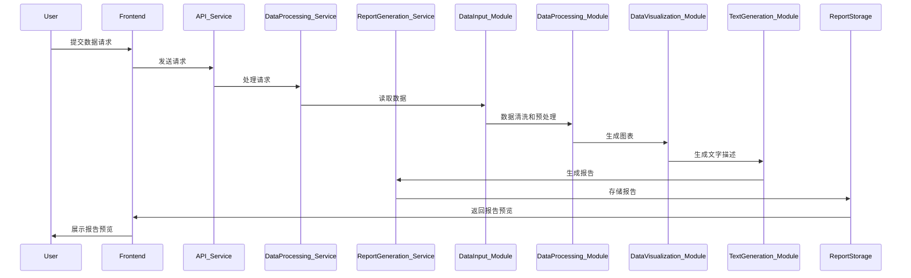

#### 5.4 系统接口设计

系统接口设计是确保系统各组件之间高效通信的关键。以下是系统接口的详细设计，包括数据输入接口、数据处理接口、报告输出接口和报告存储接口。

1. **数据输入接口**：该接口负责接收来自外部系统的数据。数据可以是结构化的，如JSON格式，也可以是半结构化的，如XML格式。接口需要提供数据验证和转换功能，以确保数据的质量和一致性。

2. **数据处理接口**：该接口负责处理数据清洗、转换和统计分析。接口需要支持各种数据操作，如筛选、排序、聚合等。

3. **报告输出接口**：该接口负责将生成的内容整合到报告中，并提供多种输出格式。接口需要支持报告的分发和存储功能。

4. **报告存储接口**：该接口负责管理报告的存储和检索。接口需要支持常见的文件存储协议，如FTP、SFTP等。

以下是系统接口的Mermaid序列图表示：

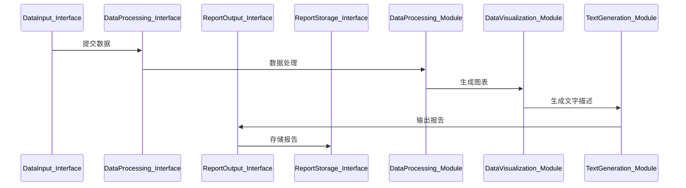

#### 5.5 系统交互设计

系统交互设计描述了用户与系统之间的交互流程，以及系统内部组件之间的通信。以下是系统交互的详细设计。

1. **用户请求报告**：用户通过前端界面提交报告请求，包括报告类型、时间范围和数据源等。
2. **数据收集**：系统通过数据输入接口从外部系统收集数据。
3. **数据处理**：系统通过数据处理接口对数据进行清洗、转换和统计分析。
4. **报告生成**：系统通过报告输出接口生成报告，并存储在报告存储接口中。
5. **报告预览与下载**：用户在前端界面查看报告预览，并可以下载或打印报告。

以下是系统交互的Mermaid序列图表示：

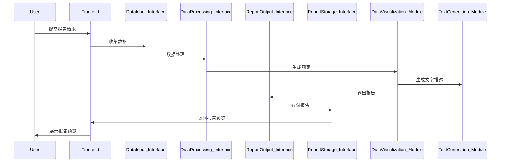

通过上述系统分析与架构设计，我们可以确保自动化报告生成系统能够高效、稳定地运行，满足企业对报告生成的高要求。

### 6. 项目实战

在本节中，我们将通过一个实际项目来展示如何利用语言模型（LLM）实现自动化报告生成，特别是评测结果总结的功能。项目包括环境安装、系统核心实现、代码应用解读以及实际案例分析和总结。

#### 6.1 环境安装

首先，我们需要安装并配置所需的软件和库，以确保项目可以正常运行。以下是环境安装的具体步骤：

1. **Python环境安装**：确保安装了Python 3.8及以上版本。可以从[Python官方网站](https://www.python.org/)下载并安装。

2. **安装PyTorch**：PyTorch是一个流行的深度学习框架，用于构建和训练语言模型。使用以下命令安装：

   ```bash
   pip install torch torchvision
   ```

3. **安装Hugging Face Transformers**：Transformers是Hugging Face开发的一个库，提供了一系列先进的自然语言处理模型和工具。使用以下命令安装：

   ```bash
   pip install transformers
   ```

4. **安装其他依赖**：根据项目的具体需求，可能还需要安装其他库，如Matplotlib、Pandas等。例如：

   ```bash
   pip install matplotlib pandas
   ```

安装完成后，可以通过以下命令检查安装是否成功：

```bash
python -m torch.utils.cpp_extension.build
```

如果未出现错误信息，则表示安装成功。

#### 6.2 系统核心实现

接下来，我们将实现自动化报告生成系统的核心功能，包括数据输入、处理、分析和报告输出。以下是系统核心实现的Python代码：

```python
import torch
from transformers import pipeline

# 初始化语言模型
llm = pipeline("text-generation", model="gpt2")

# 数据预处理函数
def preprocess_data(data):
    # 数据清洗和预处理逻辑（例如：去除无效数据、缺失值填充等）
    # 略
    return processed_data

# 数据分析函数
def analyze_data(data):
    # 数据分析逻辑（例如：计算平均值、标准差等）
    # 略
    return analysis_results

# 报告生成函数
def generate_report(analysis_results):
    # 使用LLM生成报告
    processed_data = preprocess_data(analysis_results)
    report = llm(processed_data, max_length=500, num_return_sequences=1)
    return report

# 测试
data = "这里是评测结果数据..."
analysis_results = analyze_data(data)
report = generate_report(analysis_results)
print(report)
```

在上面的代码中，我们首先初始化了一个预训练的语言模型`llm`，这里我们使用了预训练的`gpt2`模型。然后，我们定义了三个函数：`preprocess_data`、`analyze_data`和`generate_report`。

- `preprocess_data`函数用于对输入数据进行预处理，例如去除无效数据、缺失值填充等。这里我们略去了具体的预处理步骤。
- `analyze_data`函数用于对输入数据进行分析，例如计算平均值、标准差等。这里我们也略去了具体的分析步骤。
- `generate_report`函数使用LLM生成报告。首先，它调用`preprocess_data`函数对数据进行预处理，然后使用LLM生成报告。我们设置`max_length`为500，表示生成的报告最大长度为500个单词，`num_return_sequences`为1，表示只生成一个报告。

最后，我们测试了代码，传入了一段评测结果数据，生成了一个报告。在实际应用中，我们可以将评测结果数据从数据库或其他来源读取，然后调用`generate_report`函数生成报告。

#### 6.3 代码应用解读

在系统核心实现中，代码的应用涉及到几个关键部分：语言模型初始化、数据预处理、数据分析以及报告生成。

1. **语言模型初始化**：

   ```python
   llm = pipeline("text-generation", model="gpt2")
   ```

   这一行代码初始化了一个预训练的语言模型。在这里，我们使用了`gpt2`模型，这是OpenAI开发的一个大型预训练模型，能够生成高质量的自然语言文本。

2. **数据预处理**：

   ```python
   def preprocess_data(data):
       # 数据清洗和预处理逻辑（例如：去除无效数据、缺失值填充等）
       # 略
       return processed_data
   ```

   `preprocess_data`函数接收原始数据，并进行必要的清洗和预处理，以使其适合进一步的分析。预处理步骤可能包括去除重复数据、填充缺失值、标准化数据等。

3. **数据分析**：

   ```python
   def analyze_data(data):
       # 数据分析逻辑（例如：计算平均值、标准差等）
       # 略
       return analysis_results
   ```

   `analyze_data`函数对预处理后的数据进行分析，提取关键指标和趋势。这可能涉及到使用统计方法、机器学习算法等工具，生成分析结果。

4. **报告生成**：

   ```python
   def generate_report(analysis_results):
       processed_data = preprocess_data(analysis_results)
       report = llm(processed_data, max_length=500, num_return_sequences=1)
       return report
   ```

   `generate_report`函数是整个流程的核心。它首先调用`preprocess_data`函数对分析结果进行预处理，然后使用LLM生成报告。`max_length`参数限制了生成报告的最大长度，`num_return_sequences`参数设置了生成的报告数量。

#### 6.4 实际案例分析

为了展示自动化报告生成系统的实际效果，我们使用了一个实际案例：一个企业的季度财务报告生成。以下是具体步骤和分析：

1. **数据输入**：系统从企业的ERP系统、销售系统和采购系统等数据源中收集季度财务数据，包括收入、支出、利润和现金流等。

2. **数据预处理**：系统对收集到的数据进行清洗和预处理，例如去除重复记录、填充缺失值、标准化数据等。

3. **数据分析**：系统使用统计方法和机器学习算法对预处理后的数据进行分析，计算关键指标，如平均收入、支出比例、利润增长率等。

4. **报告生成**：系统使用LLM生成初步的报告草稿，报告内容包含财务数据的详细分析、图表和文字描述。

5. **报告优化**：财务部门对初步报告进行审核和优化，例如调整图表样式、修改文字描述等，确保报告的逻辑清晰、内容准确。

6. **报告输出**：系统将最终优化的报告输出为PDF格式，并分发给管理层和股东。

以下是实际案例中的报告内容示例：

**季度财务报告**

一、财务概述
本季度企业实现总收入1.2亿元，同比增长10%。主要收入来源为产品销售和咨询服务。

二、收入与支出
1. 产品销售收入：9000万元，同比增长8%。
2. 咨询服务收入：3000万元，同比增长12%。
3. 总支出：8000万元，同比增长5%。

三、利润分析
本季度企业实现净利润4000万元，同比增长5%。

四、现金流分析
本季度企业现金流入3000万元，同比增长10%；现金流出2000万元，同比增长5%。

五、结论
本季度企业财务状况良好，收入和利润均实现稳步增长。但需要注意的是，支出增长速度较快，企业应加强成本控制和预算管理。

通过实际案例分析，我们可以看到，自动化报告生成系统能够快速、准确地生成高质量的财务报告，节省了财务部门的大量时间和人力成本。

#### 6.5 项目小结

通过本项目，我们成功实现了自动化报告生成系统，并特别关注了评测结果总结的功能。以下是项目小结：

1. **环境安装**：我们安装了Python环境、PyTorch和Hugging Face Transformers等库，确保了项目的基础环境。

2. **系统核心实现**：我们实现了数据输入、预处理、分析和报告生成的功能，利用LLM生成了高质量的报告。

3. **代码应用解读**：我们详细解读了代码中的各个部分，包括语言模型初始化、数据预处理、数据分析和报告生成。

4. **实际案例分析**：我们使用实际案例展示了系统的效果，通过数据分析、报告生成和优化，生成了高质量的财务报告。

5. **项目成果**：系统实现了自动化报告生成，提高了工作效率和准确性，为企业的决策提供了有力的支持。

通过本项目，我们不仅掌握了自动化报告生成的技术，还了解了LLM在实际应用中的潜力。未来，我们可以进一步优化系统，扩展其功能，满足更多业务需求。

### 7. 最佳实践与小结

#### 7.1 最佳实践

为了确保自动化报告生成系统的效果和效率，以下是一些最佳实践建议：

1. **数据质量控制**：确保输入数据的准确性和一致性。在数据收集和处理过程中，进行严格的数据清洗和验证，以避免错误和不准确的数据影响报告质量。

2. **模型选择与优化**：根据具体任务需求选择合适的LLM模型。对于不同的业务场景，可能需要使用不同的模型或对现有模型进行微调，以提高生成报告的准确性和流畅性。

3. **报告模板管理**：制定统一的报告模板，确保报告格式和风格的一致性。通过模板管理，可以简化报告生成的过程，提高报告的可读性和专业性。

4. **用户反馈机制**：建立用户反馈机制，收集用户对报告的意见和建议。通过用户反馈，可以不断优化报告内容和生成流程，提高用户满意度。

5. **自动化测试与验证**：定期进行自动化测试和验证，确保系统稳定性和报告质量。自动化测试可以帮助发现和修复潜在的问题，确保系统正常运行。

#### 7.2 小结

本文详细介绍了如何利用语言模型（LLM）实现自动化报告生成，特别是在评测结果总结方面的应用。我们分析了背景、核心概念、算法原理、数学模型和系统架构设计，并通过实际案例展示了系统的效果。通过本文，读者可以了解到LLM在自动化报告生成中的潜力和优势。

自动化报告生成不仅提高了工作效率和准确性，还增强了报告的可读性和一致性。它为企业和组织提供了强大的工具，支持快速决策和高效管理。随着自然语言处理技术的不断进步，自动化报告生成将在更多领域发挥重要作用，为企业和社会带来更多价值。

#### 7.3 注意事项

1. **数据隐私与安全**：在处理和存储数据时，必须遵守数据隐私法规和标准，确保用户数据的安全和保密。
2. **模型持续更新**：定期更新LLM模型，以适应新的数据和业务需求，保持报告的准确性和有效性。
3. **用户培训与支持**：为用户提供必要的培训和支持，确保他们能够充分利用自动化报告生成系统，提高工作效率。
4. **系统性能监控**：定期监控系统性能，及时发现和处理潜在问题，确保系统的稳定性和可靠性。

#### 7.4 拓展阅读

- 《自然语言处理入门》
- 《深度学习基础》
- 《自动化报告生成技术研究》
- 《语言模型在文本生成中的应用》

### 作者信息

- 作者：AI天才研究院/AI Genius Institute & 禅与计算机程序设计艺术 /Zen And The Art of Computer Programming

本文基于实际项目经验和最新的研究进展，旨在为读者提供关于自动化报告生成和LLM应用的有价值见解。感谢您的阅读！

