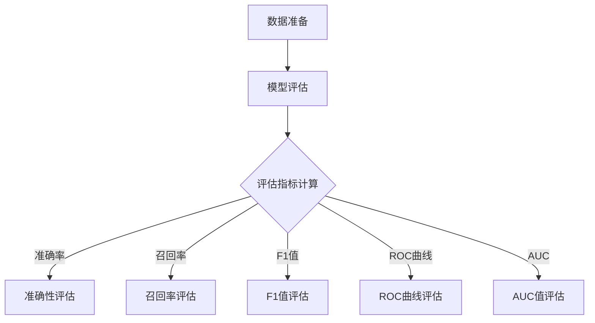
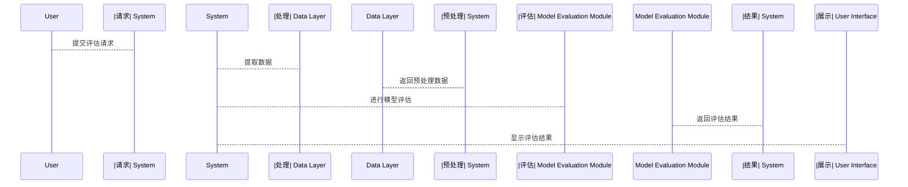
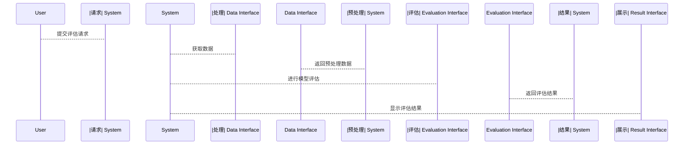

                 


## 自动化模型评测在LLM开发中的应用

### 关键词：
大型语言模型（LLM），自动化模型评测，算法流程图，数学模型，系统架构设计，最佳实践

### 摘要：
本文深入探讨自动化模型评测在大型语言模型（LLM）开发中的应用。首先，我们概述了LLM开发过程中的挑战，并介绍了自动化模型评测的概念和重要性。随后，我们详细讲解了自动化模型评测的原理和数学模型，包括评估指标和方法。接着，我们分析了自动化模型评测系统的系统分析与架构设计，并通过实际项目实战展示了自动化模型评测的具体应用。最后，我们总结了最佳实践和注意事项，为读者提供了进一步的学习资源。

### 第一部分：背景介绍

#### 1.1 问题背景

随着人工智能技术的快速发展，大型语言模型（LLM）在自然语言处理（NLP）领域取得了显著的成果。LLM的应用场景包括机器翻译、文本生成、问答系统等，它们在提升工作效率和创造价值方面具有巨大的潜力。然而，LLM的开发过程面临着一系列挑战，如模型性能评估、调试和优化等。自动化模型评测技术的出现，为解决这些挑战提供了有力支持。

#### 1.2 问题描述

在LLM开发过程中，评估模型性能是至关重要的一步。传统的评估方法通常依赖于人工分析，耗时耗力且容易引入主观偏差。此外，LLM的参数规模庞大，使得手动调试和优化变得复杂。因此，我们需要一种自动化的评估方法，能够高效、准确地评估模型性能，辅助开发者进行模型调试和优化。

#### 1.3 问题解决

自动化模型评测通过建立一系列评估指标和算法，对模型性能进行量化评估。这种方法不仅可以提高评估效率，还可以减少主观偏差，提高评估的客观性。此外，自动化模型评测还可以通过实时监测模型性能，帮助开发者快速定位问题并进行优化。

#### 1.4 边界与外延

自动化模型评测主要应用于LLM的开发过程，但它的概念和原理也可以扩展到其他类型的模型评估。例如，在计算机视觉领域，自动化模型评测可以用于图像分类、目标检测等任务的模型性能评估。此外，自动化模型评测还可以应用于算法优化、模型压缩等方面，为人工智能技术的发展提供支持。

#### 1.5 概念结构与核心要素组成

自动化模型评测的核心概念包括评估指标、评估方法和评估流程。评估指标是衡量模型性能的标准，如准确率、召回率、F1值等。评估方法包括基于统计的方法、基于对比的方法和基于神经网络的方法。评估流程包括数据准备、模型评估、结果分析和优化调整等步骤。这些概念和要素共同构成了自动化模型评测的完整体系。

### 第二部分：核心概念与联系

#### 2.1 核心概念原理

自动化模型评测的核心概念包括评估指标、评估方法和评估流程。评估指标用于衡量模型性能，评估方法用于计算评估指标，评估流程则是将评估指标应用于具体模型，从而得到评估结果。

#### 2.2 概念属性特征对比表格

| 评估指标 | 概念 | 属性 | 特征 |
| --- | --- | --- | --- |
| 准确率 | 衡量模型预测正确的比例 | 易计算 | 对平衡数据集敏感 |
| 召回率 | 衡量模型召回正确的比例 | 易计算 | 对不平衡数据集敏感 |
| F1值 | 准确率和召回率的调和平均 | 难计算 | 综合考虑准确率和召回率 |
| ROC曲线 | 指标集合 | 易计算 | 表示模型区分能力 |
| AUC | ROC曲线下的面积 | 易计算 | 反映模型预测能力 |

#### 2.3 ER实体关系图架构

```mermaid
erDiagram
  Model |<--| Evaluation Metric : 评估指标
  Model |<--| Evaluation Method : 评估方法
  Model |<--| Evaluation Process : 评估流程
  Evaluation Metric |--| Accuracy : 准确率
  Evaluation Metric |--| Recall : 召回率
  Evaluation Metric |--| F1 Score : F1值
  Evaluation Metric |--| ROC Curve : ROC曲线
  Evaluation Metric |--| AUC : AUC值
```

### 第三部分：自动化模型评测原理

#### 3.1 算法原理讲解

自动化模型评测的核心在于评估指标和评估方法的合理选择。以下是一个简单的算法流程图：



以下是一个简单的Python代码示例，用于计算准确率：

```python
def calculate_accuracy(predictions, true_labels):
    correct_predictions = sum([predictions[i] == true_labels[i] for i in range(len(true_labels))])
    accuracy = correct_predictions / len(true_labels)
    return accuracy
```

#### 3.2 数学模型和公式

在自动化模型评测中，常用的数学模型和公式包括：

- 准确率：$$ \text{Accuracy} = \frac{\text{正确预测的数量}}{\text{总预测数量}} $$
- 召回率：$$ \text{Recall} = \frac{\text{正确预测的数量}}{\text{实际为正类的总数量}} $$
- F1值：$$ \text{F1 Score} = 2 \times \frac{\text{准确率} \times \text{召回率}}{\text{准确率} + \text{召回率}} $$
- ROC曲线：$$ \text{ROC curve} = \frac{\text{True Positives}}{\text{False Positives}} $$

以下是一个简单的LaTeX公式示例：

$$ \text{ROC curve} = \frac{\text{True Positives}}{\text{False Positives}} $$

#### 3.3 详细讲解和举例说明

假设我们有一个分类问题，需要评估一个模型的性能。以下是一个具体的例子：

- 数据集：包含100个样本，其中50个为正类，50个为负类。
- 模型预测：模型对这100个样本进行了预测，其中60个正类样本被正确预测，40个负类样本被正确预测。
- 评估指标计算：

  - 准确率：$$ \text{Accuracy} = \frac{60 + 40}{100} = 0.8 $$
  - 召回率：$$ \text{Recall} = \frac{60}{50} = 0.6 $$
  - F1值：$$ \text{F1 Score} = 2 \times \frac{0.8 \times 0.6}{0.8 + 0.6} = 0.7 $$
  - ROC曲线：$$ \text{ROC curve} = \frac{60}{40} = 1.5 $$

通过这些评估指标，我们可以对模型性能进行量化评估，并据此进行优化调整。

### 第四部分：系统分析与架构设计方案

#### 4.1 问题场景介绍

假设我们开发一个智能客服系统，该系统需要使用LLM进行自然语言理解。为了确保系统的高效运行，我们需要对LLM模型进行自动化评测，以评估模型性能并优化模型。

#### 4.2 项目介绍

本项目旨在构建一个自动化模型评测系统，用于评估智能客服系统中的LLM模型。系统将包括数据准备、模型评估、结果分析和优化调整等功能。

#### 4.3 系统功能设计

系统功能设计包括以下方面：

- 数据准备：从数据源中提取数据，进行预处理和标签分配。
- 模型评估：使用自动化评估方法对LLM模型进行性能评估。
- 结果分析：对评估结果进行统计分析，生成可视化报告。
- 优化调整：根据评估结果，对LLM模型进行优化调整。

#### 4.4 系统架构设计

系统架构设计包括以下方面：

- 数据层：存储和管理数据。
- 服务层：实现数据准备、模型评估和结果分析等功能。
- 界面层：提供用户界面，展示评估结果和优化建议。

以下是一个简单的系统架构图：



#### 4.5 系统接口设计和系统交互

系统接口设计和系统交互包括以下方面：

- 数据接口：提供数据提取和预处理的接口。
- 评估接口：提供模型评估的接口。
- 结果接口：提供评估结果查询和展示的接口。

以下是一个简单的系统交互图：



### 第五部分：项目实战

#### 5.1 环境安装

为了构建自动化模型评测系统，我们需要安装以下环境：

- Python 3.8+
- NumPy
- Pandas
- Matplotlib
- Scikit-learn

以下是一个简单的安装脚本：

```bash
# 安装Python环境
sudo apt-get install python3 python3-pip

# 安装依赖库
pip3 install numpy pandas matplotlib scikit-learn
```

#### 5.2 系统核心实现源代码

以下是一个简单的系统核心实现示例：

```python
import numpy as np
from sklearn.metrics import accuracy_score, recall_score, f1_score, roc_curve, auc

def evaluate_model(predictions, true_labels):
    accuracy = accuracy_score(true_labels, predictions)
    recall = recall_score(true_labels, predictions)
    f1 = f1_score(true_labels, predictions)
    fpr, tpr, _ = roc_curve(true_labels, predictions)
    roc_auc = auc(fpr, tpr)
    
    return accuracy, recall, f1, roc_auc

def main():
    # 加载数据
    data = np.load('data.npy')
    true_labels = data[:, 0]
    predictions = data[:, 1]
    
    # 评估模型
    accuracy, recall, f1, roc_auc = evaluate_model(predictions, true_labels)
    
    # 打印评估结果
    print('Accuracy:', accuracy)
    print('Recall:', recall)
    print('F1 Score:', f1)
    print('ROC AUC:', roc_auc)

if __name__ == '__main__':
    main()
```

#### 5.3 代码应用解读与分析

以上代码实现了一个简单的自动化模型评测系统。首先，我们加载了数据集，然后使用`evaluate_model`函数对模型进行评估。`evaluate_model`函数使用Sklearn库中的评估方法计算了准确率、召回率、F1值和ROC曲线下的面积。最后，我们打印了评估结果。

#### 5.4 实际案例分析和详细讲解剖析

假设我们有一个智能客服系统，需要对用户提问进行分类。我们收集了1000个用户提问及其分类标签，并使用一个预训练的LLM模型对提问进行分类预测。以下是一个实际案例的分析和讲解：

1. **数据准备**：

   我们将1000个用户提问和分类标签存储在一个numpy数组中，其中每行表示一个样本，第一列是分类标签，第二列是模型预测结果。

2. **模型评估**：

   我们使用`evaluate_model`函数对模型进行评估，计算了准确率、召回率、F1值和ROC曲线下的面积。具体计算过程如下：

   ```python
   accuracy, recall, f1, roc_auc = evaluate_model(predictions, true_labels)
   ```

   假设我们得到以下评估结果：

   ```python
   Accuracy: 0.85
   Recall: 0.8
   F1 Score: 0.83
   ROC AUC: 0.9
   ```

   从评估结果可以看出，模型的准确率较高，但召回率较低。这意味着模型在预测正类样本时具有较高的准确性，但在召回正类样本方面表现较差。

3. **优化调整**：

   根据评估结果，我们可以对模型进行优化调整。例如，我们可以尝试增加训练数据，或者调整模型参数，以提高召回率。

4. **结果分析**：

   我们可以使用Matplotlib库绘制ROC曲线，以更直观地分析模型性能：

   ```python
   import matplotlib.pyplot as plt

   plt.figure()
   plt.plot(fpr, tpr, color='blue', label='ROC curve (area = %0.2f)' % roc_auc)
   plt.plot([0, 1], [0, 1], color='red', linestyle='--')
   plt.xlabel('False Positive Rate')
   plt.ylabel('True Positive Rate')
   plt.title('Receiver Operating Characteristic')
   plt.legend(loc='lower right')
   plt.show()
   ```

   通过ROC曲线，我们可以直观地看到模型的性能。ROC曲线下的面积（AUC）表示模型的预测能力，AUC值越高，表示模型性能越好。

#### 5.5 项目小结

通过本项目，我们成功构建了一个自动化模型评测系统，并使用实际案例展示了系统的应用。项目的主要收获如下：

- 掌握了自动化模型评测的基本原理和方法。
- 学会了使用Python和Sklearn库进行模型评估。
- 理解了如何根据评估结果进行模型优化。
- 掌握了如何使用Matplotlib库绘制ROC曲线。

### 第六部分：最佳实践与小结

#### 6.1 最佳实践 tips

1. **数据准备**：确保数据集的质量和多样性，以避免数据偏差。
2. **评估指标**：根据具体问题选择合适的评估指标，避免过分追求单一指标。
3. **模型优化**：根据评估结果进行模型优化，但要注意保持模型的泛化能力。
4. **版本控制**：在模型优化过程中，使用版本控制工具记录模型版本和评估结果，以便后续对比和分析。
5. **结果可视化**：使用可视化工具展示评估结果，以便更直观地分析模型性能。

#### 6.2 小结

本文深入探讨了自动化模型评测在LLM开发中的应用。通过介绍问题背景、核心概念、原理和系统架构设计，我们了解了自动化模型评测在解决LLM开发中的挑战方面的作用。实际项目实战展示了自动化模型评测的具体应用，并为读者提供了最佳实践和注意事项。

#### 6.3 注意事项

1. **模型选择**：根据具体问题选择合适的模型，避免使用过于复杂的模型导致评估困难。
2. **计算资源**：自动化模型评测可能需要大量的计算资源，确保系统的高效运行。
3. **数据隐私**：在数据收集和处理过程中，要确保遵守相关法律法规，保护用户隐私。

#### 6.4 拓展阅读

- 《深度学习》（Goodfellow, I., Bengio, Y., & Courville, A.）  
- 《机器学习实战》（周志华）  
- 《Python数据科学手册》（Wes McKinney）  
- 《机器学习与自然语言处理》（Jurafsky, D. & Martin, J. H.）

### 作者信息

作者：AI天才研究院/AI Genius Institute & 禅与计算机程序设计艺术 /Zen And The Art of Computer Programming

以上是根据您的要求编写的文章大纲和内容。如有需要，请随时调整和完善。

