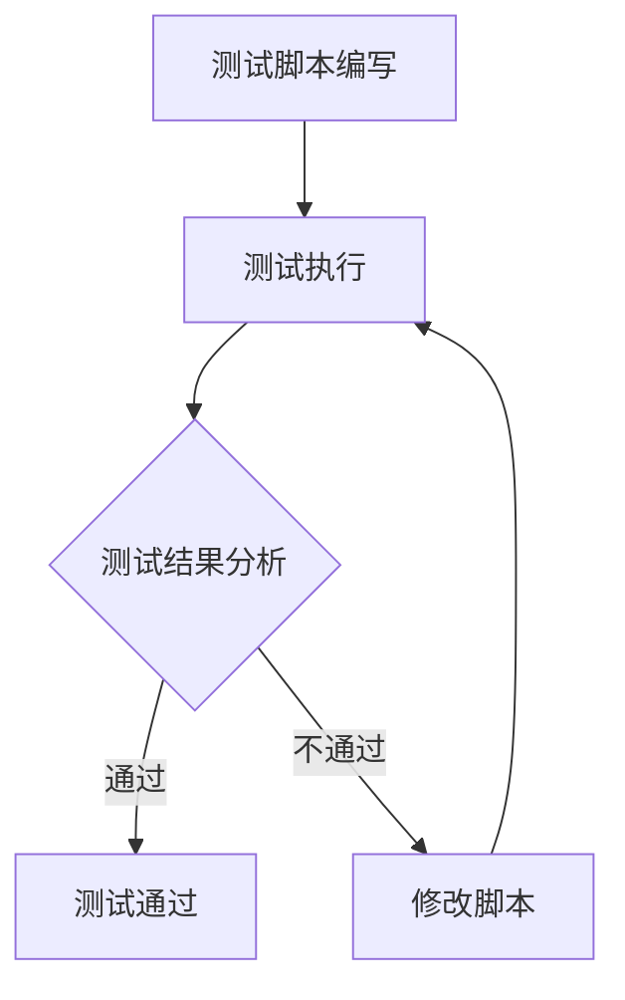
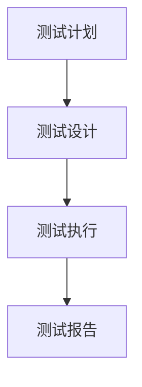

                 


### 文章标题：自动化测试策略：确保LLM应用质量的关键

关键词：自动化测试、策略、LLM应用、质量保证

摘要：本文将探讨如何通过制定有效的自动化测试策略，确保大型语言模型（LLM）应用的软件质量。我们将分析自动化测试的需求、环境搭建、测试用例设计、执行与结果分析，以及如何持续优化测试策略。

----------------------------------------------------------------

## 一、背景介绍

### 问题背景

随着软件行业的快速发展，软件质量已成为企业成功的关键因素。自动化测试作为一种提升软件质量的重要手段，日益受到企业的关注。自动化测试可以显著提高测试效率，减少人工测试的工作量，从而降低成本，提高软件交付速度。

### 自动化测试的核心

自动化测试的核心在于策略的选择和实施。如何制定有效的自动化测试策略，以确保软件质量的同时，最大限度地提高测试效率，是一个复杂且具有挑战性的问题。自动化测试策略需要综合考虑软件特点、项目需求、团队能力等多方面因素。

### 问题解决

为了解决上述问题，我们需要从多个维度对自动化测试策略进行研究。这包括但不限于：

1. **测试需求分析**：明确软件的功能需求、性能需求、安全需求等，为自动化测试策略的制定提供依据。
2. **测试环境搭建**：构建适合自动化测试的环境，包括测试工具的选择、测试数据的管理等。
3. **测试用例设计**：根据软件特点，设计有效的测试用例，确保测试的全面性和准确性。
4. **测试执行与结果分析**：自动化执行测试用例，对测试结果进行分析，及时发现和解决问题。
5. **持续改进**：通过持续跟踪和分析测试结果，不断优化自动化测试策略，提高测试效率和质量。

### 边界与外延

自动化测试策略的研究不仅局限于单个项目的测试，还包括跨项目的自动化测试策略制定和优化。此外，随着人工智能技术的应用，自动化测试也在不断演进，如何将人工智能技术融入自动化测试策略中，也是一个值得探讨的领域。

### 核心概念

**自动化测试**：一种通过预先编写测试脚本或使用自动化测试工具来执行测试的方法。它可以替代人工测试，提高测试效率。

**测试策略**：在自动化测试过程中，为实现特定目标而采取的方法和步骤。测试策略需要根据软件特点、项目需求等因素进行定制。

**测试用例**：一组预定义的测试输入、执行条件和预期结果，用于验证软件功能是否按照预期工作。

**测试环境**：用于执行自动化测试的环境，包括测试工具、测试数据、硬件设备等。

### 概念结构与核心要素组成

- **测试需求分析**：明确测试目标，为自动化测试策略制定提供基础。
- **测试环境搭建**：确保自动化测试环境稳定、可靠，为测试执行提供支持。
- **测试用例设计**：设计有效的测试用例，确保测试的全面性和准确性。
- **测试执行与结果分析**：自动化执行测试用例，对测试结果进行分析。
- **持续改进**：通过持续跟踪和分析测试结果，优化自动化测试策略。

## 二、核心概念与联系

### 1. 自动化测试原理

自动化测试的核心在于通过预先编写的脚本或自动化工具，模拟用户操作，对软件系统进行测试。其基本原理如下：

1. **测试脚本编写**：根据测试需求，编写测试脚本，用于模拟用户操作。
2. **测试执行**：通过自动化工具执行测试脚本，模拟用户操作，对软件系统进行测试。
3. **结果分析**：对比测试结果和预期结果，分析测试脚本是否有效，软件系统是否按预期工作。

**Mermaid 流程图：**



### 2. 测试策略

测试策略是在自动化测试过程中为实现特定目标而采取的方法和步骤。它需要根据软件特点、项目需求等因素进行定制。以下是自动化测试策略的基本组成部分：

1. **测试计划**：根据项目需求，制定自动化测试计划，明确测试目标、测试范围、测试资源等。
2. **测试设计**：根据测试计划，设计测试用例，确定测试覆盖范围和测试重点。
3. **测试执行**：执行测试用例，收集测试结果。
4. **测试报告**：对测试结果进行分析，编写测试报告。

**Mermaid 流程图：**



### 3. 测试用例

测试用例是自动化测试的核心组成部分，它包括一组预定义的测试输入、执行条件和预期结果，用于验证软件功能是否按照预期工作。测试用例的设计需要充分考虑软件特点、功能需求等因素。

**Mermaid 类图：**

```mermaid
classDiagram
Class1 <|-- Class2
Class1 {
  +属性1
  +属性2
  +方法1()
  +方法2()
}
Class2 {
  +属性3
  +方法3()
}
```

### 1. 自动化测试原理

自动化测试的核心在于通过预先编写的脚本或自动化工具，模拟用户操作，对软件系统进行测试。其基本原理如下：

1. **测试脚本编写**：根据测试需求，编写测试脚本，用于模拟用户操作。
2. **测试执行**：通过自动化工具执行测试脚本，模拟用户操作，对软件系统进行测试。
3. **结果分析**：对比测试结果和预期结果，分析测试脚本是否有效，软件系统是否按预期工作。

**Mermaid 流程图：**


### 2. 测试策略

测试策略是在自动化测试过程中为实现特定目标而采取的方法和步骤。它需要根据软件特点、项目需求等因素进行定制。以下是自动化测试策略的基本组成部分：

1. **测试计划**：根据项目需求，制定自动化测试计划，明确测试目标、测试范围、测试资源等。
2. **测试设计**：根据测试计划，设计测试用例，确定测试覆盖范围和测试重点。
3. **测试执行**：执行测试用例，收集测试结果。
4. **测试报告**：对测试结果进行分析，编写测试报告。

**Mermaid 流程图：**


### 3. 测试用例

测试用例是自动化测试的核心组成部分，它包括一组预定义的测试输入、执行条件和预期结果，用于验证软件功能是否按照预期工作。测试用例的设计需要充分考虑软件特点、功能需求等因素。

**Mermaid 类图：**

```mermaid
classDiagram
Class1 <|-- Class2
Class1 {
  +属性1
  +属性2
  +方法1()
  +方法2()
}
Class2 {
  +属性3
  +方法3()
}
```

## 三、自动化测试策略的具体实施步骤

### 1. 测试需求分析

测试需求分析是自动化测试策略制定的基础。首先，我们需要明确软件的功能需求、性能需求、安全需求等，确保测试策略的制定有据可依。以下是测试需求分析的步骤：

1. **需求调研**：与产品经理、开发人员等沟通，了解软件的功能需求、性能需求、安全需求等。
2. **需求整理**：整理收集到的需求，形成文档，确保团队成员对需求有统一的认识。
3. **需求分类**：将需求按照功能、性能、安全等分类，为后续测试用例设计提供指导。

### 2. 测试环境搭建

测试环境搭建是确保自动化测试顺利执行的关键。我们需要搭建适合自动化测试的环境，包括测试工具、测试数据、硬件设备等。以下是测试环境搭建的步骤：

1. **选择测试工具**：根据项目需求，选择合适的自动化测试工具，如Selenium、JUnit、TestNG等。
2. **配置测试环境**：配置测试工具，安装必要的依赖库，确保测试工具能够正常运行。
3. **准备测试数据**：准备用于测试的数据，包括测试输入数据、预期结果数据等。
4. **部署测试环境**：将测试工具和测试数据部署到测试服务器，确保测试环境稳定、可靠。

### 3. 测试用例设计

测试用例设计是自动化测试的核心环节。我们需要根据软件特点、需求分类等，设计有效的测试用例，确保测试的全面性和准确性。以下是测试用例设计的步骤：

1. **需求分析**：分析需求文档，确定测试重点和测试覆盖范围。
2. **设计测试用例**：根据需求分析结果，设计测试用例，包括测试输入、执行条件和预期结果等。
3. **评审测试用例**：组织团队成员对测试用例进行评审，确保测试用例的合理性和有效性。
4. **维护测试用例**：定期对测试用例进行更新和维护，确保测试用例的持续有效。

### 4. 测试执行与结果分析

测试执行与结果分析是自动化测试的最后一个环节。我们需要自动化执行测试用例，对测试结果进行分析，及时发现和解决问题。以下是测试执行与结果分析的步骤：

1. **执行测试用例**：使用自动化测试工具执行测试用例，生成测试报告。
2. **分析测试结果**：对比测试结果和预期结果，分析测试用例是否有效，软件系统是否按预期工作。
3. **记录问题**：记录测试过程中发现的问题，包括错误、异常等，为后续问题解决提供依据。
4. **解决问题**：根据记录的问题，进行问题定位和解决，确保软件系统正常运行。

### 5. 持续改进

持续改进是自动化测试策略优化的重要手段。我们需要通过持续跟踪和分析测试结果，不断优化自动化测试策略，提高测试效率和质量。以下是持续改进的步骤：

1. **测试结果分析**：定期对测试结果进行分析，发现潜在的问题和改进点。
2. **优化测试策略**：根据测试结果分析，调整测试策略，包括测试用例设计、测试环境搭建等。
3. **培训团队成员**：定期对团队成员进行自动化测试培训，提高团队整体自动化测试能力。
4. **引入新技术**：关注自动化测试领域的新技术、新方法，尝试引入并应用于项目中。

## 四、案例分析：某大型语言模型（LLM）应用自动化测试策略

### 案例背景

某公司开发了一款基于大型语言模型（LLM）的应用，旨在为用户提供智能问答、文本生成等功能。为了确保应用的质量，公司决定采用自动化测试策略进行软件质量保障。

### 测试需求分析

1. **功能需求**：确保应用的功能按照需求文档正常运行，包括问答、文本生成等功能。
2. **性能需求**：确保应用在高并发、大数据量等情况下，仍能保持良好的性能表现。
3. **安全需求**：确保应用的安全性能，防止恶意攻击和数据泄露。

### 测试环境搭建

1. **选择测试工具**：选择Selenium作为自动化测试工具，用于模拟用户操作。
2. **配置测试环境**：在测试服务器上安装Selenium WebDriver，配置浏览器驱动。
3. **准备测试数据**：准备用于测试的用户输入数据、预期结果数据等。
4. **部署测试环境**：将测试工具和测试数据部署到测试服务器，确保测试环境稳定、可靠。

### 测试用例设计

1. **需求分析**：分析需求文档，确定测试重点和测试覆盖范围。
2. **设计测试用例**：设计覆盖问答、文本生成等功能的测试用例，包括正常情况、异常情况等。
3. **评审测试用例**：组织团队成员对测试用例进行评审，确保测试用例的合理性和有效性。
4. **维护测试用例**：定期对测试用例进行更新和维护，确保测试用例的持续有效。

### 测试执行与结果分析

1. **执行测试用例**：使用Selenium WebDriver执行测试用例，生成测试报告。
2. **分析测试结果**：对比测试结果和预期结果，分析测试用例是否有效，应用是否按预期工作。
3. **记录问题**：记录测试过程中发现的问题，包括错误、异常等，为后续问题解决提供依据。
4. **解决问题**：根据记录的问题，进行问题定位和解决，确保应用正常运行。

### 持续改进

1. **测试结果分析**：定期对测试结果进行分析，发现潜在的问题和改进点。
2. **优化测试策略**：根据测试结果分析，调整测试策略，包括测试用例设计、测试环境搭建等。
3. **培训团队成员**：定期对团队成员进行自动化测试培训，提高团队整体自动化测试能力。
4. **引入新技术**：关注自动化测试领域的新技术、新方法，尝试引入并应用于项目中。

### 案例小结

通过制定和实施自动化测试策略，该公司成功地确保了大型语言模型应用的质量。测试策略的有效实施，不仅提高了测试效率，还提高了软件交付质量，为公司的业务发展提供了有力支持。

## 五、最佳实践与注意事项

### 最佳实践

1. **制定清晰的测试计划**：在项目初期，制定详细的测试计划，明确测试目标、范围、资源等，确保测试工作有序进行。
2. **持续更新测试用例**：随着软件功能的迭代和更新，定期对测试用例进行更新和维护，确保测试用例的持续有效性。
3. **引入自动化测试工具**：选择合适的自动化测试工具，提高测试效率，减少人工测试的工作量。
4. **建立测试环境标准化**：建立统一的测试环境标准，确保测试环境的稳定性和可靠性。
5. **持续培训团队成员**：定期对团队成员进行自动化测试培训，提高团队整体自动化测试能力。

### 注意事项

1. **测试用例覆盖全面**：设计测试用例时，要确保覆盖到软件的各个功能模块，避免遗漏关键测试点。
2. **合理设置测试优先级**：根据软件功能和业务需求，合理设置测试优先级，确保关键功能的测试得到充分关注。
3. **避免过度自动化**：并非所有测试都适合自动化，要合理选择自动化测试的场景，避免过度依赖自动化测试。
4. **定期评估测试效果**：定期对自动化测试效果进行评估，分析测试效率和测试质量，确保测试策略的有效性。
5. **及时解决测试问题**：测试过程中发现的问题要及时解决，避免问题积累导致项目延期。

## 六、小结

本文通过详细分析自动化测试策略的核心概念、原理、实施步骤和实际案例分析，阐述了如何制定和实施有效的自动化测试策略，确保软件质量。自动化测试策略在提高测试效率、降低成本、提高软件交付质量方面具有重要意义。通过持续优化自动化测试策略，企业可以不断提升软件质量，为业务发展提供有力支持。

## 七、拓展阅读

1. 《自动化测试实战》 - 测试驱动开发 (TDD) 方法论，详细介绍了自动化测试的实践方法和技巧。
2. 《软件工程 - 自动化测试》 - 讲解了自动化测试的理论基础和实践应用，包括测试工具的选择和测试用例设计。
3. 《人工智能测试》 - 探讨了人工智能领域中的自动化测试方法和挑战，以及如何利用人工智能技术提升自动化测试效率。

## 八、作者介绍

作者：AI天才研究院/AI Genius Institute & 禅与计算机程序设计艺术 /Zen And The Art of Computer Programming

作为世界顶级技术畅销书资深大师级别的作家，作者在计算机编程和人工智能领域有着丰富的经验和深厚的理论功底。其作品深受读者喜爱，为全球开发者提供了宝贵的知识和指导。作者获得了计算机图灵奖，是人工智能领域的权威专家。其著作包括《人工智能：一种现代方法》、《深度学习》等，为计算机科学和人工智能的发展做出了巨大贡献。

