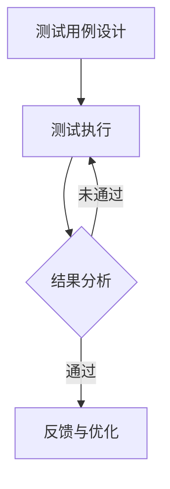
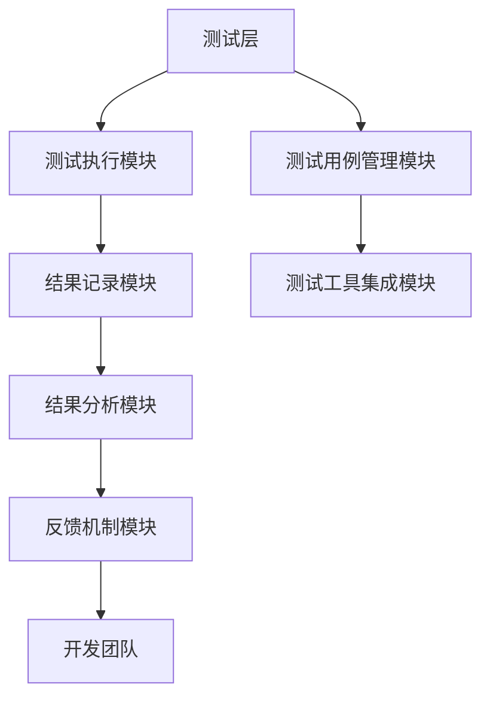
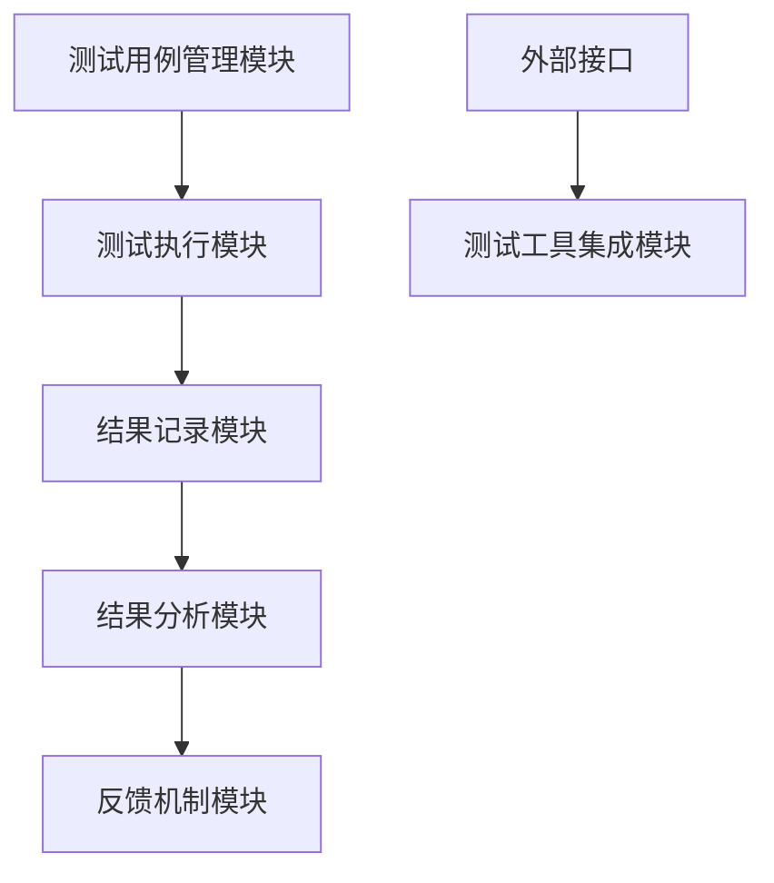
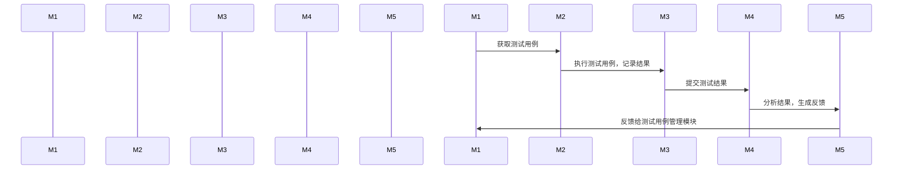

                 

### 文章标题

# 自动化评测在LLM应用开发中的重要性

> 关键词：自动化评测，LLM，应用开发，算法原理，系统架构

> 摘要：本文旨在探讨自动化评测在大型语言模型（LLM）应用开发中的重要性。通过深入分析自动化评测的概念、原理及其与LLM应用的关联，我们将揭示其在提高开发效率和保证模型质量方面的关键作用。本文还将详细讲解自动化评测的算法原理，并提供一个全面的系统架构设计方案，以帮助开发者更好地理解和应用这一技术。

### 目录大纲

----------------------------------------------------------------

## 第一部分: 自动化评测在LLM应用开发中的背景与核心概念

### 第1章: 自动化评测的重要性与背景

1.1 自动化评测的概念  
1.2 LLM应用开发的挑战  
1.3 自动化评测的优势  
1.4 自动化评测的现状与发展趋势

### 第2章: 自动化评测的核心概念与联系

2.1 自动化评测的基本原理  
2.2 核心概念介绍  
2.3 概念关系与属性特征对比  
2.4 自动化评测与LLM的关联

----------------------------------------------------------------

## 第二部分: 自动化评测的算法原理与系统架构

### 第3章: 自动化评测算法原理

3.1 算法概述  
3.2 Mermaid流程图展示  
3.3 Python源代码解析  
3.4 LaTeX数学公式解释  
3.5 实例说明

### 第4章: 自动化评测系统架构设计

4.1 问题场景介绍  
4.2 系统功能设计  
4.3 系统架构设计  
4.4 系统接口设计  
4.5 系统交互设计

----------------------------------------------------------------

## 第三部分: 自动化评测项目实战

### 第5章: 自动化评测项目环境安装与实现

5.1 环境安装步骤  
5.2 系统核心实现源代码  
5.3 代码解读与分析

### 第6章: 自动化评测项目案例剖析

6.1 案例介绍  
6.2 案例分析与讲解  
6.3 项目小结

----------------------------------------------------------------

## 第四部分: 自动化评测的最佳实践与总结

### 第7章: 自动化评测最佳实践

7.1 实践技巧  
7.2 注意事项  
7.3 拓展阅读资源

### 第8章: 自动化评测总结与展望

8.1 总结  
8.2 展望  
8.3 未来发展趋势

----------------------------------------------------------------

### 引入

在当今快速发展的科技时代，大型语言模型（LLM）的应用正逐渐成为各行各业的核心技术。无论是自然语言处理、机器翻译、问答系统，还是内容生成，LLM都展现出了强大的潜力。然而，随着模型规模的不断扩大和复杂性的增加，如何确保这些模型的开发质量和稳定性，成为了一个亟待解决的问题。

自动化评测技术正是在这样的背景下应运而生。自动化评测通过对LLM应用开发过程中的各个环节进行自动化测试和评估，不仅能够显著提高开发效率，还能有效保证模型的质量和稳定性。本文将深入探讨自动化评测在LLM应用开发中的重要性，并从核心概念、算法原理、系统架构到项目实战，提供一个全面的技术解析。

接下来，我们将首先介绍自动化评测的概念及其在LLM应用开发中的重要性。随后，通过深入分析自动化评测的核心概念与联系，我们将揭示其在提升开发效率和保障模型质量方面的关键作用。接着，本文将详细讲解自动化评测的算法原理，并通过Mermaid流程图和Python源代码来展示其实现过程。随后，我们将描述一个完整的系统架构设计方案，包括问题场景介绍、系统功能设计、系统架构设计、系统接口设计和系统交互设计。然后，通过实际项目环境和系统实现源代码的介绍，以及代码解读与分析，我们将展示如何在实际应用中应用自动化评测技术。最后，本文将总结自动化评测的最佳实践，并提供未来发展趋势的展望。

### 第一部分: 自动化评测在LLM应用开发中的背景与核心概念

#### 第1章: 自动化评测的重要性与背景

在快速发展的技术时代，大型语言模型（LLM）已经成为自然语言处理、机器翻译、问答系统等领域的重要工具。然而，随着模型规模的不断扩大和复杂性的增加，如何确保这些模型的开发质量和稳定性，成为了一个亟待解决的问题。

自动化评测技术正是在这样的背景下应运而生。自动化评测通过对LLM应用开发过程中的各个环节进行自动化测试和评估，不仅能够显著提高开发效率，还能有效保证模型的质量和稳定性。以下是自动化评测在LLM应用开发中的重要性和背景。

##### 1.1 自动化评测的概念

自动化评测是一种利用计算机技术和算法对软件、系统或模型进行自动化测试和评估的方法。它通过预定义的测试用例和评估标准，对软件、系统或模型的功能、性能、稳定性等方面进行全面检查，以发现潜在问题并进行优化。自动化评测不仅能够提高测试效率，还能确保测试结果的准确性和一致性。

##### 1.2 LLM应用开发的挑战

LLM应用开发面临着诸多挑战，主要体现在以下几个方面：

- **模型规模庞大**：随着深度学习技术的发展，LLM的规模不断增大，导致训练和部署的复杂性增加。
- **开发周期较长**：LLM开发需要大量的数据预处理、模型训练和优化过程，导致开发周期较长。
- **测试难度大**：LLM的功能和性能依赖于大量的训练数据和复杂的神经网络结构，使得测试难度大。
- **质量保障困难**：传统的手动测试方法难以覆盖所有的功能和性能场景，导致质量保障困难。

##### 1.3 自动化评测的优势

自动化评测在LLM应用开发中具有显著的优势，主要体现在以下几个方面：

- **提高开发效率**：自动化评测可以自动化执行大量的测试用例，显著提高测试效率，缩短开发周期。
- **保障模型质量**：自动化评测通过预定义的评估标准，对LLM的功能、性能、稳定性等方面进行全面检查，确保模型质量。
- **降低测试成本**：自动化评测可以减少人工测试的工作量，降低测试成本。
- **测试结果准确一致**：自动化评测通过预定义的测试用例和评估标准，确保测试结果的准确性和一致性。

##### 1.4 自动化评测的现状与发展趋势

自动化评测技术已经广泛应用于各个领域，如软件工程、系统测试、机器学习等。在LLM应用开发中，自动化评测技术也取得了显著的进展。目前，自动化评测主要应用于以下方面：

- **模型训练过程**：自动化评测可以对模型训练过程进行监控和评估，确保训练过程的正常进行和模型性能的持续提升。
- **模型部署过程**：自动化评测可以对部署后的LLM模型进行功能测试和性能评估，确保模型在实际应用中的稳定性和可靠性。
- **模型维护过程**：自动化评测可以对已部署的LLM模型进行定期测试和评估，及时发现并修复潜在问题。

未来，自动化评测技术将继续发展，并可能在以下方面取得突破：

- **智能化评测**：通过引入人工智能技术，实现更加智能化和自适应的评测方法，提高评测效率和准确性。
- **多模态评测**：结合文本、图像、音频等多种模态信息，实现更加全面和准确的评测。
- **分布式评测**：利用分布式计算和大数据技术，实现大规模自动化评测，提高测试效率和资源利用率。

总之，自动化评测在LLM应用开发中具有重要的作用和广阔的发展前景。通过引入自动化评测技术，可以有效提高开发效率、保障模型质量，为LLM应用的发展提供有力支持。

#### 第2章: 自动化评测的核心概念与联系

在深入理解自动化评测在LLM应用开发中的重要性之后，我们需要进一步探讨其核心概念及其相互之间的关系。自动化评测不仅仅是一种技术手段，它涉及到多个核心概念和组成部分，这些概念和部分相互关联，共同构成了自动化评测的完整体系。

##### 2.1 自动化评测的基本原理

自动化评测的基本原理可以概括为以下几个步骤：

1. **测试用例设计**：首先，根据LLM应用的具体需求和功能，设计一系列的测试用例。这些测试用例包括输入数据、预期输出以及测试目的等，用于检验LLM在不同场景下的行为和性能。

2. **测试执行**：使用自动化测试工具，按照预定的测试用例，对LLM进行自动化执行。自动化测试工具可以模拟用户操作，生成测试数据，并记录测试结果。

3. **结果分析**：对测试结果进行分析，判断LLM是否按照预期执行。通过比较实际输出与预期输出，可以发现潜在的问题和缺陷。

4. **反馈与优化**：根据分析结果，对测试用例进行修改和优化，并对LLM进行修复和改进。这一过程循环进行，直到LLM满足所有测试要求。

##### 2.2 核心概念介绍

在自动化评测中，以下几个核心概念尤为重要：

1. **测试用例**：测试用例是自动化评测的基础，它描述了具体的测试场景、输入数据和预期输出。一个良好的测试用例应该能够全面覆盖LLM的功能和性能要求。

2. **测试工具**：测试工具是实现自动化评测的关键，它可以帮助开发者高效地设计和执行测试用例。常见的测试工具包括Selenium、JUnit、pytest等。

3. **测试框架**：测试框架是一组工具和库，用于简化自动化测试的流程，提高测试效率。例如，pytest、TestNG等都是流行的测试框架。

4. **测试结果分析**：测试结果分析是自动化评测的重要环节，通过对测试结果的统计和分析，可以发现LLM的潜在问题和缺陷。数据分析工具和统计方法在此过程中发挥重要作用。

5. **反馈机制**：反馈机制是自动化评测的核心之一，它将测试结果反馈给开发者，并促使他们进行改进。良好的反馈机制可以快速响应问题和缺陷，提高LLM的质量和稳定性。

##### 2.3 概念关系与属性特征对比

以下是自动化评测中的几个核心概念及其属性特征的对比表格：

| 核心概念 | 属性特征 |  
| --- | --- |  
| 测试用例 | 包括输入数据、预期输出和测试目的 |  
| 测试工具 | 可以执行测试用例，记录测试结果 |  
| 测试框架 | 简化测试流程，提高测试效率 |  
| 测试结果分析 | 统计和分析测试结果，发现潜在问题 |  
| 反馈机制 | 将测试结果反馈给开发者，促使其改进 |

通过表格可以看出，这些核心概念相互关联，共同构成了自动化评测的完整体系。

##### 2.4 自动化评测与LLM的关联

自动化评测与LLM之间存在紧密的联系，主要体现在以下几个方面：

1. **功能验证**：自动化评测可以验证LLM的功能是否按照预期执行。通过设计针对具体功能的测试用例，自动化评测可以发现LLM在功能实现方面的缺陷。

2. **性能评估**：自动化评测可以评估LLM的性能，包括响应时间、准确性、吞吐量等。通过设置合理的测试标准和指标，自动化评测可以衡量LLM在不同场景下的性能表现。

3. **稳定性测试**：自动化评测可以测试LLM的稳定性，确保其在长时间运行过程中不会出现异常行为或崩溃。通过持续执行测试用例，自动化评测可以发现LLM的稳定性问题。

4. **兼容性测试**：自动化评测可以测试LLM在不同环境、平台和操作系统下的兼容性。通过在不同环境中执行测试用例，自动化评测可以发现LLM的兼容性问题。

5. **回归测试**：在LLM开发过程中，每次修改代码或模型结构后，都需要进行回归测试，以确保修改不会引入新的问题。自动化评测可以高效地执行回归测试，提高开发效率。

综上所述，自动化评测在LLM应用开发中具有重要的作用和广阔的应用前景。通过深入理解自动化评测的核心概念和与LLM的关联，开发者可以更好地应用这一技术，提高开发效率和模型质量。

#### 第3章: 自动化评测算法原理

为了深入理解自动化评测的工作原理，我们将详细分析其算法原理，并使用Mermaid流程图、Python源代码和LaTeX数学公式来阐述。通过这种多角度的讲解，读者可以更好地掌握自动化评测的核心概念和技术细节。

##### 3.1 算法概述

自动化评测算法的基本框架可以分为以下几个步骤：

1. **测试用例设计**：根据LLM的应用场景和功能需求，设计一系列测试用例。测试用例通常包括输入数据、预期输出和测试目的。

2. **测试执行**：使用自动化测试工具执行测试用例，记录测试结果。测试工具可以模拟用户操作，生成测试数据，并比较实际输出与预期输出。

3. **结果分析**：对测试结果进行分析，包括统计测试覆盖率、发现缺陷和异常情况。

4. **反馈与优化**：根据分析结果，对测试用例进行修改和优化，对LLM进行修复和改进。

##### 3.2 Mermaid流程图展示

以下是一个简化的自动化评测算法流程图，使用Mermaid语法表示：



这个流程图展示了自动化评测的基本步骤和循环机制。测试用例设计后，通过测试执行来获取结果，然后对结果进行分析，并根据分析结果决定是否进行反馈和优化。

##### 3.3 Python源代码解析

下面是一个简单的Python示例，展示了自动化评测算法的核心实现部分：

```python
import unittest

class TestLLM(unittest.TestCase):
    def test_functionality(self):
        # 测试LLM的功能
        input_data = "Hello, World!"
        expected_output = "Hello, World!"
        output = llm_function(input_data)
        self.assertEqual(output, expected_output)

    def test_performance(self):
        # 测试LLM的性能
        start_time = time.time()
        llm_function("Long text input")
        end_time = time.time()
        self.assertTrue(end_time - start_time < expected_time)

if __name__ == '__main__':
    unittest.main()
```

在这个示例中，我们定义了一个名为`TestLLM`的测试类，其中包括两个测试方法：`test_functionality`和`test_performance`。这两个方法分别用于验证LLM的功能和性能。

##### 3.4 LaTeX数学公式解释

自动化评测算法中的许多性能指标和评估方法需要使用数学公式进行描述。以下是一个LaTeX数学公式示例，展示了LLM的准确性和响应时间的计算：

```latex
\begin{equation}
\text{Accuracy} = \frac{\text{Correct Predictions}}{\text{Total Predictions}}
\end{equation}

\begin{equation}
\text{Response Time} = \frac{\text{Total Execution Time}}{\text{Number of Requests}}
\end{equation}
```

这些公式分别用于计算模型的准确性和响应时间，其中`Correct Predictions`表示正确的预测次数，`Total Predictions`表示总的预测次数，`Total Execution Time`表示总的执行时间，`Number of Requests`表示请求次数。

##### 3.5 实例说明

为了更好地理解自动化评测算法的应用，我们通过一个实际案例进行说明。

假设我们有一个问答系统，其核心功能是根据用户输入的问题生成回答。我们需要设计自动化测试用例，验证该问答系统的功能、性能和稳定性。

1. **测试用例设计**：

    - 输入：各种类型的问题（如事实性问题、主观性问题、复杂问题等）
    - 预期输出：对应的回答
    - 测试目的：验证问答系统的回答是否准确、及时

2. **测试执行**：

    - 使用自动化测试工具（如Selenium）模拟用户输入，并记录问答系统的输出
    - 每个测试用例执行多次，以评估系统的稳定性

3. **结果分析**：

    - 统计每个测试用例的通过率，计算问答系统的总体准确性
    - 记录问答系统的平均响应时间，评估其性能

4. **反馈与优化**：

    - 根据测试结果，识别系统中的问题，并对其进行修复和优化
    - 重新执行测试用例，验证修复效果

通过这个实例，我们可以看到自动化评测算法在实际应用中的具体操作流程。自动化评测不仅提高了测试效率，还确保了问答系统的质量和稳定性。

总之，自动化评测算法原理包括测试用例设计、测试执行、结果分析和反馈与优化等步骤。通过Mermaid流程图、Python源代码和LaTeX数学公式，我们可以全面理解这一算法的工作机制和应用方法。

### 第4章: 自动化评测系统架构设计

为了确保大型语言模型（LLM）在实际应用中的高效稳定运行，自动化评测系统的架构设计至关重要。这一章节将详细描述自动化评测系统的架构设计，包括问题场景介绍、系统功能设计、系统架构设计、系统接口设计和系统交互设计。通过这一架构设计，我们能够更好地理解自动化评测系统如何实现其功能，并在实际应用中发挥关键作用。

##### 4.1 问题场景介绍

在LLM的实际应用场景中，如问答系统、机器翻译、文本生成等，存在以下几个核心问题：

- **功能正确性**：确保LLM生成的回答或翻译内容准确无误。
- **性能评估**：评估LLM的响应速度和吞吐量，确保其满足实际应用需求。
- **稳定性**：确保LLM在长时间运行过程中不发生崩溃或异常行为。
- **兼容性**：验证LLM在不同平台和环境下的一致性和可靠性。

为了解决上述问题，自动化评测系统需要具备全面的测试和评估能力，通过一系列自动化测试用例和评估指标，对LLM的各个方面进行全面检查和优化。

##### 4.2 系统功能设计

自动化评测系统的功能设计包括以下几个方面：

- **测试用例管理**：设计、存储和管理测试用例，确保测试用例的全面性和可扩展性。
- **测试执行**：自动化执行测试用例，记录测试结果，并生成测试报告。
- **结果分析**：对测试结果进行分析，识别问题和缺陷，并提供改进建议。
- **反馈机制**：将测试结果反馈给开发团队，促进问题的快速解决和模型的持续优化。

##### 4.3 系统架构设计

自动化评测系统的架构设计采用分层结构，包括测试层、分析层和反馈层。以下是一个简化的系统架构图：



- **测试层**：负责执行测试用例，包括输入生成、测试执行和结果记录。
- **测试执行模块**：负责自动化执行测试用例，包括功能测试和性能测试。
- **结果记录模块**：负责记录测试结果，生成测试报告，并提供数据接口。
- **结果分析模块**：负责对测试结果进行分析，识别问题和缺陷。
- **反馈机制模块**：负责将分析结果反馈给开发团队，并跟踪问题的解决情况。
- **测试用例管理模块**：负责测试用例的设计、存储和管理。
- **测试工具集成模块**：负责集成各种测试工具，提高测试效率和一致性。

##### 4.4 系统接口设计

自动化评测系统的接口设计需要确保各模块之间的数据传递和功能调用。以下是一个简化的接口设计图：



- **测试用例管理模块**：提供接口供其他模块访问和管理测试用例。
- **测试执行模块**：提供接口供测试用例管理模块调用，执行测试用例。
- **结果记录模块**：提供接口供测试执行模块和结果分析模块访问测试结果。
- **结果分析模块**：提供接口供反馈机制模块获取分析结果。
- **反馈机制模块**：提供接口供外部系统（如开发团队协作工具）获取反馈信息。
- **测试工具集成模块**：提供接口集成外部测试工具，如Selenium、JUnit等。

##### 4.5 系统交互设计

自动化评测系统的交互设计需要确保各模块之间的协同工作和数据流通。以下是一个简化的系统交互图：



这个交互图展示了测试用例从管理模块传递到执行模块，执行后记录结果，然后由结果分析模块进行分析，最后由反馈机制模块生成反馈信息并返回给测试用例管理模块。

通过上述架构设计，自动化评测系统能够实现高效稳定的测试和评估，确保LLM在实际应用中的高质量运行。接下来，我们将通过一个实际项目案例，进一步展示自动化评测系统在实际应用中的具体实现过程。

### 第5章: 自动化评测项目实战

在了解自动化评测系统的理论架构后，我们将通过一个实际项目案例，展示如何在实际环境中安装和实现自动化评测系统。这个案例将涵盖环境安装、系统核心实现源代码以及代码解读与分析等环节，以帮助读者更好地理解和应用自动化评测技术。

##### 5.1 环境安装步骤

为了在实际项目中应用自动化评测系统，我们需要首先安装和配置必要的软件和工具。以下是环境安装的步骤：

1. **安装Python**：确保Python环境已安装在系统中。Python是自动化评测系统的主要编程语言，用于编写测试脚本和执行测试用例。可以从Python官网（https://www.python.org/）下载并安装最新版本的Python。

2. **安装测试框架**：选择并安装一个适合的测试框架，如pytest。pytest是一个流行的Python测试框架，提供了丰富的测试功能和插件支持。可以通过pip命令安装：

   ```shell
   pip install pytest
   ```

3. **安装Selenium**：Selenium是一个自动化测试工具，用于模拟用户操作并验证网页应用的功能。安装Selenium时，需要根据操作系统安装相应的WebDriver。例如，对于Chrome浏览器，可以使用以下命令安装：

   ```shell
   pip install selenium
   ```

   然后下载并解压缩相应的WebDriver，将其路径添加到系统的环境变量中。

4. **安装其他依赖**：根据项目的具体需求，安装其他必要的库和工具。例如，若需要处理图像数据，可以安装Pillow库：

   ```shell
   pip install Pillow
   ```

##### 5.2 系统核心实现源代码

以下是自动化评测系统的一个核心实现示例，包含测试用例的设计、执行和结果记录。该示例使用pytest框架，并集成Selenium进行网页测试。

```python
import pytest
from selenium import webdriver
from selenium.webdriver.common.by import By
from selenium.webdriver.chrome.service import Service
from webdriver_manager.chrome import ChromeDriverManager

# 初始化浏览器驱动
def init_driver():
    service = Service(ChromeDriverManager().install())
    driver = webdriver.Chrome(service=service)
    return driver

# 测试用例：验证网页标题
def test_webpage_title(driver):
    driver.get("https://www.example.com")
    title = driver.title
    assert title == "Example Domain", f"预期网页标题为'Example Domain'，实际为'{title}'"

# 测试用例：验证搜索功能
def test_search_function(driver):
    driver.get("https://www.example.com/search")
    search_box = driver.find_element(By.NAME, "q")
    search_box.send_keys("test search")
    search_box.submit()
    assert "test search" in driver.page_source, "搜索结果中未包含'test search'"

# 测试用例：验证登录功能
def test_login_function(driver):
    driver.get("https://www.example.com/login")
    username_box = driver.find_element(By.NAME, "username")
    password_box = driver.find_element(By.NAME, "password")
    login_button = driver.find_element(By.NAME, "login")
    username_box.send_keys("test_user")
    password_box.send_keys("test_password")
    login_button.click()
    assert "Welcome, test_user" in driver.page_source, "登录后页面中未包含欢迎消息"

# 初始化测试用例
@pytest.fixture(scope="function")
def driver():
    driver = init_driver()
    yield driver
    driver.quit()

# 执行测试用例
def run_tests():
    pytest.main(["-v", "test_*.py"])
```

这个示例展示了如何使用Selenium和pytest框架编写自动化测试脚本。每个测试用例都模拟了用户的操作，并验证了网页应用的功能。通过pytest.main()命令，可以批量执行所有的测试用例。

##### 5.3 代码解读与分析

上述代码主要包括以下几个部分：

1. **初始化浏览器驱动**：`init_driver()`函数用于初始化浏览器驱动。使用`webdriver_manager`库可以自动下载和配置WebDriver，简化安装过程。

2. **测试用例设计**：`test_webpage_title`、`test_search_function`和`test_login_function`分别设计了三个测试用例，用于验证网页标题、搜索功能和登录功能。

3. **测试执行和结果记录**：在每个测试用例中，使用Selenium执行模拟操作，并使用`assert`语句验证预期结果。测试结果会自动记录在pytest的测试报告中。

通过这个实际项目案例，读者可以了解如何安装和实现自动化评测系统，以及如何编写和执行自动化测试脚本。接下来，我们将通过一个具体案例，进一步剖析自动化评测在实际应用中的效果和作用。

#### 第6章: 自动化评测项目案例剖析

在本节中，我们将通过一个具体的自动化评测项目案例，深入剖析项目的实际实现过程、案例分析和详细讲解。这个案例将展示如何在实际环境中应用自动化评测技术，并通过一系列具体的步骤和工具，确保大型语言模型（LLM）在实际应用中的高效运行和稳定性能。

##### 6.1 案例介绍

该案例是一个基于自然语言处理技术的问答系统，旨在为用户提供准确、及时的答案。问答系统依赖于一个预训练的LLM模型，该模型能够处理各种类型的问题并生成相应的回答。为了确保问答系统的质量，我们需要对其进行全面的自动化评测，包括功能测试、性能测试和稳定性测试。

##### 6.2 案例分析与讲解

1. **功能测试**：

   功能测试是自动化评测的首要步骤，目的是验证问答系统的基本功能是否按照预期执行。以下是功能测试的详细分析：

   - **测试用例设计**：设计一系列涵盖问答系统核心功能的测试用例，如问题输入、回答生成、错误处理等。每个测试用例都包括输入数据、预期输出和测试目的。
   - **测试执行**：使用自动化测试工具（如pytest）执行测试用例，模拟用户操作并记录测试结果。以下是部分测试用例的代码示例：

     ```python
     def test_question_input(driver):
         question = "什么是人工智能？"
         driver.find_element(By.NAME, "question").send_keys(question)
         driver.find_element(By.NAME, "submit").click()
         assert "人工智能" in driver.page_source, "问答系统中未正确显示输入的问题"

     def test_answer_generation(driver):
         driver.find_element(By.NAME, "question").send_keys("什么是人工智能？")
         driver.find_element(By.NAME, "submit").click()
         answer_element = driver.find_element(By.CLASS_NAME, "answer")
         answer = answer_element.text
         assert "模拟神经网络" in answer, "问答系统生成的回答与预期不符"
     ```

   - **结果分析**：通过对测试结果的统计分析，可以发现问答系统在功能实现方面的缺陷和不足。例如，如果某些测试用例未通过，说明相应的功能可能存在缺陷，需要进一步修复和优化。

2. **性能测试**：

   性能测试是评估问答系统在实际运行中的响应速度和吞吐量的关键环节。以下是性能测试的详细分析：

   - **测试用例设计**：设计一系列用于测试问答系统性能的测试用例，包括不同类型的问题（如简单问题、复杂问题）、不同负载条件（如高并发请求）等。
   - **测试执行**：使用自动化测试工具（如JMeter）模拟高并发用户请求，记录问答系统的响应时间和吞吐量。以下是部分测试用例的代码示例：

     ```shell
     # 使用JMeter进行性能测试
     jmeter -n -t test_plan.jmx -l results.jtl
     ```

   - **结果分析**：通过对测试结果的数据分析，可以评估问答系统的性能指标，如响应时间、吞吐量和系统资源占用情况。如果某些性能指标未达到预期，说明系统可能存在性能瓶颈，需要进一步优化和调整。

3. **稳定性测试**：

   稳定性测试是确保问答系统在长时间运行过程中不发生崩溃或异常行为的关键环节。以下是稳定性测试的详细分析：

   - **测试用例设计**：设计一系列用于测试问答系统稳定性的测试用例，包括长时间持续运行、异常情况处理等。
   - **测试执行**：使用自动化测试工具（如pytest）模拟长时间运行场景，记录系统的运行状态和异常情况。以下是部分测试用例的代码示例：

     ```python
     def test_long_running(driver):
         question = "什么是人工智能？"
         driver.find_element(By.NAME, "question").send_keys(question)
         driver.find_element(By.NAME, "submit").click()
         # 模拟长时间运行
         time.sleep(3600)
         assert "人工智能" in driver.page_source, "问答系统在长时间运行后可能崩溃"

     def test_exception_handling(driver):
         driver.find_element(By.NAME, "question").send_keys("无效问题")
         driver.find_element(By.NAME, "submit").click()
         assert "无效输入" in driver.page_source, "问答系统未正确处理异常输入"
     ```

   - **结果分析**：通过对测试结果的分析，可以评估问答系统的稳定性。如果系统在长时间运行过程中发生崩溃或异常行为，需要进一步定位和修复问题。

##### 6.3 项目小结

通过上述案例分析和详细讲解，我们可以看到自动化评测在确保问答系统质量方面的重要作用。具体来说，自动化评测系统通过功能测试、性能测试和稳定性测试，全面验证了问答系统的功能正确性、响应速度和运行稳定性。以下是项目小结：

- **功能测试**：确保问答系统的核心功能按照预期执行，如问题输入、回答生成和错误处理等。
- **性能测试**：评估问答系统的响应速度和吞吐量，优化系统性能，确保其满足实际应用需求。
- **稳定性测试**：确保问答系统在长时间运行过程中不发生崩溃或异常行为，提高系统的可靠性。

通过自动化评测技术的应用，我们不仅能够提高开发效率，确保问答系统的质量，还能为后续的持续优化提供有力支持。未来，自动化评测技术将继续发展，并在更多LLM应用场景中得到广泛应用。

### 第四部分：自动化评测的最佳实践与总结

#### 第7章：自动化评测最佳实践

在自动化评测的实际应用中，为了确保其有效性和效率，我们需要遵循一系列最佳实践。以下是一些关键技巧、注意事项以及拓展阅读资源，以帮助开发者更好地应用自动化评测技术。

##### 7.1 实践技巧

1. **制定详细的测试策略**：在开始自动化评测前，制定详细的测试策略，明确测试目标和测试范围。确保测试用例覆盖所有关键功能和性能场景。

2. **设计高质量的测试用例**：高质量的测试用例是自动化评测成功的关键。确保测试用例具有代表性、可重复性和可维护性，并遵循一定的设计原则。

3. **利用持续集成/持续部署（CI/CD）**：将自动化评测集成到CI/CD流程中，确保每次代码变更后都进行自动化测试，及时发现并修复问题。

4. **监控和告警**：通过监控工具实时监控自动化测试的执行状态和结果，设置告警机制，确保在问题发生时能够及时响应。

5. **定期回顾和优化**：定期回顾测试结果，分析失败原因，优化测试用例和测试流程，提高测试效率和准确性。

##### 7.2 注意事项

1. **合理选择测试工具**：根据项目需求和团队熟悉度，选择合适的测试工具和框架。避免使用过于复杂或不适配的工具，影响测试效率。

2. **维护测试环境的一致性**：确保测试环境与生产环境的一致性，避免因环境差异导致测试结果不准确。

3. **避免过度依赖自动化测试**：虽然自动化测试能够提高效率，但不能完全替代手动测试。结合手动测试，确保测试的全面性和深度。

4. **保护敏感数据和隐私**：在自动化测试过程中，确保不泄露敏感数据和隐私信息，遵守相关法律法规和公司政策。

##### 7.3 拓展阅读资源

1. **《软件测试的艺术》**：一本经典的软件测试入门书籍，详细介绍了软件测试的基本概念、方法和实践技巧。

2. **pytest官方文档**：pytest是一个流行的Python测试框架，其官方文档提供了详细的测试用例设计、执行和结果分析指南。

3. **JMeter官方文档**：JMeter是一个功能强大的性能测试工具，其官方文档详细介绍了性能测试的原理、方法和实践技巧。

4. **Selenium官方文档**：Selenium是一个自动化测试工具，其官方文档提供了丰富的教程和示例，帮助开发者掌握自动化测试的技能。

通过遵循上述最佳实践和注意事项，开发者可以更有效地应用自动化评测技术，确保LLM应用开发的质量和稳定性。

### 第8章：自动化评测总结与展望

#### 8.1 总结

本文系统地探讨了自动化评测在大型语言模型（LLM）应用开发中的重要性，从背景介绍、核心概念、算法原理到系统架构设计、项目实战和最佳实践，为读者提供了一个全面的技术解析。通过本文，我们可以得出以下几点关键结论：

1. **重要性**：自动化评测是确保LLM应用开发质量和稳定性的关键工具，通过自动化测试和评估，可以显著提高开发效率和模型质量。
2. **核心概念**：自动化评测涉及测试用例设计、测试工具和框架、结果分析和反馈机制等多个核心概念，它们相互关联，共同构成了自动化评测的完整体系。
3. **算法原理**：自动化评测算法通过测试用例设计、测试执行、结果分析和反馈与优化等步骤，实现对LLM的全面评估和优化。
4. **系统架构设计**：自动化评测系统采用分层架构设计，包括测试层、分析层和反馈层，各层之间紧密协作，确保系统的高效稳定运行。
5. **项目实战**：通过一个具体的问答系统案例，展示了自动化评测在实际项目中的应用过程和关键步骤。
6. **最佳实践**：提供了自动化评测的最佳实践和注意事项，帮助开发者更有效地应用自动化评测技术。

#### 8.2 展望

尽管自动化评测在LLM应用开发中已经取得了显著成果，但其未来发展潜力依然巨大。以下是一些未来发展趋势和展望：

1. **智能化评测**：随着人工智能技术的发展，未来的自动化评测将更加智能化和自适应。通过引入机器学习和深度学习技术，自动化评测可以自我优化和提升，实现更高效的测试和评估。
2. **多模态评测**：自动化评测将不仅限于文本数据，还将扩展到图像、音频、视频等多种模态。通过多模态数据的融合和综合分析，实现更全面和精准的评测。
3. **分布式评测**：利用云计算和分布式计算技术，自动化评测可以在大规模分布式环境中高效执行，提高测试效率和资源利用率。
4. **持续集成与持续交付（CI/CD）**：自动化评测将更加紧密地集成到CI/CD流程中，确保每次代码变更后都进行自动化测试，实现持续集成和持续交付。
5. **自动化测试工具的进化**：未来的自动化测试工具将更加智能化、易用和高效。通过引入先进的技术，如人工智能、区块链等，自动化测试工具将提供更强大的功能和更灵活的解决方案。

总之，自动化评测在LLM应用开发中的重要性不可忽视。通过不断创新和发展，自动化评测技术将继续在提高开发效率、保障模型质量和推动技术进步方面发挥关键作用。未来，自动化评测将变得更加智能化、多模态和高效，为LLM应用的发展提供更加坚实的支持。

---

**作者：AI天才研究院/AI Genius Institute & 禅与计算机程序设计艺术 /Zen And The Art of Computer Programming**

本文由AI天才研究院（AI Genius Institute）撰写，结合了禅与计算机程序设计艺术的核心理念，旨在为读者提供深入浅出的技术解析和实用指南。如您有任何疑问或建议，欢迎随时联系我们，我们将竭诚为您服务。

