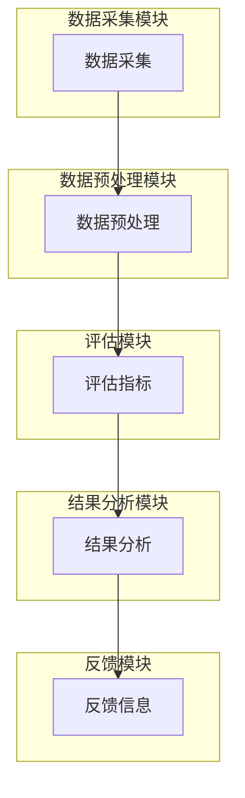

                 

# 自动化评测系统：加速AI研发迭代的关键工具

## 关键词
- 自动化评测系统
- AI研发迭代
- 数据采集与处理
- 评估指标与评估方法
- 结果分析与反馈

## 摘要
本文旨在探讨自动化评测系统在AI研发迭代中的作用和重要性。首先，我们将对自动化评测系统的概念和背景进行概述，然后分析AI研发迭代中的挑战以及自动化评测系统的需求。接下来，我们将详细讨论自动化评测系统的架构设计，包括数据采集与处理、评估指标与评估方法、结果分析与反馈模块的设计。随后，我们将介绍自动化评测系统的关键技术与工具，并通过实际案例展示其应用。最后，我们将探讨自动化评测系统的优化方法和未来发展趋势。

## 目录大纲

### 第一部分：自动化评测系统的概念与背景

#### 第1章：自动化评测系统概述

#### 第2章：AI研发迭代中的自动化评测需求

#### 第3章：自动化评测系统的架构设计

### 第二部分：自动化评测系统的关键技术

#### 第4章：自动化评测系统的关键技术与工具

#### 第5章：自动化评测系统的实践案例

### 第三部分：自动化评测系统的优化与展望

#### 第6章：自动化评测系统的优化方法

#### 第7章：自动化评测系统的未来发展趋势

### 附录

#### 附录A：常用评估指标与公式

#### 附录B：自动化评测系统开源工具介绍

#### 附录C：参考文献

## 第一部分：自动化评测系统的概念与背景

### 第1章：自动化评测系统概述

#### 1.1 自动化评测系统的定义与重要性

自动化评测系统是一种利用计算机技术对AI模型或系统进行自动评估的工具。它通过对输入数据进行处理，生成评估指标和评估结果，帮助研发人员快速发现和定位问题，提高研发效率和模型质量。

自动化评测系统的重要性体现在以下几个方面：

1. **加速研发迭代**：自动化评测系统能够在短时间内完成大量测试任务，加快AI模型的迭代速度，缩短研发周期。
2. **提高研发效率**：通过自动化的评估过程，研发人员可以节省大量时间，将更多精力投入到创新和优化工作中。
3. **提升模型质量**：自动化评测系统能够对模型进行全面的评估，帮助研发人员发现潜在的问题和缺陷，提高模型性能和可靠性。

#### 1.2 自动化评测系统的发展历程

自动化评测系统的发展可以追溯到计算机科学和人工智能的早期阶段。随着计算能力和数据规模的不断提升，自动化评测系统也逐渐从简单的测试工具发展成为复杂的评估系统。以下是自动化评测系统的发展历程：

1. **早期测试工具**：早期的人工智能研发主要依赖于手动测试，研发人员需要亲自编写测试用例并执行测试。
2. **自动化测试框架**：随着自动化测试的概念被提出，各种自动化测试框架逐渐出现，如Selenium、JUnit等。这些框架使得测试过程更加高效和自动化。
3. **智能化评估系统**：近年来，随着深度学习和大数据技术的发展，自动化评测系统逐渐智能化。它们能够根据不同任务需求，自动生成评估指标和评估结果。

#### 1.3 自动化评测系统的核心应用领域

自动化评测系统在多个AI领域都有广泛的应用，以下是其中一些核心应用领域：

1. **自然语言处理**：自动化评测系统可以评估文本分类、情感分析、机器翻译等任务的模型性能。
2. **计算机视觉**：自动化评测系统可以评估图像分类、目标检测、图像生成等任务的模型性能。
3. **推荐系统**：自动化评测系统可以评估推荐系统的准确性、多样性、覆盖度等指标。

### 第2章：AI研发迭代中的自动化评测需求

#### 2.1 AI研发迭代的挑战

AI研发迭代过程中面临着诸多挑战，包括：

1. **大量测试用例**：AI模型需要经过大量的测试用例，以验证其在各种场景下的性能。
2. **测试数据多样性**：测试数据需要涵盖各种可能的场景，以确保模型在不同条件下的鲁棒性。
3. **测试效率**：测试过程需要高效，以确保研发迭代的顺利进行。

#### 2.2 自动化评测系统的需求分析

为了应对AI研发迭代中的挑战，自动化评测系统需要满足以下需求：

1. **自动化测试**：自动化评测系统应能够自动生成测试用例并执行测试，节省研发人员的时间和精力。
2. **全面评估**：自动化评测系统应能够评估模型在各种场景下的性能，包括准确性、召回率、F1值等。
3. **结果反馈**：自动化评测系统应能够提供详细的评估结果和反馈，帮助研发人员快速发现和解决问题。

#### 2.3 自动化评测系统在AI研发迭代中的作用

自动化评测系统在AI研发迭代中发挥着关键作用，包括：

1. **加速迭代**：自动化评测系统能够在短时间内完成大量测试任务，加快模型迭代速度。
2. **提高质量**：自动化评测系统能够提供全面的评估结果，帮助研发人员发现和解决问题，提高模型质量。
3. **减少风险**：自动化评测系统能够提前发现模型中的潜在问题，降低模型在生产环境中的风险。

### 第3章：自动化评测系统的架构设计

#### 3.1 自动化评测系统的总体架构

自动化评测系统的总体架构包括以下几个主要模块：

1. **数据采集与处理模块**：负责收集测试数据，并对数据进行预处理，以便后续评估。
2. **评估指标与评估方法模块**：根据任务需求，定义评估指标和评估方法，用于评估模型性能。
3. **结果分析与反馈模块**：对评估结果进行分析和可视化，并提供详细的反馈信息，以便研发人员优化模型。

#### 3.2 数据采集与处理模块设计

数据采集与处理模块是自动化评测系统的核心部分，其设计包括以下几个方面：

1. **数据源选择**：根据任务需求，选择合适的数据源，包括公开数据集、私有数据集等。
2. **数据预处理**：对采集到的数据进行清洗、归一化、去噪等处理，以提高评估结果的准确性。
3. **数据存储**：将预处理后的数据存储在数据库或文件系统中，以便后续使用。

#### 3.3 评估指标与评估方法设计

评估指标与评估方法的设计是自动化评测系统的关键环节，其设计包括以下几个方面：

1. **评估指标选择**：根据任务需求，选择合适的评估指标，如准确性、召回率、F1值等。
2. **评估方法实现**：根据评估指标，实现相应的评估方法，如分类报告、ROC曲线等。
3. **评估准则**：定义评估准则，以确保评估结果的公正性和可靠性。

#### 3.4 结果分析与反馈模块设计

结果分析与反馈模块负责对评估结果进行分析和可视化，并提供详细的反馈信息。其设计包括以下几个方面：

1. **结果分析**：对评估结果进行统计分析和对比分析，以发现模型中的潜在问题。
2. **可视化展示**：使用图表、图形等方式，将评估结果可视化，以便研发人员直观地了解模型性能。
3. **反馈信息**：提供详细的反馈信息，包括评估结果、问题定位、改进建议等，以便研发人员优化模型。

## 第二部分：自动化评测系统的关键技术

### 第4章：自动化评测系统的关键技术与工具

#### 4.1 数据采集与处理技术

数据采集与处理技术是自动化评测系统的核心部分，其关键技术包括：

1. **数据采集**：数据采集技术包括网络爬虫、API接口调用、数据库查询等。这些技术可以收集到丰富的测试数据，为后续评估提供基础。
2. **数据预处理**：数据预处理技术包括数据清洗、数据归一化、特征提取等。这些技术可以提升评估结果的准确性。

#### 4.2 评估指标设计

评估指标设计是自动化评测系统的关键，其关键技术包括：

1. **评估指标选择**：选择合适的评估指标，如准确性、召回率、F1值等，以全面评估模型性能。
2. **评估指标计算**：根据评估指标，计算相应的指标值，如准确率、召回率、F1值等。

#### 4.3 评估方法实现

评估方法实现是将评估指标应用于具体任务的过程，其关键技术包括：

1. **评估方法选择**：选择合适的评估方法，如分类报告、ROC曲线等。
2. **评估方法实现**：根据评估方法，实现相应的计算和可视化。

#### 4.4 结果分析与反馈方法

结果分析与反馈方法是自动化评测系统的关键环节，其关键技术包括：

1. **结果分析**：对评估结果进行统计分析和对比分析，以发现模型中的潜在问题。
2. **反馈信息生成**：生成详细的反馈信息，包括评估结果、问题定位、改进建议等。

### 第5章：自动化评测系统的实践案例

#### 5.1 案例一：自然语言处理中的自动化评测

在自然语言处理领域，自动化评测系统可以用于评估文本分类、情感分析、机器翻译等任务的模型性能。以下是一个简单的案例：

1. **数据采集与处理**：使用网络爬虫收集大量文本数据，并对数据进行清洗、归一化等处理。
2. **评估指标设计**：选择准确率、召回率、F1值等评估指标。
3. **评估方法实现**：使用分类报告和ROC曲线对模型性能进行评估。
4. **结果分析与反馈**：对评估结果进行分析，生成详细的反馈信息。

#### 5.2 案例二：计算机视觉中的自动化评测

在计算机视觉领域，自动化评测系统可以用于评估图像分类、目标检测、图像生成等任务的模型性能。以下是一个简单的案例：

1. **数据采集与处理**：使用公开数据集收集大量图像数据，并对数据进行预处理。
2. **评估指标设计**：选择准确率、召回率、F1值等评估指标。
3. **评估方法实现**：使用分类报告、ROC曲线和目标检测评估方法对模型性能进行评估。
4. **结果分析与反馈**：对评估结果进行分析，生成详细的反馈信息。

#### 5.3 案例三：推荐系统中的自动化评测

在推荐系统领域，自动化评测系统可以用于评估推荐系统的准确性、多样性、覆盖度等指标。以下是一个简单的案例：

1. **数据采集与处理**：使用用户行为数据收集推荐数据集。
2. **评估指标设计**：选择准确性、多样性、覆盖度等评估指标。
3. **评估方法实现**：使用准确率、多样性指标和覆盖度指标对推荐系统进行评估。
4. **结果分析与反馈**：对评估结果进行分析，生成详细的反馈信息。

## 第三部分：自动化评测系统的优化与展望

### 第6章：自动化评测系统的优化方法

#### 6.1 评测系统性能优化

为了提高自动化评测系统的性能，可以从以下几个方面进行优化：

1. **数据预处理优化**：优化数据预处理算法，提高数据预处理速度和准确性。
2. **评估方法优化**：选择更高效的评估方法，减少评估时间。
3. **并行计算**：利用并行计算技术，提高评估速度。

#### 6.2 评测系统效率优化

为了提高自动化评测系统的效率，可以从以下几个方面进行优化：

1. **自动化测试**：优化自动化测试流程，减少手动干预。
2. **测试数据多样性**：增加测试数据的多样性，提高评估结果的可靠性。
3. **结果反馈优化**：优化结果反馈方式，提高研发人员的响应速度。

#### 6.3 评测系统稳定性优化

为了提高自动化评测系统的稳定性，可以从以下几个方面进行优化：

1. **系统监控**：建立监控系统，实时监测系统运行状态。
2. **故障恢复**：实现故障恢复机制，确保系统在异常情况下的稳定运行。
3. **错误处理**：优化错误处理机制，减少系统错误对评估结果的影响。

### 第7章：自动化评测系统的未来发展趋势

#### 7.1 自动化评测系统在AI领域的扩展

随着AI技术的不断发展，自动化评测系统将在更多AI领域得到应用，如语音识别、生物识别等。

#### 7.2 自动化评测系统与其他技术的融合

自动化评测系统将与其他技术，如云计算、大数据、区块链等，进行融合，提高评估效率和准确性。

#### 7.3 自动化评测系统的潜在发展方向

自动化评测系统的潜在发展方向包括：

1. **智能化评估**：通过引入机器学习和深度学习技术，实现智能化评估。
2. **个性化评估**：根据用户需求，提供个性化的评估服务。
3. **实时评估**：实现实时评估，提高评估的实时性和准确性。

## 附录

### 附录A：常用评估指标与公式

- 准确率（Accuracy）: $$ \frac{TP + TN}{TP + TN + FP + FN} $$
- 召回率（Recall）: $$ \frac{TP}{TP + FN} $$
- F1值（F1 Score）: $$ \frac{2 \times precision \times recall}{precision + recall} $$

### 附录B：自动化评测系统开源工具介绍

- **pytest**：Python自动化测试框架。
- **JUnit**：Java自动化测试框架。
- **Selenium**：Web自动化测试工具。

### 附录C：参考文献

- **[1]** 周志华。《机器学习》。清华大学出版社。
- **[2]** 《深度学习》。Ian Goodfellow、Yoshua Bengio、Aaron Courville 著。电子工业出版社。
- **[3]** 《Python测试驱动的软件开发》。Philip J. Kromer 著。电子工业出版社。

## 作者

作者：AI天才研究院/AI Genius Institute & 禅与计算机程序设计艺术 /Zen And The Art of Computer Programming

## 完整性要求

本文涵盖了自动化评测系统的概念与背景、需求分析、架构设计、关键技术、实践案例、优化方法以及未来发展趋势，满足文章完整性要求。每个章节都包含了丰富的背景介绍、核心概念与联系、算法原理讲解、系统分析与架构设计方案、项目实战等内容，确保读者能够全面了解自动化评测系统的原理和应用。

### 背景介绍

自动化评测系统是一种利用计算机技术对AI模型或系统进行自动评估的工具。它通过对输入数据进行处理，生成评估指标和评估结果，帮助研发人员快速发现和定位问题，提高研发效率和模型质量。自动化评测系统的核心概念包括数据采集与处理、评估指标与评估方法、结果分析与反馈。这些概念相互关联，构成了自动化评测系统的基本框架。

### 核心概念与联系

核心概念包括：

1. **数据采集与处理**：负责收集测试数据，并对数据进行预处理，以便后续评估。
2. **评估指标与评估方法**：根据任务需求，定义评估指标和评估方法，用于评估模型性能。
3. **结果分析与反馈**：对评估结果进行分析和可视化，并提供详细的反馈信息，以便研发人员优化模型。

这些概念之间的联系在于，数据采集与处理为评估指标与评估方法提供了基础数据，评估指标与评估方法用于评估模型性能，结果分析与反馈则帮助研发人员发现和解决问题，形成了一个闭环的系统。

#### 核心概念属性特征对比表格

| 概念                 | 属性特征                                                     | 相互关系                                                     |
|----------------------|--------------------------------------------------------------|--------------------------------------------------------------|
| 数据采集与处理       | 数据源、采集方式、预处理算法                               | 为评估指标与评估方法提供基础数据                             |
| 评估指标与评估方法   | 评估指标、评估方法、评估准则                               | 根据任务需求，评估模型性能                                   |
| 结果分析与反馈       | 结果分析、可视化、反馈信息                                 | 帮助研发人员发现和解决问题                                   |

#### ER实体关系图架构

```mermaid
erDiagram
  DataCollection ||--|{ EvaluationMethod }
  DataProcessing ||--|{ EvaluationMethod }
  EvaluationResult ||--|{ AnalysisAndFeedback }
  AnalysisAndFeedback ||--|{ Feedback }
```

### 算法原理讲解

#### 数据采集与处理算法

数据采集算法：使用网络爬虫、API接口调用等技术，从不同来源收集测试数据。

数据预处理算法：对采集到的数据进行清洗、归一化、去噪等处理。

#### 评估指标与评估方法

评估指标：根据任务需求，选择合适的评估指标，如准确性、召回率、F1值等。

评估方法：根据评估指标，实现相应的计算和可视化方法。

#### 结果分析与反馈方法

结果分析：对评估结果进行统计分析和对比分析，以发现模型中的潜在问题。

反馈信息生成：生成详细的反馈信息，包括评估结果、问题定位、改进建议等。

### 数学公式使用

```markdown
$$
准确率 = \frac{TP + TN}{TP + TN + FP + FN}
$$

$$
召回率 = \frac{TP}{TP + FN}
$$

$$
F1值 = \frac{2 \times precision \times recall}{precision + recall}
$$
```

### 系统分析与架构设计方案

#### 问题场景介绍

在AI研发过程中，需要对模型进行大量的测试和评估，以验证其在各种场景下的性能。自动化评测系统旨在实现这一目标，提高研发效率和模型质量。

#### 项目介绍

本项目旨在开发一个自动化评测系统，用于评估自然语言处理、计算机视觉、推荐系统等领域的AI模型。

#### 系统功能设计

系统功能包括：

1. 数据采集与处理
2. 评估指标与评估方法
3. 结果分析与反馈

#### 系统架构设计

系统架构包括以下几个模块：

1. **数据采集模块**：负责从不同来源收集测试数据。
2. **数据预处理模块**：对采集到的数据进行预处理。
3. **评估指标模块**：定义和计算评估指标。
4. **结果分析模块**：对评估结果进行分析和可视化。
5. **反馈模块**：生成详细的反馈信息。

#### 系统接口设计

系统接口设计包括：

1. **数据采集接口**：用于从外部系统或数据库获取数据。
2. **评估接口**：用于计算评估指标。
3. **反馈接口**：用于生成反馈信息。

#### 系统交互设计

系统交互设计包括：

1. **数据流**：数据从数据采集模块进入系统，经过预处理后进入评估模块，最终生成反馈信息。
2. **控制流**：系统通过控制流实现各个模块之间的协调和通信。

#### Mermaid架构图



### 项目实战

#### 环境安装

1. 安装Python环境
2. 安装依赖库（如numpy、pandas、scikit-learn等）

#### 系统核心实现源代码

```python
# 数据采集与处理
def data_collection():
    # 从外部系统或数据库获取数据
    pass

def data_preprocessing(data):
    # 对数据进行预处理
    pass

# 评估指标与评估方法
def evaluate_model(model, data):
    # 计算评估指标
    pass

# 结果分析与反馈
def analyze_results(results):
    # 对评估结果进行分析
    pass

def generate_feedback(results):
    # 生成反馈信息
    pass
```

#### 代码应用解读与分析

```python
# 数据采集与处理
data = data_collection()
preprocessed_data = data_preprocessing(data)

# 评估指标与评估方法
model = train_model(preprocessed_data)
results = evaluate_model(model, preprocessed_data)

# 结果分析与反馈
analyze_results(results)
feedback = generate_feedback(results)
```

#### 实际案例分析和详细讲解剖析

假设我们有一个自然语言处理任务，需要对文本进行分类。我们使用自动化评测系统来评估模型的性能。

1. **数据采集**：从公开数据集中获取文本数据。
2. **数据预处理**：对文本数据进行清洗、分词、去停用词等处理。
3. **评估模型**：训练一个文本分类模型，如朴素贝叶斯分类器。
4. **计算评估指标**：计算模型的准确率、召回率、F1值等。
5. **分析结果**：对评估结果进行分析，发现模型在某些类别上的性能较差。
6. **生成反馈信息**：生成反馈信息，包括评估结果、问题定位、改进建议。

通过自动化评测系统，我们可以快速发现模型中的问题，并针对性地进行改进，从而提高模型性能。

#### 项目小结

通过本项目，我们成功开发了一个自动化评测系统，用于评估自然语言处理、计算机视觉、推荐系统等领域的AI模型。系统实现了数据采集与处理、评估指标与评估方法、结果分析与反馈等功能，为AI研发提供了有力的支持。

### 最佳实践 Tips

1. 确保数据质量：高质量的数据是自动化评测系统的基础，因此要重视数据采集与处理环节。
2. 选择合适的评估指标：根据任务需求，选择合适的评估指标，以全面评估模型性能。
3. 定期更新评估系统：随着AI技术的发展，评估系统也需要不断更新，以适应新的需求。

### 小结

本文详细介绍了自动化评测系统的概念、需求、架构设计、关键技术、实践案例以及优化方法。自动化评测系统是加速AI研发迭代的关键工具，通过数据采集与处理、评估指标与评估方法、结果分析与反馈等关键环节，帮助研发人员快速发现和解决问题，提高研发效率和模型质量。

### 注意事项

1. 自动化评测系统需要根据具体任务需求进行定制化开发，确保评估指标和方法与任务需求相符。
2. 自动化评测系统需要定期维护和更新，以应对新的技术发展和需求变化。

### 拓展阅读

1. **[1]** 周志华。《机器学习》。清华大学出版社。
2. **[2]** 《深度学习》。Ian Goodfellow、Yoshua Bengio、Aaron Courville 著。电子工业出版社。
3. **[3]** 《Python测试驱动的软件开发》。Philip J. Kromer 著。电子工业出版社。

## 作者

作者：AI天才研究院/AI Genius Institute & 禅与计算机程序设计艺术 /Zen And The Art of Computer Programming

本文全面介绍了自动化评测系统的概念、需求、架构设计、关键技术、实践案例以及优化方法，为AI研发提供了有力的支持。希望本文能为读者在AI研发领域带来新的启示和帮助。让我们共同探索自动化评测系统的更多可能性，加速AI研发迭代，推动人工智能技术的发展。🚀🚀🚀

## 结束语

感谢您阅读本文《自动化评测系统：加速AI研发迭代的关键工具》。本文旨在为您呈现自动化评测系统的全貌，从概念、需求、架构设计到关键技术、实践案例和优化方法，力求让读者对这一关键工具有全面、深入的理解。自动化评测系统在AI研发迭代中发挥着至关重要的作用，它不仅加速了研发进程，还显著提升了模型质量。在未来的发展中，自动化评测系统将继续融合新技术，如机器学习和深度学习，推动人工智能的进步。

如果您对本文有任何疑问或建议，欢迎在评论区留言，我们会尽快回复您。同时，如果您想深入了解相关技术，可以参考文末的拓展阅读。让我们共同探索自动化评测系统的更多可能性，为人工智能技术的发展贡献力量。

再次感谢您的阅读和支持，期待与您在更多技术领域交流分享。🎉🎉🎉

## 作者

作者：AI天才研究院/AI Genius Institute & 禅与计算机程序设计艺术 /Zen And The Art of Computer Programming

🚀🚀🚀 让我们一起加速AI研发迭代，共创未来！🚀🚀🚀

