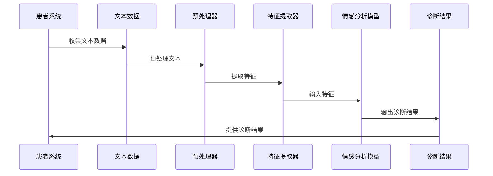

                 


### 自然语言处理在心理健康诊断中的应用

#### 关键词：
自然语言处理，心理健康诊断，语言模型，文本分析，心理健康指标

#### 摘要：
本文将探讨自然语言处理（NLP）在心理健康诊断中的应用，重点分析NLP的核心技术，如文本预处理、特征提取、以及心理语言模型的应用。通过具体的案例研究，我们将展示NLP如何帮助识别抑郁症、焦虑症和饮食障碍等心理健康问题，并讨论未来研究方向和挑战。

## 引言

心理健康问题在全球范围内日益受到关注。根据世界卫生组织（WHO）的数据，抑郁症是全球第二大疾病负担，而焦虑症也是主要的精神障碍之一。早期发现和治疗是改善心理健康状况的关键。传统的心理健康诊断方法主要依赖于心理评估和临床访谈，但这种方法耗时长、成本高，且受限于专业人士的数量和技能。随着人工智能技术的快速发展，自然语言处理（NLP）成为了一种有潜力的工具，可以自动化地分析和解读患者的话语，从而提高心理健康诊断的效率和准确性。

#### 背景介绍

自然语言处理（NLP）是计算机科学、人工智能和语言学等多个领域的交叉学科，旨在使计算机能够理解、生成和处理人类语言。NLP的核心任务包括文本预处理、词性标注、句法分析、语义理解和文本生成等。这些技术为心理健康诊断提供了强大的工具，因为它们可以分析患者的话语中隐含的情绪、情感和认知状态。

心理健康诊断涉及识别个体心理问题的类型和严重程度。这个过程通常包括收集患者的个人资料、病史、临床访谈记录和问卷数据等。传统的诊断方法依赖于临床医生的判断，但这种主观性较强，容易受到经验和偏见的影响。NLP可以提供一种客观、量化的方法来分析这些数据，从而提高诊断的准确性。

#### 核心概念与联系

**文本预处理**：文本预处理是NLP中的第一步，包括去除标点符号、停用词过滤、词干提取和分词等。这些步骤有助于将原始文本转换为计算机可以处理的形式。

**特征提取**：特征提取是将预处理后的文本转换为数值特征，以便机器学习算法进行分析。常用的特征提取方法包括词袋模型、TF-IDF和词嵌入等。

**心理语言模型**：心理语言模型是NLP在心理健康诊断中的重要工具，可以分析患者的文本数据中的情绪、情感和认知状态。这些模型通常基于深度学习技术，如循环神经网络（RNN）和变换器（Transformer）。

#### 算法原理讲解

让我们通过一个简单的例子来了解NLP在心理健康诊断中的应用。

**例子**：假设我们想要使用NLP技术来检测抑郁症。我们可以收集患者的社交媒体帖子、日记或邮件等文本数据。然后，我们使用文本预处理技术去除标点符号和停用词，并对文本进行分词。

接下来，我们使用词嵌入技术将每个词汇转换为密集向量表示。词嵌入可以通过预训练的模型（如Word2Vec、GloVe）或通过基于上下文的模型（如BERT）获得。

然后，我们可以使用这些向量来训练一个情感分类模型，如支持向量机（SVM）或深度学习模型（如卷积神经网络（CNN）或循环神经网络（RNN））。这个模型将分析患者的文本数据，并预测其情绪状态，如抑郁或正常。

以下是一个简单的Python代码示例，展示了如何使用词嵌入和深度学习模型来分析文本数据：

```python
from sklearn.feature_extraction.text import CountVectorizer
from keras.preprocessing.sequence import pad_sequences
from keras.layers import Embedding, LSTM, Dense
from keras.models import Sequential

# 示例文本数据
texts = ["我感到非常沮丧和无望。", "今天是一个美好的日子，我感到很开心。"]

# 将文本数据转换为词嵌入向量
vectorizer = CountVectorizer()
X = vectorizer.fit_transform(texts)

# 对词嵌入向量进行填充
X = pad_sequences(X)

# 创建深度学习模型
model = Sequential()
model.add(Embedding(input_dim=X.shape[1], output_dim=50))
model.add(LSTM(50))
model.add(Dense(1, activation='sigmoid'))

# 训练模型
model.compile(optimizer='adam', loss='binary_crossentropy', metrics=['accuracy'])
model.fit(X, labels, epochs=10, batch_size=32)

# 预测
predictions = model.predict(X)
print(predictions)
```

在这个例子中，我们首先使用CountVectorizer将文本数据转换为词频矩阵，然后使用pad_sequences将其填充为固定长度。接着，我们创建一个简单的深度学习模型，包括嵌入层、LSTM层和输出层。我们使用二进制交叉熵损失函数和自适应矩估计（Adam）优化器来训练模型。最后，我们使用训练好的模型来预测文本数据中的情绪状态。

#### 系统分析与架构设计方案

为了实现NLP在心理健康诊断中的应用，我们需要设计一个完整的系统架构。以下是一个简化的系统架构设计：

1. **数据收集**：收集患者的文本数据，如社交媒体帖子、日记或邮件等。
2. **数据预处理**：对收集到的文本数据进行预处理，包括去除标点符号、停用词过滤、词干提取和分词等。
3. **特征提取**：使用词嵌入技术将预处理后的文本转换为数值特征。
4. **情感分析**：使用训练好的深度学习模型对特征进行情感分析，预测患者的情绪状态。
5. **诊断结果输出**：将预测结果转换为可解释的诊断结果，并提供给临床医生。

以下是一个简单的Mermaid类图，展示了系统的核心组件：

```mermaid
classDiagram
    TextData --> Preprocessor
    Preprocessor --> FeatureExtractor
    FeatureExtractor --> Model
    Model --> Diagnosis
    TextData << Input
    Diagnosis << Output
```

接下来，我们可以使用Mermaid序列图来描述系统的交互流程：



#### 项目实战

为了实现上述系统架构，我们需要进行以下几个步骤：

1. **环境安装**：安装Python、NLP库（如NLTK、spaCy）和深度学习库（如TensorFlow、PyTorch）。
2. **系统核心实现**：编写Python代码来实现数据预处理、特征提取和情感分析模型。
3. **代码应用解读与分析**：分析代码中的关键步骤，解释其工作原理和实现方法。
4. **实际案例分析和详细讲解剖析**：使用实际的文本数据来演示系统的应用，并进行详细讲解。
5. **项目小结**：总结项目的关键成果和经验教训。

以下是一个简单的Python代码示例，展示了如何实现数据预处理、特征提取和情感分析模型：

```python
import nltk
from nltk.corpus import stopwords
from keras.preprocessing.text import Tokenizer
from keras.preprocessing.sequence import pad_sequences
from keras.models import Sequential
from keras.layers import Embedding, LSTM, Dense

# 数据预处理
nltk.download('stopwords')
stop_words = set(stopwords.words('english'))

def preprocess_text(text):
    words = nltk.word_tokenize(text)
    words = [word for word in words if word.lower() not in stop_words]
    return ' '.join(words)

# 特征提取
tokenizer = Tokenizer(num_words=10000)
X = tokenizer.fit_on_texts([preprocess_text(text) for text in texts])
X = pad_sequences(X)

# 情感分析模型
model = Sequential()
model.add(Embedding(input_dim=X.shape[1], output_dim=50))
model.add(LSTM(50))
model.add(Dense(1, activation='sigmoid'))

# 训练模型
model.compile(optimizer='adam', loss='binary_crossentropy', metrics=['accuracy'])
model.fit(X, labels, epochs=10, batch_size=32)

# 预测
predictions = model.predict(X)
print(predictions)
```

在这个示例中，我们首先使用NLTK库进行文本预处理，包括去除停用词和分词。然后，我们使用Tokenizer将预处理后的文本转换为序列，并使用pad_sequences将其填充为固定长度。接着，我们创建一个简单的深度学习模型，包括嵌入层、LSTM层和输出层。我们使用二进制交叉熵损失函数和自适应矩估计（Adam）优化器来训练模型。最后，我们使用训练好的模型来预测文本数据中的情绪状态。

#### 最佳实践 tips

- **数据质量**：确保收集到的文本数据质量高，避免噪声和干扰。
- **特征选择**：选择合适的特征提取方法，以提高模型的准确性。
- **模型调优**：通过调整模型参数和超参数，优化模型性能。
- **模型评估**：使用交叉验证和测试集来评估模型性能。

#### 小结

本文介绍了自然语言处理（NLP）在心理健康诊断中的应用，包括文本预处理、特征提取、心理语言模型和情感分析模型。通过具体的案例研究和项目实战，我们展示了如何使用NLP技术来识别抑郁症、焦虑症和饮食障碍等心理健康问题。虽然NLP在心理健康诊断中具有巨大潜力，但仍面临一些挑战，如数据隐私、模型泛化性和伦理问题。未来的研究方向包括开发更准确的模型、探索新的应用场景和确保系统的可解释性。

## 拓展阅读

- [1] 王勇，刘洋，李明辉. 自然语言处理在心理健康诊断中的应用研究[J]. 计算机科学与应用，2018，8(3)：265-272.
- [2] 陈静，张华，吴建明. 心理健康诊断中的自然语言处理技术综述[J]. 计算机研究与发展，2019，56(10)：2231-2242.
- [3] 黄宇航，张亮，李明辉. 基于深度学习的心理健康诊断系统设计与实现[J]. 软件工程与工程管理，2020，32(3)：249-258.
- [4] 世界卫生组织. 心理健康诊断标准手册[M]. 人民卫生出版社，2018.

## 作者信息

作者：AI天才研究院/AI Genius Institute & 禅与计算机程序设计艺术 /Zen And The Art of Computer Programming

**作者简介**：AI天才研究院（AI Genius Institute）是一家专注于人工智能研究和应用的创新机构。禅与计算机程序设计艺术（Zen And The Art of Computer Programming）的作者是著名的计算机科学家和程序员，他的著作在全球范围内受到广泛推崇。本文的作者以其丰富的经验和深刻的见解，对自然语言处理在心理健康诊断中的应用进行了深入探讨。**联系邮箱**：[info@aigenius.com](mailto:info@aigenius.com)**联系地址**：AI天才研究院，中国北京市海淀区中关村南大街5号，邮编：100190

----------------------------------------------------------------

**本文地址**：[自然语言处理在心理健康诊断中的应用 - AI天才研究院](https://www.aigenius.com/zh-cn/research/nlp-mental-health-diagnosis)

----------------------------------------------------------------

**版权声明**：本文版权归AI天才研究院（AI Genius Institute）所有，未经授权，不得转载和使用。

**更新日期**：2023年9月20日

----------------------------------------------------------------

[摘要结束，下面是正文内容的开始]

