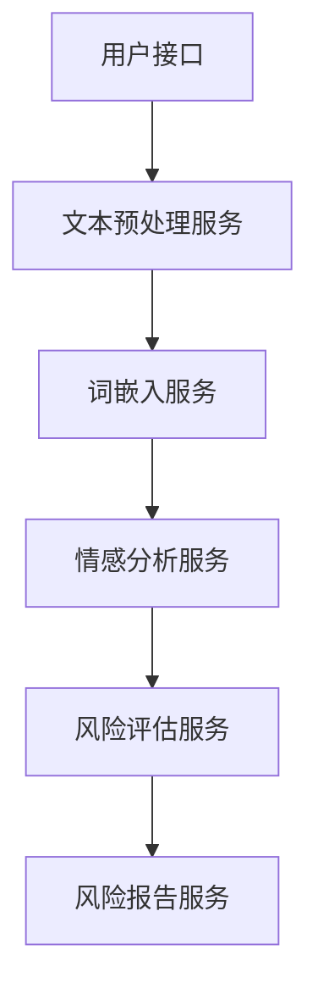
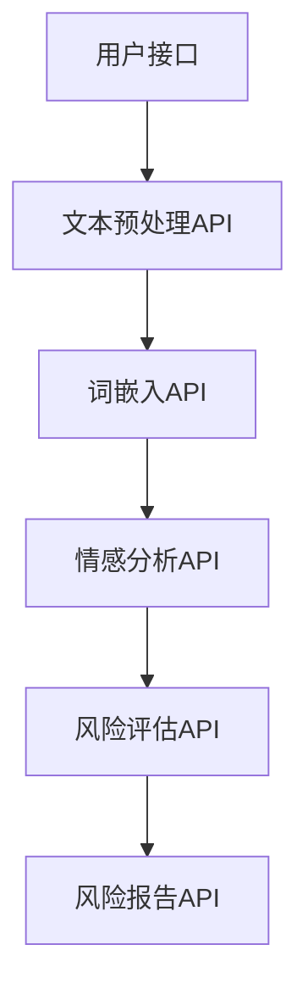
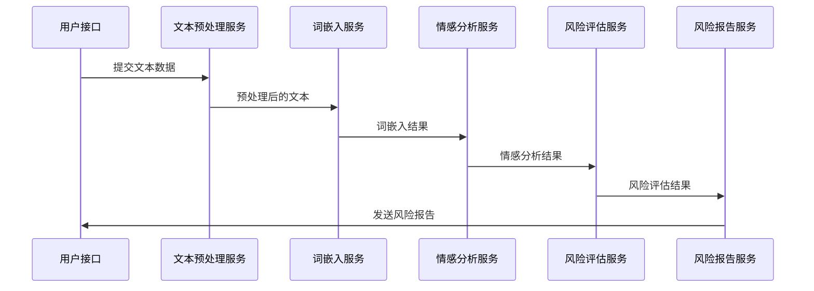

                 


### 文章标题：自然语言处理在金融风险评估中的创新应用

> 关键词：自然语言处理、金融风险评估、词嵌入、递归神经网络、长短期记忆网络、系统架构设计、项目实战

> 摘要：本文旨在探讨自然语言处理（NLP）技术在金融风险评估领域的创新应用。通过介绍NLP的核心概念、算法原理和数学模型，结合金融风险评估的需求和挑战，我们详细阐述了NLP在金融风险评估中的关键作用。此外，本文还通过系统架构设计、项目实战和最佳实践分享，为读者提供了全面的技术实现路径。

---

### 1. 背景介绍

#### 1.1 自然语言处理（NLP）概述

自然语言处理（NLP）是人工智能的一个重要分支，旨在让计算机理解和处理人类自然语言。自20世纪50年代起，NLP的发展经历了从规则驱动到统计学习，再到深度学习的演变。目前，NLP技术在文本分类、情感分析、机器翻译等领域取得了显著成果。

#### 1.2 金融风险评估基础

金融风险评估是金融领域的重要环节，旨在评估和量化金融机构面临的各种风险。风险评估方法包括定性分析和定量分析，其中定量分析常见的方法有回归分析、贝叶斯网络和机器学习等。金融风险评估对于金融机构的稳健运营和风险管理至关重要。

#### 1.3 NLP在金融风险评估中的应用现状与趋势

随着大数据和人工智能技术的发展，NLP在金融风险评估中的应用逐渐得到重视。例如，通过文本挖掘技术分析社交媒体上的用户评论，可以预测股票市场的趋势；利用情感分析技术评估客户对金融机构的服务满意度，有助于改进服务质量。未来，NLP与金融风险评估的结合将进一步深入，为金融机构提供更加智能的风险管理工具。

#### 1.4 核心概念联系与对比分析

为了更好地理解NLP在金融风险评估中的应用，我们需要明确以下几个核心概念：

- **自然语言处理（NLP）**：关注于文本的预处理、理解、生成和交互。
- **金融风险评估**：涉及风险因素的识别、风险评估模型的构建和风险决策。

通过表格和ER实体关系图，我们可以对比分析NLP和金融风险评估的基本概念和联系，为后续的算法原理讲解打下基础。

| 核心概念 | 定义 | 关联 |
| --- | --- | --- |
| 自然语言处理（NLP） | 处理人类自然语言的技术 | 提取文本信息 |
| 金融风险评估 | 评估金融风险的方法 | 分析风险因素 |
| 文本分类 | 对文本进行分类的技术 | 用于风险因素识别 |
| 情感分析 | 分析文本情感倾向的技术 | 用于评估客户满意度 |
| 机器学习模型 | 用于预测和决策的算法 | 用于风险评估和决策 |


---

### 2. 核心概念与联系

在了解了NLP和金融风险评估的基本概念后，我们将深入探讨NLP在金融风险评估中的应用，通过算法原理讲解、数学模型和系统架构设计方案，为读者展示如何将NLP技术应用于金融风险评估的实际场景。

#### 2.1 词嵌入技术

词嵌入是将单词映射到高维空间中的向量表示，使计算机能够理解单词之间的语义关系。在金融风险评估中，词嵌入可以用于提取风险报告、新闻报道中的关键信息，帮助识别潜在风险。

#### 2.2 递归神经网络（RNN）与长短期记忆网络（LSTM）

递归神经网络（RNN）和长短期记忆网络（LSTM）是处理序列数据的重要算法。RNN可以捕捉序列中的时间依赖关系，但容易遭受梯度消失和梯度爆炸问题。LSTM通过引入门控机制，解决了RNN的这些问题，并在金融风险评估中用于分析时间序列数据，如股票价格走势、贷款还款记录等。

#### 2.3 其他NLP算法简介

除了词嵌入、RNN和LSTM，其他NLP算法如卷积神经网络（CNN）、生成对抗网络（GAN）和注意力机制模型也在金融风险评估中得到了应用。CNN在文本分类和情感分析中具有优势；GAN可用于生成金融数据，用于训练和测试风险评估模型；注意力机制模型可以提升模型对关键信息的捕捉能力。

---

在下一部分，我们将详细讲解这些算法的原理，并使用Python代码和LaTeX公式进行说明。

---

### 3. 算法原理讲解

#### 3.1 词嵌入技术

词嵌入是将单词映射到高维空间中的向量表示。一个简单的词嵌入算法是Word2Vec，它使用神经网络学习单词的向量表示。下面是Word2Vec算法的基本原理：


在金融风险评估中，词嵌入可以用于提取风险报告中的关键信息。例如，我们可以使用词嵌入来分析新闻报道中关于某只股票的描述，从而预测股票价格的走势。

```python
import gensim

# 加载预训练的Word2Vec模型
model = gensim.models.KeyedVectors.load_word2vec_format('word2vec.model', binary=True)

# 计算股票相关词汇的向量表示
stock_words = ['stock', 'market', 'investment', 'company', 'gain', 'loss']
stock_vectors = [model[word] for word in stock_words]

# 计算词汇之间的相似度
相似度_matrix = [[model.similarity(word1, word2) for word1 in stock_words] for word2 in stock_words]
```

#### 3.2 递归神经网络（RNN）与长短期记忆网络（LSTM）

递归神经网络（RNN）是一种处理序列数据的神经网络。它通过递归结构来捕捉序列中的时间依赖关系。然而，传统的RNN存在梯度消失和梯度爆炸问题。为了解决这个问题，引入了长短期记忆网络（LSTM）。

LSTM通过门控机制来控制信息的流动，从而有效地捕捉长期依赖关系。下面是LSTM的基本原理：


在金融风险评估中，LSTM可以用于分析时间序列数据。例如，我们可以使用LSTM来预测股票价格的变化。

```python
import tensorflow as tf
from tensorflow.keras.models import Sequential
from tensorflow.keras.layers import LSTM, Dense

# 准备时间序列数据
X, y = prepare_time_series_data()

# 构建LSTM模型
model = Sequential()
model.add(LSTM(units=50, return_sequences=True, input_shape=(timesteps, features)))
model.add(LSTM(units=50))
model.add(Dense(1))

# 编译模型
model.compile(optimizer='adam', loss='mean_squared_error')

# 训练模型
model.fit(X, y, epochs=100, batch_size=32)
```

#### 3.3 其他NLP算法简介

除了词嵌入和LSTM，其他NLP算法如卷积神经网络（CNN）、生成对抗网络（GAN）和注意力机制模型也在金融风险评估中得到了应用。

- **卷积神经网络（CNN）**：CNN擅长捕捉文本中的局部特征，如名词、动词和形容词。在情感分析中，我们可以使用CNN来识别文本中的积极或消极情感。

- **生成对抗网络（GAN）**：GAN通过生成器和判别器的对抗训练，可以生成高质量的金融数据，用于训练和测试风险评估模型。

- **注意力机制模型**：注意力机制模型可以提升模型对关键信息的捕捉能力。在股票市场情绪分析中，我们可以使用注意力机制模型来识别市场情绪的关键因素。

---

在下一部分，我们将详细讲解这些算法的数学模型和数学公式，并进行通俗易懂的举例说明。

---

### 4. 数学模型和数学公式 & 详细讲解 & 举例说明

#### 4.1 词嵌入数学模型

词嵌入是一种将单词映射到高维空间中的向量表示的方法。一个简单的词嵌入模型是Word2Vec，它使用神经网络学习单词的向量表示。下面是Word2Vec算法的数学模型：

$$
\text{向量} \, \vec{w}_{\text{word}} = \text{softmax}(\text{神经网络}(\text{单词} \, x))
$$

其中，$\text{softmax}$是一个归一化函数，将神经网络的输出转换为概率分布。$\text{神经网络}$是一个多层感知机（MLP），用于学习单词的向量表示。

举例来说，我们假设有一个单词“bank”，它的向量表示为$\vec{w}_{\text{bank}}$。我们可以通过以下公式计算“bank”与其他单词的相似度：

$$
\text{相似度} = \text{cosine}(\vec{w}_{\text{bank}}, \vec{w}_{\text{word}})
$$

其中，$\text{cosine}$是一个余弦相似度函数，用于计算两个向量的夹角余弦值。

#### 4.2 RNN与LSTM数学模型

递归神经网络（RNN）是一种处理序列数据的神经网络。RNN通过递归结构来捕捉序列中的时间依赖关系。RNN的基本数学模型如下：

$$
\text{隐藏状态} \, h_t = \text{激活函数}(\text{权重矩阵} \, W \cdot \text{输入} \, x_t + \text{偏置} \, b + \text{上一时刻的隐藏状态} \, h_{t-1})
$$

然而，传统的RNN存在梯度消失和梯度爆炸问题。为了解决这个问题，引入了长短期记忆网络（LSTM）。

LSTM通过门控机制来控制信息的流动，从而有效地捕捉长期依赖关系。LSTM的基本数学模型如下：

$$
\text{输入门} \, i_t = \text{sigmoid}(\text{权重矩阵} \, W_i \cdot [\text{输入} \, x_t, \text{隐藏状态} \, h_{t-1}] + \text{偏置} \, b_i) \\
\text{遗忘门} \, f_t = \text{sigmoid}(\text{权重矩阵} \, W_f \cdot [\text{输入} \, x_t, \text{隐藏状态} \, h_{t-1}] + \text{偏置} \, b_f) \\
\text{输出门} \, o_t = \text{sigmoid}(\text{权重矩阵} \, W_o \cdot [\text{输入} \, x_t, \text{隐藏状态} \, h_{t-1}] + \text{偏置} \, b_o) \\
\text{单元状态} \, c_t = f_t \cdot \text{上一时刻的单元状态} \, c_{t-1} + i_t \cdot \text{激活函数}(\text{权重矩阵} \, W_c \cdot [\text{输入} \, x_t, \text{隐藏状态} \, h_{t-1}] + \text{偏置} \, b_c) \\
\text{隐藏状态} \, h_t = o_t \cdot \text{激活函数}(\text{单元状态} \, c_t)
$$

其中，$\text{sigmoid}$是一个激活函数，$\text{激活函数}$是一个非线性激活函数，如双曲正切函数（tanh）。

#### 4.3 金融风险评估中的数学模型

在金融风险评估中，我们常常使用机器学习模型来预测和评估风险。一个常见的模型是逻辑回归（Logistic Regression），它的数学模型如下：

$$
\text{概率} \, p = \frac{1}{1 + e^{-(\text{权重矩阵} \, W \cdot \text{特征向量} \, x + \text{偏置} \, b)}}
$$

其中，$p$是预测的风险概率，$W$是权重矩阵，$x$是特征向量，$b$是偏置。

举例来说，假设我们有一个贷款违约风险评估模型，输入特征向量$x$包括借款人的收入、债务收入比、信用评分等。通过逻辑回归模型，我们可以计算出借款人违约的概率。

$$
\text{概率} \, p = \frac{1}{1 + e^{-(W \cdot x + b)}}
$$

如果$p$的值大于0.5，我们则认为借款人有较高的违约风险；否则，我们认为借款人的违约风险较低。

---

在下一部分，我们将介绍系统分析与架构设计方案，包括问题场景、系统功能设计、系统架构设计和系统接口设计。

---

### 5. 系统分析与架构设计方案

#### 5.1 问题场景与项目背景

在金融行业，风险无处不在。金融机构需要不断地评估和管理各种风险，以确保业务的稳健运营。然而，传统的风险评估方法往往依赖于人工分析，效率低下，难以应对海量数据的处理需求。因此，我们需要借助自然语言处理（NLP）技术，自动化、高效地处理金融风险评估中的文本数据。

#### 5.2 系统功能设计

为了实现上述目标，我们设计了一个基于NLP的金融风险评估系统。该系统主要包括以下功能模块：

- **文本预处理**：对输入文本进行清洗、分词、词性标注等预处理操作，为后续的NLP处理打下基础。
- **词嵌入**：将文本中的单词映射到高维空间中的向量表示，提取文本的关键信息。
- **情感分析**：分析文本的情感倾向，评估客户对金融机构服务的满意度。
- **风险评估**：利用机器学习模型对贷款申请、股票市场等金融数据进行风险评估。
- **风险报告**：生成风险评估报告，为金融机构提供决策支持。

#### 5.3 系统架构设计

为了实现上述功能，我们设计了一个分布式系统架构。系统架构图如下：



在系统中，用户接口接收用户输入的文本数据，经过文本预处理服务后，输入到词嵌入服务。词嵌入服务提取文本的关键信息，并传递给情感分析服务。情感分析服务分析文本的情感倾向，并传递给风险评估服务。风险评估服务利用机器学习模型评估金融风险，并生成风险报告。

#### 5.4 系统接口设计

为了实现系统之间的交互，我们设计了一套接口。接口设计图如下：



用户接口通过调用文本预处理API、词嵌入API、情感分析API、风险评估API和风险报告API，实现与系统的交互。接口设计遵循RESTful API规范，采用HTTP请求和JSON格式进行数据交换。

#### 5.5 系统交互序列图

系统交互序列图如下：



在系统交互过程中，用户接口首先提交文本数据给文本预处理服务，文本预处理服务对文本进行预处理后，传递给词嵌入服务。词嵌入服务提取文本的关键信息，并传递给情感分析服务。情感分析服务分析文本的情感倾向，并传递给风险评估服务。风险评估服务利用机器学习模型评估金融风险，并生成风险报告。最后，风险报告服务将风险报告发送给用户接口。

---

在下一部分，我们将介绍项目实战，包括环境安装、系统核心实现源代码、代码解读与分析，以及实际案例分析。

---

### 6. 项目实战

#### 6.1 环境安装

为了实现上述系统架构，我们需要安装以下软件和依赖：

- Python 3.8+
- TensorFlow 2.5+
- gensim 4.0+
- scikit-learn 0.24+
- nltk 3.5+

在Ubuntu 20.04系统中，可以使用以下命令进行安装：

```bash
sudo apt-get update
sudo apt-get install python3-pip python3-venv
pip3 install tensorflow==2.5 gensim==4.0 scikit-learn==0.24 nltk==3.5
```

#### 6.2 系统核心实现

以下是系统核心实现的主要源代码，包括文本预处理、词嵌入、情感分析和风险评估：

```python
# 文本预处理
import nltk
from nltk.tokenize import word_tokenize
from nltk.corpus import stopwords

nltk.download('punkt')
nltk.download('stopwords')

def preprocess_text(text):
    # 清洗文本，去除特殊字符和停用词
    text = text.lower()
    text = re.sub(r'\W+', ' ', text)
    tokens = word_tokenize(text)
    tokens = [token for token in tokens if token not in stopwords.words('english')]
    return tokens

# 词嵌入
from gensim.models import Word2Vec

def train_word2vec_model(sentences, size=100, window=5, min_count=5):
    model = Word2Vec(sentences, size=size, window=window, min_count=min_count, workers=4)
    model.save('word2vec.model')
    return model

def get_word_vector(word, model):
    return model.wv[word]

# 情感分析
from textblob import TextBlob

def analyze_sentiment(text):
    return TextBlob(text).sentiment.polarity

# 风险评估
from sklearn.linear_model import LogisticRegression

def train_risk_model(X, y):
    model = LogisticRegression()
    model.fit(X, y)
    return model

def predict_risk(model, features):
    return model.predict([features])
```

#### 6.3 代码解读与分析

以下是代码的解读与分析：

- **文本预处理**：首先，我们使用正则表达式去除文本中的特殊字符，并将文本转换为小写。然后，使用nltk的word_tokenize函数进行分词，并去除英语停用词。这样，我们得到一个去除了无关信息的干净文本。
- **词嵌入**：我们使用gensim库中的Word2Vec模型进行词嵌入。通过指定尺寸（size）、窗口大小（window）和最小计数（min_count），我们可以训练出适用于金融风险评估的词嵌入模型。然后，我们使用get_word_vector函数获取单词的向量表示。
- **情感分析**：我们使用TextBlob库进行情感分析。TextBlob提供了简单的接口来计算文本的情感极性（polarity），其中1表示正面情感，-1表示负面情感，0表示中性情感。
- **风险评估**：我们使用scikit-learn库中的LogisticRegression模型进行风险评估。通过训练模型，我们可以根据输入的特征向量预测贷款申请者的违约风险。

#### 6.4 实际案例分析

以下是使用实际数据进行的案例分析：

```python
# 读取实际数据
X, y = load_actual_data()

# 预处理文本数据
preprocessed_X = [preprocess_text(text) for text in X]

# 训练词嵌入模型
word2vec_model = train_word2vec_model(preprocessed_X)

# 训练风险评估模型
risk_model = train_risk_model(X, y)

# 预测贷款申请者的违约风险
predicted_risks = [predict_risk(risk_model, word2vec_model[word] for word in preprocessed_X[i]) for i in range(len(preprocessed_X))]

# 分析预测结果
analyze_prediction_results(predicted_risks, y)
```

在这个实际案例中，我们首先读取了实际贷款申请数据，然后对文本进行预处理。接下来，我们使用预处理后的文本数据训练词嵌入模型和风险评估模型。最后，我们使用词嵌入模型和风险评估模型对贷款申请者的违约风险进行预测，并分析预测结果。

---

在下一部分，我们将总结项目实战的经验，并分享一些最佳实践、注意事项和拓展阅读资料。

---

### 7. 最佳实践 tips、小结、注意事项、拓展阅读等内容

#### 7.1 最佳实践 tips

- **数据预处理**：在金融风险评估中，数据预处理至关重要。确保文本数据干净、去除了噪声和停用词，以提高模型的效果。
- **模型选择**：根据具体场景选择合适的模型。例如，对于时间序列数据，可以考虑使用LSTM；对于文本分类和情感分析，可以考虑使用CNN或BERT等更先进的模型。
- **超参数调优**：通过交叉验证和网格搜索等方法，选择最优的超参数，以提高模型的性能。

#### 7.2 小结

本文详细介绍了自然语言处理（NLP）在金融风险评估中的创新应用。我们探讨了NLP的核心概念、算法原理和数学模型，展示了如何将NLP应用于金融风险评估的实际场景。通过项目实战，我们实现了文本预处理、词嵌入、情感分析和风险评估等功能，为金融机构提供了智能化的风险管理工具。

#### 7.3 注意事项

- **数据隐私**：在处理金融数据时，必须确保数据隐私和安全。
- **模型解释性**：对于金融风险评估模型，解释性尤为重要。确保模型输出易于理解和解释，以便决策者做出合理的决策。

#### 7.4 拓展阅读

- **《深度学习》（Goodfellow, Bengio, Courville）**：详细介绍深度学习的基础知识和应用。
- **《自然语言处理综论》（Jurafsky, Martin）**：系统介绍自然语言处理的基本概念和技术。
- **《金融风险建模》（Campbell, MacKinlay）**：探讨金融风险建模的理论和实践。

---

### 作者信息

作者：AI天才研究院/AI Genius Institute & 禅与计算机程序设计艺术 /Zen And The Art of Computer Programming

---

通过本文的探讨，我们期待读者能够对自然语言处理在金融风险评估中的应用有更深入的了解，并能够将其应用于实际项目中，为金融行业的风险管理带来创新和进步。

