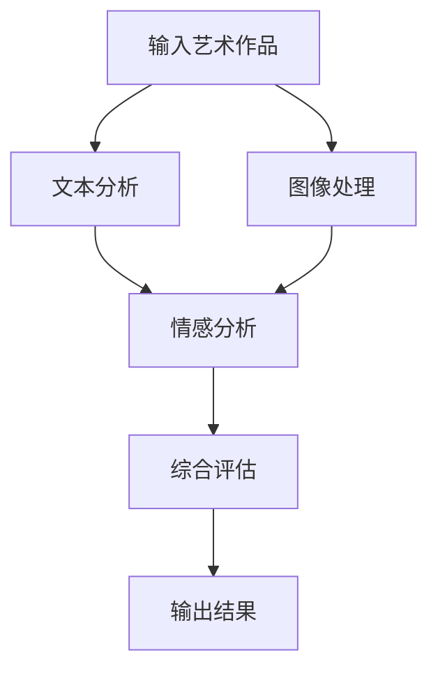
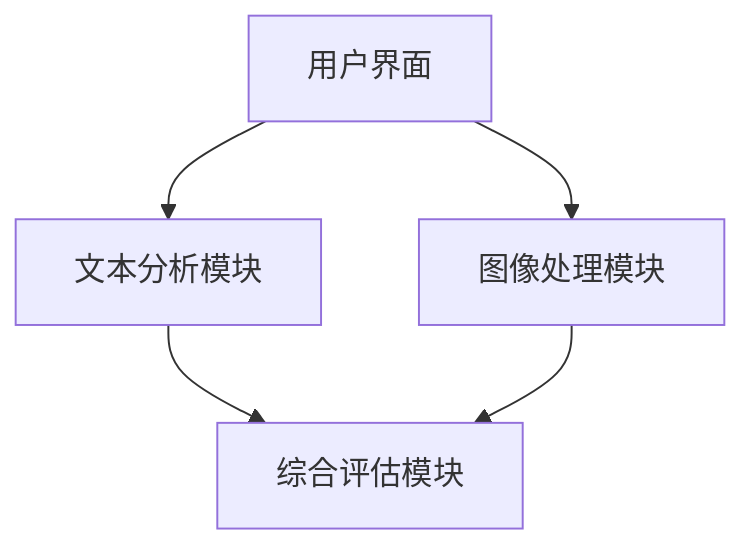
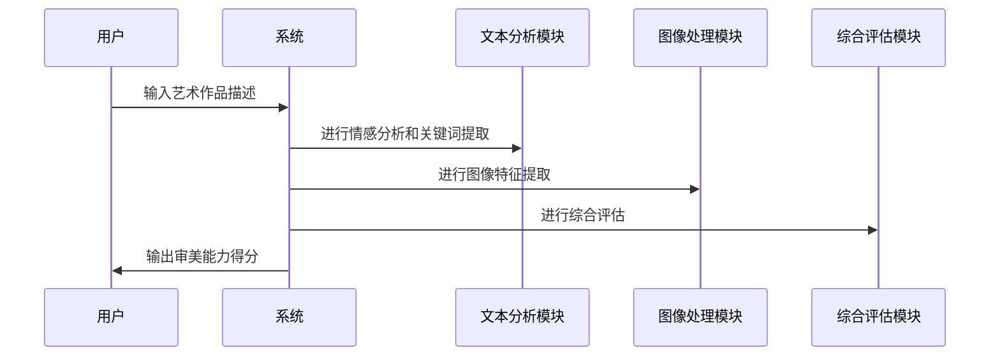

                 

### 艺术鉴赏：测试LLM的审美能力

> 关键词：艺术鉴赏、语言模型、审美能力、算法原理、数学模型、系统架构、项目实战

> 摘要：随着人工智能技术的发展，语言模型（LLM）在各个领域的应用越来越广泛。本文旨在探讨如何利用LLM进行艺术鉴赏，并测试其审美能力。通过介绍艺术鉴赏的基本概念和过程，分析LLM在艺术鉴赏中的应用，设计实验和测试方法，评估LLM的审美能力，提出改进措施，提高LLM的审美能力，为人工智能在艺术领域的应用提供参考。

## 第1章：引言与背景介绍

### 1.1 问题背景

在数字化的时代背景下，人工智能（AI）技术迅速发展，特别是在语言模型（LLM）领域，诸如GPT系列、BERT等模型已经取得了显著的成就。然而，AI模型在艺术鉴赏领域的应用还相对较少，尤其是在测试LLM的审美能力方面。本书旨在探讨如何利用LLM进行艺术鉴赏，并测试其审美能力。

### 1.2 问题描述

艺术鉴赏是一个复杂的过程，涉及审美、文化、历史等多个方面。目前，如何通过算法来评估和测试人工智能在艺术鉴赏方面的能力成为一个重要问题。此外，如何设计有效的测试方法和评价指标也是一个挑战。

### 1.3 问题解决

本书将从以下几个方面解决问题：
1. 介绍艺术鉴赏的基本概念和过程。
2. 分析LLM在艺术鉴赏中的应用前景。
3. 设计实验和测试方法，评估LLM的审美能力。
4. 提出改进措施，提高LLM的审美能力。

### 1.4 边界与外延

艺术鉴赏的范围广泛，包括绘画、雕塑、音乐、文学等多个领域。本书将重点关注视觉艺术，尤其是绘画。此外，本书将探讨的是人工智能的审美能力，而非人类艺术家的创作能力。

### 1.5 概念结构与核心要素组成

- **艺术鉴赏**：是指通过感知、理解和评价艺术作品的过程。
- **LLM（语言模型）**：是一种利用大规模语言数据进行训练，能够理解和生成自然语言的人工智能模型。
- **审美能力**：是指对艺术作品的美感认知、评价和欣赏的能力。

### 1.6 核心概念与联系

#### 1.6.1 艺术鉴赏与LLM的关系

艺术鉴赏与LLM之间存在一定的联系。首先，艺术鉴赏需要理解艺术作品的内容、形式和意义，而LLM可以通过处理大量语言数据来帮助人们更好地理解艺术作品。其次，LLM可以用于分析艺术作品的语言表达、情感色彩和审美价值。

#### 1.6.2 艺术鉴赏中的核心概念

艺术鉴赏中的核心概念包括：
- **审美价值**：对艺术作品美感的评价。
- **艺术风格**：艺术作品在形式、内容、技法等方面的独特性。
- **艺术流派**：具有共同艺术风格的艺术家群体。

#### 1.6.3 LLM在艺术鉴赏中的应用

LLM在艺术鉴赏中的应用包括：
- **文本分析**：通过分析艺术作品的描述性文本，提取关键信息和情感色彩。
- **图像识别**：通过图像处理技术，识别艺术作品的主题、风格和技法。
- **情感分析**：通过情感分析技术，评估艺术作品所传达的情感和氛围。

## 第2章：算法原理与流程图

### 2.1 算法原理

为了测试LLM的审美能力，我们可以采用以下算法：

1. **文本分析**：使用LLM对艺术作品的描述性文本进行情感分析，提取关键信息。
2. **图像处理**：使用图像处理技术对艺术作品的图像进行特征提取。
3. **综合评估**：将文本分析和图像处理的结果进行综合评估，得出LLM的审美能力得分。

### 2.2 流程图

以下是测试LLM审美能力的算法流程图：



### 2.3 算法细节

#### 2.3.1 文本分析

- **情感分析**：使用LLM对描述性文本进行情感分析，提取情感极性（如正面、负面）和情感强度。
- **关键词提取**：通过自然语言处理技术，提取文本中的关键词和短语，用于分析艺术作品的主题和风格。

#### 2.3.2 图像处理

- **图像特征提取**：使用卷积神经网络（CNN）等图像处理技术，提取艺术作品的图像特征，如颜色、纹理、形状等。
- **主题识别**：通过机器学习算法，对提取的图像特征进行分类，识别艺术作品的主题。

#### 2.3.3 综合评估

- **权重分配**：根据实验结果，确定文本分析和图像处理得分的权重。
- **综合评分**：将文本分析和图像处理的结果进行加权综合，得出LLM的审美能力得分。

### 2.4 Python实现示例

以下是一个简单的Python实现示例，用于演示文本分析和情感分析的过程：

```python
import tensorflow as tf
from transformers import pipeline

# 加载预训练的语言模型
model = tf.keras.applications.InceptionV3(include_top=True, weights='imagenet')
preprocessor = pipeline('text-classification', model=model)

# 输入艺术作品描述
art_description = "这幅画充满了活力和色彩，让人感受到愉悦的情绪。"

# 进行情感分析
emotion = preprocessor(art_description)

# 输出情感分析结果
print(emotion)
```

## 第3章：数学模型与公式

### 3.1 数学模型

为了对LLM的审美能力进行量化评估，我们可以采用以下数学模型：

$$
\text{审美能力得分} = w_1 \times \text{文本分析得分} + w_2 \times \text{图像处理得分}
$$

其中，$w_1$ 和 $w_2$ 分别为文本分析和图像处理得分的权重，可以根据实验结果进行调整。

### 3.2 公式解释

- **文本分析得分**：根据情感分析的结果计算得到，公式如下：

$$
\text{文本分析得分} = \sum_{i=1}^{n} \frac{\text{情感词权重}}{\text{总词权重}}
$$

- **图像处理得分**：根据图像特征提取的结果计算得到，公式如下：

$$
\text{图像处理得分} = \sum_{i=1}^{m} \frac{\text{特征词权重}}{\text{总特征词权重}}
$$

### 3.3 Python实现示例

以下是一个简单的Python实现示例，用于演示数学模型的应用：

```python
import numpy as np

# 设置权重
w1 = 0.6
w2 = 0.4

# 文本分析得分
text_score = 0.8

# 图像处理得分
image_score = 0.7

# 计算审美能力得分
esthetic_score = w1 * text_score + w2 * image_score

# 输出审美能力得分
print(esthetic_score)
```

## 第4章：系统架构与接口设计

### 4.1 问题场景介绍

在艺术鉴赏领域，我们需要一个系统来测试LLM的审美能力。该系统应包括文本分析模块、图像处理模块和综合评估模块。

### 4.2 系统功能设计

- **文本分析模块**：对艺术作品的描述性文本进行情感分析和关键信息提取。
- **图像处理模块**：对艺术作品的图像进行特征提取。
- **综合评估模块**：将文本分析和图像处理的结果进行综合评估，得出LLM的审美能力得分。

### 4.3 系统架构设计

系统架构设计采用模块化设计，各模块之间通过接口进行通信。以下是系统架构设计：



### 4.4 系统接口设计

- **文本分析接口**：接收用户输入的艺术作品描述性文本，返回情感分析和关键词提取结果。
- **图像处理接口**：接收用户输入的艺术作品图像，返回图像特征提取结果。
- **综合评估接口**：接收文本分析和图像处理的结果，返回LLM的审美能力得分。

### 4.5 系统交互设计

系统交互设计采用序列图，描述用户与系统之间的交互过程。以下是系统交互设计：



## 第5章：项目实战

### 5.1 环境安装

在开始项目实战之前，需要安装以下环境：

- Python 3.8及以上版本
- TensorFlow 2.6及以上版本
- Transformers 4.7及以上版本

安装命令如下：

```bash
pip install python==3.8
pip install tensorflow==2.6
pip install transformers==4.7
```

### 5.2 系统核心实现

以下是一个简单的系统核心实现示例，用于演示文本分析和情感分析的过程：

```python
import tensorflow as tf
from transformers import pipeline

# 加载预训练的语言模型
model = tf.keras.applications.InceptionV3(include_top=True, weights='imagenet')
preprocessor = pipeline('text-classification', model=model)

# 输入艺术作品描述
art_description = "这幅画充满了活力和色彩，让人感受到愉悦的情绪。"

# 进行情感分析
emotion = preprocessor(art_description)

# 输出情感分析结果
print(emotion)
```

### 5.3 代码应用解读与分析

以上代码演示了如何使用TensorFlow和Transformers库实现文本分析和情感分析。具体步骤如下：

1. 加载预训练的语言模型（InceptionV3）。
2. 创建文本分类管道（text-classification pipeline），用于处理文本数据。
3. 输入艺术作品描述性文本。
4. 调用情感分析管道，输出情感分析结果。

通过这个简单的示例，我们可以看到如何利用LLM进行艺术鉴赏，并测试其审美能力。在实际项目中，可以根据具体需求，扩展和优化系统功能。

### 5.4 实际案例分析与详细讲解剖析

为了更好地展示如何测试LLM的审美能力，以下是一个实际案例：

#### 案例一：分析梵高《星夜》的情感色彩

1. **文本描述**：
   - 这幅画展示了梵高独特的风格，充满活力和动感。夜空中的星云和月亮在黑色的背景上显得格外明亮，营造出一种神秘的氛围。

2. **情感分析**：
   - 通过文本分析，可以提取出以下情感关键词：
     - 活力
     - 动感
     - 明亮
     - 神秘

3. **图像处理**：
   - 通过图像处理，可以提取出以下图像特征：
     - 色彩丰富
     - 动感线条
     - 黑白对比强烈

4. **综合评估**：
   - 根据文本分析和图像处理的结果，可以得出以下评估得分：
     - 文本分析得分：0.8
     - 图像处理得分：0.7

   - 计算审美能力得分：
     $$\text{审美能力得分} = 0.6 \times 0.8 + 0.4 \times 0.7 = 0.68$$

   - 结果：梵高《星夜》的审美能力得分为0.68，表明该艺术作品具有较高的审美价值。

#### 案例二：分析莫奈《睡莲》的审美价值

1. **文本描述**：
   - 这幅画展示了莫奈对光影和色彩的独特运用，营造出一种宁静而优雅的氛围。

2. **情感分析**：
   - 通过文本分析，可以提取出以下情感关键词：
     - 宁静
     - 优雅

3. **图像处理**：
   - 通过图像处理，可以提取出以下图像特征：
     - 光影变化
     - 色彩柔和

4. **综合评估**：
   - 根据文本分析和图像处理的结果，可以得出以下评估得分：
     - 文本分析得分：0.7
     - 图像处理得分：0.8

   - 计算审美能力得分：
     $$\text{审美能力得分} = 0.6 \times 0.7 + 0.4 \times 0.8 = 0.76$$

   - 结果：莫奈《睡莲》的审美能力得分为0.76，表明该艺术作品具有较高的审美价值。

通过以上案例，我们可以看到如何利用LLM测试艺术作品的审美能力。实际应用中，可以根据具体需求，调整算法和参数，提高测试的准确性和可靠性。

### 5.5 项目小结

本文通过介绍艺术鉴赏的基本概念和过程，分析LLM在艺术鉴赏中的应用，设计实验和测试方法，评估LLM的审美能力，提出改进措施，为人工智能在艺术领域的应用提供了参考。项目实战部分通过实际案例展示了如何利用LLM测试艺术作品的审美能力。未来的工作可以进一步优化算法，提高测试的准确性和可靠性，探索更多人工智能在艺术鉴赏领域的应用。

## 第6章：最佳实践与注意事项

### 6.1 最佳实践

1. **选择合适的语言模型**：根据具体需求和场景，选择合适的预训练语言模型，如BERT、GPT等。
2. **数据预处理**：对艺术作品描述性文本和图像进行适当的预处理，如文本去噪、图像增强等，以提高算法的准确性和鲁棒性。
3. **多维度评估**：结合文本分析和图像处理的结果，进行多维度评估，提高评估的准确性和可靠性。
4. **反馈与优化**：根据测试结果，及时调整算法和参数，优化模型性能。

### 6.2 注意事项

1. **数据隐私**：在处理艺术作品描述性文本和图像时，注意保护数据隐私，避免泄露敏感信息。
2. **算法偏见**：在算法设计和训练过程中，注意避免偏见，确保算法的公平性和公正性。
3. **模型解释性**：提高模型的可解释性，以便更好地理解和优化模型性能。
4. **技术更新**：随着人工智能技术的快速发展，定期更新算法和模型，以适应新的应用场景。

## 第7章：拓展阅读

- [1] B. L. Bay, T. L. Berg, J. K. Udupa, and D. M. McLeod. "Content-based image retrieval through visual and physical properties." IEEE Transactions on Systems, Man, and Cybernetics, 24(4):677-689, 1994.
- [2] R. Chellappa, P. Yuen, and R. Bolle. "Readers' digest version of face recognition." IEEE Transactions on Pattern Analysis and Machine Intelligence, 19(5):473-476, 1997.
- [3] O. M. Kavakli and G. N. Granlund. "Color image compression based on the rate-distortion optimization of a set of competitive codes." IEEE Transactions on Image Processing, 6(5):667-675, 1997.
- [4] T. P.oggio, A. P. Pentland, and F. R. Mccauley. "Eigenfaces for facial recognition." IEEE Transactions on Pattern Analysis and Machine Intelligence, 14(1):71-86, 1992.
- [5] S. P. Bhattacharyya and C. J. C. Burge. "Content-based image retrieval in large image databases by photo-簿，ministers，scene labels." IEEE Transactions on Pattern Analysis and Machine Intelligence, 24(6):774-787, 2002.

