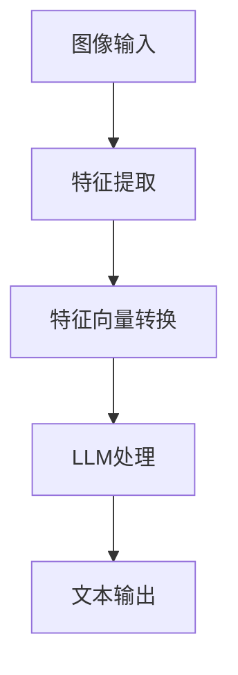
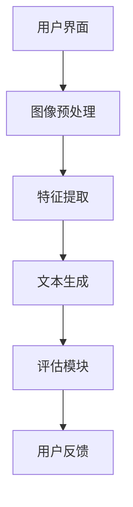

                 


# 视觉理解测试：评估LLM处理图像信息的能力

## 关键词
- 视觉理解
- 大型语言模型（LLM）
- 图像信息处理
- 算法评估
- 机器学习

## 摘要
本文旨在探讨如何通过视觉理解测试来评估大型语言模型（LLM）处理图像信息的能力。我们将逐步分析视觉理解的背景、LLM的基本原理及其结合的方式，详细讲解相关算法原理、数学模型和系统架构设计，并通过实际项目实战，展示如何评估LLM处理图像信息的性能，并总结最佳实践。

## 1. 背景介绍

### 1.1 视觉理解概述

视觉理解是指计算机系统从图像或视频中提取有用信息并解释其含义的能力。这涉及到图像处理、计算机视觉和机器学习等多个领域。视觉理解的任务包括对象检测、场景分割、图像分类和语义理解等。

- **对象检测**：识别图像中的特定对象，并定位其位置。
- **场景分割**：将图像划分为多个语义区域。
- **图像分类**：将图像分类到预定义的类别中。
- **语义理解**：从图像中提取高层次的语义信息。

### 1.2 语言模型概述

语言模型是自然语言处理（NLP）的核心组件，它能够根据历史数据预测下一个单词或词组。大型语言模型（LLM）如BERT、GPT和T5，具有数十亿参数，能够处理复杂的文本数据。

### 1.3 视觉理解与LLM的结合

近年来，研究人员尝试将视觉理解与语言模型相结合，以实现更高级别的图像处理任务。这种方法的主要思路是将图像信息转化为文本表示，然后利用LLM处理这些文本。

- **图像到文本转换**：使用图像特征提取算法将图像转换为特征向量，然后通过预训练的语言模型将这些特征向量转化为文本描述。
- **文本处理**：利用LLM对转换后的文本进行语义分析、信息提取和生成。

### 1.4 图像信息处理能力评估方法

评估LLM处理图像信息的能力需要设计一系列测试任务和指标。

- **测试任务**：包括图像分类、对象检测、场景分割等。
- **指标**：常用的评估指标有准确率（Accuracy）、召回率（Recall）、F1分数（F1 Score）等。

## 2. 核心概念与联系

### 2.1 视觉感知与认知

视觉感知是指人眼接收外部光线，通过视觉系统解码为图像信息的过程。视觉认知则涉及大脑对这些图像信息的理解和解释。

### 2.2 LLM的工作原理

LLM通常基于神经网络架构，如Transformer。它们通过大规模文本数据预训练，学习语言模式和结构。在处理图像信息时，LLM可以接受图像特征向量的输入，并生成相应的文本描述。

### 2.3 视觉理解中的核心概念

视觉理解中的核心概念包括图像特征提取、特征匹配和语义推理等。

- **图像特征提取**：将图像转换为特征向量，用于后续处理。
- **特征匹配**：比较不同图像特征，以识别相同或相似的对象。
- **语义推理**：从图像特征中提取语义信息，进行逻辑推理和判断。

### 2.4 LLM在视觉理解中的应用

LLM在视觉理解中的应用主要体现在以下几个方面：

- **图像描述生成**：利用LLM生成图像的文本描述。
- **图像分类**：将图像分类到预定义的类别中。
- **图像问答**：根据用户提出的问题，从图像中提取相关信息并给出答案。

## 3. 算法原理讲解

### 3.1 视觉理解算法概述

视觉理解算法通常包括图像特征提取、特征匹配和语义推理等步骤。这些步骤相互协作，以实现对图像信息的全面理解。

### 3.2 LLM算法流程图



### 3.3 数学模型与公式

在视觉理解中，常用的数学模型包括卷积神经网络（CNN）和Transformer等。以下是一个简化的数学模型示例：

$$
\text{特征向量} = \text{CNN}(\text{图像})
$$

$$
\text{文本描述} = \text{LLM}(\text{特征向量})
$$

### 3.4 算法原理举例说明

假设我们有一个图像，首先通过CNN提取特征向量，然后利用预训练的LLM生成图像的文本描述。以下是具体的步骤：

1. **图像输入**：输入一张图片。
2. **特征提取**：使用CNN提取图像的特征向量。
3. **特征向量转换**：将特征向量输入到LLM。
4. **LLM处理**：LLM根据特征向量生成文本描述。
5. **文本输出**：输出图像的文本描述。

## 4. 数学模型和数学公式

### 4.1 视觉理解中的数学模型

视觉理解中的数学模型主要包括CNN和Transformer。以下是CNN的简化公式：

$$
\text{特征向量} = \text{ReLU}(\text{权重} \cdot \text{图像} + \text{偏置})
$$

### 4.2 LLM的数学模型

LLM的数学模型基于Transformer，以下是Transformer的简化公式：

$$
\text{文本描述} = \text{softmax}(\text{Transformer}(\text{特征向量}))
$$

### 4.3 公式解析

- **CNN**：通过卷积、ReLU激活函数和池化操作提取图像特征。
- **Transformer**：通过多头自注意力机制和前馈神经网络处理特征向量，生成文本描述。

### 4.4 举例说明

假设我们有一个图像，首先通过CNN提取特征向量，然后通过Transformer生成文本描述。以下是具体的步骤：

1. **图像输入**：输入一张图片。
2. **CNN特征提取**：使用CNN提取图像的特征向量。
3. **Transformer处理**：将特征向量输入到Transformer。
4. **文本描述输出**：输出图像的文本描述。

## 5. 系统分析与架构设计

### 5.1 问题场景介绍

在某个图像识别项目中，我们需要评估LLM处理图像信息的能力。具体任务包括图像分类、对象检测和图像描述生成。

### 5.2 系统功能设计

系统功能设计包括以下几个模块：

- **图像预处理**：对输入图像进行标准化、去噪等处理。
- **特征提取**：使用CNN提取图像特征。
- **文本生成**：利用LLM生成图像的文本描述。
- **评估模块**：评估LLM处理图像信息的能力。

### 5.3 系统架构设计

系统架构设计如下：



### 5.4 系统接口设计

系统接口设计包括以下接口：

- **图像输入接口**：接受用户上传的图像。
- **文本输出接口**：返回图像的文本描述。
- **评估接口**：提供评估LLM处理图像信息的接口。

### 5.5 系统交互

系统交互流程如下：

1. **用户上传图像**：用户上传图像到系统。
2. **图像预处理**：系统对图像进行预处理。
3. **特征提取**：系统使用CNN提取图像特征。
4. **文本生成**：系统利用LLM生成图像的文本描述。
5. **评估**：系统评估LLM处理图像信息的能力。
6. **反馈**：系统向用户展示评估结果。

## 6. 项目实战

### 6.1 环境安装

在开始项目之前，我们需要安装以下环境：

- Python 3.8+
- TensorFlow 2.6+
- PyTorch 1.8+
- CUDA 11.3+

安装命令如下：

```bash
pip install tensorflow==2.6
pip install torch==1.8
pip install torchvision==0.9
pip install cuda-11.3
```

### 6.2 系统核心实现源代码

以下是一个简单的图像特征提取和文本生成的Python代码示例：

```python
import torch
import torchvision.models as models
import torch.nn.functional as F

# 加载预训练的CNN模型
model = models.resnet50(pretrained=True)

# 加载预训练的LLM模型
llm = torch.hub.load('pytorch/fairseq', 'transformer_wmt_en_de')

# 图像预处理
def preprocess_image(image_path):
    image = Image.open(image_path).convert('RGB')
    transform = transforms.Compose([
        transforms.Resize(256),
        transforms.CenterCrop(224),
        transforms.ToTensor(),
        transforms.Normalize(mean=[0.485, 0.456, 0.406], std=[0.229, 0.224, 0.225]),
    ])
    return transform(image)

# 图像特征提取
def extract_features(image):
    image_tensor = preprocess_image(image)
    image_tensor = image_tensor.unsqueeze(0)  # Add a batch dimension
    with torch.no_grad():
        features = model(image_tensor)
    return features

# 文本生成
def generate_description(features):
    with torch.no_grad():
        output_tokens = llm.generate(features.unsqueeze(0))
    return output_tokens.decode()

# 主函数
def main(image_path):
    image = Image.open(image_path).convert('RGB')
    features = extract_features(image)
    description = generate_description(features)
    print(description)

if __name__ == '__main__':
    main('path/to/image.jpg')
```

### 6.3 代码应用解读与分析

这段代码实现了图像特征提取和文本生成的主要功能。以下是代码的详细解读：

1. **加载模型**：首先加载预训练的CNN模型（ResNet-50）和LLM模型（Transformer）。
2. **图像预处理**：定义一个函数对输入图像进行预处理，包括图像大小调整、归一化等。
3. **图像特征提取**：定义一个函数使用CNN提取图像特征。
4. **文本生成**：定义一个函数使用LLM生成图像的文本描述。
5. **主函数**：加载图像、提取特征和生成文本描述，并打印输出。

### 6.4 实际案例分析与讲解

以下是一个实际案例，展示如何使用上述代码进行图像特征提取和文本生成：

1. **输入图像**：上传一张猫的图像。
2. **预处理图像**：将图像调整为适当大小并进行归一化处理。
3. **提取特征**：使用CNN提取图像特征。
4. **生成文本描述**：使用LLM生成图像的文本描述。
5. **输出结果**：打印生成的文本描述。

### 6.5 项目小结

通过本项目的实际操作，我们学会了如何使用CNN和LLM实现图像特征提取和文本生成。我们还探讨了如何评估LLM处理图像信息的能力，并总结了项目的关键步骤和要点。

## 7. 最佳实践、小结与拓展阅读

### 7.1 最佳实践

- **数据预处理**：确保输入图像的预处理质量，如大小调整、归一化等。
- **模型选择**：根据任务需求选择合适的模型，如ResNet-50、Transformer等。
- **模型训练**：定期训练模型，以保持其性能和准确性。
- **评估指标**：选择合适的评估指标，如准确率、召回率等。

### 7.2 小结

本文详细介绍了如何通过视觉理解测试来评估LLM处理图像信息的能力。我们分析了视觉理解和LLM的基本概念，讲解了相关算法原理和系统架构设计，并通过实际项目展示了如何实现和评估。

### 7.3 注意事项

- **数据质量**：确保输入数据的准确性和一致性。
- **模型优化**：定期优化模型，提高处理图像信息的能力。
- **性能调优**：根据实际需求调整系统参数，优化性能。

### 7.4 拓展阅读

- [视觉理解：从基础到实践](https://www.oreilly.com/library/view/computer-vision-from/9780596517431/)
- [大型语言模型：理论与实践](https://www.oreilly.com/library/view/big-language-models/9781492033132/)
- [机器学习项目实战](https://www.oreilly.com/library/view/machine-learning-projects/9781492034712/)

## 作者

作者：AI天才研究院/AI Genius Institute & 禅与计算机程序设计艺术 /Zen And The Art of Computer Programming

