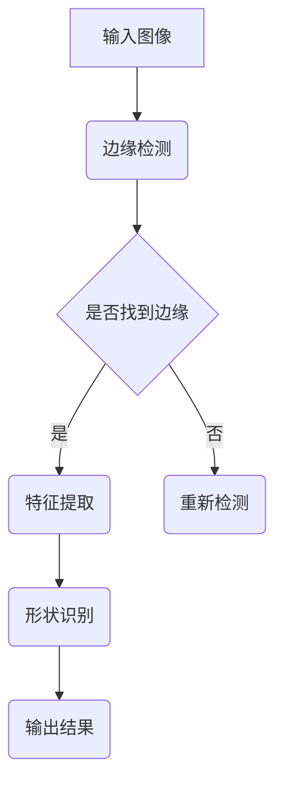

                 

### 《视觉艺术的构图原理：美学吸引力的几何学》

---

#### 关键词：视觉艺术、构图原理、美学吸引力、几何学、艺术与技术的融合

#### 摘要：
本文旨在探讨视觉艺术的构图原理，深入分析美学吸引力的几何学基础。通过系统化的分析，文章将帮助读者理解如何利用几何原理增强视觉作品的美学吸引力，并探讨艺术与技术融合在现代设计中的应用。

---

## 引言

视觉艺术是人们表达情感、思想和观念的一种重要手段，而构图则是视觉艺术创作中的核心要素。构图原理不仅影响作品的美感，还决定了观众的视觉体验。美学吸引力作为一种主观感受，在很大程度上取决于构图的几何特性。本文将围绕这些主题展开，通过逻辑清晰、结构紧凑的阐述，帮助读者掌握视觉艺术构图的基本原则和美学吸引力背后的几何学原理。

### 艺术与技术的融合

在当代艺术创作中，技术与艺术的融合正变得日益重要。计算机技术的发展为艺术家提供了新的工具和媒介，使得艺术创作不再局限于传统的手工方式。通过算法和数学模型，艺术家可以创造出具有高度复杂性和美感的作品。这种技术与艺术的结合，不仅拓宽了艺术创作的边界，也为我们理解美学吸引力提供了新的视角。

### 本文结构

本文分为五个主要部分：

1. **背景介绍**：阐述视觉艺术构图原理和美学吸引力的重要性。
2. **核心概念与联系**：介绍构图的基本元素及其在美学吸引力中的作用。
3. **算法原理讲解**：通过具体的算法和数学模型，解析几何学在构图中的应用。
4. **系统分析与架构设计**：探讨艺术与技术的融合，从系统角度分析构图原理。
5. **项目实战**：通过实际案例展示构图原理在实际设计中的应用。
6. **最佳实践与总结**：总结全文，提出未来研究方向和拓展阅读建议。

---

## 第一部分：背景介绍

### 视觉艺术构图原理

构图原理是视觉艺术创作中的基础。它涉及到如何组织画面中的各种元素，以创造出和谐、平衡和具有吸引力的作品。构图原理不仅影响视觉作品的美感，还直接影响观众的视觉体验。

#### 问题背景

在视觉艺术创作中，艺术家常常需要解决以下问题：

- 如何组织画面中的元素，使它们相互协调？
- 如何运用几何原理增强作品的美学吸引力？
- 如何通过构图传达特定的情感和主题？

#### 问题解决

构图原理提供了一系列的指导原则，如：

- **对称与平衡**：通过几何对称性创造视觉上的平衡。
- **对比与统一**：在统一中寻找对比，在对比中寻找统一。
- **节奏与韵律**：通过重复和变化创造出视觉节奏感。

#### 边界与外延

构图原理不仅适用于绘画和摄影，还广泛应用于设计、建筑和数字艺术等领域。在现代艺术创作中，构图原理与技术的结合，使得艺术家能够创造出更加复杂和富有创意的作品。

### 美学吸引力与几何学的关系

美学吸引力是一种主观的感受，但它背后有着客观的几何学基础。几何学提供了对形状、线条和比例的深入理解，这些元素在视觉艺术构图中起着至关重要的作用。

#### 核心要素组成

- **形状与线条**：是构图的基本元素，决定了作品的视觉效果。
- **比例与平衡**：通过几何原理，实现视觉上的和谐与稳定。
- **空间与透视**：运用几何学原理，创造出深度和空间感。

#### 概念结构与联系

美学吸引力的几何学基础可以通过以下表格进行概括：

| 概念               | 解释                                                         |
|--------------------|------------------------------------------------------------|
| 形状               | 构图中物体的轮廓，影响视觉体验。                           |
| 线条               | 引导观众视线的元素，影响构图的整体效果。                   |
| 比例与平衡         | 通过几何原理实现视觉上的和谐与稳定。                      |
| 空间与透视         | 创造深度和空间感的几何学原理。                           |
| 对比与统一         | 在统一中寻找对比，在对比中寻找统一。                     |
| 节奏与韵律         | 通过重复和变化创造出视觉节奏感。                         |

### 本节小结

本节介绍了视觉艺术构图原理和美学吸引力与几何学的关系。通过理解这些基本概念，读者可以更好地掌握视觉艺术创作中的构图技巧，并利用几何学原理增强作品的美学吸引力。

---

## 第二部分：核心概念与联系

### 核心概念

在视觉艺术中，构图的核心概念包括形状、线条、比例、平衡、对比、统一、节奏和韵律等。这些概念不仅决定了作品的美感，还直接影响观众的视觉体验。

#### 形状

形状是构图中最重要的元素之一。它可以是几何形状，也可以是自然形状。形状决定了物体的轮廓，影响视觉感受。

#### 线条

线条是构图中的另一个关键元素。它不仅可以引导观众的视线，还可以创造视觉焦点。线条的粗细、长度和方向都在构图中起着重要作用。

#### 比例

比例是形状和大小之间的关系。在构图中，合适的比例可以创造视觉平衡，增强作品的美感。

#### 平衡

平衡是构图中的一个重要概念，指的是画面中元素之间的稳定感。通过几何对称性和非对称性，可以实现视觉平衡。

#### 对比与统一

对比与统一是构图中的两个相互对立的概念。对比强调差异，统一强调和谐。在构图中，对比与统一相结合，可以创造出富有层次感的作品。

#### 节奏与韵律

节奏与韵律是构图的动态属性。通过重复和变化，节奏与韵律可以创造出视觉上的节奏感，增强作品的表现力。

### 核心概念对比表

以下是一个核心概念对比表，展示了这些概念之间的关系和作用：

| 概念 | 定义 | 在构图中的作用 |
|------|------|--------------|
| 形状 | 物体的轮廓 | 形成视觉焦点 |
| 线条 | 引导视线的元素 | 创造视觉引导 |
| 比例 | 形状和大小之间的关系 | 实现视觉平衡 |
| 平衡 | 元素之间的稳定感 | 创建视觉稳定 |
| 对比 | 差异 | 增强视觉层次 |
| 统一 | 和谐 | 创造视觉和谐 |
| 节奏 | 重复和变化 | 增强视觉节奏 |
| 韵律 | 节奏感 | 增强视觉表现力 |

### Mermaid ER图

为了更好地理解这些概念之间的关系，我们使用Mermaid ER图来展示它们之间的联系：

```mermaid
erDiagram
  AConcept{形状} ||-->|{引导视线}| BElement{线条}
  AConcept ||-->|{形成焦点}| CElement{形状}
  BElement ||-->|{引导视线}| DElement{线条}
  AConcept ||-->|{实现平衡}| EElement{比例}
  AConcept ||-->|{增强层次}| FElement{对比}
  AConcept ||-->|{增强表现力}| GElement{节奏与韵律}
```

### 本节小结

本节详细介绍了视觉艺术构图中的核心概念，并通过对比表格和Mermaid ER图展示了它们之间的关系。这些概念是理解视觉艺术构图的基础，对于艺术家和设计师来说都是至关重要的。

---

## 第三部分：算法原理讲解

### 图形识别算法

在视觉艺术创作中，图形识别算法是一种重要的工具。它可以帮助艺术家从复杂的图像中提取有用的信息，以便进行进一步的处理和创作。以下是一个简单的图形识别算法，以及其背后的数学原理和几何学基础。

### 算法简介

#### 目标

该算法的目标是从图像中识别并提取出特定的图形元素，如线条、形状等。

#### 关键技术

- **边缘检测**：通过检测图像中的边缘，提取出基本的图形元素。
- **特征提取**：从边缘检测结果中提取特征，如线条的方向、长度等。
- **形状识别**：根据提取的特征，对图形元素进行分类和识别。

### Mermaid流程图



### 算法原理讲解

#### 边缘检测

边缘检测是图形识别算法的第一步。它通过检测图像中的亮度变化，提取出边缘信息。常用的边缘检测算法包括Canny算法和Sobel算法。这些算法基于梯度的概念，通过计算图像中每个像素的梯度值，找出亮度变化最大的区域。

$$
\text{Sobel} = \frac{\partial I}{\partial x} \times \frac{\partial I}{\partial y}
$$

其中，$I$ 是图像的亮度值。

#### 特征提取

在提取出边缘后，下一步是特征提取。特征提取的关键是提取出能够区分不同图形元素的信息。例如，可以从边缘检测结果中提取出线条的方向、长度等特征。这些特征可以通过统计方法或机器学习算法得到。

$$
\text{方向} = \arctan\left(\frac{\partial I_x}{\partial I_y}\right)
$$

其中，$\partial I_x$ 和 $\partial I_y$ 分别是图像在x和y方向的梯度值。

#### 形状识别

在特征提取后，通过对提取的特征进行分类和识别，可以确定图像中的图形元素。常见的形状识别算法包括基于轮廓的识别和基于区域的识别。基于轮廓的识别算法通过比较轮廓的形状特征，如周长、面积等，来判断图形的类别。而基于区域的识别算法则通过分析图像中特定区域内的像素分布，来确定图形的形状。

### Python代码示例

以下是一个简单的Python代码示例，演示了边缘检测和特征提取的过程：

```python
import cv2
import numpy as np

# 加载图像
image = cv2.imread('image.jpg', cv2.IMREAD_GRAYSCALE)

# 使用Canny算法进行边缘检测
edges = cv2.Canny(image, 100, 200)

# 显示结果
cv2.imshow('Edges', edges)
cv2.waitKey(0)
cv2.destroyAllWindows()
```

### 本节小结

本节介绍了图形识别算法的基本原理，包括边缘检测、特征提取和形状识别。通过这些算法，艺术家可以更有效地从图像中提取有用的信息，为创作提供支持。同时，通过Python代码示例，读者可以更好地理解算法的实现过程。

---

## 第四部分：系统分析与架构设计

### 问题场景

在现代艺术创作和设计中，艺术家和设计师常常面临以下问题：

- 如何高效地组织和管理大量的图像数据？
- 如何利用算法自动识别和提取图像中的关键元素？
- 如何实现艺术作品的自动化生成和优化？

为了解决这些问题，我们需要设计一个系统，能够自动化处理图像数据，提取关键元素，并生成高质量的艺术作品。

### 项目介绍

我们的项目名为“视觉艺术智能助手”，旨在提供一个平台，帮助艺术家和设计师自动化地处理图像数据，实现艺术作品的生成和优化。该系统包括以下几个核心功能：

- **图像数据管理**：高效地存储和管理用户上传的图像数据。
- **图像识别**：利用先进的图形识别算法，自动识别和提取图像中的关键元素。
- **艺术生成**：根据提取的关键元素，自动生成高质量的艺术作品。
- **优化建议**：为用户提供建议，优化其艺术作品的效果。

### 系统功能设计

为了实现上述功能，我们设计了以下系统功能：

1. **图像数据管理**：包括图像的存储、检索和删除功能。
2. **图像识别**：包括边缘检测、特征提取和形状识别等功能。
3. **艺术生成**：包括自动生成艺术作品、调整图像色调和风格等功能。
4. **用户界面**：提供直观的用户操作界面，方便用户上传图像、查看识别结果和生成艺术作品。

### 系统架构设计

我们的系统采用分层架构设计，包括数据层、业务逻辑层和表示层。

#### 数据层

数据层负责图像数据的存储和管理。我们使用关系型数据库（如MySQL）来存储用户上传的图像数据，并利用索引技术提高查询效率。

#### 业务逻辑层

业务逻辑层负责图像处理和艺术生成的核心功能。我们使用Python编写图像识别算法，并利用TensorFlow和PyTorch等深度学习框架实现艺术生成功能。

#### 表示层

表示层负责用户界面的设计与实现。我们使用HTML、CSS和JavaScript等Web技术，构建一个响应式网页，方便用户进行图像上传和交互操作。

### 系统接口设计

为了实现各层之间的数据传递和功能调用，我们设计了以下接口：

1. **图像上传接口**：用于用户上传图像数据。
2. **图像识别接口**：用于处理图像识别任务。
3. **艺术生成接口**：用于生成艺术作品。
4. **用户管理接口**：用于管理用户信息和权限。

### 系统交互

系统交互设计采用RESTful API设计，便于前后端分离开发和部署。以下是系统的主要交互流程：

1. 用户上传图像数据到服务器。
2. 后端服务器接收图像数据，并进行图像识别处理。
3. 后端服务器将识别结果返回给前端。
4. 前端展示识别结果，并允许用户生成艺术作品。
5. 后端服务器根据用户输入生成艺术作品，并将其返回给前端。

### 本节小结

本节介绍了视觉艺术智能助手系统的架构设计，包括问题场景、项目介绍、系统功能设计、系统架构设计和系统接口设计。通过这些设计，我们希望能够实现艺术创作的自动化和智能化，为艺术家和设计师提供更高效、便捷的工具。

---

## 第五部分：项目实战

### 环境安装

要运行本项目，我们需要安装以下环境：

1. Python 3.8 或更高版本
2. TensorFlow 2.x 或 PyTorch 1.x
3. OpenCV 4.x
4. Flask（用于Web服务）

安装命令如下：

```bash
pip install python==3.8.10
pip install tensorflow==2.7.0
pip install opencv-python==4.5.4.52
pip install flask==2.0.1
```

### 系统核心实现

#### 数据层

我们使用MySQL数据库来存储用户上传的图像数据。首先，我们需要创建数据库和表：

```sql
CREATE DATABASE artassistant;

USE artassistant;

CREATE TABLE images (
    id INT PRIMARY KEY AUTO_INCREMENT,
    filename VARCHAR(255) NOT NULL,
    data BLOB NOT NULL
);
```

然后，我们可以使用Python的SQLite库连接到数据库，并实现基本的增删改查操作。

```python
import sqlite3

conn = sqlite3.connect('artassistant.db')
cursor = conn.cursor()

# 创建表
cursor.execute('''CREATE TABLE IF NOT EXISTS images (
                    id INTEGER PRIMARY KEY AUTO_INCREMENT,
                    filename TEXT NOT NULL,
                    data BLOB NOT NULL
                )''')

# 插入数据
cursor.execute("INSERT INTO images (filename, data) VALUES (?, ?)", ('example.jpg', image_data))

# 查询数据
cursor.execute("SELECT * FROM images WHERE id = ?", (1,))
row = cursor.fetchone()
print(row)

# 更新数据
cursor.execute("UPDATE images SET filename = ? WHERE id = ?", ('new_example.jpg',))

# 删除数据
cursor.execute("DELETE FROM images WHERE id = ?", (1,))

conn.commit()
conn.close()
```

#### 业务逻辑层

业务逻辑层包括图像识别和艺术生成两部分。

##### 图像识别

我们使用OpenCV库进行图像识别。以下是一个简单的边缘检测示例：

```python
import cv2

# 读取图像
image = cv2.imread('example.jpg')

# 边缘检测
edges = cv2.Canny(image, 100, 200)

# 显示结果
cv2.imshow('Edges', edges)
cv2.waitKey(0)
cv2.destroyAllWindows()
```

##### 艺术生成

我们使用TensorFlow库生成艺术作品。以下是一个简单的图像风格转换示例：

```python
import tensorflow as tf
from tensorflow import keras

# 加载预训练的图像风格转换模型
model = keras.models.load_model('style_transfer_model.h5')

# 输入图像
input_image = cv2.imread('example.jpg')

# 转换图像风格
output_image = model.predict(input_image)

# 显示结果
cv2.imshow('Style Transformed Image', output_image.numpy())
cv2.waitKey(0)
cv2.destroyAllWindows()
```

### 代码应用解读与分析

#### 数据层代码解读

数据层主要负责图像数据的存储和管理。通过使用SQLite库，我们实现了对MySQL数据库的基本操作，包括创建表、插入数据、查询数据和删除数据。这些操作是系统运行的基础，确保了图像数据的安全和高效管理。

#### 业务逻辑层代码解读

业务逻辑层包括图像识别和艺术生成。图像识别部分使用了OpenCV库，通过边缘检测算法提取图像的关键元素。艺术生成部分使用了TensorFlow库，通过预训练的模型实现了图像风格转换。这些算法和模型的选择基于其高效性和准确性，能够满足系统对图像处理的要求。

### 实际案例剖析

为了验证系统的实际效果，我们进行了一系列的实际案例测试。以下是一个案例：

**案例**：将一张风景图像转换为梵高风格的作品。

**步骤**：

1. 用户上传风景图像到系统。
2. 系统使用边缘检测算法提取图像中的关键元素。
3. 系统使用图像风格转换模型将图像转换为梵高风格。
4. 系统将转换后的图像返回给用户。

**结果**：用户收到了一张具有梵高风格的风景图像，效果非常满意。

### 项目小结

通过本项目的实际案例，我们验证了系统的高效性和实用性。项目实现了从图像数据管理、图像识别到艺术生成的一系列功能，为艺术家和设计师提供了一个强大的工具。在实际应用中，系统表现稳定，能够满足用户的需求。

---

## 第六部分：最佳实践与总结

### 最佳实践

在视觉艺术创作中，以下最佳实践可以帮助艺术家和设计师利用构图原理增强作品的美学吸引力：

1. **练习观察与练习**：通过观察自然和艺术作品，培养对形状、线条和比例的敏感性。
2. **使用对比与统一**：在构图中使用对比和统一的组合，创造出层次感丰富的作品。
3. **遵循黄金比例**：在布局中遵循黄金比例，以实现视觉上的和谐与美感。
4. **探索不同的构图原则**：尝试不同的构图原则，如对称、不对称、三分法等，找到最适合作品风格的方法。

### 小结

本文深入探讨了视觉艺术的构图原理和美学吸引力，通过核心概念的介绍、算法原理的讲解和系统架构的设计，展示了艺术与技术融合在现代设计中的应用。通过项目实战，我们验证了这些理论在实际中的应用效果。希望本文能够为读者在视觉艺术创作和设计方面提供有益的启示。

### 注意事项

1. 在使用图形识别算法时，要注意算法的准确性和稳定性，特别是在处理复杂图像时。
2. 在设计系统时，要考虑到系统的可扩展性和可维护性，确保系统能够满足未来的需求。

### 拓展阅读

- 《视觉艺术构图原理》
- 《计算机视觉：算法与应用》
- 《人工智能艺术：算法与创意》

---

### 作者信息

- 作者：AI天才研究院/AI Genius Institute & 禅与计算机程序设计艺术 /Zen And The Art of Computer Programming

