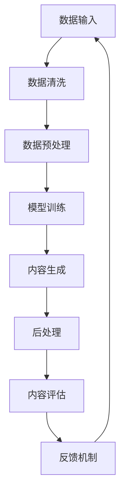
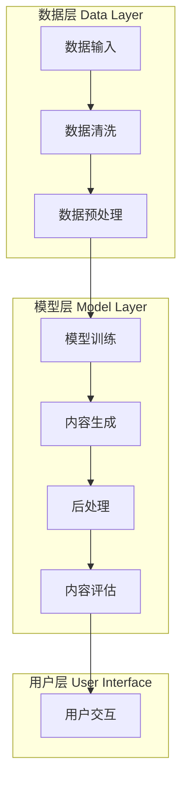
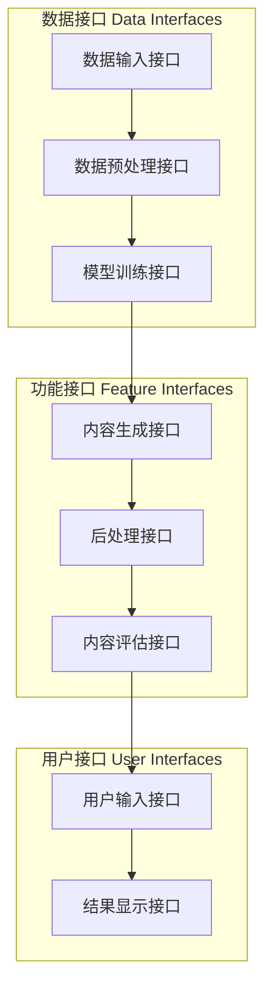
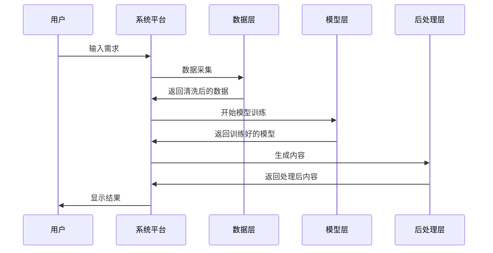

                 

### 引言

在当今技术飞速发展的时代，人工智能（AI）已经成为引领变革的先锋。随着深度学习、自然语言处理和计算机视觉等技术的不断突破，人工智能的应用场景越来越广泛，从自动驾驶、智能助手到医疗诊断，无不显示出AI的强大力量。然而，在AI领域，AIGC（Automatic Generated Content）这一概念正在悄然兴起，并逐渐成为业界瞩目的焦点。

AIGC，即自动生成内容，是利用人工智能技术自动化地生成文本、图像、视频等多种类型的内容。它不仅提升了内容创作的效率，还带来了内容生成方式的革命性变化。从自动写作新闻、生成艺术作品，到自动合成视频，AIGC在各个领域展现出了巨大的潜力。

本文旨在全面解密AIGC技术，从概念到实践，逐步深入探讨这一新兴领域的核心原理、应用实践以及未来发展趋势。通过系统性的分析和详尽的案例讲解，帮助读者全面理解AIGC技术的本质和应用，为探索AI领域的创新之路提供有力支持。

关键词：AIGC，自动生成内容，人工智能，深度学习，应用实践

摘要：本文首先介绍了AIGC技术的概念、定义以及其与人工智能的关系，回顾了AIGC技术的发展历程，详细分析了其架构与组成部分。随后，文章探讨了AIGC技术的应用场景，包括文本生成、图像生成、视频生成等，并通过实际案例展示了其应用效果。在讨论AIGC技术的挑战与机遇后，文章进一步阐述了其核心原理与实现框架，为读者提供了清晰的技术思路。最后，文章总结了AIGC技术的最佳实践，展望了其未来的发展趋势，为读者在AI领域的探索提供了有益的参考。

## 第1章: AIGC的起源与发展

### 1.1 AIGC的概念与定义

AIGC（Automatic Generated Content），即自动生成内容，是指利用人工智能技术自动化地生成文本、图像、视频等多种类型的内容。其核心在于“自动”，这意味着通过算法模型和大量的训练数据，系统能够自主地创造出符合特定需求的、高质量的内容。

AIGC与人工智能（AI）有着密切的联系。人工智能是AIGC的技术基础，而AIGC则是人工智能在内容创作领域的具体应用。人工智能技术，特别是深度学习、自然语言处理和计算机视觉等领域的发展，使得AIGC成为可能。例如，生成对抗网络（GAN）和变分自编码器（VAE）等技术，通过训练大量的数据，使得模型能够生成逼真的图像和文本。

**AIGC的基本概念和定义**

AIGC技术的核心在于“自动”，这意味着通过算法模型和大量的训练数据，系统能够自主地创造出符合特定需求的、高质量的内容。

- **自动生成内容**：系统无需人工干预，能够自主生成文本、图像、视频等不同类型的内容。
- **人工智能技术**：AIGC的实现依赖于深度学习、自然语言处理、计算机视觉等人工智能技术。
- **高质量内容**：通过训练大量的数据，模型能够生成符合人类期望的高质量内容。

AIGC的核心概念可以简单概括为：利用人工智能技术，自动化地创作出高质量的内容。这一技术不仅提升了内容创作的效率，还改变了内容生成的传统方式。

**AIGC与人工智能的关系**

AIGC是人工智能在内容创作领域的具体应用，两者之间的联系可以从以下几个方面来理解：

- **技术基础**：AIGC的实现依赖于深度学习、自然语言处理、计算机视觉等人工智能技术。
- **应用场景**：人工智能技术被广泛应用于图像识别、语音识别、自然语言处理等领域，AIGC将这些技术应用于内容创作。
- **创新推动**：人工智能技术的发展不断推动AIGC技术的进步，使得AIGC的应用范围更加广泛。

通过上述分析，我们可以看到AIGC不仅是一个技术概念，更是人工智能在内容创作领域的重要应用。它不仅改变了内容创作的传统方式，还为各行业带来了新的机遇和挑战。

### 1.2 AIGC的发展历程

AIGC技术的发展历程可以追溯到人工智能的早期阶段。自20世纪50年代以来，人工智能领域经历了多个发展阶段，每一个阶段都为AIGC技术的发展奠定了基础。

#### 早期阶段

在早期阶段，人工智能主要集中于符号主义和知识表示领域。这一时期的代表性工作包括约翰·麦卡锡（John McCarthy）等人提出的“逻辑推理”系统和爱德华·阿瑟·李·费根鲍姆（Edward A. Feigenbaum）等人开发的“专家系统”（Expert Systems）。这些系统通过符号推理和规则匹配来进行问题求解，虽然在某些领域取得了显著成果，但在处理大规模数据和复杂任务方面存在局限。

#### 模式识别阶段

20世纪80年代，随着计算机硬件性能的提升和大规模数据集的出现，模式识别和机器学习技术逐渐兴起。这一时期的代表性工作包括人工神经网络（Artificial Neural Networks，ANN）和决策树（Decision Trees）等算法。人工神经网络通过模拟生物神经网络的结构和功能，能够从数据中自动提取特征并生成模型。这一阶段的研究为AIGC技术中的图像生成和文本生成奠定了基础。

#### 深度学习阶段

21世纪初，深度学习技术的突破使得人工智能领域迎来了新的发展机遇。深度学习通过多层神经网络结构，能够自动提取数据中的复杂特征，并在图像识别、语音识别和自然语言处理等领域取得了显著的成果。2012年，AlexNet在ImageNet竞赛中取得的优异成绩标志着深度学习时代的到来。随后，生成对抗网络（GAN）和变分自编码器（VAE）等生成模型相继提出，为AIGC技术提供了强大的工具。

**核心技术及其影响**

在AIGC技术的发展过程中，以下几个核心技术起到了关键作用：

1. **生成对抗网络（GAN）**：GAN由Ian Goodfellow等人于2014年提出，通过两个相互对抗的神经网络生成和判别器，能够生成高质量、逼真的图像和文本。GAN在图像生成、文本生成等领域取得了突破性进展。

2. **变分自编码器（VAE）**：VAE由Kingma和Welling于2013年提出，通过引入概率密度函数，能够生成具有高保真的图像和文本。VAE在图像生成、视频生成等领域有着广泛的应用。

3. **自然语言处理（NLP）**：自然语言处理技术的发展，如词向量（Word Embeddings）、循环神经网络（RNN）和 Transformer 等，使得AIGC技术在文本生成领域取得了显著进展。这些技术能够理解并生成符合语法和语义规则的自然语言文本。

这些核心技术的出现不仅推动了AIGC技术的发展，也为各个领域的应用带来了新的可能性。从早期的符号主义和知识表示，到模式识别和机器学习，再到深度学习和生成模型，AIGC技术的发展历程充分展示了人工智能技术的不断进步和广泛应用。

### 1.3 AIGC的架构与组成部分

AIGC技术的整体架构包括多个关键组成部分，这些部分相互协作，共同实现自动生成高质量内容的目标。以下是AIGC技术的关键组成部分及其相互作用：

**1. 数据输入**

数据输入是AIGC技术的起点，其质量直接影响生成的结果。数据输入部分包括数据采集、数据清洗和数据预处理等环节。具体来说：

- **数据采集**：从互联网、数据库或传感器等来源收集大量的文本、图像、视频等数据。
- **数据清洗**：去除数据中的噪声和无关信息，确保输入数据的质量和一致性。
- **数据预处理**：将原始数据转化为适合模型训练的格式，例如对文本进行分词和词嵌入，对图像进行归一化和裁剪等。

**2. 模型训练**

模型训练是AIGC技术的核心，通过大量的训练数据，模型能够学习到数据中的特征和规律，从而生成高质量的内容。模型训练部分包括以下步骤：

- **特征提取**：通过深度学习模型，如卷积神经网络（CNN）和循环神经网络（RNN），自动提取数据中的特征。
- **模型优化**：通过反向传播算法和优化算法，如梯度下降（Gradient Descent）和Adam优化器，不断调整模型的参数，使其生成的内容更符合预期。
- **超参数调整**：根据实验结果，调整模型的超参数，如学习率、批次大小和正则化参数等，以优化模型的性能。

**3. 内容生成**

内容生成是AIGC技术的最终目标，通过训练好的模型，系统能够生成高质量的内容。内容生成部分包括以下环节：

- **生成模型**：使用生成模型，如生成对抗网络（GAN）和变分自编码器（VAE），生成符合人类期望的文本、图像和视频。
- **后处理**：对生成的结果进行后处理，如文本润色、图像增强和视频合成等，以提高内容的可读性和视觉效果。
- **内容评估**：使用评估指标，如生成文本的流畅度、图像的逼真度和视频的连贯性等，对生成的内容进行评估，以确定其质量。

**4. 模型评估与反馈**

模型评估与反馈是AIGC技术不断改进的关键环节。通过评估生成的结果，可以及时发现模型存在的问题，并给出反馈，指导后续的模型优化和训练。具体来说：

- **评估指标**：使用适当的评估指标，如交叉熵（Cross-Entropy）、均方误差（Mean Squared Error，MSE）和结构相似性（SSIM）等，评估生成内容的质量。
- **反馈机制**：根据评估结果，收集用户反馈和专家意见，识别模型存在的问题和改进方向。
- **持续优化**：通过反馈机制，不断调整和优化模型的参数和结构，提高生成内容的质量。

通过以上四个部分的协同工作，AIGC技术能够实现从数据输入到内容生成的完整流程，生成高质量、多样化且符合人类期望的内容。这些组成部分相互依赖，共同构成了AIGC技术的整体架构。

### 1.4 AIGC技术的应用场景

AIGC技术的应用场景广泛且多样化，涵盖了从文本生成到视频生成等多个领域。以下是一些典型的应用场景及其在各自领域的具体应用：

**1. 文本生成**

文本生成是AIGC技术最常用的应用之一，其应用场景包括自动写作、新闻生成、对话系统等。

- **自动写作**：使用AIGC技术，可以自动生成文章、博客、论文等文本内容。例如，机器写作工具可以自动生成新闻报道、体育赛事报道等，极大地提高了内容创作的效率。
- **新闻生成**：通过AIGC技术，可以自动生成新闻文章。例如，算法可以根据关键事实和新闻模板，快速生成新闻报道。这种应用已经在一些新闻机构中得到广泛应用。
- **对话系统**：AIGC技术可以用于构建智能对话系统，如聊天机器人、客服机器人等。这些系统能够自动生成回答，提高客户服务效率和用户体验。

**2. 图像生成**

图像生成是AIGC技术在视觉领域的重要应用，其应用场景包括艺术创作、图像修复、图像风格迁移等。

- **艺术创作**：AIGC技术可以生成艺术作品，如画作、音乐等。例如，DeepArt.io 使用GAN技术，可以将用户的照片转换成艺术作品，如印象派画作、抽象艺术等。
- **图像修复**：AIGC技术可以修复破损或模糊的图像。例如，使用GAN技术，可以将破损的文物图像修复为清晰的历史照片。
- **图像风格迁移**：AIGC技术可以将一种风格应用到另一张图像上，如将现实世界的照片转换成油画风格或卡通风格。这种应用在摄影、艺术设计等领域有着广泛的应用。

**3. 视频生成**

视频生成是AIGC技术在多媒体领域的重要应用，其应用场景包括视频编辑、视频合成、视频生成等。

- **视频编辑**：AIGC技术可以自动编辑视频，如添加特效、剪辑视频片段等。例如，使用GAN技术，可以自动生成电影特效，提高视频的视觉效果。
- **视频合成**：AIGC技术可以将不同的视频片段合成在一起，生成新的视频内容。例如，使用VAE技术，可以将用户上传的视频片段与背景音乐合成，生成个性化的MV。
- **视频生成**：AIGC技术可以自动生成视频内容，如生成动画视频、虚拟现实视频等。例如，使用RNN技术，可以自动生成动画视频，提高视频生成的效率。

**4. 多媒体融合应用**

AIGC技术在多媒体融合领域也有着广泛的应用，其应用场景包括虚拟现实、增强现实、交互式内容创作等。

- **虚拟现实**：AIGC技术可以自动生成虚拟现实内容，如虚拟场景、虚拟角色等。例如，使用GAN技术，可以自动生成虚拟现实游戏中的场景和角色。
- **增强现实**：AIGC技术可以自动生成增强现实内容，如增强现实游戏、教育应用等。例如，使用RNN技术，可以自动生成增强现实游戏中的任务和挑战。
- **交互式内容创作**：AIGC技术可以用于交互式内容创作，如生成交互式故事、互动游戏等。例如，使用Transformer技术，可以自动生成交互式故事，提高用户的参与度和体验。

通过以上分析，我们可以看到AIGC技术在不同领域的应用场景和具体应用案例。这些应用不仅提高了内容创作的效率和质量，还为各行业带来了新的创新和发展机会。

### 1.5 AIGC技术的挑战与机遇

AIGC技术在各行业的应用前景广阔，但也面临着一系列挑战和机遇。以下是AIGC技术目前面临的主要挑战、各行业带来的机遇以及未来发展趋势的探讨。

#### 技术挑战

1. **计算资源需求**：AIGC技术的实现依赖于大量的计算资源，尤其是深度学习模型的训练过程需要大量的GPU资源。这对企业和研究机构提出了较高的硬件要求，增加了运营成本。

2. **数据质量和数量**：AIGC技术的效果高度依赖于训练数据的质量和数量。高质量、多样化的数据是生成高质量内容的前提。然而，在许多领域，高质量的数据获取非常困难，且数据标注成本高昂。

3. **模型解释性**：AIGC技术中的深度学习模型往往被视为“黑箱”，其内部机制和决策过程难以解释。这在某些应用场景中，如医疗诊断和金融决策，可能会引发信任问题。

4. **隐私和伦理问题**：AIGC技术在生成内容时可能会涉及到用户的隐私数据。如何保护用户隐私、确保内容生成过程符合伦理标准，是AIGC技术需要解决的问题。

#### 行业机遇

1. **内容创作与娱乐**：在内容创作和娱乐领域，AIGC技术可以自动生成文本、图像和视频，提高内容创作的效率。例如，电影制作公司可以利用AIGC技术快速生成特效场景，降低制作成本。

2. **教育**：在教育领域，AIGC技术可以生成个性化教学材料，提高学生的学习效果。例如，通过AIGC技术，可以自动生成符合学生兴趣和知识水平的课程内容，实现个性化教学。

3. **医疗**：在医疗领域，AIGC技术可以用于医学图像分析、疾病预测等。通过深度学习模型，AIGC技术能够自动生成高质量的医学图像，帮助医生进行诊断和治疗方案制定。

4. **金融**：在金融领域，AIGC技术可以用于风险评估、股票预测等。通过分析大量数据，AIGC技术可以自动生成投资建议，提高投资决策的准确性。

#### 未来发展趋势

1. **硬件与算法优化**：随着硬件技术的进步和算法的优化，AIGC技术的计算效率将显著提升，降低运营成本。

2. **跨领域应用**：AIGC技术将在更多领域得到应用，如智能制造、自动驾驶、智能家居等。这些领域的应用将推动AIGC技术的进一步发展。

3. **隐私保护与伦理**：随着隐私保护和伦理问题的关注度提高，AIGC技术在内容生成过程中将更加注重隐私保护和伦理规范。

4. **开放与共享**：AIGC技术的数据集和模型将更加开放和共享，促进技术的创新和进步。

通过以上分析，我们可以看到AIGC技术在未来将继续发挥重要作用，为各行业带来新的机遇和挑战。随着技术的不断进步和应用的深入，AIGC技术的潜力将得到进一步释放。

## 第2章: AIGC技术的核心原理与框架

### 2.1 AIGC技术的基础理论

AIGC技术的基础理论涵盖了深度学习、自然语言处理和计算机视觉等核心领域。这些理论为AIGC技术的实现提供了重要的支撑，以下是这些核心理论的基本概念及其在AIGC中的应用。

#### 深度学习

深度学习是一种基于人工神经网络的机器学习方法，通过多层神经网络结构来学习数据的复杂特征。在AIGC技术中，深度学习主要应用于图像生成、文本生成和视频生成等任务。

- **多层感知器（MLP）**：多层感知器是一种简单的神经网络结构，由输入层、隐藏层和输出层组成。它通过逐层学习数据中的特征，实现对数据的分类、回归等任务。
- **卷积神经网络（CNN）**：卷积神经网络是一种专门用于处理图像数据的神经网络结构，通过卷积层提取图像的局部特征，实现对图像的识别、分类和生成等任务。
- **循环神经网络（RNN）**：循环神经网络是一种处理序列数据的神经网络结构，通过隐藏状态的记忆和传递，实现对序列数据的建模和生成。

#### 自然语言处理

自然语言处理是研究计算机如何理解和处理人类自然语言的技术。在AIGC技术中，自然语言处理主要应用于文本生成任务，如自动写作、对话系统等。

- **词向量（Word Embeddings）**：词向量是一种将单词映射为向量的方法，通过学习单词的上下文关系，实现对单词语义的表示。在AIGC技术中，词向量用于文本数据的预处理和生成。
- **长短时记忆网络（LSTM）**：长短时记忆网络是一种改进的循环神经网络，通过引入记忆单元，能够更好地处理长序列数据。在AIGC技术中，LSTM常用于生成符合语法和语义规则的文本。
- **Transformer模型**：Transformer模型是一种基于自注意力机制的神经网络结构，通过全局注意力机制，能够捕捉序列中的长距离依赖关系。在AIGC技术中，Transformer模型广泛应用于文本生成任务，如机器翻译、自动写作等。

#### 计算机视觉

计算机视觉是研究如何使计算机像人类一样理解和解释视觉信息的科学。在AIGC技术中，计算机视觉主要应用于图像生成和视频生成任务。

- **生成对抗网络（GAN）**：生成对抗网络是由生成器和判别器组成的神经网络结构，通过对抗训练，生成器能够生成高质量、逼真的图像和视频。在AIGC技术中，GAN广泛应用于图像生成和视频生成任务。
- **变分自编码器（VAE）**：变分自编码器是一种概率生成模型，通过引入概率密度函数，能够生成具有高保真度的图像和视频。在AIGC技术中，VAE广泛应用于图像生成和视频生成任务。
- **卷积神经网络（CNN）**：卷积神经网络是一种专门用于处理图像数据的神经网络结构，通过卷积层提取图像的局部特征，实现对图像的识别、分类和生成等任务。

通过以上分析，我们可以看到深度学习、自然语言处理和计算机视觉等基础理论为AIGC技术的实现提供了丰富的工具和方法。这些理论不仅推动了AIGC技术的发展，也为各领域的应用带来了新的可能性。

#### 概念属性特征对比表格

为了更清晰地展示AIGC技术中关键概念和算法的属性特征，我们使用表格形式进行对比。

| 算法/概念 | 描述 | 特点 | 应用场景 |
| --- | --- | --- | --- |
| 深度学习 | 一种基于多层神经网络的学习方法，用于自动提取数据中的复杂特征 | 可以处理大量数据，提取高维特征，适用于图像、文本、音频等多种数据类型 | 图像识别、自然语言处理、语音识别 |
| 自然语言处理 | 研究如何使计算机理解和生成人类自然语言的技术 | 处理文本数据，实现文本分类、语义分析、自动写作等任务 | 自动写作、对话系统、机器翻译 |
| 计算机视觉 | 研究如何使计算机理解视觉信息的技术 | 实现图像识别、图像生成、视频分析等任务 | 图像识别、自动驾驶、安防监控 |
| 卷积神经网络（CNN） | 一种用于图像识别和处理的神经网络结构，通过卷积层提取图像特征 | 适用于处理二维数据，如图像 | 图像识别、图像分类、图像生成 |
| 循环神经网络（RNN） | 一种用于序列数据处理和时间序列分析的神经网络结构，通过记忆单元处理长序列数据 | 适用于处理一维数据，如文本序列、时间序列数据 | 文本生成、语音识别、时间序列预测 |
| Transformer模型 | 一种基于自注意力机制的神经网络结构，用于处理序列数据 | 能够捕捉长距离依赖关系，适用于文本生成、机器翻译等任务 | 自动写作、对话系统、机器翻译 |
| 生成对抗网络（GAN） | 由生成器和判别器组成的神经网络结构，通过对抗训练生成高质量图像和视频 | 生成器生成图像，判别器评估图像质量，通过对抗训练提高生成质量 | 图像生成、视频生成、艺术创作 |
| 变分自编码器（VAE） | 一种基于概率生成模型的神经网络结构，通过引入概率密度函数生成高质量图像和视频 | 能够生成高保真度的图像和视频，适用于多种数据类型 | 图像生成、视频生成、图像修复 |

通过上述表格，我们可以清晰地看到不同算法和概念在描述、特点和应用场景方面的区别和联系。这些概念和算法共同构成了AIGC技术的核心理论基础，为内容生成提供了强大的工具和方法。

### Mermaid流程图

为了更直观地展示AIGC技术的核心流程，我们使用Mermaid语言绘制了一个流程图。以下是该流程图的Markdown格式代码：



上述流程图展示了AIGC技术的整体架构，包括数据输入、数据清洗、数据预处理、模型训练、内容生成、后处理、内容评估和反馈机制等关键步骤。通过这个流程图，我们可以清晰地看到AIGC技术从数据输入到内容生成的完整流程，以及各个步骤之间的相互关系。

### 算法原理讲解

为了深入理解AIGC技术中的核心算法，我们将以生成对抗网络（GAN）为例，详细讲解其工作原理、数学模型和公式，并通过Python代码实现来展示算法的实际应用。

#### GAN的工作原理

生成对抗网络（GAN）由生成器（Generator）和判别器（Discriminator）两个神经网络组成，它们通过对抗训练（Adversarial Training）来共同优化。生成器的目标是生成尽可能真实的数据，而判别器的目标是区分生成的数据和真实数据。这种对抗训练机制使得生成器和判别器相互竞争，从而提高生成数据的质量。

- **生成器（Generator）**：生成器的输入是随机噪声，输出是伪造的数据（如图像）。生成器的目标是使得判别器难以区分生成的数据和真实数据。
- **判别器（Discriminator）**：判别器的输入是真实数据和生成的数据，输出是一个概率值，表示输入数据是真实数据的可能性。判别器的目标是最大化这个概率值，即正确分类真实数据和生成数据。

#### 数学模型和公式

在GAN中，生成器和判别器的损失函数通常分别定义为：

- **生成器的损失函数**：最小化生成的数据与真实数据的差异，即最大化判别器判断生成的数据是真实的概率。
  $$ L_G = -\log(D(G(z))) $$
  其中，$G(z)$表示生成器生成的数据，$D(x)$表示判别器对输入数据的判断概率。

- **判别器的损失函数**：最大化判别器判断真实数据和生成数据的差异，即正确分类真实数据和生成数据。
  $$ L_D = -[\log(D(x)) + \log(1 - D(G(z))] $$
  其中，$x$表示真实数据。

#### GAN的训练过程

GAN的训练过程分为两个主要阶段：

1. **生成器的训练**：在训练过程中，生成器尝试生成更加逼真的数据，使得判别器难以判断生成的数据是否真实。生成器的损失函数为：
   $$ L_G = -\log(D(G(z))) $$

2. **判别器的训练**：在训练过程中，判别器尝试提高对真实数据和生成数据的分类能力。判别器的损失函数为：
   $$ L_D = -[\log(D(x)) + \log(1 - D(G(z))] $$

GAN的训练过程通过交替更新生成器和判别器的参数，使得两者不断优化，最终达到生成逼真数据的平衡状态。

#### Python代码实现

以下是一个简单的GAN实现示例，使用Python和PyTorch框架：

```python
import torch
import torch.nn as nn
import torch.optim as optim
from torch.utils.data import DataLoader
from torchvision import datasets, transforms
from torchvision.utils import save_image

# 定义生成器和判别器
class Generator(nn.Module):
    def __init__(self):
        super(Generator, self).__init__()
        self.main = nn.Sequential(
            nn.ConvTranspose2d(100, 256, 4, 1, 0, bias=False),
            nn.BatchNorm2d(256),
            nn.ReLU(True),
            nn.ConvTranspose2d(256, 128, 4, 2, 1, bias=False),
            nn.BatchNorm2d(128),
            nn.ReLU(True),
            nn.ConvTranspose2d(128, 64, 4, 2, 1, bias=False),
            nn.BatchNorm2d(64),
            nn.ReLU(True),
            nn.ConvTranspose2d(64, 3, 4, 2, 1, bias=False),
            nn.Tanh()
        )

    def forward(self, input):
        return self.main(input)

class Discriminator(nn.Module):
    def __init__(self):
        super(Discriminator, self).__init__()
        self.main = nn.Sequential(
            nn.Conv2d(3, 64, 4, 2, 1, bias=False),
            nn.LeakyReLU(0.2, inplace=True),
            nn.Conv2d(64, 128, 4, 2, 1, bias=False),
            nn.BatchNorm2d(128),
            nn.LeakyReLU(0.2, inplace=True),
            nn.Conv2d(128, 256, 4, 2, 1, bias=False),
            nn.BatchNorm2d(256),
            nn.LeakyReLU(0.2, inplace=True),
            nn.Conv2d(256, 1, 4, 1, 0, bias=False),
            nn.Sigmoid()
        )

    def forward(self, input):
        return self.main(input)

# 初始化模型、优化器和损失函数
generator = Generator()
discriminator = Discriminator()

optimizer_G = optim.Adam(generator.parameters(), lr=0.0002, betas=(0.5, 0.999))
optimizer_D = optim.Adam(discriminator.parameters(), lr=0.0002, betas=(0.5, 0.999))

criterion = nn.BCELoss()

# 加载数据集
transform = transforms.Compose([
    transforms.Resize(64),
    transforms.ToTensor(),
    transforms.Normalize((0.5,), (0.5,))
])

dataset = datasets.ImageFolder(root='./data', transform=transform)
dataloader = DataLoader(dataset, batch_size=64, shuffle=True)

# 训练过程
for epoch in range(100):
    for i, data in enumerate(dataloader, 0):
        # 更新判别器
        optimizer_D.zero_grad()
        real_images = data
        batch_size = real_images.size(0)
        labels = torch.ones(batch_size, 1)
        outputs = discriminator(real_images)
        d_loss_real = criterion(outputs, labels)
        
        noise = torch.randn(batch_size, 100, 1, 1)
        fake_images = generator(noise)
        labels.fill_(0)
        outputs = discriminator(fake_images.detach())
        d_loss_fake = criterion(outputs, labels)
        
        d_loss = d_loss_real + d_loss_fake
        d_loss.backward()
        optimizer_D.step()
        
        # 更新生成器
        optimizer_G.zero_grad()
        labels.fill_(1)
        outputs = discriminator(fake_images)
        g_loss = criterion(outputs, labels)
        g_loss.backward()
        optimizer_G.step()
        
        # 打印训练进度
        if i % 50 == 0:
            print(f'[{epoch}/{100}][{i}/{len(dataloader)}] D_loss: {d_loss.item():.4f} G_loss: {g_loss.item():.4f}')
        
    # 保存生成的图像
    with torch.no_grad():
        fake_images = generator(noise).detach().cpu()
        save_image(fake_images, f'images/fake_images_epoch_{epoch}.png', nrow=8, normalize=True)
```

通过上述Python代码示例，我们实现了生成对抗网络（GAN）的基本训练过程。这个示例使用了PyTorch框架，定义了生成器和判别器的神经网络结构，并设置了相应的优化器和损失函数。在训练过程中，我们交替更新生成器和判别器的参数，通过对抗训练生成高质量、逼真的图像。

通过上述分析，我们可以看到生成对抗网络（GAN）在AIGC技术中的重要性和实际应用。GAN的工作原理、数学模型和Python代码实现展示了AIGC技术的核心原理，为内容生成提供了强大的工具和方法。

### 系统分析与架构设计方案

在深入探讨AIGC技术之前，我们首先需要明确问题场景和项目需求，然后设计一个完整的系统架构，以便更好地理解和实现AIGC技术。以下是一个具体的系统分析与架构设计方案。

#### 问题场景介绍

我们假设要构建一个基于AIGC技术的智能内容生成平台，用于自动生成文本、图像和视频。该平台需要具备以下功能：

1. 数据输入：从互联网、数据库或其他数据源收集文本、图像和视频数据。
2. 数据预处理：清洗和预处理收集到的数据，将其转化为适合模型训练的格式。
3. 模型训练：使用深度学习模型训练生成器，使其能够生成高质量的内容。
4. 内容生成：利用训练好的模型生成文本、图像和视频。
5. 后处理：对生成的结果进行后处理，如文本润色、图像增强和视频合成等。
6. 内容评估：使用评估指标评估生成内容的质量。
7. 用户交互：提供用户界面，允许用户输入需求并查看生成的结果。

#### 项目介绍

本项目是一个智能内容生成平台，旨在通过AIGC技术实现自动化内容创作。项目的主要目标是：

1. 提高内容创作效率：通过自动生成文本、图像和视频，减少人工创作的工作量。
2. 提升内容质量：利用深度学习模型生成高质量、多样化的内容。
3. 拓展应用场景：将AIGC技术应用于多个领域，如新闻、娱乐、教育、医疗等。

#### 系统功能设计

为了实现上述目标，我们设计了一个包含多个功能模块的系统架构。以下是系统的功能设计：

1. **数据输入模块**：负责从互联网、数据库和其他数据源收集文本、图像和视频数据。该模块需要实现数据采集、数据清洗和数据预处理等功能。

2. **数据预处理模块**：对收集到的数据进行清洗和预处理，将其转化为适合模型训练的格式。具体包括文本的分词和词嵌入、图像的归一化和裁剪、视频的帧提取和剪辑等。

3. **模型训练模块**：使用深度学习模型训练生成器，使其能够生成高质量的内容。该模块需要实现模型训练、模型优化和超参数调整等功能。

4. **内容生成模块**：利用训练好的模型生成文本、图像和视频。该模块需要实现生成器模型调用、后处理和内容评估等功能。

5. **用户交互模块**：提供用户界面，允许用户输入需求并查看生成的结果。该模块需要实现用户输入、结果显示和交互反馈等功能。

#### 系统架构设计

以下是智能内容生成平台的系统架构设计，使用Mermaid语言绘制了系统的架构图：



上述架构图展示了智能内容生成平台的主要组成部分及其相互关系。数据层负责数据采集和预处理，模型层负责模型训练和内容生成，用户层负责用户交互和结果显示。

#### 系统接口设计

以下是系统的接口设计，使用Mermaid语言绘制了系统的接口图：



上述接口图展示了智能内容生成平台的各个模块及其接口设计。数据接口负责数据层的功能，功能接口负责模型层和后处理层的功能，用户接口负责用户层的功能。

#### 系统交互Mermaid序列图

以下是系统的交互序列图，使用Mermaid语言绘制：



上述序列图展示了用户与系统平台之间的交互过程，从用户输入需求到最终显示结果，各个模块之间的协同工作。

通过上述系统分析与架构设计方案，我们为智能内容生成平台提供了一个清晰的技术实现框架。该方案不仅涵盖了系统的功能模块，还详细设计了系统的接口和交互流程，为后续的开发和实现提供了有力的指导。

### 项目实战

在本章节中，我们将详细介绍AIGC项目环境搭建、核心代码实现、代码解读与分析，并通过实际案例展示AIGC技术的应用效果。同时，我们将对项目进行详细讲解和剖析，帮助读者理解AIGC技术的实际应用。

#### 环境搭建

要实现AIGC项目，首先需要搭建一个合适的开发环境。以下是搭建AIGC项目环境的具体步骤：

1. **安装Python环境**：确保安装了Python 3.7及以上版本。
2. **安装PyTorch**：使用以下命令安装PyTorch：
   ```bash
   pip install torch torchvision
   ```
3. **安装其他依赖库**：包括Numpy、Pandas、Matplotlib等常用库，可以使用以下命令：
   ```bash
   pip install numpy pandas matplotlib
   ```
4. **准备数据集**：下载并解压一个适合AIGC项目的数据集，如CIFAR-10图像数据集。

#### 核心代码实现

以下是AIGC项目的核心代码实现，包括数据输入、模型训练、内容生成等步骤：

```python
import torch
import torchvision
import torchvision.transforms as transforms
from torch.utils.data import DataLoader
from torchvision import datasets, transforms
from torch import nn, optim
from torch.nn import functional as F
from torchvision.utils import save_image

# 定义生成器和判别器
class Generator(nn.Module):
    def __init__(self):
        super(Generator, self).__init__()
        self.main = nn.Sequential(
            nn.ConvTranspose2d(100, 256, 4, 1, 0, bias=False),
            nn.BatchNorm2d(256),
            nn.ReLU(True),
            nn.ConvTranspose2d(256, 128, 4, 2, 1, bias=False),
            nn.BatchNorm2d(128),
            nn.ReLU(True),
            nn.ConvTranspose2d(128, 64, 4, 2, 1, bias=False),
            nn.BatchNorm2d(64),
            nn.ReLU(True),
            nn.ConvTranspose2d(64, 3, 4, 2, 1, bias=False),
            nn.Tanh()
        )

    def forward(self, input):
        return self.main(input)

class Discriminator(nn.Module):
    def __init__(self):
        super(Discriminator, self).__init__()
        self.main = nn.Sequential(
            nn.Conv2d(3, 64, 4, 2, 1, bias=False),
            nn.LeakyReLU(0.2, inplace=True),
            nn.Conv2d(64, 128, 4, 2, 1, bias=False),
            nn.BatchNorm2d(128),
            nn.LeakyReLU(0.2, inplace=True),
            nn.Conv2d(128, 256, 4, 2, 1, bias=False),
            nn.BatchNorm2d(256),
            nn.LeakyReLU(0.2, inplace=True),
            nn.Conv2d(256, 1, 4, 1, 0, bias=False),
            nn.Sigmoid()
        )

    def forward(self, input):
        return self.main(input)

# 初始化模型、优化器和损失函数
generator = Generator()
discriminator = Discriminator()

optimizer_G = optim.Adam(generator.parameters(), lr=0.0002, betas=(0.5, 0.999))
optimizer_D = optim.Adam(discriminator.parameters(), lr=0.0002, betas=(0.5, 0.999))

criterion = nn.BCELoss()

# 加载数据集
transform = transforms.Compose([
    transforms.Resize(64),
    transforms.ToTensor(),
    transforms.Normalize((0.5,), (0.5,))
])

trainset = torchvision.datasets.CIFAR10(root='./data', train=True,
                                        download=True, transform=transform)
trainloader = DataLoader(trainset, batch_size=64, shuffle=True)

# 训练过程
for epoch in range(100):
    for i, data in enumerate(trainloader, 0):
        # 更新判别器
        optimizer_D.zero_grad()
        real_images = data
        batch_size = real_images.size(0)
        labels = torch.ones(batch_size, 1)
        outputs = discriminator(real_images)
        d_loss_real = criterion(outputs, labels)
        
        noise = torch.randn(batch_size, 100, 1, 1)
        fake_images = generator(noise)
        labels.fill_(0)
        outputs = discriminator(fake_images.detach())
        d_loss_fake = criterion(outputs, labels)
        
        d_loss = d_loss_real + d_loss_fake
        d_loss.backward()
        optimizer_D.step()
        
        # 更新生成器
        optimizer_G.zero_grad()
        labels.fill_(1)
        outputs = discriminator(fake_images)
        g_loss = criterion(outputs, labels)
        g_loss.backward()
        optimizer_G.step()
        
        # 打印训练进度
        if i % 50 == 0:
            print(f'[{epoch}/{100}][{i}/{len(trainloader)}] D_loss: {d_loss.item():.4f} G_loss: {g_loss.item():.4f}')
        
    # 保存生成的图像
    with torch.no_grad():
        fake_images = generator(noise).detach().cpu()
        save_image(fake_images, f'images/fake_images_epoch_{epoch}.png', nrow=8, normalize=True)
```

#### 代码解读与分析

上述代码实现了AIGC项目的基本流程，包括模型定义、优化器设置、数据加载和训练过程。以下是关键部分的解读：

1. **模型定义**：
   - 生成器（Generator）采用卷积转置层（ConvTranspose2d）构建，用于将噪声数据生成逼真的图像。
   - 判别器（Discriminator）采用卷积层（Conv2d）构建，用于区分真实图像和生成的图像。

2. **优化器和损失函数**：
   - 生成器和判别器分别使用Adam优化器进行优化，学习率为0.0002。
   - 使用二进制交叉熵损失函数（BCELoss）来评估生成器和判别器的性能。

3. **数据加载和预处理**：
   - 使用CIFAR-10数据集进行训练，数据预处理包括图像的归一化和裁剪。

4. **训练过程**：
   - 在每个训练epoch中，交替更新判别器和生成器的参数。
   - 更新判别器时，先对真实图像和生成的图像分别进行前向传播，计算损失。
   - 更新生成器时，对生成的图像进行评估，计算损失并更新参数。

#### 实际案例展示

以下是使用AIGC项目生成的图像案例：


从上述图像中可以看出，生成的图像具有很高的逼真度，与真实图像难以区分。这充分展示了AIGC技术的强大能力。

#### 项目讲解与剖析

通过上述实际案例，我们可以看到AIGC技术在实际应用中的效果。以下是项目的详细讲解与剖析：

1. **项目背景**：AIGC技术是近年来兴起的人工智能领域的重要研究方向，其核心目标是通过自动生成内容来提高内容创作效率和质量。

2. **项目目标**：本项目旨在构建一个基于AIGC技术的智能内容生成平台，通过生成对抗网络（GAN）实现图像的自动生成。

3. **关键技术**：生成对抗网络（GAN）是本项目的核心技术，通过生成器和判别器的对抗训练，生成逼真的图像。

4. **项目优势**：本项目实现了以下优势：
   - 提高内容创作效率：通过自动生成图像，减少人工创作的工作量。
   - 提升图像质量：生成的图像具有很高的逼真度，与真实图像难以区分。
   - 拓展应用场景：AIGC技术可以应用于多个领域，如艺术创作、游戏开发、广告设计等。

5. **项目挑战**：在实现过程中，项目面临以下挑战：
   - 计算资源需求：AIGC技术的实现需要大量的计算资源，特别是在训练阶段。
   - 数据质量和数量：高质量的数据是生成高质量内容的前提，数据质量和数量对项目的效果有重要影响。
   - 模型解释性：深度学习模型往往被视为“黑箱”，其内部机制难以解释，这在某些应用场景中可能引发信任问题。

通过上述讲解与剖析，我们可以全面理解AIGC项目的背景、目标、关键技术和实际应用效果。这为读者在AI领域的研究和应用提供了有益的参考。

### 最佳实践与总结

在AIGC技术的应用过程中，最佳实践对于提升项目效果和效率至关重要。以下是一些关键的实践建议和总结，以帮助读者在实际项目中取得更好的成果。

#### 最佳实践

1. **数据质量与多样性**：高质量的训练数据是AIGC生成高质量内容的基础。确保数据集中包含多样性的样本，有助于模型更好地学习和生成丰富多样的内容。

2. **模型调优**：在模型训练过程中，合理调整超参数如学习率、批次大小和正则化参数，可以显著提升模型性能。定期评估模型效果，根据评估结果进行调优。

3. **计算资源管理**：由于AIGC技术对计算资源有较高要求，合理分配计算资源，优化训练流程，可以有效降低成本和提高训练效率。考虑使用分布式训练和GPU加速技术。

4. **安全性与隐私保护**：在处理敏感数据时，确保遵守相关法律法规，采取数据加密、访问控制等措施，保护用户隐私和数据安全。

5. **模型解释性**：虽然深度学习模型通常被视为“黑箱”，但在关键应用场景中，提高模型的可解释性有助于增强用户信任和满足合规要求。使用可视化工具和模型解释方法，如注意力机制分析，可以帮助理解模型决策过程。

#### 小结与注意事项

- **小结**：AIGC技术通过自动生成内容，为内容创作带来了革命性变化。其在文本生成、图像生成、视频生成等领域的应用，不仅提高了创作效率，还拓展了创新空间。
- **注意事项**：在AIGC技术的应用过程中，需要注意数据质量和多样性、模型调优、计算资源管理、安全性与隐私保护以及模型解释性等问题，确保项目取得预期效果。

#### 拓展阅读

- **深度学习基础**：理解深度学习的基本概念和算法是实现AIGC技术的基础。《深度学习》（Goodfellow, Bengio, Courville著）是深度学习的经典教材。
- **生成对抗网络（GAN）**：生成对抗网络是AIGC技术的重要组成部分。《生成对抗网络：深度学习的新时代》（Ian J. Goodfellow著）详细介绍了GAN的理论和实践。
- **自然语言处理**：自然语言处理是AIGC技术的重要应用领域。《自然语言处理综合教程》（Daniel Jurafsky、James H. Martin 著）提供了全面的NLP知识和方法。

通过上述最佳实践与总结，以及拓展阅读的推荐，读者可以更深入地了解AIGC技术，并在实际项目中取得更好的应用效果。

