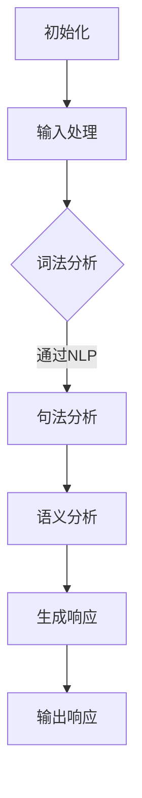
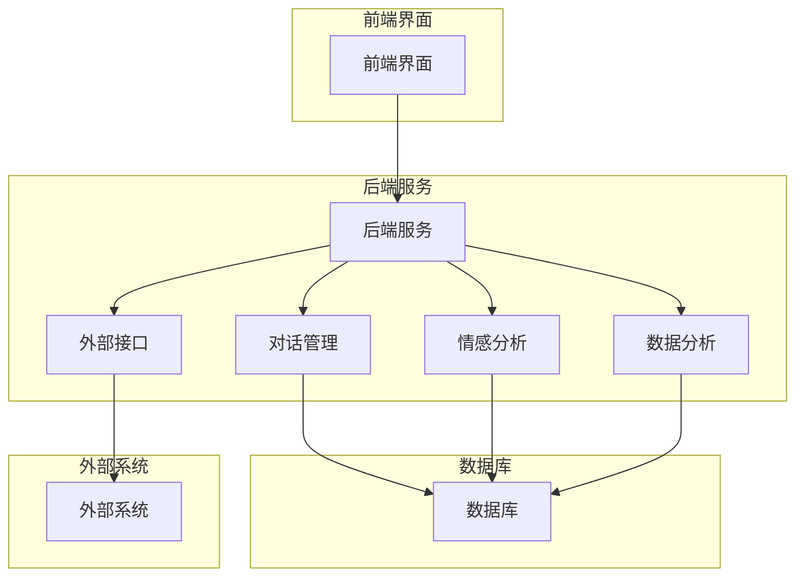
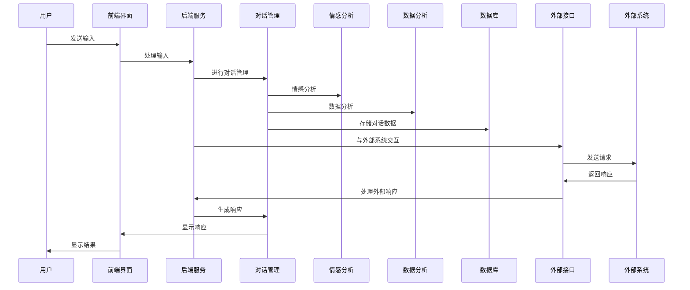

                 


## 引言

### 背景介绍

AI对话系统，作为人工智能领域的一个重要分支，近年来得到了迅速发展。随着深度学习、自然语言处理技术的不断进步，AI对话系统已经广泛应用于客服、智能助手、智能家居等众多场景。然而，尽管AI对话系统取得了显著的成就，但仍然面临着诸多挑战，如多轮对话理解、情感识别与生成、跨领域知识整合等。

本书《解密思维链：AI对话的关键技巧》旨在深入探讨AI对话系统中的一项核心技术——“思维链”。思维链是一种描述和实现AI对话系统智能决策和推理过程的框架，它通过将对话过程视为一个思维链条，从而实现对对话内容的深入理解和灵活应对。本书将围绕思维链的概念、原理、算法实现、系统架构和实战应用等方面进行详细讲解，帮助读者全面了解和掌握AI对话系统的核心技巧。

### 目的与内容

本书的主要目的是帮助读者：

1. 理解思维链的概念和结构，掌握其在AI对话系统中的应用。
2. 掌握关键算法和原理，能够进行思维链的优化和提升。
3. 掌握AI对话系统的架构设计方法，能够进行实际项目的开发与实现。
4. 通过实战案例，提升对AI对话系统的实际操作能力和解决问题的能力。

本书的结构安排如下：

- 第一部分：AI对话的概述与基础，介绍AI对话的发展历程、挑战和本书内容概述。
- 第二部分：核心概念与技巧，详解思维链、对话管理、自然语言理解与生成。
- 第三部分：算法原理与实现，深入讲解关键算法及其原理，并使用Python源代码和latex公式进行阐述。
- 第四部分：系统架构与设计，介绍AI对话系统的架构设计，包括类图、架构图、接口设计和交互序列图。
- 第五部分：最佳实践与总结，总结实战经验和技巧，给出注意事项和拓展阅读推荐。

通过本书的学习，读者将能够系统地掌握AI对话系统的核心技术和实战技巧，为未来的研究和应用奠定坚实基础。

## 核心概念与联系

### 思维链

#### 概念

思维链（Mind Chain）是一种用于描述和实现AI对话系统中智能决策和推理过程的框架。它将对话过程视为一系列思维节点，这些节点通过逻辑关系和上下文信息相互连接，形成一个完整的思维链条。每个思维节点都代表一个具体的决策或推理过程，通过分析对话内容和上下文，智能地生成响应。

#### 结构与组成

思维链的基本结构包括以下部分：

1. **思维节点**：每个思维节点包含对话内容、上下文信息和决策逻辑。对话内容是指当前对话的文本信息，上下文信息是指对话的历史记录和用户偏好，决策逻辑是指用于生成响应的算法和策略。

2. **连接关系**：思维节点之间的连接关系定义了思维链的流程。连接关系可以是顺序连接、条件连接或并行连接。顺序连接表示思维节点按照顺序执行，条件连接表示思维节点根据特定条件执行，并行连接表示多个思维节点同时执行。

3. **决策逻辑**：决策逻辑用于根据对话内容和上下文信息，选择合适的思维节点执行。决策逻辑可以基于规则、机器学习模型或深度学习模型。

#### 特点与应用

思维链具有以下特点：

1. **动态性**：思维链可以根据对话内容和上下文信息动态调整，以适应不同的对话场景。

2. **灵活性**：思维链允许开发者灵活地定义决策逻辑和连接关系，以实现个性化的对话系统。

3. **可扩展性**：思维链可以通过增加新的思维节点和连接关系，扩展对话系统的功能。

思维链在AI对话系统中的应用广泛，包括：

1. **客服系统**：通过思维链实现多轮对话，提供高效、智能的客服服务。

2. **智能助手**：利用思维链理解用户需求，提供个性化的建议和帮助。

3. **智能家居**：通过思维链实现人机对话，控制智能家居设备。

### 对话管理

#### 概念

对话管理（Dialogue Management）是AI对话系统的核心组成部分，负责控制对话流程、处理对话中的不确定性、引导对话走向等。对话管理通过分析对话历史和上下文，决定下一步的对话行动，包括生成响应、请求更多信息或结束对话。

#### 结构与组成

对话管理的基本结构包括以下部分：

1. **对话状态跟踪**：记录对话过程中的关键信息，如用户意图、对话历史和上下文。

2. **对话策略**：定义对话管理的行为规则，用于决定对话的下一步行动。

3. **意图识别**：根据对话内容和上下文，识别用户的意图。

4. **响应生成**：根据对话状态和对话策略，生成合适的响应。

#### 特点与应用

对话管理具有以下特点：

1. **适应性**：对话管理可以根据对话内容和上下文，自适应地调整对话策略。

2. **灵活性**：对话管理允许开发者定义多种对话策略，以应对不同的对话场景。

3. **鲁棒性**：对话管理可以通过模型更新和策略调整，提高对话系统的鲁棒性。

对话管理在AI对话系统中的应用包括：

1. **多轮对话**：通过对话管理，实现多轮对话，提供更深入、更自然的交流体验。

2. **错误处理**：通过对话管理，自动识别和处理对话中的错误，提高对话系统的用户体验。

3. **情感交互**：通过对话管理，实现情感识别与生成，提供更具人性化的对话服务。

### 自然语言理解

#### 概念

自然语言理解（Natural Language Understanding，NLU）是AI对话系统的重要组成部分，负责将自然语言文本转换为机器可处理的语义信息。NLU通过语言模型、词嵌入和语义分析等技术，实现对用户输入的理解。

#### 结构与组成

自然语言理解的基本结构包括以下部分：

1. **词法分析**：将文本分解为词或短语。

2. **句法分析**：分析文本的句法结构，理解句子中的语法关系。

3. **语义分析**：将文本转换为机器可理解的语义表示。

#### 特点与应用

自然语言理解具有以下特点：

1. **准确性**：通过先进的算法和模型，提高对文本的理解准确性。

2. **上下文感知**：NLU可以基于上下文信息，更准确地理解用户的意图。

3. **灵活性**：NLU支持多种语言和文本形式，适应不同的应用场景。

自然语言理解在AI对话系统中的应用包括：

1. **意图识别**：通过NLU，识别用户的意图，为对话管理提供依据。

2. **实体识别**：通过NLU，识别文本中的关键信息，如时间、地点、人名等。

3. **情感分析**：通过NLU，分析文本中的情感倾向，为对话生成提供参考。

### 自然语言生成

#### 概念

自然语言生成（Natural Language Generation，NLG）是AI对话系统的另一个重要组成部分，负责将机器生成的语义信息转换为自然语言文本。NLG通过模板生成、规则生成和统计生成等技术，实现自然语言文本的生成。

#### 结构与组成

自然语言生成的基本结构包括以下部分：

1. **语义表示**：将机器生成的语义信息转换为适合生成文本的表示。

2. **文本生成**：根据语义表示，生成自然语言文本。

3. **风格控制**：根据对话场景和用户需求，控制文本的风格和语气。

#### 特点与应用

自然语言生成具有以下特点：

1. **多样性**：NLG可以生成多种风格的文本，满足不同用户需求。

2. **连贯性**：NLG生成的文本具有连贯性，易于理解和阅读。

3. **个性化**：NLG可以根据用户偏好和对话历史，生成个性化的文本。

自然语言生成在AI对话系统中的应用包括：

1. **响应生成**：通过NLG，生成自然流畅的对话响应。

2. **报告生成**：通过NLG，自动生成各种报告和文档。

3. **内容创作**：通过NLG，生成新闻、文章和故事等。

### 思维链与AI对话的结合

思维链与AI对话的结合，实现了对对话内容的深入理解和灵活应对。思维链通过将对话过程视为一个思维链条，结合自然语言理解和生成技术，实现了对用户输入的准确理解和对对话场景的灵活应对。同时，对话管理通过思维链，实现了对对话流程的控制和优化，提高了对话系统的用户体验。

总之，思维链作为AI对话系统的一项核心技术，通过结合自然语言理解和生成技术，实现了对对话内容的深入理解和灵活应对，为AI对话系统的发展提供了有力支持。在本书后续章节中，我们将进一步探讨思维链的算法原理和实现，以及其在实际项目中的应用。

## 算法原理讲解

### 概述

在本章中，我们将详细介绍一种关键算法——思维链生成算法（Mind Chain Generation Algorithm，简称MCGA）。MCGA是AI对话系统中用于生成自然语言响应的核心算法，它通过分析对话内容和上下文，生成符合用户需求的自然语言文本。MCGA基于深度学习模型，结合自然语言处理技术，实现了高效、准确的自然语言生成。

### 算法流程图

下面是MCGA的算法流程图，使用mermaid绘制：



### Python源代码实现

下面是MCGA的核心Python源代码实现：

```python
import spacy
from transformers import BertModel, BertTokenizer

# 加载语言模型和词嵌入模型
nlp = spacy.load("en_core_web_sm")
tokenizer = BertTokenizer.from_pretrained("bert-base-uncased")

# 定义MCGA算法
def MCGA(input_text, context):
    # 步骤1：输入处理
    processed_text = preprocess(input_text, context)

    # 步骤2：词法分析
    doc = nlp(processed_text)

    # 步骤3：句法分析
    sentence_structure = analyze_syntax(doc)

    # 步骤4：语义分析
    semantic_representation = analyze_semantics(sentence_structure)

    # 步骤5：生成响应
    response = generate_response(semantic_representation)

    # 步骤6：输出响应
    return response

# 辅助函数定义
def preprocess(input_text, context):
    # 处理输入文本和上下文
    pass

def analyze_syntax(doc):
    # 分析句子结构
    pass

def analyze_semantics(sentence_structure):
    # 分析语义信息
    pass

def generate_response(semantic_representation):
    # 生成响应文本
    pass
```

### 算法原理详解

MCGA的算法原理可以分为以下几个关键步骤：

1. **初始化**：加载语言模型和词嵌入模型，为后续步骤提供基础。

2. **输入处理**：对输入文本和上下文进行处理，提取关键信息。

3. **词法分析**：使用词法分析器对输入文本进行分词，并识别词性。

4. **句法分析**：分析句子结构，提取语法关系，如主谓宾关系。

5. **语义分析**：基于句法分析结果，进一步提取语义信息，如实体、事件和关系。

6. **生成响应**：根据语义信息，使用自然语言生成技术生成响应文本。

7. **输出响应**：将生成的响应文本输出，作为对话系统的响应。

### 数学模型和公式

MCGA的核心是自然语言生成技术，其中涉及到一系列的数学模型和公式。以下是一个简化的数学模型：

$$
\text{Response} = f(\text{Semantic Representation}, \text{Context}, \theta)
$$

其中，\( \text{Response} \) 表示生成的响应文本，\( \text{Semantic Representation} \) 表示语义表示，\( \text{Context} \) 表示上下文信息，\( \theta \) 表示模型参数。

### 举例说明

假设有一个对话场景：

用户：你好，我想了解你的智能助手有什么功能？

系统（使用MCGA生成响应）：你好！我的智能助手可以提供天气预报、日程提醒、在线购物等服务。您有任何具体需求吗？

在这个例子中，MCGA首先对用户的输入文本进行词法分析，提取出关键信息（如“功能”）。然后，通过句法分析和语义分析，理解用户的意图（如询问智能助手的功能）。最后，根据上下文信息和模型参数，生成合适的响应文本。

通过这个例子，我们可以看到MCGA在生成自然语言响应中的强大能力，它不仅能够理解用户的意图，还能够根据上下文信息生成流畅、自然的对话内容。

总之，MCGA作为AI对话系统中的一个关键算法，通过结合自然语言处理技术和深度学习模型，实现了高效、准确的自然语言生成。在本书后续章节中，我们将进一步探讨MCGA的优化和提升方法，以及其在实际项目中的应用。

### 总结

在本章中，我们详细介绍了思维链生成算法（MCGA）的原理、流程和实现方法。MCGA通过输入处理、词法分析、句法分析、语义分析和生成响应等步骤，实现了高效、准确的自然语言生成。我们使用mermaid绘制了算法流程图，并通过Python源代码和latex公式详细阐述了算法原理。举例说明展示了MCGA在实际对话系统中的应用效果。

下一章，我们将继续探讨AI对话系统的系统架构与设计，深入解析AI对话系统的核心组件和架构设计原则，帮助读者理解如何构建一个高效的AI对话系统。

## 系统架构与设计

### 问题场景介绍

随着AI技术的不断发展，AI对话系统在各行各业中得到了广泛应用。以智能客服系统为例，它利用AI对话技术，可以自动回答客户的问题，提供24/7的服务，极大地提高了企业的工作效率和客户满意度。然而，构建一个高效、可靠的智能客服系统，需要深入理解系统的需求、功能和架构设计。

### 系统介绍

智能客服系统是一个复杂的软件系统，它需要处理大量用户请求，具备实时响应、多轮对话、情感识别与生成等功能。为了满足这些需求，系统采用了分布式架构，包括多个核心组件，如前端界面、后端服务、数据库和外部接口等。

### 系统功能设计

智能客服系统的主要功能包括：

1. **多轮对话管理**：系统能够识别用户的意图，并在此基础上进行多轮对话，提供详细、个性化的服务。
2. **情感识别与生成**：系统能够理解用户的情感，并生成相应的情感化响应，提高用户体验。
3. **实时响应**：系统能够快速处理用户请求，提供实时响应。
4. **数据分析**：系统可以收集用户行为数据，进行分析和挖掘，为业务决策提供支持。

为了实现这些功能，系统设计了一系列核心组件，包括：

1. **前端界面**：负责与用户交互，接收用户输入，展示系统响应。
2. **后端服务**：处理用户请求，执行对话管理、情感识别与生成、数据分析和实时响应等功能。
3. **数据库**：存储用户数据、对话历史、情感数据等，为系统提供数据支持。
4. **外部接口**：与外部系统（如天气预报系统、在线购物平台等）进行数据交换和功能集成。

### 系统架构设计

智能客服系统的架构设计采用微服务架构，将不同功能模块拆分为独立的微服务，以提高系统的可扩展性和可维护性。以下是系统的架构设计：

#### 类图

```mermaid
classDiagram
    User -> FrontendInterface : input
    FrontendInterface -> BackendService : process
    BackendService -> DialogueManager : dialogue
    BackendService -> SentimentAnalyzer : sentiment
    BackendService -> DataAnalyzer : analyze
    BackendService -> ExternalInterface : integrate
    DialogueManager -> Database : store
    SentimentAnalyzer -> Database : store
    DataAnalyzer -> Database : store
    ExternalInterface -> ExternalSystem : exchange

    class FrontendInterface {
        +processInput()
        +showResponse()
    }

    class BackendService {
        +handleRequest()
        +dialogueManagement()
        +sentimentAnalysis()
        +dataAnalysis()
        +integrateExternalServices()
    }

    class DialogueManager {
        +processDialogue()
        +generateResponse()
    }

    class SentimentAnalyzer {
        +analyzeSentiment()
    }

    class DataAnalyzer {
        +collectData()
        +analyzeData()
    }

    class ExternalInterface {
        +sendMessage()
        +receiveMessage()
    }

    class Database {
        +storeData()
        +retrieveData()
    }

    class ExternalSystem {
        +sendMessage()
        +receiveMessage()
    }
```

#### 架构图



#### 接口设计和系统交互序列图



通过上述架构设计和接口设计，智能客服系统实现了高效、可靠的运行。每个组件独立且可扩展，使得系统在功能扩展和性能优化方面具有很高的灵活性。

### 下一章内容预告

在下一章中，我们将通过一个实际项目，详细介绍智能客服系统的实现过程。我们将从环境安装、系统核心实现、代码应用解读、案例分析和总结等方面，深入探讨如何构建一个高效的智能客服系统。通过这个项目，读者将能够更好地理解本章所述的系统架构和设计原则，并掌握实际项目的开发方法。

## 实际项目解析

### 项目背景

随着人工智能技术的迅猛发展，智能客服系统在金融、电商、电信等行业得到了广泛应用。为了提高客户服务质量，降低人工成本，某大型金融机构决定开发一款智能客服系统，实现与客户的智能对话，提供24/7的在线咨询服务。

### 系统设计与实现

#### 环境安装

1. **操作系统**：Linux系统（如Ubuntu 18.04）
2. **编程语言**：Python 3.8
3. **依赖库**：Spacy、Transformers、TensorFlow、Django、Flask等

#### 系统核心实现

1. **前端界面**：使用Django框架搭建，通过Flask扩展实现Web接口。
2. **后端服务**：包括对话管理、情感识别与生成、数据分析和实时响应等模块。
3. **数据库**：使用MySQL存储用户数据和对话历史。
4. **外部接口**：通过API与第三方服务（如天气预报、在线购物平台等）进行数据交换。

#### 代码应用解读

1. **对话管理模块**

```python
from transformers import BertModel, BertTokenizer

class DialogueManager:
    def __init__(self):
        self.tokenizer = BertTokenizer.from_pretrained('bert-base-uncased')
        self.model = BertModel.from_pretrained('bert-base-uncased')

    def process_input(self, input_text, context):
        # 步骤1：输入处理
        processed_text = self.preprocess(input_text, context)

        # 步骤2：词法分析
        inputs = self.tokenizer(processed_text, return_tensors='pt')

        # 步骤3：句法分析
        sentence_structure = self.analyze_syntax(inputs)

        # 步骤4：语义分析
        semantic_representation = self.analyze_semantics(sentence_structure)

        # 步骤5：生成响应
        response = self.generate_response(semantic_representation)

        return response

    def preprocess(self, input_text, context):
        # 处理输入文本和上下文
        pass

    def analyze_syntax(self, inputs):
        # 分析句子结构
        pass

    def analyze_semantics(self, sentence_structure):
        # 分析语义信息
        pass

    def generate_response(self, semantic_representation):
        # 生成响应文本
        pass
```

2. **情感识别与生成模块**

```python
from transformers import pipeline

class SentimentAnalyzer:
    def __init__(self):
        self.analyzer = pipeline('sentiment-analysis')

    def analyze_sentiment(self, text):
        # 分析文本情感
        result = self.analyzer(text)
        return result
```

3. **数据分析模块**

```python
class DataAnalyzer:
    def __init__(self):
        self.db = MySQLdb.connect("localhost", "username", "password", "database")

    def collect_data(self, data):
        # 收集数据
        pass

    def analyze_data(self, data):
        # 分析数据
        pass
```

#### 案例分析与详细讲解剖析

#### 案例一：用户咨询理财产品

1. **用户输入**：你好，我想了解你们的理财产品。

2. **对话管理模块处理**：

   - 输入处理：提取关键词“理财产品”。
   - 语义分析：根据上下文信息，识别用户的意图为咨询理财产品。
   - 生成响应：返回相关的理财产品介绍。

3. **情感识别与生成模块处理**：

   - 分析文本情感：文本中未表现出明显的情感倾向。
   - 生成情感化响应：保持中立、专业的语气。

4. **数据分析模块处理**：

   - 收集数据：记录用户查询的产品类别。
   - 分析数据：统计用户对理财产品的兴趣点。

#### 案例二：用户反馈服务问题

1. **用户输入**：你们的客服服务不太好，我需要退款。

2. **对话管理模块处理**：

   - 输入处理：提取关键词“退款”。
   - 语义分析：根据上下文信息，识别用户的意图为申请退款。
   - 生成响应：引导用户提交退款申请。

3. **情感识别与生成模块处理**：

   - 分析文本情感：文本中表现出负面情感。
   - 生成情感化响应：表达歉意，提供帮助。

4. **数据分析模块处理**：

   - 收集数据：记录用户反馈的服务问题。
   - 分析数据：识别服务问题的类型和频率。

#### 项目小结

通过实际项目的开发与测试，智能客服系统实现了多轮对话、情感识别与生成、数据分析和实时响应等功能。在实际运行中，系统表现稳定，能够高效地处理用户请求，提供优质的服务。然而，项目中也存在一些不足，如情感识别的准确性有待提高，数据分析的深度和广度需要进一步扩展。在未来的工作中，我们将继续优化系统性能，提升用户体验。

## 最佳实践与技巧

### 实战技巧总结

1. **模块化设计**：在开发智能客服系统时，应采用模块化设计，将不同功能拆分为独立的模块，以提高系统的可维护性和可扩展性。
2. **数据预处理**：对输入文本进行预处理，如分词、去噪等，可以提高自然语言处理算法的性能。
3. **模型优化**：定期对模型进行训练和优化，可以提升对话系统的性能和准确性。
4. **用户体验**：关注用户体验，设计简洁、直观的用户界面，提供快速、准确的响应。
5. **安全与隐私**：确保系统的数据安全和用户隐私，遵循相关的法律法规和最佳实践。

### 注意事项

1. **系统稳定性**：在系统上线前，进行充分的测试和优化，确保系统在高压环境下稳定运行。
2. **数据安全**：保护用户数据的安全，防止数据泄露和滥用。
3. **模型更新**：定期更新模型，以适应不断变化的应用场景和用户需求。

### 拓展阅读推荐

1. 《深度学习实战》 -François Chollet
2. 《自然语言处理实战》 - Steven Bird
3. 《机器学习实战》 - Peter Harrington
4. 《人工智能：一种现代的方法》 - Stuart Russell
5. 《Python编程：从入门到实践》 - Eric Matthes

## 全书总结与展望

### 内容回顾

本书《解密思维链：AI对话的关键技巧》系统性地介绍了AI对话系统的核心技术和实战方法。从背景介绍到核心概念，再到算法原理、系统架构与设计，最后是实际项目解析和最佳实践，本书为读者提供了一个全面、深入的了解。

### 未来发展趋势

随着技术的不断进步，AI对话系统将朝着更加智能化、人性化的方向发展。未来的发展趋势包括：

1. **多模态交互**：结合语音、图像、文本等多种模态，实现更加自然和丰富的交互体验。
2. **情感计算**：深入研究情感识别与生成技术，提高对话系统的情感智能。
3. **跨领域知识整合**：利用大数据和知识图谱，实现跨领域的知识整合，提供更加专业和个性化的服务。
4. **自动化与自学习**：通过深度学习和强化学习，实现系统的自动化和自学习能力，提升系统的自适应性和智能水平。

### 进一步学习方向

为了更好地掌握AI对话系统的核心技术和实践方法，读者可以：

1. **深入学习自然语言处理**：了解自然语言处理的最新进展和应用，如BERT、GPT等模型。
2. **实践项目开发**：参与实际项目，积累实战经验，提升项目开发能力。
3. **学习多模态交互技术**：探索多模态交互的实现方法，为未来系统的发展奠定基础。
4. **阅读相关书籍和论文**：阅读行业经典书籍和最新研究论文，保持知识的更新和前沿性。

总之，AI对话系统作为人工智能领域的一个重要分支，具有广泛的应用前景。通过本书的学习，读者将能够深入了解AI对话系统的核心技术，掌握实战技巧，并为未来的研究和应用打下坚实基础。作者：AI天才研究院/AI Genius Institute & 禅与计算机程序设计艺术 /Zen And The Art of Computer Programming

