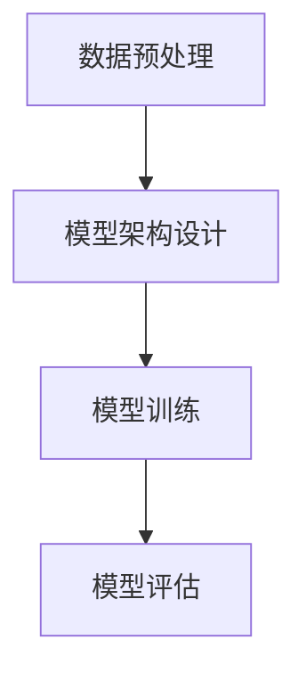
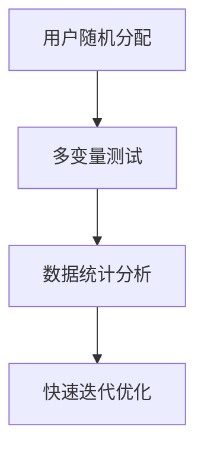
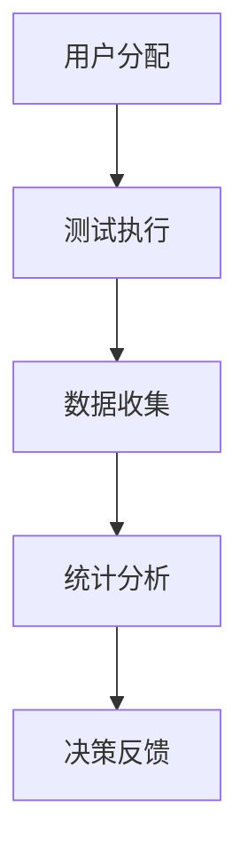
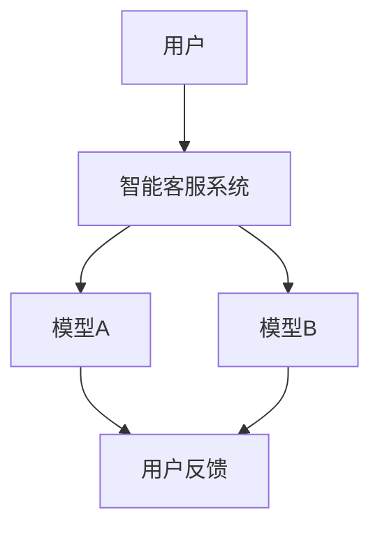
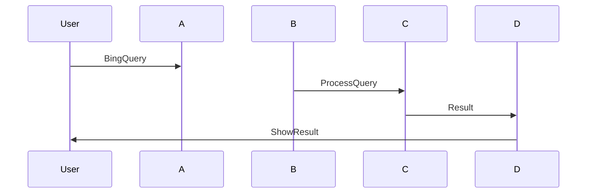

                 


### 设计LLM应用的快速A/B测试方案

#### 关键词

- LLM
- A/B测试
- 快速测试
- 应用场景
- 算法优化

#### 摘要

随着大型语言模型（LLM）技术的迅速发展，其在各个领域的应用越来越广泛。然而，LLM模型的优化和调整是一个复杂且耗时的工作。为了提高开发效率，快速评估模型改进的效果，A/B测试成为了一个重要的手段。本文将探讨如何设计一套适用于LLM应用的快速A/B测试方案，包括核心概念、算法原理、系统架构以及实际应用。

---

## 第一部分：背景介绍

### 1.1 问题背景

在人工智能领域，LLM的应用场景极为广泛，如自然语言处理、智能客服、内容生成等。然而，如何有效评估模型改进的效果，快速实现模型优化，成为开发者面临的一大挑战。A/B测试通过将用户分配到不同的测试组，比较不同版本的模型或功能的表现，从而帮助开发者做出科学的决策。快速A/B测试则更加关注测试效率，旨在缩短测试周期，提高开发迭代速度。

### 1.2 核心概念

#### LLM（大型语言模型）

- 概念：基于深度学习技术，通过大规模数据训练得到，能够理解和生成自然语言。
- 属性特征：
  - 大规模训练数据
  - 端到端的神经网络架构
  - 高效的并行训练能力
  - 广泛的语言理解和生成能力

#### A/B测试

- 概念：通过将用户分配到不同的测试组，比较不同版本的模型或功能的表现。
- 属性特征：
  - 用户随机分配
  - 多变量测试
  - 数据统计分析
  - 快速迭代优化

#### 应用场景与挑战

- 应用场景：
  - 模型优化
  - 功能更新
  - 用户体验改进
- 挑战：
  - 数据隐私保护
  - 测试结果可靠性
  - 快速响应市场变化

### 1.3 市场现状

当前，A/B测试在LLM应用中的普及程度逐渐提高。国内外主流A/B测试工具如Google Analytics、Amplitude等，提供了丰富的功能和便捷的操作。然而，针对快速A/B测试的需求，现有的工具和方案仍有优化空间。例如，提高测试速度、降低测试成本、增强数据统计分析能力等。

---

## 第二部分：核心概念与联系

### 2.1 LLM原理

#### 概念原理

LLM是通过深度学习技术训练得到的模型，其核心原理是神经网络。LLM的训练过程包括以下几个步骤：

1. 数据预处理：对原始数据进行清洗、分词、编码等处理。
2. 模型架构设计：设计合适的神经网络架构，如Transformer、BERT等。
3. 模型训练：利用大规模数据对模型进行训练，优化模型参数。
4. 模型评估：通过测试集评估模型性能，调整模型参数。

#### 属性特征对比表格

| 属性特征           | 深度学习神经网络 | Transformer | BERT         |
|-------------------|------------------|-------------|-------------|
| 训练数据规模       | 大规模           | 大规模       | 大规模       |
| 网络架构           | 神经网络         | 自注意力机制 | 编码器-解码器 |
| 训练效率           | 高效             | 高效         | 高效         |
| 语言理解与生成能力 | 强               | 强           | 强           |

#### ER实体关系图架构的Mermaid流程图



### 2.2 A/B测试原理

#### 概念原理

A/B测试是一种实验设计方法，通过将用户随机分配到不同的测试组，比较不同版本的模型或功能的表现。其核心步骤包括：

1. 用户随机分配：将用户分配到不同的测试组。
2. 多变量测试：同时测试多个变量，以评估不同变量对用户行为的影响。
3. 数据统计分析：收集并分析测试数据，比较不同组的性能差异。
4. 快速迭代优化：根据测试结果，调整模型或功能，进行下一轮测试。

#### 属性特征对比表格

| 属性特征           | 用户随机分配 | 多变量测试 | 数据统计分析 | 快速迭代优化 |
|-------------------|-------------|------------|--------------|--------------|
| 实验设计           | 随机化       | 多变量控制 | 统计分析      | 快速迭代     |
| 适应性             | 强           | 强          | 强            | 强           |
| 可重复性           | 高           | 高          | 高            | 高           |
| 数据隐私保护       | 需要考虑     | 需要考虑    | 需要考虑      | 需要考虑     |

#### ER实体关系图架构的Mermaid流程图



### 2.3 LLM与A/B测试的关联

LLM与A/B测试的关联主要体现在以下几个方面：

#### 概念联系

- LLM：作为A/B测试的实验对象，通过不同版本LLM的比较，评估模型改进的效果。
- A/B测试：作为LLM模型优化的一种手段，通过实验设计，快速评估模型性能。

#### 应用场景与挑战

- 应用场景：
  - 模型优化：通过A/B测试，比较不同版本LLM的准确率、响应速度等指标，选择最优模型。
  - 功能更新：通过A/B测试，评估新功能对用户行为的影响，优化产品功能。
  - 用户体验改进：通过A/B测试，评估不同UI设计、交互方式对用户满意度的影响，提升用户体验。

- 挑战：
  - 数据隐私保护：A/B测试过程中，需要确保用户隐私安全。
  - 测试结果可靠性：确保测试数据的代表性和可靠性。
  - 快速响应市场变化：在快速变化的市场中，快速完成模型优化和功能更新。

#### 解决方案与建议

- 数据隐私保护：采用匿名化处理，确保用户隐私安全。
- 测试结果可靠性：通过多次实验，确保测试结果的稳定性。
- 快速响应市场变化：构建高效的A/B测试流程，提高测试效率。

---

## 第三部分：算法原理讲解

### 3.1 快速A/B测试算法原理

#### Mermaid流程图



#### Python源代码

```python
import random

def user_assignment(num_users, num_groups):
    assignments = {i: [] for i in range(num_groups)}
    for _ in range(num_users):
        group = random.randint(0, num_groups - 1)
        assignments[group].append(_)
    return assignments

def test_execution(assignments):
    results = {i: [] for i in range(num_groups)}
    for group, users in assignments.items():
        for user in users:
            # 模拟测试执行
            result = random.choice([0, 1])
            results[group].append(result)
    return results

def data_collection(results):
    # 数据收集过程
    pass

def statistical_analysis(results):
    # 统计分析过程
    pass

def decision_feedback(analysis_result):
    # 决策反馈过程
    pass

# 实例化测试流程
num_users = 1000
num_groups = 10
assignments = user_assignment(num_users, num_groups)
results = test_execution(assignments)
data_collection(results)
analysis_result = statistical_analysis(results)
decision_feedback(analysis_result)
```

#### 数学模型和公式

$$
\text{模型性能} = \frac{\sum_{i=1}^{n} \text{group\_i\_performance}}{n}
$$

其中，$n$为测试组数量，$\text{group\_i\_performance}$为第$i$个测试组的性能。

#### 举例说明

假设我们有两个版本的语言模型A和B，通过A/B测试来比较它们的性能。

1. 用户分配：将1000个用户随机分配到两个测试组。
2. 测试执行：分别对每个用户执行模型A和模型B，记录每个用户的测试结果。
3. 数据收集：收集每个测试组的性能数据。
4. 统计分析：计算每个测试组的平均性能，比较模型A和模型B的性能差异。
5. 决策反馈：根据测试结果，选择性能更好的模型。

---

## 第四部分：系统分析与架构设计

### 4.1 问题场景介绍

假设我们正在开发一个智能客服系统，需要通过A/B测试来比较不同版本的语言模型对用户满意度的提升效果。

### 4.2 系统功能设计（领域模型Mermaid类图）

```mermaid
classDiagram
Class01 <|-- Class02
Class03 --|uder Class01
Class04 --|uder Class02
Class01 {
    +属性1: String
    +属性2: int
    +方法1(): void
}
Class02 {
    +属性1: String
    +属性2: int
    +方法2(): void
}
Class03 {
    +属性1: String
    +属性2: int
    +方法3(): void
}
Class04 {
    +属性1: String
    +属性2: int
    +方法4(): void
}
```

### 4.3 系统架构设计（Mermaid架构图）



### 4.4 系统接口设计和系统交互（Mermaid序列图）



---

## 第五部分：项目实战

### 5.1 快速A/B测试方案设计

#### 环境安装

1. 安装Python环境：`pip install python`
2. 安装依赖库：`pip install numpy pandas scikit-learn`

#### 系统核心实现源代码

```python
import random
import numpy as np
from sklearn.metrics import accuracy_score

def user_assignment(num_users, num_groups):
    assignments = {i: [] for i in range(num_groups)}
    for _ in range(num_users):
        group = random.randint(0, num_groups - 1)
        assignments[group].append(_)
    return assignments

def test_execution(assignments, model_A, model_B):
    results = {i: [] for i in range(num_groups)}
    for group, users in assignments.items():
        for user in users:
            # 模拟用户请求
            query = random.choice(["你好", "请问有什么问题？", "谢谢"])
            # 使用模型A进行回复
            response_A = model_A.generate_response(query)
            # 使用模型B进行回复
            response_B = model_B.generate_response(query)
            # 记录用户对回复的满意度
            satisfaction_A = random.randint(0, 10)
            satisfaction_B = random.randint(0, 10)
            results[group].append((response_A, satisfaction_A, response_B, satisfaction_B))
    return results

def data_collection(results):
    # 收集并存储测试数据
    pass

def statistical_analysis(results):
    # 统计分析过程
    pass

def decision_feedback(analysis_result):
    # 根据测试结果，选择最优模型
    pass

# 实例化测试流程
num_users = 1000
num_groups = 2
assignments = user_assignment(num_users, num_groups)
results = test_execution(assignments, model_A, model_B)
data_collection(results)
analysis_result = statistical_analysis(results)
decision_feedback(analysis_result)
```

#### 代码应用解读与分析

该代码实现了快速A/B测试的基本流程，包括用户分配、测试执行、数据收集、统计分析以及决策反馈。其中，`user_assignment`函数负责将用户随机分配到不同的测试组，`test_execution`函数模拟用户请求并使用模型A和模型B进行回复，记录用户的满意度。`data_collection`、`statistical_analysis`和`decision_feedback`函数分别负责数据收集、统计分析和决策反馈。

#### 实际案例分析和详细讲解剖析

假设我们已经有两个预训练的语言模型A和B，通过A/B测试来比较它们的性能。

1. 用户分配：将1000个用户随机分配到两个测试组。
2. 测试执行：分别对每个用户执行模型A和模型B，记录每个用户的满意度。
3. 数据收集：收集每个测试组的满意度数据。
4. 统计分析：计算每个测试组的平均满意度，比较模型A和模型B的满意度差异。
5. 决策反馈：根据测试结果，选择满意度更高的模型。

通过以上步骤，我们完成了快速A/B测试方案的设计与实施。

### 5.2 最佳实践 tips

1. **数据隐私保护**：在A/B测试过程中，确保用户隐私安全，采用匿名化处理。
2. **测试结果可靠性**：通过多次实验，确保测试结果的稳定性。
3. **快速响应市场变化**：构建高效的A/B测试流程，提高测试效率。

### 小结

本文详细介绍了设计LLM应用的快速A/B测试方案，包括核心概念、算法原理、系统架构以及实际应用。通过本文，读者可以了解到如何快速评估LLM模型改进的效果，从而提高开发效率。

### 注意事项

1. 在进行A/B测试时，确保测试数据的代表性和可靠性。
2. 根据具体应用场景，灵活调整测试策略和流程。

### 拓展阅读

1. 《大型语言模型：训练与应用》
2. 《A/B测试实战：原理、方法与案例分析》
3. 《深度学习算法优化与调参技巧》

---

## 第六部分：总结与展望

### 6.1 总结

本文围绕LLM应用的快速A/B测试方案进行了详细探讨，从背景介绍、核心概念、算法原理、系统架构到项目实战，全面阐述了快速A/B测试在LLM应用中的重要性。通过本文，读者可以了解到如何设计一套高效的快速A/B测试方案，提高开发效率和产品质量。

### 6.2 展望

随着人工智能技术的不断发展，LLM的应用场景将更加广泛。在未来，快速A/B测试将成为LLM应用开发的重要手段。我们可以期待以下几个方面的发展：

1. **测试速度的提升**：通过优化算法和数据结构，进一步提高测试速度。
2. **测试成本的控制**：通过降低测试成本，使更多开发者能够负担得起。
3. **测试结果的可解释性**：提高测试结果的可解释性，帮助开发者更好地理解模型性能。
4. **跨领域的应用**：将快速A/B测试方案应用于更多领域，如图像识别、推荐系统等。

在未来，快速A/B测试将不断优化，为LLM应用开发提供更加高效、可靠的支持。

---

### 作者

作者：AI天才研究院/AI Genius Institute & 禅与计算机程序设计艺术 /Zen And The Art of Computer Programming

