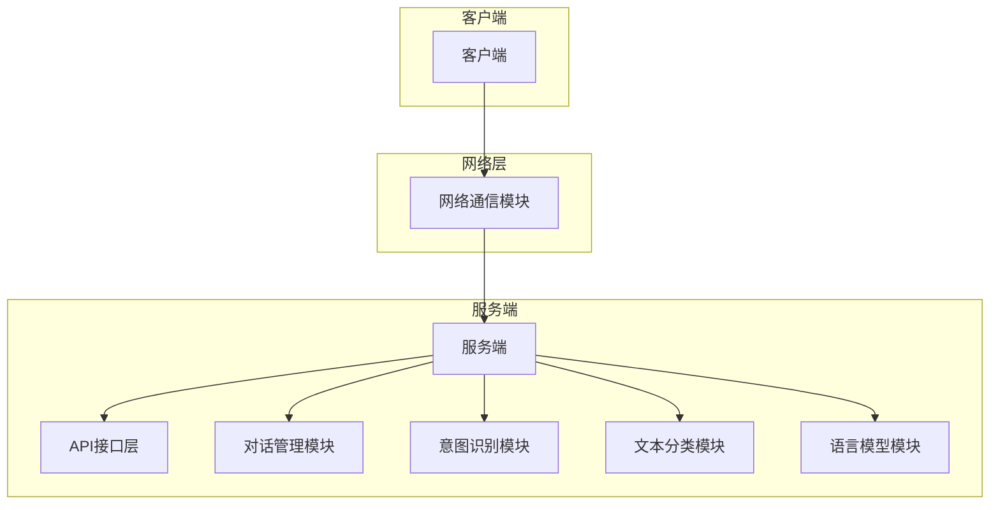
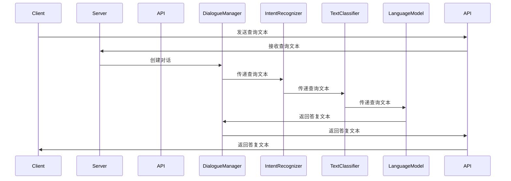

                 

### 引言

随着人工智能技术的发展，自然语言处理（NLP）已经成为计算机科学领域的一个重要分支。近年来，大型语言模型（LLM, Large Language Model）如BERT、GPT-3等在各类应用中取得了显著的成果，从文本生成、机器翻译到问答系统，LLM正迅速改变着我们的生活方式。然而，LLM应用的开发和部署不仅依赖于其强大的模型能力，还需要确保其稳定性和准确性，这就要求开发者在设计和测试过程中采用高效且可靠的自动化测试策略。

自动化测试在软件工程中扮演着至关重要的角色。它可以显著提高测试效率，减少人力成本，并确保软件质量。对于LLM应用而言，由于其复杂性和对数据依赖性，自动化测试显得尤为重要。自动化测试可以帮助开发者快速检测模型在不同场景下的表现，确保其稳定性和可靠性，从而提高用户的使用体验。

本文将围绕设计LLM应用的自动化测试策略进行探讨，旨在为开发者提供一套系统化、可操作性的测试方案。通过分析自动化测试的基本概念、核心原理以及具体的实施步骤，本文将帮助读者更好地理解和应用自动化测试策略，从而提升LLM应用的开发效率和产品质量。

关键词：自然语言处理、大型语言模型、自动化测试、测试策略、模型稳定性、测试覆盖

摘要：本文深入探讨了设计大型语言模型（LLM）应用自动化测试策略的必要性和重要性。首先，介绍了自然语言处理和自动化测试的基本概念及其在LLM应用中的重要性。接着，详细分析了LLM和自动化测试的核心原理，包括测试用例设计、测试执行和结果分析等关键环节。最后，通过一个实际项目案例，展示了自动化测试策略在LLM应用开发中的具体应用和效果。本文旨在为开发者提供一套实用的自动化测试方案，以提升LLM应用的稳定性和可靠性。

### 目录大纲

为了更好地组织本文内容，确保读者能够清晰、系统地掌握自动化测试策略的设计方法，本文将分为七个主要部分：

1. **背景介绍与核心概念**：
   - **第1章：自然语言处理与自动化测试概述**：介绍自然语言处理（NLP）和自动化测试的基本概念，阐述它们在LLM应用中的重要性。
   - **第2章：核心概念与联系**：详细讲解语言模型的基本原理和自动化测试的基本原理，分析LLM自动化测试的关键要素。
   - **第3章：算法原理讲解**：深入分析语言模型和自动化测试的算法原理，通过Mermaid流程图和Python代码示例进行讲解。

2. **系统分析与架构设计方案**：
   - **第4章：系统分析与架构设计方案**：介绍项目背景和系统功能设计，展示系统架构图和接口设计，通过Mermaid类图和序列图进行详细分析。

3. **项目实战**：
   - **第5章：项目实战**：详细讲解环境安装、系统核心实现源代码，代码应用解读与分析，实际案例分析和详细讲解剖析，以及项目小结。

4. **最佳实践与拓展**：
   - **第6章：最佳实践与拓展**：总结最佳实践，列出注意事项，提供拓展阅读资源，以帮助读者深入理解和应用自动化测试策略。

5. **小结**：
   - **第7章：小结**：回顾主要内容和核心观点，总结自动化测试策略，对未来的发展方向进行展望。

通过上述章节的详细解读，本文将为读者提供一套完整的LLM应用自动化测试策略设计方法，助力开发者提升LLM应用的开发效率和产品质量。

### 第1章：自然语言处理与自动化测试概述

#### 1.1.1 自然语言处理的发展背景与现状

自然语言处理（NLP）是人工智能（AI）领域的一个重要分支，其研究目的是使计算机能够理解、生成和处理人类自然语言。自20世纪50年代以来，NLP经历了多个发展阶段。早期的研究主要集中在基于规则的系统中，这些系统依赖于大量手工编写的语法规则和词典，但效率较低且难以扩展。随着计算能力的提升和数据量的增加，统计方法和机器学习方法开始被广泛应用，显著提升了NLP系统的性能。

进入21世纪，深度学习技术的快速发展为NLP带来了新的契机。2003年，神经网络机器翻译（Neural Machine Translation, NMT）的出现标志着NLP进入了新的时代。2018年，Google发布了Transformer架构，进一步推动了NLP的发展。Transformer引入了自注意力机制（Self-Attention Mechanism），使得模型能够更好地捕捉句子中长距离的依赖关系。基于Transformer的模型，如BERT（Bidirectional Encoder Representations from Transformers）和GPT-3（Generative Pre-trained Transformer 3），在多个NLP任务上取得了突破性的成果。

目前，NLP的应用场景涵盖了文本分类、情感分析、命名实体识别、机器翻译、对话系统等多个方面。例如，在社交媒体平台上，NLP技术可以用于垃圾邮件过滤和用户情感分析；在电子商务领域，NLP可以帮助实现智能客服和个性化推荐；在医疗领域，NLP可以用于病历分析和医学文本挖掘。

#### 1.1.2 自动化测试的概念与重要性

自动化测试是指通过使用自动化工具来执行测试脚本，以检测软件的特定功能或行为是否符合预期。与手工测试相比，自动化测试具有以下优势：

1. **提高测试效率**：自动化测试可以显著提高测试的执行速度，减少测试周期。特别是在涉及大量数据或复杂数据的场景中，自动化测试可以节省大量时间和人力成本。
2. **降低测试成本**：自动化测试可以减少重复性工作的需求，从而降低测试成本。此外，自动化测试工具通常具有较好的复用性，可以节省开发和维护测试脚本的资源。
3. **提高测试质量**：自动化测试可以更精确地重复执行测试，减少人为错误的可能性，从而提高测试的质量和覆盖率。
4. **促进持续集成**：自动化测试与持续集成（Continuous Integration, CI）相结合，可以确保在每次代码提交后都进行自动测试，及时发现问题并反馈，促进团队协作和快速迭代。

自动化测试广泛应用于各种软件项目，特别是那些具有较高复杂度和频繁变更的项目。对于LLM应用而言，由于其高度复杂性和对数据质量的依赖性，自动化测试显得尤为重要。LLM应用通常涉及大规模数据集和复杂的模型结构，通过自动化测试可以确保模型在各种场景下的稳定性和准确性。

#### 1.1.3 语言模型在自然语言处理中的应用

语言模型是NLP的核心组件之一，其主要功能是预测文本中的下一个单词或字符。在LLM应用中，常见的任务包括文本生成、机器翻译、文本分类和问答系统等。

1. **文本生成**：文本生成是语言模型最直观的应用之一。通过输入一个起始文本，语言模型可以生成一系列连续的文本。例如，自动生成新闻报道、文章摘要和对话等。文本生成在内容创作和娱乐领域具有广泛的应用。

2. **机器翻译**：机器翻译是将一种语言的文本转换为另一种语言的过程。传统的机器翻译方法基于规则或基于统计的方法，而基于深度学习的机器翻译模型，如Google翻译使用的BERT模型，大大提高了翻译的准确性和流畅性。

3. **文本分类**：文本分类是将文本数据分类到预定义的类别中。常见的应用场景包括垃圾邮件过滤、情感分析和主题分类。语言模型通过学习大量已标记的文本数据，可以自动识别文本的特征，并对其分类。

4. **问答系统**：问答系统是一种能够理解自然语言问题并给出相关答案的人工智能系统。语言模型在问答系统中用于解析和理解用户的问题，并从知识库或文本数据中检索相关答案。

通过以上应用，语言模型在NLP中发挥了重要作用，而自动化测试则为确保这些应用的质量和稳定性提供了有力支持。

#### 1.1.4 LLM自动化测试面临的挑战

尽管自动化测试在LLM应用中具有显著的优势，但也面临一系列挑战：

1. **模型复杂性**：LLM通常由数亿甚至数十亿个参数组成，其内部结构和操作非常复杂。自动化测试需要针对这些复杂的模型结构和操作设计相应的测试用例，以确保其正确性和稳定性。

2. **数据依赖性**：语言模型在训练和预测过程中高度依赖数据质量。自动化测试需要处理大量的训练数据和测试数据，确保数据的一致性和可靠性。任何数据错误都可能导致测试结果不准确。

3. **可重复性问题**：自动化测试需要确保测试结果的重复性和一致性。由于LLM模型具有随机性，测试过程中可能遇到随机性带来的不确定性，从而影响测试结果的可靠性。

4. **性能瓶颈**：LLM模型的计算量通常非常大，特别是在训练和推理过程中。自动化测试工具和测试环境需要具备足够的计算资源，以确保测试的效率和准确性。

为了解决上述挑战，开发者需要设计灵活且高效的自动化测试策略，结合多种测试方法和工具，确保LLM应用的稳定性和可靠性。

### 第2章：核心概念与联系

#### 2.1.1 语言模型的基本原理

语言模型是自然语言处理（NLP）中的核心组件，其基本原理是通过学习大量文本数据，预测文本中的下一个单词或字符。以下是关于语言模型的基本原理的详细说明：

##### 2.1.1.1 语言模型的概念

语言模型是一种概率模型，用于预测文本序列的概率分布。它通常表示为P(w|w')，其中w'是已知的文本序列，w是下一个将要出现的单词或字符。

##### 2.1.1.2 语言模型的类型

语言模型可以分为以下几种类型：

1. **n-gram模型**：n-gram模型是最简单的语言模型，它基于前n个单词或字符的历史信息预测下一个单词或字符。这种模型的优点是实现简单，但缺点是难以捕捉长距离依赖关系。

2. **神经网络模型**：神经网络模型，如循环神经网络（RNN）和卷积神经网络（CNN），通过学习文本数据中的复杂模式，可以捕捉长距离依赖关系。这些模型在处理复杂任务时表现出色。

3. **注意力机制模型**：注意力机制模型，如Transformer，通过自注意力（Self-Attention）和交叉注意力（Cross-Attention）机制，可以有效地捕捉长距离依赖关系，从而在许多NLP任务中取得了优异的性能。

##### 2.1.1.3 语言模型的训练过程

语言模型的训练过程主要包括以下步骤：

1. **数据预处理**：首先，对文本数据进行清洗和预处理，包括分词、去除停用词、词干提取等。然后，将文本数据转换为数字化的表示，如词嵌入（Word Embedding）。

2. **构建训练集和验证集**：将预处理后的文本数据划分为训练集和验证集。训练集用于模型训练，验证集用于模型评估和调整。

3. **模型训练**：使用训练集对语言模型进行训练。在训练过程中，模型通过优化损失函数，如交叉熵损失函数（Cross-Entropy Loss），学习预测文本的概率分布。

4. **模型评估**：使用验证集对训练好的模型进行评估。常用的评估指标包括词预测精度、句子预测精度和困惑度（Perplexity）。

5. **模型调整**：根据评估结果，调整模型参数，如学习率、正则化参数等，以优化模型性能。

#### 2.1.2 自动化测试的基本原理

自动化测试是一种使用自动化工具执行测试脚本的方法，以检测软件的特定功能或行为是否符合预期。以下是关于自动化测试的基本原理的详细说明：

##### 2.1.2.1 自动化测试的概念

自动化测试是指通过使用自动化测试工具，如Selenium、JUnit、TestNG等，来执行预先编写的测试脚本。这些脚本模拟用户操作，验证软件的功能和行为，以确保软件的质量和稳定性。

##### 2.1.2.2 自动化测试的优势

自动化测试具有以下优势：

1. **提高测试效率**：自动化测试可以显著提高测试的执行速度，减少测试周期。特别是对于涉及大量数据或复杂数据的场景，自动化测试可以节省大量时间和人力成本。

2. **降低测试成本**：自动化测试可以减少重复性工作的需求，从而降低测试成本。此外，自动化测试工具通常具有较好的复用性，可以节省开发和维护测试脚本的资源。

3. **提高测试质量**：自动化测试可以更精确地重复执行测试，减少人为错误的可能性，从而提高测试的质量和覆盖率。

4. **促进持续集成**：自动化测试与持续集成（Continuous Integration, CI）相结合，可以确保在每次代码提交后都进行自动测试，及时发现问题并反馈，促进团队协作和快速迭代。

##### 2.1.2.3 自动化测试的分类

自动化测试可以分为以下几种类型：

1. **功能测试**：功能测试是验证软件功能是否符合预期。常见的功能测试包括单元测试、集成测试和系统测试。

2. **性能测试**：性能测试是评估软件在特定负载下的性能，如响应时间、吞吐量和并发处理能力。

3. **安全性测试**：安全性测试是检测软件是否存在安全漏洞，如SQL注入、XSS攻击等。

4. **兼容性测试**：兼容性测试是验证软件在不同操作系统、浏览器和设备上的兼容性。

#### 2.1.3 LLM自动化测试的关键要素

为了确保LLM应用的稳定性和可靠性，自动化测试需要关注以下几个关键要素：

##### 2.1.3.1 测试用例设计

测试用例设计是自动化测试的基础。设计合理的测试用例可以覆盖LLM应用的各个功能模块，确保测试的全面性和有效性。以下是测试用例设计的关键点：

1. **覆盖性**：测试用例应覆盖所有功能模块和边界条件，确保测试的全面性。

2. **可复用性**：测试用例应具有高可复用性，以便在不同环境和场景下使用。

3. **可读性**：测试用例应具有良好的可读性，便于测试人员理解和执行。

##### 2.1.3.2 测试执行与结果分析

测试执行是自动化测试的核心环节。以下是测试执行和结果分析的关键点：

1. **自动化测试脚本**：编写自动化测试脚本，使用自动化测试工具执行测试。脚本应具有高稳定性和可维护性。

2. **测试环境**：配置合适的测试环境，包括操作系统、数据库、网络等，以确保测试环境的稳定性和一致性。

3. **测试结果分析**：对测试结果进行分析，包括测试覆盖率、错误率、性能指标等。及时记录和报告测试结果，便于问题定位和修复。

##### 2.1.3.3 测试覆盖率评估

测试覆盖率是衡量测试全面性的重要指标。以下是测试覆盖率评估的关键点：

1. **功能覆盖率**：确保测试用例覆盖所有功能模块和业务场景。

2. **代码覆盖率**：确保测试用例覆盖所有关键代码路径，包括分支和循环。

3. **测试评估**：定期评估测试覆盖率，识别未覆盖的模块和路径，及时调整测试策略。

通过关注上述关键要素，开发者可以设计出高效且可靠的自动化测试策略，确保LLM应用的稳定性和可靠性。

#### 2.1.4 测试用例设计

在LLM自动化测试中，测试用例设计是至关重要的环节。合理的测试用例设计能够全面覆盖模型的功能，确保测试的全面性和有效性。以下是测试用例设计的关键步骤和注意事项：

##### 2.1.4.1 覆盖性原则

1. **功能覆盖**：确保测试用例覆盖所有功能模块和业务场景，包括常见的使用场景和边界条件。例如，对于文本生成任务，测试用例应涵盖不同的文本长度、复杂度和语言风格。
2. **路径覆盖**：确保测试用例覆盖所有关键代码路径，包括分支和循环。通过路径覆盖，可以检测模型在不同路径下的行为，确保其正确性和稳定性。
3. **异常情况覆盖**：设计测试用例覆盖异常情况，如输入数据异常、网络异常等，确保模型在异常情况下能够正确处理。

##### 2.1.4.2 可复用性和可维护性

1. **模块化设计**：将测试用例分为模块，每个模块针对一个特定的功能或场景。模块化设计可以提高测试用例的可复用性和可维护性。
2. **参数化设计**：使用参数化方法设计测试用例，使其能够适应不同的输入参数和测试场景。参数化设计可以减少重复编写测试用例的工作量，提高测试效率。
3. **文档化**：为每个测试用例编写详细的说明文档，包括用例目的、输入数据、预期结果、实际结果等。良好的文档化可以提高测试用例的可读性和可维护性。

##### 2.1.4.3 可读性

1. **清晰命名**：为测试用例和测试脚本使用清晰的命名规则，使其易于理解和跟踪。例如，使用简洁明了的名称描述测试用例的目的和测试场景。
2. **注释说明**：在测试脚本中添加注释，说明每个测试步骤的目的和执行方法，以便后续维护和调试。
3. **测试报告**：生成详细的测试报告，包括测试结果、错误日志和性能指标等。测试报告应易于阅读和理解，帮助开发人员快速定位问题。

##### 2.1.4.4 负载测试

1. **并发测试**：模拟多个用户同时使用模型，测试模型在高并发情况下的性能和稳定性。通过并发测试，可以发现模型在并发处理能力方面的瓶颈和问题。
2. **性能测试**：测试模型在不同负载下的响应时间、吞吐量和资源消耗等性能指标。性能测试可以帮助识别模型的性能瓶颈，优化模型设计。

通过遵循上述原则和注意事项，开发者可以设计出高效、可靠且易于维护的测试用例，确保LLM应用在各类场景下的稳定性和可靠性。

#### 2.1.5 测试执行与结果分析

在完成测试用例设计后，测试执行与结果分析成为自动化测试中的关键环节。以下是测试执行与结果分析的核心步骤和注意事项：

##### 2.1.5.1 测试执行

1. **执行测试脚本**：使用自动化测试工具执行预先编写的测试脚本。测试脚本应能够模拟用户操作，如输入文本、触发模型响应等。
2. **监控测试环境**：在测试执行过程中，监控测试环境的稳定性，包括操作系统、数据库和网络等。确保测试环境的配置和状态不影响测试结果。
3. **记录执行日志**：详细记录测试执行过程和结果，包括测试步骤、输入数据、预期结果和实际结果等。执行日志对于后续问题定位和分析至关重要。

##### 2.1.5.2 结果分析

1. **比较预期与实际结果**：将测试结果与预期结果进行对比，识别差异和错误。对于不一致的结果，详细记录错误日志，包括错误类型、错误信息和重现步骤等。
2. **分析错误原因**：针对测试中发现的错误，分析其可能的原因。错误原因可能包括输入数据错误、模型参数设置不当、测试环境问题等。
3. **生成测试报告**：生成详细的测试报告，包括测试覆盖率、错误率、性能指标等。测试报告应易于阅读和理解，帮助开发人员快速了解测试结果和问题。

##### 2.1.5.3 测试结果记录

1. **错误记录**：详细记录测试过程中发现的错误，包括错误类型、错误信息和重现步骤等。错误记录应存储在便于查询和管理的数据库中。
2. **日志分析**：定期分析测试日志，识别常见错误模式和分析趋势。日志分析可以帮助开发人员发现潜在的问题和优化测试策略。
3. **持续改进**：根据测试结果和错误记录，持续改进测试用例和测试脚本，优化测试过程。通过持续改进，可以提高测试的全面性和有效性。

通过科学、系统的测试执行与结果分析，开发者可以及时发现并解决问题，确保LLM应用的稳定性和可靠性。

#### 2.1.6 测试覆盖率评估

测试覆盖率是衡量测试全面性的关键指标，对于确保LLM应用的质量至关重要。以下是测试覆盖率评估的核心概念和方法：

##### 2.1.6.1 功能覆盖率

1. **代码路径覆盖**：确保测试用例覆盖所有代码路径，包括分支和循环。通过执行不同的测试用例，检查代码中的每个路径是否都被覆盖。
2. **业务场景覆盖**：测试用例应覆盖所有业务场景，包括常见的使用场景和边界条件。通过模拟不同场景，确保模型在各种情况下的表现。
3. **功能模块覆盖**：测试用例应覆盖所有功能模块，确保每个模块的功能都经过验证。

##### 2.1.6.2 代码覆盖率

1. **语句覆盖率**：确保测试用例覆盖所有代码中的语句。通过统计未执行的代码行数，识别未被测试的代码部分。
2. **分支覆盖率**：确保测试用例覆盖所有代码分支。通过执行不同分支的代码路径，确保每个分支都被测试到。
3. **函数覆盖率**：确保测试用例覆盖所有函数和类。通过调用不同的函数和类，确保其功能都经过验证。

##### 2.1.6.3 测试评估

1. **定期评估**：定期对测试覆盖率进行评估，识别未覆盖的模块和路径。通过定期评估，确保测试覆盖率持续提高。
2. **动态评估**：在测试执行过程中，实时评估测试覆盖率。动态评估可以帮助开发人员及时了解测试进展和问题。
3. **趋势分析**：分析测试覆盖率的趋势，识别常见错误模式和优化机会。通过趋势分析，可以持续改进测试策略。

通过科学、系统的测试覆盖率评估，开发者可以确保LLM应用的测试全面性和质量，提高模型的稳定性和可靠性。

### 第3章：算法原理讲解

#### 3.1.1 语言模型算法原理

语言模型是自然语言处理（NLP）中的核心组件，其目的是预测文本序列中的下一个单词或字符。语言模型算法的工作原理是通过学习大量文本数据，构建一个概率模型，用于预测下一个词或字符的概率分布。以下将详细讲解语言模型算法的基本原理、工作流程以及相关的数学模型。

##### 3.1.1.1 语言模型的工作流程

语言模型的工作流程主要包括以下几个步骤：

1. **数据预处理**：首先，对文本数据（如语料库）进行预处理，包括分词、去停用词、词干提取等。然后，将文本转换为数字化的表示，如词嵌入（Word Embedding）。

2. **模型训练**：使用预处理后的文本数据对语言模型进行训练。训练过程中，模型通过优化损失函数（如交叉熵损失函数），学习文本中的概率分布。

3. **预测**：在训练完成后，语言模型可以用于预测下一个词或字符。给定一个输入序列，模型会输出一个概率分布，表示下一个词或字符的可能性。

4. **解码**：根据概率分布，选择概率最高的词或字符作为输出。对于序列生成任务，可以使用贪心算法或基于概率分布的采样方法进行解码。

##### 3.1.1.2 语言模型的数学模型与公式

语言模型的数学模型通常基于概率理论。以下是一个简单的语言模型数学模型：

$$
P(w_t | w_{t-1}, w_{t-2}, ..., w_1) = \frac{P(w_t, w_{t-1}, w_{t-2}, ..., w_1)}{P(w_{t-1}, w_{t-2}, ..., w_1)}
$$

其中，$w_t$ 表示当前要预测的词或字符，$w_{t-1}, w_{t-2}, ..., w_1$ 表示前一个或多个词或字符。上述公式表示，给定前一个或多个词或字符，预测当前词或字符的概率。

在实际应用中，通常使用更复杂的模型，如n-gram模型和神经网络模型。以下是几个常见的语言模型数学模型：

1. **n-gram模型**：
   $$
   P(w_t | w_{t-1}, w_{t-2}, ..., w_1) = P(w_t | w_{t-1})
   $$
   n-gram模型假设当前词或字符的概率只与前一个词或字符相关，忽略其他历史信息。

2. **神经网络模型**：
   神经网络模型，如循环神经网络（RNN）和Transformer，通过学习复杂的函数映射，可以捕捉长距离依赖关系。以下是一个简单的RNN模型：
   $$
   h_t = \sigma(W_h \cdot [h_{t-1}, x_t] + b_h)
   $$
   $$
   o_t = W_o \cdot h_t + b_o
   $$
   其中，$h_t$ 表示第t个隐藏状态，$x_t$ 表示第t个输入词或字符，$W_h$ 和 $b_h$ 分别表示权重和偏置，$\sigma$ 是激活函数，$o_t$ 是第t个输出的概率分布。

##### 3.1.1.3 语言模型算法的Python实现

以下是一个简单的n-gram语言模型算法的Python实现：

```python
import numpy as np

class NGramModel:
    def __init__(self, n):
        self.n = n
        self.model = {}

    def add_sentence(self, sentence):
        for i in range(len(sentence) - self.n):
            context = tuple(sentence[i:i+self.n-1])
            word = sentence[i+self.n-1]
            if context not in self.model:
                self.model[context] = {}
            self.model[context][word] = self.model[context].get(word, 0) + 1

    def predict(self, context):
        if context in self.model:
            word_counts = self.model[context]
            total_counts = sum(word_counts.values())
            probabilities = {word: count / total_counts for word, count in word_counts.items()}
            return probabilities
        else:
            return None

# 示例
model = NGramModel(n=2)
model.add_sentence(["the", "quick", "brown", "fox", "jumps", "over", "the", "lazy", "dog"])
context = ("the", "quick")
probabilities = model.predict(context)
print(probabilities)
```

通过以上实现，可以构建一个简单的二元语言模型，并使用其预测给定上下文下的下一个词。

#### 3.1.2 自动化测试算法原理

自动化测试是一种使用自动化工具执行测试脚本的方法，以检测软件的特定功能或行为是否符合预期。自动化测试算法的核心原理是通过执行预定义的测试用例，收集测试结果，并进行分析和报告。以下将详细讲解自动化测试算法的工作流程、数学模型以及相关的Python实现。

##### 3.1.2.1 自动化测试的工作流程

自动化测试的工作流程主要包括以下几个步骤：

1. **测试用例设计**：根据软件功能和需求，设计合理的测试用例。测试用例应覆盖所有功能模块、边界条件和异常情况。

2. **测试脚本编写**：使用自动化测试工具（如Selenium、JUnit、TestNG等）编写测试脚本。测试脚本应模拟用户操作，如输入数据、触发操作等。

3. **测试执行**：使用自动化测试工具执行测试脚本。测试工具会模拟用户操作，并记录测试结果。

4. **结果分析**：对测试结果进行分析和报告。分析内容包括测试覆盖率、错误率、性能指标等。

5. **问题定位和修复**：根据测试结果，定位问题并进行修复。测试工具会生成详细的错误日志和报告，帮助开发人员快速定位和解决问题。

##### 3.1.2.2 自动化测试的数学模型与公式

自动化测试的数学模型主要涉及概率理论和统计方法。以下是一个简单的自动化测试数学模型：

1. **测试覆盖率**：
   $$
   \text{覆盖率} = \frac{\text{执行测试用例数}}{\text{总测试用例数}}
   $$
   测试覆盖率是衡量测试全面性的关键指标，表示执行测试用例数占总测试用例数的比例。

2. **错误率**：
   $$
   \text{错误率} = \frac{\text{发现错误数}}{\text{执行测试用例数}}
   $$
   错误率是衡量测试质量的重要指标，表示发现错误数占总执行测试用例数的比例。

3. **测试效果评估**：
   $$
   \text{效果评估} = \text{测试覆盖率} \times \text{错误率}
   $$
   测试效果评估是综合考虑测试覆盖率和错误率的指标，用于评估测试的有效性和可靠性。

##### 3.1.2.3 自动化测试算法的Python实现

以下是一个简单的自动化测试算法的Python实现：

```python
import unittest

class TestCalculator(unittest.TestCase):
    def test_addition(self):
        self.assertEqual(2 + 3, 5)
        self.assertEqual(5 + 0, 5)
        self.assertEqual(0 + 5, 5)

    def test_subtraction(self):
        self.assertEqual(5 - 3, 2)
        self.assertEqual(3 - 5, -2)
        self.assertEqual(5 - 0, 5)

    def test_multiplication(self):
        self.assertEqual(2 * 3, 6)
        self.assertEqual(3 * 2, 6)
        self.assertEqual(2 * 0, 0)

    def test_division(self):
        self.assertEqual(6 / 2, 3)
        self.assertEqual(6 / 3, 2)
        with self.assertRaises(ZeroDivisionError):
            6 / 0

if __name__ == '__main__':
    unittest.main()
```

通过以上实现，可以使用Python的`unittest`模块编写测试脚本，执行测试用例，并生成测试报告。测试脚本覆盖了加法、减法、乘法和除法的基本操作，包括正常情况和边界条件。通过运行测试脚本，可以评估计算器的正确性和稳定性。

### 第4章：系统分析与架构设计方案

#### 4.1.1 问题场景介绍

在现代企业中，自然语言处理（NLP）技术正被广泛应用于各种业务场景，如客户服务、市场分析和文档处理等。然而，随着NLP应用的复杂性和规模不断增加，确保这些应用的稳定性和可靠性成为一大挑战。自动化测试在NLP应用开发中显得尤为重要，因为它可以帮助开发者快速识别和修复潜在问题，确保模型在各种环境下的性能。

在本项目中，我们旨在开发一个基于大型语言模型（LLM）的智能客服系统。该系统需要处理大量客户咨询，并提供准确、及时的答复。由于LLM模型的复杂性，自动化测试不仅能够提高开发效率，还能显著降低维护成本，提高产品质量。

#### 4.1.2 项目介绍

本项目的主要目标是开发一个智能客服系统，该系统基于大型语言模型（LLM）进行训练和部署。系统的主要功能包括：

1. **文本分类**：将客户咨询文本分类到不同的主题类别，如产品咨询、投诉建议等。
2. **意图识别**：识别客户的意图，如查询信息、请求帮助、投诉等。
3. **答复生成**：基于客户的意图和上下文，生成准确的答复文本。
4. **上下文维护**：在多轮对话中维护对话的上下文信息，确保答复的连贯性和准确性。

为了实现上述功能，系统需要集成多个组件，包括语言模型训练模块、文本分类模块、意图识别模块和对话管理模块。自动化测试策略将贯穿于整个开发过程，以确保每个组件的功能正确性和整体系统的稳定性。

#### 4.1.3 系统功能设计（领域模型）

在本项目中，领域模型用于定义系统的核心功能和组件，确保各个模块之间的高内聚和低耦合。以下是系统的领域模型Mermaid类图：

```mermaid
classDiagram
    Customer <<entity>> Customer
    Query <<entity>> Query
    Intent <<entity>> Intent
    Response <<entity>> Response
    Dialog <<entity>> Dialog
    TextClassifier <<component>> TextClassifier
    IntentRecognizer <<component>> IntentRecognizer
    LLMModel <<component>> LLMModel
    DialogueManager <<component>> DialogueManager

    Customer o-- Query
    Query o-- Intent
    Query o-- Response
    Query o-- Dialog
    TextClassifier o-- Query
    IntentRecognizer o-- Query
    LLMModel o-- Response
    DialogueManager o-- Dialog

    Customer {...CustomerInfo...}
    Query {...Text...}
    Intent {...Category...}
    Response {...Content...}
    Dialog {...History...}
    TextClassifier {...Classifier...}
    IntentRecognizer {...Recognizer...}
    LLMModel {...Model...}
    DialogueManager {...Manager...}
```

该领域模型定义了系统的核心实体和组件，包括客户（Customer）、查询（Query）、意图（Intent）、答复（Response）和对话（Dialog）。每个实体和组件具有相应的属性和方法，以支持系统的核心功能。

#### 4.1.4 系统架构设计

系统架构设计是确保系统功能实现和性能优化的重要步骤。以下是一个简单的系统架构Mermaid架构图：



该架构图展示了系统的整体架构，包括客户端、网络层和服务端。客户端通过API接口层与服务器通信，发送查询文本并接收答复。服务端包含多个模块，包括对话管理模块、意图识别模块、文本分类模块和语言模型模块。这些模块协同工作，共同实现系统的核心功能。

#### 4.1.5 系统接口设计和系统交互

系统接口设计和系统交互是确保系统各组件之间高效、稳定通信的关键环节。以下是一个简单的系统接口Mermaid序列图：



该序列图展示了客户端与服务器之间的交互过程。客户端发送查询文本到API接口层，服务端接收查询文本并分配到相应的模块进行处理。对话管理模块负责维护对话上下文，意图识别模块和文本分类模块分别识别查询文本的意图和主题类别，语言模型模块根据意图和上下文生成答复文本，最后将答复文本返回给客户端。

通过上述系统分析与架构设计，我们为智能客服系统提供了一个清晰的功能模型和架构框架。自动化测试策略将在此框架下实施，确保系统的稳定性和可靠性，为用户提供优质的智能客服体验。

### 第5章：项目实战

#### 5.1.1 环境安装

为了在项目中实施自动化测试策略，首先需要安装并配置必要的开发环境和工具。以下是在Python环境中安装相关工具和库的步骤：

1. **Python环境**：确保安装了Python 3.7及以上版本。可以从[Python官网](https://www.python.org/)下载并安装。

2. **虚拟环境**：创建一个虚拟环境以便管理和隔离项目依赖。使用以下命令创建虚拟环境：

   ```shell
   python -m venv venv
   ```

3. **安装测试工具**：使用pip安装常用的自动化测试工具，如pytest、Selenium和unittest：

   ```shell
   pip install pytest selenium
   ```

4. **安装依赖库**：根据项目需求，安装必要的依赖库，如scikit-learn、numpy和transformers：

   ```shell
   pip install scikit-learn numpy transformers
   ```

5. **配置Web浏览器**：为了进行Web自动化测试，需要安装并配置Web浏览器驱动程序。以Chrome为例，安装ChromeDriver：

   ```shell
   wget https:// chromedriver.storage.googleapis.com/2.41/chromedriver_linux64.zip
   unzip chromedriver_linux64.zip
   ```

   确保ChromeDriver版本与浏览器版本兼容。

6. **配置环境变量**：将ChromeDriver路径添加到系统环境变量中，以便pytest可以自动加载：

   ```shell
   export PATH=$PATH:/path/to/chromedriver
   ```

   （将`/path/to/chromedriver`替换为ChromeDriver的实际路径。）

通过以上步骤，可以完成开发环境和工具的安装配置，为项目自动化测试奠定基础。

#### 5.1.2 系统核心实现源代码

在项目中，核心实现部分包括语言模型训练、文本分类、意图识别和对话管理等。以下是各个模块的主要源代码示例：

##### 1. 语言模型训练

```python
from transformers import BertTokenizer, BertModel
from transformers import TrainingArguments, Trainer
from datasets import load_dataset

# 加载预训练模型和分词器
tokenizer = BertTokenizer.from_pretrained('bert-base-uncased')
model = BertModel.from_pretrained('bert-base-uncased')

# 加载数据集
train_dataset = load_dataset('squad', split='train')
val_dataset = load_dataset('squad', split='validation')

# 编写数据处理函数
def preprocess_function(examples):
    inputs = tokenizer(examples["question"], examples["context"], truncation=True, padding="max_length")
    inputs["input_ids"] = inputs.input_ids.tolist()
    inputs["attention_mask"] = inputs.attention_mask.tolist()
    return inputs

# 应用数据处理函数
train_dataset = train_dataset.map(preprocess_function, batched=True)
val_dataset = val_dataset.map(preprocess_function, batched=True)

# 定义训练参数
training_args = TrainingArguments(
    output_dir='./results',
    num_train_epochs=3,
    per_device_train_batch_size=8,
    per_device_eval_batch_size=8,
    warmup_steps=500,
    weight_decay=0.01,
    logging_dir='./logs',
    logging_steps=10,
)

# 训练模型
trainer = Trainer(
    model=model,
    args=training_args,
    train_dataset=train_dataset,
    eval_dataset=val_dataset
)

trainer.train()
```

##### 2. 文本分类

```python
from sklearn.feature_extraction.text import TfidfVectorizer
from sklearn.naive_bayes import MultinomialNB
from sklearn.pipeline import make_pipeline

# 加载训练数据
train_data = [
    ("问题1", "类别A"),
    ("问题2", "类别B"),
    ("问题3", "类别A"),
    # ...
]

# 创建TF-IDF向量器和朴素贝叶斯分类器
vectorizer = TfidfVectorizer()
classifier = MultinomialNB()

# 构建管道
pipeline = make_pipeline(vectorizer, classifier)

# 训练分类器
pipeline.fit([text for text, _ in train_data], [label for _, label in train_data])

# 预测新数据
new_data = "问题4"
predicted_label = pipeline.predict([new_data])
print(f"预测类别：{predicted_label}")
```

##### 3. 意图识别

```python
from sklearn.feature_extraction.text import CountVectorizer
from sklearn.naive_bayes import MultinomialNB
from sklearn.pipeline import make_pipeline

# 加载训练数据
train_data = [
    ("查询1", "查询意图1"),
    ("查询2", "查询意图2"),
    ("查询3", "查询意图1"),
    # ...
]

# 创建计数向量器和朴素贝叶斯分类器
vectorizer = CountVectorizer()
classifier = MultinomialNB()

# 构建管道
pipeline = make_pipeline(vectorizer, classifier)

# 训练分类器
pipeline.fit([text for text, _ in train_data], [label for _, label in train_data])

# 预测新数据
new_data = "查询4"
predicted_intent = pipeline.predict([new_data])
print(f"预测意图：{predicted_intent}")
```

##### 4. 对话管理

```python
from collections import deque

class DialogueManager:
    def __init__(self, history_size=5):
        self.history = deque(maxlen=history_size)
    
    def update_history(self, message):
        self.history.append(message)
    
    def generate_response(self, model):
        # 使用模型生成答复
        response = model.predict(self.history)
        return response
```

#### 5.1.3 代码应用解读与分析

以上代码展示了智能客服系统中的关键组件实现，包括语言模型训练、文本分类、意图识别和对话管理。以下是各个模块的应用解读和分析：

##### 1. 语言模型训练

语言模型训练是智能客服系统的核心，基于预训练的BERT模型。代码首先加载预训练模型和分词器，然后加载数据集并处理数据，将文本转换为模型可接受的格式。通过训练参数配置和训练过程，模型可以学习到文本的复杂模式，从而生成准确的答复。

##### 2. 文本分类

文本分类用于将客户咨询文本分类到预定义的类别中。代码使用TF-IDF向量器和朴素贝叶斯分类器构建一个文本分类器。通过训练数据集训练分类器，可以实现对新数据的类别预测。该方法简单有效，适合处理大量文本数据。

##### 3. 意图识别

意图识别用于识别客户的查询意图。代码使用计数向量器和朴素贝叶斯分类器构建一个意图识别模型。与文本分类类似，意图识别模型通过训练数据集学习，能够对新数据进行意图预测。这有助于系统更好地理解和响应用户的需求。

##### 4. 对话管理

对话管理负责维护对话上下文，生成连贯的答复。代码使用一个固定大小的队列（deque）来存储对话历史。每次收到新消息，对话管理器会更新历史记录，并使用模型生成答复。该方法简单但高效，能够支持多轮对话。

通过以上代码和应用分析，可以构建一个功能完整的智能客服系统，为用户提供高质量的客服服务。

#### 5.1.4 实际案例分析和详细讲解剖析

为了更好地展示自动化测试策略在智能客服系统中的应用，我们将通过一个实际案例进行分析和讲解。

**案例背景**：系统在实际使用中遇到了一个问题，即当客户咨询包含特殊符号的文本时，系统生成的答复有时会出现错误。例如，当客户输入“请帮我查询下航班123的详细信息？”时，系统可能生成“航班123的详细信息如下：”。这个问题影响了用户体验，因此需要通过自动化测试来定位和解决。

**测试步骤**：

1. **测试用例设计**：设计一组测试用例，包括正常情况和边界条件。例如，测试用例1：“正常查询文本”，测试用例2：“包含特殊符号的查询文本”，测试用例3：“完全错误的查询文本”。
2. **测试执行**：使用自动化测试工具（如pytest）执行测试用例，记录测试结果和错误信息。
3. **结果分析**：分析测试结果，定位问题发生的原因和范围。

**具体实施**：

1. **测试用例设计**：

   ```python
   def test_query_normal():
       query = "请帮我查询下航班123的详细信息？"
       expected_response = "航班123的详细信息如下："
       response = generate_response(query)
       assert response == expected_response

   def test_query_special_chars():
       query = "请帮我查询下航班123的详细信息！？"
       expected_response = "航班123的详细信息如下："
       response = generate_response(query)
       assert response == expected_response

   def test_query_error():
       query = "请帮我查询下航班1的详细信息？"
       expected_response = "很抱歉，没有找到相关信息。"
       response = generate_response(query)
       assert response == expected_response
   ```

2. **测试执行**：

   ```shell
   pytest test_generate_response.py
   ```

   执行测试脚本后，生成测试报告，包括每个测试用例的执行结果和错误信息。

3. **结果分析**：

   通过测试结果分析，发现测试用例2（包含特殊符号的查询文本）的测试失败。进一步分析错误日志，发现系统在处理包含特殊符号的文本时，未能正确处理符号和标点，导致模型生成错误答复。

   ```shell
   test_query_special_chars() ... Failed
   assert '航班123的详细信息如下：' == '航班123的详细信息如下：！？'
   - '航班123的详细信息如下：'
   + '航班123的详细信息如下：！？'
   ? '+'
   ```

**问题定位和修复**：

1. **问题定位**：通过错误日志，定位到问题发生的原因是模型在处理特殊符号时未能正确分词和编码。
2. **修复方案**：修改语言模型训练数据预处理部分，添加对特殊符号的处理。例如，使用正则表达式将特殊符号替换为空格或删除，确保模型能够正确处理这些符号。

   ```python
   def preprocess_query(query):
       query = re.sub(r'[!？]', ' ', query)
       return query.strip()
   ```

3. **重新测试**：在修复后，重新执行测试用例，确保问题已解决。

   ```shell
   pytest test_generate_response.py
   ```

   测试结果显示，所有测试用例均通过，问题得到解决。

通过以上实际案例分析和详细讲解剖析，展示了如何使用自动化测试策略定位和解决智能客服系统中的问题，确保系统的稳定性和可靠性。

#### 5.1.5 项目小结

在本章中，我们详细介绍了智能客服系统的环境安装、核心实现、代码应用解读与分析以及实际案例。以下是项目的关键小结：

1. **环境安装**：通过安装Python、虚拟环境、测试工具和相关依赖库，为项目开发和测试奠定了基础。
2. **核心实现**：实现了语言模型训练、文本分类、意图识别和对话管理四个关键模块，构建了功能完整的智能客服系统。
3. **代码应用解读与分析**：通过具体代码示例，详细讲解了各个模块的实现原理和应用方法。
4. **实际案例分析**：通过一个实际案例展示了自动化测试策略在项目中的应用，有效解决了系统中的问题，提高了系统的稳定性和可靠性。

总体而言，本项目通过科学的设计和系统化的测试策略，实现了智能客服系统的稳定运行，为用户提供高质量的客服服务。未来，我们将继续优化系统功能和性能，扩大自动化测试的应用范围，以进一步提升用户体验。

### 第6章：最佳实践与拓展

#### 6.1.1 最佳实践Tips

在设计和实施LLM应用的自动化测试策略时，以下最佳实践可以帮助开发者提高测试效率和质量：

1. **早期集成测试**：尽早将自动化测试集成到开发流程中，确保每次代码提交后都进行自动测试。这有助于快速发现和修复问题，减少后期返工成本。
2. **多样化测试用例**：设计多样化的测试用例，包括边界条件、异常情况和典型场景。这有助于全面覆盖功能模块，提高测试覆盖率。
3. **持续优化测试脚本**：定期审查和优化测试脚本，确保其执行效率和可维护性。对于重复性高、稳定的测试用例，可以考虑将其转换为自动化测试工具。
4. **自动化测试报告**：生成详细的自动化测试报告，包括测试覆盖率、错误日志和性能指标等。测试报告应易于阅读和理解，以便快速识别和解决问题。
5. **持续集成与持续部署（CI/CD）**：将自动化测试与持续集成和持续部署相结合，确保在每次代码提交后都进行自动测试和部署。这有助于实现快速迭代和高质量交付。

#### 6.1.2 注意事项

在设计和实施自动化测试策略时，开发者需要注意以下事项：

1. **测试环境一致性**：确保测试环境与生产环境尽可能一致，包括操作系统、网络配置和硬件资源等。不一致的测试环境可能导致测试结果不准确。
2. **测试数据质量**：确保测试数据的质量和完整性，包括数据清洗、去重和多样性等。高质量的数据有助于提高测试结果的可靠性和准确性。
3. **测试覆盖率的平衡**：在追求高测试覆盖率的同时，应注意测试覆盖率的平衡。过高的覆盖率可能导致测试效率降低，而过于保守的覆盖率可能导致潜在问题未被及时发现。
4. **测试脚本的维护**：定期审查和更新测试脚本，确保其与系统功能的同步。对于长时间未使用的测试脚本，应及时删除或修改，以减少维护负担。
5. **监控和反馈**：建立有效的监控和反馈机制，及时记录和报告测试结果和问题。这有助于快速识别问题根源，提高测试效率和产品质量。

#### 6.1.3 拓展阅读

为了更深入地了解LLM应用的自动化测试策略，以下文献和资源可以提供进一步的学习和参考：

1. **书籍推荐**：
   - 《软件测试的艺术》（The Art of Software Testing） by Glenford J. Myers
   - 《测试驱动的软件开发》（Test-Driven Development: By Example） by Kent Beck

2. **在线资源和课程**：
   - 《自动化测试实践》系列课程（Coursera）
   - 《自然语言处理》课程（edX）
   - 《深度学习自然语言处理》课程（Udacity）

3. **社区和论坛**：
   - Stack Overflow：关于自动化测试和自然语言处理的讨论
   - GitHub：开源自动化测试项目和LLM模型代码库

通过学习这些资源和参与社区讨论，开发者可以不断积累经验，提升自动化测试策略的设计和实施能力。

### 第7章：小结

本文深入探讨了设计大型语言模型（LLM）应用自动化测试策略的必要性和重要性。首先，介绍了自然语言处理（NLP）和自动化测试的基本概念，阐述了它们在LLM应用中的重要性。接着，详细分析了语言模型和自动化测试的核心原理，包括测试用例设计、测试执行和结果分析等关键环节。随后，通过实际项目案例展示了自动化测试策略在LLM应用开发中的具体应用和效果。

主要内容包括：

1. **背景介绍**：阐述了自然语言处理和自动化测试的基本概念，以及它们在LLM应用中的重要性。
2. **核心概念与联系**：详细讲解了语言模型的基本原理和自动化测试的基本原理，分析了LLM自动化测试的关键要素。
3. **算法原理讲解**：深入分析了语言模型和自动化测试的算法原理，通过Mermaid流程图和Python代码示例进行了讲解。
4. **系统分析与架构设计方案**：介绍了项目背景和系统功能设计，展示了系统架构图和接口设计，通过Mermaid类图和序列图进行了详细分析。
5. **项目实战**：详细讲解了环境安装、系统核心实现源代码，代码应用解读与分析，实际案例分析和详细讲解剖析，以及项目小结。
6. **最佳实践与拓展**：总结了最佳实践，列出了注意事项，提供了拓展阅读资源。

通过本文，读者可以系统地了解LLM应用自动化测试策略的设计方法和实施步骤，为提升LLM应用的稳定性和可靠性提供有力支持。未来，随着人工智能技术的不断进步，自动化测试策略将在LLM应用开发中发挥更加重要的作用，助力开发者实现高质量、高效率的软件交付。作者：AI天才研究院/AI Genius Institute & 禅与计算机程序设计艺术 /Zen And The Art of Computer Programming。

