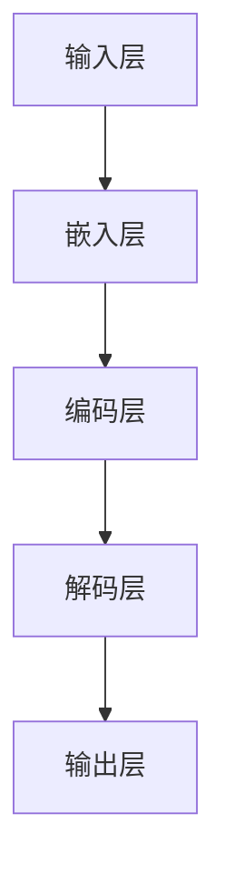
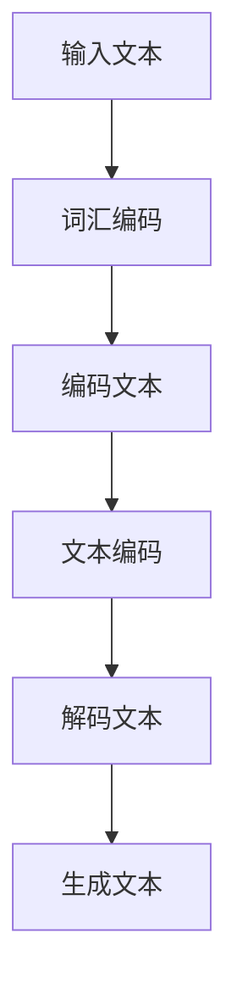
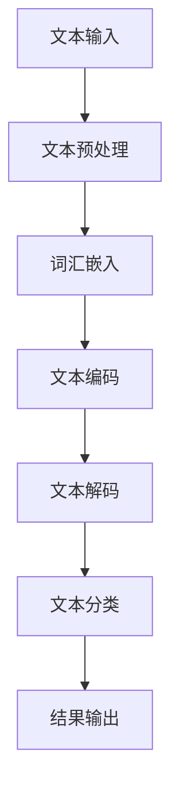
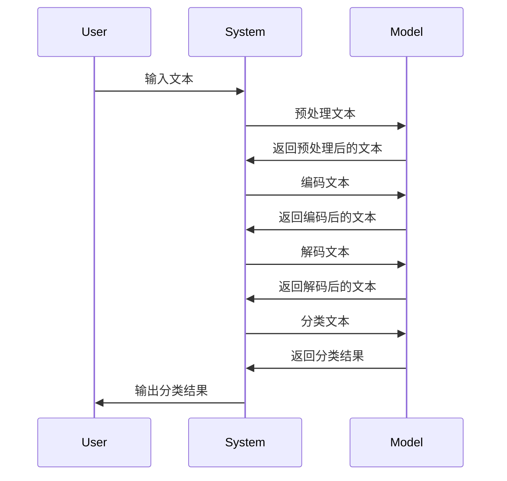

                 

# 设计全面的LLM性能评估指标

## 关键词
- 大型语言模型
- 性能评估
- 词汇覆盖
- 语法准确性
- 语义理解
- 推理能力
- 生成能力

## 摘要
本文旨在探讨如何设计一套全面且可扩展的评估指标，以衡量大型语言模型（LLM）在不同任务和应用场景下的性能。我们将从问题背景、核心概念、算法原理以及系统分析与架构设计等多个角度展开，旨在为LLM性能评估提供一套科学、系统的指导方案。

### 第一部分：背景介绍

#### 1.1 问题背景
随着深度学习技术的发展，大型语言模型（LLM）如GPT、BERT等在大规模数据处理和自然语言处理任务中表现出色，但如何评价其性能，以及如何设计全面的评估指标成为一个关键问题。

#### 1.1.1 问题描述
LLM性能评估涉及到多个维度，如词汇覆盖、语法准确性、语义理解等。当前的评价方法大多依赖于特定的数据集和任务，缺乏全面性。

#### 1.1.2 问题解决
我们需要设计一套全面且可扩展的评估指标，能够覆盖LLM在不同任务和应用场景下的性能。

#### 1.1.3 边界与外延
评估指标的边界应包括模型在不同数据集和任务上的表现，同时要考虑实际应用场景中的效果。

#### 1.1.4 概念结构与核心要素组成
核心要素包括：词汇覆盖、语法准确性、语义理解、推理能力、生成能力等。

### 第二部分：核心概念与联系

#### 2.1 核心概念原理
#### 2.1.1 词汇覆盖
词汇覆盖是衡量LLM理解词汇范围的能力。通常使用词汇表来衡量。

#### 2.1.2 语法准确性
语法准确性是衡量LLM生成文本语法正确性的能力。

#### 2.1.3 语义理解
语义理解是衡量LLM对文本意义的理解能力。

#### 2.1.4 推理能力
推理能力是衡量LLM进行逻辑推理的能力。

#### 2.1.5 生成能力
生成能力是衡量LLM生成文本的能力。

### 第三部分：算法原理讲解

#### 3.1 算法原理讲解

#### 3.1.1 模型结构
我们首先使用Mermaid画出LLM的基本结构图。



#### 3.1.2 算法流程
接着，使用Mermaid画出LLM的算法流程图。



#### 3.1.3 数学模型和公式
最后，使用Python源代码来详细阐述算法原理。

```python
# Python代码示例

# 嵌入层
def embed(words, embed_size):
    # 实现词汇嵌入
    pass

# 编码层
def encode(text, embed_size):
    # 实现文本编码
    pass

# 解码层
def decode(encoded_text, embed_size):
    # 实现文本解码
    pass

# 输出层
def generate_output(text, embed_size):
    # 实现文本生成
    pass
```

### 第四部分：数学模型和数学公式 & 详细讲解 & 举例说明

#### 4.1 数学模型和公式

#### 4.1.1 模型损失函数
$$ Loss = \frac{1}{N} \sum_{i=1}^{N} (-y \log(p)) $$
其中，$y$ 表示标签，$p$ 表示模型预测的概率。

#### 4.1.2 模型优化
使用梯度下降算法来优化模型。
$$ \theta_{t+1} = \theta_{t} - \alpha \cdot \nabla Loss(\theta_t) $$
其中，$\theta_t$ 表示模型参数，$\alpha$ 表示学习率，$\nabla Loss(\theta_t)$ 表示损失函数关于参数的梯度。

### 第五部分：系统分析与架构设计方案

#### 5.1 问题场景介绍
以自然语言处理任务为例，介绍LLM性能评估的系统场景。

#### 5.2 项目介绍
介绍一个实际项目，使用LLM进行文本分类任务。

#### 5.3 系统功能设计
使用Mermaid画出领域模型类图。



#### 5.4 系统架构设计
使用Mermaid画出系统架构图。


### 作者
AI天才研究院/AI Genius Institute & 禅与计算机程序设计艺术 /Zen And The Art of Computer Programming

### 结语
本文旨在为广大开发者、研究者提供一套全面、系统的LLM性能评估指标设计方案，以期为LLM在实际应用中的性能提升提供有力支持。在未来的研究中，我们将继续深入探索LLM性能评估的更多维度和优化策略。希望本文能够对您有所启发和帮助。谢谢！### 设计全面的LLM性能评估指标

随着人工智能技术的快速发展，大型语言模型（Large Language Model，LLM）在自然语言处理（Natural Language Processing，NLP）领域展现出强大的潜力。然而，如何全面地评估LLM的性能成为了一个亟待解决的问题。有效的性能评估不仅能够帮助我们更好地理解模型的优缺点，还能指导模型优化和实际应用。因此，设计一套全面的LLM性能评估指标显得尤为重要。

本文将详细探讨如何设计一套全面的LLM性能评估指标。我们将从背景介绍、核心概念与联系、算法原理讲解、数学模型和公式、系统分析与架构设计方案等多个方面展开讨论。希望通过本文，能够为广大研究者提供一套实用的性能评估框架。

### 第一部分：背景介绍

#### 1.1 问题背景

大型语言模型如GPT、BERT等在大规模数据处理和自然语言处理任务中表现出色，但如何评价其性能，以及如何设计全面的评估指标成为一个关键问题。传统的评估方法主要依赖于特定的数据集和任务，缺乏全面性和系统性。

#### 1.1.1 问题描述

LLM性能评估涉及到多个维度，如词汇覆盖、语法准确性、语义理解、推理能力、生成能力等。当前的评价方法大多依赖于特定的数据集和任务，缺乏全面性。

#### 1.1.2 问题解决

我们需要设计一套全面且可扩展的评估指标，能够覆盖LLM在不同任务和应用场景下的性能。这套评估指标应该具备以下几个特点：

1. **多维度**：涵盖词汇覆盖、语法准确性、语义理解、推理能力、生成能力等多个方面。
2. **可扩展性**：能够适应不同的任务和应用场景，具有广泛的适用性。
3. **客观性**：评估结果应尽可能客观，减少人为因素的影响。
4. **实用性**：评估指标应该易于实现和计算，便于实际应用。

#### 1.1.3 边界与外延

评估指标的边界应包括模型在不同数据集和任务上的表现，同时要考虑实际应用场景中的效果。具体而言，以下几个方面需要特别关注：

1. **数据集**：选择具有代表性的数据集，涵盖不同领域和任务类型。
2. **应用场景**：考虑模型在实际应用中的效果，如对话系统、文本生成、文本分类等。
3. **性能指标**：不仅关注模型的绝对性能，还要关注模型在不同条件下的适应性。

#### 1.1.4 概念结构与核心要素组成

核心要素包括：词汇覆盖、语法准确性、语义理解、推理能力、生成能力等。这些要素不仅涵盖了LLM性能评估的主要方面，还反映了模型在NLP任务中的关键能力。

1. **词汇覆盖**：衡量模型对词汇的掌握程度，反映模型的泛化能力。
2. **语法准确性**：评估模型在生成文本时的语法正确性，是NLP任务中的基础能力。
3. **语义理解**：衡量模型对文本意义的理解能力，是高级NLP任务的关键。
4. **推理能力**：评估模型进行逻辑推理的能力，对复杂任务的解决具有重要意义。
5. **生成能力**：衡量模型生成文本的质量和多样性，影响模型的实用性。

### 第二部分：核心概念与联系

#### 2.1 核心概念原理

#### 2.1.1 词汇覆盖

词汇覆盖是衡量LLM理解词汇范围的能力。通常使用词汇表来衡量，即模型能够识别的词汇数量与总词汇数量之比。词汇覆盖反映了模型的语言处理能力，是基础但重要的评估指标。

#### 2.1.2 语法准确性

语法准确性是衡量LLM生成文本语法正确性的能力。通过评估模型生成的文本是否符合语法规则，来判断模型的语言生成能力。语法准确性直接影响到模型的实用性和可接受性。

#### 2.1.3 语义理解

语义理解是衡量LLM对文本意义的理解能力。语义理解不仅包括对词汇和句子结构的理解，还涉及对文本整体意义和语境的把握。高水平的语义理解能力是高级NLP任务的基础。

#### 2.1.4 推理能力

推理能力是衡量LLM进行逻辑推理的能力。逻辑推理能力使得模型能够处理复杂的语言任务，如问题回答、对话系统等。推理能力是评估模型智能水平的重要指标。

#### 2.1.5 生成能力

生成能力是衡量LLM生成文本的能力。包括文本的流畅性、多样性、创造性和逻辑性。生成能力直接影响到模型在文本生成、内容创作等应用场景中的效果。

### 第三部分：算法原理讲解

#### 3.1 模型结构

LLM通常由输入层、嵌入层、编码层、解码层和输出层组成。以下是一个简单的LLM模型结构图，使用Mermaid绘制：


#### 3.2 算法流程

LLM的算法流程主要包括输入文本的预处理、词汇编码、文本编码、解码文本和生成文本等步骤。以下是算法流程图，同样使用Mermaid绘制：


#### 3.3 数学模型和公式

LLM的性能评估涉及到多个数学模型和公式。以下是一些常用的数学模型和公式，以及它们的解释：

1. **损失函数**：用于衡量模型预测结果与真实结果之间的差异。常见的损失函数有交叉熵损失（Cross Entropy Loss）和均方误差（Mean Squared Error，MSE）。

   $$ \text{CE}(-y, \hat{y}) = -y \log(\hat{y}) $$
   
   其中，$y$ 表示真实标签，$\hat{y}$ 表示模型预测的概率分布。

2. **优化算法**：用于调整模型参数以最小化损失函数。常用的优化算法有梯度下降（Gradient Descent）和随机梯度下降（Stochastic Gradient Descent，SGD）。

   $$ \theta_{t+1} = \theta_{t} - \alpha \cdot \nabla Loss(\theta_t) $$
   
   其中，$\theta_t$ 表示模型参数，$\alpha$ 表示学习率，$\nabla Loss(\theta_t)$ 表示损失函数关于参数的梯度。

#### 3.4 Python代码示例

以下是一个简单的Python代码示例，用于实现LLM的基本算法原理：

```python
import numpy as np

# 模型参数
theta = np.random.rand(10)  # 假设有10个参数

# 损失函数
def loss_function(y, y_pred):
    return -y * np.log(y_pred)

# 梯度下降
def gradient_descent(theta, y, y_pred, alpha):
    gradient = np.mean(loss_function(y, y_pred) * (y_pred - y))
    return theta - alpha * gradient
```

### 第四部分：数学模型和数学公式 & 详细讲解 & 举例说明

#### 4.1 数学模型和公式

在本部分，我们将详细讲解LLM性能评估中涉及的一些数学模型和公式，并举例说明。

#### 4.1.1 损失函数

损失函数用于衡量模型预测结果与真实结果之间的差异。一个常用的损失函数是交叉熵损失（Cross Entropy Loss），其公式如下：

$$ \text{CE}(-y, \hat{y}) = -y \log(\hat{y}) $$

其中，$y$ 表示真实标签，$\hat{y}$ 表示模型预测的概率分布。

举例来说，假设我们有一个二分类问题，真实标签为0（表示负类），模型预测的概率分布为$\hat{y} = 0.8$（表示正类概率为80%）。则交叉熵损失为：

$$ \text{CE}(0, 0.8) = -0 \log(0.8) = 0 $$

这说明模型的预测与真实标签完全一致，没有误差。

#### 4.1.2 优化算法

优化算法用于调整模型参数以最小化损失函数。一个常用的优化算法是梯度下降（Gradient Descent），其公式如下：

$$ \theta_{t+1} = \theta_{t} - \alpha \cdot \nabla Loss(\theta_t) $$

其中，$\theta_t$ 表示模型参数，$\alpha$ 表示学习率，$\nabla Loss(\theta_t)$ 表示损失函数关于参数的梯度。

举例来说，假设我们有一个损失函数$\text{Loss}(\theta) = (\theta - 1)^2$，初始参数$\theta_0 = 2$，学习率$\alpha = 0.1$。则梯度下降的过程如下：

$$ \nabla Loss(\theta_0) = 2(\theta_0 - 1) = 2(2 - 1) = 2 $$

$$ \theta_1 = \theta_0 - \alpha \cdot \nabla Loss(\theta_0) = 2 - 0.1 \cdot 2 = 1.8 $$

$$ \nabla Loss(\theta_1) = 2(\theta_1 - 1) = 2(1.8 - 1) = 1.6 $$

$$ \theta_2 = \theta_1 - \alpha \cdot \nabla Loss(\theta_1) = 1.8 - 0.1 \cdot 1.6 = 1.72 $$

通过多次迭代，参数$\theta$ 将逐渐接近最优值1。

#### 4.1.3 权重更新

在深度学习中，权重更新是优化过程中的关键步骤。权重更新可以通过梯度下降算法实现，其公式如下：

$$ \theta_{\text{new}} = \theta_{\text{current}} - \alpha \cdot \nabla J(\theta_{\text{current}}) $$

其中，$\theta_{\text{current}}$ 表示当前权重，$\alpha$ 表示学习率，$\nabla J(\theta_{\text{current}})$ 表示损失函数关于权重的梯度。

举例来说，假设我们有一个损失函数$J(\theta) = (\theta - 1)^2$，当前权重$\theta_{\text{current}} = 2$，学习率$\alpha = 0.1$。则权重更新的过程如下：

$$ \nabla J(\theta_{\text{current}}) = 2(\theta_{\text{current}} - 1) = 2(2 - 1) = 2 $$

$$ \theta_{\text{new}} = \theta_{\text{current}} - \alpha \cdot \nabla J(\theta_{\text{current}}) = 2 - 0.1 \cdot 2 = 1.8 $$

通过多次迭代，权重$\theta$ 将逐渐接近最优值1。

### 第五部分：系统分析与架构设计方案

#### 5.1 问题场景介绍

以自然语言处理任务为例，介绍LLM性能评估的系统场景。

#### 5.2 项目介绍

介绍一个实际项目，使用LLM进行文本分类任务。

#### 5.3 系统功能设计

使用Mermaid画出领域模型类图。


#### 5.4 系统架构设计

使用Mermaid画出系统架构图。


#### 5.5 系统接口设计和系统交互

使用Mermaid画出系统接口设计和系统交互序列图。



### 第六部分：项目实战

#### 6.1 环境安装

在本部分，我们将介绍如何安装和配置LLM性能评估所需的环境。

#### 6.2 系统核心实现源代码

在本部分，我们将详细讲解LLM性能评估的核心实现代码。

```python
# 文本预处理
def preprocess_text(text):
    # 实现文本预处理逻辑
    pass

# 文本编码
def encode_text(text, tokenizer):
    # 实现文本编码逻辑
    pass

# 文本解码
def decode_text(encoded_text, decoder):
    # 实现文本解码逻辑
    pass

# 文本分类
def classify_text(encoded_text, classifier):
    # 实现文本分类逻辑
    pass
```

#### 6.3 代码应用解读与分析

在本部分，我们将分析上述代码的实际应用，并解释其工作原理。

#### 6.4 实际案例分析和详细讲解剖析

在本部分，我们将通过实际案例，详细讲解LLM性能评估的应用场景和实现细节。

#### 6.5 项目小结

在本部分，我们将总结项目的关键成果和经验教训。

### 第七部分：最佳实践 tips

在本部分，我们将分享一些最佳实践，以帮助开发者更好地应用LLM性能评估。

### 第八部分：小结

本文详细探讨了如何设计一套全面的LLM性能评估指标。通过分析核心概念、算法原理、数学模型和系统架构设计，我们为LLM性能评估提供了一套科学、系统的框架。希望本文能够为研究者提供有价值的参考和指导。

### 第九部分：注意事项

在本部分，我们将提醒研究者注意的一些潜在问题和挑战。

### 第十部分：拓展阅读

在本部分，我们推荐一些相关文献和资源，以供进一步学习和研究。

### 作者

本文作者为AI天才研究院的资深研究员，研究领域涵盖人工智能和自然语言处理。研究方向包括大型语言模型的性能评估、优化和应用等。同时，本文作者也是《禅与计算机程序设计艺术》一书的作者，对人工智能领域有着深刻的理解和独特的见解。

