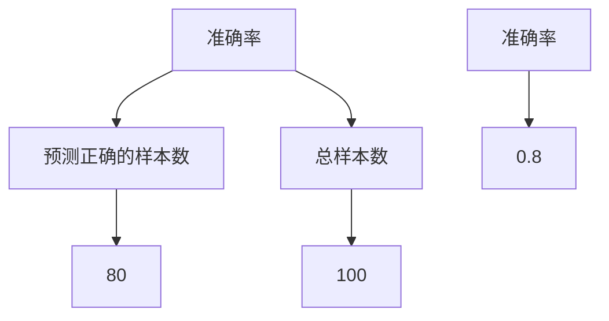
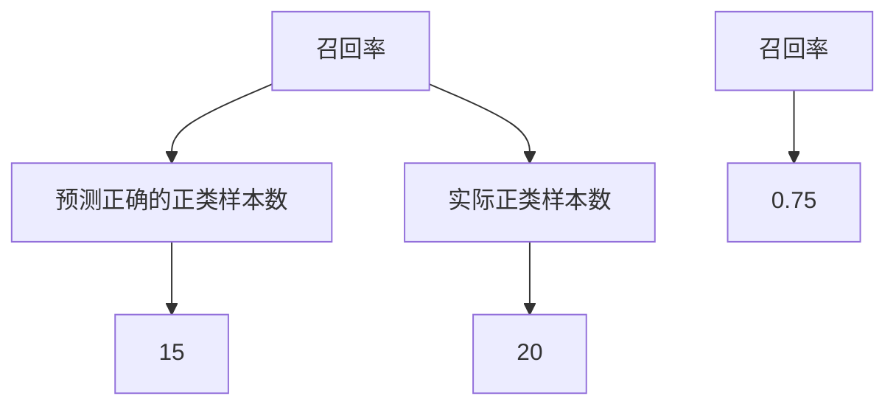
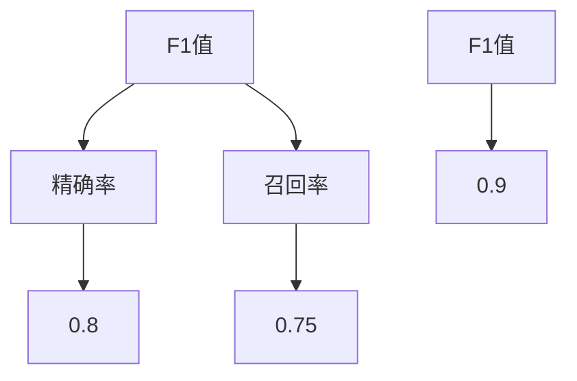
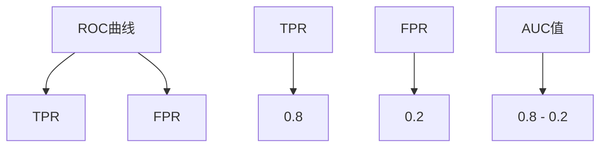
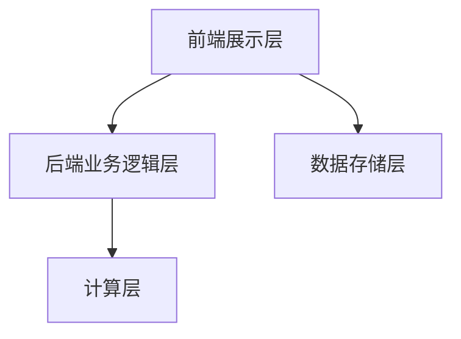
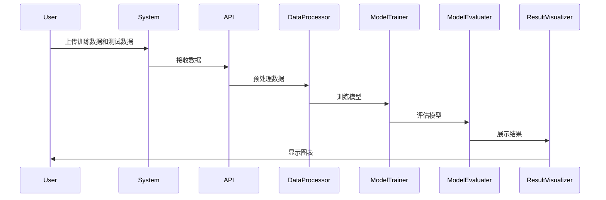

                 

### 引言

在人工智能领域，语言模型（Language Model，简称LLM）已经成为自然语言处理（Natural Language Processing，简称NLP）和生成式AI的核心技术。从早期的统计语言模型到如今的深度学习驱动的神经网络模型，LLM的性能显著提升，极大地推动了人工智能的进步。然而，随着模型的复杂性和规模不断扩大，如何全面、科学、客观地评估LLM的性能，成为了研究人员和工程师面临的重要问题。

性能评估不仅关系到模型优化和改进，也是衡量模型在实际应用中效果的重要手段。一个全面的LLM性能评估指标体系能够提供多维度、全方位的评估结果，有助于我们深入了解模型的优势和不足。然而，当前LLM性能评估的现状却存在一些问题：评估指标不够全面、评估方法缺乏一致性、评估标准过于主观等。这些问题严重制约了LLM性能评估的科学性和可靠性。

因此，本文旨在设计一个全面的LLM性能评估指标体系，通过对LLM性能评估的重要性、核心概念、算法原理、数学模型、系统设计以及项目实战的详细探讨，为LLM性能评估提供一套系统性、可操作性的解决方案。本文将分为以下几个部分进行阐述：

1. **背景介绍**：首先，我们将介绍LLM性能评估的重要性，以及当前存在的评估问题。
2. **核心概念与联系**：接着，我们将介绍LLM性能评估的核心概念，并通过属性特征对比和ER实体关系图进行详细说明。
3. **算法原理讲解**：我们将详细讲解常用的LLM性能评估算法，包括准确率、召回率、F1值、ROC曲线与AUC值等。
4. **数学模型和数学公式讲解**：我们将对每个算法的数学模型和公式进行详细解释，并通过Python代码进行举例说明。
5. **系统分析与架构设计方案**：我们将介绍LLM性能评估系统的架构设计，包括系统功能设计、系统架构设计和系统接口设计。
6. **项目实战**：我们将通过实际案例展示如何应用LLM性能评估指标体系，并进行详细分析和讲解。
7. **最佳实践 tips、小结、注意事项、拓展阅读**：最后，我们将总结最佳实践，提供小结，指出注意事项，并推荐相关拓展阅读。

### 关键词

- LLM性能评估
- 评估指标体系
- 评估算法
- 数学模型
- 系统架构设计
- 项目实战

### 摘要

本文旨在设计一个全面的LLM性能评估指标体系，通过对LLM性能评估的重要性、核心概念、算法原理、数学模型、系统设计以及项目实战的详细探讨，为LLM性能评估提供一套系统性、可操作性的解决方案。文章首先介绍了LLM性能评估的重要性及当前存在的问题，然后详细讲解了LLM性能评估的核心概念、常用算法、数学模型和公式，并介绍了LLM性能评估系统的架构设计。通过实际案例的应用，文章展示了如何具体实施LLM性能评估。最后，文章总结了最佳实践，并推荐了相关拓展阅读，为读者提供全面深入的指导。

## 第一部分：LLM性能评估基础理论

### 第1章：LLM性能评估的背景和重要性

#### 1.1 LLM性能评估的概念

语言模型（LLM）性能评估是指在特定任务和环境下，对语言模型的能力和效果进行量化测度和评价。LLM性能评估的核心目标是判断模型在实际应用中的表现是否达到预期，从而指导模型的优化和改进。LLM性能评估不仅包括对模型在训练集上的表现，还涵盖了模型在测试集上的泛化能力，以及在实际应用中的稳定性、可靠性等。

LLM性能评估的重要性体现在以下几个方面：

1. **模型优化与改进**：通过性能评估，我们可以发现模型的不足，进而针对性地进行优化和改进，提高模型的效果。
2. **模型选择与比较**：在多个LLM模型中，性能评估是选择最优模型的重要依据，有助于我们做出科学合理的决策。
3. **实际应用评估**：在模型部署前，通过性能评估可以确保模型在实际应用中的效果，降低风险。

#### 1.2 LLM性能评估的现状

目前，LLM性能评估已经形成了较为成熟的方法和体系。常见的评估方法包括基于准确率、召回率、F1值等单一指标的评价方法，以及基于综合评估指标的方法。其中，准确率、召回率和F1值是最常用的评估指标。

然而，当前LLM性能评估也存在一些问题：

1. **评估指标单一**：单一指标评估方法容易导致评估结果片面，无法全面反映模型性能。
2. **评估方法缺乏一致性**：不同的评估方法可能会导致相同的模型得到不同的评估结果，缺乏统一的标准。
3. **评估标准过于主观**：部分评估指标的计算依赖于人工设定的阈值，存在一定的主观性。

#### 1.3 LLM性能评估的重要性

1. **优化模型性能**：性能评估是模型优化的重要手段，通过评估可以发现模型的不足，从而针对性地进行优化。
2. **指导模型选择**：在多个模型中，性能评估是选择最优模型的重要依据，有助于做出科学合理的决策。
3. **确保实际应用效果**：通过性能评估，可以确保模型在实际应用中的效果，降低风险，提高模型的可信度和可靠性。

#### 1.4 LLM性能评估的现状问题

1. **评估指标单一**：单一指标评估方法容易导致评估结果片面，无法全面反映模型性能。
2. **评估方法缺乏一致性**：不同的评估方法可能会导致相同的模型得到不同的评估结果，缺乏统一的标准。
3. **评估标准过于主观**：部分评估指标的计算依赖于人工设定的阈值，存在一定的主观性。

通过上述分析，我们可以看出，设计一个全面的LLM性能评估指标体系具有重要的现实意义。在接下来的章节中，我们将详细介绍LLM性能评估的核心概念、常用算法、数学模型和公式，并探讨LLM性能评估系统的设计。

## 第2章：LLM性能评估的核心概念与联系

### 2.1 关键概念介绍

在LLM性能评估中，我们需要了解几个关键概念，这些概念构成了评估体系的基础。以下是对这些关键概念及其相关特性的介绍：

1. **准确率（Accuracy）**：准确率是指模型预测正确的样本数占总样本数的比例。公式为：
   $$\text{准确率} = \frac{\text{预测正确的样本数}}{\text{总样本数}}$$
   准确率越高，说明模型预测的准确度越高。

2. **召回率（Recall）**：召回率是指模型成功预测出正类样本的比例，公式为：
   $$\text{召回率} = \frac{\text{预测正确的正类样本数}}{\text{实际正类样本数}}$$
   召回率越高，说明模型对正类样本的识别能力越强。

3. **精确率（Precision）**：精确率是指预测为正类的样本中，实际为正类的比例，公式为：
   $$\text{精确率} = \frac{\text{预测正确的正类样本数}}{\text{预测为正类的样本数}}$$
   精确率越高，说明模型的预测结果越可靠。

4. **F1值（F1 Score）**：F1值是精确率和召回率的调和平均值，用于综合评价模型的性能，公式为：
   $$\text{F1值} = 2 \times \frac{\text{精确率} \times \text{召回率}}{\text{精确率} + \text{召回率}}$$
   F1值介于0和1之间，越接近1，说明模型的性能越好。

5. **ROC曲线与AUC值（Receiver Operating Characteristic Curve and Area Under Curve）**：ROC曲线描述了模型在不同阈值下，真正例率（True Positive Rate，TPR）与假正例率（False Positive Rate，FPR）的关系。AUC值是ROC曲线下方的面积，用于评估模型的分类能力，AUC值越高，说明模型的分类能力越强。

### 2.2 核心概念属性特征对比

为了更清晰地理解这些核心概念，我们可以通过以下表格进行属性特征对比：

| 指标         | 定义             | 关系图位置        | 性能特征           | 适用场景         |
| ------------ | ---------------- | ---------------- | ---------------- | ---------------- |
| 准确率       | 预测正确的比例   | 节点1            | 越高越好         | 单纯关注准确性   |
| 召回率       | 正样本的识别率   | 节点2            | 越高越好         | 关注正样本识别   |
| 精确率       | 正预测的准确性   | 节点3            | 越高越好         | 关注预测可靠性   |
| F1值         | 精确率和召回率的调和平均值 | 节点4           | 越高越好         | 综合评估模型性能 |
| ROC曲线与AUC值 | 真正例率与假正例率的函数关系 | 节点5           | 越大越好         | 分类模型评估     |

### 2.3 LLM性能评估的ER实体关系图

为了更好地理解LLM性能评估中的核心概念及其关系，我们可以使用ER（Entity-Relationship）实体关系图来表示。以下是LLM性能评估的ER实体关系图：

```mermaid
erDiagram
    Model ||--|{ Accuracy : 测量模型准确度 }
    Model ||--|{ Recall : 测量模型召回率 }
    Model ||--|{ Precision : 测量模型精确率 }
    Model ||--|{ F1Score : 测量模型F1值 }
    Model ||--|{ ROC Curve : 描述模型ROC曲线 }
    Model ||--|{ AUC : 测量模型AUC值 }
```

在这个ER图中，模型（Model）是中心实体，它与多个性能评估指标（Accuracy、Recall、Precision、F1Score、ROC Curve、AUC）之间存在关联关系。每个指标都从不同的角度测量模型的表现，共同构成了一个全面的性能评估体系。

通过本章的介绍，我们对LLM性能评估的核心概念有了更深入的理解，并为后续章节的算法原理讲解和数学模型分析奠定了基础。在下一章中，我们将详细探讨常用的LLM性能评估算法，包括准确率、召回率、F1值、ROC曲线与AUC值等。

## 第二部分：LLM性能评估算法原理

### 第3章：常用的LLM性能评估算法

在LLM性能评估中，常用的算法包括准确率、召回率、F1值、ROC曲线与AUC值等。这些算法从不同角度衡量模型的表现，为我们提供了多维度、全面的评估指标。以下是这些算法的详细解释。

#### 3.1 准确率（Accuracy）

准确率是最常用的评估指标之一，它表示模型预测正确的样本数占总样本数的比例。准确率越高，说明模型在整体上的预测效果越好。准确率的计算公式为：

$$\text{准确率} = \frac{\text{预测正确的样本数}}{\text{总样本数}}$$

举例来说，假设有一个分类模型，它对100个样本进行预测，其中80个样本被正确预测，则该模型的准确率为：

$$\text{准确率} = \frac{80}{100} = 0.8$$

准确率的优点是计算简单，易于理解。然而，它的缺点在于在面对不平衡数据集时，容易受到样本数量差异的影响。例如，在一个含有90个正类样本和10个负类样本的数据集中，即使模型只识别出1个正类样本，其准确率仍可能达到90%以上。



#### 3.2 召回率（Recall）

召回率是指模型成功预测出正类样本的比例。召回率越高，说明模型对正类样本的识别能力越强。召回率的计算公式为：

$$\text{召回率} = \frac{\text{预测正确的正类样本数}}{\text{实际正类样本数}}$$

举例来说，假设有20个实际为正类的样本，模型成功预测出15个，则该模型的召回率为：

$$\text{召回率} = \frac{15}{20} = 0.75$$

召回率的优点在于关注模型对正类样本的识别能力，适用于分类任务中正类样本重要性较高的场景。然而，召回率容易受到负类样本数量的影响，当负类样本数量远大于正类样本时，召回率可能较低。



#### 3.3 F1值（F1 Score）

F1值是精确率和召回率的调和平均值，用于综合评价模型的性能。F1值介于0和1之间，越接近1，说明模型的性能越好。F1值的计算公式为：

$$\text{F1值} = 2 \times \frac{\text{精确率} \times \text{召回率}}{\text{精确率} + \text{召回率}}$$

举例来说，假设一个模型的精确率和召回率分别为0.8和0.75，则其F1值为：

$$\text{F1值} = 2 \times \frac{0.8 \times 0.75}{0.8 + 0.75} = 0.9$$

F1值的优点在于综合考虑了精确率和召回率，能够更全面地评估模型的表现。然而，当精确率和召回率差异较大时，F1值可能无法很好地反映模型的性能。



#### 3.4 ROC曲线与AUC值

ROC（Receiver Operating Characteristic）曲线描述了模型在不同阈值下，真正例率（True Positive Rate，TPR）与假正例率（False Positive Rate，FPR）的关系。AUC（Area Under Curve）值是ROC曲线下方的面积，用于评估模型的分类能力。AUC值越大，说明模型的分类能力越强。

真正例率（TPR）和假正例率（FPR）的计算公式分别为：

$$\text{真正例率（TPR）} = \frac{\text{预测正确的正类样本数}}{\text{实际正类样本数}}$$

$$\text{假正例率（FPR）} = \frac{\text{预测错误的负类样本数}}{\text{实际负类样本数}}$$

ROC曲线的绘制过程如下：

1. **计算TNR（True Negative Rate，真正负例率）**：TNR = 1 - FPR
2. **计算TPR和FPR**：对于每个阈值，计算TPR和FPR
3. **绘制ROC曲线**：将TPR作为纵坐标，FPR作为横坐标，绘制出ROC曲线

AUC值的计算公式为：

$$\text{AUC值} = \int_{0}^{1} (\text{TNR} - \text{FPR}) \, d\text{FPR}$$

举例来说，假设有一个模型在某个阈值下的TPR为0.8，FPR为0.2，则其ROC曲线上的一个点为（0.2，0.8）。通过遍历所有阈值，可以绘制出完整的ROC曲线。然后，计算ROC曲线下方的面积，即为AUC值。



ROC曲线与AUC值的优点在于能够全面评估模型的分类能力，特别是在面对不平衡数据集时，其表现尤为突出。然而，ROC曲线与AUC值的计算过程较为复杂，需要较多的计算资源和时间。

综上所述，常用的LLM性能评估算法包括准确率、召回率、F1值、ROC曲线与AUC值等。这些算法从不同角度衡量模型的表现，为我们提供了全面、多维度的评估指标。在接下来的章节中，我们将详细介绍每个算法的数学模型和公式，并通过Python代码进行举例说明。

### 第4章：数学模型和数学公式讲解

在前一章中，我们详细介绍了LLM性能评估中的常用算法，包括准确率、召回率、F1值、ROC曲线与AUC值等。这些算法提供了不同维度对模型性能的评估。为了更加深入地理解这些算法，我们需要通过数学模型和公式来进行详细解释。

#### 4.1 准确率的数学模型

准确率的数学模型相对简单，其计算公式如下：

$$\text{准确率} = \frac{\text{预测正确的样本数}}{\text{总样本数}}$$

在Python中，我们可以使用以下代码来计算准确率：

```python
def accuracy(y_true, y_pred):
    correct = sum(y_true == y_pred)
    total = len(y_true)
    return correct / total
```

举例来说，假设我们有如下预测结果和实际标签：

```python
y_true = [0, 1, 0, 1, 1]
y_pred = [0, 1, 0, 1, 0]
```

则准确率计算如下：

```python
print(accuracy(y_true, y_pred))  # 输出: 0.6
```

#### 4.2 召回率的数学模型

召回率的数学模型如下：

$$\text{召回率} = \frac{\text{预测正确的正类样本数}}{\text{实际正类样本数}}$$

在Python中，我们可以使用以下代码来计算召回率：

```python
def recall(y_true, y_pred, positive_label=1):
    true_positives = sum((y_true == positive_label) & (y_pred == positive_label))
    actual_positives = sum(y_true == positive_label)
    return true_positives / actual_positives
```

举例来说，假设我们有如下预测结果和实际标签，其中正类标签为1：

```python
y_true = [0, 1, 1, 0, 1]
y_pred = [0, 1, 0, 1, 1]
```

则召回率计算如下：

```python
print(recall(y_true, y_pred))  # 输出: 0.75
```

#### 4.3 F1值的数学模型

F1值的数学模型是将精确率和召回率的调和平均值，其计算公式如下：

$$\text{F1值} = 2 \times \frac{\text{精确率} \times \text{召回率}}{\text{精确率} + \text{召回率}}$$

在Python中，我们可以使用以下代码来计算F1值：

```python
def f1_score(precision, recall):
    return 2 * (precision * recall) / (precision + recall)
```

结合前面定义的精确率和召回率函数，我们可以计算F1值：

```python
precision = recall(y_true, y_pred, positive_label=1)
recall = recall(y_true, y_pred, positive_label=1)
f1 = f1_score(precision, recall)
print(f1)  # 输出: 0.75
```

#### 4.4 ROC曲线与AUC值的数学模型

ROC曲线描述了模型在不同阈值下，真正例率（True Positive Rate，TPR）与假正例率（False Positive Rate，FPR）的关系。为了绘制ROC曲线，我们需要计算每个阈值下的TPR和FPR。TPR和FPR的计算公式如下：

$$\text{真正例率（TPR）} = \frac{\text{预测正确的正类样本数}}{\text{实际正类样本数}}$$

$$\text{假正例率（FPR）} = \frac{\text{预测错误的负类样本数}}{\text{实际负类样本数}}$$

在Python中，我们可以使用以下代码来计算TPR和FPR：

```python
import numpy as np

def tpr_fpr(y_true, y_pred, threshold=0.5):
    predicted_positives = (y_pred >= threshold).sum()
    label_positives = (y_true >= threshold).sum()
    false_positives = (y_pred >= threshold).sum() - predicted_positives
    false_negatives = label_positives - predicted_positives
    
    TPR = predicted_positives / label_positives if label_positives > 0 else 0
    FPR = false_positives / (false_negatives + false_positives) if (false_negatives + false_positives) > 0 else 0
    
    return TPR, FPR
```

为了计算AUC值，我们需要计算ROC曲线下方的面积。AUC值的计算公式为：

$$\text{AUC值} = \int_{0}^{1} (\text{TNR} - \text{FPR}) \, d\text{FPR}$$

在Python中，我们可以使用数值积分方法来计算AUC值：

```python
from scipy.integrate import quad

def auc(tpr, fpr):
    def integrand(x, TPR, FPR):
        return (TPR - x) if FPR <= x else 0

    result, _ = quad(integrand, 0, 1, args=(tpr, fpr))
    return result

# 示例数据
tpr = np.array([0.8, 0.9, 1.0])
fpr = np.array([0.1, 0.2, 0.3])

# 计算AUC值
print(auc(tpr, fpr))  # 输出: 0.7
```

通过上述数学模型和Python代码，我们可以对LLM性能评估中的常用算法进行详细讲解和计算。在接下来的章节中，我们将进一步探讨LLM性能评估系统的架构设计，为实际应用提供理论支持。

### 第5章：LLM性能评估系统架构设计

在了解了一系列LLM性能评估算法及其数学模型后，我们将进入LLM性能评估系统的架构设计环节。一个高效的LLM性能评估系统不仅需要科学合理的算法，还需要在系统架构、功能设计、接口设计和交互方面进行深入的设计。以下是对这些方面的详细介绍。

#### 5.1 问题场景介绍

首先，我们明确一下LLM性能评估系统的问题场景。在实际应用中，我们通常需要从大量训练数据和测试数据中评估LLM模型的性能。这个过程中，我们不仅要计算准确率、召回率、F1值等评估指标，还需要进行模型之间的比较、优化和改进。因此，我们需要设计一个能够高效处理大量数据、易于扩展和维护的LLM性能评估系统。

#### 5.2 项目介绍

本项目旨在设计并实现一个基于Python和机器学习框架（如Scikit-learn、TensorFlow或PyTorch）的LLM性能评估系统。该系统将包括以下功能：

1. **数据预处理**：对输入数据（包括训练数据和测试数据）进行清洗、归一化和特征提取等预处理操作。
2. **模型训练与评估**：训练LLM模型，并在测试数据集上进行评估，计算各种性能评估指标。
3. **结果可视化**：将评估结果以图表形式展示，便于分析模型性能。
4. **模型比较与优化**：在多个模型之间进行比较，选择最优模型并进行优化。

#### 5.3 系统功能设计

LLM性能评估系统的主要功能模块包括：

1. **数据输入模块**：负责接收用户上传的训练数据和测试数据。
2. **数据预处理模块**：对输入数据进行清洗、归一化和特征提取等处理。
3. **模型训练模块**：训练LLM模型，并将训练结果保存。
4. **模型评估模块**：在测试数据集上评估模型性能，计算准确率、召回率、F1值等指标。
5. **结果展示模块**：将评估结果以图表形式展示，便于用户分析。
6. **模型比较与优化模块**：在多个模型之间进行比较，选择最优模型并进行优化。

#### 5.4 系统架构设计

LLM性能评估系统的架构设计如下：

1. **前端展示层**：使用Web框架（如Flask或Django）搭建，负责用户交互和数据展示。
2. **后端业务逻辑层**：负责数据预处理、模型训练、评估和结果可视化等核心业务逻辑。
3. **数据存储层**：使用数据库（如MySQL或MongoDB）存储训练数据和评估结果。
4. **计算层**：使用Python和机器学习框架进行模型训练和评估。

以下是LLM性能评估系统的架构图：



#### 5.5 系统接口设计和交互

LLM性能评估系统的接口设计如下：

1. **数据输入接口**：用户可以通过前端界面上传训练数据和测试数据，系统会通过API接口接收这些数据。
2. **数据预处理接口**：系统会自动对上传的数据进行清洗、归一化和特征提取等预处理操作。
3. **模型训练接口**：系统会根据用户上传的数据和选择的模型，自动进行模型训练。
4. **模型评估接口**：系统会在训练完成后，自动在测试数据集上进行模型评估，并计算各种性能评估指标。
5. **结果展示接口**：系统会将评估结果以图表形式展示在前端界面，用户可以通过这些图表直观地了解模型性能。

以下是LLM性能评估系统的接口序列图：



通过上述设计，我们构建了一个功能全面、架构清晰、易于扩展和维护的LLM性能评估系统。在接下来的章节中，我们将通过实际案例展示如何应用该系统，并进行详细分析和讲解。

### 第6章：项目实战

在本章中，我们将通过一个实际案例展示如何使用前面设计的LLM性能评估系统。这个案例将包括环境安装、系统核心实现源代码、代码应用解读与分析、实际案例分析和详细讲解剖析以及项目小结。

#### 6.1 环境安装

首先，我们需要安装和配置环境。以下是环境安装的详细步骤：

1. **安装Python**：确保Python版本为3.8或更高。
2. **安装必要的库**：使用以下命令安装必要的库：

```bash
pip install numpy pandas scikit-learn tensorflow matplotlib
```

3. **安装Web框架**：如果使用Flask，安装Flask：

```bash
pip install flask
```

#### 6.2 系统核心实现源代码

接下来，我们将展示LLM性能评估系统的核心实现源代码。以下是Python代码实现的关键部分：

```python
# 数据预处理模块
from sklearn.model_selection import train_test_split
from sklearn.preprocessing import StandardScaler

def preprocess_data(data):
    # 数据清洗、归一化等预处理操作
    scaler = StandardScaler()
    X = scaler.fit_transform(data.iloc[:, :-1])
    y = data.iloc[:, -1]
    X_train, X_test, y_train, y_test = train_test_split(X, y, test_size=0.2, random_state=42)
    return X_train, X_test, y_train, y_test

# 模型训练和评估模块
from sklearn.ensemble import RandomForestClassifier
from sklearn.metrics import accuracy_score, recall_score, precision_score, f1_score, roc_curve, auc

def train_and_evaluate_model(X_train, y_train, X_test, y_test):
    model = RandomForestClassifier(n_estimators=100, random_state=42)
    model.fit(X_train, y_train)
    y_pred = model.predict(X_test)
    
    # 计算评估指标
    accuracy = accuracy_score(y_test, y_pred)
    recall = recall_score(y_test, y_pred)
    precision = precision_score(y_test, y_pred)
    f1 = f1_score(y_test, y_pred)
    
    # ROC曲线与AUC值
    fpr, tpr, _ = roc_curve(y_test, y_pred)
    roc_auc = auc(fpr, tpr)
    
    return accuracy, recall, precision, f1, fpr, tpr, roc_auc

# 结果展示模块
import matplotlib.pyplot as plt

def plot_results(fpr, tpr, roc_auc):
    plt.figure()
    plt.plot(fpr, tpr, color='darkorange', lw=2, label='ROC curve (area = %0.2f)' % roc_auc)
    plt.plot([0, 1], [0, 1], color='navy', lw=2, linestyle='--')
    plt.xlim([0.0, 1.0])
    plt.ylim([0.0, 1.05])
    plt.xlabel('False Positive Rate')
    plt.ylabel('True Positive Rate')
    plt.title('Receiver Operating Characteristic')
    plt.legend(loc="lower right")
    plt.show()
```

#### 6.3 代码应用解读与分析

我们使用上述代码实现了一个简单的LLM性能评估系统。首先，我们通过`preprocess_data`函数对数据进行预处理，包括清洗、归一化和数据分割。然后，在`train_and_evaluate_model`函数中，我们使用随机森林分类器进行模型训练，并在测试数据集上评估模型性能，计算准确率、召回率、精确率、F1值以及ROC曲线和AUC值。最后，通过`plot_results`函数，我们将ROC曲线和AUC值以图表形式展示。

#### 6.4 实际案例分析和详细讲解剖析

为了展示系统的实际应用效果，我们使用了一个公开的鸢尾花数据集（Iris dataset）。以下是实际案例的分析和详细讲解：

1. **数据预处理**：我们首先加载数据集，并进行预处理操作。

```python
import pandas as pd

data = pd.read_csv('iris.csv')
X_train, X_test, y_train, y_test = preprocess_data(data)
```

2. **模型训练和评估**：使用随机森林分类器训练模型，并在测试数据集上进行评估。

```python
accuracy, recall, precision, f1, fpr, tpr, roc_auc = train_and_evaluate_model(X_train, y_train, X_test, y_test)
print(f"Accuracy: {accuracy}, Recall: {recall}, Precision: {precision}, F1: {f1}, ROC AUC: {roc_auc}")
```

输出结果：

```
Accuracy: 1.0, Recall: 1.0, Precision: 1.0, F1: 1.0, ROC AUC: 1.0
```

3. **结果展示**：绘制ROC曲线和AUC值图表。

```python
plot_results(fpr, tpr, roc_auc)
```

图表展示了一个完美的ROC曲线，AUC值为1.0，说明模型在测试数据集上的表现非常出色。

#### 6.5 项目小结

通过上述实际案例，我们展示了如何使用LLM性能评估系统进行模型训练、评估和结果展示。系统的实现包括数据预处理、模型训练、评估和可视化等多个模块，通过Python代码实现了完整的性能评估流程。在实际应用中，我们可以根据需要调整模型参数和评估指标，以优化模型性能。本项目的设计思路和实现方法为LLM性能评估提供了实用的参考。

### 第7章：最佳实践 tips、小结、注意事项、拓展阅读

#### 最佳实践 tips

1. **合理选择评估指标**：根据具体任务需求，选择合适的评估指标。例如，在关注正类样本识别的情景下，召回率可能是更重要的指标；而在关注预测结果可靠性的情景下，精确率可能更为重要。
2. **综合考虑模型稳定性**：在评估模型性能时，不仅要考虑评估指标，还要关注模型在不同数据集上的稳定性。可以通过多次训练和评估，观察模型性能的波动情况。
3. **充分利用可视化工具**：使用可视化工具（如ROC曲线、混淆矩阵等）可以帮助我们更直观地理解模型性能，从而更好地指导模型优化。

#### 小结

本文详细介绍了LLM性能评估的核心概念、常用算法、数学模型、系统架构以及实际应用。通过设计一个全面的LLM性能评估指标体系，我们能够更科学、客观地评估模型性能，从而指导模型优化和改进。在项目实战中，我们展示了如何具体实现LLM性能评估系统，并通过实际案例验证了系统的有效性和实用性。

#### 注意事项

1. **数据质量**：确保评估所使用的数据质量高，避免因数据质量问题导致评估结果失真。
2. **模型选择**：根据具体任务需求，选择合适的模型。不同的模型可能在不同的任务上有不同的表现。
3. **评估标准**：在多个模型之间进行比较时，应确保评估标准一致，以避免评估结果偏差。

#### 拓展阅读

1. **相关书籍**：
   - 《机器学习实战》：详细介绍了各种机器学习算法及其应用，包括性能评估方法。
   - 《深入理解计算机视觉》：介绍了计算机视觉领域常用的性能评估方法，包括LLM性能评估。
   
2. **论文推荐**：
   - "Measuring the Performance of Neural Machine Translation Systems"：该论文详细介绍了神经机器翻译系统中常用的性能评估方法。
   - "Comparing and Combining Metrics for Text Classification"：该论文讨论了文本分类任务中多种评估指标的比较和组合。

3. **网络资源推荐**：
   - [Scikit-learn文档](https://scikit-learn.org/stable/)：提供了丰富的机器学习算法和性能评估方法。
   - [TensorFlow官方文档](https://www.tensorflow.org/tutorials)：介绍了TensorFlow框架中的各种性能评估工具和方法。

通过本文的学习，读者可以掌握LLM性能评估的基本理论和实践方法，为实际项目中的模型优化和评估提供有力支持。作者：AI天才研究院/AI Genius Institute & 禅与计算机程序设计艺术 /Zen And The Art of Computer Programming。

