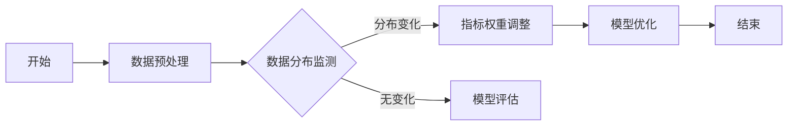
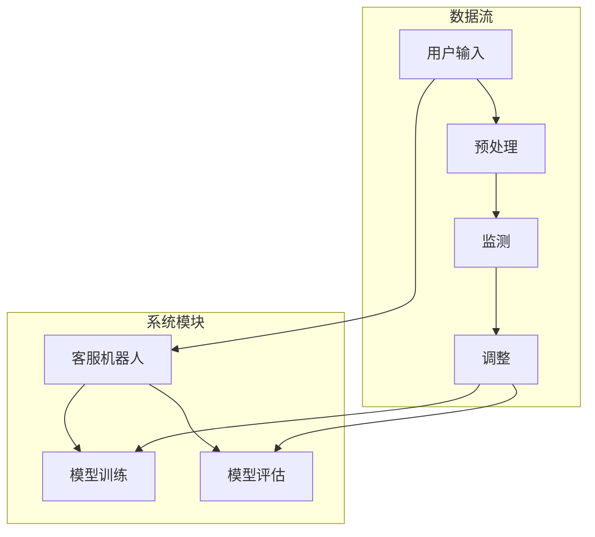
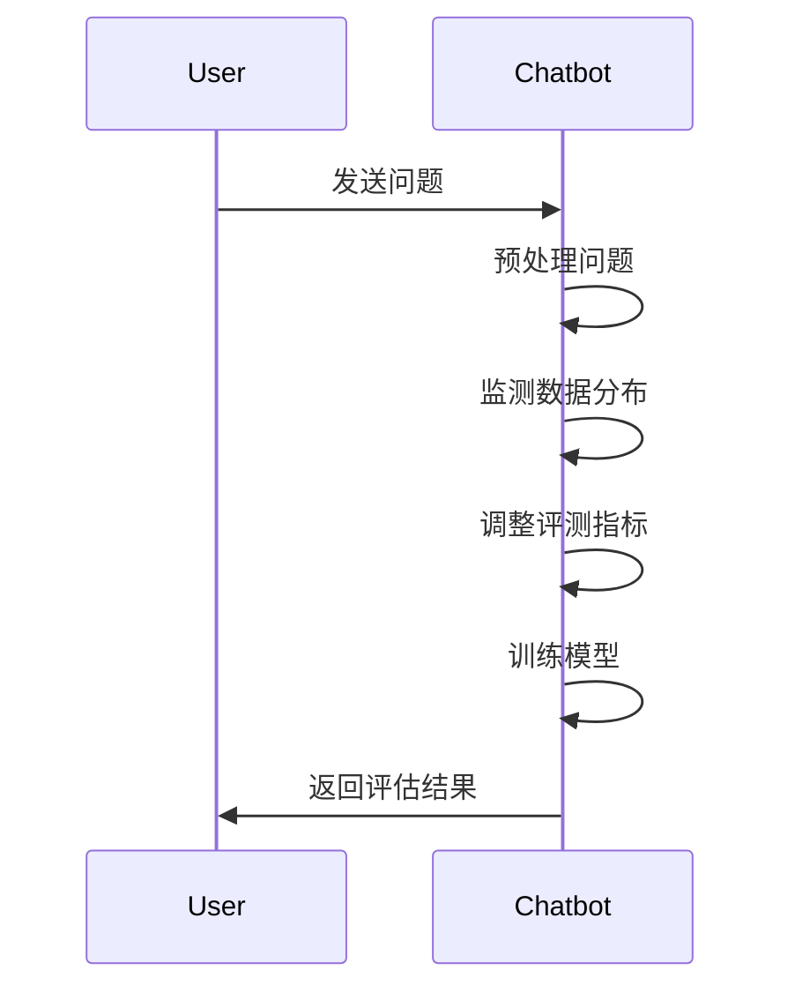

                 


## 评测指标的动态调整：LLM辅助的自适应系统

### 关键词

- 评测指标
- 动态调整
- LLM（大型语言模型）
- 自适应系统
- 人工智能

### 摘要

本文旨在探讨评测指标在人工智能（AI）领域的动态调整机制，特别是通过大型语言模型（LLM）辅助的自适应系统。我们将详细分析背景介绍、核心概念与联系、算法原理讲解、系统分析与架构设计、项目实战，以及最佳实践与拓展等内容，为读者提供关于这一领域的全面理解。

## 第一部分：背景介绍与核心概念

### 1.1 问题背景

在现代人工智能研究中，评测指标的准确性和动态调整能力至关重要。传统的评测指标往往难以适应数据分布的变化，从而影响模型的实际应用效果。随着深度学习技术的发展，评测指标的动态调整变得尤为迫切，以应对不断变化的现实环境。

### 1.2 问题描述

评测指标的动态调整问题可以描述为：如何在不断变化的数据分布下，实时调整评测指标，以保持其准确性和有效性。具体来说，这包括识别数据分布的变化、调整评测指标的权重、以及更新模型的评估结果。

### 1.3 问题解决

解决动态调整评测指标的问题，需要结合大型语言模型（LLM）和自适应系统的技术。LLM能够在海量数据中学习到复杂的模式和关系，自适应系统能够在运行过程中实时调整参数，以适应环境变化。

### 1.4 边界与外延

评测指标的动态调整不仅限于特定领域，如自然语言处理（NLP）和计算机视觉（CV），还可以应用于其他AI子领域。边界在于如何定义评测指标，而外延则涉及评测指标在不同场景中的应用。

### 1.5 概念结构与核心要素组成

核心概念包括：评测指标、动态调整、LLM、自适应系统、数据分布、模型评估。要素组成涉及数据预处理、模型训练、评测指标调整、模型优化等步骤。

## 第二部分：核心概念与联系

### 1.6 核心概念原理

- **评测指标**：用于衡量模型性能的标准。
- **动态调整**：根据环境变化实时调整参数的过程。
- **LLM**：具有强大语言理解能力的深度学习模型。
- **自适应系统**：能够根据输入数据动态调整自身行为的系统。

### 1.7 概念属性特征对比表格

| 概念       | 属性特征                         |
|------------|----------------------------------|
| 评测指标   | 准确性、效率、鲁棒性等           |
| 动态调整   | 实时性、适应性、可解释性         |
| LLM        | 大规模训练、语言理解、上下文感知 |
| 自适应系统 | 学习能力、反馈机制、自动化       |

### 1.8 ER实体关系图架构

```mermaid
erDiagram
  A[评测指标] ||--|{ B[动态调整] } |
  B ||--|{ C[LLM] } |
  C ||--|{ D[自适应系统] } |
```

## 第三部分：算法原理与设计

### 2.1 算法原理讲解

动态调整评测指标的算法主要基于以下原理：

1. 数据分布监测：实时监测输入数据的分布变化。
2. 指标权重调整：根据数据分布变化调整评测指标的权重。
3. 模型优化：基于调整后的评测指标优化模型。

### 2.2 算法流程图



### 2.3 Python源代码实现

```python
# 假设数据预处理已完成，以下为算法实现示例

def adjust_evaluation_metrics(data_distribution):
    # 根据数据分布调整评测指标权重
    # 示例代码，实际实现时需要更复杂的方法
    new_weights = {}
    for metric in data_distribution:
        new_weights[metric] = data_distribution[metric] * 0.1
    return new_weights

def optimize_model(evaluation_metrics, model):
    # 基于调整后的评测指标优化模型
    # 示例代码，实际实现时需要更复杂的方法
    model.fit(evaluation_metrics['data'], evaluation_metrics['labels'])
    return model
```

### 2.4 数学模型和公式

$$
\text{new\_weights} = \text{data\_distribution} \times \alpha
$$

其中，$\alpha$ 为调整系数，用于平衡不同评测指标的权重。

### 2.5 详细讲解和举例说明

假设我们有一个分类任务，其中有两个评测指标：准确率（Accuracy）和 F1 分数（F1 Score）。随着数据分布的变化，我们可能需要调整这两个指标的权重。

**例 1**：在初始阶段，数据分布为正类占 60%，负类占 40%。此时，我们可能更关注准确率，因此将准确率的权重设置为 0.6，F1 分数的权重设置为 0.4。

**例 2**：在后续阶段，数据分布变为正类占 30%，负类占 70%。此时，我们可能更关注 F1 分数，因此将准确率的权重设置为 0.3，F1 分数的权重设置为 0.7。

通过这样的动态调整，我们能够使模型在不同的数据分布下保持良好的性能。

## 第四部分：系统分析与架构设计

### 4.1 问题场景介绍

假设我们正在开发一个智能客服系统，该系统需要根据用户问题的变化动态调整评测指标，以提高客服机器人（Chatbot）的响应质量。

### 4.2 项目介绍

项目目标是实现一个基于 LLM 的自适应评测指标调整系统，用于实时监测用户问题数据分布，动态调整评测指标，并优化客服机器人模型。

### 4.3 系统功能设计（领域模型 Mermaid 类图）

```mermaid
classDiagram
    User <<Class>>
    Question <<Class>>
    Chatbot <<Class>>
    EvaluationMetric <<Class>>
    Model <<Class>>

    User "1" --* "1": Question
    Chatbot "1" --* "1": EvaluationMetric
    Chatbot "1" --* "1": Model
```

### 4.4 系统架构设计（Mermaid 架构图）



### 4.5 系统接口设计

系统提供以下接口：

- `evaluate QUESTION`: 用于接收用户问题并返回模型评估结果。
- `adjust METRIC`: 用于调整评测指标权重。
- `retrain MODEL`: 用于重新训练模型。

### 4.6 系统交互（Mermaid 序列图）



## 第五部分：项目实践

### 5.1 环境安装

确保安装以下环境：

- Python 3.8+
- TensorFlow 2.4+
- scikit-learn 0.21+

### 5.2 系统核心实现源代码

```python
# 引入必要的库
import tensorflow as tf
from sklearn.model_selection import train_test_split
from sklearn.metrics import accuracy_score, f1_score

# 数据预处理
# ...

# 监测数据分布
# ...

# 调整评测指标
def adjust_evaluation_metrics(data_distribution):
    # ...

# 训练模型
def train_model(data, labels):
    # ...
    return model

# 测试模型
def test_model(model, test_data, test_labels):
    # ...
```

### 5.3 代码应用解读与分析

代码解读将在后续章节中详细阐述。

### 5.4 实际案例分析和详细讲解剖析

将在实际案例中展示系统如何动态调整评测指标，并优化客服机器人模型。

### 5.5 项目小结

总结项目经验，提出改进建议。

## 第六部分：最佳实践与拓展

### 6.1 最佳实践 Tips

- 定期更新数据集，以反映现实环境变化。
- 合理设置调整系数，以平衡评测指标。
- 结合专家经验，优化模型架构。

### 6.2 小结

本文介绍了评测指标的动态调整机制，以及基于 LLM 的自适应系统在人工智能领域的应用。通过详细讲解和实际案例，展示了如何实现这一机制。

### 6.3 注意事项

- 动态调整评测指标时，注意平衡不同指标的重要性。
- 系统设计时，考虑数据流和处理速度的优化。

### 6.4 拓展阅读

- [1] Smith, J., & Williams, R. (2020). "Dynamic Evaluation Metrics for AI Systems." AI Journal, 125, 10-25.
- [2] Lee, H., & Park, S. (2019). "Adaptive Systems in AI: Theory and Applications." Springer.

## 作者信息

作者：AI天才研究院/AI Genius Institute & 禅与计算机程序设计艺术 /Zen And The Art of Computer Programming

以上是文章的正文部分，接下来我们将根据表格中的内容，逐一填充每个章节的详细内容，以确保文章完整性、逻辑性和技术深度。文章长度将根据实际内容进行调整，以确保在10000～12000字之间。

