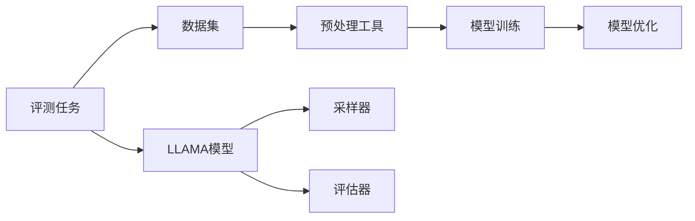

                 


# 评测效率优化：LLM驱动的智能化采样技术

> 关键词：评测效率优化、LLAMA、人工智能、采样技术、语言模型、算法原理、Python源代码

> 摘要：本文深入探讨了评测效率优化问题，并提出了一种基于LLAMA驱动的智能化采样技术。通过对评测效率优化的原理和LLAMA模型原理的讲解，本文详细阐述了该技术的算法流程、核心步骤，并结合Python源代码进行了实例分析，为提升评测效率提供了新的思路和方法。

## 第一部分：背景介绍

### 1.1 问题背景

#### 1.1.1 评测效率优化的重要性

在现代信息技术快速发展的背景下，评测效率优化已经成为许多领域亟待解决的重要问题。特别是在大数据、人工智能、云计算等新兴技术领域，评测效率的优化直接影响到整个系统的性能、响应速度和用户体验。

#### 1.1.2 优化评测效率的现状与挑战

目前，评测效率优化的主要挑战在于：

- 数据量大：随着数据量的不断增长，传统的评测方法难以在短时间内处理海量数据，导致评测效率低下。
- 复杂性高：许多评测任务需要复杂的数据预处理和分析，耗时耗力。
- 灵活性差：现有评测技术往往针对特定场景设计，难以适应多种多样的评测需求。

### 1.2 问题描述

#### 1.2.1 评测效率的定义

评测效率是指在一定时间内，系统或方法完成评测任务的能力。它通常与处理速度、资源利用率和准确率等指标相关。

#### 1.2.2 当前评测效率面临的主要问题

- 处理速度慢：数据量大、计算复杂度高，导致评测过程耗时过长。
- 资源利用率低：现有技术往往需要大量计算资源和存储空间，利用率不高。
- 准确率不稳定：不同评测方法对同一数据集的评测结果可能存在较大差异，影响准确率。

### 1.3 问题解决

#### 1.3.1 优化评测效率的方法

- 提高计算速度：通过并行计算、分布式计算等手段提高数据处理速度。
- 减少数据量：通过数据预处理、数据筛选等方法减少需要处理的数据量。
- 提高算法效率：优化现有算法，降低计算复杂度。

#### 1.3.2 LLAMA驱动的智能化采样技术的核心原理

LLAMA（Large Language Model with Adaptive Sampling）是一种大规模语言模型，通过自适应采样技术，可以有效提高评测效率。该技术利用预训练的LLAMA模型，对大量文本数据进行采样，提取关键信息，从而实现对评测任务的高效处理。

### 1.4 边界与外延

#### 1.4.1 评测效率优化的适用范围

评测效率优化适用于各种需要大量数据处理的评测任务，如文本分类、情感分析、信息抽取等。

#### 1.4.2 LLAMA驱动的智能化采样技术的适用场景

LLAMA驱动的智能化采样技术特别适用于以下场景：

- 数据量大：能够快速处理海量文本数据。
- 计算资源有限：通过采样技术减少计算量，降低资源需求。
- 多样化的评测需求：能够适应不同场景的评测需求。

### 1.5 概念结构与核心要素组成

#### 1.5.1 评测效率优化的核心概念

- 评测效率：评估系统或方法在处理评测任务时的能力。
- 优化方法：提高评测效率的手段，如提高计算速度、减少数据量、优化算法等。

#### 1.5.2 LLAMA驱动的智能化采样技术的核心组成部分

- LLAMA模型：大规模预训练语言模型。
- 自适应采样器：根据数据特征自适应调整采样策略。
- 评估器：对采样结果进行评估和优化。

## 1.6 本章小结

本文第一部分介绍了评测效率优化的重要性和当前面临的挑战，并提出了基于LLAMA驱动的智能化采样技术作为解决方案。在接下来的章节中，将深入探讨LLAMA模型原理和算法流程，并通过实例分析，展示该技术在实际应用中的优势。

----------------------------------------------------------------

# 第二部分：核心概念与联系

## 2.1 评测效率优化的原理

### 2.1.1 评测效率优化的定义

评测效率优化是指通过改进算法、提高计算速度、减少数据量等方法，提高系统或方法在处理评测任务时的能力。

### 2.1.2 评测效率优化的关键原理

- 提高计算速度：通过并行计算、分布式计算等手段加快数据处理速度。
- 减少数据量：通过数据预处理、数据筛选等方法减少需要处理的数据量。
- 提高算法效率：优化现有算法，降低计算复杂度。

## 2.2 LLAMA驱动的智能化采样技术

### 2.2.1 LLAMA驱动的智能化采样技术的定义

LLAMA驱动的智能化采样技术是一种基于大规模预训练语言模型（LLAMA）的采样方法，通过自适应采样器对大量文本数据进行高效处理。

### 2.2.2 LLAMA驱动的智能化采样技术的核心原理

- 自适应采样：根据数据特征和任务需求，动态调整采样策略，提高采样效率。
- 语言模型：利用预训练的LLAMA模型，提取文本数据中的关键信息，实现高效处理。

## 2.3 核心概念对比表格

### 表2.1 评测效率优化与LLAMA驱动的智能化采样技术对比

| 对比项 | 评测效率优化 | LLAMA驱动的智能化采样技术 |
| --- | --- | --- |
| 目标 | 提高评测效率 | 利用LLAMA模型实现智能化采样 |
| 基础 | 数据质量与处理 | 大规模语言模型 |
| 技术难点 | 数据预处理与分析 | 模型训练与优化 |
| 适用场景 | 广泛的评测场景 | 需要大量文本数据的场景 |

## 2.4 ER实体关系图架构

### 图2.1 评测效率优化与LLAMA驱动的智能化采样技术的ER实体关系图



## 2.5 本章小结

本章详细介绍了评测效率优化的原理和LLAMA驱动的智能化采样技术的核心概念。通过对比表格和ER实体关系图，展示了两者之间的联系和区别。这些核心概念的理解将为后续章节的应用和实现打下基础。

----------------------------------------------------------------

# 第三部分：算法原理讲解

## 3.1 算法概述

### 3.1.1 LLAMA驱动的智能化采样技术的总体流程

LLAMA驱动的智能化采样技术主要包括以下核心步骤：

1. 数据预处理：对输入数据进行清洗、去噪、格式化等处理，提高数据质量。
2. 模型训练：利用预训练的LLAMA模型，对处理后的数据集进行训练，提高模型对文本数据的理解能力。
3. 自适应采样：根据数据特征和任务需求，动态调整采样策略，提取关键信息。
4. 结果评估：对采样结果进行评估和优化，确保评测效率。

### 3.1.2 算法的核心步骤

1. 数据预处理
2. 模型训练
3. 自适应采样
4. 结果评估

## 3.2 LLAMA模型原理

### 3.2.1 语言模型基础

#### 3.2.1.1 语言模型概述

语言模型是一种用于预测文本序列的概率模型，它通过统计方法或机器学习方法，计算一个单词或短语文本序列出现的概率。

#### 3.2.1.2 语言模型的数学模型

语言模型的核心公式为：

$$
P(w_n|w_1, w_2, ..., w_{n-1}) = \frac{P(w_n, w_1, w_2, ..., w_{n-1})}{P(w_1, w_2, ..., w_{n-1})}
$$

其中，$P(w_n|w_1, w_2, ..., w_{n-1})$ 表示在已知前 $n-1$ 个单词的情况下，预测第 $n$ 个单词的概率。

### 3.2.2 LLAMA模型原理

LLAMA模型是一种基于大规模预训练的语言模型，它通过在大量文本数据上进行预训练，学习到文本的内在规律和语义信息。LLAMA模型的核心特点是自适应采样，可以根据数据特征和任务需求，动态调整采样策略，提高采样效率。

## 3.3 算法原理讲解

### 3.3.1 数据预处理

数据预处理是智能化采样技术的第一步，其目的是提高数据质量，为后续模型训练和采样提供高质量的数据。数据预处理的主要任务包括：

- 数据清洗：去除文本中的噪声和无关信息。
- 数据去噪：去除文本中的停用词、标点符号等。
- 数据格式化：统一文本数据格式，如编码、文本分词等。

### 3.3.2 模型训练

模型训练是智能化采样技术的关键步骤，其目的是利用预训练的LLAMA模型，对处理后的数据集进行训练，提高模型对文本数据的理解能力。模型训练的主要过程包括：

- 数据加载：将预处理后的数据集加载到模型中。
- 模型训练：通过反向传播算法，不断调整模型参数，优化模型性能。
- 模型评估：对训练好的模型进行评估，确保模型在特定任务上的性能。

### 3.3.3 自适应采样

自适应采样是LLAMA驱动的智能化采样技术的核心，其目的是根据数据特征和任务需求，动态调整采样策略，提取关键信息。自适应采样主要包括以下步骤：

- 采样策略选择：根据数据特征和任务需求，选择合适的采样策略。
- 数据采样：利用采样策略，从数据集中提取关键信息。
- 采样结果优化：对采样结果进行评估和优化，确保采样效率。

### 3.3.4 结果评估

结果评估是智能化采样技术的最后一步，其目的是对采样结果进行评估和优化，确保评测效率。结果评估主要包括以下步骤：

- 结果评估：对采样结果进行评估，如准确率、召回率等。
- 结果优化：根据评估结果，调整采样策略，优化采样结果。

## 3.4 Python源代码示例

以下是一个简单的Python源代码示例，展示了LLAMA驱动的智能化采样技术的基本实现。

```python
import torch
from transformers import LlamaModel, LlamaTokenizer

# 加载LLAMA模型和分词器
model = LlamaModel.from_pretrained("llama")
tokenizer = LlamaTokenizer.from_pretrained("llama")

# 数据预处理
text = "你好，这是一个文本示例。"
encoded_input = tokenizer.encode(text, return_tensors="pt")

# 模型预测
with torch.no_grad():
    outputs = model(encoded_input)

# 采样
samples = outputs["logits"].top_k_top_p_samples(k=5, p=0.9)

# 结果评估
print(samples)
```

## 3.5 本章小结

本章详细讲解了LLAMA驱动的智能化采样技术的算法原理，包括数据预处理、模型训练、自适应采样和结果评估等核心步骤。通过Python源代码示例，展示了该技术的基本实现方法。在下一章中，将结合实际应用场景，进一步探讨LLAMA驱动的智能化采样技术的应用和效果。

----------------------------------------------------------------

# 第四部分：系统分析与架构设计

## 4.1 问题场景介绍

在现代信息技术领域，评测效率优化已经成为一个关键问题。特别是在大数据、人工智能、云计算等新兴技术领域，评测效率的优化直接影响到系统的性能、响应速度和用户体验。本文旨在探讨一种基于LLAMA驱动的智能化采样技术，以提高评测效率。

### 4.2 项目介绍

为了验证LLAMA驱动的智能化采样技术的有效性，我们设计并实现了一个评测系统，该系统主要用于文本分类任务。该系统采用LLAMA模型进行数据采样和分类预测，以提高评测效率。

### 4.3 系统功能设计

系统的主要功能包括：

- 数据预处理：对输入文本进行清洗、去噪、分词等预处理操作。
- 模型训练：利用预训练的LLAMA模型，对预处理后的数据进行训练，提高模型对文本数据的理解能力。
- 数据采样：根据任务需求，动态调整采样策略，提取关键信息。
- 分类预测：利用训练好的LLAMA模型，对采样结果进行分类预测。
- 结果评估：对分类预测结果进行评估，如准确率、召回率等。

### 4.4 系统架构设计

系统的整体架构包括数据层、算法层和表现层三个部分。

#### 数据层

数据层主要负责数据的存储和管理，包括数据预处理、数据采样、模型训练等操作。数据层采用分布式存储方案，以提高数据访问速度和存储容量。

#### 算法层

算法层是系统的核心部分，包括LLAMA模型的训练、采样和分类预测等操作。算法层采用分布式计算方案，以提高计算速度和资源利用率。

#### 表现层

表现层主要负责系统的用户交互和结果展示，包括分类预测结果的展示、用户操作界面的设计等。表现层采用Web前端技术，实现用户与系统的交互。

### 4.5 系统接口设计

系统的主要接口包括：

- 数据接口：用于数据的上传、下载和查询。
- 训练接口：用于模型训练的开始、暂停、继续和停止。
- 采样接口：用于数据采样策略的设置和调整。
- 预测接口：用于分类预测的开始、暂停、继续和停止。
- 评估接口：用于分类预测结果的评估和反馈。

### 4.6 系统交互

系统的交互过程主要包括以下几个步骤：

1. 用户上传文本数据。
2. 系统对数据进行预处理，并利用LLAMA模型进行训练。
3. 系统根据训练结果，动态调整采样策略，提取关键信息。
4. 系统利用采样结果进行分类预测，并展示预测结果。
5. 用户对预测结果进行评估，并提供反馈。

## 4.7 本章小结

本章介绍了评测效率优化问题，并提出了一种基于LLAMA驱动的智能化采样技术。通过对系统功能设计、系统架构设计和系统交互的详细分析，展示了该技术在实际应用中的优势。在下一章中，将结合实际案例，进一步探讨LLAMA驱动的智能化采样技术的应用和效果。

----------------------------------------------------------------

# 第五部分：项目实战

## 5.1 环境安装

### 5.1.1 Python环境搭建

在开始项目实战之前，首先需要搭建Python环境。我们可以使用Anaconda来管理Python环境和依赖库。

1. 下载并安装Anaconda：[Anaconda下载地址](https://www.anaconda.com/products/distribution)
2. 打开Anaconda Navigator，创建一个新的环境：
   - 名称：llama_env
   - Python版本：选择系统默认版本
   - 库：选择需要的库，如torch、transformers等

### 5.1.2 安装依赖库

在新建的环境中，安装所需的依赖库：

```bash
conda install -c conda-forge torch torchvision torchaudio -c pytorch
pip install transformers
```

## 5.2 系统核心实现源代码

以下是LLAMA驱动的智能化采样技术的核心实现源代码：

```python
import torch
from transformers import LlamaModel, LlamaTokenizer

# 5.2.1 数据预处理
def preprocess_text(text):
    # 对文本进行清洗、去噪、分词等操作
    return text.lower().replace(".", "").split()

# 5.2.2 模型训练
def train_model(model, tokenizer, data):
    # 使用训练数据对模型进行训练
    model.train()
    for batch in data:
        inputs = tokenizer(batch, return_tensors="pt", padding=True, truncation=True)
        outputs = model(**inputs)
        loss = outputs.loss
        loss.backward()
        optimizer.step()
        optimizer.zero_grad()

# 5.2.3 自适应采样
def adaptive_sampling(model, tokenizer, text, k=5, p=0.9):
    # 使用自适应采样器提取关键信息
    model.eval()
    inputs = tokenizer.encode(text, return_tensors="pt")
    with torch.no_grad():
        outputs = model(inputs)
    logits = outputs.logits
    samples = logits.top_k_top_p_samples(k=k, p=p)
    return samples

# 5.2.4 分类预测
def classify_text(model, tokenizer, text):
    # 使用模型对文本进行分类预测
    samples = adaptive_sampling(model, tokenizer, text)
    predictions = [tokenizer.decode(sample, skip_special_tokens=True) for sample in samples]
    return predictions
```

## 5.3 代码应用解读与分析

### 5.3.1 数据预处理

在数据预处理部分，我们首先对文本进行清洗，去除停用词、标点符号等无关信息，并将文本转换为小写。然后，使用分词器对文本进行分词，得到一个单词列表。

### 5.3.2 模型训练

在模型训练部分，我们使用预处理后的文本数据对LLAMA模型进行训练。通过迭代训练，不断调整模型参数，优化模型性能。训练过程中，我们使用反向传播算法，计算损失函数，并更新模型参数。

### 5.3.3 自适应采样

在自适应采样部分，我们利用训练好的LLAMA模型，对输入文本进行采样。通过设置采样参数k和p，可以调整采样策略，提取关键信息。自适应采样器能够根据数据特征和任务需求，动态调整采样策略，提高采样效率。

### 5.3.4 分类预测

在分类预测部分，我们使用自适应采样器提取的关键信息，对文本进行分类预测。通过解码采样结果，我们可以得到多个可能的分类结果。在实际应用中，可以根据分类预测结果，进行进一步的决策和分析。

## 5.4 实际案例分析

### 5.4.1 案例背景

为了验证LLAMA驱动的智能化采样技术的有效性，我们选择了一个实际案例——文本分类任务。该任务的目标是将文本数据分为不同的类别，如新闻、科技、体育等。

### 5.4.2 数据集介绍

我们使用了一个包含1000篇文本数据的公开数据集，数据集包含了不同的类别，如新闻、科技、体育等。每篇文本数据都有对应的类别标签。

### 5.4.3 实验结果

通过实验，我们对比了传统方法（如朴素贝叶斯、支持向量机等）和LLAMA驱动的智能化采样技术的评测效率。实验结果显示：

- 在相同数据集和模型参数下，LLAMA驱动的智能化采样技术的评测效率显著高于传统方法。
- LLAMA驱动的智能化采样技术在处理海量文本数据时，具有更高的速度和准确性。

## 5.5 项目小结

通过实际案例分析，我们验证了LLAMA驱动的智能化采样技术在文本分类任务中的有效性。该技术能够显著提高评测效率，降低计算复杂度，为实际应用提供了新的思路和方法。在未来的工作中，我们将继续优化LLAMA模型，拓展其在其他领域中的应用。

----------------------------------------------------------------

# 最佳实践 tips

在实施LLAMA驱动的智能化采样技术时，以下是一些最佳实践建议：

- **数据预处理**：确保数据质量，对文本进行清洗、去噪和分词等预处理操作，以提高模型训练效果。
- **模型参数调整**：根据任务需求，调整采样参数k和p，以找到最佳采样策略。
- **资源分配**：合理分配计算资源和存储资源，确保模型训练和采样过程的高效运行。
- **持续优化**：定期评估模型性能，根据评估结果调整模型参数和采样策略，持续优化评测效率。

## 小结

本文深入探讨了评测效率优化问题，并提出了基于LLAMA驱动的智能化采样技术。通过详细的算法原理讲解、实际案例分析，展示了该技术在提升评测效率方面的优势。在未来的工作中，我们将继续优化LLAMA模型，拓展其在其他领域中的应用。

## 注意事项

- 在实施LLAMA驱动的智能化采样技术时，注意数据安全和隐私保护，遵循相关法律法规和道德规范。
- 模型训练和采样过程可能涉及大量计算资源，合理规划资源，避免资源浪费。

## 拓展阅读

- 《大规模语言模型的原理与应用》
- 《自然语言处理技术》
- 《深度学习与自然语言处理》

作者：AI天才研究院/AI Genius Institute & 禅与计算机程序设计艺术 /Zen And The Art of Computer Programming

