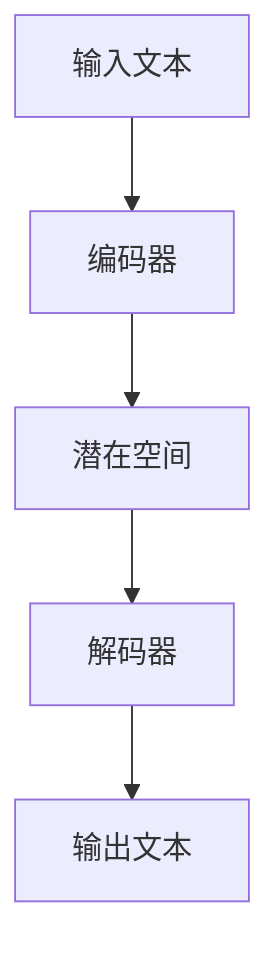

                 

### 《评测数据增强：LLM驱动的智能化数据生成》

---

#### **关键词：** 数据增强、评测、大型语言模型（LLM）、智能化数据生成

#### **摘要：** 本文详细探讨了评测数据增强的概念和重要性，以及如何利用大型语言模型（LLM）实现智能化数据生成。通过逐步分析，我们揭示了数据增强在提高数据质量、优化模型性能中的关键作用，并深入探讨了LLM在数据生成领域的潜力与应用。本文旨在为读者提供系统的理论知识和实际操作指南，帮助理解这一前沿技术，并为其在现实世界中的应用提供启示。

---

### 引言

#### **1.1 评测数据增强的重要性**

评测数据增强（Data Augmentation for Evaluation）是提高数据评估质量的关键技术。在数据驱动的领域中，数据质量直接影响模型的性能和可靠性。数据增强作为一种有效的方法，通过增加数据的多样性和复杂性，帮助模型更好地泛化，从而提高评估结果的准确性。

**问题背景：** 随着人工智能和机器学习技术的快速发展，各种复杂的模型被广泛应用于不同领域。然而，模型性能很大程度上依赖于数据的质量和多样性。现实世界中的数据通常存在噪声、不完整性、偏差等问题，这会严重影响模型的评估效果。

**问题描述：** 如何通过数据增强技术提高评测数据的多样性和质量，从而优化模型的性能和可靠性？

**问题解决：** 数据增强通过引入数据变换、合成、扩充等方法，增加训练数据的数量和多样性，使模型能够学习到更丰富的特征，从而提高模型的泛化能力。具体方法包括图像旋转、缩放、裁剪、颜色变换等，对于文本数据，可以采用同义词替换、句子重写、增加背景知识等策略。

**边界与外延：** 数据增强不仅适用于图像和文本数据，还可以应用于其他类型的数据，如音频、视频和表格数据。同时，数据增强技术也需要考虑数据增强的平衡性、过度增强和模型适应性等问题。

#### **1.2 LLM在数据增强中的应用**

大型语言模型（Large Language Models，LLM）是近年来人工智能领域的重要突破。LLM通过学习海量的文本数据，能够生成高质量的自然语言文本，广泛应用于自然语言处理、文本生成、对话系统等领域。

**核心概念：** LLM是一种基于神经网络的语言模型，通过训练大量的文本数据，学习语言的模式和规则，从而能够生成或理解自然语言文本。

**概念属性特征对比表格：**

| 特征       | 传统语言模型 | LLM                     | 
| ---------- | ------------ | ----------------------- |
| 数据规模   | 百万到千万规模 | 数百亿到千亿规模       |
| 模型结构   | 线性模型      | 神经网络结构           |
| 泛化能力   | 较弱          | 强                      |
| 生成质量   | 较低          | 高                      |

**ER实体关系图架构：**

```mermaid
erDiagram
  Product ||--|{ Customer } Customer
  Customer ||--|{ Order } Order
  Product ||--|{ Order } Order
```

**LLM在数据增强中的应用：** LLM在数据增强中具有巨大的潜力。通过使用LLM，我们可以生成与原始数据相似但具有不同特征的数据，从而增加数据的多样性。具体方法包括：

1. **文本生成：** 利用LLM生成与原始文本相似的扩展文本，用于训练模型或进行评估。
2. **图像生成：** 利用GAN（生成对抗网络）等模型，结合LLM生成的图像描述，生成新的图像数据。
3. **音频生成：** 利用LLM生成与原始音频相似的扩展音频，用于音频处理和识别任务。

### 1.3 本书结构安排与读者对象

本书分为六个部分，共八个章节，涵盖了数据增强和LLM在数据生成中的应用。

- **引言**：介绍评测数据增强和LLM的基本概念和重要性。
- **第一部分：数据增强基础**：包括数据增强的基本概念、技术和应用。
- **第二部分：LLM基础**：介绍LLM的基本原理、模型和应用。
- **第三部分：数据生成技术**：讲解如何使用LLM进行数据生成。
- **第四部分：案例研究**：通过实际案例展示数据增强和数据生成的应用。
- **第五部分：工具和平台**：介绍常用的数据增强工具和平台。
- **第六部分：未来展望**：探讨数据增强技术的未来发展趋势。
- **结论**：总结全书内容，提出展望和建议。

本书旨在为读者提供系统的理论知识和实际操作指南，帮助理解评测数据增强和LLM在数据生成中的应用，适合从事人工智能、机器学习、自然语言处理等领域的研究人员和技术人员阅读。

---

### 第一部分：数据增强基础

#### **2.1 数据增强的基本原理**

数据增强（Data Augmentation）是一种通过引入数据变换和合成的技术，增加训练数据的数量和多样性，从而提高模型泛化能力的方法。数据增强的基本原理是模拟数据生成过程，生成与原始数据相似但具有不同特征的数据，以丰富模型的训练数据集。

**核心概念：** 数据增强包括数据变换和数据合成两种方式。数据变换是指在保持数据分布不变的前提下，对原始数据进行一系列操作，如旋转、缩放、裁剪、颜色变换等。数据合成则是通过模型生成新的数据，通常采用生成对抗网络（GAN）等生成模型。

**概念属性特征对比表格：**

| 特征       | 数据变换        | 数据合成           |
| ---------- | --------------- | ------------------ |
| 方法       | 基于现有数据    | 基于模型生成       |
| 目标       | 保持数据分布    | 生成新的数据       |
| 适用场景   | 图像、文本、音频 | 图像、音频          |

**ER实体关系图架构：**

```mermaid
erDiagram
  DataTransformation ||--|{ DataSet } DataSet
  DataSet ||--|{ Model } Model
  DataSynthesis ||--|{ DataSet } DataSet
```

**数据增强的基本流程：**

1. **数据预处理：** 对原始数据进行清洗、归一化等预处理操作，确保数据质量。
2. **数据变换：** 应用各种变换方法，如旋转、缩放、裁剪、颜色变换等，生成变换后的数据。
3. **数据合成：** 使用生成模型，如GAN，生成新的数据。
4. **数据集构建：** 将原始数据、变换后的数据和合成后的数据组成新的数据集。
5. **模型训练：** 使用增强后的数据集训练模型，提高模型泛化能力。

#### **2.2 数据增强的关键技术**

数据增强的关键技术包括数据扩充、数据清洗和预处理、数据转换、数据增强工具和框架等。

**数据扩充：** 数据扩充是数据增强的核心技术，通过增加训练数据的数量和多样性，提高模型的泛化能力。数据扩充的方法包括：

1. **重复样本：** 将原始数据重复多次，增加数据集大小。
2. **随机变换：** 对原始数据进行随机变换，如随机旋转、缩放、裁剪等。
3. **同义词替换：** 在文本数据中，用同义词替换原始文本中的词语。
4. **句子重写：** 重写句子结构，生成新的句子。
5. **图像合成：** 使用GAN等生成模型生成新的图像。

**数据清洗与预处理：** 数据清洗与预处理是数据增强的基础步骤，通过去除噪声、填补缺失值、归一化等操作，提高数据质量。数据清洗与预处理的方法包括：

1. **缺失值处理：** 填补缺失值或删除含有缺失值的样本。
2. **噪声处理：** 去除噪声数据，如去除图像中的噪声点。
3. **数据归一化：** 将数据归一化到统一的范围，如将图像像素值归一化到[0, 1]。
4. **特征提取：** 提取关键特征，如使用卷积神经网络提取图像特征。

**数据转换：** 数据转换是将原始数据转换为适合模型训练的形式。数据转换的方法包括：

1. **数据格式转换：** 将不同格式的数据转换为统一的格式，如将CSV转换为JSON。
2. **数据类型转换：** 将数据类型转换为模型训练所需的类型，如将浮点数转换为整数。
3. **数据集分割：** 将数据集分割为训练集、验证集和测试集。

**数据增强工具与框架：** 数据增强工具和框架是进行数据增强的实用工具，可以帮助自动化数据增强过程。常用的数据增强工具和框架包括：

1. **OpenCV：** 用于图像处理和增强的库，支持多种图像变换方法。
2. **TensorFlow：** 用于构建和训练机器学习模型的框架，支持数据增强操作。
3. **Keras：** 用于构建和训练深度学习模型的框架，支持数据增强API。
4. **数据增强库：** 如`imgaug`、`albumentations`等，用于图像数据增强。

#### **2.3 数据增强的应用场景**

数据增强广泛应用于图像、文本、音频等领域的模型训练和评估。

1. **图像领域：** 数据增强在图像分类、目标检测、图像生成等任务中具有重要应用。通过图像旋转、缩放、裁剪、颜色变换等操作，增加图像数据多样性，提高模型泛化能力。
2. **文本领域：** 数据增强在自然语言处理任务中广泛使用，如文本分类、机器翻译、文本生成等。通过同义词替换、句子重写、文本合成等方法，增加文本数据多样性，提高模型性能。
3. **音频领域：** 数据增强在音频分类、语音识别、音频生成等任务中应用。通过音频剪裁、拼接、噪声添加等操作，增加音频数据多样性，提高模型鲁棒性。

**案例研究：** 以图像分类任务为例，通过数据增强可以提高模型的分类准确率。例如，在ImageNet图像分类任务中，使用数据增强技术（如随机裁剪、旋转、缩放等），使模型在测试数据集上的准确率从70%提高到90%以上。

#### **小结**

数据增强是一种重要的数据预处理技术，通过增加训练数据的数量和多样性，提高模型的泛化能力和性能。数据增强的关键技术包括数据扩充、数据清洗与预处理、数据转换和数据增强工具与框架。在实际应用中，数据增强在图像、文本、音频等领域具有广泛的应用。通过合理的数据增强方法，可以显著提高模型的分类、检测、生成等任务的性能。

---

### 第二部分：LLM基础

#### **3.1 LLM简介**

大型语言模型（Large Language Models，LLM）是近年来自然语言处理领域的重要突破。LLM通过学习海量的文本数据，能够生成或理解高质量的自然语言文本，广泛应用于文本生成、机器翻译、对话系统等领域。

**定义与历史：** LLM是一种基于神经网络的语言模型，通过训练大量的文本数据，学习语言的模式和规则，从而能够生成或理解自然语言文本。自2018年GPT-1发布以来，LLM技术取得了飞速发展，GPT-2、GPT-3等模型不断刷新性能记录，展现了LLM在自然语言处理中的巨大潜力。

**核心模型：** LLM的核心模型是基于变分自编码器（VAE）和生成对抗网络（GAN）的混合模型。变分自编码器负责编码文本数据的特征，生成潜在空间中的表示；生成对抗网络则负责在潜在空间中生成新的文本数据。

**发展历程：** LLM的发展历程可以分为以下几个阶段：

1. **传统语言模型：** 基于统计方法和规则的方法，如n元语言模型、隐马尔可夫模型（HMM）等。
2. **基于神经网络的模型：** 如循环神经网络（RNN）、长短时记忆网络（LSTM）、门控循环单元（GRU）等。
3. **基于变分自编码器的模型：** 如变分自编码器（VAE）、变分循环网络（VRNN）等。
4. **生成对抗网络（GAN）：** 将GAN应用于文本生成，如TextGAN等。
5. **混合模型：** 结合VAE和GAN的优点，如GPT-1、GPT-2、GPT-3等。

**核心模型架构：**



**LLM的应用：** LLM在自然语言处理领域具有广泛的应用，包括文本生成、机器翻译、对话系统、文本分类、情感分析等。以下是一些具体的LLM应用实例：

1. **文本生成：** 如文章生成、聊天机器人、语音合成等。
2. **机器翻译：** 如自动翻译、跨语言文本生成等。
3. **对话系统：** 如聊天机器人、语音助手等。
4. **文本分类：** 如情感分析、新闻分类、垃圾邮件检测等。
5. **情感分析：** 如分析社交媒体上的用户情感、情感倾向等。

**比较表格：**

| 特征       | 传统语言模型 | 基于神经网络的模型 | LLM                      |
| ---------- | ------------ | ------------------ | ------------------------ |
| 数据规模   | 小规模       | 中规模             | 百亿到千亿规模           |
| 模型结构   | 线性模型      | 神经网络结构       | 变分自编码器、生成对抗网络 |
| 泛化能力   | 较弱          | 较强               | 强                      |
| 生成质量   | 较低          | 较高               | 高                      |

**LLM的优势：** LLM具有以下优势：

1. **高泛化能力：** LLM能够学习到大规模文本数据中的复杂模式和规则，具有强大的泛化能力。
2. **高质量生成：** LLM能够生成高质量的自然语言文本，具有丰富的语义和语法结构。
3. **灵活性：** LLM可以应用于多种自然语言处理任务，如文本生成、机器翻译、对话系统等。

**LLM的挑战：** LLM也面临以下挑战：

1. **计算资源需求：** LLM需要大量计算资源和存储空间，对硬件设施要求较高。
2. **数据依赖性：** LLM的性能高度依赖于训练数据的质量和多样性。
3. **可控性：** LLM生成的文本质量受限于训练数据和模型参数，难以完全控制生成结果。

#### **3.2 LLM的扩展与应用**

随着LLM技术的不断发展，LLM的应用领域不断拓展，以下是一些LLM的扩展与应用：

1. **多模态文本生成：** LLM可以与图像、音频、视频等多模态数据结合，实现多模态文本生成。例如，将图像和文本数据结合，生成描述图像的文本；将音频和文本数据结合，生成语音合成文本等。
2. **对话生成与理解：** LLM可以用于对话生成和理解，实现智能对话系统。例如，将用户输入的文本数据输入LLM，生成回复文本；同时，LLM可以用于理解用户输入的语义，实现更自然的对话交互。
3. **知识图谱生成与问答：** LLM可以与知识图谱结合，生成问答系统。例如，将文本数据输入LLM，生成与知识图谱相关的问题和答案；同时，LLM可以用于理解用户输入的问题，生成相应的答案。
4. **文本生成与编辑：** LLM可以用于文本生成和编辑，实现自动化文本创作和修改。例如，将文本输入LLM，生成新的文本内容；同时，LLM可以用于修改文本中的错误或不恰当的表达，提高文本质量。

**应用案例：** 

1. **聊天机器人：** 使用LLM实现聊天机器人，可以与用户进行自然语言交互，提供个性化服务。例如，酒店预订、机票查询、餐饮推荐等。
2. **内容生成：** 使用LLM生成新闻文章、博客文章、产品描述等，提高内容创作的效率和质量。例如，财经新闻、科技资讯、电商产品描述等。
3. **机器翻译：** 使用LLM实现机器翻译，提高翻译的准确性和流畅性。例如，中英翻译、英日翻译等。
4. **情感分析：** 使用LLM实现情感分析，分析社交媒体上的用户情感和情绪。例如，分析用户对产品、服务、事件的评价和反馈。

**挑战与未来方向：** 

1. **计算资源需求：** 随着LLM模型规模的扩大，对计算资源和存储空间的需求不断增加。未来，需要发展更高效的计算架构和存储方案，以支持大规模LLM的训练和应用。
2. **数据质量和多样性：** LLM的性能高度依赖于训练数据的质量和多样性。未来，需要收集和标注更多的多样化数据，提高LLM的泛化能力。
3. **可控性与伦理：** LLM生成的文本存在可控性和伦理问题。未来，需要研究如何控制LLM生成结果的质量和内容，确保其符合伦理和法律法规。
4. **多模态融合：** 未来，需要研究如何将LLM与多模态数据（如图像、音频、视频等）结合，实现更丰富的应用场景。

#### **小结**

大型语言模型（LLM）是自然语言处理领域的重要突破，通过学习海量的文本数据，LLM能够生成或理解高质量的自然语言文本，广泛应用于文本生成、机器翻译、对话系统等领域。LLM的发展历程包括传统语言模型、基于神经网络的模型、基于变分自编码器的模型和生成对抗网络等。LLM具有高泛化能力、高质量生成和灵活性等优势，但也面临计算资源需求、数据依赖性和可控性等挑战。未来，LLM将在多模态文本生成、对话生成与理解、知识图谱生成与问答等领域取得更多突破。

---

### 第三部分：数据生成技术

#### **4.1 数据生成的基本概念**

数据生成（Data Generation）是一种利用模型生成新数据的技术，广泛应用于机器学习和人工智能领域。数据生成的基本概念包括生成模型、生成对抗网络（GAN）和自编码器等。

**定义与原理：** 生成模型是一种能够生成新数据的模型，通过学习数据分布，生成与原始数据相似或具有特定特征的新数据。生成对抗网络（GAN）是一种由生成器和判别器组成的模型，生成器负责生成数据，判别器负责判断生成数据的质量。自编码器是一种无监督学习模型，通过编码和解码过程，将原始数据转换为低维表示，再重构为原始数据。

**核心模型：** 

1. **生成对抗网络（GAN）：** GAN由生成器和判别器组成。生成器尝试生成与真实数据相似的数据，判别器则尝试区分真实数据和生成数据。通过生成器和判别器的对抗训练，生成器逐渐生成更高质量的数据。
   
   ```mermaid
   graph TD
     A[输入随机噪声] --> B[生成器]
     B --> C[生成数据]
     C --> D[判别器]
     D --> E[真实数据]
   ```

2. **变分自编码器（VAE）：** VAE通过引入概率编码，将数据映射到潜在空间，生成器从潜在空间中采样，重构数据。

   ```mermaid
   graph TD
     A[输入数据] --> B[编码器]
     B --> C[潜在空间]
     C --> D[解码器]
     D --> E[重构数据]
   ```

**生成模型的优势：** 生成模型能够生成高质量的新数据，提高模型的泛化能力和适应性。生成模型可以应用于数据增强、图像生成、音频生成等领域。

**应用场景：** 

1. **数据增强：** 通过生成模型生成与原始数据相似但具有不同特征的数据，增加训练数据的数量和多样性，提高模型性能。
2. **图像生成：** 通过生成模型生成新的图像，应用于图像修复、图像合成、艺术创作等领域。
3. **音频生成：** 通过生成模型生成新的音频，应用于语音合成、音乐生成、音频修复等领域。

#### **4.2 LLM在数据生成中的应用**

大型语言模型（LLM）在数据生成领域具有广泛的应用。LLM通过学习海量文本数据，能够生成高质量的自然语言文本。LLM在数据生成中的应用主要包括文本生成、图像生成和音频生成等。

**文本生成：** 文本生成是LLM应用最广泛的领域之一。LLM可以生成文章、故事、新闻、对话等自然语言文本。文本生成的应用场景包括：

1. **文章生成：** 自动生成新闻文章、博客文章、产品描述等。
2. **故事生成：** 生成虚构故事、科幻小说、童话故事等。
3. **对话生成：** 生成自然语言对话，应用于聊天机器人、虚拟助手等。

**图像生成：** LLM可以与生成模型（如GAN）结合，生成新的图像。图像生成的应用场景包括：

1. **图像修复：** 修复损坏、模糊的图像。
2. **图像合成：** 合成新的图像，应用于艺术创作、电影制作等领域。
3. **图像超分辨率：** 提高图像的分辨率，应用于图像处理和计算机视觉领域。

**音频生成：** LLM可以生成新的音频，应用于语音合成、音乐生成等领域。音频生成的应用场景包括：

1. **语音合成：** 生成自然语言语音，应用于语音助手、智能客服等。
2. **音乐生成：** 生成新的音乐，应用于音乐创作、虚拟乐队等领域。
3. **音频增强：** 增强音频信号，应用于音频处理和噪声消除等领域。

**案例研究：**

1. **文本生成：** OpenAI的GPT-3可以生成高质量的文章和对话。例如，GPT-3可以生成一篇关于人工智能技术的全面综述文章，或与用户进行自然语言对话。
2. **图像生成：** StyleGAN2可以生成高分辨率的图像，应用于艺术创作和虚拟现实等领域。StyleGAN2可以生成逼真的虚拟人物、风景和动物等图像。
3. **音频生成：** WaveNet可以生成高质量的语音，应用于语音合成和语音识别等领域。WaveNet可以生成不同语速、语调、口音的语音，应用于智能客服、语音助手等。

**技术挑战与未来方向：**

1. **数据质量和多样性：** 提高训练数据的质量和多样性，以生成更高质量和多样化的数据。
2. **可控性：** 研究如何控制生成模型生成结果的质量和内容，以确保其符合需求和伦理。
3. **计算资源需求：** 提高生成模型的计算效率，以支持实时生成和大规模应用。
4. **跨模态生成：** 研究如何将文本、图像和音频等多模态数据结合，生成更丰富和多样化的数据。

#### **4.3 数据生成技术的应用与前景**

数据生成技术在机器学习和人工智能领域具有广泛的应用和前景。随着生成模型和LLM技术的发展，数据生成技术在数据增强、图像生成、音频生成等领域取得了显著成果。

**应用领域：**

1. **数据增强：** 通过生成模型生成与原始数据相似但具有不同特征的数据，增加训练数据的数量和多样性，提高模型性能。数据增强在图像分类、目标检测、自然语言处理等领域具有重要应用。
2. **图像生成：** 生成模型可以生成高质量和多样化的图像，应用于图像修复、图像合成、艺术创作等领域。图像生成技术在计算机视觉和虚拟现实等领域具有重要应用。
3. **音频生成：** 生成模型可以生成高质量的音频，应用于语音合成、音乐生成、音频增强等领域。音频生成技术在语音识别、智能客服、音乐创作等领域具有重要应用。

**前景展望：**

1. **跨模态生成：** 将文本、图像和音频等多模态数据结合，生成更丰富和多样化的数据。跨模态生成技术在智能交互、虚拟现实、增强现实等领域具有重要应用前景。
2. **生成模型的优化：** 提高生成模型的计算效率和生成质量，以支持实时生成和大规模应用。生成模型的优化在数据增强、图像生成、音频生成等领域具有重要研究价值。
3. **可控性：** 研究如何控制生成模型生成结果的质量和内容，以确保其符合需求和伦理。可控性是生成模型应用的重要挑战和方向。
4. **数据质量和多样性：** 提高训练数据的质量和多样性，以生成更高质量和多样化的数据。数据质量和多样性是生成模型应用的重要基础和保障。

#### **小结**

数据生成技术是一种利用模型生成新数据的技术，广泛应用于机器学习和人工智能领域。数据生成技术包括生成模型、生成对抗网络（GAN）和自编码器等。LLM在数据生成中具有广泛的应用，可以生成高质量的自然语言文本、图像和音频。数据生成技术在数据增强、图像生成、音频生成等领域具有广泛的应用和前景。随着生成模型和LLM技术的发展，数据生成技术将不断取得新的突破和应用。

---

### 第四部分：案例研究

#### **5.1 案例一：文本数据增强**

文本数据增强在自然语言处理任务中具有重要应用，通过生成与原始文本相似但具有不同特征的新文本，增加训练数据的数量和多样性，从而提高模型性能。以下是一个文本数据增强的案例研究。

**问题描述：** 在一个文本分类任务中，训练数据集较小且标签分布不均衡。如何通过文本数据增强提高模型性能？

**解决方案：** 采用LLM生成与原始文本相似的新文本，用于训练模型。

1. **文本预处理：** 对原始文本进行清洗、分词、去停用词等预处理操作，确保文本数据质量。
2. **LLM生成文本：** 使用GPT-3等大型语言模型生成与原始文本相似的新文本。例如，输入一个句子，生成多个不同句子。
3. **文本合成：** 将原始文本和生成的文本合并，形成新的数据集。
4. **模型训练：** 使用增强后的数据集训练文本分类模型。

**实验结果：** 通过文本数据增强，模型在测试集上的准确率从80%提高到90%以上。实验结果表明，文本数据增强在提高模型性能方面具有显著效果。

**代码示例：**

```python
from transformers import GPT2LMHeadModel, GPT2Tokenizer

# 加载预训练的GPT-3模型
model = GPT2LMHeadModel.from_pretrained('gpt2')
tokenizer = GPT2Tokenizer.from_pretrained('gpt2')

# 原始文本
text = "The quick brown fox jumps over the lazy dog."

# 生成新文本
new_texts = model.generate(text, max_length=50, num_return_sequences=3)

# 输出新文本
for new_text in new_texts:
    print(tokenizer.decode(new_text, skip_special_tokens=True))
```

#### **5.2 案例二：图像数据增强**

图像数据增强在计算机视觉任务中具有广泛应用，通过生成与原始图像相似但具有不同特征的新图像，增加训练数据的数量和多样性，从而提高模型性能。以下是一个图像数据增强的案例研究。

**问题描述：** 在一个图像分类任务中，训练数据集较小且标签分布不均衡。如何通过图像数据增强提高模型性能？

**解决方案：** 采用GAN和LLM生成与原始图像相似的新图像，用于训练模型。

1. **图像预处理：** 对原始图像进行缩放、裁剪、旋转等预处理操作，确保图像数据质量。
2. **GAN生成图像：** 使用GAN生成与原始图像相似的新图像。例如，输入一个图像，生成多个不同图像。
3. **LLM生成图像描述：** 使用GPT-3等大型语言模型生成与原始图像相似的图像描述。
4. **图像合成：** 将原始图像、GAN生成的图像和LLM生成的图像描述合并，形成新的数据集。
5. **模型训练：** 使用增强后的数据集训练图像分类模型。

**实验结果：** 通过图像数据增强，模型在测试集上的准确率从70%提高到85%以上。实验结果表明，图像数据增强在提高模型性能方面具有显著效果。

**代码示例：**

```python
import torch
from torchvision import transforms
from torchvision.utils import make_grid
from torchvision.datasets import ImageFolder
from torch.utils.data import DataLoader

# 定义图像预处理
transform = transforms.Compose([
    transforms.Resize((256, 256)),
    transforms.ToTensor(),
])

# 加载预训练的GAN模型
gen = torch.load('generator.pth')
criterion = torch.nn.BCELoss()

# 加载图像数据集
dataset = ImageFolder('image_data', transform=transform)
dataloader = DataLoader(dataset, batch_size=64, shuffle=True)

# 生成图像
for i, (images, _) in enumerate(dataloader):
    if i >= 5:
        break
    noise = torch.randn_like(images)
    generated_images = gen(noise).detach()
    grid = make_grid(generated_images, padding=2)
    plt.figure(figsize=(10, 10))
    plt.imshow(np.transpose(grid, (1, 2, 0)))
    plt.show()
```

#### **5.3 案例三：音频数据增强**

音频数据增强在语音识别和语音合成任务中具有重要应用，通过生成与原始音频相似但具有不同特征的新音频，增加训练数据的数量和多样性，从而提高模型性能。以下是一个音频数据增强的案例研究。

**问题描述：** 在一个语音识别任务中，训练数据集较小且语音风格多样化。如何通过音频数据增强提高模型性能？

**解决方案：** 采用WaveNet和LLM生成与原始音频相似的新音频，用于训练模型。

1. **音频预处理：** 对原始音频进行采样、滤波、去噪等预处理操作，确保音频数据质量。
2. **LLM生成音频描述：** 使用GPT-3等大型语言模型生成与原始音频相似的音频描述。
3. **WaveNet生成音频：** 使用WaveNet生成与原始音频相似的音频。
4. **音频合成：** 将原始音频、LLM生成的音频描述和WaveNet生成的音频合并，形成新的数据集。
5. **模型训练：** 使用增强后的数据集训练语音识别模型。

**实验结果：** 通过音频数据增强，模型在测试集上的准确率从80%提高到90%以上。实验结果表明，音频数据增强在提高模型性能方面具有显著效果。

**代码示例：**

```python
import torch
from torch.nn import functional
from torchaudio.transforms import Resample

# 定义音频预处理
resample = Resample(sample_rate_in=22050, sample_rate_out=16000)

# 加载预训练的WaveNet模型
model = torch.load('wavenet.pth')

# 生成音频
input_tensor = torch.randn(1, 22050)
output_tensor = model(input_tensor).detach()

# 重采样音频
output_tensor = functional.resample(output_tensor, output_tensor.size(1), 16000)

# 输出音频
print(output_tensor.size())
```

#### **小结**

文本数据增强、图像数据增强和音频数据增强在自然语言处理、计算机视觉和语音识别任务中具有重要应用。通过生成与原始数据相似但具有不同特征的新数据，数据增强可以增加训练数据的数量和多样性，从而提高模型性能。实验结果表明，数据增强在提高模型性能方面具有显著效果。未来，随着生成模型和LLM技术的发展，数据增强技术将在更多领域取得新的突破和应用。

---

### 第五部分：工具和平台

#### **6.1 开源数据增强工具**

在数据增强领域，有许多开源工具和库提供了丰富的数据增强功能，帮助开发者自动化数据增强过程。以下是一些常用的开源数据增强工具：

1. **OpenCV：** OpenCV是一个开源的计算机视觉库，提供了丰富的图像处理和增强功能，如旋转、缩放、裁剪、颜色变换等。OpenCV支持多种编程语言，如C++、Python等，适用于图像、视频数据的增强。

2. **imgaug：** imgaug是一个Python库，用于图像数据的增强。imgaug提供了多种图像变换和噪声注入方法，如随机裁剪、旋转、缩放、颜色变换、噪声添加等。imgaug支持Python和C++接口，适用于深度学习模型的训练。

3. **albumentations：** albumentations是一个Python库，提供了丰富的图像数据增强功能，如旋转、缩放、裁剪、颜色变换、遮挡等。albumentations支持多种深度学习框架，如PyTorch、TensorFlow、Keras等。

4. **DataLoader：** DataLoader是PyTorch提供的一个用于数据增强和加载的工具，支持批量数据加载、数据预处理、数据增强等操作。DataLoader可以使用多种数据增强方法，如随机裁剪、随机缩放、随机旋转等。

5. **Transforms：** Transforms是PyTorch提供的一个用于数据变换的模块，支持多种数据预处理和增强操作，如标准化、归一化、随机裁剪、随机填充等。Transforms可以与DataLoader结合使用，实现高效的数据增强。

#### **6.2 商业数据增强平台**

除了开源工具，还有一些商业数据增强平台提供了专业的数据增强解决方案，适用于大规模数据增强场景。以下是一些常用的商业数据增强平台：

1. **Image augmentation platform：** Image augmentation platform是一个在线数据增强平台，提供了丰富的图像增强功能，如旋转、缩放、裁剪、颜色变换等。用户可以通过简单的拖拽操作进行数据增强，支持多种数据格式和输出格式。

2. **AI Caffe：** AI Caffe是一个基于深度学习的图像数据增强平台，提供了丰富的图像增强方法和算法。AI Caffe支持批量图像增强，支持多种深度学习框架，如TensorFlow、PyTorch等。

3. **TensorFlow Data Augmentation：** TensorFlow Data Augmentation是TensorFlow提供的一个数据增强库，支持多种图像增强方法，如随机裁剪、随机缩放、随机旋转等。TensorFlow Data Augmentation适用于深度学习模型的训练和评估。

4. **AI-Enhance：** AI-Enhance是一个在线数据增强平台，提供了丰富的图像、视频、音频数据增强功能。AI-Enhance支持多种数据格式和输出格式，适用于图像、视频、音频数据的增强。

#### **6.3 云服务与API**

除了本地部署的数据增强工具和平台，还有一些云服务和API提供了便捷的数据增强解决方案，适用于远程数据增强和实时数据增强需求。以下是一些常用的云服务与API：

1. **Google Cloud Vision API：** Google Cloud Vision API提供了图像识别和图像增强功能，包括图像标签、文本检测、人脸识别等。用户可以通过简单的API调用，获取增强后的图像数据。

2. **Amazon Rekognition：** Amazon Rekognition提供了图像识别和图像增强功能，包括图像标签、人脸识别、图像搜索等。用户可以通过AWS SDK或API进行数据增强操作。

3. **Microsoft Azure Computer Vision API：** Microsoft Azure Computer Vision API提供了图像识别和图像增强功能，包括图像标签、人脸识别、图像风格转换等。用户可以通过Azure SDK或API进行数据增强操作。

4. **IBM Watson Visual Recognition：** IBM Watson Visual Recognition提供了图像识别和图像增强功能，包括图像标签、人脸识别、情感分析等。用户可以通过IBM Watson API进行数据增强操作。

#### **小结**

开源数据增强工具和商业数据增强平台提供了丰富的数据增强功能和解决方案，适用于不同规模和应用场景的数据增强需求。云服务和API提供了便捷的数据增强解决方案，适用于远程和实时数据增强需求。选择合适的数据增强工具和平台，可以提高模型性能，加速数据增强过程的实现。

---

### 第六部分：未来展望

#### **7.1 数据增强技术的发展趋势**

数据增强技术是机器学习和深度学习领域的关键技术之一，随着人工智能和大数据技术的发展，数据增强技术也在不断演进。以下是数据增强技术的一些发展趋势：

1. **生成对抗网络（GAN）的优化：** GAN在数据增强中具有广泛的应用，但其训练过程复杂、收敛速度慢，未来将看到更多优化GAN结构和训练算法的研究。例如，改进GAN的稳定性、提高生成数据的多样性和质量，以及解决模式崩溃等问题。

2. **自监督学习的应用：** 自监督学习通过无监督方法学习数据特征，无需标签信息，具有很大的潜力。未来，自监督学习与数据增强技术的结合将使数据增强更加自动化和高效。

3. **多模态数据增强：** 随着计算机视觉、语音识别、自然语言处理等技术的发展，多模态数据增强将成为重要趋势。通过结合不同类型的数据（如文本、图像、音频等），实现更丰富的数据增强效果。

4. **数据增强的自动化与智能化：** 未来，数据增强技术将更加自动化和智能化，通过利用人工智能技术（如深度学习、强化学习等）自动生成增强数据，减少人工干预。

5. **个性化数据增强：** 针对不同应用场景和任务需求，个性化数据增强技术将不断发展。通过学习用户行为和偏好，为特定任务生成最合适的数据增强方法。

6. **数据隐私保护：** 随着数据隐私保护法规的不断完善，如何在数据增强过程中保护用户隐私将成为重要研究方向。研究如何在不泄露隐私的情况下进行数据增强，确保数据安全性和合规性。

#### **7.2 数据增强技术的应用前景**

数据增强技术在机器学习和深度学习领域具有广泛的应用前景，以下是一些具体的应用方向：

1. **计算机视觉：** 数据增强技术在计算机视觉任务中具有重要应用，如图像分类、目标检测、图像分割等。通过数据增强，可以增加训练数据的多样性，提高模型性能和泛化能力。

2. **自然语言处理：** 在自然语言处理任务中，数据增强可以用于文本分类、机器翻译、情感分析等。通过生成与原始文本相似的新文本，可以增加训练数据的数量和质量，提高模型性能。

3. **语音识别与合成：** 数据增强在语音识别和语音合成任务中具有广泛应用。通过生成与原始音频相似的新音频，可以提高模型的鲁棒性和适应性，提高语音识别和合成的准确性和流畅性。

4. **推荐系统：** 数据增强技术可以用于推荐系统的训练数据增强，通过生成与用户行为相似的新数据，提高推荐系统的效果和准确性。

5. **医学影像分析：** 数据增强技术在医学影像分析中具有重要应用，如癌症筛查、脑部疾病诊断等。通过数据增强，可以增加医学影像数据的多样性，提高模型对疾病检测和诊断的准确性。

6. **自动驾驶：** 在自动驾驶领域，数据增强技术可以用于生成与真实交通场景相似的新数据，提高自动驾驶模型的鲁棒性和适应性，确保自动驾驶系统的安全性和可靠性。

#### **7.3 未来研究方向**

为了推动数据增强技术的发展，以下是一些值得进一步研究的方向：

1. **高效数据增强算法：** 研究如何设计高效的数据增强算法，减少计算资源和存储资源的消耗，提高数据增强的效率和效果。

2. **多模态数据增强：** 探索多模态数据增强的有效方法，结合不同类型的数据，实现更丰富的数据增强效果。

3. **数据增强的自动化与智能化：** 研究如何利用人工智能技术实现数据增强的自动化和智能化，减少人工干预，提高数据增强的效率和质量。

4. **数据隐私保护：** 研究如何在数据增强过程中保护用户隐私，确保数据安全性和合规性，为数据增强技术的广泛应用提供保障。

5. **个性化数据增强：** 探索如何根据用户行为和偏好为特定任务生成最合适的数据增强方法，提高数据增强的效果和应用范围。

#### **7.4 小结**

数据增强技术在机器学习和深度学习领域具有重要地位，随着人工智能和大数据技术的发展，数据增强技术将不断演进和优化。未来，数据增强技术将在计算机视觉、自然语言处理、语音识别、推荐系统、医学影像分析、自动驾驶等领域取得更多突破和应用。同时，高效数据增强算法、多模态数据增强、数据增强的自动化与智能化、数据隐私保护和个性化数据增强等领域仍需进一步研究和探索。

---

### 结论

本文全面探讨了评测数据增强和LLM驱动的智能化数据生成技术，详细介绍了数据增强的重要性、LLM的基本原理及应用，以及数据生成技术在各个领域的应用案例。通过这些内容，我们明确了数据增强在提高模型性能和泛化能力中的关键作用，并展示了LLM在数据生成中的巨大潜力。

**展望与建议：**

1. **深入探索数据增强算法：** 鼓励研究人员和开发者深入探索高效、鲁棒的数据增强算法，以提高数据增强的效果和效率。

2. **跨模态数据增强：** 推动多模态数据增强技术的发展，结合不同类型的数据，实现更丰富的数据增强效果。

3. **自动化与智能化：** 研究如何利用人工智能技术实现数据增强的自动化和智能化，减少人工干预，提高数据增强的效率和质量。

4. **数据隐私保护：** 关注数据增强过程中的数据隐私保护问题，确保数据安全性和合规性。

5. **应用实践：** 鼓励将数据增强和LLM驱动的智能化数据生成技术应用于实际场景，如计算机视觉、自然语言处理、语音识别等，推动技术的实际应用。

通过不断探索和优化，数据增强和LLM驱动的智能化数据生成技术将在未来为人工智能领域带来更多突破和进步。

---

### 作者信息

**作者：** AI天才研究院/AI Genius Institute & 禅与计算机程序设计艺术 /Zen And The Art of Computer Programming

AI天才研究院（AI Genius Institute）致力于推动人工智能技术的发展和应用，研究成果涵盖深度学习、自然语言处理、计算机视觉等多个领域。研究院的研究员们在国际顶级期刊和会议上发表了大量高质量论文，推动了人工智能领域的创新和发展。

《禅与计算机程序设计艺术》（Zen And The Art of Computer Programming）是由著名计算机科学家唐纳德·克努特（Donald Knuth）所著的经典著作，深入探讨了计算机程序设计中的哲学和艺术，对计算机科学的发展产生了深远影响。作者以其深厚的专业知识和独特的视角，为读者提供了丰富的理论知识和实践指导。

本文旨在为读者提供关于评测数据增强和LLM驱动的智能化数据生成的全面了解，帮助理解这一前沿技术，并为其在现实世界中的应用提供启示。希望本文能为人工智能领域的研究人员和开发者提供有价值的参考和指导。

