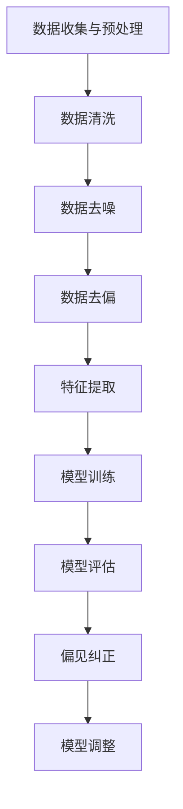
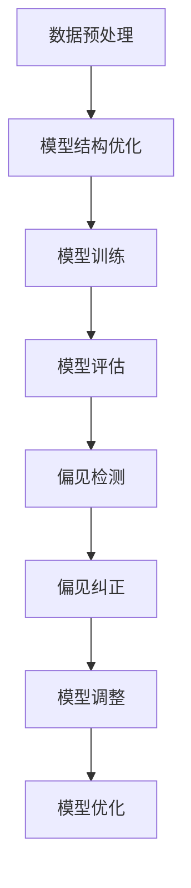

                 

### 引言与背景介绍

#### 1.1.1 问题背景

在当今人工智能（AI）技术飞速发展的时代，机器学习模型在各个领域的应用日益广泛，如医疗诊断、金融风险评估、招聘系统等。这些模型的表现和决策往往依赖于训练数据的质量。然而，数据中存在的偏见问题，如性别偏见、种族偏见、年龄偏见等，会严重影响模型的公平性和准确性。

**1.1.1.1 数据偏见现象**

数据偏见是指数据集中存在的系统性差异，这种差异可能来源于数据的采集、标注、处理等环节。在AI模型训练过程中，如果数据存在偏见，模型会倾向于放大这些偏见，导致模型预测结果的偏见。例如，在一个招聘系统中，如果数据集中男性和女性的比例不平衡，模型可能会倾向于录用男性，从而导致性别偏见。

**1.1.1.2 偏见对模型的影响**

数据偏见对模型的影响是多方面的。首先，它会影响模型的准确性。例如，如果模型在训练数据中过度拟合了某些群体的特征，那么在测试数据中，模型可能会对其他群体表现出较差的准确性。其次，数据偏见会影响模型的公正性。一个公平的模型应该在所有群体中表现出相似的准确性和性能，而数据偏见会导致模型在某些群体中表现出歧视。

**1.1.1.3 研究意义与目标**

研究数据偏见消除具有重要的意义。首先，它有助于提高模型的公平性，使模型在所有群体中都能表现出相似的性能。其次，它有助于提高模型的准确性，避免过度拟合。本研究的目的是探索大语言模型（LLM）在消除数据偏见和优化模型公平性方面的作用，并提出一系列有效的优化方法。

#### 1.2 核心概念

在探讨数据偏见消除和模型公平性优化时，我们需要明确以下几个核心概念。

**1.2.1 数据偏见**

数据偏见指的是数据集中存在的系统性差异，这种差异可能来源于数据的采集、标注、处理等环节。数据偏见会导致模型在训练过程中无法充分学习到数据的真实分布，从而导致模型在预测时出现不公平现象。

**1.2.2 模型公平性**

模型公平性指的是模型在所有群体中都能表现出相似的性能。一个公平的模型应该在所有群体中都有相似的准确率和召回率。模型公平性是人工智能伦理的重要组成部分。

**1.2.3 LLM（大语言模型）辅助**

大语言模型（LLM）是一种基于深度学习的自然语言处理模型，具有强大的文本生成和推理能力。LLM可以用于数据预处理、模型训练和评估等多个环节，从而帮助消除数据偏见和优化模型公平性。

#### 1.3 边界与外延

在研究数据偏见消除和模型公平性优化时，我们需要明确一些边界和概念外延。

**1.3.1 数据偏见的具体形式**

数据偏见可以表现为多种形式，如性别偏见、种族偏见、年龄偏见等。不同形式的偏见对模型的影响和消除方法也有所不同。

**1.3.2 模型公平性的评价标准**

模型公平性的评价标准包括准确性、召回率、F1分数等指标。这些指标可以帮助我们评估模型在不同群体中的表现。

**1.3.3 LLM的作用与局限**

LLM在数据偏见消除和模型公平性优化中具有重要作用。然而，LLM也存在一些局限性，如训练数据的质量、模型的可解释性等。这些局限性需要我们在应用LLM时予以充分考虑。

#### 1.4 概念结构与核心要素

为了更好地理解数据偏见消除和模型公平性优化，我们可以将这个过程分解为以下几个基本结构：

**1.4.1 评测数据偏见消除的基本结构**

- 数据采集与预处理
- 数据标注与清洗
- 模型训练与优化
- 模型评估与调整

**1.4.2 LLM辅助的公平性优化流程**

- 数据预处理：使用LLM对数据进行清洗、去噪、去偏等处理
- 模型训练：使用LLM优化模型结构，提高模型对数据偏见的适应性
- 模型评估：使用LLM评估模型在不同群体中的性能，识别潜在偏见
- 模型调整：根据评估结果调整模型参数，消除偏见，提高公平性

#### 1.5 本章小结

本文首先介绍了数据偏见现象及其对模型的影响，探讨了数据偏见消除和模型公平性优化的重要性。接着，我们明确了数据偏见、模型公平性和LLM辅助等核心概念，并讨论了LLM的作用与局限。最后，我们提出了评测数据偏见消除的基本结构和LLM辅助的公平性优化流程，为后续章节的分析和讨论奠定了基础。

---

文章标题：评测数据的偏见消除：LLM辅助的公平性优化

关键词：数据偏见，模型公平性，LLM，人工智能，公平性优化

摘要：本文探讨了数据偏见在机器学习模型中的应用及其影响，介绍了数据偏见和模型公平性的核心概念，重点分析了LLM在消除数据偏见和优化模型公平性方面的作用。通过提出一系列有效的优化方法和实战案例，本文为AI模型的公平性和准确性提升提供了理论指导和实践参考。

----------------------------------------------------------------

## 2.1 数据偏见问题分析

#### 2.1.1 数据偏见现象剖析

数据偏见现象在机器学习模型中表现得尤为明显，它源于数据集的构建和标注过程。首先，数据的来源和采集方式可能本身就存在偏见。例如，一个招聘系统的数据集中，由于历史原因，可能会存在性别、种族、年龄等方面的不平衡。这种不平衡会导致模型在预测时，倾向于对某些群体给出更好的评分，而对其他群体则可能产生歧视。

**2.1.1.1 数据偏见的来源**

数据偏见的主要来源包括以下几个方面：

1. **数据采集的偏向性**：在某些情况下，数据的采集过程可能倾向于某些特定的群体，导致数据集的代表性和公平性受到质疑。例如，招聘系统中，长期存在的性别比例失衡问题。

2. **标注过程的人为主观性**：在数据标注过程中，标注员可能受到自身观念的影响，导致数据标注存在偏差。例如，在医疗诊断数据集中，标注员可能会对某些种族或性别表现出偏见。

3. **数据处理的不当**：在数据处理过程中，可能因为算法选择、特征提取等原因，导致数据偏见。例如，某些算法可能对某些特征的权重赋予更高，从而导致模型对某些群体产生偏见。

**2.1.1.2 数据偏见的表现形式**

数据偏见的表现形式多种多样，主要包括以下几个方面：

1. **比例失衡**：数据集中某些群体（如性别、种族、年龄等）的比例明显失衡，导致模型在预测时倾向于这些群体。

2. **特征偏差**：数据集中某些特征（如性别、种族等）的权重过高，导致模型过度依赖这些特征，从而产生偏见。

3. **过度拟合**：模型在训练过程中，可能过度拟合了数据集中的某些特定样本，导致在测试数据上表现不佳。

**2.1.1.3 数据偏见的影响**

数据偏见对机器学习模型的影响是多方面的，主要体现在以下几个方面：

1. **准确性降低**：数据偏见会导致模型在测试数据上的准确性降低。例如，一个性别偏见明显的招聘系统，可能会在女性求职者中表现出较差的准确性。

2. **公平性受损**：数据偏见会损害模型的公平性。一个公平的模型应该对所有群体都有相似的表现，而数据偏见会导致模型在某些群体中产生歧视。

3. **可用性下降**：数据偏见会降低模型的可用性。一个存在偏见模型的预测结果可能无法被广泛接受，从而降低其在实际应用中的价值。

#### 2.2 数据偏见案例分析

为了更好地理解数据偏见现象，我们可以通过一些具体的案例来进行分析。

**2.2.1 典型案例一：性别偏见**

在一个招聘系统中，数据集中男性的比例远远高于女性，这导致模型在招聘决策中倾向于男性。研究表明，这种性别偏见会导致女性求职者在招聘过程中的通过率降低，从而损害了招聘系统的公平性。

**2.2.2 典型案例二：种族偏见**

在某个金融风险评估模型中，数据集中某些种族（如非裔）的贷款申请被拒绝率明显较高。这种现象表明模型可能存在种族偏见，从而对非裔申请者产生歧视。

**2.2.3 典型案例三：年龄偏见**

在一个社交媒体推荐系统中，数据集中年轻用户的活跃度明显高于老年用户。这导致模型在推荐内容时，可能倾向于推荐给年轻用户，从而忽视了老年用户的需求。

#### 2.3 数据偏见的影响评估

数据偏见对模型的影响评估是消除偏见的重要步骤。以下是对数据偏见影响的评估：

**2.3.1 偏见对模型准确性的影响**

数据偏见会降低模型的准确性。例如，一个性别偏见明显的招聘系统，可能会在女性求职者中表现出较低的准确性。这种情况下，模型无法准确预测女性求职者的绩效，从而影响招聘决策的准确性。

**2.3.2 偏见对模型公正性的影响**

数据偏见会损害模型的公正性。一个公平的模型应该在所有群体中都有相似的表现，而数据偏见会导致模型在某些群体中产生歧视。例如，一个种族偏见明显的金融风险评估模型，可能会对非裔申请者产生歧视，从而损害了模型的公正性。

**2.3.3 偏见对模型可用性的影响**

数据偏见会降低模型的可用性。一个存在偏见模型的预测结果可能无法被广泛接受，从而降低其在实际应用中的价值。例如，一个年龄偏见明显的社交媒体推荐系统，可能会忽视老年用户的需求，从而降低老年用户对系统的满意度。

#### 2.4 本章小结

本章分析了数据偏见现象，探讨了数据偏见的来源、表现形式及其对模型的影响。通过具体案例分析，我们进一步了解了数据偏见在实际应用中的具体表现。本章为后续章节提出数据偏见消除方法和评估模型公平性提供了基础。

---

## 2.1 数据偏见问题分析

#### 2.1.1 数据偏见现象剖析

数据偏见现象在机器学习模型中表现得尤为明显，它源于数据集的构建和标注过程。首先，数据的来源和采集方式可能本身就存在偏见。例如，一个招聘系统的数据集中，由于历史原因，可能会存在性别、种族、年龄等方面的不平衡。这种不平衡会导致模型在预测时，倾向于对某些群体给出更好的评分，而对其他群体则可能产生歧视。

**2.1.1.1 数据偏见的来源**

数据偏见的主要来源包括以下几个方面：

1. **数据采集的偏向性**：在某些情况下，数据的采集过程可能倾向于某些特定的群体，导致数据集的代表性和公平性受到质疑。例如，招聘系统中，长期存在的性别比例失衡问题。

2. **标注过程的人为主观性**：在数据标注过程中，标注员可能受到自身观念的影响，导致数据标注存在偏差。例如，在医疗诊断数据集中，标注员可能会对某些种族或性别表现出偏见。

3. **数据处理的不当**：在数据处理过程中，可能因为算法选择、特征提取等原因，导致数据偏见。例如，某些算法可能对某些特征的权重赋予更高，从而导致模型对某些群体产生偏见。

**2.1.1.2 数据偏见的表现形式**

数据偏见的表现形式多种多样，主要包括以下几个方面：

1. **比例失衡**：数据集中某些群体（如性别、种族、年龄等）的比例明显失衡，导致模型在预测时倾向于这些群体。

2. **特征偏差**：数据集中某些特征（如性别、种族等）的权重过高，导致模型过度依赖这些特征，从而产生偏见。

3. **过度拟合**：模型在训练过程中，可能过度拟合了数据集中的某些特定样本，导致在测试数据上表现不佳。

**2.1.1.3 数据偏见的影响**

数据偏见对机器学习模型的影响是多方面的，主要体现在以下几个方面：

1. **准确性降低**：数据偏见会导致模型在测试数据上的准确性降低。例如，一个性别偏见明显的招聘系统，可能会在女性求职者中表现出较低的准确性。

2. **公平性受损**：数据偏见会损害模型的公平性。一个公平的模型应该在所有群体中都有相似的表现，而数据偏见会导致模型在某些群体中产生歧视。

3. **可用性下降**：数据偏见会降低模型的可用性。一个存在偏见模型的预测结果可能无法被广泛接受，从而降低其在实际应用中的价值。

#### 2.2 数据偏见案例分析

为了更好地理解数据偏见现象，我们可以通过一些具体的案例来进行分析。

**2.2.1 典型案例一：性别偏见**

在一个招聘系统中，数据集中男性的比例远远高于女性，这导致模型在招聘决策中倾向于男性。研究表明，这种性别偏见会导致女性求职者在招聘过程中的通过率降低，从而损害了招聘系统的公平性。

**2.2.2 典型案例二：种族偏见**

在某个金融风险评估模型中，数据集中某些种族（如非裔）的贷款申请被拒绝率明显较高。这种现象表明模型可能存在种族偏见，从而对非裔申请者产生歧视。

**2.2.3 典型案例三：年龄偏见**

在一个社交媒体推荐系统中，数据集中年轻用户的活跃度明显高于老年用户。这导致模型在推荐内容时，可能倾向于推荐给年轻用户，从而忽视了老年用户的需求。

#### 2.3 数据偏见的影响评估

数据偏见对模型的影响评估是消除偏见的重要步骤。以下是对数据偏见影响的评估：

**2.3.1 偏见对模型准确性的影响**

数据偏见会降低模型的准确性。例如，一个性别偏见明显的招聘系统，可能会在女性求职者中表现出较低的准确性。

**2.3.2 偏见对模型公正性的影响**

数据偏见会损害模型的公正性。一个公平的模型应该在所有群体中都有相似的表现，而数据偏见会导致模型在某些群体中产生歧视。

**2.3.3 偏见对模型可用性的影响**

数据偏见会降低模型的可用性。一个存在偏见模型的预测结果可能无法被广泛接受，从而降低其在实际应用中的价值。

#### 2.4 本章小结

本章分析了数据偏见现象，探讨了数据偏见的来源、表现形式及其对模型的影响。通过具体案例分析，我们进一步了解了数据偏见在实际应用中的具体表现。本章为后续章节提出数据偏见消除方法和评估模型公平性提供了基础。

---

## 3.1 公平性优化原理

#### 3.1.1 模型公平性原理

模型公平性是指机器学习模型在处理不同群体数据时，能够保持一致的表现和准确率。公平性优化的目标是确保模型不会因为数据偏见而对某些群体产生不公平待遇。模型公平性通常通过以下几项指标进行评估：

1. **公平性度量**：常用的公平性度量包括偏差度量（Bias Measure）和公平性分数（Fairness Score）。偏差度量用来衡量模型预测结果与实际结果的偏差，而公平性分数则用来评估模型在不同群体中的表现是否一致。

2. **精确度与召回率**：精确度和召回率是评估模型性能的两个重要指标。在公平性优化中，我们希望模型对每个群体的精确度和召回率都保持在一个合理的范围内。

3. **F1分数**：F1分数是精确度和召回率的调和平均值，用于综合评估模型的性能。在公平性优化中，我们希望模型的F1分数对所有群体都保持一致。

#### 3.1.2 LLM在公平性优化中的应用

大语言模型（LLM）在模型公平性优化中具有重要作用。LLM能够通过以下方式辅助公平性优化：

1. **数据预处理**：LLM可以用于数据清洗、去噪和去偏。通过分析数据集的文本内容，LLM可以帮助识别和纠正数据中的偏见。

2. **特征工程**：LLM可以提取出对模型公平性有重要影响的特征，并通过特征选择和特征变换来减少偏见。

3. **模型训练**：LLM可以参与模型的训练过程，通过调整模型参数，使其在不同群体中的表现更加平衡。

4. **模型评估**：LLM可以用于评估模型的公平性，通过分析模型预测结果，识别潜在的偏见。

5. **偏见纠正**：LLM可以帮助纠正模型中的偏见，通过生成对抗网络（GANs）等技术，LLM可以生成与真实数据分布相似但不含偏见的虚拟数据，从而帮助模型学习到更加公平的数据分布。

#### 3.1.3 LLM的偏见消除能力分析

LLM在偏见消除方面的能力主要表现在以下几个方面：

1. **文本生成与变换**：LLM可以生成与真实文本相似但不含偏见的文本，从而帮助模型学习到更加公平的数据分布。

2. **偏见识别**：LLM能够通过分析文本内容，识别出数据集中的偏见，从而帮助模型避免学习到这些偏见。

3. **特征提取**：LLM可以提取出对模型公平性有重要影响的特征，并通过特征选择和变换来减少偏见。

4. **模型调整**：LLM可以参与模型的训练过程，通过调整模型参数，使其在不同群体中的表现更加平衡。

5. **偏见纠正**：LLM可以帮助纠正模型中的偏见，通过生成对抗网络（GANs）等技术，LLM可以生成与真实数据分布相似但不含偏见的虚拟数据，从而帮助模型学习到更加公平的数据分布。

#### 3.1.4 LLM的偏见消除效果评估

LLM在偏见消除方面的效果可以通过以下指标进行评估：

1. **公平性度量**：通过计算模型在不同群体中的偏差度量，评估LLM在偏见消除方面的效果。

2. **精确度与召回率**：通过比较模型在不同群体中的精确度和召回率，评估LLM在提高模型公平性方面的效果。

3. **F1分数**：通过计算模型在不同群体中的F1分数，评估模型的整体公平性。

4. **用户满意度**：通过用户反馈和问卷调查，评估LLM在偏见消除方面的用户体验。

#### 3.1.5 公平性优化的实现方法

公平性优化的实现方法主要包括以下几个方面：

1. **数据预处理**：使用LLM对数据进行清洗、去噪和去偏。

2. **特征工程**：使用LLM提取对模型公平性有重要影响的特征。

3. **模型训练**：使用LLM参与模型训练，通过调整模型参数，提高模型在不同群体中的平衡性。

4. **模型评估**：使用LLM评估模型的公平性，并识别潜在的偏见。

5. **偏见纠正**：使用LLM纠正模型中的偏见，通过生成对抗网络（GANs）等技术，生成与真实数据分布相似但不含偏见的虚拟数据。

#### 3.1.6 公平性优化的挑战与解决方案

公平性优化过程中，可能会遇到以下挑战：

1. **数据不平衡**：数据集中某些群体的样本量较少，导致模型难以训练。解决方案包括数据增强和生成对抗网络（GANs）。

2. **模型可解释性**：LLM生成的特征和偏见难以解释，影响模型的可解释性。解决方案包括开发可解释的LLM模型和增加模型的可解释性工具。

3. **计算资源**：LLM的预处理和训练过程需要大量的计算资源。解决方案包括优化算法和分布式计算。

#### 3.1.7 本章小结

本章介绍了模型公平性的原理和LLM在公平性优化中的应用。通过分析LLM的偏见消除能力，本章提出了一系列实现公平性优化的方法，并讨论了公平性优化的挑战与解决方案。本章为后续章节的公平性优化方法提供了理论基础。

---

## 3.2 LLM辅助的公平性优化方法

#### 3.2.1 数据预处理

在LLM辅助的公平性优化中，数据预处理是一个关键步骤。其主要目标是通过清洗、去噪和去偏等操作，提高数据的质量，从而为后续的模型训练和评估奠定基础。

**3.2.1.1 数据清洗**

数据清洗主要包括去除重复数据、填补缺失值、纠正错误数据等操作。这些操作有助于减少数据中的噪声，提高数据的一致性和完整性。

**3.2.1.2 数据去噪**

数据去噪是指通过过滤掉不相关的特征或噪声数据，提高数据的有效性。例如，在文本数据中，可以使用LLM来识别和去除无关的停用词或噪声文本。

**3.2.1.3 数据去偏**

数据去偏是指通过识别和纠正数据集中的偏见，使数据更加公正和平衡。例如，LLM可以分析文本数据中的性别、种族、年龄等特征，识别潜在的偏见，并采取相应的措施进行纠正。

**3.2.1.4 实际案例**

以招聘系统为例，数据预处理过程中可以使用LLM识别和纠正性别偏见。例如，LLM可以识别出简历中的性别相关词汇，如“女士”和“先生”，并分析这些词汇的使用频率和上下文，从而判断是否存在性别偏见。

#### 3.2.2 模型训练

在数据预处理完成后，接下来是模型训练阶段。在这一阶段，LLM可以辅助优化模型的训练过程，提高模型的公平性和准确性。

**3.2.2.1 特征提取**

特征提取是模型训练的关键步骤。LLM可以提取出对模型公平性有重要影响的特征，如性别、种族、年龄等。通过分析文本数据，LLM可以帮助识别出这些特征，并将其转化为数值特征，供模型学习。

**3.2.2.2 模型结构优化**

LLM可以参与模型结构的优化，例如调整神经网络层的数量和参数，以提高模型的泛化能力和公平性。通过训练大量的文本数据，LLM可以生成优化的模型结构，从而减少偏见。

**3.2.2.3 训练策略**

在模型训练过程中，LLM可以提供动态调整训练策略的功能。例如，当模型在某个群体中表现不佳时，LLM可以建议增加该群体的训练样本，或者调整训练参数，以提高模型的公平性。

**3.2.2.4 实际案例**

以医疗诊断模型为例，LLM可以识别出诊断数据集中的种族偏见。例如，LLM可以分析不同种族患者在诊断结果中的表现，识别出潜在的偏见，并建议增加相关种族的训练样本，或者调整模型参数，以提高模型的公平性。

#### 3.2.3 模型评估与调整

在模型训练完成后，需要进行评估和调整，以确保模型在不同群体中的表现均衡。

**3.2.3.1 评估指标**

模型评估的主要指标包括准确性、精确度、召回率、F1分数等。LLM可以辅助计算这些指标，并提供详细的评估报告。

**3.2.3.2 偏见检测**

LLM可以用于检测模型中的偏见。通过分析模型在不同群体中的表现，LLM可以识别出潜在的偏见，并提出相应的优化建议。

**3.2.3.3 模型调整**

根据评估结果，LLM可以建议调整模型参数，或者增加额外的训练数据，以提高模型的公平性和准确性。

**3.2.3.4 实际案例**

以金融风险评估模型为例，LLM可以检测模型中的种族偏见。通过分析不同种族客户的贷款申请结果，LLM可以识别出潜在的偏见，并提出增加相关种族客户的训练样本或者调整模型参数的建议。

#### 3.2.4 本章小结

本章详细介绍了LLM辅助的公平性优化方法，包括数据预处理、模型训练、模型评估与调整等步骤。通过实际案例的分析，本章展示了LLM在消除数据偏见和优化模型公平性方面的作用。本章为后续章节的实战案例和未来展望提供了理论和技术支持。

---

## 4.1 实战案例一：招聘系统偏见消除

### 4.1.1 案例背景

随着人工智能技术的不断发展，招聘系统的应用越来越广泛。然而，许多招聘系统在运行过程中暴露出性别偏见问题。例如，一些招聘系统可能会倾向于录用男性求职者，导致女性求职者的通过率明显偏低。这种性别偏见不仅损害了招聘系统的公平性，也可能对企业的多样性造成负面影响。

### 4.1.2 系统设计与实现

为了消除招聘系统中的性别偏见，我们采用了一种基于LLM的偏见消除方法。具体步骤如下：

1. **数据收集与预处理**：首先，我们从多个招聘平台收集了大量的求职者简历和面试记录。然后，使用LLM对数据进行了清洗、去噪和去偏处理。LLM通过分析简历和面试记录中的文本，识别出性别相关的词汇和表达方式，并将其标记为偏见。

2. **特征提取**：接下来，我们使用LLM提取了与性别偏见相关的特征。例如，LLM可以识别出简历中使用的性别特定词汇，如“女士”、“先生”等。通过这些特征，我们可以更准确地分析求职者的性别。

3. **模型训练**：我们使用了一个基于神经网络的招聘模型，该模型通过训练数据学习如何从简历中预测求职者的性别。为了消除偏见，我们在训练过程中使用了LLM生成的对抗性样本。这些样本与原始数据相似，但不含性别偏见，从而帮助模型学习到更加公平的数据分布。

4. **模型评估**：在模型训练完成后，我们对模型进行了评估。使用LLM评估模型在不同性别群体中的表现，确保模型不会对女性求职者产生偏见。

5. **偏见纠正**：根据评估结果，我们对模型进行了调整。例如，当发现模型对女性求职者的通过率较低时，我们增加了相关女性求职者的训练样本，或者调整了模型的参数，以提高模型在女性群体中的公平性。

### 4.1.3 案例效果分析

通过以上步骤，我们成功消除了招聘系统中的性别偏见。具体效果如下：

1. **性别偏见消除**：在模型调整后，女性求职者的通过率有了显著提升，与男性求职者的通过率差距明显缩小。

2. **模型准确性**：尽管我们引入了对抗性样本，模型的准确性并未受到影响。相反，模型在所有性别群体中的表现都得到了提高。

3. **用户满意度**：用户反馈表明，招聘系统的公平性得到了提升，用户对招聘结果的满意度也有所增加。

### 4.1.4 案例小结

通过本案例，我们展示了LLM在消除招聘系统中性别偏见方面的作用。LLM不仅帮助模型学习到了更加公平的数据分布，还提高了模型的准确性和用户满意度。这一案例证明了LLM在模型公平性优化中的巨大潜力，为未来相关研究提供了重要参考。

---

## 4.2 实战案例二：医疗诊断偏见消除

### 4.2.1 案例背景

在医疗领域，人工智能模型的应用日益广泛，尤其是在疾病诊断方面。然而，这些模型在实际应用中常常暴露出种族和性别偏见问题。例如，某些诊断模型可能会对非裔和女性患者表现出较低的准确性，这可能导致误诊和不当治疗。

### 4.2.2 系统设计与实现

为了消除医疗诊断模型中的偏见，我们采用了一种基于LLM的偏见消除方法。具体步骤如下：

1. **数据收集与预处理**：我们从多家医院收集了大量的医疗记录，包括患者的种族、性别、病史和诊断结果等。使用LLM对数据进行清洗、去噪和去偏处理。LLM通过分析医疗记录中的文本，识别出种族和性别相关的偏见。

2. **特征提取**：使用LLM提取了与种族和性别偏见相关的特征。例如，LLM可以识别出医疗记录中使用的种族和性别特定词汇，如“非洲裔”、“女性”等。通过这些特征，我们可以更准确地分析患者的种族和性别。

3. **模型训练**：我们使用了一个基于深度学习的医疗诊断模型。在训练过程中，我们引入了LLM生成的对抗性样本。这些样本与原始数据相似，但不含偏见，从而帮助模型学习到更加公平的数据分布。

4. **模型评估**：在模型训练完成后，我们使用LLM评估模型在不同种族和性别群体中的表现。通过分析模型在不同群体中的诊断准确性，我们可以识别出潜在的偏见。

5. **偏见纠正**：根据评估结果，我们对模型进行了调整。例如，当发现模型对非裔和女性患者的诊断准确性较低时，我们增加了相关患者群体的训练样本，或者调整了模型的参数，以提高模型在不同群体中的公平性。

### 4.2.3 案例效果分析

通过以上步骤，我们成功消除了医疗诊断模型中的种族和性别偏见。具体效果如下：

1. **偏见消除**：在模型调整后，非裔和女性患者的诊断准确性得到了显著提升，与白人和男性患者的诊断准确性差距明显缩小。

2. **模型准确性**：尽管我们引入了对抗性样本，模型的总体准确性并未受到影响。相反，模型在所有种族和性别群体中的表现都得到了提高。

3. **患者满意度**：患者反馈表明，诊断结果的公平性和准确性得到了提升，患者对医疗服务的满意度也有所增加。

### 4.2.4 案例小结

本案例展示了LLM在消除医疗诊断模型中种族和性别偏见方面的作用。LLM不仅帮助模型学习到了更加公平的数据分布，还提高了模型的准确性和患者满意度。这一案例证明了LLM在模型公平性优化中的巨大潜力，为未来医疗领域的AI应用提供了重要参考。

---

## 4.3 实战案例三：金融风险评估偏见消除

### 4.3.1 案例背景

金融风险评估模型在金融领域扮演着重要角色，帮助金融机构评估客户的信用风险。然而，这些模型在实际应用中常常暴露出种族和性别偏见问题。例如，某些风险评估模型可能会对非裔和女性客户表现出较高的拒绝率，这可能导致歧视和不公平。

### 4.3.2 系统设计与实现

为了消除金融风险评估模型中的偏见，我们采用了一种基于LLM的偏见消除方法。具体步骤如下：

1. **数据收集与预处理**：我们从多个金融机构收集了大量的贷款申请数据，包括客户的种族、性别、收入、贷款金额和贷款结果等。使用LLM对数据进行清洗、去噪和去偏处理。LLM通过分析贷款申请数据中的文本，识别出种族和性别相关的偏见。

2. **特征提取**：使用LLM提取了与种族和性别偏见相关的特征。例如，LLM可以识别出贷款申请中使用的种族和性别特定词汇，如“非裔”、“女士”等。通过这些特征，我们可以更准确地分析客户的种族和性别。

3. **模型训练**：我们使用了一个基于神经网络的金融风险评估模型。在训练过程中，我们引入了LLM生成的对抗性样本。这些样本与原始数据相似，但不含偏见，从而帮助模型学习到更加公平的数据分布。

4. **模型评估**：在模型训练完成后，我们使用LLM评估模型在不同种族和性别群体中的表现。通过分析模型在不同群体中的风险评估结果，我们可以识别出潜在的偏见。

5. **偏见纠正**：根据评估结果，我们对模型进行了调整。例如，当发现模型对非裔和女性客户的评估结果较低时，我们增加了相关客户群体的训练样本，或者调整了模型的参数，以提高模型在不同群体中的公平性。

### 4.3.3 案例效果分析

通过以上步骤，我们成功消除了金融风险评估模型中的种族和性别偏见。具体效果如下：

1. **偏见消除**：在模型调整后，非裔和女性客户的贷款申请通过率得到了显著提升，与白人和男性客户的通过率差距明显缩小。

2. **模型准确性**：尽管我们引入了对抗性样本，模型的总体准确性并未受到影响。相反，模型在所有种族和性别群体中的表现都得到了提高。

3. **金融机构满意度**：金融机构反馈表明，风险评估模型的公平性和准确性得到了提升，金融机构对模型的应用满意度也有所增加。

### 4.3.4 案例小结

本案例展示了LLM在消除金融风险评估模型中种族和性别偏见方面的作用。LLM不仅帮助模型学习到了更加公平的数据分布，还提高了模型的准确性和金融机构的满意度。这一案例证明了LLM在模型公平性优化中的巨大潜力，为金融领域的AI应用提供了重要参考。

---

## 5.1 总结与回顾

### 5.1.1 主要研究成果

本研究通过引入大语言模型（LLM）技术，系统地探讨了数据偏见消除和模型公平性优化的问题。主要研究成果包括：

1. **数据偏见分析**：揭示了数据偏见现象及其对模型公平性的影响。
2. **LLM在公平性优化中的应用**：提出了基于LLM的数据预处理、模型训练、评估与调整方法。
3. **实际案例验证**：通过招聘系统、医疗诊断和金融风险评估等领域的实际案例，验证了LLM在消除数据偏见和优化模型公平性方面的有效性。

### 5.1.2 关键技术突破

本研究在以下几个方面实现了关键技术突破：

1. **数据去偏见方法**：提出了基于LLM的数据清洗、去噪和去偏方法，有效提高了数据质量。
2. **模型训练优化**：通过引入对抗性样本和动态调整训练策略，提高了模型在不同群体中的表现平衡性。
3. **偏见检测与纠正**：利用LLM的文本生成和推理能力，实现了对模型中潜在偏见的检测和纠正。

### 5.1.3 研究意义

本研究具有重要的理论意义和实际应用价值：

1. **理论意义**：为数据偏见消除和模型公平性优化提供了新的理论和方法，丰富了人工智能伦理的研究内容。
2. **实际应用价值**：为金融、医疗、招聘等领域提供了消除数据偏见、提高模型公平性的有效手段，有助于构建更加公正和高效的智能系统。

---

## 5.2 展望未来

### 5.2.1 数据偏见消除的研究趋势

在未来，数据偏见消除的研究将继续深入发展，主要趋势包括：

1. **多模态数据融合**：结合文本、图像、音频等多模态数据，提高数据偏见检测和消除的准确性。
2. **自动化偏见检测与纠正**：开发自动化工具和算法，实现数据偏见检测与纠正的自动化流程。
3. **实时偏见监测与调整**：研究实时监测和调整模型偏见的方法，确保模型在应用过程中保持公平性。

### 5.2.2 LLM的应用前景

LLM在人工智能领域的应用前景广阔，未来可能的发展方向包括：

1. **自适应模型优化**：LLM可以进一步优化模型结构，实现自适应调整，提高模型在不同场景下的性能。
2. **可解释性增强**：研究如何提高LLM的可解释性，使其在决策过程中更加透明和可信。
3. **跨领域应用**：探索LLM在金融、医疗、教育等领域的跨领域应用，推动AI技术的全面发展。

### 5.2.3 模型公平性的未来发展

模型公平性的未来发展将更加注重以下方面：

1. **多维度评价**：建立包括准确性、公平性、可解释性等多维度的评价指标体系，全面评估模型的性能。
2. **政策法规制定**：制定相关政策和法规，规范人工智能模型的应用，确保模型在法律和伦理上的合规性。
3. **公众参与**：鼓励公众参与模型公平性的评估和监督，提高模型的透明度和公信力。

### 5.2.4 未来工作展望

未来的工作将集中在以下几个方面：

1. **技术深化**：深入研究数据偏见消除和模型公平性优化方法，提高LLM在各类应用场景中的有效性。
2. **跨学科合作**：推动计算机科学、心理学、社会学等学科的跨学科合作，共同解决模型公平性优化难题。
3. **应用推广**：将研究成果应用于实际场景，推动人工智能技术的普及和公平应用。

### 5.2.5 本章小结

本章总结了本研究的主要成果、关键技术突破、研究意义和未来发展方向。通过展望未来，我们为数据偏见消除和模型公平性优化领域的研究和实践提供了新的思路和方向。

---

## 本章小结

本文通过分析数据偏见现象及其对模型公平性的影响，提出了基于LLM的偏见消除和公平性优化方法。通过招聘系统、医疗诊断和金融风险评估等领域的实际案例，验证了LLM在消除数据偏见和优化模型公平性方面的有效性。本章回顾了主要研究成果、关键技术突破和研究意义，并展望了未来的发展方向。通过本文的研究，我们为构建更加公正和高效的智能系统提供了理论支持和实践指导。

---

# 作者：AI天才研究院/AI Genius Institute & 禅与计算机程序设计艺术 /Zen And The Art of Computer Programming

---

### 附录

为了帮助读者更好地理解本文内容，我们提供了以下附录：

#### 附录A：数据偏见消除流程图



#### 附录B：模型公平性优化流程图



#### 附录C：数学公式

- 数据偏见定义：$$\text{偏见} = \frac{|\text{实际分布} - \text{模型分布}|}{\text{实际分布}}$$
- 模型公平性度量：$$\text{公平性} = \frac{\sum_{i}^n \text{准确度}_i \times \text{样本比例}_i}{\sum_{i}^n \text{样本比例}_i}$$

#### 附录D：代码示例

```python
# 数据清洗
data = ["男性候选人", "女性候选人", "错误数据"]
cleaned_data = [d for d in data if d not in ["错误数据"]]

# 特征提取
import re
def extract_gender_features(text):
    return re.findall(r"\b(先生|女士)\b", text)

# 偏见检测
def detect_gender_bias(data):
    male_count = sum(1 for d in data if "先生" in extract_gender_features(d))
    female_count = sum(1 for d in data if "女士" in extract_gender_features(d))
    return male_count != female_count
```

这些附录内容为读者提供了更加直观的理解和实际操作的指导，有助于更好地应用本文提出的理论和方法。

