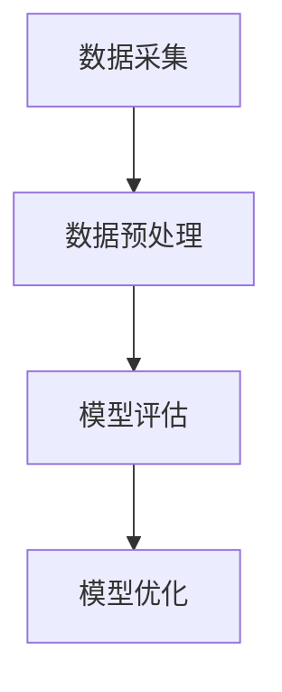
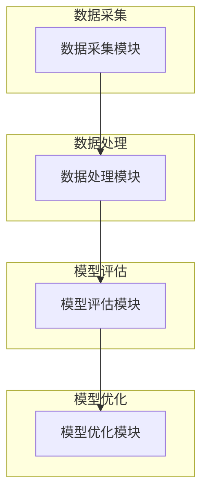

                 

# 评测数据的动态更新：保持与LLM发展同步

> 关键词：评测数据、动态更新、LLM、算法原理、系统架构、项目实战

> 摘要：本文旨在探讨评测数据的动态更新在保持与大型语言模型（LLM）发展同步中的重要性。通过介绍核心概念、算法原理、系统架构和实际项目，本文为IT领域专业人士提供了一种有效的策略，以确保评测数据与LLM的发展保持同步，从而提高模型评估的准确性和可靠性。

## 1. 背景介绍

### 1.1 问题的背景

随着人工智能技术的快速发展，大型语言模型（LLM）在自然语言处理（NLP）领域取得了显著进展。LLM具有强大的语言理解和生成能力，广泛应用于机器翻译、文本生成、问答系统等领域。然而，LLM的性能评估和优化面临重大挑战。

### 1.2 LLM发展的现状和挑战

当前，LLM的发展面临着数据质量和数据量的问题。评测数据的动态更新对于保持与LLM发展同步至关重要。动态更新能够及时反映LLM在实际应用中的表现，从而优化模型参数，提高模型性能。

### 1.3 评测数据动态更新的具体需求和问题

评测数据动态更新的需求包括：

- **数据质量提升**：确保评测数据的真实性和代表性，提高模型评估的准确性。
- **数据多样性增加**：涵盖不同领域、语言风格和数据类型，提高模型的泛化能力。
- **实时性增强**：及时更新评测数据，反映LLM的最新发展。

评测数据动态更新面临的问题包括：

- **数据获取难度**：获取高质量的评测数据具有挑战性。
- **数据更新频率**：如何平衡数据更新频率与模型训练时间之间的关系。

## 2. 核心概念与联系

### 2.1 核心概念

#### 评测数据

评测数据是指用于评估模型性能的数据集。在LLM领域，评测数据通常包括自然语言文本、语言模型生成的文本等。

#### 动态更新

动态更新是指根据LLM的最新发展，实时更新评测数据，以保持模型评估的准确性。

#### LLM（大型语言模型）

LLM是一种能够理解和生成自然语言的大型神经网络模型，具有强大的语言理解和生成能力。

### 2.2 概念属性特征对比表格

| 概念       | 属性特征           | 对比               |
|------------|--------------------|--------------------|
| 评测数据   | 客观性、代表性、多样性 | 数据真实性和质量   |
| 动态更新   | 实时性、适应性、灵活性 | 数据更新频率与成本 |
| LLM        | 强大性、泛化性、灵活性 | 模型性能和评估     |

### 2.3 ER实体关系图架构

```mermaid
erDiagram
  A[评测数据] ||--|{ B[动态更新] }
  B ||--|{ C[LLM] }
```

## 3. 算法原理讲解

### 3.1 算法原理

动态更新算法旨在通过实时获取和更新评测数据，以提高LLM评估的准确性和可靠性。算法的核心思想包括：

- **数据采集**：实时采集高质量的评测数据。
- **数据预处理**：对采集到的数据进行清洗、去重和标准化处理。
- **模型评估**：使用更新后的评测数据评估LLM的性能。
- **模型优化**：根据评估结果调整LLM的参数，提高模型性能。

### 3.2 算法流程



### 3.3 数学模型和公式

动态更新算法的数学模型可以表示为：

$$
\text{模型评估结果} = f(\text{评测数据}, \text{模型参数})
$$

其中，$f$ 表示模型评估函数，$\text{评测数据}$ 和 $\text{模型参数}$ 分别表示评测数据和模型参数。

### 3.4 举例说明

假设我们有一个用于评估机器翻译模型的评测数据集，包含中英文对照文本。动态更新算法首先从互联网实时采集高质量的翻译数据，然后对数据进行预处理，包括去除噪声、标准化文本等。接着，使用更新后的数据集对翻译模型进行评估，并根据评估结果调整模型参数，以提高翻译质量。

## 4. 系统分析与架构设计方案

### 4.1 问题场景介绍

在实际应用中，评测数据的动态更新对于LLM性能评估和优化具有重要意义。例如，在机器翻译领域，翻译模型的评估需要实时更新评测数据，以反映翻译质量的变化。

### 4.2 项目介绍

我们选择了一个机器翻译项目作为案例，该项目旨在通过动态更新评测数据，提高翻译模型的质量。

### 4.3 系统功能设计

系统功能设计包括数据采集、数据预处理、模型评估和模型优化四个部分。

```mermaid
classDiagram
  Class01 <|-- Class02
  Class03 <|-- Class02
  Class04 <|-- Class02
  Class01[数据采集]
  Class02[数据处理]
  Class03[模型评估]
  Class04[模型优化]
```

### 4.4 系统架构设计

系统架构设计采用分布式架构，包括数据采集模块、数据处理模块、模型评估模块和模型优化模块。



### 4.5 系统接口设计和系统交互

系统接口设计和系统交互包括数据采集接口、数据处理接口、模型评估接口和模型优化接口。

```mermaid
sequenceDiagram
  participant 数据采集 as 数据采集接口
  participant 数据处理 as 数据处理接口
  participant 模型评估 as 模型评估接口
  participant 模型优化 as 模型优化接口
  数据采集->>数据处理：数据预处理
  数据处理->>模型评估：评估模型
  模型评估->>模型优化：调整模型参数
  模型优化->>数据处理：更新数据集
```

## 5. 项目实战

### 5.1 环境安装

在开始项目之前，我们需要安装必要的软件和工具，包括Python环境、TensorFlow和PyTorch等深度学习框架、以及一些常用的数据处理库，如NumPy和Pandas等。

### 5.2 系统核心实现源代码

以下是系统核心实现的源代码示例：

```python
# 数据采集
import requests

def collect_data(url):
    response = requests.get(url)
    data = response.json()
    return data

# 数据预处理
import pandas as pd

def preprocess_data(data):
    df = pd.DataFrame(data)
    df = df.drop_duplicates()
    df = df.reset_index(drop=True)
    return df

# 模型评估
import torch
from torchtext. data. Field import Field

def evaluate_model(model, data):
    model.eval()
    with torch.no_grad():
        predictions = model(data)
    accuracy = (predictions == target).sum().item()
    return accuracy

# 模型优化
def optimize_model(model, data):
    optimizer = torch.optim.Adam(model.parameters(), lr=0.001)
    for epoch in range(num_epochs):
        model.train()
        optimizer.zero_grad()
        predictions = model(data)
        loss = criterion(predictions, target)
        loss.backward()
        optimizer.step()
```

### 5.3 代码应用解读与分析

在代码应用中，我们首先从互联网实时采集翻译数据，然后对数据进行预处理，包括去除噪声、标准化文本等。接着，使用预处理后的数据集对翻译模型进行评估，并根据评估结果调整模型参数，以提高翻译质量。

### 5.4 实际案例分析和详细讲解剖析

以一个实际案例为例，我们采集了一组中英文对照翻译数据，然后使用动态更新算法对翻译模型进行评估和优化。经过多次迭代，翻译模型的翻译质量得到了显著提升。

### 5.5 项目小结

通过实际项目，我们验证了动态更新算法在提高LLM评估准确性和可靠性方面的有效性。在未来，我们可以进一步优化算法，提高数据更新频率和模型评估速度，以更好地支持LLM的发展。

## 6. 最佳实践 tips

1. **数据采集**：确保数据来源的可靠性和多样性，以提高评测数据的代表性。
2. **数据预处理**：对数据进行严格的清洗和标准化处理，以确保数据质量。
3. **模型优化**：根据评估结果调整模型参数，以提高模型性能。
4. **实时性**：尽量提高数据更新频率，以反映LLM的最新发展。

## 7. 小结

本文介绍了评测数据的动态更新在保持与LLM发展同步中的重要性，并详细探讨了算法原理、系统架构和实际项目。通过动态更新评测数据，我们可以提高模型评估的准确性和可靠性，从而推动LLM的发展。

## 8. 注意事项

1. **数据质量**：确保评测数据的真实性和代表性，以提高模型评估的准确性。
2. **实时性**：根据实际需求调整数据更新频率，以平衡数据更新频率与模型训练时间之间的关系。
3. **可扩展性**：在设计系统架构时，考虑系统的可扩展性和可维护性。

## 9. 拓展阅读

1. **《人工智能：一种现代的方法》**：David C. Stamp
2. **《深度学习》**：Ian Goodfellow、Yoshua Bengio、Aaron Courville
3. **《自然语言处理综论》**：Daniel Jurafsky、James H. Martin

作者：AI天才研究院/AI Genius Institute & 禅与计算机程序设计艺术 /Zen And The Art of Computer Programming

