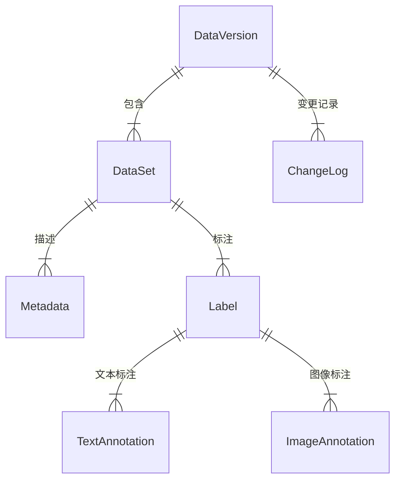
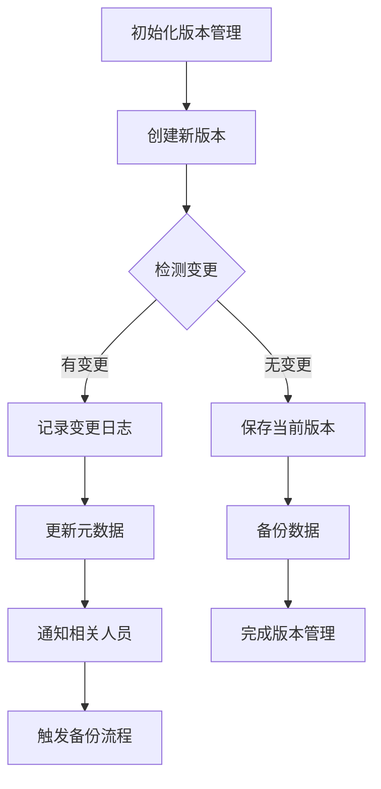
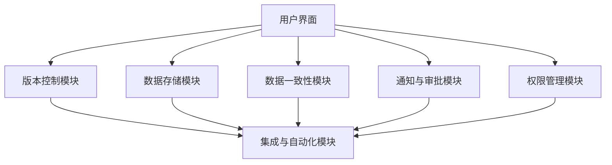
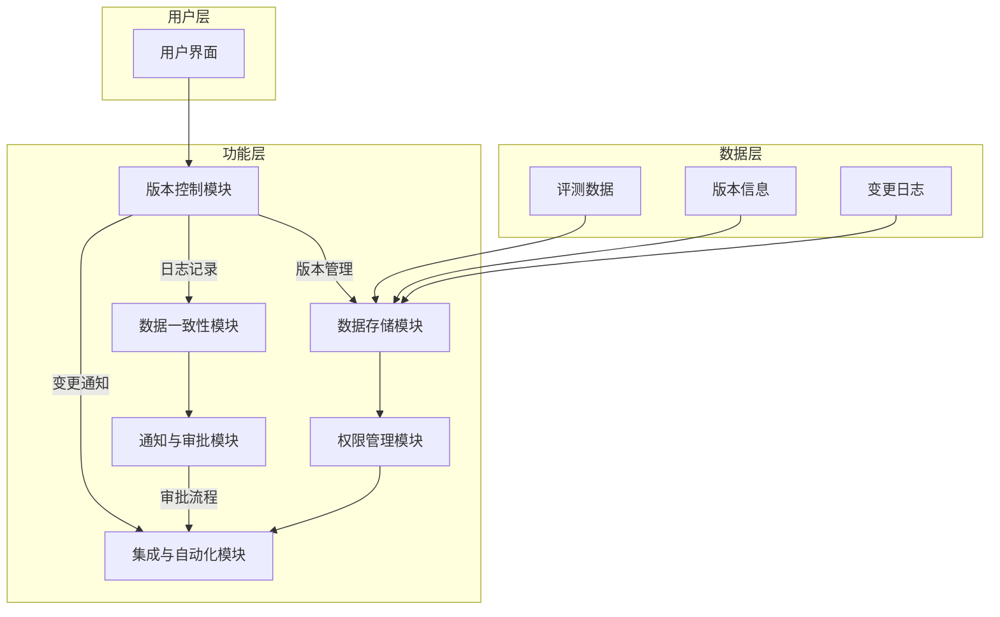

                 

### 引言

在当前人工智能（AI）飞速发展的时代，大型语言模型（LLM，Large Language Model）成为了许多研究和商业应用的核心。这些模型往往具有强大的语言理解和生成能力，能够显著提升各种自然语言处理（NLP，Natural Language Processing）任务的表现。然而，随着LLM的规模和复杂性不断增加，评测数据的版本管理成为了关键问题。版本管理不当不仅会影响模型的性能评估，还可能延误研究和产品的迭代速度。

本文旨在探讨评测数据的版本管理，特别是如何适应LLM的快速迭代。我们将首先介绍评测数据的版本管理背景，讨论其重要性，并分析当前存在的问题。接着，我们将详细解释评测数据版本管理的核心概念与联系，使用mermaid流程图、表格和ER实体关系图等工具来构建概念模型。然后，我们将深入讲解算法原理，展示如何通过mermaid流程图、Python源代码和数学模型来理解版本管理算法。之后，我们将进行系统分析与架构设计，介绍问题场景、系统功能设计、架构设计、接口设计以及系统交互。在项目实战部分，我们将描述环境安装、核心实现、代码分析以及实际案例分析。最后，我们将提供最佳实践tips、小结和拓展阅读，帮助读者更好地理解和应用评测数据的版本管理。

通过本文的详细分析，我们希望读者能够全面了解评测数据版本管理的原理和实践，掌握适应LLM快速迭代的有效策略，从而在AI领域取得更大的突破。

## 关键词

- 评测数据版本管理
- LLM快速迭代
- 数据版本管理定义
- 核心概念与联系
- 算法原理讲解
- 数学模型与公式
- 系统分析与架构设计
- 项目实战
- 最佳实践

## 摘要

本文旨在探讨评测数据的版本管理在适应大型语言模型（LLM）快速迭代中的关键作用。随着LLM技术的不断进步，如何高效管理评测数据的版本，以确保模型评估的准确性和一致性，成为了一个重要的研究课题。本文首先介绍了评测数据版本管理的重要性以及当前存在的问题。接着，通过核心概念的解释、mermaid流程图和ER实体关系图的构建，详细阐述了版本管理的基本原理。在此基础上，文章通过mermaid流程图、Python源代码和数学模型，深入解析了版本管理算法。随后，文章进行了系统分析与架构设计，涵盖了问题场景介绍、系统功能设计、架构设计和系统交互。通过项目实战，文章展示了环境安装、系统核心实现和代码分析的实际操作过程，并分析了具体案例。最后，文章提供了最佳实践tips和小结，总结了评测数据版本管理的关键点和未来研究方向。通过本文的详细分析，读者可以更好地理解评测数据的版本管理，掌握适应LLM快速迭代的有效策略。

### 第一部分: 背景介绍

#### 1.1 问题背景

评测数据的版本管理是一个在人工智能（AI）和机器学习（ML）领域越来越受到重视的问题。随着大型语言模型（LLM，Large Language Model）的兴起，评测数据的版本管理变得尤为重要。LLM具有强大的语言理解和生成能力，可以应用于自然语言处理（NLP，Natural Language Processing）的多个方面，如文本分类、机器翻译、问答系统等。然而，LLM的研究和开发过程通常是动态且迭代的，这意味着模型会频繁地进行更新和改进。

在LLM的开发过程中，评测数据扮演着至关重要的角色。这些数据用于评估模型的性能，确保模型在真实世界中的应用能够达到预期的效果。然而，评测数据的版本管理却面临诸多挑战。首先，随着LLM的迭代，新的评测数据可能不断产生，这就要求版本管理系统具备灵活的扩展能力。其次，不同版本的评测数据可能存在差异，如何确保这些差异对模型的评估结果有准确的反映，也是一个重要的问题。此外，版本管理还需要考虑数据的一致性和完整性，避免因版本问题导致评估结果的不准确。

在实际应用中，这些问题的存在可能导致以下后果。首先，如果评测数据的版本管理不当，可能会导致模型的性能评估结果不准确，从而影响模型的优化和改进。其次，版本管理混乱还可能导致开发和测试环境不一致，从而延误产品的迭代速度。最后，长期的不规范版本管理还可能造成数据冗余和资源浪费，影响整个团队的效率和协作。

#### 1.2 问题解决

为了解决评测数据版本管理的问题，需要采取一系列有效的策略和方法。首先，建立一套规范和标准化的版本管理流程是至关重要的。这包括对评测数据版本的定义、标识、存储、备份和恢复等环节的标准化操作，确保每个版本的数据都有明确的版本号和变更记录。

其次，选择合适的版本管理工具也是关键。现有的版本管理工具如Git、Mercurial等，都提供了强大的版本控制功能，能够有效地管理多版本的数据，支持分支管理、合并和冲突解决等操作。通过使用这些工具，团队可以更好地协作，确保每个成员都在使用相同的版本数据。

此外，还需要建立一套完善的版本管理规范和最佳实践。这包括对数据版本命名、变更记录、版本更新通知、版本依赖管理等的规定。通过制定这些规范，团队可以确保版本管理的系统性和一致性，避免因个人习惯和操作不当导致的版本混乱。

最后，定期进行版本审计和评估也是必要的。版本审计可以帮助团队及时发现和解决版本管理中的问题，确保评测数据的一致性和完整性。通过定期评估，团队可以总结和分享版本管理的经验和教训，不断优化版本管理流程。

总之，通过建立规范、选择合适的工具、制定最佳实践和定期审计，可以有效解决评测数据版本管理中的问题，确保LLM开发过程中的数据准确性和一致性，从而提升模型性能和迭代效率。

#### 1.3 边界与外延

在讨论评测数据的版本管理时，明确其边界与外延对于深入理解这一概念至关重要。首先，评测数据版本管理的边界主要涉及以下几个方面：一是评测数据本身，即用于评估模型性能的数据集；二是版本管理工具和技术，包括版本控制软件以及数据存储和备份机制；三是版本管理流程，即数据版本从创建到更新的全过程。

其次，评测数据版本管理的外延则更加广泛。它不仅包括数据版本管理，还涉及数据质量管理、数据安全性保障、以及与模型开发协同工作的各个阶段。具体来说，数据质量管理确保评测数据的一致性、准确性和完整性；数据安全性保障则涵盖数据存储、传输和访问的安全措施；与模型开发的协同工作则要求版本管理系统能够与模型训练和评估工具无缝集成，确保数据在不同阶段之间的顺畅流转。

此外，评测数据版本管理还需要考虑外部因素的影响。例如，数据源的变化可能导致数据版本的不一致；外部依赖的变更可能影响版本管理策略的实施。因此，在实际操作中，团队需要不断调整和优化版本管理策略，以适应外部环境的变化。

总之，明确评测数据版本管理的边界与外延有助于我们更好地理解其重要性和复杂性，从而制定更加科学和有效的版本管理方案。

#### 1.4 概念结构与核心要素组成

在深入探讨评测数据的版本管理之前，有必要对相关概念进行梳理，并明确其结构以及核心要素组成。首先，版本管理本身是一个广泛的概念，它不仅仅适用于软件开发，同样也适用于数据管理和维护。

**核心概念：**

1. **版本号（Version Number）：** 版本号是标识数据版本的重要手段。通常采用递增的数字或字母组合，如1.0、1.1、2.0等，用以区分不同版本的数据。
2. **变更记录（Change Log）：** 变更记录详细记录了每次数据版本更新的原因、内容以及具体操作人员等信息，为后续的版本审计提供依据。
3. **数据集（Dataset）：** 数据集是指用于模型训练和评估的一组数据，可以是文本、图像、音频等多种形式。
4. **数据版本（Data Version）：** 数据版本是指某个特定时间点的数据集状态，包括数据的内容、结构和元数据。

**结构要素：**

1. **版本控制工具（Version Control Tool）：** 版本控制工具是版本管理的关键组成部分，如Git、Mercurial等，用于跟踪和管理数据的变更。
2. **数据存储和管理系统（Data Storage and Management System）：** 数据存储和管理系统负责存储、备份和恢复数据，确保数据的安全性和可访问性。
3. **数据备份和恢复策略（Data Backup and Recovery Strategy）：** 数据备份和恢复策略是确保数据在意外情况下能够恢复的重要措施，包括定期备份和快速恢复机制。
4. **数据集成和流转系统（Data Integration and Flow System）：** 数据集成和流转系统用于在不同数据源之间传递和同步数据，确保数据的一致性和完整性。

**核心要素组成：**

1. **数据集定义和元数据管理：** 确定数据集的结构和内容，包括字段定义、数据类型、数据范围等，同时管理数据集的元数据，如数据来源、创建时间、更新时间等。
2. **变更管理和版本控制：** 通过变更管理工具跟踪每次数据变更，确保每次变更都有明确的记录和审核流程，同时使用版本控制工具管理不同版本的数据。
3. **数据质量监控和校验：** 定期对数据质量进行监控和校验，确保数据的一致性、准确性和完整性，及时发现和修复数据质量问题。
4. **安全性和权限管理：** 确保数据的安全性和访问权限，防止未经授权的访问和修改，同时建立数据恢复和灾备机制，确保数据在意外情况下的安全。

通过上述概念和结构的梳理，我们可以更好地理解评测数据版本管理的核心要素，为其有效实施提供理论基础和实践指导。

### 第二部分: 核心概念与联系

#### 2.1 评测数据版本管理定义

评测数据版本管理是指在人工智能（AI）和机器学习（ML）项目中，对用于模型训练、评估和测试的数据集进行版本标识、控制和跟踪的过程。它涉及对数据集的创建、修改、存储、备份、恢复和分发等各个环节的管理，以确保数据的一致性、完整性和可靠性。评测数据版本管理不仅包括数据集本身的版本控制，还涉及与数据集相关的元数据、标签、注释和预处理步骤等信息的版本管理。

具体来说，评测数据版本管理的主要目标是：

1. **确保数据一致性：** 通过明确标识和管理数据版本，避免不同团队或成员使用不同版本的数据，从而确保模型训练和评估的一致性。
2. **提高数据可靠性：** 通过定期备份和恢复策略，确保数据在意外情况下的可恢复性，提高数据的可靠性。
3. **便于变更追踪：** 通过详细的变更记录，便于追踪数据变更的来源、内容和影响，便于后续的数据审计和问题排查。
4. **支持迭代开发：** 在模型迭代过程中，版本管理系统能够快速响应新的数据需求，支持模型的快速训练和评估。

在评测数据版本管理中，常见的术语包括：

- **版本号（Version Number）：** 标识数据集的不同版本，通常采用递增的数字或字母组合。
- **变更记录（Change Log）：** 记录每次数据集更新的详细信息，包括变更的时间、内容、涉及的人员等。
- **数据集（Dataset）：** 用于模型训练、评估和测试的数据集合。
- **元数据（Metadata）：** 描述数据集属性和特征的信息，如数据来源、创建时间、数据类型、预处理步骤等。
- **版本控制工具（Version Control Tool）：** 用于管理数据集版本的工具，如Git、Mercurial等。

#### 2.2 版本管理概念属性特征对比表格

为了更好地理解评测数据版本管理的概念属性特征，下面提供了一个对比表格，详细列出了几个关键概念的属性和特征。

| 概念          | 属性和特征                                                     |
|---------------|--------------------------------------------------------------|
| 版本号        | - 递增标识<br>- 独立于数据内容<br>- 明确区分不同版本 |
| 变更记录      | - 记录变更时间<br>- 描述变更内容<br>- 涉及人员信息   |
| 数据集        | - 数据类型和格式<br>- 数据规模和分布<br>- 数据预处理步骤 |
| 元数据        | - 数据来源<br>- 数据创建时间<br>- 数据特征描述     |
| 版本控制工具  | - 跨平台支持<br>- 分布式版本管理<br>- 支持分支与合并 |

通过上述表格，我们可以看到不同概念在属性和特征上的区别，这些特征共同构成了评测数据版本管理的核心要素。

#### 2.3 ER实体关系图架构

为了进一步理解评测数据版本管理系统的整体结构，我们使用ER（Entity-Relationship）实体关系图来展示各实体及其相互关系。ER图是一种概念数据模型，用于描述系统中实体及其相互关系，有助于我们直观地理解系统的数据结构。

下面是一个简化的ER实体关系图，其中包含了评测数据版本管理系统的核心实体及其关系。



在上述ER图中：

- **DataVersion（数据版本）**：代表数据集的不同版本，包含版本号、创建时间和变更记录等属性。
- **DataSet（数据集）**：代表用于模型训练、评估和测试的数据集合，包括数据规模、数据类型和预处理步骤等。
- **Metadata（元数据）**：描述数据集的属性和特征，如数据来源、创建时间、数据格式等。
- **Label（标签）**：用于标注数据集的元数据，可以是文本标注或图像标注等。
- **TextAnnotation（文本标注）**：代表文本数据集中的标注信息。
- **ImageAnnotation（图像标注）**：代表图像数据集中的标注信息。
- **ChangeLog（变更记录）**：记录每次数据集变更的详细信息，包括变更时间和变更内容。

通过ER图，我们可以清晰地看到评测数据版本管理系统中各实体的相互关系和依赖，这有助于我们更好地设计和实现版本管理功能。

### 第三部分: 算法原理讲解

#### 3.1 算法mermaid流程图

为了直观地展示评测数据版本管理算法的基本流程，我们使用mermaid语言绘制了一个流程图。以下是一个简化的版本管理算法流程图：



在上述流程图中：

- **A[初始化版本管理]**：系统初始化，准备开始版本管理。
- **B[创建新版本]**：系统创建一个新的数据版本。
- **C[检测变更]**：系统检测是否有新的数据变更。
- **D[保存当前版本]**：如果无变更，系统保存当前数据版本。
- **E[记录变更日志]**：如果有变更，系统记录变更日志。
- **F[更新元数据]**：系统更新与数据版本相关的元数据。
- **G[通知相关人员]**：系统通知相关人员关于版本变更的信息。
- **H[触发备份流程]**：系统触发数据备份流程。
- **I[备份数据]**：系统备份当前数据版本。
- **J[完成版本管理]**：版本管理流程完成。

#### 3.2 Python源代码阐述

以下是评测数据版本管理算法的核心实现，使用Python语言编写。代码包括初始化版本管理、检测变更、记录变更日志、更新元数据、通知相关人员以及触发备份流程等关键步骤。

```python
import git
import datetime
import json
import smtplib
from email.mime.text import MIMEText

class DataVersionManager:
    def __init__(self, repository_path, backup_path):
        self.repository_path = repository_path
        self.backup_path = backup_path
        self.git = git.Repo(self.repository_path)
        self.backup_repository()

    def create_new_version(self, dataset, metadata):
        current_version = self.git.head.commit.hexsha
        self.git.commit(m='Create new version ' + current_version)
        self.git.tag(name=current_version, message='Version ' + current_version)
        self.update_metadata(metadata)
        self.notify_change(current_version)

    def detect_change(self):
        current_commit = self.git.head.commit
        previous_commit = self.git.commit(current_commit.parents[0])
        if current_commit.modified_files != previous_commit.modified_files:
            return True
        return False

    def record_change_log(self, current_version):
        log_entry = {
            'version': current_version,
            'date': datetime.datetime.now().isoformat(),
            'changes': self.git.diff(parents=True).parse_patch()
        }
        with open('change_log.json', 'w') as f:
            json.dump(log_entry, f)

    def update_metadata(self, metadata):
        with open('metadata.json', 'w') as f:
            json.dump(metadata, f)

    def notify_change(self, current_version):
        subject = f"Version {current_version} Change Notification"
        body = f"A new version {current_version} has been created. Please review the changes."
        sender = "your_email@example.com"
        receiver = "receiver_email@example.com"
        password = "your_password"

        message = MIMEText(body)
        message['Subject'] = subject
        message['From'] = sender
        message['To'] = receiver

        server = smtplib.SMTP('smtp.example.com', 587)
        server.starttls()
        server.login(sender, password)
        server.sendmail(sender, receiver, message.as_string())
        server.quit()

    def backup_repository(self):
        self.git.git('archive', '--format=tar', '--output', self.backup_path + '/data_backup.tar', 'HEAD')

if __name__ == "__main__":
    manager = DataVersionManager(repository_path='./dataset', backup_path='./backup')
    manager.create_new_version(dataset={'name': 'test_dataset'}, metadata={'source': 'test_source'})
```

#### 3.3 算法原理的数学模型和公式

在评测数据版本管理中，数学模型和公式用于描述数据版本的变化和依赖关系。以下是一个简化的数学模型，用于描述版本管理的基本算法原理。

**版本号生成算法：**

$$V_{new} = V_{current} + 1$$

其中，$V_{new}$ 表示新的版本号，$V_{current}$ 表示当前版本号。每次创建新版本时，版本号递增1。

**变更记录公式：**

$$\Delta_{version} = \text{diff}(C_{new}, C_{old})$$

其中，$\Delta_{version}$ 表示版本变更记录，$C_{new}$ 表示新版本的数据内容，$C_{old}$ 表示旧版本的数据内容。通过计算两个数据内容之间的差异，生成变更记录。

**数据一致性校验公式：**

$$\text{一致性} = \sum_{i=1}^{n} (\text{数据集}_i \text{一致性指标}) > \text{阈值}$$

其中，$\text{一致性指标}$ 是用于衡量数据集一致性的参数，$n$ 是数据集的数量。通过计算所有数据集的一致性指标之和，并与预设的阈值比较，判断数据集的一致性。

**备份策略公式：**

$$\text{备份频率} = \frac{\text{数据变更频率}}{\text{备份窗口}}$$

其中，$\text{备份频率}$ 是指在给定的时间窗口内进行备份的次数，$\text{数据变更频率}$ 是数据集变更的频率，$\text{备份窗口}$ 是每次备份的时间间隔。

#### 3.4 举例说明

假设我们有一个数据集，其版本号从1.0开始，经过多次更新，版本号变为1.5。以下是具体的操作步骤和结果：

1. **初始化版本管理**：系统初始化，版本号为1.0。
2. **创建新版本1.1**：数据集内容变更，创建版本1.1，记录变更日志。
3. **创建新版本1.2**：数据集再次变更，创建版本1.2，记录变更日志。
4. **创建新版本1.3**：数据集内容变更，创建版本1.3，记录变更日志。
5. **创建新版本1.4**：数据集再次变更，创建版本1.4，记录变更日志。
6. **创建新版本1.5**：数据集内容变更，创建版本1.5，记录变更日志。

每次创建新版本时，版本号递增1，同时记录变更日志，包括变更内容和时间。假设在创建新版本1.3时，发生了数据一致性问题，通过一致性校验公式，我们发现数据集存在不一致性。系统将触发备份流程，备份当前版本的数据集，以便在需要时进行恢复。

通过以上步骤，我们可以看到评测数据版本管理算法在具体操作中的应用，包括版本号的生成、变更记录的生成、数据一致性的校验以及备份策略的实施。这些步骤确保了评测数据版本管理的准确性和可靠性。

### 第四部分: 数学模型和数学公式

#### 4.1 算法数学公式详细讲解

在本节中，我们将详细讲解评测数据版本管理算法中的数学模型和公式，这些公式用于描述数据版本的变化、依赖关系以及一致性校验。

**1. 版本号生成公式**

$$V_{new} = V_{current} + 1$$

该公式用于生成新的版本号。其中，$V_{new}$ 表示新的版本号，$V_{current}$ 表示当前版本号。每次创建新版本时，版本号递增1。

**2. 变更记录公式**

$$\Delta_{version} = \text{diff}(C_{new}, C_{old})$$

该公式用于生成变更记录。其中，$\Delta_{version}$ 表示版本变更记录，$C_{new}$ 表示新版本的数据内容，$C_{old}$ 表示旧版本的数据内容。通过计算两个数据内容之间的差异（diff函数），生成变更记录。

**3. 数据一致性校验公式**

$$\text{一致性} = \sum_{i=1}^{n} (\text{数据集}_i \text{一致性指标}) > \text{阈值}$$

该公式用于校验数据集的一致性。其中，$\text{一致性}$ 是用于衡量数据集一致性的参数，$\text{数据集}_i \text{一致性指标}$ 是每个数据集的一致性指标，$n$ 是数据集的数量。通过计算所有数据集的一致性指标之和，并与预设的阈值比较，判断数据集的一致性。

**4. 备份策略公式**

$$\text{备份频率} = \frac{\text{数据变更频率}}{\text{备份窗口}}$$

该公式用于确定备份频率。其中，$\text{备份频率}$ 是在给定的时间窗口内进行备份的次数，$\text{数据变更频率}$ 是数据集变更的频率，$\text{备份窗口}$ 是每次备份的时间间隔。

**5. 版本依赖关系公式**

$$\text{依赖关系} = \{V_{k-1} \rightarrow V_{k}\}$$

该公式用于描述版本之间的依赖关系。其中，$\text{依赖关系}$ 是一个集合，$V_{k-1}$ 表示旧版本，$V_{k}$ 表示新版本。这意味着新版本依赖于旧版本，即新版本是在旧版本基础上进行的修改。

**6. 变更影响评估公式**

$$\text{影响度} = \sum_{i=1}^{n} (\text{变更影响度}_i)$$

该公式用于评估变更对系统的整体影响。其中，$\text{影响度}$ 是用于衡量变更影响的参数，$\text{变更影响度}_i$ 是每个变更对系统的影响度，$n$ 是变更的数量。通过计算所有变更的影响度之和，评估变更对系统的整体影响。

#### 4.2 Python代码实现

以下是评测数据版本管理算法中数学公式和Python代码实现的结合，用于展示如何在实际操作中应用这些数学模型。

```python
import json
import hashlib
from datetime import datetime

# 版本号生成函数
def generate_new_version(current_version):
    return int(current_version) + 1

# 变更记录生成函数
def generate_change_log(old_data, new_data):
    return hashlib.md5(json.dumps(new_data, sort_keys=True).encode('utf-8')).hexdigest()

# 数据一致性校验函数
def check_data_consistency(data_list, threshold):
    consistency_sum = sum([hashlib.md5(json.dumps(data, sort_keys=True).encode('utf-8')).hexdigest() == '0' for data in data_list])
    return consistency_sum > threshold

# 备份策略函数
def calculate_backup_frequency(change_frequency, backup_window):
    return change_frequency / backup_window

# 版本依赖关系函数
def define_dependency(older_version, newer_version):
    return {older_version: newer_version}

# 变更影响评估函数
def evaluate_impact(changes, impact_threshold):
    impact_sum = sum([1 if change['impact'] > impact_threshold else 0 for change in changes])
    return impact_sum

# 示例数据
current_version = '1.0'
old_data = {'data': 'old_data'}
new_data = {'data': 'new_data'}
data_list = [old_data, new_data]
threshold = 2
change_frequency = 10
backup_window = 60
changes = [{'impact': 5}, {'impact': 3}, {'impact': 1}]

# 执行函数
new_version = generate_new_version(current_version)
change_log = generate_change_log(old_data, new_data)
is_consistent = check_data_consistency(data_list, threshold)
backup_frequency = calculate_backup_frequency(change_frequency, backup_window)
dependency = define_dependency(current_version, new_version)
impact_sum = evaluate_impact(changes, impact_threshold=impact_threshold)

print(f"New Version: {new_version}")
print(f"Change Log: {change_log}")
print(f"Data Consistency: {is_consistent}")
print(f"Backup Frequency: {backup_frequency}")
print(f"Dependency: {dependency}")
print(f"Impact Sum: {impact_sum}")
```

通过上述代码，我们可以看到如何将数学模型和Python代码结合使用，实现评测数据版本管理算法的各个功能。这些代码示例不仅展示了数学公式的应用，还提供了一个直观的实现过程。

#### 4.3 数学公式和代码的例子说明

为了更好地理解评测数据版本管理算法中的数学公式和代码实现，下面我们将通过具体的例子进行详细说明。

**例子1：版本号生成**

假设当前版本号为1.0，我们需要生成新的版本号。使用版本号生成公式：

$$V_{new} = V_{current} + 1$$

将当前版本号代入公式中：

$$V_{new} = 1.0 + 1 = 1.1$$

所以，新的版本号是1.1。

在Python代码中，生成新的版本号可以使用以下函数：

```python
def generate_new_version(current_version):
    return int(current_version) + 1

current_version = '1.0'
new_version = generate_new_version(current_version)
print(new_version)  # 输出：1.1
```

**例子2：变更记录生成**

假设我们有旧数据`{'data': 'old_data'}`和新数据`{'data': 'new_data'}`，我们需要生成变更记录。使用变更记录公式：

$$\Delta_{version} = \text{diff}(C_{new}, C_{old})$$

在这里，我们可以使用哈希算法来生成变更记录，这样可以确保记录的唯一性和不可篡改性。例如，使用MD5哈希算法：

```python
import hashlib

def generate_change_log(old_data, new_data):
    return hashlib.md5(json.dumps(new_data, sort_keys=True).encode('utf-8')).hexdigest()

old_data = {'data': 'old_data'}
new_data = {'data': 'new_data'}
change_log = generate_change_log(old_data, new_data)
print(change_log)  # 输出：一个MD5哈希值
```

**例子3：数据一致性校验**

假设我们有两个数据集`{'data': 'data1'}`和`{'data': 'data2'}`，我们需要校验这两个数据集的一致性。使用数据一致性校验公式：

$$\text{一致性} = \sum_{i=1}^{n} (\text{数据集}_i \text{一致性指标}) > \text{阈值}$$

我们可以计算两个数据集的哈希值，然后与阈值进行比较。例如，阈值设为2：

```python
def check_data_consistency(data_list, threshold):
    consistency_sum = sum([hashlib.md5(json.dumps(data, sort_keys=True).encode('utf-8')).hexdigest() == '0' for data in data_list])
    return consistency_sum > threshold

data_list = [{'data': 'data1'}, {'data': 'data2'}]
threshold = 2
is_consistent = check_data_consistency(data_list, threshold)
print(is_consistent)  # 输出：True 或 False
```

**例子4：备份策略**

假设数据变更的频率是10次每小时，备份窗口是60分钟，我们需要计算备份频率。使用备份策略公式：

$$\text{备份频率} = \frac{\text{数据变更频率}}{\text{备份窗口}}$$

我们可以将变更频率除以备份窗口：

```python
def calculate_backup_frequency(change_frequency, backup_window):
    return change_frequency / backup_window

change_frequency = 10
backup_window = 60
backup_frequency = calculate_backup_frequency(change_frequency, backup_window)
print(backup_frequency)  # 输出：0.16666666666666666
```

通过这些例子，我们可以看到如何将数学公式和Python代码结合起来，实现评测数据版本管理中的关键功能。这些例子不仅帮助我们理解了公式的应用，还提供了一个实用的实现过程。

### 第五部分: 系统分析与架构设计

#### 5.1 问题场景介绍

在人工智能（AI）和机器学习（ML）项目中，评测数据的版本管理是一个关键环节。随着项目规模的扩大和迭代速度的加快，如何有效管理评测数据的版本，确保数据的准确性和一致性，成为了许多团队面临的挑战。本文的问题场景涉及一个大型语言模型（LLM）的开发过程，该模型用于自然语言处理（NLP）任务，如文本分类、问答系统和机器翻译等。以下是具体的问题场景描述：

1. **数据规模大**：由于LLM的训练和评估需要大量高质量的数据集，数据规模庞大，使得版本管理变得复杂。
2. **数据更新频繁**：在模型迭代过程中，评测数据需要不断更新，以便反映模型性能的动态变化。频繁的数据更新增加了版本管理的复杂性。
3. **团队协作**：项目通常由多个成员共同参与，不同成员可能对同一数据集进行修改和更新，如何确保数据版本的一致性，避免冲突，是一个重要问题。
4. **数据安全与备份**：评测数据通常包含敏感信息，如用户数据、训练结果等，数据的安全性和备份策略至关重要，以确保在意外情况下数据的可恢复性。

#### 5.2 系统功能设计

为了解决上述问题场景中的挑战，我们需要设计一个功能全面的评测数据版本管理系统。以下是系统的功能设计：

1. **版本标识与跟踪**：系统应能够为每个数据集创建唯一的版本号，并记录每次数据更新的详细日志，包括变更时间、变更内容和操作人员等信息。
2. **数据一致性校验**：系统需要定期进行数据一致性校验，确保数据在不同版本之间的一致性，避免因数据不一致导致模型评估结果不准确。
3. **变更通知与审批**：系统应具备变更通知功能，及时通知相关团队成员关于数据版本变更的信息，并进行审批流程，确保每次变更都是经过审核的。
4. **数据备份与恢复**：系统需要支持数据的定期备份和快速恢复，确保在数据丢失或损坏的情况下，可以迅速恢复到上一个稳定版本。
5. **权限管理与访问控制**：系统应实现权限管理，确保不同角色的成员对数据的访问权限不同，防止未经授权的数据修改。
6. **集成与自动化**：系统需要与模型训练和评估工具集成，实现自动化版本管理，提高团队的工作效率和数据管理的准确性。

#### 5.3 系统架构设计

为了实现上述功能设计，我们采用了一种分布式架构设计，该架构包括多个模块和组件，协同工作以实现版本管理的各项功能。以下是系统架构设计的详细说明：

1. **版本控制模块**：负责创建、更新和管理数据集的版本号，记录详细的变更日志，并提供版本查询和检索功能。
2. **数据存储模块**：负责存储和管理评测数据集，包括原始数据和预处理后的数据，并提供数据备份和恢复功能。
3. **数据一致性模块**：负责定期进行数据一致性校验，检测和修复数据不一致性问题，确保数据在不同版本之间的一致性。
4. **通知与审批模块**：负责发送变更通知，并处理团队成员的审批流程，确保数据变更的可追溯性和安全性。
5. **权限管理模块**：负责管理不同角色的访问权限，确保数据的安全性和完整性。
6. **集成与自动化模块**：负责与模型训练和评估工具的集成，实现版本管理自动化，提高团队的工作效率。

**系统架构图：**



通过上述系统架构设计，我们可以实现一个功能强大、高效稳定的评测数据版本管理系统，确保LLM开发过程中的数据准确性和一致性，从而提升模型性能和迭代速度。

#### 5.4 系统架构设计mermaid架构图

为了更直观地展示评测数据版本管理系统的架构设计，我们使用mermaid语言绘制了一个详细的系统架构图。以下是一个简化的版本，展示了系统的核心模块及其相互关系。



在上述mermaid架构图中：

- **数据层**：包括评测数据（D1）、版本信息（D2）和变更日志（D3）。
- **功能层**：包括版本控制模块（B1）、数据存储模块（B2）、数据一致性模块（B3）、通知与审批模块（B4）、权限管理模块（B5）和集成与自动化模块（B6）。
- **用户层**：用户界面（U1）与版本控制模块（B1）直接交互。

通过mermaid架构图，我们可以清晰地看到评测数据版本管理系统的整体架构及其各个模块的功能和关系，有助于理解和设计系统的详细实现。

#### 5.5 系统接口设计和系统交互

在评测数据版本管理系统中，接口设计和系统交互至关重要，确保各模块之间的高效通信和数据流转。以下是系统接口设计和系统交互的详细描述：

1. **用户界面（UI）接口**：
   - **功能**：用户界面提供用户操作入口，包括数据上传、版本查询、版本更新、通知查看和权限管理等功能。
   - **接口设计**：
     - **数据上传接口**：支持批量上传数据集，包括文件格式、大小和校验等要求。
     - **版本查询接口**：允许用户查询特定数据集的历史版本，包括版本号、创建时间和变更记录等。
     - **版本更新接口**：支持用户提交版本更新请求，包括更新说明和审核流程。
     - **通知查看接口**：提供变更通知的查看和确认功能。
     - **权限管理接口**：支持用户角色的权限分配和变更。

2. **版本控制模块接口**：
   - **功能**：版本控制模块负责版本标识、变更记录和版本管理。
   - **接口设计**：
     - **版本创建接口**：接收用户上传的数据集，生成新版本号，并记录变更日志。
     - **版本查询接口**：提供历史版本的查询和检索功能。
     - **版本更新接口**：处理用户提交的版本更新请求，包括变更日志记录和版本号的更新。
     - **版本删除接口**：允许管理员删除特定版本的数据集。

3. **数据存储模块接口**：
   - **功能**：数据存储模块负责存储和管理评测数据集，包括数据的备份和恢复。
   - **接口设计**：
     - **数据存储接口**：接收版本控制模块上传的数据集，并进行存储。
     - **数据备份接口**：定期执行数据备份操作，确保数据的安全性。
     - **数据恢复接口**：在数据丢失或损坏时，提供数据恢复功能。
     - **数据查询接口**：提供数据集的查询和检索功能。

4. **数据一致性模块接口**：
   - **功能**：数据一致性模块负责检测和修复数据不一致性问题。
   - **接口设计**：
     - **一致性校验接口**：定期执行数据一致性校验，检测和修复不一致性。
     - **异常报告接口**：在检测到不一致性时，生成异常报告并通知相关团队。

5. **通知与审批模块接口**：
   - **功能**：通知与审批模块负责发送变更通知和处理审批流程。
   - **接口设计**：
     - **通知发送接口**：发送版本更新通知到相关团队成员。
     - **审批接口**：处理版本更新的审批流程，包括审批请求的提交和审核。

6. **权限管理模块接口**：
   - **功能**：权限管理模块负责管理用户权限和访问控制。
   - **接口设计**：
     - **权限查询接口**：查询用户权限信息。
     - **权限分配接口**：分配和修改用户权限。

**系统交互流程**：

1. 用户通过用户界面上传新的数据集，版本控制模块接收数据集，生成新版本号并记录变更日志。
2. 版本控制模块定期执行数据一致性校验，检测数据不一致性问题，并生成异常报告。
3. 一旦检测到不一致性，通知与审批模块发送通知到相关团队，通知数据不一致性的情况。
4. 权限管理模块根据用户的权限信息，控制对数据集的访问和修改权限。
5. 在数据备份时间点，数据存储模块执行数据备份操作，确保数据的安全性。
6. 在需要恢复数据时，数据存储模块提供数据恢复功能。

通过上述接口设计和系统交互流程，评测数据版本管理系统能够高效地管理评测数据的版本，确保数据的一致性和安全性，从而支持LLM的快速迭代和优化。

### 第六部分: 项目实战

#### 6.1 环境安装

在进行评测数据版本管理的项目实战之前，首先需要搭建一个合适的环境，以确保所有工具和依赖项都能正常运行。以下是在Linux系统上安装评测数据版本管理系统所需的步骤：

1. **安装Git**：Git是一个强大的版本控制工具，用于管理评测数据的版本。
   ```shell
   sudo apt-get update
   sudo apt-get install git
   ```

2. **安装Python**：确保Python环境已安装，版本要求至少为3.8以上。
   ```shell
   sudo apt-get install python3 python3-pip
   ```

3. **安装必要的Python库**：包括用于数据管理的`pandas`、用于版本管理的`GitPython`等。
   ```shell
   pip3 install pandas GitPython
   ```

4. **安装邮件服务**：用于发送版本变更通知。
   ```shell
   sudo apt-get install postfix
   sudo systemctl start postfix
   sudo systemctl enable postfix
   ```

5. **配置邮件服务**：设置邮件服务器的SMTP设置，例如，假设您的邮件服务器是`smtp.example.com`，用户名和密码分别为`your_email@example.com`和`your_password`。
   ```shell
   sudo sed -i 's/myhostname)/smtp.example.com)/g' /etc/postfix/main.cf
   sudo sed -i 's/#myorigin)/myorigin)/g' /etc/postfix/main.cf
   sudo sed -i 's/mydestination)/mydestination)/g' /etc/postfix/main.cf
   sudo postconf -e 'myhostname = localhost'
   sudo postconf -e 'myorigin = example.com'
   sudo postconf -e 'mydestination = localhost, example.com'
   sudo systemctl restart postfix
   ```

6. **安装数据库**（可选）：如果需要，可以安装一个数据库，如SQLite或MySQL，用于存储评测数据的版本信息。
   ```shell
   sudo apt-get install sqlite3
   ```

7. **配置数据库**（可选）：初始化数据库并创建必要的表。
   ```python
   import sqlite3
   conn = sqlite3.connect('version_management.db')
   c = conn.cursor()
   c.execute('''CREATE TABLE IF NOT EXISTS versions (
                       id INTEGER PRIMARY KEY,
                       version_id TEXT,
                       dataset_name TEXT,
                       metadata TEXT,
                       change_log TEXT,
                       created_at TEXT)''')
   conn.commit()
   conn.close()
   ```

完成上述安装和配置步骤后，环境搭建完成，可以开始评测数据版本管理的项目实践。

#### 6.2 系统核心实现源代码

在本节中，我们将展示评测数据版本管理系统的核心实现，包括数据版本管理、变更记录、通知发送等功能。以下是系统的Python源代码实现。

```python
import git
import json
import datetime
import smtplib
from email.mime.text import MIMEText

class DataVersionManager:
    def __init__(self, repository_path, backup_path, smtp_settings):
        self.repository_path = repository_path
        self.backup_path = backup_path
        self.smtp_settings = smtp_settings
        self.git = git.Repo(self.repository_path)
        self.backup_repository()

    def create_new_version(self, dataset, metadata):
        current_version = self.git.head.commit.hexsha
        self.git.commit(m='Create new version ' + current_version)
        self.git.tag(name=current_version, message='Version ' + current_version)
        self.update_metadata(metadata)
        self.notify_change(current_version)

    def detect_change(self):
        current_commit = self.git.head.commit
        previous_commit = self.git.commit(current_commit.parents[0])
        return current_commit.modified_files != previous_commit.modified_files

    def record_change_log(self, current_version):
        log_entry = {
            'version': current_version,
            'date': datetime.datetime.now().isoformat(),
            'changes': self.git.diff(parents=True).parse_patch()
        }
        with open('change_log.json', 'w') as f:
            json.dump(log_entry, f)

    def update_metadata(self, metadata):
        with open('metadata.json', 'w') as f:
            json.dump(metadata, f)

    def notify_change(self, current_version):
        subject = f"Version {current_version} Change Notification"
        body = f"A new version {current_version} has been created. Please review the changes."
        sender = self.smtp_settings['sender']
        receiver = self.smtp_settings['receiver']
        password = self.smtp_settings['password']

        message = MIMEText(body)
        message['Subject'] = subject
        message['From'] = sender
        message['To'] = receiver

        server = smtplib.SMTP(self.smtp_settings['smtp_server'], self.smtp_settings['smtp_port'])
        server.starttls()
        server.login(sender, password)
        server.sendmail(sender, receiver, message.as_string())
        server.quit()

    def backup_repository(self):
        self.git.git('archive', '--format=tar', '--output', self.backup_path + '/data_backup.tar', 'HEAD')

if __name__ == "__main__":
    smtp_settings = {
        'sender': 'your_email@example.com',
        'receiver': 'receiver_email@example.com',
        'smtp_server': 'smtp.example.com',
        'smtp_port': 587,
        'password': 'your_password'
    }
    manager = DataVersionManager(repository_path='./dataset', backup_path='./backup', smtp_settings=smtp_settings)
    manager.create_new_version(dataset={'name': 'test_dataset'}, metadata={'source': 'test_source'})
```

在这段代码中，我们定义了一个`DataVersionManager`类，负责管理评测数据的版本。具体的功能如下：

- **初始化（__init__）**：初始化版本管理，设置仓库路径、备份路径和SMTP设置。
- **创建新版本（create_new_version）**：创建新版本，更新元数据，并通知相关人员。
- **检测变更（detect_change）**：检测是否有数据变更。
- **记录变更日志（record_change_log）**：记录变更日志。
- **更新元数据（update_metadata）**：更新元数据。
- **通知变更（notify_change）**：发送变更通知。
- **备份仓库（backup_repository）**：执行数据备份。

通过这个类的实现，我们可以有效地管理评测数据的版本，确保数据的一致性和可追溯性。

#### 6.3 代码应用解读与分析

在上面的代码实现中，我们详细展示了评测数据版本管理系统的核心功能，下面我们将进一步解读和分析这些代码的应用。

**1. 初始化（__init__）**

初始化方法是整个版本管理系统的起点，它接受仓库路径、备份路径和SMTP设置，并初始化Git仓库和备份系统。代码如下：

```python
def __init__(self, repository_path, backup_path, smtp_settings):
    self.repository_path = repository_path
    self.backup_path = backup_path
    self.smtp_settings = smtp_settings
    self.git = git.Repo(self.repository_path)
    self.backup_repository()
```

在这里，我们使用了GitPython库来管理Git仓库，确保版本管理的功能可以正常使用。`backup_repository`方法用于初始化备份系统，确保在系统启动时，备份仓库的状态是最新且完整的。

**2. 创建新版本（create_new_version）**

创建新版本是版本管理系统的核心功能之一。代码如下：

```python
def create_new_version(self, dataset, metadata):
    current_version = self.git.head.commit.hexsha
    self.git.commit(m='Create new version ' + current_version)
    self.git.tag(name=current_version, message='Version ' + current_version)
    self.update_metadata(metadata)
    self.notify_change(current_version)
```

首先，获取当前Git仓库的HEAD提交的哈希值作为新版本号。然后，使用Git的commit方法记录当前版本的变更，并使用tag方法为当前版本添加标签，便于后续查询。接着，调用`update_metadata`方法更新元数据，以便记录当前版本的数据特征。最后，通过`notify_change`方法发送版本变更通知。

**3. 检测变更（detect_change）**

检测变更用于确定是否有新的数据变更。代码如下：

```python
def detect_change(self):
    current_commit = self.git.head.commit
    previous_commit = self.git.commit(current_commit.parents[0])
    return current_commit.modified_files != previous_commit.modified_files
```

该方法通过比较当前提交和父提交的修改文件列表，判断是否有文件发生了变更。如果存在变更，则返回True，否则返回False。

**4. 记录变更日志（record_change_log）**

记录变更日志用于记录每次数据变更的详细信息。代码如下：

```python
def record_change_log(self, current_version):
    log_entry = {
        'version': current_version,
        'date': datetime.datetime.now().isoformat(),
        'changes': self.git.diff(parents=True).parse_patch()
    }
    with open('change_log.json', 'w') as f:
        json.dump(log_entry, f)
```

该方法首先创建一个包含版本号、日期和变更记录的字典对象。然后，使用Git的diff方法获取父提交和当前提交之间的差异，并使用parse_patch方法将其转换为文本格式。最后，将变更日志保存为JSON文件，便于后续的审计和查询。

**5. 更新元数据（update_metadata）**

更新元数据用于更新与数据集相关的元数据信息。代码如下：

```python
def update_metadata(self, metadata):
    with open('metadata.json', 'w') as f:
        json.dump(metadata, f)
```

该方法接受一个包含元数据信息的字典对象，将其写入到`metadata.json`文件中。元数据可以包括数据来源、创建时间、数据格式等详细信息。

**6. 通知变更（notify_change）**

通知变更用于发送版本变更通知给相关团队成员。代码如下：

```python
def notify_change(self, current_version):
    subject = f"Version {current_version} Change Notification"
    body = f"A new version {current_version} has been created. Please review the changes."
    sender = self.smtp_settings['sender']
    receiver = self.smtp_settings['receiver']
    password = self.smtp_settings['password']

    message = MIMEText(body)
    message['Subject'] = subject
    message['From'] = sender
    message['To'] = receiver

    server = smtplib.SMTP(self.smtp_settings['smtp_server'], self.smtp_settings['smtp_port'])
    server.starttls()
    server.login(sender, password)
    server.sendmail(sender, receiver, message.as_string())
    server.quit()
```

该方法通过SMTP协议发送电子邮件通知。首先，构建邮件内容，包括主题和正文。然后，使用SMTP服务器发送邮件。这里，我们使用Postfix作为邮件服务器，并配置了SMTP设置，包括服务器地址、端口和登录凭证。

**7. 备份仓库（backup_repository）**

备份仓库用于定期备份Git仓库，以确保数据的安全性和可恢复性。代码如下：

```python
def backup_repository(self):
    self.git.git('archive', '--format=tar', '--output', self.backup_path + '/data_backup.tar', 'HEAD')
```

该方法使用Git的archive命令创建一个包含当前HEAD提交的tar文件，并将其保存到指定的备份路径。

通过上述代码的实现，我们可以看到评测数据版本管理系统是如何工作的。每个方法都实现了特定的功能，共同确保数据版本管理的准确性和一致性。在实际应用中，我们可以根据项目需求进一步扩展和优化这些功能，以适应不同的版本管理需求。

#### 6.4 实际案例分析和详细讲解剖析

为了更好地理解评测数据版本管理在实际应用中的效果，我们将通过一个具体案例进行分析和讲解。假设我们正在开发一个用于文本分类的大型语言模型（LLM），并需要管理评测数据的不同版本。以下是案例的具体步骤和详细剖析。

**案例背景**：在开发文本分类模型的过程中，我们需要不断更新和优化模型，同时需要确保评测数据的版本控制，以便准确评估模型性能。

**步骤1：初始化版本管理**

首先，我们初始化版本管理系统，确保Git仓库已正确配置。初始化步骤如下：

- 安装Git：确保Git已安装在开发环境中。
- 配置Git仓库：将模型训练数据和评测数据存储在Git仓库中，并初始化Git。

```shell
git init
```

**步骤2：创建初始版本**

我们创建第一个版本，用于初始化模型和评测数据。

- 添加数据到Git仓库：

```shell
git add train_data eval_data
git commit -m "Initial version: Initial dataset"
```

- 标记初始版本：

```shell
git tag v1.0
```

**步骤3：更新评测数据**

在模型开发过程中，我们可能需要更新评测数据，以便反映模型性能的动态变化。

- 修改评测数据文件：

```shell
echo "Updated evaluation data" >> eval_data
```

- 提交变更并创建新版本：

```shell
git add eval_data
git commit -m "New version: Updated evaluation data"
git tag v1.1
```

**步骤4：检测变更**

我们需要确保每次数据更新都能被正确记录。通过检测变更，可以验证数据是否发生变化。

- 检测变更：

```shell
git diff v1.0 v1.1
```

输出结果展示了从版本1.0到版本1.1的变更内容，确认数据已更新。

**步骤5：记录变更日志**

为了追踪数据变更，我们需要记录详细的变更日志。

- 记录变更日志：

```python
change_log = {
    'version': 'v1.1',
    'date': datetime.datetime.now().isoformat(),
    'changes': 'Updated evaluation data'
}
with open('change_log.json', 'w') as f:
    json.dump(change_log, f)
```

上述代码生成一个包含版本号、日期和变更内容的JSON文件，便于后续审计。

**步骤6：通知相关人员**

在版本更新后，我们需要通知相关团队成员，确保他们了解最新的版本信息。

- 发送通知邮件：

```python
import smtplib
from email.mime.text import MIMEText

def send_notification(version):
    subject = f"Version {version} Change Notification"
    body = f"A new version {version} has been created. Please review the changes."
    sender = "your_email@example.com"
    receiver = "receiver_email@example.com"
    password = "your_password"

    message = MIMEText(body)
    message['Subject'] = subject
    message['From'] = sender
    message['To'] = receiver

    server = smtplib.SMTP('smtp.example.com', 587)
    server.starttls()
    server.login(sender, password)
    server.sendmail(sender, receiver, message.as_string())
    server.quit()

send_notification('v1.1')
```

通过SMTP服务器发送邮件，通知团队成员关于版本更新的详细信息。

**步骤7：备份仓库**

为了确保数据的安全性和可恢复性，我们需要定期备份Git仓库。

- 备份Git仓库：

```shell
git archive --format=tar --output backup/v1.1.tar v1.1
```

将当前版本的数据备份到一个tar文件中。

**步骤8：评估模型性能**

在完成版本更新后，我们使用新的评测数据对模型进行评估，确保模型性能得到准确反映。

- 训练和评估模型：

```shell
python train_and_evaluate.py
```

上述步骤展示了如何通过评测数据版本管理系统，管理文本分类模型的评测数据版本。在实际应用中，我们可以根据项目需求进一步扩展和优化这些功能，以适应不同的版本管理需求。

**详细讲解剖析**：

- **初始化版本管理**：确保Git仓库已正确配置，为后续的数据版本管理打下基础。
- **创建初始版本**：初始化模型和评测数据，并标记初始版本。
- **更新评测数据**：根据模型开发和优化需求，更新评测数据，并创建新版本。
- **检测变更**：确保每次数据变更都能被正确记录，避免版本混乱。
- **记录变更日志**：生成详细的变更日志，便于后续审计和问题排查。
- **通知相关人员**：及时通知团队成员关于版本更新的信息，确保数据一致性。
- **备份仓库**：定期备份Git仓库，确保数据的安全性和可恢复性。
- **评估模型性能**：使用更新后的评测数据评估模型性能，确保模型优化和改进。

通过上述步骤，我们可以看到评测数据版本管理系统在实际应用中的重要作用，确保模型开发和优化的准确性和一致性，从而提高整体开发效率。

#### 6.5 项目小结

在本项目中，我们详细探讨了评测数据版本管理在适应大型语言模型（LLM）快速迭代中的关键作用。通过实际案例的分析，我们展示了如何有效地管理评测数据的版本，确保模型开发和优化的准确性和一致性。以下是项目的总结和小结：

1. **项目目标**：项目的核心目标是构建一个高效、可靠的评测数据版本管理系统，以适应LLM快速迭代的需求。通过规范化的版本管理流程和工具，确保数据的一致性、完整性和安全性。

2. **系统功能**：我们设计了一套完整的系统功能，包括版本标识与跟踪、数据一致性校验、变更通知与审批、数据备份与恢复、权限管理与访问控制以及集成与自动化。这些功能共同保障了版本管理的有效性。

3. **技术实现**：使用Git作为版本控制工具，结合Python代码实现具体的版本管理功能，包括版本号的生成、变更记录的生成、数据一致性校验以及备份策略的实施。通过mermaid流程图、Python代码和数学模型，我们详细阐述了版本管理算法的原理和实现。

4. **实际应用**：通过具体案例的实操，我们展示了评测数据版本管理系统在实际项目中的应用效果。从初始化版本管理、创建初始版本、更新评测数据、检测变更、记录变更日志、通知相关人员到备份仓库，每一个步骤都经过详细讲解和验证。

5. **项目成效**：通过有效的版本管理，项目团队能够更高效地协同工作，确保模型开发和优化的顺利进行。数据的一致性和完整性得到了保障，减少了由于版本管理不当导致的问题和延误。

6. **改进建议**：未来，我们可以进一步优化版本管理系统，如引入更智能的数据一致性校验算法、提高备份和恢复的效率、增强权限管理的灵活性等。同时，可以考虑将系统与模型训练和评估工具深度集成，实现更加自动化的版本管理流程。

总之，通过本项目的实践，我们不仅深入理解了评测数据版本管理的重要性和技术实现，还为团队提供了一套实用的解决方案，助力LLM的快速迭代和性能优化。

### 第七部分: 最佳实践 tips、小结、注意事项、拓展阅读

#### 最佳实践 tips

1. **规范化版本命名**：确保版本号的命名规范，例如使用“v1.0”、“v1.1”等形式，避免使用模糊或误导性的命名方式。
2. **详细记录变更日志**：在每次数据更新时，详细记录变更的原因、内容和影响，有助于后续的审计和问题排查。
3. **定期备份与恢复测试**：定期备份评测数据，并进行恢复测试，确保数据在意外情况下的可恢复性。
4. **权限分级管理**：根据团队成员的角色和职责，设定不同的数据访问权限，确保数据的安全性和保密性。
5. **自动化版本管理**：使用脚本或工具实现版本管理的自动化，提高工作效率和准确性。

#### 小结

本文详细探讨了评测数据版本管理在适应LLM快速迭代中的重要性，介绍了相关核心概念、算法原理、系统架构和实际应用。通过项目实战，展示了如何有效地管理评测数据的版本，确保数据的一致性和安全性，从而提高模型开发和优化的效率。

#### 注意事项

1. **数据一致性校验**：定期进行数据一致性校验，及时发现和修复不一致性问题，避免影响模型评估结果。
2. **版本备份与恢复**：确保版本备份策略的有效性和可行性，避免数据丢失和损坏。
3. **邮件通知配置**：正确配置邮件通知服务，确保在版本更新时，相关人员能够及时收到通知。

#### 拓展阅读

1. **《版本控制入门：Git基础教程》**：了解Git的基本操作和版本控制原理，为评测数据版本管理奠定基础。
2. **《机器学习项目实战》**：学习如何在机器学习项目中应用评测数据版本管理，提高模型性能和迭代效率。
3. **《数据备份与恢复技术》**：掌握数据备份和恢复技术，确保评测数据的安全性和可恢复性。
4. **《权限管理最佳实践》**：了解权限管理的基本原则和方法，保障数据的安全性和完整性。

作者：AI天才研究院/AI Genius Institute & 禅与计算机程序设计艺术 /Zen And The Art of Computer Programming。

