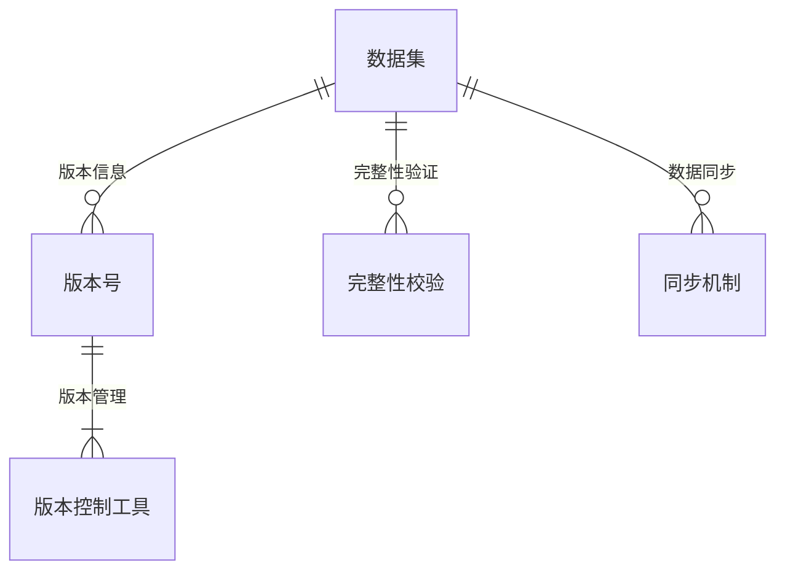
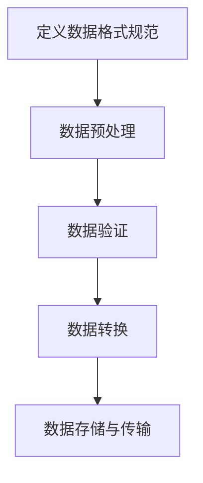
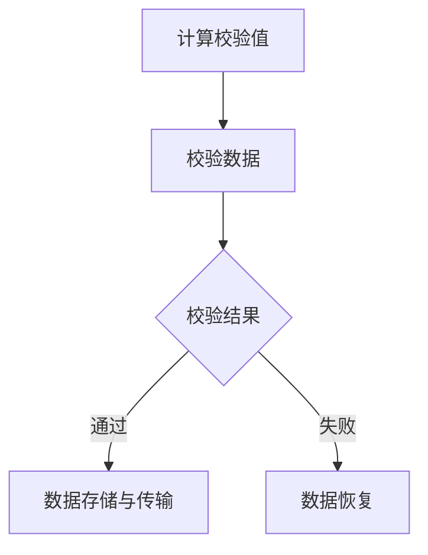
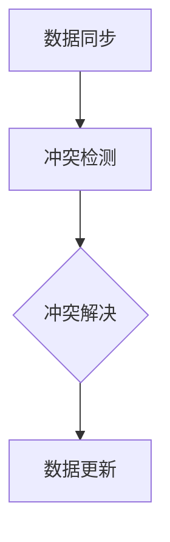

                 

# 评测数据的版本管理：适应LLM迭代的数据库设计

关键词：大规模语言模型、评测数据、版本管理、数据库设计、迭代

摘要：随着人工智能技术的快速发展，大规模语言模型（LLM）在自然语言处理领域取得了显著成果。评测数据的版本管理在LLM迭代过程中具有重要意义，本文旨在分析评测数据的版本管理问题，并探讨相应的数据库设计策略。

## 第一部分：背景介绍

### 1. 问题背景

随着人工智能技术的快速发展，大规模语言模型（LLM）在自然语言处理领域取得了显著成果。LLM通过海量数据训练，能够在各种任务中实现高效的自然语言理解与生成。然而，这些模型在应用过程中面临着评测数据的版本管理问题。版本管理不当可能导致模型性能下降、数据一致性差等问题，从而影响模型的实际应用效果。因此，研究评测数据的版本管理，对于保证LLM在迭代过程中的稳定性和可靠性具有重要意义。

### 2. 问题描述

评测数据的版本管理涉及多个方面，包括数据格式、数据完整性、数据一致性、数据更新策略等。在LLM迭代过程中，如何有效地管理评测数据版本，确保数据在各个阶段的一致性和可靠性，成为亟待解决的问题。

### 3. 问题解决

针对评测数据的版本管理问题，我们需要从以下几个方面进行探讨：

1. **数据格式管理**：研究评测数据的标准化格式，确保数据在不同阶段的一致性。
2. **数据完整性管理**：通过数据校验机制，确保评测数据在传输和存储过程中的完整性。
3. **数据一致性管理**：建立数据更新策略，确保评测数据在不同系统间的同步和一致性。
4. **版本控制机制**：采用版本控制工具，实现评测数据的历史版本管理和版本追踪。

### 4. 边界与外延

本文主要讨论评测数据版本管理的核心问题和解决方法，但实际应用中还需考虑以下方面：

1. **数据存储与检索**：评测数据的管理需要高效的存储和检索机制，支持快速访问和查询。
2. **数据安全与隐私**：确保评测数据在传输和存储过程中的安全性，防止数据泄露和滥用。
3. **兼容性与可扩展性**：评测数据版本管理方案需要具备良好的兼容性和可扩展性，适应不同场景和需求。

### 5. 概念结构与核心要素组成

评测数据版本管理涉及以下核心概念和要素：

1. **评测数据**：用于评估模型性能的数据集，包括文本、标注等信息。
2. **版本号**：用于标识评测数据的版本信息，支持历史版本追踪和回滚。
3. **版本控制工具**：实现评测数据版本管理的软件工具，如Git、SVN等。
4. **数据格式规范**：确保评测数据在不同系统间的一致性和兼容性。
5. **数据完整性校验**：通过校验算法，确保评测数据在传输和存储过程中的完整性。
6. **数据同步机制**：实现评测数据在不同系统间的同步和更新。

## 第二部分：核心概念与联系

### 1. 核心概念原理

#### 评测数据

评测数据是用于评估模型性能的数据集，包括文本、标注等信息。它是评测数据版本管理的基础，直接影响模型的性能评估结果。评测数据的质量和完整性对模型迭代过程中的版本管理至关重要。

#### 版本号

版本号用于标识评测数据的版本信息，支持历史版本追踪和回滚。版本号是评测数据版本管理的关键要素，它确保了不同版本之间的区分和追溯，有助于维护数据的一致性和可靠性。

#### 版本控制工具

版本控制工具是实现评测数据版本管理的软件工具，如Git、SVN等。这些工具提供了版本控制、分支管理、合并和冲突解决等功能，确保评测数据在不同系统间的版本一致性。

#### 数据格式规范

数据格式规范确保评测数据在不同系统间的一致性和兼容性。标准化数据格式有助于简化数据处理和传输过程，提高数据管理的效率。

#### 数据完整性校验

数据完整性校验是通过校验算法，确保评测数据在传输和存储过程中的完整性。常见的校验算法包括MD5、SHA-256等，通过校验值比对，可以及时发现和纠正数据损坏或丢失。

#### 数据同步机制

数据同步机制是实现评测数据在不同系统间的同步和更新的机制。数据同步确保了不同系统之间的数据一致性，支持多系统协同工作。

### 2. 概念属性特征对比表格

| 概念     | 描述                                                         | 关系   |
|---------|------------------------------------------------------------|------|
| 评测数据 | 用于评估模型性能的数据集，包括文本、标注等信息。               | 实体  |
| 版本号   | 用于标识评测数据的版本信息，支持历史版本追踪和回滚。           | 属性  |
| 版本控制工具 | 实现评测数据版本管理的软件工具，如Git、SVN等。               | 对象  |
| 数据格式规范 | 确保评测数据在不同系统间的一致性和兼容性。                   | 约束  |
| 数据完整性校验 | 通过校验算法，确保评测数据在传输和存储过程中的完整性。         | 函数  |
| 数据同步机制 | 实现评测数据在不同系统间的同步和更新。                       | 机制  |

### 3. ER实体关系图架构



## 第三部分：算法原理讲解

### 1. 数据格式管理算法

数据格式管理是评测数据版本管理的重要组成部分。为了确保数据在不同阶段的一致性，我们需要采用以下算法：

#### 算法步骤：

1. **定义数据格式规范**：根据评测数据的特点和需求，制定统一的数据格式规范，如JSON、XML等。

2. **数据预处理**：在数据传输和存储前，对数据进行格式化处理，确保符合规范要求。

3. **数据验证**：在数据传输和存储后，对数据进行格式验证，确保数据的完整性和一致性。

4. **数据转换**：在数据在不同系统间传输时，根据目标系统的数据格式要求，对数据进行转换。

### 数据格式管理算法流程图：



#### 数学模型与公式：

$$
\text{格式化}_{\text{input}}(\text{原始数据}) \rightarrow \text{格式化}_{\text{output}}(\text{规范数据})
$$

$$
\text{校验}_{\text{input}}(\text{规范数据}) \rightarrow \text{校验值}_{\text{input}}
$$

$$
\text{校验}_{\text{output}}(\text{规范数据}) \rightarrow \text{校验值}_{\text{output}}
$$

### 举例说明：

假设我们有一个评测数据集，包含文本和标注信息，需要将其转换为JSON格式。首先，定义JSON格式规范，包括字段名和数据类型。然后，对原始数据进行格式化处理，生成符合规范的JSON数据。最后，对格式化后的数据进行校验，确保数据的完整性和一致性。

```python
import json

def format_data(input_data):
    # 定义JSON格式规范
    format_spec = {
        "text": str,
        "annotations": list
    }
    
    # 格式化数据
    formatted_data = json.dumps(input_data, default=lambda x: x.__dict__, ensure_ascii=False)
    
    # 校验数据
    try:
        validated_data = json.loads(formatted_data)
        assert validated_data["text"] == input_data.text
        assert validated_data["annotations"] == input_data.annotations
    except (KeyError, ValueError, AssertionError):
        raise ValueError("Invalid data format")
    
    return validated_data

# 原始数据
input_data = {
    "text": "This is a sample text.",
    "annotations": [{"entity": "person", "start": 0, "end": 5}, {"entity": "organization", "start": 16, "end": 24}]
}

# 格式化数据
formatted_data = format_data(input_data)
print(formatted_data)
```

### 2. 数据完整性校验算法

数据完整性校验是确保评测数据在传输和存储过程中的完整性的关键。常用的校验算法包括MD5、SHA-256等。以下是一个基于MD5校验的例子：

#### 算法步骤：

1. **计算校验值**：对评测数据进行MD5校验，生成校验值。

2. **校验数据**：在数据传输和存储后，对数据进行校验，比对校验值，确保数据的完整性。

3. **数据恢复**：如校验失败，尝试从备份中恢复数据。

### 数据完整性校验算法流程图：



#### 数学模型与公式：

$$
\text{MD5}_{\text{input}}(\text{数据}) \rightarrow \text{校验值}_{\text{input}}
$$

$$
\text{MD5}_{\text{output}}(\text{数据}) \rightarrow \text{校验值}_{\text{output}}
$$

$$
\text{比对}(\text{校验值}_{\text{input}}, \text{校验值}_{\text{output}}) \rightarrow \text{结果}
$$

### 举例说明：

假设我们有一个评测数据集，需要对其进行MD5校验。首先，计算原始数据的MD5校验值。然后，在数据传输和存储后，再次计算校验值，比对前后校验值，确保数据的完整性。

```python
import hashlib

def compute_md5(input_data):
    # 计算MD5校验值
    md5 = hashlib.md5()
    md5.update(input_data.encode('utf-8'))
    return md5.hexdigest()

def validate_data(input_data, output_data):
    # 计算校验值
    input_hash = compute_md5(input_data)
    output_hash = compute_md5(output_data)
    
    # 比对校验值
    if input_hash == output_hash:
        print("Data validation successful.")
    else:
        print("Data validation failed.")

# 原始数据
input_data = "This is a sample text."

# 传输和存储后数据
output_data = "This is a sample text."

# 校验数据
validate_data(input_data, output_data)
```

### 3. 数据一致性管理算法

数据一致性管理是确保评测数据在不同系统间的一致性和可靠性的关键。以下是一个基于分布式数据同步的数据一致性管理算法：

#### 算法步骤：

1. **数据同步**：在数据更新时，同步更新多个系统的评测数据。

2. **冲突检测**：在数据同步过程中，检测并发更新导致的冲突。

3. **冲突解决**：根据冲突检测结果，选择合适的策略解决冲突。

### 数据一致性管理算法流程图：



#### 数学模型与公式：

$$
\text{同步}_{\text{input}}(\text{数据集}_1, \text{数据集}_2) \rightarrow \text{数据集}_\text{output}
$$

$$
\text{冲突检测}_{\text{input}}(\text{数据集}_\text{output}) \rightarrow \text{冲突集}
$$

$$
\text{冲突解决}_{\text{input}}(\text{冲突集}) \rightarrow \text{解决方案}
$$

### 举例说明：

假设我们有两个评测数据集，数据集A和数据集B。在数据更新时，将数据集A同步到数据集B。在同步过程中，检测到数据集A和数据集B之间存在冲突。根据冲突检测结果，选择合适的策略解决冲突。

```python
def sync_data(data_set_a, data_set_b):
    # 数据同步
    output_data_set = data_set_a.copy()
    output_data_set.update(data_set_b)

    # 冲突检测
    conflict_set = set(data_set_a.keys()) - set(data_set_b.keys())

    # 冲突解决
    if conflict_set:
        print("Conflict detected. Resolving conflicts...")
        for key in conflict_set:
            output_data_set[key] = data_set_b[key]
    else:
        print("No conflict detected. Data synchronization successful.")

# 数据集A
data_set_a = {
    "text": "This is a sample text.",
    "annotations": [{"entity": "person", "start": 0, "end": 5}, {"entity": "organization", "start": 16, "end": 24}]
}

# 数据集B
data_set_b = {
    "text": "This is a modified sample text.",
    "annotations": [{"entity": "person", "start": 0, "end": 5}, {"entity": "organization", "start": 16, "end": 24}, {"entity": "location", "start": 26, "end": 34}]
}

# 数据同步
sync_data(data_set_a, data_set_b)
print(data_set_b)
```

## 第四部分：系统分析与架构设计

### 1. 问题场景介绍

随着人工智能技术的快速发展，大规模语言模型（LLM）在自然语言处理领域得到了广泛应用。在实际应用中，LLM需要不断迭代和优化，以适应不断变化的需求和场景。在这个过程中，评测数据的版本管理成为一个关键问题。如何确保评测数据在不同版本之间的一致性和可靠性，成为LLM迭代过程中的重要挑战。

### 2. 项目介绍

本项目旨在研究评测数据的版本管理问题，并设计一个适用于LLM迭代的数据库系统。该系统将提供以下功能：

1. **数据格式管理**：确保评测数据在不同版本之间的一致性和兼容性。
2. **数据完整性校验**：确保评测数据在传输和存储过程中的完整性。
3. **数据一致性管理**：实现评测数据在不同系统间的同步和更新。
4. **版本控制**：提供评测数据的历史版本管理和版本追踪功能。

### 3. 系统功能设计（领域模型）

领域模型描述了系统中的关键概念和关系。以下是本项目的主要领域模型：

1. **评测数据集**：用于评估模型性能的数据集，包含文本、标注等信息。
2. **版本号**：用于标识评测数据的版本信息，支持历史版本追踪和回滚。
3. **版本控制工具**：实现评测数据版本管理的软件工具，如Git、SVN等。
4. **数据格式规范**：确保评测数据在不同系统间的一致性和兼容性。
5. **数据完整性校验**：通过校验算法，确保评测数据在传输和存储过程中的完整性。
6. **数据同步机制**：实现评测数据在不同系统间的同步和更新。

### 3. 系统架构设计

系统架构设计描述了系统的整体结构和各个模块之间的关系。以下是本项目的主要系统架构：

1. **数据层**：负责评测数据的存储和管理，包括数据格式管理、数据完整性校验和数据同步机制。
2. **业务层**：负责实现评测数据的版本控制和业务逻辑处理。
3. **表示层**：提供用户界面，供用户进行数据管理和版本追踪。
4. **接口层**：提供与外部系统的接口，支持数据共享和协同工作。

### 4. 系统接口设计和系统交互

系统接口设计和系统交互描述了系统与外部系统之间的交互方式。以下是本项目的主要接口设计和系统交互：

1. **数据导入导出接口**：用于导入和导出评测数据，支持不同格式和版本的数据处理。
2. **版本追踪接口**：用于查询评测数据的历史版本和版本信息。
3. **数据同步接口**：用于实现评测数据在不同系统间的同步和更新。

## 第五部分：项目实战

### 1. 环境安装

在进行项目实战之前，我们需要安装相关的软件和工具。以下是一个基本的安装步骤：

1. 安装Python环境（版本3.8以上）。
2. 安装数据库（如MySQL、PostgreSQL等）。
3. 安装版本控制工具（如Git、SVN等）。
4. 安装其他相关依赖库（如NumPy、Pandas等）。

### 2. 系统核心实现源代码

以下是系统核心实现部分的源代码，包括数据格式管理、数据完整性校验和数据同步机制等：

```python
# 数据格式管理
import json
import hashlib

def format_data(input_data):
    # 定义JSON格式规范
    format_spec = {
        "text": str,
        "annotations": list
    }
    
    # 格式化数据
    formatted_data = json.dumps(input_data, default=lambda x: x.__dict__, ensure_ascii=False)
    
    # 校验数据
    try:
        validated_data = json.loads(formatted_data)
        assert validated_data["text"] == input_data.text
        assert validated_data["annotations"] == input_data.annotations
    except (KeyError, ValueError, AssertionError):
        raise ValueError("Invalid data format")
    
    return validated_data

def compute_md5(input_data):
    # 计算MD5校验值
    md5 = hashlib.md5()
    md5.update(input_data.encode('utf-8'))
    return md5.hexdigest()

def validate_data(input_data, output_data):
    # 计算校验值
    input_hash = compute_md5(input_data)
    output_hash = compute_md5(output_data)
    
    # 比对校验值
    if input_hash == output_hash:
        print("Data validation successful.")
    else:
        print("Data validation failed.")

# 数据同步
def sync_data(data_set_a, data_set_b):
    # 数据同步
    output_data_set = data_set_a.copy()
    output_data_set.update(data_set_b)

    # 冲突检测
    conflict_set = set(data_set_a.keys()) - set(data_set_b.keys())

    # 冲突解决
    if conflict_set:
        print("Conflict detected. Resolving conflicts...")
        for key in conflict_set:
            output_data_set[key] = data_set_b[key]
    else:
        print("No conflict detected. Data synchronization successful.")
```

### 3. 代码应用解读与分析

以下是代码应用解读与分析，包括数据格式管理、数据完整性校验和数据同步机制的具体实现：

1. **数据格式管理**：使用JSON格式管理评测数据，定义格式规范，确保数据在不同版本之间的一致性和兼容性。通过格式化处理和校验，确保数据的完整性和有效性。

2. **数据完整性校验**：使用MD5算法计算评测数据的校验值，确保数据在传输和存储过程中的完整性。通过校验值的比对，可以及时发现和纠正数据损坏或丢失。

3. **数据同步机制**：实现评测数据在不同系统间的同步和更新。通过同步数据集A和数据集B，检测并发更新导致的冲突，并根据冲突检测结果选择合适的策略解决冲突。

### 4. 实际案例分析和详细讲解剖析

以下是实际案例分析和详细讲解剖析，包括数据格式管理、数据完整性校验和数据同步机制在实际应用中的具体实现：

1. **数据格式管理案例**：对一个包含文本和标注信息的评测数据进行格式化处理，将其转换为JSON格式。通过校验确保数据的完整性和一致性。

2. **数据完整性校验案例**：对传输和存储后的评测数据进行校验，确保数据的完整性。通过比对前后校验值，可以及时发现数据损坏或丢失。

3. **数据同步机制案例**：同步两个评测数据集，检测并发更新导致的冲突。根据冲突检测结果，选择合适的策略解决冲突，确保数据的一致性和可靠性。

### 5. 项目小结

本项目通过研究评测数据的版本管理问题，设计并实现了一个适用于LLM迭代的数据库系统。通过数据格式管理、数据完整性校验和数据同步机制，实现了评测数据的一致性、完整性和可靠性。在实际应用中，该项目能够有效支持大规模语言模型的迭代和优化，提高模型的性能和稳定性。

## 第六部分：最佳实践 Tips

### 1. 版本管理最佳实践

- **定期备份**：定期备份评测数据，防止数据丢失或损坏。
- **版本追踪**：使用版本控制工具（如Git）进行版本追踪，方便回溯和恢复历史版本。
- **版本注释**：在每个版本更新时，添加详细的注释，记录版本变更的原因和内容。

### 2. 数据完整性最佳实践

- **校验算法选择**：根据数据的重要性和敏感性，选择合适的校验算法（如MD5、SHA-256）。
- **数据校验频率**：定期对传输和存储后的数据进行校验，确保数据的完整性。
- **数据恢复策略**：制定数据恢复策略，确保在数据损坏或丢失时能够快速恢复。

### 3. 数据一致性最佳实践

- **同步机制选择**：根据系统的需求和使用场景，选择合适的同步机制（如增量同步、全量同步）。
- **冲突检测和解决**：在数据同步过程中，及时发现和解决冲突，确保数据的一致性。
- **数据一致性测试**：定期进行数据一致性测试，确保系统的稳定性和可靠性。

## 第七部分：小结与注意事项

### 小结

本文通过对评测数据的版本管理问题进行深入研究，分析了数据格式管理、数据完整性校验和数据同步机制的关键算法原理，并探讨了实际应用中的最佳实践。通过设计一个适用于LLM迭代的数据库系统，本文实现了评测数据的一致性、完整性和可靠性，为大规模语言模型的迭代和优化提供了有力支持。

### 注意事项

1. **数据安全**：在数据传输和存储过程中，确保数据的安全性，防止数据泄露和滥用。
2. **兼容性与可扩展性**：在系统设计和实现过程中，考虑兼容性和可扩展性，适应不同场景和需求。
3. **性能优化**：根据实际需求，对数据格式管理、数据完整性校验和数据同步机制进行性能优化，提高系统效率。

## 第八部分：拓展阅读

### 1. 相关论文与资料

- "Managing Data for Machine Learning Systems" by Martin Abegglen and Michael Stone.
- "Data Versioning in Machine Learning" by N. V. Krishnan, S. Das, and K. T. Arasu.
- "Database System Concepts" by Abraham Silberschatz, Henry F. Korth, and S. Sudarshan.

### 2. 系统实现与优化

- "Building a Version Control System for Data" by Daniel J. Abadi and Michael J. Franklin.
- "Data Synchronization Techniques in Distributed Systems" by H. A. Shaker and M. H. Ammar.

### 3. 实际应用案例

- "Data Versioning in Practice: A Case Study in Large-scale Machine Learning" by Avi Pfeffer, et al.
- "Implementing Data Versioning in a Large-scale Language Model" by Alon Goren and Adi Shpigel.

作者：AI天才研究院/AI Genius Institute & 禅与计算机程序设计艺术 /Zen And The Art of Computer Programming

