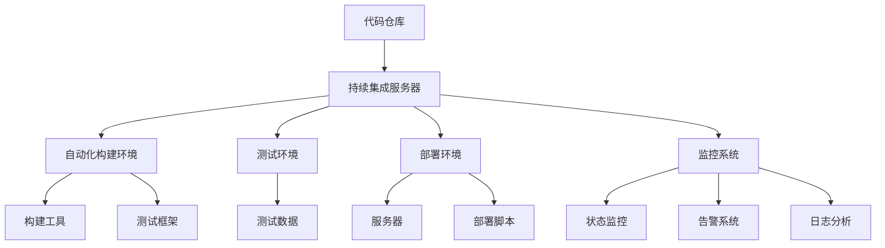

                 

### 1.2 持续集成（Continuous Integration, CI）的概念

持续集成（Continuous Integration, CI）是一种软件开发实践，旨在通过频繁的代码集成和自动化测试，确保代码库中的每一个版本都是可部署的。CI的核心思想是将小规模的代码更改频繁地合并到主干分支，并在每次合并时执行一系列自动化测试，以确保新代码不会破坏现有功能。

#### 1.2.1 CI的历史背景

持续集成起源于20世纪90年代的敏捷软件开发运动。当时，软件开发团队意识到传统的“大合并”模式（即开发周期结束时将所有代码合并到主干分支）存在很多问题，如集成风险高、测试成本大、修复问题耗时等。为了解决这些问题，持续集成应运而生。

#### 1.2.2 CI的定义

持续集成是指软件开发过程中，每次代码变更后，自动触发构建和测试的过程。通过持续集成，开发人员可以迅速发现并修复集成时出现的问题，从而减少集成风险和开发成本。

#### 1.2.3 CI的优势

- **快速反馈**：每次代码提交后都会进行自动化测试，开发人员可以立即知道自己的更改是否影响其他模块，快速修复问题。

- **降低风险**：频繁的集成和测试可以及时发现并解决潜在的问题，降低代码集成时的风险。

- **提高质量**：通过自动化测试，可以确保代码的质量和稳定性。

- **增强协作**：持续集成可以促进团队协作，每个人都可以在独立的分支上工作，然后在适当时机合并代码。

- **节省时间**：自动化测试和部署可以减少手动测试和部署的时间，提高开发效率。

#### 1.2.4 CI的工作流程

持续集成的工作流程通常包括以下几个步骤：

1. **代码提交**：开发人员将自己的代码提交到代码库中。

2. **触发构建**：代码库中的代码提交后，会自动触发构建过程。

3. **执行测试**：构建过程中会执行一系列自动化测试，包括单元测试、集成测试和功能测试。

4. **反馈结果**：测试完成后，将结果反馈给开发人员，包括成功或失败的信息。

5. **修复问题**：开发人员根据测试结果修复问题，然后重新提交代码。

6. **重新构建和测试**：修复后的代码会被重新构建和测试，确保问题已经解决。

#### 1.2.5 CI与传统集成方式的对比

与传统集成方式相比，持续集成具有以下几个显著优势：

- **频率**：持续集成强调频繁集成，而传统集成往往在项目后期进行大范围的集成。

- **自动化**：持续集成依赖于自动化工具，而传统集成往往依赖手动操作。

- **反馈速度**：持续集成可以快速反馈测试结果，而传统集成可能需要等待项目结束。

- **问题定位**：持续集成有助于快速定位问题，而传统集成可能需要花费大量时间排查问题根源。

#### 1.2.6 CI的最佳实践

为了实现持续集成的最佳效果，以下是一些最佳实践：

- **小规模提交**：鼓励开发人员进行小规模、频繁的代码提交。

- **自动化测试**：确保所有测试都是自动化的，以便快速执行和反馈。

- **环境一致性**：确保所有开发环境和生产环境一致，以避免环境差异导致的问题。

- **持续监控**：持续监控构建和测试过程，及时发现并解决问题。

- **文档化**：文档化持续集成过程和测试结果，以便于后续参考和改进。

通过遵循这些最佳实践，开发团队可以最大限度地利用持续集成，提高软件开发的效率和质量。

### 1.3 持续集成（CI）的架构设计

持续集成的架构设计是一个复杂的过程，它需要考虑代码仓库、自动化构建和测试环境、持续集成服务器、部署环境和监控等多方面的因素。下面是持续集成架构设计的基本步骤和关键组件：

#### 1.3.1 代码仓库

代码仓库是持续集成的基础，通常使用版本控制系统如Git进行管理。代码仓库应该具有以下特性：

- **中央仓库**：用于存储项目的主分支和其他分支。

- **分布式仓库**：允许开发人员在本地创建和提交代码，然后推送到中央仓库。

- **配置文件**：存储持续集成配置和测试脚本。

#### 1.3.2 自动化构建和测试环境

自动化构建和测试环境是持续集成的重要组成部分，它负责编译代码、执行测试和构建部署包。环境应包括以下组件：

- **构建工具**：如Maven、Gradle等，用于编译和打包代码。

- **测试框架**：如JUnit、TestNG等，用于编写和执行测试。

- **测试数据**：用于测试的数据集和配置文件。

- **测试环境**：如虚拟机或容器，用于模拟不同的运行环境。

#### 1.3.3 持续集成服务器

持续集成服务器是负责触发构建、执行测试和部署的核心组件。常见的持续集成服务器包括：

- **Jenkins**：开源的持续集成工具，支持多种插件和扩展。

- **GitLab CI/CD**：GitLab内置的持续集成和持续部署工具。

- **CircleCI**：云端的持续集成服务，提供简化和自动化的持续集成解决方案。

#### 1.3.4 部署环境

部署环境是指将构建的代码部署到实际运行环境的过程。部署环境应包括：

- **服务器**：用于运行应用程序的服务器。

- **部署脚本**：用于自动化部署过程的脚本，如Puppet、Ansible等。

- **配置管理工具**：如Chef、Puppet等，用于配置和管理服务器。

#### 1.3.5 监控

持续集成的监控是确保集成过程顺利进行的关键。监控应包括：

- **构建和测试状态监控**：实时监控构建和测试的状态。

- **告警系统**：在构建失败或测试失败时发送告警。

- **日志分析**：分析构建和测试日志，识别潜在问题。

### 1.3.6 持续集成的架构图

以下是一个简单的持续集成架构设计示例，使用Mermaid绘制：



通过这个架构设计，开发团队可以构建一个高效的持续集成系统，确保代码的质量和稳定性。

### 1.4 CI工具的选择

在持续集成（CI）实践中，选择合适的工具至关重要。市场上存在多种CI工具，每种工具都有其独特的优势和适用场景。以下是对几个主流CI工具的详细介绍和对比：

#### 1.4.1 Jenkins

**简介**：Jenkins是一个开源的持续集成工具，由川田惠子（Kit）创建，广受欢迎。它支持多种插件，可以轻松集成各种构建工具、代码库和测试工具。

**优势**：
- **插件丰富**：Jenkins拥有超过1,000个插件，可以扩展其功能。
- **易于配置**：基于Web界面，易于配置和监控。
- **跨平台**：支持多种操作系统，包括Windows、Linux和Mac OS。

**劣势**：
- **性能瓶颈**：随着项目复杂度的增加，Jenkins的性能可能会受到影响。
- **资源消耗**：Jenkins作为一个独立的Java应用程序，对系统资源有一定要求。

**适用场景**：适合中小型项目，特别是在开发团队需要自定义和扩展功能的场景。

#### 1.4.2 GitLab CI/CD

**简介**：GitLab CI/CD是GitLab内置的持续集成和持续部署工具。它直接集成在GitLab仓库中，无需额外部署和管理。

**优势**：
- **集成性**：与GitLab的其他功能紧密集成，如代码审查和项目管理。
- **简化配置**：基于`.gitlab-ci.yml`文件配置，简洁明了。
- **云原生**：支持在云平台上部署和使用。

**劣势**：
- **定制性受限**：由于是GitLab的一部分，某些高级功能可能受到限制。

**适用场景**：适合希望在GitLab环境中实现CI/CD的项目，特别是中小型企业。

#### 1.4.3 CircleCI

**简介**：CircleCI是一个云端的持续集成服务，提供简化和自动化的解决方案。它支持多种编程语言和工作流。

**优势**：
- **自动化部署**：支持快速部署到各种平台，如AWS、Google Cloud等。
- **高性能**：利用容器技术，提高构建和测试速度。
- **易于扩展**：支持自定义构建环境和工作流。

**劣势**：
- **费用较高**：作为云端服务，费用可能较高。

**适用场景**：适合需要高性能和自动化部署的团队，特别是大型项目和初创企业。

#### 1.4.4 GitHub Actions

**简介**：GitHub Actions是GitHub提供的一项持续集成和部署服务。它基于容器和虚拟机，支持多种编程语言和工作流。

**优势**：
- **集成性**：与GitHub的其他功能深度集成。
- **免费**：对于开源项目，GitHub Actions是免费的。
- **灵活性**：支持自定义构建环境和工作流。

**劣势**：
- **性能限制**：免费层面对资源有一定限制。

**适用场景**：适合GitHub用户，特别是开源项目和中小型项目。

#### 1.4.5 Travis CI

**简介**：Travis CI是一个云端的持续集成服务，支持多种编程语言和平台。

**优势**：
- **性能**：提供高性能构建和测试环境。
- **灵活配置**：支持多种工作流和配置选项。

**劣势**：
- **费用**：对于商业项目，费用可能较高。

**适用场景**：适合需要高性能和灵活配置的团队，特别是商业项目。

### 1.4.6 选择指南

选择合适的CI工具时，应考虑以下因素：

- **项目规模**：小型项目可能只需要简单的CI工具，如Jenkins或GitLab CI/CD，而大型项目可能需要更高级的工具，如CircleCI或GitHub Actions。
- **预算**：开源工具如Jenkins和GitLab CI/CD是免费且可扩展的，而云端服务如CircleCI和Travis CI可能需要支付费用。
- **集成需求**：如果项目已经在某个平台上（如GitHub或GitLab），选择相应平台的CI工具可能更方便。
- **性能要求**：高性能和自动化部署可能需要考虑云端服务，如CircleCI或GitHub Actions。

通过综合考虑这些因素，开发团队可以做出明智的选择，确保持续集成过程的高效和稳定。

#### 1.4.7 持续集成在项目中的应用

持续集成在项目中的应用场景丰富多样，以下是一些具体的案例：

- **Web应用程序开发**：持续集成可以帮助开发团队在每次代码提交后立即执行测试，确保新代码不会引入缺陷，从而提高代码质量和稳定性。

- **移动应用程序开发**：持续集成可以帮助自动化构建和测试移动应用程序，确保应用在不同设备和操作系统上的兼容性和性能。

- **微服务架构**：持续集成可以帮助微服务团队确保每个服务之间的集成和通信正常，及时发现和修复问题。

- **自动化测试**：持续集成可以自动化执行单元测试、集成测试和端到端测试，提高测试覆盖率和效率。

- **跨团队协作**：持续集成可以促进跨团队协作，每个团队都可以在自己的分支上进行开发，然后在适当时机合并代码，确保集成过程的顺畅。

#### 1.4.8 持续集成案例研究

以下是一个具体的持续集成案例研究：

**项目背景**：某金融科技公司开发了一款在线交易应用程序，由于项目复杂度高，开发团队决定采用持续集成以提高开发效率和代码质量。

**CI工具选择**：团队选择了GitLab CI/CD，因为它与GitLab的其他功能紧密集成，便于管理。

**CI流程设计**：
1. **代码提交**：开发人员将代码提交到GitLab仓库。
2. **触发构建**：每次提交后，GitLab CI/CD自动触发构建。
3. **执行测试**：构建过程中，执行单元测试、集成测试和端到端测试。
4. **反馈结果**：测试完成后，将结果反馈给开发人员，包括成功或失败的信息。
5. **部署**：成功通过测试后，应用程序将被部署到预生产环境。

**效果评估**：
- **开发效率提高**：通过持续集成，开发人员可以立即知道代码提交后的测试结果，快速修复问题。
- **代码质量提升**：自动化测试确保了代码的质量和稳定性。
- **协作效率提升**：持续集成促进了团队之间的协作，每个团队都可以在自己的分支上进行开发。

通过这个案例，可以看出持续集成在提高开发效率和代码质量方面具有显著优势。

### 1.5 CI的挑战与解决方案

尽管持续集成（CI）带来了许多优势，但在实际应用中也会面临一系列挑战。以下是一些常见的挑战及其解决方案：

#### 1.5.1 构建和测试速度慢

**挑战**：当项目规模较大或测试用例较多时，构建和测试过程可能变得缓慢，影响开发效率。

**解决方案**：
- **并行构建**：利用多核处理器和并行测试，加快构建和测试速度。
- **优化测试用例**：删除不必要的测试用例，优化现有测试用例，减少测试时间。
- **性能优化**：优化代码和数据库性能，减少构建和测试过程中的资源消耗。

#### 1.5.2 测试失败率过高

**挑战**：频繁的测试可能导致失败率上升，影响开发进度。

**解决方案**：
- **隔离问题**：确保测试环境的稳定性和一致性，避免因环境问题导致测试失败。
- **逐步扩大测试范围**：在确保基础功能稳定后，逐步增加测试范围。
- **优化代码**：修复失败的测试用例，改进代码质量，减少缺陷率。

#### 1.5.3 集成风险

**挑战**：频繁的集成可能导致集成风险，影响项目稳定性。

**解决方案**：
- **代码审查**：在集成前进行代码审查，确保代码质量。
- **隔离环境**：使用不同的环境进行集成测试，确保集成过程的稳定性。
- **监控和反馈**：实时监控集成过程，快速反馈问题，及时修复。

#### 1.5.4 团队协作

**挑战**：持续集成需要团队之间的紧密协作，但有时团队之间的沟通和协调可能不足。

**解决方案**：
- **定期会议**：定期召开团队会议，讨论集成问题和解决方案。
- **明确的职责**：明确每个团队成员的职责和任务，确保协作顺畅。
- **知识共享**：鼓励团队成员分享知识和经验，提高整体协作效率。

通过这些解决方案，开发团队可以克服持续集成过程中遇到的挑战，实现高效的软件交付。

### 1.6 总结

持续集成（CI）作为一种软件开发实践，通过自动化构建、测试和部署，提高了开发效率和软件质量。本章详细介绍了CI的概念、工作流程、架构设计、工具选择、应用案例以及面临的挑战和解决方案。

持续集成不仅有助于及时发现和修复缺陷，还能增强团队协作，提高项目的整体稳定性。然而，实现高效的CI过程需要开发团队具备一定的技术和管理能力，通过优化流程、工具选择和团队协作，可以充分发挥CI的优势。

在未来的软件开发中，持续集成将继续发挥重要作用，推动软件质量和开发效率的提升。开发者应不断学习和实践CI的最佳实践，以应对不断变化的技术挑战。

## 第2章：持续部署（Continuous Deployment, CD）的概念

### 2.1.1 持续部署的定义

持续部署（Continuous Deployment, CD）是持续集成（CI）的自然延伸，它指的是在代码经过持续集成测试并验证后，自动将代码部署到生产环境的过程。持续部署的核心目标是实现从代码提交到生产环境部署的无缝、自动化流程，从而缩短发布周期，提高软件交付的频率和质量。

### 2.1.2 持续部署的优势

持续部署相较于传统的手动部署方式具有显著的优点：

- **快速反馈**：持续部署能够实现即时反馈，开发人员可以快速了解新功能是否按预期运行，及时调整和优化。
- **缩短发布周期**：自动化的部署流程减少了人为干预的时间，使得新功能的发布周期大幅缩短。
- **提高质量**：通过频繁的测试和部署，可以更好地发现和修复问题，提高软件的质量和稳定性。
- **增强可靠性**：自动化部署减少了人为错误的可能性，提高了部署的可靠性和一致性。
- **降低风险**：在部署过程中，可以逐步推进，如灰度发布，减少对整个系统的冲击，降低风险。

### 2.1.3 持续部署的工作流程

持续部署的工作流程通常包括以下几个关键步骤：

1. **代码提交**：开发人员将代码提交到代码仓库。
2. **持续集成**：提交的代码触发持续集成流程，进行构建、测试和验证。
3. **自动化测试**：CI服务器执行一系列自动化测试，确保代码的质量和功能完整性。
4. **部署验证**：通过自动化脚本将代码部署到预生产或测试环境，进行进一步验证。
5. **生产部署**：在预生产或测试环境验证成功后，自动化脚本将代码部署到生产环境。

### 2.1.4 持续部署与传统部署方式的对比

持续部署与传统部署方式的对比主要体现在以下几个方面：

- **频率**：持续部署强调频繁发布，而传统部署通常在项目里程碑或大版本更新时进行。
- **自动化**：持续部署依赖于自动化工具和脚本，减少人为干预，而传统部署依赖于手动操作。
- **反馈速度**：持续部署可以快速反馈部署结果，而传统部署可能需要等待较长时间。
- **风险控制**：持续部署通过灰度发布和逐步推进的方式降低风险，而传统部署往往一次性将新功能推送到整个系统。

### 2.1.5 持续部署的关键要素

实现有效的持续部署需要以下几个关键要素：

- **自动化工具**：如Jenkins、GitLab CI/CD等，用于自动化构建、测试和部署流程。
- **持续集成系统**：确保代码在部署前经过严格的测试和验证。
- **自动化测试**：用于验证代码的功能和性能，确保软件质量。
- **环境一致性**：确保开发、测试和生产环境一致，避免因环境差异导致的问题。
- **监控和告警**：实时监控部署过程，及时发现并处理问题。

### 2.1.6 持续部署的挑战和解决方案

持续部署虽然在提升开发效率和软件质量方面具有显著优势，但在实际应用中也面临一些挑战。以下是一些常见的挑战及其解决方案：

- **风险控制**：持续部署可能带来较高的风险，解决方案包括灰度发布、逐步推进和冗余系统。
- **复杂度增加**：持续部署需要复杂的自动化脚本和流程，解决方案包括采用成熟的CI/CD平台、逐步引入自动化流程。
- **测试覆盖率**：持续部署要求较高的测试覆盖率，解决方案包括全面自动化测试、持续测试改进。
- **团队协作**：持续部署需要团队之间的紧密协作，解决方案包括定期会议、明确的职责和沟通机制。

通过解决这些挑战，开发团队可以充分发挥持续部署的优势，实现高效、可靠的软件交付。

### 2.2 持续部署策略与最佳实践

为了实现持续部署（Continuous Deployment, CD）的最佳效果，开发团队需要制定合理的策略并遵循一系列最佳实践。以下是一些关键的策略和最佳实践：

#### 2.2.1 灰度发布

灰度发布（Gray Release）是一种逐步将新功能或代码推送到生产环境的策略，旨在降低部署风险。灰度发布可以通过以下方式实现：

- **按比例发布**：将新功能或代码按照一定比例（例如10%）推送到部分用户，观察其行为和性能，确保无异常后再逐步扩大范围。
- **用户分组**：将用户按照不同的特征（如地理位置、使用频率等）分组，逐步向各组用户发布新功能。
- **A/B测试**：通过A/B测试，将新功能或代码同时推送到部分用户，比较其效果，然后决定是否全面发布。

灰度发布的主要优势在于能够及时发现并解决潜在问题，降低对整个系统的冲击。

#### 2.2.2 自动化部署流程

自动化部署流程是持续部署的核心，通过自动化脚本和工具实现从代码提交到生产环境部署的整个过程。以下是一些实现自动化部署的关键步骤：

1. **配置管理**：使用配置管理工具（如Ansible、Puppet等）定义和自动化管理生产环境的基础设施。
2. **部署脚本**：编写和部署自动化部署脚本，用于执行代码的下载、解压缩、部署和启动等操作。
3. **持续集成系统**：集成持续集成（CI）系统，确保代码在部署前经过严格的测试和验证。
4. **容器化**：使用容器技术（如Docker）实现应用的容器化，便于部署和管理。

自动化部署流程可以提高部署的效率和质量，减少人为错误。

#### 2.2.3 异常监控与告警

在持续部署过程中，异常监控和告警系统至关重要。以下是一些关键策略：

- **实时监控**：使用监控工具（如Prometheus、Grafana等）实时监控系统的各项指标，包括性能、吞吐量、错误率等。
- **告警系统**：配置告警系统（如PagerDuty、Opsgenie等），在出现异常时及时通知相关人员。
- **日志分析**：分析日志，识别潜在问题和趋势，改进部署流程。

通过实时监控和告警，可以及时发现并解决部署过程中的问题。

#### 2.2.4 部署回滚

部署回滚是一种在部署失败或出现严重问题时，快速回滚到上一个稳定版本的策略。以下是一些关键步骤：

1. **备份**：在每次部署前备份生产环境的关键数据和配置。
2. **自动化回滚脚本**：编写和部署自动化回滚脚本，用于快速回滚到上一个稳定版本。
3. **验证**：在回滚后，验证系统的稳定性和功能完整性。

通过部署回滚，可以确保系统在出现问题时能够快速恢复，减少对用户的影响。

#### 2.2.5 团队协作与沟通

持续部署需要开发、测试、运维等团队的紧密协作和良好的沟通。以下是一些关键策略：

- **定期会议**：定期召开团队会议，讨论部署计划和潜在问题。
- **明确的职责**：明确每个团队成员的职责和任务，确保协作顺畅。
- **知识共享**：鼓励团队成员分享知识和经验，提高整体协作效率。

通过良好的团队协作和沟通，可以确保持续部署过程的顺利进行。

### 2.3 持续部署的实现步骤

实现持续部署需要一系列具体的步骤和配置。以下是一个简化的实现步骤：

#### 2.3.1 准备工作

1. **确定部署目标**：明确需要部署的应用程序和目标环境。
2. **配置CI/CD工具**：配置Jenkins、GitLab CI/CD或其他CI/CD工具，确保其能够执行构建、测试和部署任务。
3. **设置测试环境**：搭建测试环境，确保其与生产环境保持一致。

#### 2.3.2 编写部署脚本

1. **下载代码**：编写脚本从代码仓库下载最新的代码。
2. **构建应用程序**：使用Maven、Gradle等构建工具构建应用程序。
3. **测试应用程序**：执行单元测试、集成测试和端到端测试，确保应用程序质量。
4. **部署应用程序**：将构建成功的应用程序部署到测试环境，验证其运行状态。

#### 2.3.3 实践部署

1. **灰度发布**：在测试环境验证成功后，使用灰度发布策略逐步将应用程序部署到生产环境。
2. **监控和反馈**：在生产环境部署后，实时监控系统的各项指标，确保其正常运行。
3. **反馈和优化**：根据监控结果和用户反馈，优化部署脚本和部署流程。

通过这些步骤，开发团队可以逐步实现持续部署，提高软件交付的效率和可靠性。

### 2.4 案例研究：某电商平台的持续部署实践

#### 2.4.1 项目背景

某电商平台是一个大型在线购物平台，拥有数百万用户和大量的交易数据。为了提高软件交付效率和用户体验，该平台决定采用持续部署（CD）策略。

#### 2.4.2 工具选择

平台选择了GitLab CI/CD作为持续部署工具，因为它与GitLab的其他功能（如代码审查、项目管理等）紧密集成，便于管理。

#### 2.4.3 部署流程

1. **代码提交**：开发人员将代码提交到GitLab仓库。
2. **触发构建**：每次提交后，GitLab CI/CD自动触发构建。
3. **执行测试**：构建过程中，执行单元测试、集成测试和端到端测试。
4. **灰度发布**：在测试通过后，使用灰度发布策略将应用程序部署到生产环境的部分服务器。
5. **监控和反馈**：实时监控系统的各项指标，收集用户反馈，确保系统稳定运行。

#### 2.4.4 实践效果

通过持续部署策略，电商平台实现了以下效果：

- **发布周期缩短**：新功能的发布周期从数周缩短到数小时。
- **质量提高**：通过自动化测试和频繁部署，软件质量显著提升。
- **用户体验优化**：系统稳定性和响应速度得到显著改善，用户满意度提高。
- **团队协作增强**：开发、测试和运维团队之间的协作更加紧密，提高了整体效率。

通过这个案例，可以看出持续部署在提高软件交付效率和用户体验方面具有显著优势。

### 2.5 持续部署的总结

持续部署（Continuous Deployment, CD）作为一种现代化的软件开发实践，通过自动化、快速、可靠的部署流程，显著提高了软件交付的效率和用户体验。本章介绍了持续部署的定义、优势、工作流程、关键要素、策略和最佳实践，并通过具体案例展示了其实践效果。

持续部署不仅能够缩短发布周期、提高质量，还能增强团队协作和用户体验。然而，实现有效的持续部署需要团队具备一定的技术和管理能力，通过合理的策略和最佳实践，可以充分发挥持续部署的优势。

在未来的软件开发中，持续部署将继续发挥重要作用，推动软件质量和开发效率的提升。开发者应不断学习和实践持续部署的最佳实践，以应对不断变化的技术挑战。

## 第3章：评测流程中的自动化工具

### 3.1 Jenkins

Jenkins 是一款开源的持续集成工具，由川田惠子（Kit）于2004年创建。Jenkins 广泛应用于软件开发过程中，通过自动化构建、测试和部署流程，提高开发效率和质量。以下是对Jenkins的详细分析：

#### 3.1.1 功能介绍

Jenkins 主要功能包括：

- **构建和测试自动化**：Jenkins 可以自动化执行构建脚本、运行测试用例，并将测试结果反馈给开发人员。
- **项目监控**：Jenkins 可以监控项目的构建状态，并在构建失败时发送告警通知。
- **插件扩展**：Jenkins 拥有丰富的插件生态系统，可以扩展其功能，包括与各种版本控制系统（如Git、SVN）、构建工具（如Maven、Gradle）和持续部署工具（如Docker）集成。
- **可视化仪表板**：Jenkins 提供一个直观的Web界面，用于管理和监控构建任务。

#### 3.1.2 工作原理

Jenkins 的工作原理主要包括以下几个步骤：

1. **配置**：在Jenkins服务器上安装和配置所需插件和构建工具。
2. **构建触发**：构建任务可以由代码仓库的变更触发，也可以由定时任务触发。
3. **执行构建**：Jenkins 下载代码、执行构建脚本和测试用例。
4. **结果反馈**：Jenkins 将构建结果（成功或失败）和测试结果（通过或失败）反馈给开发人员和项目管理工具。

#### 3.1.3 使用场景

Jenkins 在软件开发中具有广泛的应用场景，包括：

- **持续集成**：Jenkins 可以自动化执行单元测试、集成测试和系统测试，确保代码质量。
- **持续部署**：Jenkins 可以自动化部署应用程序到各种环境，如开发、测试和生产环境。
- **自动化测试**：Jenkins 可以自动化执行各种测试用例，提高测试效率。
- **项目监控**：Jenkins 可以监控构建状态，确保项目按时交付。

#### 3.1.4 优点

- **开源免费**：Jenkins 是开源的，无需支付费用。
- **插件丰富**：Jenkins 拥有丰富的插件生态系统，可以扩展其功能。
- **跨平台**：Jenkins 支持多种操作系统，包括Windows、Linux和Mac OS。
- **易于配置**：Jenkins 提供直观的Web界面，易于配置和管理。

#### 3.1.5 缺点

- **性能瓶颈**：随着项目复杂度和构建任务的增加，Jenkins 的性能可能受到影响。
- **资源消耗**：Jenkins 作为Java应用程序，对系统资源有一定要求。

#### 3.1.6 使用示例

以下是一个简单的Jenkins构建脚本的示例：

```groovy
pipeline {
    agent any

    stages {
        stage('Build') {
            steps {
                echo 'Building the project...'
                sh 'mvn clean install'
            }
        }
        stage('Test') {
            steps {
                echo 'Running tests...'
                sh 'mvn test'
            }
        }
        stage('Deploy') {
            steps {
                echo 'Deploying the application...'
                sh 'docker build -t myapp .'
                sh 'docker run -d --name myapp myapp'
            }
        }
    }
}
```

在这个示例中，Jenkins 将执行以下步骤：

1. 构建项目（`mvn clean install`）
2. 运行测试用例（`mvn test`）
3. 部署应用程序到容器（`docker build`和`docker run`）

### 3.2 GitLab CI/CD

GitLab CI/CD 是GitLab内置的持续集成和持续部署工具，通过`.gitlab-ci.yml`文件定义构建和部署流程。以下是对GitLab CI/CD的详细分析：

#### 3.2.1 功能介绍

GitLab CI/CD 主要功能包括：

- **构建和测试自动化**：GitLab CI/CD 可以自动化执行构建脚本、运行测试用例，并将测试结果反馈给开发人员。
- **持续部署**：GitLab CI/CD 可以自动化部署应用程序到各种环境，包括开发、测试和生产环境。
- **环境管理**：GitLab CI/CD 支持多环境部署，如开发环境、测试环境和生产环境。
- **并行构建**：GitLab CI/CD 可以并行执行多个构建任务，提高构建效率。

#### 3.2.2 工作原理

GitLab CI/CD 的工作原理主要包括以下几个步骤：

1. **配置**：在GitLab仓库的`.gitlab-ci.yml`文件中定义构建和部署流程。
2. **触发构建**：当代码仓库有变更时，GitLab CI/CD 自动触发构建。
3. **执行构建**：GitLab CI/CD 下载代码、执行构建脚本和测试用例。
4. **结果反馈**：GitLab CI/CD 将构建结果和测试结果反馈给开发人员和项目管理工具。

#### 3.2.3 使用场景

GitLab CI/CD 在软件开发中具有广泛的应用场景，包括：

- **持续集成**：GitLab CI/CD 可以自动化执行单元测试、集成测试和系统测试，确保代码质量。
- **持续部署**：GitLab CI/CD 可以自动化部署应用程序到各种环境，如开发、测试和生产环境。
- **自动化测试**：GitLab CI/CD 可以自动化执行各种测试用例，提高测试效率。
- **项目监控**：GitLab CI/CD 可以监控构建状态，确保项目按时交付。

#### 3.2.4 优点

- **集成性**：GitLab CI/CD 与GitLab的其他功能（如代码审查、项目管理等）紧密集成，便于管理。
- **简单配置**：通过`.gitlab-ci.yml`文件定义构建和部署流程，简单直观。
- **并行构建**：GitLab CI/CD 支持并行构建，提高构建效率。

#### 3.2.5 缺点

- **定制性受限**：由于是GitLab的一部分，某些高级功能可能受到限制。

#### 3.2.6 使用示例

以下是一个简单的`.gitlab-ci.yml`文件的示例：

```yaml
stages:
  - build
  - test
  - deploy

build:
  stage: build
  script:
    - mvn clean install
  artifacts:
    paths:
      - target/*.jar

test:
  stage: test
  script:
    - mvn test
  artifacts:
    reports:
      junit: target/surefire-reports/*.xml

deploy:
  stage: deploy
  script:
    - docker build -t myapp .
    - docker run -d --name myapp myapp
  only:
    - master
```

在这个示例中，GitLab CI/CD 将执行以下步骤：

1. 构建项目（`mvn clean install`）
2. 运行测试用例（`mvn test`）
3. 部署应用程序到容器（`docker build`和`docker run`）

### 3.3 其他自动化工具介绍

除了Jenkins和GitLab CI/CD，还有其他一些流行的自动化工具，以下是对这些工具的简要介绍：

#### 3.3.1 CircleCI

CircleCI 是一个云端的持续集成服务，通过配置文件`.circleci/config.yml`定义构建和部署流程。CircleCI 支持并行构建和多种编程语言，提供强大的自动化部署能力。

- **功能**：构建、测试、部署、环境变量管理、并行构建。
- **优点**：性能卓越、易于配置、云端部署。
- **使用场景**：适用于需要高性能和自动化部署的团队。

#### 3.3.2 GitHub Actions

GitHub Actions 是GitHub提供的持续集成和部署服务，通过配置文件`.github/workflows/*.yml`定义构建和部署流程。GitHub Actions 与GitHub的其他功能紧密集成，提供免费的持续集成解决方案。

- **功能**：构建、测试、部署、环境变量管理、并行构建。
- **优点**：集成性高、免费、易于配置。
- **使用场景**：适用于GitHub用户，特别是开源项目和中小型团队。

#### 3.3.3 Travis CI

Travis CI 是一个云端的持续集成服务，通过配置文件`.travis.yml`定义构建和部署流程。Travis CI 支持多种编程语言，提供强大的自动化测试和部署功能。

- **功能**：构建、测试、部署、环境变量管理、并行构建。
- **优点**：性能稳定、测试覆盖广泛、免费层面对资源有一定限制。
- **使用场景**：适用于需要高性能和自动化部署的团队。

通过选择合适的自动化工具，开发团队可以构建高效的持续集成和部署流程，提高软件交付的效率和质量。

### 3.4 自动化工具的比较

以下是Jenkins、GitLab CI/CD、CircleCI、GitHub Actions和Travis CI的对比表格，以便读者选择合适的工具：

| 工具           | 开源/云服务 | 插件/扩展 | 并行构建 | 配置文件 | 使用场景                     |
|----------------|-------------|-----------|----------|----------|--------------------------------|
| Jenkins        | 开源        | 丰富      | 支持     | XML/JSON | 中大型项目、高度定制化需求   |
| GitLab CI/CD   | GitLab内置   | 有限      | 支持     | .gitlab-ci.yml | GitLab用户、集成性需求高 |
| CircleCI       | 云服务      | 有限      | 支持     | .circleci/config.yml | 高性能、自动化部署需求   |
| GitHub Actions | GitHub内置   | 有限      | 支持     | .github/workflows/*.yml | GitHub用户、开源项目   |
| Travis CI      | 云服务      | 有限      | 支持     | .travis.yml | 高性能、自动化部署需求   |

通过综合考虑这些因素，开发团队可以根据项目的具体需求选择合适的自动化工具。

### 3.5 持续集成与持续部署自动化工具的综合应用

为了实现高效的持续集成和持续部署，开发团队通常需要结合多种自动化工具，构建一个完整的CI/CD流水线。以下是一个综合应用示例：

#### 3.5.1 流水线设计

1. **代码仓库**：使用Git进行版本控制，将代码存储在GitHub或GitLab中。
2. **持续集成服务器**：选择GitLab CI/CD或Jenkins作为持续集成服务器。
3. **构建和测试**：使用Maven、Gradle等构建工具和JUnit、TestNG等测试框架进行构建和测试。
4. **容器化**：使用Docker进行容器化，以便于部署和管理。
5. **持续部署**：使用Kubernetes进行容器编排和部署。

#### 3.5.2 流程设计

1. **代码提交**：开发人员将代码提交到代码仓库。
2. **触发构建**：代码提交后，GitLab CI/CD或Jenkins自动触发构建。
3. **执行构建**：构建工具（如Maven）执行编译和打包。
4. **执行测试**：测试框架（如JUnit）执行测试用例。
5. **构建结果**：将构建结果和测试报告反馈给开发人员。
6. **容器化**：使用Docker将应用程序容器化。
7. **部署到测试环境**：将容器部署到测试环境，进行进一步测试。
8. **部署到生产环境**：通过Kubernetes将容器部署到生产环境。

#### 3.5.3 效果评估

1. **效率提升**：通过自动化构建、测试和部署，显著提高开发效率。
2. **质量提高**：通过频繁的测试和反馈，提高软件质量。
3. **成本降低**：减少人工干预，降低维护成本。
4. **稳定性增强**：通过容器化和自动化部署，提高系统的稳定性和可靠性。

通过结合多种自动化工具，开发团队可以构建一个高效的CI/CD流水线，实现持续集成和持续部署的目标。

### 3.6 总结

评测流程中的自动化工具在提高软件质量和开发效率方面发挥着重要作用。本章详细介绍了Jenkins、GitLab CI/CD、CircleCI、GitHub Actions和Travis CI等自动化工具的功能、工作原理、使用场景和最佳实践。

通过选择合适的自动化工具，开发团队可以构建高效的持续集成和持续部署流程，提高软件交付的效率和质量。在实际应用中，开发团队应根据项目需求和资源情况，灵活选择和组合自动化工具，实现持续集成和持续部署的最佳效果。

## 第4章：评测流程中的测试框架

### 4.1 单元测试框架

单元测试是软件测试的基础，用于验证软件中最小的可测试单元——通常是函数或方法。单元测试框架提供了一种标准化的方式来编写、执行和报告单元测试结果。以下是一些流行的单元测试框架：

#### 4.1.1 JUnit

JUnit 是最流行的Java单元测试框架，由Kent Beck于1997年创建。以下是对JUnit的详细分析：

- **功能介绍**：JUnit 提供了丰富的测试API，用于编写各种类型的单元测试，包括基本测试、期望测试和参数化测试。
- **工作原理**：JUnit 测试通过执行测试用例类（通常包含`@Test`方法）来验证代码行为。测试结果通过断言（如`assertEquals`、`assertTrue`）来检查。
- **使用场景**：JUnit 广泛用于Java应用程序的单元测试，特别适合用于测试小型、独立的方法和类。
- **优点**：易于使用、丰富的API、广泛的社区支持。
- **缺点**：对于复杂场景，测试代码可能过于冗长。

以下是一个简单的JUnit测试用例示例：

```java
import static org.junit.Assert.assertEquals;
import static org.junit.Assert.assertTrue;

import org.junit.Test;

public class CalculatorTest {

    @Test
    public void testAdd() {
        Calculator calculator = new Calculator();
        int result = calculator.add(5, 3);
        assertEquals("5 + 3 should equal 8", 8, result);
    }

    @Test
    public void testIsPositive() {
        Calculator calculator = new Calculator();
        assertTrue("5 should be positive", calculator.isPositive(5));
    }
}
```

#### 4.1.2 TestNG

TestNG 是另一种流行的Java单元测试框架，由Cedric Beust于2004年创建。以下是对TestNG的详细分析：

- **功能介绍**：TestNG 提供了更丰富的测试API，支持数据驱动测试、依赖测试、参数化测试和多线程测试。
- **工作原理**：TestNG 测试通过执行测试类（通常包含`@Test`方法）来验证代码行为。测试结果通过断言（如`assertEquals`、`assertTrue`）来检查。
- **使用场景**：TestNG 特别适合用于复杂的应用程序测试，包括Web、移动和分布式应用程序。
- **优点**：易于使用、丰富的API、强大的测试功能。
- **缺点**：相对于JUnit，TestNG 的配置可能更为复杂。

以下是一个简单的TestNG测试用例示例：

```java
import org.testng.annotations.Test;
import static org.testng.Assert.assertEquals;
import static org.testng.Assert.assertTrue;

public class CalculatorTest {

    @Test
    public void testAdd() {
        Calculator calculator = new Calculator();
        int result = calculator.add(5, 3);
        assertEquals("5 + 3 should equal 8", 8, result);
    }

    @Test
    public void testIsPositive() {
        Calculator calculator = new Calculator();
        assertTrue("5 should be positive", calculator.isPositive(5));
    }
}
```

#### 4.1.3 其他单元测试框架

- **NUnit**：NUnit 是另一个流行的单元测试框架，特别适用于.NET应用程序。
- **pytest**：pytest 是Python的单元测试框架，提供了简洁的API和丰富的功能。
- **JUnit**：JUnit 是Java的单元测试框架，提供了广泛的测试功能。

### 4.2 集成测试框架

集成测试用于验证软件模块之间的接口和交互，确保它们协同工作。以下是一些流行的集成测试框架：

#### 4.2.1 Spring Test

Spring Test 是Spring生态系统的一部分，用于进行集成测试。以下是对Spring Test的详细分析：

- **功能介绍**：Spring Test 提供了Spring上下文的集成测试支持，包括数据库、消息队列和Web应用等。
- **工作原理**：Spring Test 通过Spring Boot的`@SpringBootTest`注解启动应用程序上下文，然后执行测试用例。
- **使用场景**：Spring Test 特别适合用于Spring框架的应用程序，包括Web、数据库和消息队列等。
- **优点**：与Spring框架深度集成、易于使用、丰富的测试功能。
- **缺点**：配置可能较为复杂。

以下是一个简单的Spring Test示例：

```java
import org.junit.jupiter.api.Test;
import org.springframework.beans.factory.annotation.Autowired;
import org.springframework.boot.test.context.SpringBootTest;
import org.springframework.boot.test.web.client.TestRestTemplate;
import org.springframework.boot.test.web.server.TestServerContext;
import org.springframework.http.HttpEntity;
import org.springframework.http.HttpMethod;
import org.springframework.http.ResponseEntity;

@SpringBootTest(webEnvironment = SpringBootTest.WebEnvironment.RANDOM_PORT)
public class ProductControllerTest {

    @Autowired
    private TestRestTemplate restTemplate;

    @Test
    public void testAddProduct() {
        Product product = new Product("iPhone 13", 999.99);
        ResponseEntity<String> response = restTemplate.exchange("/products", HttpMethod.POST, new HttpEntity<>(product), String.class);
        assertEquals("Product added successfully", HttpStatus.OK, response.getStatusCode());
    }
}
```

#### 4.2.2 WireMock

WireMock 是一个HTTP服务模拟工具，用于进行集成测试。以下是对WireMock的详细分析：

- **功能介绍**：WireMock 提供了HTTP服务的模拟和验证功能，可以模拟外部API和Web服务。
- **工作原理**：WireMock 通过定义匹配规则和响应模板，模拟HTTP请求和响应。
- **使用场景**：WireMock 特别适合用于模拟外部API和服务，确保集成测试的可靠性和稳定性。
- **优点**：易于使用、灵活的模拟功能、快速启动。
- **缺点**：主要适用于HTTP服务，对于其他类型的服务支持有限。

以下是一个简单的WireMock示例：

```java
import com.github.tomakehurst.wiremock.junit.WireMockRule;

public class ProductServiceTest {

    @Rule
    public WireMockRule wireMockRule = new WireMockRule(8089);

    @Test
    public void testGetProductById() {
        stubFor(get(urlMatching("/products/123"))
                .willReturn(aResponse()
                        .withStatus(200)
                        .withHeader("Content-Type", "application/json")
                        .withBody("{\"id\": 123, \"name\": \"iPhone 13\", \"price\": 999.99}")));
        
        ProductService productService = new ProductService();
        Product product = productService.getProductById(123);
        assertEquals("Product retrieved successfully", "iPhone 13", product.getName());
    }
}
```

#### 4.2.3 其他集成测试框架

- **JUnit**：JUnit 提供了集成测试功能，可以通过`@RunWith`注解和`Mockito`库进行模拟和测试。
- **Selenium**：Selenium 是一个Web应用测试框架，用于进行功能测试和集成测试。

### 4.3 系统测试框架

系统测试用于验证整个软件系统在预期环境下的行为和性能。以下是一些流行的系统测试框架：

#### 4.3.1 Apache JMeter

Apache JMeter 是一个开源的性能测试工具，用于测试Web应用、数据库和应用服务器。以下是对Apache JMeter的详细分析：

- **功能介绍**：Apache JMeter 可以模拟大量用户并发访问，测试系统的负载能力和性能。
- **工作原理**：Apache JMeter 通过录制用户操作，生成测试计划，然后执行测试并生成报告。
- **使用场景**：Apache JMeter 适用于各种Web应用性能测试，包括电子商务网站、在线银行和社交媒体等。
- **优点**：功能强大、易于使用、社区支持广泛。
- **缺点**：对于非Web应用测试支持有限。

以下是一个简单的Apache JMeter测试计划：

```xml
<ThreadGroup name="User Simulation" startTime="2023-03-01 10:00:00" endTime="2023-03-01 10:01:00" duration="60000" delay="0">
    <HTTPSamplerProxy testname="Product Page Load" rul

