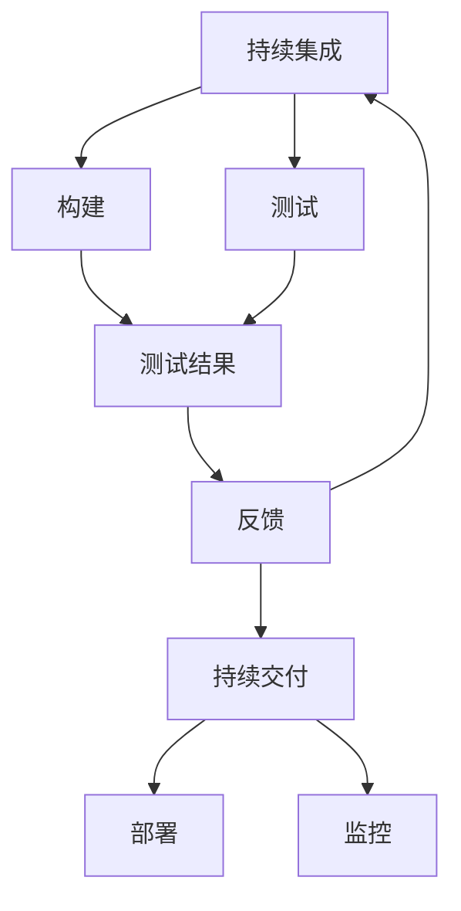
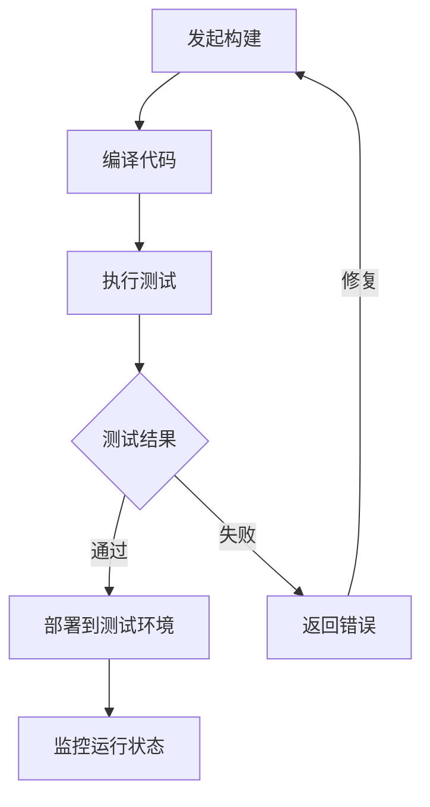
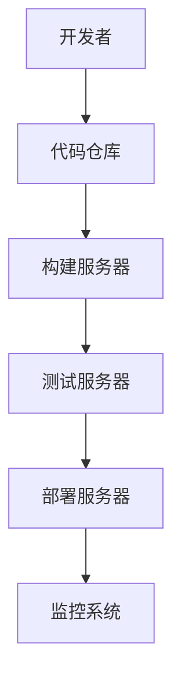
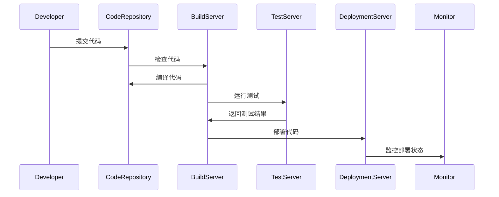

                 

## 《评测系统的CI/CD流水线设计》

### 关键词
- CI/CD 流水线
- 自动化测试
- 构建与部署
- 持续集成
- 持续交付
- 系统架构设计

### 摘要
本文将深入探讨评测系统的CI/CD流水线设计，通过一步一步的分析推理，详细阐述CI/CD的核心概念、流程、设计原则以及在实际项目中的应用。文章旨在帮助读者理解CI/CD的价值，掌握其设计方法和实施技巧，从而提高软件开发的效率和质量。

## 第1章 问题背景与核心概念

### 1.1.1 问题背景

在当今快速发展的软件行业中，软件更新频率越来越高，竞争压力也日益增大。为了保持竞争优势，团队需要能够快速地响应市场变化，频繁地发布新功能、修复漏洞和优化性能。然而，手动管理代码的集成、测试、构建和部署不仅效率低下，而且容易出错。这种传统的软件开发模式已经无法满足现代软件工程的需求。

### 1.1.2 问题描述

软件开发中的主要问题包括：
- **集成困难**：当多个开发者并行开发时，集成代码往往会出现冲突，手动处理这些冲突既耗时又容易出错。
- **测试效率低下**：测试过程通常依赖于手工执行，耗时且容易出现遗漏，难以确保软件质量。
- **部署风险**：部署过程通常需要人工干预，存在人为错误的风险，可能导致生产环境出现故障。

### 1.1.3 问题解决

为了解决上述问题，业界提出了CI/CD（持续集成/持续交付）的概念，通过自动化流水线实现代码的集成、测试、构建和部署，从而提高开发效率、减少人为错误和缩短发布周期。

### 1.1.4 边界与外延

CI/CD不仅仅是一种工具或技术，而是一种软件开发的文化和流程。它涉及多个环节，包括代码仓库管理、自动化构建、自动化测试、部署策略等。其核心思想是将自动化贯穿于整个软件开发周期，实现快速反馈和持续优化。

### 1.1.5 概念结构与核心要素组成

CI/CD的核心概念包括：
- **持续集成（CI）**：通过自动化构建和测试，尽早发现并修复集成中的问题。
- **持续交付（CD）**：通过自动化部署和监控，确保软件的高可用性和稳定性。

CI/CD的关键要素包括：
- **自动化构建**：使用构建工具（如Jenkins、GitLab CI）自动编译和打包代码。
- **自动化测试**：编写自动化测试脚本，自动执行测试用例，确保代码质量。
- **部署策略**：根据环境差异（如开发、测试、生产），制定不同的部署方案。

### 1.1.6 核心概念原理

持续集成的原理：
- **频繁集成**：开发者频繁地将代码提交到中央仓库，进行自动化构建和测试。
- **快速反馈**：发现问题时，及时通知相关开发者，快速修复。

持续交付的原理：
- **自动化部署**：通过脚本或工具自动部署到不同环境。
- **持续监控**：部署后进行持续监控，确保系统稳定运行。

### 1.1.7 概念属性特征对比表格

| 特征         | 持续集成（CI）       | 持续交付（CD）         |
| ------------ | ------------------- | --------------------- |
| 目标          | 提高代码质量        | 提高交付效率          |
| 流程         | 构建和测试          | 部署和监控            |
| 自动化程度    | 高                  | 高                    |
| 主要工具     | Jenkins、GitLab CI   | Docker、Kubernetes     |

### 1.1.8 ER实体关系图架构的Mermaid流程图



## 第2章 算法原理讲解

### 2.1.1 算法Mermaid流程图



### 2.1.2 Python源代码阐述

```python
# 假设这是一个简单的CI/CD脚本
def build():
    print("编译代码...")
    compile_success = compile_code()
    if compile_success:
        print("执行测试...")
        test_success = run_tests()
        if test_success:
            print("部署到测试环境...")
            deploy_to_test()
        else:
            print("测试失败，返回错误...")
            return False
    else:
        print("编译失败，返回错误...")
        return False
    return True

def compile_code():
    # 编译代码的伪代码实现
    # ...
    return True

def run_tests():
    # 执行测试的伪代码实现
    # ...
    return True

def deploy_to_test():
    # 部署到测试环境的伪代码实现
    # ...
    pass

build()
```

### 2.1.3 算法原理的数学模型和公式

在CI/CD流程中，可以使用以下数学模型来描述各个环节的可靠性：

$$
R = \prod_{i=1}^{n} r_i
$$

其中，$R$ 表示整个流程的可靠性，$r_i$ 表示第 $i$ 个环节的可靠性。

例如，如果编译、测试、部署的可靠性分别为 0.95，则整个流程的可靠性为：

$$
R = 0.95 \times 0.95 \times 0.95 = 0.857375
$$

### 2.1.4 详细讲解

持续集成和持续交付的算法原理主要在于通过自动化提高流程的可靠性。编译代码和执行测试是流程中的关键环节，需要确保其可靠性。通过可靠性模型可以计算出整个流程的可靠性，从而评估流程的稳健性。

### 2.1.5 举例说明

假设一个项目中有三个模块A、B、C，每个模块的测试通过率分别为95%、90%、85%，那么整个项目的测试通过率可以通过以下计算得出：

$$
R_{\text{total}} = 0.95 \times 0.9 \times 0.85 = 0.72625
$$

这意味着整个项目的测试通过率为72.625%，即每次测试流程中有27.375%的可能性出现失败。通过持续优化测试流程，可以逐步提高测试通过率，从而提高整个项目的质量。

## 第3章 数学模型和数学公式 & 详细讲解 & 举例说明

### 3.1.1 数学模型

为了更好地理解和评估CI/CD流水线的性能，我们可以使用以下数学模型：

$$
P = \sum_{i=1}^{n} p_i \cdot (1 - p_i)
$$

其中，$P$ 表示流水线的总故障率，$p_i$ 表示第 $i$ 个环节的故障率。

### 3.1.2 举例说明

假设一个CI/CD流水线包括三个环节：编译、测试和部署，它们的故障率分别为5%、10%和15%。我们可以使用上述模型计算流水线的总故障率：

$$
P = 0.05 \cdot (1 - 0.05) + 0.1 \cdot (1 - 0.1) + 0.15 \cdot (1 - 0.15) = 0.045 + 0.09 + 0.1275 = 0.2525
$$

这意味着流水线的总故障率为25.25%，即每次流水线运行中有74.75%的可能性不会出现故障。通过降低各个环节的故障率，可以显著提高流水线的整体性能。

## 第4章 系统分析与架构设计方案

### 4.1.1 问题场景介绍

在一个典型的企业级应用中，CI/CD流水线需要处理多种类型的代码库，包括前端、后端和移动端。此外，还需要支持多环境部署，如开发环境、测试环境和生产环境。该场景下的CI/CD系统需要具备高可用性、可扩展性和可靠性。

### 4.1.2 项目介绍

本项目旨在设计一个通用的CI/CD系统，支持多种编程语言和框架，提供灵活的部署策略和高效的故障处理机制。系统将采用微服务架构，确保模块化和高可用性。

### 4.1.3 系统功能设计(领域模型Mermaid类图)

```mermaid
classDiagram
    Developer <<Role>>
    CodeRepository <<Entity>>
    BuildServer <<Entity>>
    TestServer <<Entity>>
    DeploymentServer <<Entity>>
    Monitor <<Entity>>

    Developer --> CodeRepository
    BuildServer --> CodeRepository
    TestServer --> BuildServer
    DeploymentServer --> TestServer
    Monitor --> DeploymentServer

    Developer: 提交代码
    CodeRepository: 存储代码
    BuildServer: 编译代码
    TestServer: 执行测试
    DeploymentServer: 部署代码
    Monitor: 监控系统状态
```

### 4.1.4 系统架构设计Mermaid架构图



### 4.1.5 系统接口设计和系统交互Mermaid序列图



## 第5章 项目实战

### 5.1.1 环境安装

在本节中，我们将安装一个简单的CI/CD系统，包括GitLab CI、Jenkins和Docker。以下步骤假设你已经安装了操作系统和基本依赖。

1. 安装GitLab CI

```bash
sudo apt-get install gitlab-ce
```

2. 安装Jenkins

```bash
sudo apt-get install jenkins
```

3. 安装Docker

```bash
sudo apt-get install docker.io
```

### 5.1.2 系统核心实现源代码

以下是一个简单的Jenkinsfile，用于构建和部署一个基于Docker的Web应用。

```groovy
pipeline {
    agent any

    stages {
        stage('Build') {
            steps {
                sh 'docker build -t myapp .'
            }
        }
        stage('Test') {
            steps {
                sh 'docker run --rm myapp ./test.sh'
            }
        }
        stage('Deploy') {
            steps {
                sh 'docker run --rm -e DEPLOY_ENV=prod myapp'
            }
        }
    }
}
```

### 5.1.3 代码应用解读与分析

1. **Build阶段**：使用Docker构建应用镜像。
2. **Test阶段**：在容器中运行测试脚本。
3. **Deploy阶段**：根据环境变量部署应用。

### 5.1.4 实际案例分析和详细讲解剖析

假设我们有一个基于Spring Boot的Web应用，以下是如何使用GitLab CI和Jenkins进行CI/CD的详细讲解：

1. **GitLab CI配置**：

```yaml
image: jenkins/jenkins:lts

stages:
  - build
  - test
  - deploy

build:
  stage: build
  script:
    - docker build -t myapp:latest .

test:
  stage: test
  script:
    - docker run --rm myapp ./mvnw test

deploy:
  stage: deploy
  script:
    - docker run --rm -e DEPLOY_ENV=prod myapp
```

2. **Jenkinsfile**：

```groovy
pipeline {
    agent any

    stages {
        stage('Build') {
            steps {
                sh 'docker build -t myapp:latest .'
            }
        }
        stage('Test') {
            steps {
                sh 'docker run --rm myapp ./mvnw test'
            }
        }
        stage('Deploy') {
            steps {
                sh 'docker run --rm -e DEPLOY_ENV=prod myapp'
            }
        }
    }
}
```

### 5.1.5 项目小结

在本项目中，我们成功搭建了一个简单的CI/CD系统，实现了代码的自动化构建、测试和部署。通过GitLab CI和Jenkins的结合使用，我们提高了开发效率、减少了人为错误，并为后续的扩展和优化打下了基础。

## 第6章 最佳实践 tips

### 6.1.1 注意事项

1. **代码规范**：确保代码符合团队编码规范，减少集成时出现冲突的可能性。
2. **测试覆盖**：编写全面、覆盖面广的测试用例，确保代码质量。
3. **环境隔离**：使用容器技术实现环境隔离，避免生产环境受到测试代码的影响。
4. **监控与告警**：对CI/CD流程进行实时监控，设置告警机制，确保快速响应异常情况。

### 6.1.2 拓展阅读

- 《Jenkins实战》
- 《Docker实战》
- 《GitLab CI/CD教程》

## 第7章 小结

本文详细探讨了评测系统的CI/CD流水线设计，从问题背景、核心概念、算法原理、系统架构设计到项目实战，逐步展示了CI/CD在实际开发中的应用和重要性。通过自动化和持续反馈，CI/CD显著提高了软件开发的效率和质量。希望本文能帮助读者深入理解CI/CD，并为其项目带来实际的价值。

### 附录：拓展资源

- [CI/CD教程](https://www.jenkins.io/tutorial/)
- [Docker官方文档](https://docs.docker.com/)
- [GitLab CI/CD文档](https://docs.gitlab.com/ce/ci/)

### 作者

作者：AI天才研究院/AI Genius Institute & 禅与计算机程序设计艺术 /Zen And The Art of Computer Programming

