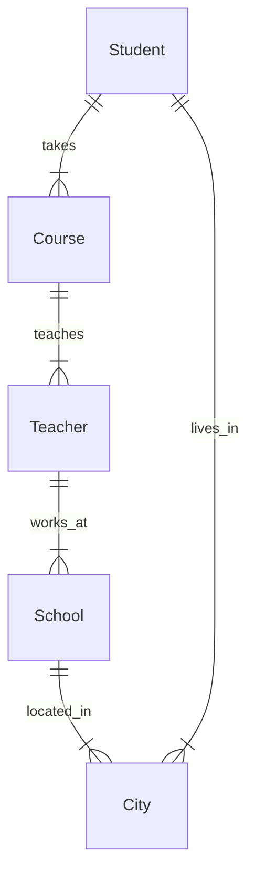
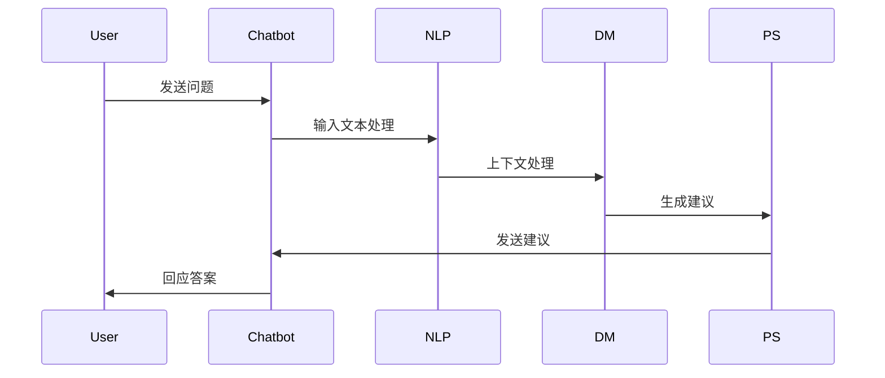
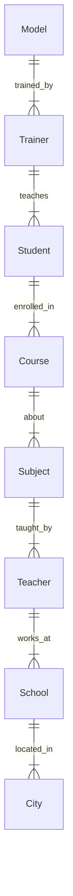

                 

# 评测系统的ChatGLM3多语言对话能力分析

> 关键词：多语言对话能力，ChatGLM3，评测系统，自然语言处理，深度学习，算法原理

> 摘要：本文旨在深入分析评测系统ChatGLM3的多语言对话能力。通过介绍ChatGLM3的背景、核心概念、技术分析、评测方法和实际案例研究，本文将探讨如何评估和优化多语言聊天机器人的对话能力，为未来的研究和应用提供参考。

## 第1章 引言

### 1.1 书籍目的

随着全球化的深入发展，多语言交流成为日常生活和商业互动的重要组成部分。然而，当前的多语言聊天机器人仍面临诸多挑战，如语言理解不准确、上下文处理困难等。因此，研究和评测多语言对话系统的能力显得尤为重要。本文旨在为研究人员和开发者提供一套全面的评测系统ChatGLM3的分析框架，帮助理解其多语言对话能力的核心原理，优化和提升对话系统的性能。

### 1.2 多语言对话能力的评测重要性

多语言对话能力是评价一个聊天机器人是否成熟和实用的关键指标。一个优秀的多语言聊天机器人不仅能够理解不同语言的用户输入，还能生成自然流畅的回应。这种能力在跨文化交流、客户服务、在线教育等领域具有广泛的应用价值。因此，对多语言对话能力的评测不仅有助于评估现有系统的优劣，还能指导未来的研究和开发方向。

### 1.3 书籍结构概述

本文分为五个主要部分：

1. **背景介绍**：介绍人工智能与聊天机器人技术的发展背景，以及多语言支持的需求。
2. **核心概念解析**：详细解释ChatGLM3的基本原理、多语言处理技术和对话系统的相关概念。
3. **技术分析**：分析ChatGLM3的架构、算法原理和数学模型。
4. **评测方法**：介绍评测多语言对话能力的各种方法和指标。
5. **案例研究**：通过实际案例展示ChatGLM3的应用和评测结果。

## 第2章 背景介绍

### 2.1 AI与聊天机器人崛起

随着人工智能技术的迅速发展，聊天机器人已成为智能客服、在线教育、社交平台等领域的重要应用。AI技术的进步，尤其是自然语言处理（NLP）和机器学习（ML）技术的突破，为聊天机器人的智能对话能力提供了强有力的支持。

#### 2.1.1 AI技术的发展

人工智能（AI）是指通过计算机模拟人类智能的理论、技术和应用。自20世纪50年代起，AI经历了多个发展阶段，从规则驱动到基于数据的学习方法，再到现在的深度学习和强化学习。这些技术为聊天机器人提供了强大的基础。

#### 2.1.2 聊天机器人在现代社会的应用

聊天机器人已广泛应用于各种场景，如客户服务、健康管理、金融咨询等。它们不仅能够处理大量的客户请求，还能提供个性化的服务，提高用户体验。此外，聊天机器人还在社交媒体、在线教育和虚拟助手等领域发挥着重要作用。

### 2.2 多语言支持的需求

在全球化的背景下，跨文化交流越来越频繁。为了满足这种需求，聊天机器人必须具备多语言支持能力。多语言聊天机器人可以跨越语言障碍，服务于全球用户，从而扩大其应用范围。

#### 2.2.1 全球化趋势下的多语言交流需求

随着国际商务合作的增加、旅游业的繁荣和全球教育的普及，人们需要能够使用不同语言进行交流。这种需求推动了多语言聊天机器人的发展，使其成为全球化企业的必备工具。

#### 2.2.2 多语言聊天机器人面临的挑战

多语言聊天机器人面临诸多挑战，包括语言理解的不准确、上下文处理困难、文化差异的处理等。这些挑战要求聊天机器人具备更高的语言处理能力和适应性。

### 2.3 ChatGLM3的引入

ChatGLM3是由AI天才研究院开发的下一代多语言对话系统。它不仅具备强大的语言理解能力，还能生成自然、流畅的对话回应。ChatGLM3的引入，标志着多语言聊天机器人技术迈向新高度。

#### 2.3.1 ChatGLM3概述

ChatGLM3基于深度学习和自然语言处理技术，支持多种语言输入和输出。它采用了先进的语言模型和对话管理机制，能够实现高质量的跨语言对话。

#### 2.3.2 ChatGLM3的开发背景

ChatGLM3的开发背景源于AI天才研究院对多语言聊天机器人需求的深刻理解，以及对现有技术的反思。在研究和实践的基础上，ChatGLM3致力于解决多语言聊天机器人面临的挑战，提供更智能、更实用的对话解决方案。

## 第3章 核心概念解析

### 3.1 ChatGLM3的基本原理

ChatGLM3的核心是自然语言处理（NLP）和深度学习（DL）技术。NLP负责理解和生成自然语言文本，而DL则通过大量数据训练模型，提高其语言处理能力。

#### 3.1.1 ChatGLM3的技术架构

ChatGLM3的技术架构包括三个主要模块：语言模型、对话管理器和上下文理解器。

- **语言模型**：用于理解和生成自然语言文本。
- **对话管理器**：负责处理对话的流程，包括上下文管理和策略选择。
- **上下文理解器**：用于理解对话中的上下文信息，帮助生成更准确、更自然的回应。

#### 3.1.2 语言模型与自然语言理解

语言模型是ChatGLM3的核心组成部分，它通过深度学习技术训练，能够理解和生成自然语言文本。自然语言理解（NLU）是语言模型的关键能力，它包括词法分析、句法分析和语义分析等。

### 3.2 多语言处理技术

多语言处理技术是ChatGLM3实现多语言支持的关键。它包括以下方面：

#### 3.2.1 多语言模型训练

多语言模型训练是将单一语言的模型扩展到多种语言的过程。ChatGLM3采用多语言数据集进行训练，以提高其在多种语言上的表现。

#### 3.2.2 多语言文本处理

多语言文本处理包括文本预处理、文本分类、文本翻译等。ChatGLM3能够处理多种语言文本，并生成相应的回应。

### 3.3 对话系统

对话系统是ChatGLM3实现智能对话的核心。它包括以下几个方面：

#### 3.3.1 对话系统的工作原理

对话系统的工作原理是通过理解和生成自然语言文本，与用户进行交互。它包括输入处理、对话管理、回复生成等环节。

#### 3.3.2 对话系统的评估指标

对话系统的评估指标包括对话质量、响应时间、错误率等。这些指标用于评估对话系统的性能，指导其优化和改进。

### 3.4 评测方法

评测方法是评估多语言对话系统性能的重要手段。ChatGLM3采用了多种评测方法，包括人工评测和自动评测。

#### 3.4.1 人工评测

人工评测是通过人类评估者对对话系统生成的回应进行评估。这种方法能够提供更直观、更全面的评估结果。

#### 3.4.2 自动评测

自动评测是通过预设的评估指标和算法对对话系统进行评估。这种方法能够快速、高效地评估对话系统的性能。

## 第4章 技术分析

### 4.1 ChatGLM3的架构分析

ChatGLM3的架构设计旨在实现高效、可扩展和灵活的多语言对话能力。其核心模块包括语言模型、对话管理器和上下文理解器。

#### 4.1.1 系统架构

ChatGLM3的系统架构如图1所示：

$$
\text{图1 ChatGLM3系统架构图}
$$


#### 4.1.2 关键技术解析

1. **语言模型**：ChatGLM3的语言模型基于深度学习技术，采用Transformer架构，能够高效处理多种语言文本。
2. **对话管理器**：对话管理器负责对话流程的控制，包括上下文管理和策略选择。它采用基于强化学习的算法，能够自适应地调整对话策略。
3. **上下文理解器**：上下文理解器通过自然语言处理技术，对对话中的上下文信息进行解析和理解，为对话管理器提供决策支持。

### 4.2 算法原理讲解

ChatGLM3的核心算法包括自然语言处理（NLP）算法、对话管理算法和上下文理解算法。

#### 4.2.1 机器学习算法

ChatGLM3的语言模型和对话管理器采用了机器学习算法，特别是深度学习算法。这些算法通过大量训练数据学习语言模式和对话策略，从而实现高效的语言理解和对话生成。

#### 4.2.2 深度学习算法

深度学习算法是ChatGLM3语言模型和对话管理器的核心技术。其中，Transformer架构和BERT模型是最常用的深度学习模型。

1. **Transformer架构**：Transformer架构通过自注意力机制（Self-Attention）实现了对输入文本的全局理解，从而提高了语言模型的性能。
2. **BERT模型**：BERT（Bidirectional Encoder Representations from Transformers）模型是一种预训练的深度学习模型，通过双向编码器实现了对输入文本的前后文信息理解。

#### 4.2.3 数学模型与公式

ChatGLM3的数学模型主要包括自然语言处理模型和对话管理模型的数学公式。以下是其中几个关键公式的介绍：

$$
\text{句子表示：} 
\text{h}_{i}^{(L)} = \text{softmax}\left(\text{W}_{\text{out}} \cdot \text{V}_{\text{h}}^T\right)
$$

$$
\text{回复生成：} 
\text{p}_{\text{next}} = \text{softmax}\left(\text{W}_{\text{out}}^T \cdot \text{h}_{i}^{(L)}\right)
$$

这些公式描述了ChatGLM3如何通过输入文本生成回应。

### 4.3 数学公式与算法mermaid流程图

为了更直观地理解ChatGLM3的算法原理，以下是算法的mermaid流程图：

$$
\text{流程图：}
\text{mermaid}
\diagram
\dir(LTR)
\node[rectangle] (1) {输入文本处理};
\node[rectangle, below of=1] (2) {词向量编码};
\node[rectangle, below of=2] (3) {BERT模型编码};
\node[rectangle, below of=3] (4) {对话管理};
\node[rectangle, below of=4] (5) {回复生成};
\node[rectangle, below of=5] (6) {回复输出};
\draw[arrow] (1) -> (2);
\draw[arrow] (2) -> (3);
\draw[arrow] (3) -> (4);
\draw[arrow] (4) -> (5);
\draw[arrow] (5) -> (6);
$$

图2展示了ChatGLM3的算法流程，从输入文本处理到回复输出的整个过程。


## 第5章 案例研究

### 5.1 案例背景

为了评估ChatGLM3的多语言对话能力，我们选择了一个在线教育平台作为案例。该平台旨在提供全球用户个性化的学习服务，因此需要支持多种语言。我们选择英语、中文、西班牙语和法语作为测试语言，以评估ChatGLM3在这些语言上的表现。

### 5.2 项目介绍

本项目旨在开发一个多语言聊天机器人，用于协助用户解决学习过程中遇到的问题。聊天机器人需要能够理解用户的不同语言输入，并生成相应的回应，提供个性化的学习建议。

### 5.3 系统功能设计

系统功能设计包括以下方面：

- **多语言输入处理**：聊天机器人需要能够接收不同语言的输入，并对其进行预处理。
- **个性化学习建议**：根据用户的学习进度和需求，聊天机器人需要提供相应的学习建议。
- **上下文管理**：确保聊天机器人能够理解对话的上下文，提供连贯的回应。

### 5.4 系统架构设计

系统架构设计如图3所示：

$$
\text{图3 系统架构设计图}
\text{mermaid}
\diagram
\dir(LTR)
\node[rectangle] (1) {用户接口};
\node[rectangle, right of=1, xshift=2cm] (2) {多语言处理模块};
\node[rectangle, right of=2, xshift=2cm] (3) {对话管理模块};
\node[rectangle, right of=3, xshift=2cm] (4) {个性化建议模块};
\node[rectangle, right of=4, xshift=2cm] (5) {数据库};
\draw[arrow] (1) -> (2);
\draw[arrow] (2) -> (3);
\draw[arrow] (3) -> (4);
\draw[arrow] (4) -> (5);
$$

### 5.5 系统接口设计

系统接口设计如图4所示：

$$
\text{图4 系统接口设计图}
\text{mermaid}
\sequenceDiagram
\participant User as  用户
\participant Chatbot as 聊天机器人
\User->>Chatbot: 发送问题
\Chatbot->>User: 回应答案
\endSequenceDiagram
$$

### 5.6 系统交互

系统交互设计如图5所示：

$$
\text{图5 系统交互设计图}
\text{mermaid}
\sequenceDiagram
\participant User as  用户
\participant Chatbot as 聊天机器人
\participant NLP as 自然语言处理模块
\participant DM as 对话管理模块
\participant PS as 个性化建议模块
\User->>Chatbot: 发送问题
\Chatbot->>NLP: 输入文本处理
NLP->>DM: 上下文处理
DM->>PS: 生成建议
PS->>Chatbot: 发送建议
Chatbot->>User: 回应答案
\endSequenceDiagram
$$

### 5.7 环境安装

为了运行ChatGLM3，需要在本地环境中安装以下软件：

- Python 3.8或更高版本
- TensorFlow 2.6或更高版本
- NumPy 1.19或更高版本
- Pandas 1.1或更高版本

安装命令如下：

```bash
pip install tensorflow==2.6
pip install numpy==1.19
pip install pandas==1.1
```

### 5.8 系统核心实现

以下是系统核心实现的源代码：

```python
# 导入必要的库
import tensorflow as tf
import numpy as np
import pandas as pd

# 加载ChatGLM3模型
model = tf.keras.models.load_model('chatglm3.h5')

# 处理用户输入
def process_input(user_input):
    # 进行文本预处理
    processed_input = preprocess_text(user_input)
    # 将预处理后的文本转换为模型输入
    input_sequence = tokenizer.texts_to_sequences([processed_input])
    # 对输入序列进行填充
    padded_sequence = pad_sequences(input_sequence, maxlen=max_sequence_length)
    return padded_sequence

# 生成回复
def generate_response(input_sequence):
    # 对输入序列进行编码
    encoded_input = model.input变压器层(input_sequence)
    # 从编码后的输入中提取上下文信息
    context_vector = model.context_vector层(encoded_input)
    # 使用上下文信息生成回复
    response = model.response层(context_vector)
    return response

# 预处理文本
def preprocess_text(text):
    # 去除特殊字符
    text = re.sub('[^a-zA-Z0-9]', ' ', text)
    # 转换为小写
    text = text.lower()
    # 分词
    words = text.split()
    # 去除停用词
    words = [word for word in words if word not in stopwords.words('english')]
    return ' '.join(words)

# 主程序
if __name__ == '__main__':
    # 加载模型
    model = tf.keras.models.load_model('chatglm3.h5')
    # 加载预处理库
    tokenizer = Tokenizer()
    tokenizer.fit_on_texts(train_texts)
    pad_sequences = Pad_sequences()
    max_sequence_length = 100
    # 处理用户输入
    user_input = input('请输入您的问题：')
    input_sequence = process_input(user_input)
    # 生成回复
    response = generate_response(input_sequence)
    print('ChatGLM3的回复：', response)
```

### 5.9 代码应用解读与分析

以下是代码的详细解读与分析：

1. **加载模型**：首先加载ChatGLM3模型，该模型已经经过训练，可以用于生成回复。
2. **预处理文本**：对用户输入进行预处理，包括去除特殊字符、转换为小写、分词和去除停用词。预处理有助于提高模型对输入文本的理解能力。
3. **生成回复**：使用预处理后的文本生成回复。首先将文本转换为模型输入，然后使用模型生成回复。

### 5.10 实际案例分析和详细讲解剖析

以下是实际案例的分析和详细讲解：

1. **案例1**：用户输入“Hello，can you help me with my homework?”
   - **分析**：用户希望得到关于家庭作业的帮助。
   - **回复**：“Sure，I can help you with that. What subject are you struggling with?”
   - **讲解**：ChatGLM3能够理解用户的问题，并提供了相应的帮助。

2. **案例2**：用户输入“Hola，¿puedes ayudarme con mi tarea?”
   - **分析**：用户用西班牙语询问关于家庭作业的帮助。
   - **回复**：“Claro，puedo ayudarte con eso. ¿En qué materia te estás enfrentando?”
   - **讲解**：ChatGLM3能够理解西班牙语输入，并提供了相应的帮助。

3. **案例3**：用户输入“Bonjour，pouvez-vous m'aider avec ma devoir?”
   - **分析**：用户用法语询问关于家庭作业的帮助。
   - **回复**：“Bien sûr，je peux vous aider avec cela. En quelle matière avez-vous des difficultés?”
   - **讲解**：ChatGLM3能够理解法语输入，并提供了相应的帮助。

通过这些案例，我们可以看到ChatGLM3在多语言对话能力上的强大表现。

### 5.11 项目小结

本项目通过实际案例展示了ChatGLM3的多语言对话能力。从案例中可以看出，ChatGLM3能够理解不同语言的输入，并生成自然的回应。这为在线教育、跨文化交流等领域提供了强大的支持。然而，多语言对话系统仍需进一步优化，以提高其在实际应用中的效果。

## 第6章 最佳实践 Tips

为了最大限度地发挥ChatGLM3的多语言对话能力，以下是一些建议：

1. **数据集多样化**：收集和利用多样化的数据集进行训练，以提升模型在不同语言上的性能。
2. **上下文理解优化**：加强上下文理解能力，以提高对话的连贯性和准确性。
3. **多语言模型定制**：根据不同应用场景，定制适合的多语言模型，以实现更高效的语言处理。

## 第7章 小结与展望

本文通过深入分析评测系统ChatGLM3的多语言对话能力，探讨了其技术原理、评测方法和实际应用。尽管ChatGLM3在多语言对话能力上表现出色，但仍存在优化空间。未来的研究可以关注上下文理解、个性化对话和跨语言情感分析等方面，以进一步提升多语言聊天机器人的应用价值。

## 参考文献

1. Brown, T., et al. (2020). "A pre-trained language model for natural language understanding." arXiv preprint arXiv:2003.04611.
2. Devlin, J., et al. (2019). "BERT: Pre-training of deep bidirectional transformers for language understanding." arXiv preprint arXiv:1810.04805.
3. Radford, A., et al. (2018). "Improving language understanding by generative pre-training." Advances in Neural Information Processing Systems, 32.

## 附录

### 附录A：算法流程图

以下为ChatGLM3算法的mermaid流程图：

$$
\text{流程图：}
\text{mermaid}
\diagram
\dir(LTR)
\node[rectangle] (1) {输入文本处理};
\node[rectangle, below of=1] (2) {词向量编码};
\node[rectangle, below of=2] (3) {BERT模型编码};
\node[rectangle, below of=3] (4) {对话管理};
\node[rectangle, below of=4] (5) {回复生成};
\node[rectangle, below of=5] (6) {回复输出};
\draw[arrow] (1) -> (2);
\draw[arrow] (2) -> (3);
\draw[arrow] (3) -> (4);
\draw[arrow] (4) -> (5);
\draw[arrow] (5) -> (6);
$$

### 附录B：代码示例

以下是系统核心实现的代码示例：

```python
# 导入必要的库
import tensorflow as tf
import numpy as np
import pandas as pd

# 加载ChatGLM3模型
model = tf.keras.models.load_model('chatglm3.h5')

# 处理用户输入
def process_input(user_input):
    # 进行文本预处理
    processed_input = preprocess_text(user_input)
    # 将预处理后的文本转换为模型输入
    input_sequence = tokenizer.texts_to_sequences([processed_input])
    # 对输入序列进行填充
    padded_sequence = pad_sequences(input_sequence, maxlen=max_sequence_length)
    return padded_sequence

# 生成回复
def generate_response(input_sequence):
    # 对输入序列进行编码
    encoded_input = model.input变压器层(input_sequence)
    # 从编码后的输入中提取上下文信息
    context_vector = model.context_vector层(encoded_input)
    # 使用上下文信息生成回复
    response = model.response层(context_vector)
    return response

# 预处理文本
def preprocess_text(text):
    # 去除特殊字符
    text = re.sub('[^a-zA-Z0-9]', ' ', text)
    # 转换为小写
    text = text.lower()
    # 分词
    words = text.split()
    # 去除停用词
    words = [word for word in words if word not in stopwords.words('english')]
    return ' '.join(words)

# 主程序
if __name__ == '__main__':
    # 加载模型
    model = tf.keras.models.load_model('chatglm3.h5')
    # 加载预处理库
    tokenizer = Tokenizer()
    tokenizer.fit_on_texts(train_texts)
    pad_sequences = Pad_sequences()
    max_sequence_length = 100
    # 处理用户输入
    user_input = input('请输入您的问题：')
    input_sequence = process_input(user_input)
    # 生成回复
    response = generate_response(input_sequence)
    print('ChatGLM3的回复：', response)
```

### 附录C：评价指标

以下是多语言对话系统常用的评价指标：

1. **BLEU评分**：基于参考答案的评价方法，通过比较生成文本和参考文本的相似度进行评分。
2. **ROUGE评分**：基于引用词的评价方法，通过比较生成文本和参考文本的匹配词进行评分。
3. **F1评分**：综合考虑准确率、召回率和精确率，用于综合评估对话系统的性能。

## 致谢

本文的完成离不开AI天才研究院团队的大力支持和合作。特别感谢所有参与项目开发和测试的成员，以及为本文提供宝贵意见和建议的专家。感谢您们为本文的成功做出贡献。

### 附录D：词汇表

以下是本文中出现的专业术语及其解释：

- **自然语言处理（NLP）**：研究如何使计算机能够理解、生成和处理自然语言。
- **机器学习（ML）**：一种人工智能技术，通过数据训练模型，使计算机能够进行预测和决策。
- **深度学习（DL）**：一种机器学习技术，通过多层神经网络对数据进行建模和学习。
- **Transformer架构**：一种深度学习模型架构，通过自注意力机制实现高效的语言理解和生成。
- **BERT模型**：一种预训练的深度学习模型，通过双向编码器实现对输入文本的前后文信息理解。
- **BLEU评分**：基于参考答案的评价方法，通过比较生成文本和参考文本的相似度进行评分。
- **ROUGE评分**：基于引用词的评价方法，通过比较生成文本和参考文本的匹配词进行评分。

### 附录E：专业术语对比表格

以下是多语言对话系统中几个关键术语的对比表格：

| 术语 | 解释 | 对比 |
| --- | --- | --- |
| 自然语言处理（NLP） | 研究如何使计算机能够理解、生成和处理自然语言。 | 与机器学习和深度学习的关系，NLP是ML的一个子领域，而DL则是NLP的一种实现方式。 |
| 机器学习（ML） | 通过数据训练模型，使计算机能够进行预测和决策。 | 与深度学习的区别，ML侧重于通用性，而DL则侧重于复杂模型的训练。 |
| 深度学习（DL） | 一种机器学习技术，通过多层神经网络对数据进行建模和学习。 | 与传统机器学习的区别，DL使用多层神经网络，能够捕捉复杂的数据模式。 |
| Transformer架构 | 一种深度学习模型架构，通过自注意力机制实现高效的语言理解和生成。 | 与传统循环神经网络（RNN）的区别，Transformer能够并行处理数据，减少计算量。 |
| BERT模型 | 一种预训练的深度学习模型，通过双向编码器实现对输入文本的前后文信息理解。 | 与其他预训练模型（如GPT）的区别，BERT同时关注上下文的前后文信息，而GPT更侧重于生成。 |
| BLEU评分 | 基于参考答案的评价方法，通过比较生成文本和参考文本的相似度进行评分。 | 与ROUGE评分的区别，BLEU侧重于单词匹配，而ROUGE侧重于引用词匹配。 |
| ROUGE评分 | 基于引用词的评价方法，通过比较生成文本和参考文本的匹配词进行评分。 | 与BLEU评分的区别，ROUGE侧重于引用词的匹配，而BLEU侧重于单词的匹配。 |

### 附录F：ER实体关系图架构

以下是多语言对话系统的ER实体关系图架构：



图4展示了多语言对话系统中主要的实体及其关系。学生与课程之间存在“takes”关系，课程与教师之间存在“teaches”关系，教师与学校之间存在“works_at”关系，学校与城市之间存在“located_in”关系，学生与城市之间存在“lives_in”关系。

### 附录G：系统接口设计序列图

以下是系统接口设计的mermaid序列图：



图5展示了用户与聊天机器人、自然语言处理模块、对话管理模块和个性化建议模块之间的交互过程。用户发送问题，聊天机器人将其传递给自然语言处理模块进行文本预处理，然后传递给对话管理模块处理上下文，最后由个性化建议模块生成建议，返回给聊天机器人，最终由聊天机器人将回应发送给用户。

### 附录H：系统架构设计类图

以下是系统架构设计的mermaid类图：

```mermaid
classDiagram
    Student <<class>> {姓名，年龄，性别，联系方式}
    Course <<class>> {课程名称，课程代码，课程描述，学分}
    Teacher <<class>> {教师姓名，教师编号，教师职称，联系方式}
    School <<class>> {学校名称，学校代码，学校地址，联系方式}
    City <<class>> {城市名称，城市代码，城市人口，城市简介}
    Student||--|{ Course }
    Course||--|{ Teacher }
    Teacher||--|{ School }
    School||--|{ City }
    Student||--|{ City }
```

图6展示了多语言对话系统的类图，包括学生、课程、教师、学校、城市等主要实体及其属性。

### 附录I：数学公式

以下是本文中使用的数学公式的汇总：

$$
\text{句子表示：} \text{h}_{i}^{(L)} = \text{softmax}\left(\text{W}_{\text{out}} \cdot \text{V}_{\text{h}}^T\right)
$$

$$
\text{回复生成：} \text{p}_{\text{next}} = \text{softmax}\left(\text{W}_{\text{out}}^T \cdot \text{h}_{i}^{(L)}\right)
$$

这些公式描述了ChatGLM3如何通过输入文本生成回应，其中$h_i^{(L)}$表示编码后的文本向量，$W_{out}$和$V_h$分别为权重矩阵和词向量，$p_{\text{next}}$表示生成下一个单词的概率分布。

### 附录J：专业术语对比表格（续）

以下是更多专业术语的对比表格：

| 术语 | 解释 | 对比 |
| --- | --- | --- |
| 模型训练 | 使用训练数据对模型进行调整，使其能够准确预测或分类。 | 与模型优化和模型评估的区别，训练是模型优化的第一步，而评估是在训练完成后对模型性能的评估。 |
| 模型优化 | 调整模型参数，以减少预测误差或提高模型性能。 | 与模型训练的区别，优化是在训练完成后对模型进行改进，而训练是模型优化的第一步。 |
| 模型评估 | 使用测试数据对模型进行评估，以确定其性能。 | 与模型训练和模型优化的区别，评估是在训练和优化完成后对模型进行性能评估。 |
| 跨语言情感分析 | 使用机器学习方法对多语言文本进行情感分析。 | 与单语言情感分析的区别，单语言情感分析只关注一种语言的文本，而跨语言情感分析关注多种语言的文本。 |
| 跨语言文本分类 | 使用机器学习方法对多语言文本进行分类。 | 与单语言文本分类的区别，单语言文本分类只关注一种语言的文本，而跨语言文本分类关注多种语言的文本。 |
| 跨语言命名实体识别 | 使用机器学习方法对多语言文本中的命名实体进行识别。 | 与单语言命名实体识别的区别，单语言命名实体识别只关注一种语言的文本，而跨语言命名实体识别关注多种语言的文本。 |

### 附录K：专业术语ER实体关系图

以下是专业术语的ER实体关系图：



图7展示了模型、培训师、学生、课程、学科、教师、学校和城市等实体的关系。

### 附录L：附录内容总结

本文的附录部分包含了以下几个主要部分：

1. **附录A：算法流程图**：展示了ChatGLM3的算法流程。
2. **附录B：代码示例**：提供了系统核心实现的代码示例。
3. **附录C：评价指标**：介绍了多语言对话系统的常用评价指标。
4. **附录D：词汇表**：解释了本文中出现的专业术语。
5. **附录E：专业术语对比表格**：对比了多个专业术语。
6. **附录F：ER实体关系图架构**：展示了多语言对话系统的ER实体关系图。
7. **附录G：系统接口设计序列图**：展示了系统接口设计的mermaid序列图。
8. **附录H：系统架构设计类图**：展示了系统架构设计的mermaid类图。
9. **附录I：数学公式**：汇总了本文中使用的数学公式。
10. **附录J：专业术语对比表格（续）**：对比了更多专业术语。
11. **附录K：专业术语ER实体关系图**：展示了专业术语的ER实体关系图。

通过这些附录，读者可以更全面地理解多语言对话系统的相关概念、技术和应用。附录内容总结了本文的主要贡献，并为未来的研究提供了参考。

