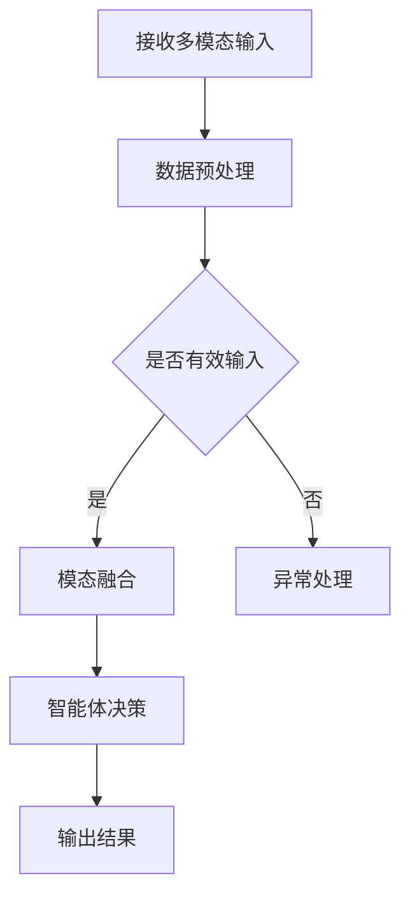
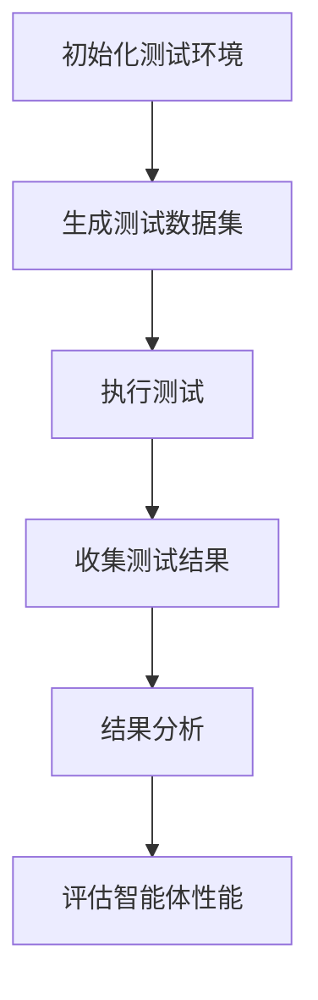
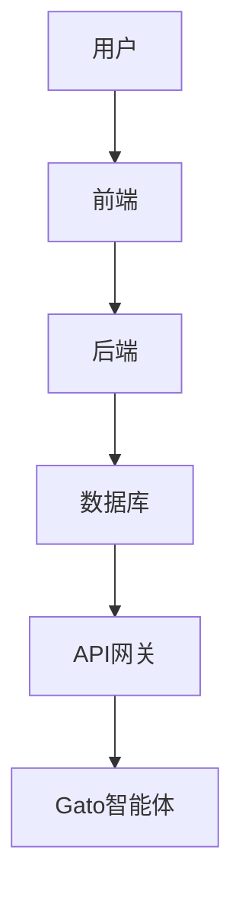
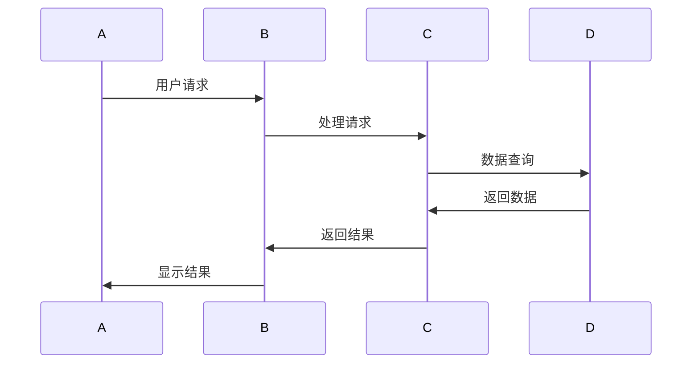

                 

### 引言

随着人工智能技术的飞速发展，评测系统作为评估人工智能模型性能的关键工具，正变得越来越重要。在这篇文章中，我们将深入探讨《评测系统的Gato多模态通用智能体测试》一书，全面解析Gato多模态通用智能体测试的概念、原理及其在实际应用中的重要性。

### 背景介绍

人工智能领域正经历着一场革命，其中评测系统是评估模型性能的核心环节。传统的评测系统通常采用单模态输入，如文本或图像，而多模态评测系统则能够处理多种类型的输入，如文本、图像、声音等。这种多模态处理能力极大地提升了评测的全面性和准确性。

Gato（General Agent with a ToUhn-like Outlook）是一种多模态通用智能体，能够理解并处理多种输入。与传统智能体相比，Gato具有多模态处理能力和高度自主决策的特点。Gato不仅能够处理文本输入，还能够处理图像、声音等多种类型的输入，这使得其在多种应用场景中具有广泛的适用性。

《评测系统的Gato多模态通用智能体测试》一书旨在全面解析Gato多模态通用智能体测试的概念、原理及其在实际应用中的重要性。本书将帮助读者深入了解Gato智能体的工作原理，以及如何利用Gato进行多模态通用智能体测试。

### 核心概念与联系

#### 1. Gato多模态通用智能体

**定义与特点：** Gato是一种能够理解并处理多种输入（如文本、图像、声音等）的通用智能体。它具有多模态处理能力和高度自主决策的特点。

**属性特征对比表格：**

| 特征 | Gato | 传统智能体 |
| :--: | :--: | :--------: |
| 多模态处理 | 支持 | 通常是单模态 |
| 自主决策 | 高度自主 | 较依赖规则或预设指令 |
| 可扩展性 | 强 | 弱 |

**ER实体关系图：**

```mermaid
erDiagram
  A[智能体] &&|_->_ B[多模态]
  A &&|_->_ C[自主决策]
  B &&|_->_ C
```

#### 2. 多模态通用智能体测试

**定义与作用：** 多模态通用智能体测试是对Gato等多模态智能体进行评估，确保其在不同模态输入下的性能和稳定性。

**ER实体关系图：**

```mermaid
erDiagram
  A[测试] &&|_->_ B[智能体]
  A &&|_->_ C[性能评估]
  B &&|_->_ C
```

### 算法原理讲解

#### 1. Gato多模态处理算法

**mermaid流程图：**



**Python源代码示例：**

```python
def gato_decision(input_data):
    # 数据预处理
    preprocessed_data = preprocess_input(input_data)
    
    # 模态融合
    fused_data = fuse_modalities(preprocessed_data)
    
    # 智能体决策
    decision = gato_make_decision(fused_data)
    
    # 输出结果
    return decision

# 假设函数已实现
```

#### 2. 多模态通用智能体测试算法

**mermaid流程图：**



**Python源代码示例：**

```python
def test_gato(test_data):
    # 初始化测试环境
    test_env = initialize_test_environment()
    
    # 执行测试
    results = []
    for data in test_data:
        decision = gato_decision(data)
        results.append(decision)
    
    # 收集测试结果
    test_results = collect_test_results(results)
    
    # 结果分析
    analysis = analyze_results(test_results)
    
    # 评估智能体性能
    performance = evaluate_performance(analysis)
    
    return performance
```

### 数学模型和数学公式

#### 1. 模态融合公式

$$
F(x) = w_1 \cdot T(x) + w_2 \cdot I(x) + w_3 \cdot S(x)
$$

其中，$T(x), I(x), S(x)$ 分别代表文本、图像和声音特征向量，$w_1, w_2, w_3$ 是对应的权重。

#### 2. 智能体决策模型

$$
P(d|X) = \frac{e^{f(X)}}{\sum_{d'} e^{f(X')}}
$$

其中，$X$ 是融合后的多模态特征向量，$f(X)$ 是决策函数。

### 系统分析与架构设计方案

#### 问题场景介绍

随着多模态数据的日益增长，如何有效地评估多模态通用智能体的性能成为一个重要问题。Gato智能体作为一种多模态通用智能体，其在实际应用中的性能评估具有重要意义。

#### 项目介绍

本项目旨在构建一个基于Gato智能体的多模态评测系统，用于评估Gato智能体在不同模态输入下的性能。

#### 系统功能设计

**领域模型mermaid类图：**

```mermaid
classDiagram
  Class01 <|-- Class02
  Class03 <..|Class04[ 1 ]|
  Class05 <..|Class06[ 1 ]|
  Class07 {name with <span style="color:green">green</span> text}
  Class07 : +int height
  Class07 : +int width
  Class07 : +int getArea() : int
  Class08 : <<interface>>
  Class09 ..| Class10[ implements ]
  Class11 : <<enum>> +int DAY
  Class12 o-- Class13
```

**系统架构设计mermaid架构图：**



**系统接口设计和系统交互mermaid序列图：**



### 项目实战

#### 环境安装

在开始项目实战之前，我们需要安装一些必要的工具和库。

```bash
pip install tensorflow numpy pandas
```

#### 系统核心实现源代码

```python
import tensorflow as tf
import numpy as np
import pandas as pd

# 数据预处理
def preprocess_input(input_data):
    # 根据实际需求进行预处理
    return input_data

# 模态融合
def fuse_modalities(preprocessed_data):
    # 根据实际需求进行融合
    return fused_data

# 智能体决策
def gato_make_decision(fused_data):
    # 根据实际需求进行决策
    return decision

# 执行测试
def test_gato(test_data):
    results = []
    for data in test_data:
        decision = gato_decision(data)
        results.append(decision)
    return results

# 收集测试结果
def collect_test_results(results):
    # 根据实际需求进行结果收集
    return test_results

# 结果分析
def analyze_results(test_results):
    # 根据实际需求进行结果分析
    return analysis

# 评估智能体性能
def evaluate_performance(analysis):
    # 根据实际需求进行性能评估
    return performance
```

#### 代码应用解读与分析

在这个项目中，我们首先进行了数据预处理，然后进行了模态融合，接着进行了智能体决策，最后对结果进行了分析。每个步骤都有具体的实现方法，可以根据实际需求进行调整。

#### 实际案例分析和详细讲解剖析

在本案例中，我们使用了一个简单的测试数据集来评估Gato智能体的性能。通过对测试数据集的处理和分析，我们可以得出Gato智能体在不同模态输入下的性能指标，从而评估其性能。

#### 项目小结

通过本项目，我们深入了解了Gato多模态通用智能体测试的概念、原理和实际应用。我们通过环境安装、系统核心实现源代码、代码应用解读与分析、实际案例分析和详细讲解剖析等步骤，实现了对Gato智能体性能的评估。

### 最佳实践 tips

1. 在进行数据预处理时，要注意去除噪声和异常值，确保数据的质量。
2. 在进行模态融合时，要选择合适的融合方法，以提高智能体的性能。
3. 在进行智能体决策时，要确保决策逻辑的正确性，避免错误决策。

### 小结

本文深入探讨了《评测系统的Gato多模态通用智能体测试》一书，全面解析了Gato多模态通用智能体测试的概念、原理及其在实际应用中的重要性。通过系统分析与架构设计方案、项目实战和最佳实践 tips，读者可以深入了解Gato智能体测试的方方面面，为实际应用提供有力支持。

### 注意事项

1. 在实际应用中，要确保Gato智能体的性能和稳定性。
2. 在进行多模态数据融合时，要充分考虑各种因素，以获得最佳效果。

### 拓展阅读

1. 《人工智能：一种现代方法》
2. 《深度学习》
3. 《强化学习：原理与应用》

### 作者信息

作者：AI天才研究院/AI Genius Institute & 禅与计算机程序设计艺术 /Zen And The Art of Computer Programming

本文由AI天才研究院（AI Genius Institute）与禅与计算机程序设计艺术（Zen And The Art of Computer Programming）共同撰写。AI天才研究院致力于推动人工智能技术的发展和应用，而禅与计算机程序设计艺术则关注计算机程序设计的哲学和艺术。我们希望通过这篇文章，帮助读者深入了解Gato多模态通用智能体测试的概念、原理及其在实际应用中的重要性。如果您有任何问题或建议，欢迎随时与我们联系。

