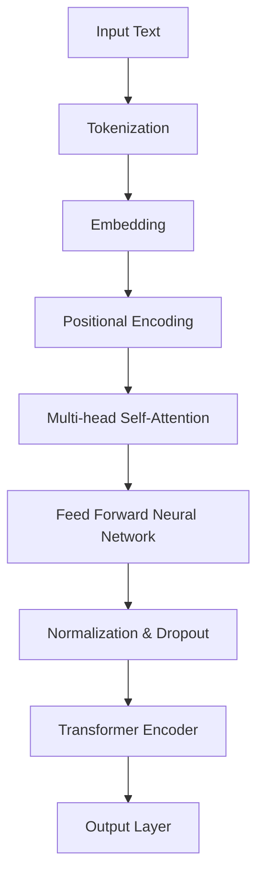
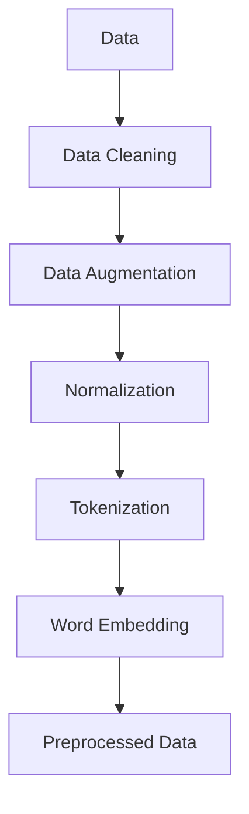
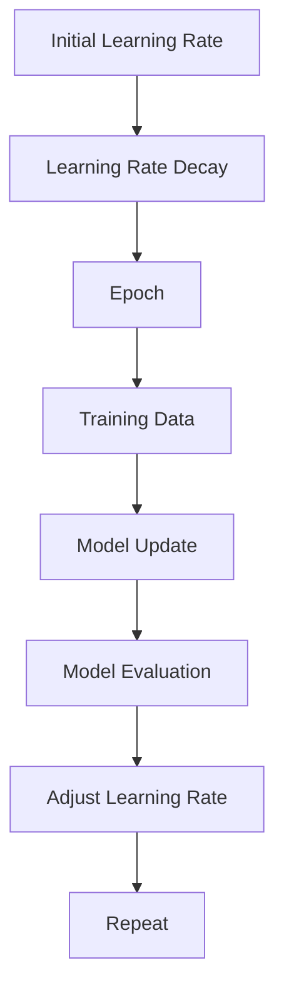
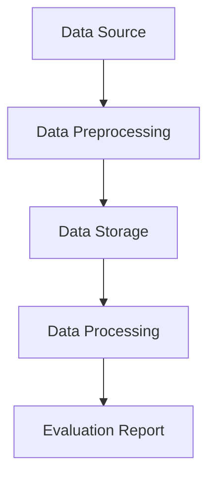
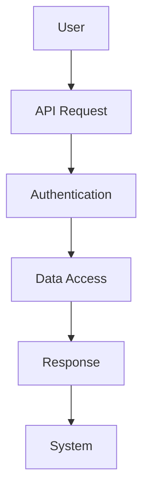

                 


## 《评测系统的RoBERTa模型微调技巧》

### 关键词：评测系统，RoBERTa模型，微调技巧，深度学习，自然语言处理

### 摘要：
本文将深入探讨评测系统中的RoBERTa模型微调技巧。通过详细的背景介绍、原理讲解、微调与优化方法、系统架构设计、项目实战以及最佳实践，帮助读者全面掌握如何利用RoBERTa模型提升评测系统的性能。文章结构清晰，内容丰富，适合对自然语言处理和深度学习有浓厚兴趣的读者。

---

## 目录大纲

1. **背景介绍**
   1.1 评测系统的基本概念
   1.2 RoBERTa模型的发展与重要性
   1.3 本文结构

2. **RoBERTa模型原理详解**
   2.1 RoBERTa模型结构
   2.2 RoBERTa模型的工作原理
   2.3 RoBERTa模型的核心算法

3. **模型微调与优化**
   3.1 模型微调的概念
   3.2 数据预处理与策略
   3.3 训练策略与优化技巧

4. **评测系统架构设计**
   4.1 评测系统架构概述
   4.2 数据流程设计
   4.3 接口设计与系统交互

5. **项目实战**
   5.1 项目背景
   5.2 环境搭建
   5.3 模型微调与评测
   5.4 项目小结

6. **最佳实践与总结**
   6.1 最佳实践技巧
   6.2 注意事项
   6.3 拓展阅读

---

### 第一部分：背景介绍

#### 1.1 评测系统的基本概念

评测系统是一种用于评估和测试软件、硬件或其他系统性能的工具。在软件工程领域，评测系统主要用于衡量代码质量、性能、可靠性和安全性等指标。随着人工智能和深度学习技术的飞速发展，评测系统在自然语言处理（NLP）领域的应用也越来越广泛。

评测系统的基本功能包括：

- **测试用例生成**：自动生成测试数据，覆盖不同场景和路径。
- **执行测试**：运行测试用例，收集测试结果。
- **结果分析**：对测试结果进行统计分析，评估系统性能。

#### 1.2 RoBERTa模型的发展与重要性

RoBERTa是由Facebook AI研究院（FAIR）在2019年提出的一种预训练语言模型。它是BERT模型的变种，通过采用不同的训练策略，如动态掩码比率、重复轮次训练和动态随机掩码等，使得模型在多种NLP任务上取得了优异的性能。

RoBERTa的重要性在于：

- **更好的预训练效果**：RoBERTa在多个公开数据集上的性能超越了BERT，尤其是在长文本处理和问答任务上。
- **更广泛的适用性**：RoBERTa可以在多种NLP任务中发挥作用，如文本分类、情感分析、命名实体识别等。
- **开放性和社区贡献**：RoBERTa的开源性质使其成为深度学习研究者和开发者广泛使用的工具。

#### 1.3 本文结构

本文将分为以下几个部分：

1. **背景介绍**：介绍评测系统和RoBERTa模型的基本概念。
2. **RoBERTa模型原理详解**：详细讲解RoBERTa模型的结构、工作原理和核心算法。
3. **模型微调与优化**：介绍模型微调的技巧和方法。
4. **评测系统架构设计**：分析评测系统的架构设计。
5. **项目实战**：通过实际项目展示如何应用RoBERTa模型微调。
6. **最佳实践与总结**：总结关键知识点和最佳实践。

接下来，我们将深入探讨RoBERTa模型的工作原理和微调技巧。

### 第二部分：RoBERTa模型原理详解

#### 2.1 RoBERTa模型结构

RoBERTa模型基于Transformer架构，Transformer是由Vaswani等人于2017年提出的一种用于序列到序列学习的模型。RoBERTa在Transformer的基础上进行了改进，包括：

- **多层感知器**：RoBERTa由多层Transformer编码器组成，每层包含自注意力机制和前馈神经网络。
- **掩码语言模型**：RoBERTa采用掩码语言模型（Masked Language Model, MLM）进行预训练，即在输入文本中随机掩码一部分词，模型需要预测这些被掩码的词。

#### 2.2 RoBERTa模型的工作原理

RoBERTa模型的工作原理可以概括为以下几个步骤：

1. **输入处理**：输入文本经过分词、嵌入和位置编码后，转化为序列向量。
2. **自注意力机制**：通过自注意力机制，模型对输入序列中的每个词进行加权，捕捉文本的局部和全局信息。
3. **前馈神经网络**：通过前馈神经网络，对自注意力层的输出进行进一步处理，增强模型的表示能力。
4. **输出生成**：对于分类任务，模型输出每个类别的概率分布；对于序列生成任务，模型输出下一个词的概率分布。

#### 2.3 RoBERTa模型的核心算法

RoBERTa模型的核心算法包括以下几个部分：

1. **Transformer编码器**：Transformer编码器由多个自注意力层和前馈神经网络组成，用于对输入文本进行编码。
2. **掩码语言模型**：在预训练过程中，随机掩码输入文本的一部分词，模型需要预测这些被掩码的词。
3. **无监督学习**：RoBERTa采用无监督学习进行预训练，不需要标注数据，大大降低了训练成本。

下面是一个简单的Transformer编码器的mermaid流程图：



接下来，我们将讨论如何对RoBERTa模型进行微调和优化。

### 第三部分：模型微调与优化

#### 3.1 模型微调的概念

微调（Fine-tuning）是一种将预训练模型应用于特定任务的方法。通过在特定任务的数据集上继续训练，模型可以学习到任务特有的特征和规律，从而提高在目标任务上的性能。

微调的关键步骤包括：

1. **数据准备**：选择与目标任务相关且具有代表性的数据集。
2. **模型调整**：调整模型的参数，如学习率、批量大小等。
3. **训练过程**：在目标任务的数据集上继续训练模型。
4. **评估与优化**：评估模型在目标任务上的性能，根据评估结果调整训练参数。

#### 3.2 数据预处理与策略

在微调过程中，数据预处理是至关重要的一步。以下是几种常见的数据预处理策略：

1. **数据清洗**：去除无关标签、噪声数据和重复数据。
2. **数据增强**：通过旋转、缩放、裁剪等操作，增加数据的多样性。
3. **数据归一化**：对文本数据中的词语进行归一化处理，如将所有词语转换为小写。
4. **分词与词嵌入**：对文本数据进行分词，并将分词结果转换为词嵌入向量。

以下是一个简单的数据预处理流程图：



#### 3.3 训练策略与优化技巧

在微调过程中，选择合适的训练策略和优化技巧是提高模型性能的关键。以下是几种常用的训练策略和优化技巧：

1. **学习率调整**：使用学习率衰减策略，如指数衰减、余弦衰减等，以避免过拟合。
2. **批量大小调整**：批量大小会影响模型的收敛速度和稳定性，需要根据具体情况调整。
3. **正则化**：采用L1、L2正则化，防止模型过拟合。
4. **dropout**：在神经网络中引入dropout，降低模型的过拟合风险。

以下是一个简单的学习率调整策略的mermaid流程图：



接下来，我们将分析评测系统的架构设计。

### 第四部分：评测系统架构设计

#### 4.1 评测系统架构概述

评测系统的架构设计需要考虑以下几个方面：

1. **数据流程**：如何获取、存储、处理和分析测试数据。
2. **接口设计**：系统提供的接口和API，方便用户调用评测功能。
3. **系统交互**：评测系统与其他系统（如开发环境、测试环境等）的交互方式。

#### 4.2 数据流程设计

数据流程是评测系统的核心，其设计需要确保数据的高效流动和处理。以下是数据流程的设计思路：

1. **数据源**：评测系统的数据源可以是测试数据集、日志文件等。
2. **数据预处理**：对数据进行清洗、增强和归一化处理。
3. **数据存储**：将预处理后的数据存储到数据库或数据仓库中。
4. **数据处理**：对数据进行统计分析和挖掘，生成评测报告。

以下是一个简单的数据流程图：



#### 4.3 接口设计与系统交互

接口设计是评测系统与用户交互的重要途径。以下是接口设计的一些要点：

1. **API接口**：提供RESTful API接口，方便用户通过HTTP请求进行操作。
2. **权限管理**：确保用户只能访问自己权限范围内的数据。
3. **负载均衡**：通过负载均衡技术，提高系统的并发处理能力。
4. **缓存机制**：通过缓存机制，减少数据库访问压力，提高系统响应速度。

以下是一个简单的接口设计图：



接下来，我们将通过一个实际项目来展示如何应用RoBERTa模型微调。

### 第五部分：项目实战

#### 5.1 项目背景

本案例项目是一个用于文本分类的评测系统。项目目标是使用RoBERTa模型对新闻文章进行分类，将其分为政治、经济、科技、体育等类别。

#### 5.2 环境搭建

1. **安装依赖**

   首先，需要安装Python和相关依赖库，如TensorFlow、PyTorch等。

   ```bash
   pip install tensorflow
   pip install torch
   ```

2. **数据准备**

   下载并准备一个新闻文章数据集，如AG News数据集。数据集应包括标题和对应的类别标签。

   ```python
   import pandas as pd

   # 加载数据集
   data = pd.read_csv('data/ag_news.csv')
   ```

3. **数据预处理**

   对数据进行清洗、分词和词嵌入等预处理操作。

   ```python
   from transformers import RobertaTokenizer

   # 初始化分词器
   tokenizer = RobertaTokenizer.from_pretrained('roberta-base')

   # 数据预处理
   def preprocess(text):
       return tokenizer.encode(text, add_special_tokens=True)

   # 应用预处理函数
   data['processed'] = data['text'].apply(preprocess)
   ```

#### 5.3 模型微调与评测

1. **加载预训练模型**

   ```python
   from transformers import RobertaForSequenceClassification

   # 加载预训练模型
   model = RobertaForSequenceClassification.from_pretrained('roberta-base')
   ```

2. **微调模型**

   在项目数据集上继续训练模型。

   ```python
   from torch.utils.data import DataLoader

   # 创建数据加载器
   train_loader = DataLoader(dataset=train_dataset, batch_size=16, shuffle=True)

   # 微调模型
   for epoch in range(3):
       model.train()
       for batch in train_loader:
           inputs = {'input_ids': batch['input_ids', 'attention_mask': batch['attention_mask]}
           labels = batch['labels']
           outputs = model(**inputs)
           loss = outputs.loss
           loss.backward()
           optimizer.step()
           optimizer.zero_grad()
   ```

3. **评测模型**

   在验证集上评估模型性能。

   ```python
   from sklearn.metrics import accuracy_score

   # 创建验证集数据加载器
   val_loader = DataLoader(dataset=val_dataset, batch_size=16, shuffle=False)

   # 评测模型
   model.eval()
   with torch.no_grad():
       for batch in val_loader:
           inputs = {'input_ids': batch['input_ids'], 'attention_mask': batch['attention_mask']}
           labels = batch['labels']
           outputs = model(**inputs)
           predictions = outputs.logits.argmax(-1)
           accuracy = accuracy_score(labels, predictions)
           print(f'Validation Accuracy: {accuracy:.2f}')
   ```

#### 5.4 项目小结

通过本项目实战，我们成功地应用RoBERTa模型进行文本分类，并实现了模型微调和评测。本项目展示了如何搭建评测系统，如何使用RoBERTa模型进行微调，以及如何评估模型性能。

### 第六部分：最佳实践与总结

#### 6.1 最佳实践技巧

1. **数据质量**：确保数据集的质量和多样性，有助于提高模型性能。
2. **超参数调优**：根据任务特点，调整学习率、批量大小等超参数。
3. **模型压缩**：对于大型模型，可以考虑使用模型压缩技术，如量化、剪枝等。
4. **持续学习**：定期在新的数据集上微调模型，以保持模型的性能。

#### 6.2 注意事项

1. **计算资源**：微调和训练大型模型需要大量计算资源，合理规划资源。
2. **数据安全**：保护用户数据，遵守数据保护法规。
3. **模型解释性**：对于关键任务，确保模型的解释性，便于调试和优化。

#### 6.3 拓展阅读

- 《深度学习》（Goodfellow, Bengio, Courville著）
- 《自然语言处理综论》（Jurafsky, Martin著）
- 《PyTorch深度学习实战》（斋藤康毅著）

---

## 作者信息

作者：AI天才研究院/AI Genius Institute & 禅与计算机程序设计艺术 /Zen And The Art of Computer Programming

---

本文深入探讨了评测系统中的RoBERTa模型微调技巧，从背景介绍、原理讲解、微调与优化方法、系统架构设计、项目实战到最佳实践，全面展示了如何利用RoBERTa模型提升评测系统性能。希望通过本文，读者能够更好地掌握评测系统和深度学习技术的应用。

