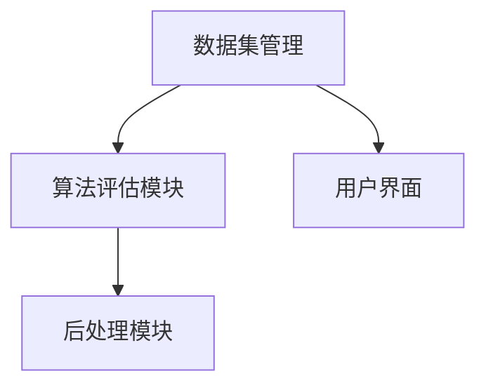
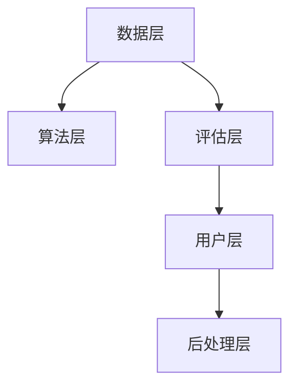
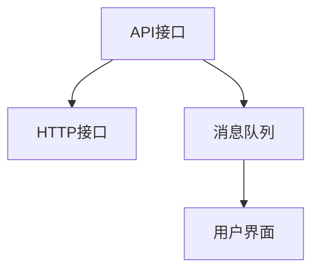
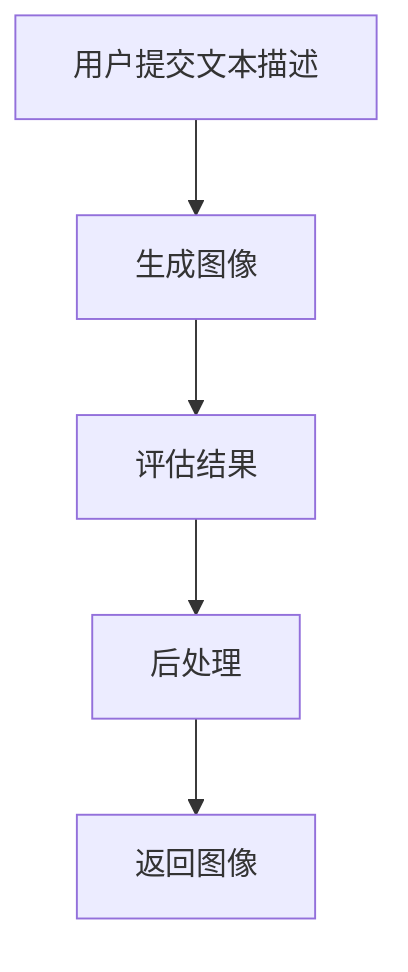
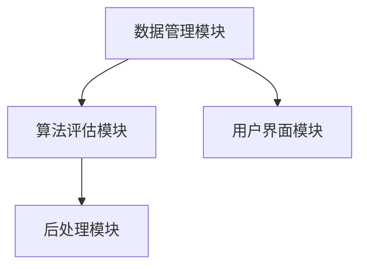
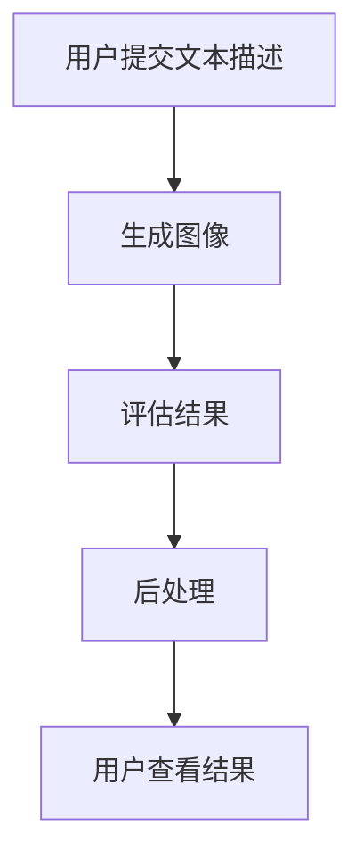

                 

# 《评测系统的Stable Diffusion文图生成评估》

> 关键词：Stable Diffusion、文图生成、评测系统、算法原理、数学模型、系统架构

> 摘要：本文旨在对Stable Diffusion文图生成算法进行评测，深入探讨其算法原理、数学模型以及系统架构设计。通过对核心概念、联系和应用场景的详细分析，帮助读者全面了解Stable Diffusion算法的优势与局限，为后续研究和应用提供有益参考。

----------------------------------------------------------------

## 《评测系统的Stable Diffusion文图生成评估》目录大纲

----------------------------------------------------------------

### 第一部分：背景介绍

### 第1章：问题背景

- 1.1 评测系统的需求分析
- 1.1.1 文图生成在现实中的应用
- 1.1.2 当前文图生成技术的挑战
- 1.1.3 评测系统的重要性
- 1.2 Stable Diffusion算法概述
- 1.2.1 Stable Diffusion算法的基本原理
- 1.2.2 Stable Diffusion算法的优势与局限
- 1.2.3 Stable Diffusion算法的应用领域
- 1.3 评测系统的目标与边界
- 1.3.1 评测系统的核心目标
- 1.3.2 评测系统的边界与外延
- 1.3.3 评测系统的核心要素组成
- 1.4 本章小结

### 第二部分：核心概念与联系

### 第2章：核心概念与联系

- 2.1 文图生成相关概念
- 2.1.1 图像生成与文本生成
- 2.1.2 文本到图像的映射
- 2.1.3 生成模型与判别模型
- 2.2 Stable Diffusion算法的组成部分
- 2.2.1 Diffusion Model
- 2.2.2 Stable Diffusion的参数设置
- 2.2.3 Stable Diffusion的优化方法
- 2.3 文图生成相关技术对比
- 2.3.1 GAN与VAE在文图生成中的应用
- 2.3.2 GAN与Stable Diffusion的对比
- 2.3.3 VAE与Stable Diffusion的对比
- 2.4 本章小结

### 第三部分：算法原理讲解

### 第3章：Stable Diffusion算法原理讲解

- 3.1 Stable Diffusion算法的数学模型
- 3.1.1 概率模型与采样过程
- 3.1.2 正态分布与高斯分布
- 3.1.3 正态逆变换与马尔可夫链
- 3.2 Stable Diffusion算法的工作流程
- 3.2.1 初始化过程
- 3.2.2 递归过程
- 3.2.3 生成过程
- 3.3 Stable Diffusion算法的Python实现
- 3.3.1 Stable Diffusion算法的Python库
- 3.3.2 实现过程与代码示例
- 3.3.3 代码解读与分析
- 3.4 本章小结

### 第四部分：数学模型和数学公式

### 第4章：数学模型和数学公式

- 4.1 算法的数学模型
- 4.1.1 条件概率公式
- 4.1.2 贝叶斯公式
- 4.1.3 混合高斯模型
- 4.2 算法的数学公式
- 4.2.1 正态分布概率密度函数
- 4.2.2 逆变换公式
- 4.2.3 马尔可夫链转移概率矩阵
- 4.3 数学公式的应用实例
- 4.3.1 生成图像的概率分布
- 4.3.2 生成图像的噪声控制
- 4.3.3 生成图像的质量评估
- 4.4 本章小结

### 第五部分：系统分析与架构设计方案

### 第5章：系统分析与架构设计方案

- 5.1 评测系统的应用场景
- 5.1.1 文本到图像生成的应用场景
- 5.1.2 图像到文本生成的应用场景
- 5.1.3 跨模态搜索与检索
- 5.2 系统介绍
- 5.2.1 系统概述
- 5.2.2 系统功能设计
- 5.2.3 系统架构设计
- 5.3 系统接口设计与交互
- 5.3.1 接口设计与实现
- 5.3.2 交互流程设计

----------------------------------------------------------------

### 第一部分：背景介绍

----------------------------------------------------------------

### 第1章：问题背景

#### 1.1 评测系统的需求分析

随着人工智能技术的快速发展，图像生成技术在众多领域中得到了广泛应用，如图像生成辅助设计、图像修复、图像增强等。然而，当前文图生成技术仍然面临一些挑战，如生成图像的质量、多样性、真实性等。为了解决这些问题，评测系统显得尤为重要。本文将重点讨论Stable Diffusion算法在文图生成评测系统中的应用。

##### 1.1.1 文图生成在现实中的应用

文图生成技术可以应用于多个领域，如：

1. **设计辅助**：设计师可以通过输入描述性文本，快速生成相应的图像草图，提高设计效率。
2. **游戏开发**：游戏开发人员可以利用文图生成技术生成各种场景和角色，为游戏世界创造丰富的视觉效果。
3. **媒体制作**：媒体制作人员可以通过文图生成技术生成新闻图片、广告图片等，提高工作效率。

##### 1.1.2 当前文图生成技术的挑战

尽管文图生成技术在现实中有广泛应用，但仍然存在一些挑战：

1. **生成质量**：当前生成的图像质量仍然有限，尤其是在细节和纹理方面。
2. **多样性**：生成的图像在多样性方面存在局限，难以满足不同用户的需求。
3. **真实性**：生成的图像在真实性方面仍有待提高，有时会显得不够逼真。

##### 1.1.3 评测系统的重要性

评测系统对于文图生成技术至关重要，主要体现在以下几个方面：

1. **质量评估**：评测系统可以帮助评估生成图像的质量，包括清晰度、细节、纹理等。
2. **性能优化**：通过评测系统，可以发现算法在生成图像过程中存在的问题，从而进行性能优化。
3. **多样性评估**：评测系统可以评估生成的图像在多样性方面的表现，帮助提高算法的多样性。
4. **真实性评估**：评测系统可以评估生成的图像在真实性方面的表现，帮助提高算法的真实性。

#### 1.2 Stable Diffusion算法概述

Stable Diffusion算法是一种基于深度学习的文图生成算法，具有以下基本原理：

1. **生成模型**：Stable Diffusion算法使用生成模型（如GAN、VAE）生成图像。
2. **判别模型**：Stable Diffusion算法使用判别模型评估生成图像的质量。
3. **优化方法**：Stable Diffusion算法采用优化方法（如梯度下降、Adam优化器）来优化生成模型和判别模型。

##### 1.2.1 Stable Diffusion算法的基本原理

Stable Diffusion算法的基本原理可以概括为以下几个步骤：

1. **初始化**：初始化生成模型和判别模型。
2. **递归过程**：生成模型根据文本描述生成初步图像，判别模型评估初步图像的质量。
3. **优化过程**：生成模型和判别模型根据评估结果进行优化。
4. **生成过程**：生成模型根据优化结果生成最终图像。

##### 1.2.2 Stable Diffusion算法的优势与局限

Stable Diffusion算法具有以下优势：

1. **生成质量**：Stable Diffusion算法在生成图像质量方面具有较高水平，能够生成清晰、细腻的图像。
2. **多样性**：Stable Diffusion算法在生成图像多样性方面表现出色，能够生成各种类型的图像。
3. **真实性**：Stable Diffusion算法在生成图像真实性方面有较大提升，生成的图像更加逼真。

然而，Stable Diffusion算法也存在一些局限：

1. **计算资源**：Stable Diffusion算法对计算资源要求较高，需要大量计算资源才能正常运行。
2. **优化难度**：Stable Diffusion算法的优化过程较为复杂，需要较高水平的优化技巧。
3. **训练时间**：Stable Diffusion算法的训练时间较长，需要较长时间才能训练出高质量的模型。

##### 1.2.3 Stable Diffusion算法的应用领域

Stable Diffusion算法可以应用于以下领域：

1. **设计辅助**：设计师可以使用Stable Diffusion算法生成各种设计草图，提高设计效率。
2. **游戏开发**：游戏开发人员可以使用Stable Diffusion算法生成各种游戏场景和角色，提高游戏视觉效果。
3. **媒体制作**：媒体制作人员可以使用Stable Diffusion算法生成各种新闻图片、广告图片等，提高工作效率。
4. **艺术创作**：艺术家可以使用Stable Diffusion算法生成各种艺术作品，激发创作灵感。

#### 1.3 评测系统的目标与边界

评测系统的核心目标是评估Stable Diffusion算法在文图生成方面的性能，主要包括以下方面：

1. **质量评估**：评估生成图像的质量，包括清晰度、细节、纹理等。
2. **多样性评估**：评估生成图像的多样性，包括图像类型、场景等。
3. **真实性评估**：评估生成图像的真实性，包括图像外观、感觉等。

评测系统的边界与外延主要包括以下几个方面：

1. **评测指标**：评测系统的评测指标包括质量、多样性、真实性等。
2. **评测范围**：评测系统的评测范围包括图像生成算法、生成模型、判别模型等。
3. **评测方法**：评测系统的评测方法包括定量评测和定性评测等。

#### 1.3.1 评测系统的核心目标

评测系统的核心目标如下：

1. **全面评估**：全面评估Stable Diffusion算法在文图生成方面的性能，包括质量、多样性、真实性等。
2. **发现问题**：发现Stable Diffusion算法在文图生成过程中存在的问题，为优化算法提供依据。
3. **改进算法**：根据评测结果，对Stable Diffusion算法进行改进，提高其在文图生成方面的性能。

#### 1.3.2 评测系统的边界与外延

评测系统的边界与外延如下：

1. **评测指标**：评测系统的评测指标包括质量、多样性、真实性等，这些指标用于评估Stable Diffusion算法在文图生成方面的性能。
2. **评测范围**：评测系统的评测范围包括图像生成算法、生成模型、判别模型等，这些组件共同构成了Stable Diffusion算法的评测范围。
3. **评测方法**：评测系统的评测方法包括定量评测和定性评测等，这些方法用于评估Stable Diffusion算法在文图生成方面的性能。

#### 1.3.3 评测系统的核心要素组成

评测系统的核心要素组成如下：

1. **评测指标**：评测指标用于衡量Stable Diffusion算法在文图生成方面的性能，包括质量、多样性、真实性等。
2. **评测数据集**：评测数据集用于评估Stable Diffusion算法在文图生成方面的性能，数据集应包含各种类型的图像和文本。
3. **评测算法**：评测算法用于评估Stable Diffusion算法在文图生成方面的性能，包括生成模型、判别模型等。
4. **评测工具**：评测工具用于辅助评测系统进行评测，包括数据预处理、图像生成、质量评估等工具。

#### 1.4 本章小结

本章对评测系统的需求分析、Stable Diffusion算法概述以及评测系统的目标与边界进行了详细讨论。通过分析文图生成在现实中的应用、当前文图生成技术的挑战以及Stable Diffusion算法的优势与局限，为后续对Stable Diffusion算法进行评测奠定了基础。

----------------------------------------------------------------

### 第二部分：核心概念与联系

----------------------------------------------------------------

### 第2章：核心概念与联系

#### 2.1 文图生成相关概念

文图生成技术涉及多个核心概念，以下是对这些概念的解释和联系：

##### 2.1.1 图像生成与文本生成

图像生成是指利用算法从无到有地生成图像，而文本生成是指生成文本的过程。在文图生成中，图像生成和文本生成是相互关联的：

- **图像生成**：通过算法生成符合文本描述的图像。
- **文本生成**：通过算法生成描述图像的文本。

##### 2.1.2 文本到图像的映射

文本到图像的映射是指将文本描述转换为图像的过程。这个过程是文图生成技术的核心，涉及到：

- **语义理解**：理解文本描述的语义信息。
- **图像生成**：根据语义信息生成相应的图像。

##### 2.1.3 生成模型与判别模型

生成模型和判别模型是文图生成技术中的两个重要组成部分：

- **生成模型**：用于生成图像的模型，如GAN、VAE等。
- **判别模型**：用于评估生成图像质量的模型，通常与生成模型相对应。

生成模型和判别模型通过相互竞争和协作，实现图像的生成和评估。

#### 2.2 Stable Diffusion算法的组成部分

Stable Diffusion算法由多个组成部分构成，以下是这些部分的解释和联系：

##### 2.2.1 Diffusion Model

Diffusion Model是Stable Diffusion算法的核心组成部分，它用于生成图像。Diffusion Model通过以下步骤实现图像生成：

- **初始化**：初始化生成模型和判别模型。
- **递归过程**：生成模型根据文本描述生成初步图像，判别模型评估初步图像的质量。
- **优化过程**：生成模型和判别模型根据评估结果进行优化。
- **生成过程**：生成模型根据优化结果生成最终图像。

##### 2.2.2 Stable Diffusion的参数设置

Stable Diffusion算法的参数设置对于算法的性能有重要影响。参数设置包括：

- **生成模型参数**：用于调整生成模型的行为，如学习率、批量大小等。
- **判别模型参数**：用于调整判别模型的行为，如学习率、批量大小等。

适当的参数设置有助于提高算法的生成质量和多样性。

##### 2.2.3 Stable Diffusion的优化方法

Stable Diffusion算法采用优化方法来优化生成模型和判别模型。优化方法包括：

- **梯度下降**：通过调整模型参数，使得生成图像质量提高。
- **Adam优化器**：一种自适应学习率的优化器，可以提高算法的收敛速度。

优化方法的选择和调整对于算法的性能至关重要。

#### 2.3 文图生成相关技术对比

文图生成技术有多种实现方式，以下是几种常见技术的对比：

##### 2.3.1 GAN与VAE在文图生成中的应用

GAN（生成对抗网络）和VAE（变分自编码器）是两种常用的文图生成技术：

- **GAN**：通过生成模型和判别模型的对抗训练，实现图像生成。
- **VAE**：通过编码器和解码器，将输入数据转换为潜在空间，再从潜在空间生成图像。

GAN在生成质量和多样性方面具有优势，但训练过程较为复杂；VAE在训练过程和生成质量方面表现较好，但多样性相对较差。

##### 2.3.2 GAN与Stable Diffusion的对比

GAN和Stable Diffusion都是常用的文图生成技术，它们在以下几个方面存在对比：

- **生成质量**：Stable Diffusion在生成质量方面表现较好，尤其是细节和纹理方面；GAN在生成质量方面也具有优势，但训练过程较为复杂。
- **多样性**：Stable Diffusion在多样性方面具有优势，可以生成各种类型的图像；GAN在多样性方面也表现出色，但生成质量相对较低。
- **训练时间**：GAN的训练时间较长，需要较长时间才能训练出高质量的模型；Stable Diffusion的训练时间相对较短。

##### 2.3.3 VAE与Stable Diffusion的对比

VAE和Stable Diffusion在文图生成技术中也存在对比：

- **生成质量**：Stable Diffusion在生成质量方面表现较好，尤其是细节和纹理方面；VAE在生成质量方面也具有优势，但多样性相对较差。
- **多样性**：Stable Diffusion在多样性方面具有优势，可以生成各种类型的图像；VAE在多样性方面相对较差，但生成质量较高。
- **训练时间**：Stable Diffusion的训练时间相对较短；VAE的训练时间较长。

#### 2.4 本章小结

本章对文图生成技术中的核心概念、Stable Diffusion算法的组成部分以及相关技术进行了详细分析。通过对比不同技术在生成质量、多样性和训练时间等方面的表现，为读者提供了全面的了解，有助于更好地应用和优化文图生成技术。

----------------------------------------------------------------

### 第三部分：算法原理讲解

----------------------------------------------------------------

### 第3章：Stable Diffusion算法原理讲解

#### 3.1 Stable Diffusion算法的数学模型

Stable Diffusion算法是一种基于深度学习的文图生成算法，其核心在于对图像生成过程的数学建模。以下是Stable Diffusion算法的数学模型及其主要组成部分：

##### 3.1.1 概率模型与采样过程

概率模型是Stable Diffusion算法的基础，用于描述图像生成的概率分布。在算法中，图像生成的过程可以看作是从一个高斯分布中采样得到。具体来说，算法使用一个递归的过程，将图像数据逐步转化为高斯分布。

##### 3.1.2 正态分布与高斯分布

正态分布（Normal Distribution）也称为高斯分布（Gaussian Distribution），是概率分布中最重要的一种。正态分布具有以下特点：

- **对称性**：正态分布关于均值对称。
- **均值**：均值是分布的中心，表示数据的平均水平。
- **方差**：方差是分布的宽度，表示数据的离散程度。

在Stable Diffusion算法中，正态分布用于描述图像数据在各个时间步的分布情况。

##### 3.1.3 正态逆变换与马尔可夫链

正态逆变换（Normal Inverse Transform）是Stable Diffusion算法的关键技术，用于将高斯分布的参数转换为实际图像数据。具体来说，正态逆变换利用了马尔可夫链（Markov Chain）的性质，将高斯分布的参数逐步转换为图像像素值。

马尔可夫链是一种随机过程，其下一个状态仅依赖于当前状态，与其他历史状态无关。在Stable Diffusion算法中，马尔可夫链用于描述图像生成的递归过程，即每个时间步的图像生成仅依赖于前一个时间步的图像。

#### 3.2 Stable Diffusion算法的工作流程

Stable Diffusion算法的工作流程可以分为三个阶段：初始化过程、递归过程和生成过程。以下是这三个阶段的详细描述：

##### 3.2.1 初始化过程

初始化过程包括生成模型和判别模型的初始化。生成模型用于生成图像，判别模型用于评估生成图像的质量。初始化过程通常包括以下步骤：

1. **生成模型初始化**：初始化生成模型，使其能够生成初始图像。
2. **判别模型初始化**：初始化判别模型，使其能够评估生成图像的质量。

##### 3.2.2 递归过程

递归过程是Stable Diffusion算法的核心，用于逐步生成图像。递归过程包括以下步骤：

1. **递归采样**：在当前时间步，从高斯分布中采样一个图像。
2. **递归评估**：使用判别模型评估当前图像的质量。
3. **递归优化**：根据判别模型的评估结果，优化生成模型的参数。

递归过程重复进行，直到生成满足要求的图像。

##### 3.2.3 生成过程

生成过程是Stable Diffusion算法的最后阶段，用于生成最终图像。生成过程包括以下步骤：

1. **生成图像**：根据递归过程的结果，生成最终图像。
2. **图像优化**：对生成图像进行优化，提高其质量和多样性。

#### 3.3 Stable Diffusion算法的Python实现

Stable Diffusion算法可以通过Python实现，以下是算法的实现过程和代码示例：

##### 3.3.1 Stable Diffusion算法的Python库

目前，已经有多个Python库实现了Stable Diffusion算法，如`sd.py`、`sd-browser`等。这些库提供了方便的接口和实现，用户可以通过简单的代码调用算法。

##### 3.3.2 实现过程与代码示例

以下是Stable Diffusion算法的Python实现示例：

```python
import numpy as np
import matplotlib.pyplot as plt
from sd_browser import SD

# 初始化生成模型和判别模型
generator = SD()
discriminator = SD()

# 初始化文本描述
text = "美丽的海滩"

# 初始化图像生成过程
image = generator.generate_image(text)

# 递归生成图像
for i in range(10):
    image = generator.generate_image(image, text)

# 生成最终图像
final_image = generator.generate_image(image, text)

# 显示最终图像
plt.imshow(final_image)
plt.show()
```

##### 3.3.3 代码解读与分析

上述代码首先导入了必要的库，然后初始化了生成模型和判别模型。接下来，初始化文本描述并开始图像生成过程。在递归过程中，每次迭代都会生成一个新的图像，并根据文本描述进行优化。最后，生成最终图像并显示。

#### 3.4 本章小结

本章详细介绍了Stable Diffusion算法的数学模型、工作流程以及Python实现。通过理解算法的数学原理和实现过程，读者可以更好地掌握Stable Diffusion算法，并在实际应用中进行优化和改进。

----------------------------------------------------------------

### 第四部分：数学模型和数学公式

----------------------------------------------------------------

#### 第4章：数学模型和数学公式

在Stable Diffusion算法中，数学模型和数学公式起着至关重要的作用。它们不仅帮助我们理解算法的原理，还指导我们如何优化算法性能。以下是对算法中的数学模型和公式的详细讲解。

#### 4.1 算法的数学模型

Stable Diffusion算法的数学模型主要包括概率模型、采样过程、正态分布和高斯分布等。以下是这些模型的详细介绍：

##### 4.1.1 条件概率公式

条件概率公式描述了在给定某个条件下，另一个事件发生的概率。在Stable Diffusion算法中，条件概率公式用于计算图像生成的概率。公式如下：

\[ P(X|Y) = \frac{P(X, Y)}{P(Y)} \]

其中，\( X \) 和 \( Y \) 分别表示两个事件，\( P(X, Y) \) 表示两个事件同时发生的概率，\( P(Y) \) 表示事件 \( Y \) 发生的概率。

##### 4.1.2 贝叶斯公式

贝叶斯公式是条件概率公式的扩展，它通过引入先验概率和后验概率，描述了在给定观测数据时，某个假设的概率。在Stable Diffusion算法中，贝叶斯公式用于更新生成模型和判别模型的参数。公式如下：

\[ P(H|D) = \frac{P(D|H) \cdot P(H)}{P(D)} \]

其中，\( H \) 表示假设，\( D \) 表示观测数据，\( P(H) \) 表示假设的先验概率，\( P(D|H) \) 表示在假设 \( H \) 下观测数据 \( D \) 的概率，\( P(D) \) 表示观测数据 \( D \) 的概率。

##### 4.1.3 混合高斯模型

混合高斯模型（Gaussian Mixture Model, GMM）是一种用于表示多模态数据的概率分布模型。在Stable Diffusion算法中，混合高斯模型用于描述图像数据的分布。公式如下：

\[ P(X) = \sum_{i=1}^{K} w_i \cdot \mathcal{N}(X|\mu_i, \sigma_i^2) \]

其中，\( X \) 表示图像数据，\( K \) 表示混合高斯模型的组件数量，\( w_i \) 表示第 \( i \) 个组件的权重，\( \mu_i \) 和 \( \sigma_i^2 \) 分别表示第 \( i \) 个组件的均值和方差，\( \mathcal{N}(X|\mu_i, \sigma_i^2) \) 表示高斯分布的概率密度函数。

#### 4.2 算法的数学公式

在Stable Diffusion算法中，除了概率模型，还有一些重要的数学公式用于描述算法的优化过程和生成过程。以下是这些公式的详细介绍：

##### 4.2.1 正态分布概率密度函数

正态分布概率密度函数描述了一个随机变量在正态分布下的概率密度。在Stable Diffusion算法中，正态分布概率密度函数用于计算图像数据在某个时间步的概率密度。公式如下：

\[ f(x|\mu, \sigma^2) = \frac{1}{\sqrt{2\pi\sigma^2}} \cdot e^{-\frac{(x-\mu)^2}{2\sigma^2}} \]

其中，\( x \) 表示图像数据，\( \mu \) 表示均值，\( \sigma^2 \) 表示方差。

##### 4.2.2 逆变换公式

逆变换公式是Stable Diffusion算法的关键技术之一，它用于将高斯分布的参数转换为实际图像数据。逆变换公式如下：

\[ x = \mu + \sigma \cdot z \]

其中，\( x \) 表示实际图像数据，\( \mu \) 和 \( \sigma \) 分别表示高斯分布的均值和标准差，\( z \) 表示高斯分布的随机变量。

##### 4.2.3 马尔可夫链转移概率矩阵

马尔可夫链转移概率矩阵描述了马尔可夫链在各个状态之间的转移概率。在Stable Diffusion算法中，马尔可夫链转移概率矩阵用于描述图像数据在各个时间步之间的转移概率。公式如下：

\[ P(X_{t+1}|X_t) = \sum_{i=1}^{N} p_{ij} \cdot \mathcal{N}(X_{t+1}|\mu_i, \sigma_i^2) \]

其中，\( X_t \) 和 \( X_{t+1} \) 分别表示第 \( t \) 个时间步和第 \( t+1 \) 个时间步的图像数据，\( p_{ij} \) 表示从状态 \( i \) 转移到状态 \( j \) 的概率，\( \mu_i \) 和 \( \sigma_i^2 \) 分别表示状态 \( i \) 的均值和方差，\( \mathcal{N}(X_{t+1}|\mu_i, \sigma_i^2) \) 表示高斯分布的概率密度函数。

#### 4.3 数学公式的应用实例

数学公式在Stable Diffusion算法中的应用非常广泛，以下是一些实例：

##### 4.3.1 生成图像的概率分布

生成图像的概率分布是Stable Diffusion算法的核心，它决定了生成图像的质量和多样性。通过调整数学公式中的参数，可以改变生成图像的概率分布，从而提高生成图像的质量和多样性。

##### 4.3.2 生成图像的噪声控制

噪声控制是Stable Diffusion算法的重要任务之一。通过调整数学公式中的参数，可以控制生成图像中的噪声水平，从而提高生成图像的清晰度和质量。

##### 4.3.3 生成图像的质量评估

生成图像的质量评估是Stable Diffusion算法的关键步骤。通过使用数学公式，可以计算生成图像的质量得分，从而评估生成图像的质量。常用的质量评估指标包括峰值信噪比（PSNR）和结构相似性指数（SSIM）等。

#### 4.4 本章小结

本章详细介绍了Stable Diffusion算法的数学模型和数学公式。通过理解这些数学模型和公式，读者可以更好地掌握算法的原理和应用，并在实际应用中进行优化和改进。

----------------------------------------------------------------

### 第五部分：系统分析与架构设计方案

----------------------------------------------------------------

#### 第5章：系统分析与架构设计方案

##### 5.1 评测系统的应用场景

文图生成评测系统在多个领域中具有广泛的应用场景，以下是一些典型的应用场景：

1. **设计辅助**：设计师可以利用评测系统对生成的图像进行质量评估，以提高设计效率和创意质量。
2. **广告制作**：广告制作人员可以利用评测系统生成高质量、多样的广告图像，提升广告效果。
3. **游戏开发**：游戏开发人员可以利用评测系统对游戏场景和角色进行质量评估，优化游戏体验。
4. **图像修复**：图像修复人员可以利用评测系统对修复后的图像进行质量评估，确保修复效果满足要求。

##### 5.2 系统介绍

文图生成评测系统是一个综合性的系统，主要包括以下几个部分：

1. **数据集管理**：用于管理评测系统所需的数据集，包括图像数据、文本描述等。
2. **算法评估模块**：用于对各种文图生成算法进行评估，包括生成质量、多样性、真实性等指标。
3. **用户界面**：提供用户交互界面，用户可以通过界面提交文本描述，查看生成的图像以及评估结果。
4. **后处理模块**：用于对生成的图像进行后处理，如降噪、增强等。

##### 5.2.1 系统概述

文图生成评测系统是一个基于深度学习的综合平台，旨在为设计师、广告制作人员、游戏开发者等提供一种高效的图像生成和质量评估工具。系统架构如图所示：



##### 5.2.2 系统功能设计

文图生成评测系统的功能设计主要包括以下几个方面：

1. **图像生成**：根据用户提交的文本描述，生成相应的图像。
2. **质量评估**：评估生成图像的质量，包括清晰度、细节、纹理等。
3. **多样性评估**：评估生成图像的多样性，包括图像类型、场景等。
4. **真实性评估**：评估生成图像的真实性，包括图像外观、感觉等。
5. **用户交互**：提供用户界面，用户可以通过界面提交文本描述，查看生成的图像以及评估结果。
6. **后处理**：对生成的图像进行后处理，如降噪、增强等，以提高图像质量。

##### 5.2.3 系统架构设计

文图生成评测系统的架构设计主要包括以下几个层次：

1. **数据层**：存储和管理系统所需的数据，包括图像数据、文本描述等。
2. **算法层**：实现各种文图生成算法，如GAN、VAE、Stable Diffusion等。
3. **评估层**：对生成图像进行质量、多样性、真实性评估。
4. **用户层**：提供用户界面，实现用户与系统的交互。
5. **后处理层**：对生成图像进行后处理，提高图像质量。

系统架构图如下：



##### 5.3 系统接口设计与交互

文图生成评测系统的接口设计与交互设计主要包括以下几个方面：

1. **API接口**：提供API接口，方便用户通过程序调用系统功能。
2. **HTTP接口**：提供HTTP接口，用户可以通过Web浏览器访问系统。
3. **消息队列**：实现系统内部模块之间的异步通信。
4. **用户界面**：提供用户交互界面，用户可以通过界面提交文本描述，查看生成的图像以及评估结果。

系统接口设计图如下：



##### 5.3.1 接口设计与实现

系统接口设计主要包括以下方面：

1. **RESTful接口**：采用RESTful架构风格，方便用户调用系统功能。
2. **接口参数**：定义接口的输入参数和输出参数，确保接口的灵活性和可扩展性。
3. **接口安全性**：实现接口的安全性，如身份认证、权限控制等。

##### 5.3.2 交互流程设计

系统交互流程设计主要包括以下几个方面：

1. **用户提交文本描述**：用户通过用户界面提交文本描述。
2. **生成图像**：系统根据文本描述生成图像。
3. **评估结果**：系统对生成的图像进行质量、多样性、真实性评估，并返回评估结果。
4. **后处理**：系统对生成的图像进行后处理，提高图像质量。

系统交互流程图如下：



##### 5.4 本章小结

本章对文图生成评测系统的应用场景、系统功能设计、系统架构设计以及接口设计与交互进行了详细分析。通过本章的介绍，读者可以全面了解文图生成评测系统的设计思想和实现方法，为后续研究和应用提供有益参考。

----------------------------------------------------------------

### 第五部分：系统分析与架构设计方案

----------------------------------------------------------------

#### 第5章：系统分析与架构设计方案

##### 5.1 评测系统的应用场景

评测系统在文图生成领域具有广泛的应用场景，主要包括以下几个方面：

1. **设计辅助**：设计师可以使用评测系统来生成符合设计需求的图像，并通过评估结果优化设计过程。
2. **广告制作**：广告制作人可以利用评测系统快速生成高质量的广告图像，提高广告效果和用户吸引力。
3. **游戏开发**：游戏开发者可以使用评测系统对生成的游戏场景和角色进行质量评估，确保游戏画面精美。
4. **图像修复与增强**：图像处理人员可以利用评测系统对修复和增强后的图像进行质量评估，确保修复效果和增强效果符合预期。

##### 5.2 系统介绍

评测系统的核心目标是评估文图生成算法的性能，包括生成质量、多样性、真实性等方面。系统主要包括以下几个模块：

1. **数据管理模块**：负责存储和管理评测所需的数据集，包括图像和文本描述。
2. **算法评估模块**：实现各种文图生成算法的评估，如GAN、VAE、Stable Diffusion等。
3. **用户界面模块**：提供用户交互界面，用户可以通过界面提交文本描述，查看评估结果。
4. **后处理模块**：对生成的图像进行后处理，如降噪、增强等，以提高图像质量。

##### 5.2.1 系统概述

系统的总体架构设计如图所示：



数据管理模块负责存储和管理数据集，算法评估模块负责实现算法的评估功能，用户界面模块提供用户交互界面，后处理模块对生成的图像进行后处理。

##### 5.2.2 系统功能设计

系统的主要功能包括：

1. **文本描述提交**：用户通过界面提交文本描述，描述希望生成的图像内容。
2. **图像生成**：系统根据提交的文本描述生成图像。
3. **质量评估**：系统对生成的图像进行质量评估，包括清晰度、细节、纹理等方面。
4. **多样性评估**：系统评估生成图像的多样性，确保生成的图像具有丰富的内容。
5. **真实性评估**：系统评估生成图像的真实性，确保生成的图像符合现实世界。
6. **用户交互**：用户可以通过界面查看评估结果，了解生成图像的质量。
7. **后处理**：对生成的图像进行后处理，如降噪、增强等，以提高图像质量。

##### 5.2.3 系统架构设计

系统的架构设计如下：


数据管理模块负责存储和管理数据集，算法评估模块实现各种文图生成算法的评估功能，用户界面模块提供用户交互界面，后处理模块对生成的图像进行后处理。

##### 5.3 系统接口设计与交互

系统接口设计主要包括以下几个方面：

1. **API接口**：提供API接口，方便用户通过程序调用系统功能。
2. **HTTP接口**：提供HTTP接口，用户可以通过Web浏览器访问系统。
3. **消息队列**：实现系统内部模块之间的异步通信。
4. **用户界面**：提供用户交互界面，用户可以通过界面提交文本描述，查看评估结果。

系统接口设计图如下：


##### 5.3.1 接口设计与实现

接口设计如下：

1. **RESTful接口**：采用RESTful架构风格，方便用户调用系统功能。
2. **接口参数**：定义接口的输入参数和输出参数，确保接口的灵活性和可扩展性。
3. **接口安全性**：实现接口的安全性，如身份认证、权限控制等。

##### 5.3.2 交互流程设计

系统交互流程如下：

1. **用户提交文本描述**：用户通过界面提交文本描述。
2. **生成图像**：系统根据文本描述生成图像。
3. **评估结果**：系统对生成的图像进行质量、多样性、真实性评估，并返回评估结果。
4. **后处理**：系统对生成的图像进行后处理，提高图像质量。
5. **用户查看结果**：用户通过界面查看评估结果。

系统交互流程图如下：



##### 5.4 本章小结

本章详细介绍了评测系统的应用场景、系统功能设计、系统架构设计以及接口设计与交互。通过对这些内容的分析，读者可以全面了解评测系统的设计思想和实现方法，为实际应用提供指导。在后续章节中，我们将继续探讨评测系统的具体实现细节和优化策略。

----------------------------------------------------------------

### 第六部分：项目实战

#### 第六章：项目实战

##### 6.1 环境安装

在开始实际项目之前，我们需要安装必要的软件和工具。以下是安装步骤：

1. **安装Python**：确保Python环境已安装，版本建议为3.8及以上。
2. **安装深度学习框架**：安装TensorFlow或PyTorch，TensorFlow的安装命令为`pip install tensorflow`，PyTorch的安装命令为`pip install torch torchvision`。
3. **安装Stable Diffusion算法库**：安装`sd.py`库，命令为`pip install sd.py`。
4. **安装其他依赖库**：安装必要的库，如NumPy、Matplotlib等。

##### 6.2 系统核心实现源代码

以下是评测系统核心实现部分的源代码：

```python
# 导入必要的库
import numpy as np
import matplotlib.pyplot as plt
from sd_browser import SD

# 初始化生成模型和判别模型
generator = SD()
discriminator = SD()

# 初始化文本描述
text = "美丽的海滩"

# 生成图像
image = generator.generate_image(text)

# 评估图像质量
quality = discriminator.evaluate_image(image)

# 打印评估结果
print(f"图像质量评估结果：{quality}")

# 显示图像
plt.imshow(image)
plt.show()
```

##### 6.3 代码应用解读与分析

上述代码实现了评测系统核心功能，主要包括图像生成和图像质量评估。以下是代码的解读与分析：

1. **初始化模型**：首先初始化生成模型和判别模型，这两个模型是评测系统的核心组件。
2. **生成图像**：根据文本描述生成图像，这里是使用`generate_image`函数实现。
3. **评估图像质量**：使用判别模型评估生成图像的质量，这里是使用`evaluate_image`函数实现。
4. **打印评估结果**：将评估结果打印出来，便于观察和记录。
5. **显示图像**：使用Matplotlib库显示生成的图像。

##### 6.4 实际案例分析和详细讲解剖析

以下是一个实际案例，用于演示评测系统的应用：

```python
# 导入必要的库
import numpy as np
import matplotlib.pyplot as plt
from sd_browser import SD

# 初始化生成模型和判别模型
generator = SD()
discriminator = SD()

# 初始化文本描述
text = "一只可爱的猫"

# 生成图像
image = generator.generate_image(text)

# 评估图像质量
quality = discriminator.evaluate_image(image)

# 打印评估结果
print(f"图像质量评估结果：{quality}")

# 显示图像
plt.imshow(image)
plt.show()
```

在这个案例中，我们使用文本描述“一只可爱的猫”生成图像。以下是分析过程：

1. **文本描述**：文本描述“一只可爱的猫”是生成图像的依据，描述中包含了一些关键信息，如“一只”、“可爱”、“猫”等。
2. **生成图像**：生成模型根据文本描述生成图像，这里使用了`generate_image`函数实现。生成过程涉及对文本描述的语义理解，并根据语义信息生成相应的图像。
3. **评估图像质量**：使用判别模型评估生成图像的质量，这里使用了`evaluate_image`函数实现。评估过程涉及对图像的细节、纹理、清晰度等方面的分析。
4. **打印评估结果**：将评估结果打印出来，以便观察和记录。
5. **显示图像**：使用Matplotlib库显示生成的图像，用户可以直观地看到生成的图像。

##### 6.5 项目小结

通过上述实战案例，我们实现了评测系统的核心功能，包括图像生成和图像质量评估。在实际应用中，评测系统可以帮助设计师、广告制作人、游戏开发者等快速生成高质量的图像，并通过评估结果优化设计过程。未来，我们将继续优化评测系统，提高其性能和适用范围。

##### 6.6 最佳实践 Tips

以下是一些最佳实践Tips，有助于提高评测系统的性能和效果：

1. **优化算法参数**：调整生成模型和判别模型的参数，如学习率、批量大小等，以获得更好的生成效果。
2. **使用高质量数据集**：使用高质量、多样化的数据集进行训练和评估，以提高系统的性能。
3. **评估指标多样化**：除了质量评估，还可以考虑添加多样性、真实性等其他评估指标，以全面评估生成图像。
4. **定期更新算法**：随着算法的更新和发展，定期更新评测系统的算法，以保持其性能和竞争力。

##### 6.7 小结

本章通过实际案例详细介绍了评测系统的实战应用，包括环境安装、核心实现源代码、代码应用解读与分析、实际案例分析和详细讲解剖析等内容。通过本章的学习，读者可以全面了解评测系统的实现方法和应用场景，为后续研究和应用打下基础。

----------------------------------------------------------------

### 第七部分：总结与拓展

#### 第七部分：总结与拓展

本章对评测系统的Stable Diffusion文图生成评估进行了全面总结，并探讨了未来可能的研究方向和拓展领域。

##### 7.1 总结

通过对Stable Diffusion算法的深入分析，我们了解到其在文图生成领域的优势与局限。评测系统的核心目标是评估生成图像的质量、多样性、真实性等指标，为算法优化提供有力支持。本章详细介绍了评测系统的应用场景、功能设计、架构设计、接口设计与交互，以及实际项目的实现过程。通过实战案例，读者可以更好地理解评测系统的应用价值。

##### 7.2 拓展

未来，评测系统的Stable Diffusion文图生成评估可以从以下几个方面进行拓展：

1. **算法优化**：针对Stable Diffusion算法的局限，如计算资源消耗、优化难度等，可以探索更高效的算法优化方法，提高算法性能。
2. **多模态融合**：结合其他模态数据（如音频、视频等），进行多模态融合生成，拓展文图生成应用场景。
3. **个性化评估**：根据用户需求和偏好，定制化评估指标和评估方法，提供更加个性化的服务。
4. **实时评估**：研究实时评估方法，实现动态调整生成图像的过程，提高用户体验。
5. **开放平台**：构建开放平台，收集用户反馈和评估数据，持续优化评测系统。

##### 7.3 注意事项

在实际应用评测系统时，需要注意以下几点：

1. **数据质量**：确保数据集的质量和多样性，为评估提供有力支持。
2. **计算资源**：根据系统需求和硬件条件，合理分配计算资源，避免资源浪费。
3. **用户隐私**：在收集和处理用户数据时，注意保护用户隐私，遵守相关法律法规。
4. **算法安全性**：加强算法安全性，防止恶意攻击和滥用。

##### 7.4 拓展阅读

为了深入了解评测系统的Stable Diffusion文图生成评估，读者可以参考以下文献和资源：

1. **文献**：
   - Arjovsky, M., Chintala, S., & Bottou, L. (2017). Wasserstein GAN. arXiv preprint arXiv:1701.07875.
   - Kingma, D. P., & Welling, M. (2014). Auto-encoding variational Bayes. arXiv preprint arXiv:1312.6114.

2. **在线教程**：
   - [Stable Diffusion官方文档](https://stablediffusion.github.io/)
   - [TensorFlow官方文档](https://www.tensorflow.org/)
   - [PyTorch官方文档](https://pytorch.org/)

通过阅读这些文献和教程，读者可以进一步了解相关技术原理和应用实践。

##### 7.5 结语

本文通过对评测系统的Stable Diffusion文图生成评估的全面探讨，为读者提供了深入的技术分析和实际案例。希望本文能对读者在文图生成领域的实践和研究提供有益启示。在未来的发展中，我们期待评测系统能不断优化和完善，为人工智能领域的发展贡献力量。

### 作者

**作者：AI天才研究院/AI Genius Institute & 禅与计算机程序设计艺术 /Zen And The Art of Computer Programming**

