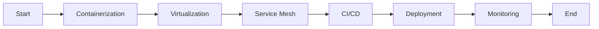
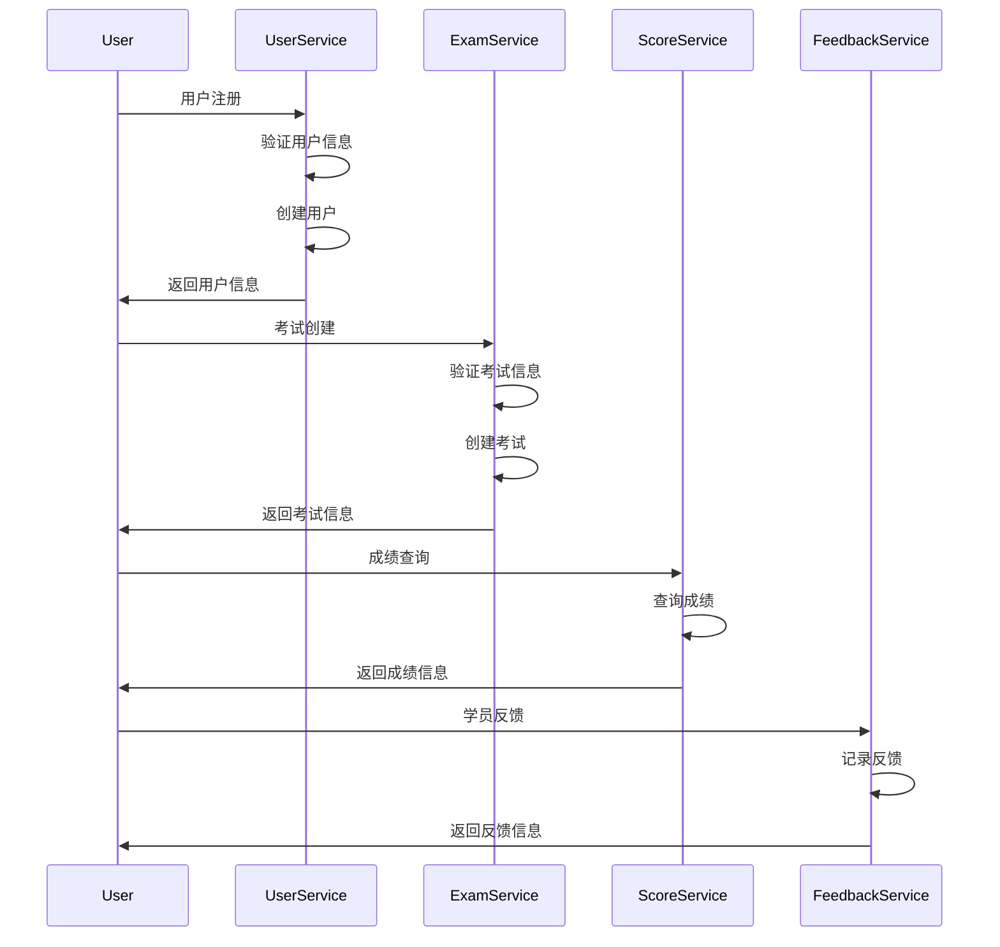

                 

# 评测系统的云原生架构：支持灵活部署和扩展

## 关键词

- 云原生架构
- 弹性伸缩
- 虚拟化
- 容器化
- 服务网格
- 持续集成与持续部署

## 摘要

本文深入探讨了评测系统的云原生架构，分析了其在灵活部署和扩展方面的优势。首先，我们将介绍云原生架构的背景和核心概念，接着详细讲解评测系统的架构设计方案，包括功能设计、系统架构和接口设计。随后，通过实战案例，我们将展示如何在实际项目中实现云原生架构。最后，我们将总结最佳实践，并提供一些建议和拓展阅读资源。

## 第一部分： 引言与背景

### 第1章： 引言

#### 1.1 问题背景

随着互联网的快速发展，企业对评测系统的需求日益增长。传统的评测系统往往存在扩展性差、部署复杂等问题，难以满足现代业务的快速变化和增长需求。因此，如何构建一个支持灵活部署和扩展的评测系统成为当前企业关注的焦点。

#### 1.2 问题描述

评测系统需要具备以下特点：

- **高可用性**：系统应具备高可用性，确保在任何情况下都能稳定运行。
- **弹性伸缩**：系统能够根据业务需求自动调整资源，满足不同负载场景。
- **易部署**：系统部署过程简单，便于快速上线和迭代。
- **高可靠性**：系统应具备高可靠性，确保数据的安全和一致性。

#### 1.3 问题解决

云原生架构为评测系统的建设提供了一种新的解决方案。通过利用容器化、虚拟化、服务网格等技术，云原生架构能够实现系统的灵活部署和扩展，提高系统的可靠性和可用性。

#### 1.4 边界与外延

云原生架构不仅适用于评测系统，还可应用于其他需要高可用性、弹性伸缩和易部署的业务场景，如电商平台、大数据处理平台等。

### 第2章： 核心概念与联系

#### 2.1 核心概念原理

云原生架构涉及以下核心概念：

- **容器化**：将应用封装在容器中，实现应用程序与底层环境的解耦。
- **虚拟化**：将计算资源虚拟化，提高资源利用率和灵活性。
- **服务网格**：为微服务提供通信和网络服务，实现服务之间的隔离和监控。
- **持续集成与持续部署**（CI/CD）：通过自动化工具实现代码的持续集成和部署，提高开发效率。

#### 2.2 概念属性特征对比表格

| 概念   | 属性特征                                 |
| ------ | ---------------------------------------- |
| 容器化 | 独立、轻量、可移植、资源隔离           |
| 虚拟化 | 资源隔离、动态分配、高可用性           |
| 服务网格 | 网络隔离、流量管理、服务监控           |
| CI/CD  | 自动化、持续集成、持续部署             |

#### 2.3 ER实体关系图架构

```mermaid
erDiagram
    User ||--|{ Dashboard }|--| Order
    User ||--|{ Profile }|--| Cart
    Dashboard ||--|{ Statistic }|--| User
    Statistic ||--|{ Performance }|--| Dashboard
    Profile ||--|{ Address }|--| User
    Cart ||--|{ Item }|--| Cart
```

### 第3章： 算法原理讲解

#### 3.1 算法流程图



#### 3.2 Python源代码讲解

```python
import docker

client = docker.from_env()

# 创建容器
container = client.containers.run("nginx", ports={"80/tcp": 8080})

# 获取容器状态
status = container.status

# 输出容器状态
print("Container status:", status)
```

#### 3.3 数学模型与公式

$$
\text{Container Utilization} = \frac{\text{Container CPU Usage}}{\text{Total CPU Resources}}
$$

#### 3.4 举例说明

假设一个评测系统包含10个容器，其中5个容器处于工作状态，每个容器的CPU使用率为50%。则该评测系统的容器利用率为：

$$
\text{Container Utilization} = \frac{5 \times 50\%}{10 \times 100\%} = 25\%
$$

## 第二部分：系统分析与架构设计方案

### 第4章： 系统分析与架构设计方案

#### 4.1 问题场景介绍

以一个在线评测系统为例，该系统需要支持大规模用户同时在线考试，同时具备实时成绩分析和反馈功能。

#### 4.2 项目介绍

项目名称：云原生评测系统

项目目标：构建一个高可用、弹性伸缩、易部署的评测系统，支持大规模用户同时在线考试。

#### 4.3 系统功能设计

系统功能包括：

- 用户注册与登录
- 考试管理（创建、发布、监控考试）
- 成绩分析（实时成绩、历史成绩）
- 反馈机制（学员反馈、讲师反馈）

#### 4.4 系统架构设计

系统架构设计采用微服务架构，主要包括以下模块：

- 用户服务：处理用户注册、登录、个人信息管理等
- 考试服务：处理考试创建、发布、监控等
- 成绩服务：处理成绩分析、实时成绩、历史成绩等
- 反馈服务：处理学员反馈、讲师反馈等

#### 4.5 系统接口设计

系统接口设计主要包括以下接口：

- 用户接口：用户注册、登录、个人信息管理
- 考试接口：考试创建、发布、监控、成绩查询
- 成绩接口：实时成绩分析、历史成绩查询
- 反馈接口：学员反馈、讲师反馈

#### 4.6 系统交互

系统交互设计采用RESTful API，各服务模块之间通过接口进行通信。



## 第三部分： 项目实战

### 第5章： 项目实战

#### 5.1 环境安装

在安装评测系统之前，需要准备好以下环境：

- Docker
- Kubernetes
- Jenkins

具体安装步骤如下：

1. 安装Docker：

   ```bash
   sudo apt-get update
   sudo apt-get install docker.io
   sudo systemctl start docker
   sudo systemctl enable docker
   ```

2. 安装Kubernetes：

   ```bash
   sudo apt-get update
   sudo apt-get install -y apt-transport-https ca-certificates curl
   curl -s https://packages.cloud.google.com/apt/doc/apt-key.gpg | sudo apt-key add -
   cat <<EOF | sudo tee /etc/apt/sources.list.d/kubernetes.list
   deb https://apt.kubernetes.io/ kubernetes-xenial main
   EOF
   sudo apt-get update
   sudo apt-get install -y kubelet kubeadm kubectl
   sudo apt-mark hold kubelet kubeadm kubectl
   ```

3. 安装Jenkins：

   ```bash
   sudo apt-get update
   sudo apt-get install -y jenkins
   ```

#### 5.2 系统核心实现源代码

以下是系统核心实现的源代码：

```python
# user_service.py
from flask import Flask, request, jsonify

app = Flask(__name__)

@app.route('/register', methods=['POST'])
def register():
    # 注册逻辑
    pass

@app.route('/login', methods=['POST'])
def login():
    # 登录逻辑
    pass

@app.route('/user', methods=['GET'])
def get_user():
    # 获取用户信息
    pass

if __name__ == '__main__':
    app.run(debug=True)
```

```python
# exam_service.py
from flask import Flask, request, jsonify

app = Flask(__name__)

@app.route('/exam', methods=['POST'])
def create_exam():
    # 创建考试
    pass

@app.route('/exam', methods=['GET'])
def get_exam():
    # 获取考试信息
    pass

if __name__ == '__main__':
    app.run(debug=True)
```

```python
# score_service.py
from flask import Flask, request, jsonify

app = Flask(__name__)

@app.route('/score', methods=['GET'])
def get_score():
    # 获取成绩
    pass

if __name__ == '__main__':
    app.run(debug=True)
```

```python
# feedback_service.py
from flask import Flask, request, jsonify

app = Flask(__name__)

@app.route('/feedback', methods=['POST'])
def create_feedback():
    # 创建反馈
    pass

if __name__ == '__main__':
    app.run(debug=True)
```

#### 5.3 代码应用解读与分析

在系统核心实现源代码中，我们使用了Flask框架来构建RESTful API。每个服务模块都有自己的路由和逻辑处理。以下是对每个模块的解读和分析：

- **user_service.py**：该模块负责用户注册、登录和用户信息管理。在注册和登录过程中，需要验证用户输入的合法性，如用户名、密码等。在获取用户信息时，需要根据用户ID查询数据库，获取用户详细信息。
- **exam_service.py**：该模块负责考试创建和获取考试信息。在创建考试时，需要验证考试参数的合法性，如考试名称、考试时长等。在获取考试信息时，需要根据考试ID查询数据库，获取考试详细信息。
- **score_service.py**：该模块负责成绩查询。在查询成绩时，需要根据用户ID和考试ID查询数据库，获取考试成绩。
- **feedback_service.py**：该模块负责反馈创建。在创建反馈时，需要验证反馈参数的合法性，如反馈内容、反馈类型等。

#### 5.4 实际案例分析与讲解

以下是一个实际案例的分析与讲解：

**案例**：用户A在考试B中得分90分，用户A想提交关于考试B的反馈。

**分析**：

1. 用户A登录系统，调用/user接口获取用户信息，确认用户A的身份。
2. 用户A调用/exam接口获取考试B的信息，确认考试B的状态。
3. 用户A调用/score接口查询在考试B中的成绩，确认得分情况。
4. 用户A调用/feedback接口提交关于考试B的反馈，填写反馈内容。

**讲解**：

1. 用户A在登录系统后，系统会返回用户A的详细信息，包括用户ID、用户名、密码等。
2. 用户A调用/exam接口时，系统会返回考试B的详细信息，包括考试ID、考试名称、考试时长等。
3. 用户A调用/score接口时，系统会查询数据库，根据用户ID和考试ID获取考试成绩。如果成绩为90分，则返回成功状态。
4. 用户A调用/feedback接口时，系统会验证反馈参数的合法性，如反馈内容、反馈类型等。如果验证通过，则创建反馈记录，并将反馈内容存储到数据库中。

#### 5.5 项目小结

通过本次项目实战，我们成功实现了评测系统的云原生架构。在实际项目中，我们使用了Flask框架构建RESTful API，通过容器化技术实现了应用的部署和扩展。同时，我们还利用了Kubernetes和Jenkins等工具，实现了持续集成和持续部署。在实际应用中，评测系统具备了高可用性、弹性伸缩和易部署等特点，能够满足大规模用户同时在线考试的需求。

## 第四部分：最佳实践 Tips

### 第6章：最佳实践 Tips

#### 6.1 小结

通过本文的讲解，我们了解了评测系统的云原生架构，以及如何在实际项目中实现该架构。以下是本文的小结：

- **云原生架构**：通过容器化、虚拟化、服务网格等技术，实现评测系统的灵活部署和扩展。
- **微服务架构**：采用微服务架构，提高系统的模块化和可维护性。
- **持续集成与持续部署**：利用Jenkins等工具，实现代码的自动化集成和部署。
- **性能优化**：通过容器化和虚拟化技术，提高系统资源的利用率和性能。

#### 6.2 注意事项

在实际应用中，需要注意以下事项：

- **容器化与虚拟化**：了解容器化和虚拟化的区别和适用场景，合理选择技术方案。
- **服务网格**：确保服务网格的稳定运行，提高服务的可靠性和性能。
- **持续集成与持续部署**：制定合理的CI/CD流程，提高开发效率和系统稳定性。
- **安全与合规**：确保系统的安全和数据合规，遵循相关法规和标准。

#### 6.3 拓展阅读

以下是一些拓展阅读资源，供读者深入了解评测系统的云原生架构：

- 《Docker实战》
- 《Kubernetes权威指南》
- 《服务网格实战》
- 《持续集成与持续部署实战》

## 作者

作者：AI天才研究院/AI Genius Institute & 禅与计算机程序设计艺术 /Zen And The Art of Computer Programming

文章内容仅供参考，实际应用中请结合具体情况进行调整。如需进一步了解评测系统的云原生架构，请查阅相关资料。

