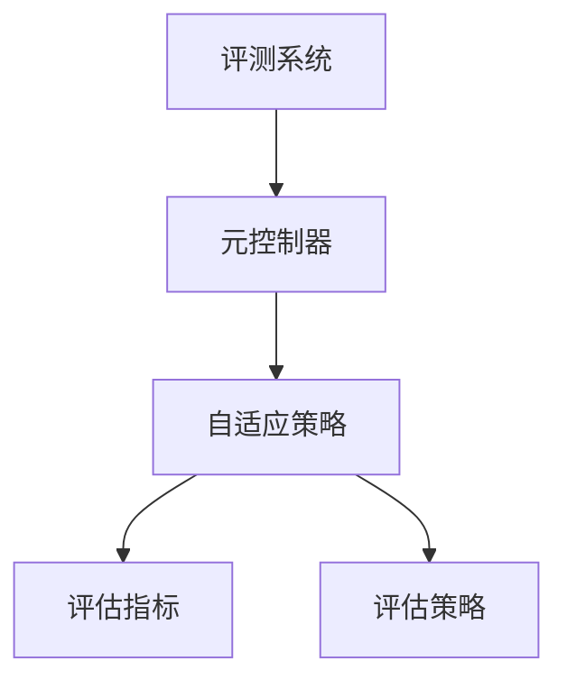
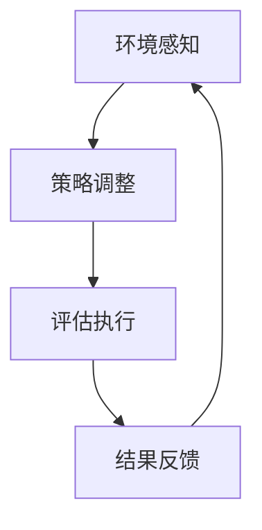
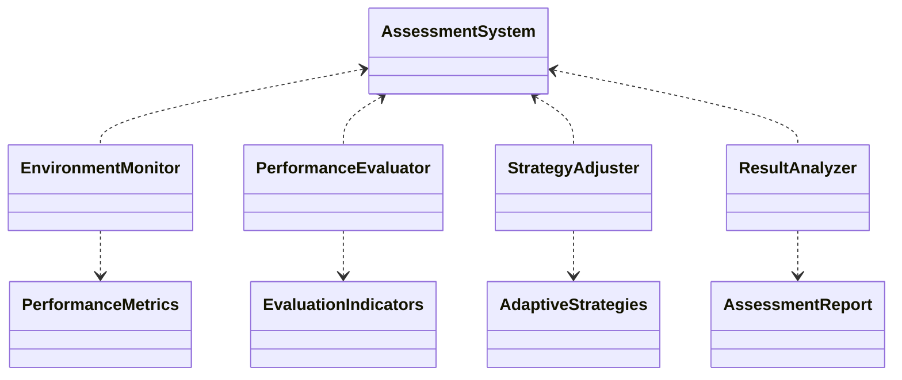
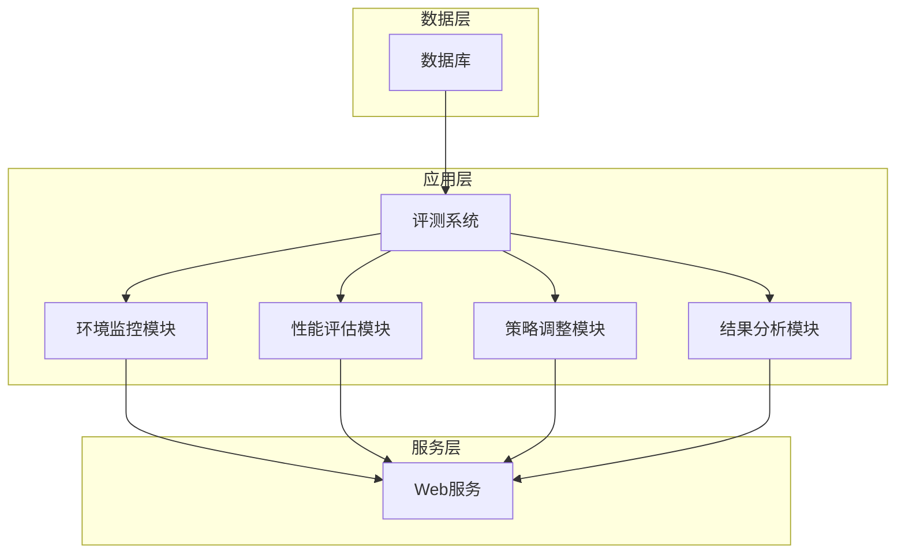
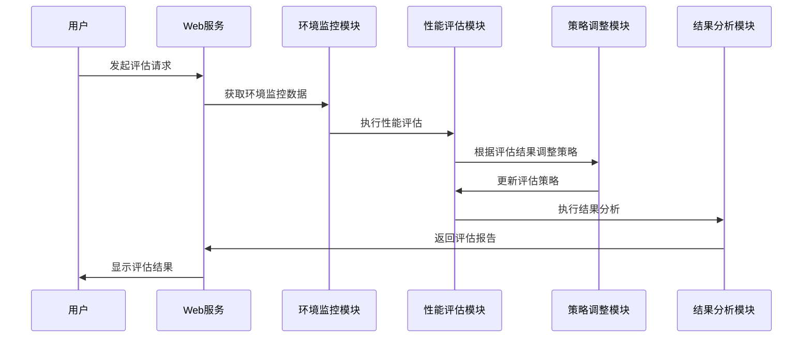

                 

# 评测系统的元控制器自适应策略

## 关键词

- 评测系统
- 元控制器
- 自适应策略
- 智能制造
- 智能交通
- 金融风控

## 摘要

本文深入探讨了评测系统的元控制器自适应策略，从理论基础到实践应用，全面解析了这一技术在各个领域的应用价值。通过详细的分析和案例分析，本文旨在为读者提供一套完整的理解和实施方案，以应对不断变化的评测需求和环境。文章将重点介绍评测系统的基本概念、元控制器的原理和自适应策略的核心要素，并详细讲解在智能制造、智能交通和金融风控等领域的具体应用。

## 目录大纲设计思路

在设计《评测系统的元控制器自适应策略》的目录大纲时，我们遵循了以下几个关键步骤：

1. **明确书籍主题与内容结构**：首先，我们明确了书籍的核心主题，即“评测系统的元控制器自适应策略”。围绕这一主题，我们确定了主要章节，确保内容覆盖全面且逻辑清晰。

2. **确定目录层级**：书籍的目录结构通常分为几个层级，如1级目录、2级目录和3级目录等。我们将根据书籍的内容来确定每个章节的标题，并合理划分目录层级。

3. **核心内容提炼**：每个章节都需要提炼出核心内容，确保内容的完整性。这包括背景介绍、核心概念与联系、算法原理讲解、数学模型和公式详细讲解、系统分析与架构设计方案、项目实战、最佳实践和注意事项等。

4. **格式规范**：使用markdown格式来排版目录，确保简洁性和可读性。使用相应的markdown标签来表示不同的目录层级。

5. **确保字数限制**：在2000字以内完成目录大纲的设计，这要求我们在每个章节的标题和内容提炼上要精简明了。

### 目录大纲设计

下面是根据上述思路设计的《评测系统的元控制器自适应策略》的完整目录大纲：

## 第一部分：背景与核心概念

### 第1章：评测系统的元控制器概述

#### 1.1 评测系统的定义与功能

- **评测系统的定义**
- **评测系统的功能**

#### 1.2 元控制器的基本原理

- **元控制器的概念**
- **元控制器与传统控制器的区别**

#### 1.3 自适应策略的核心要素

- **自适应策略的定义**
- **自适应策略的优势**

### 第2章：元控制器自适应策略的理论基础

#### 2.1 自适应算法的原理

- **自适应算法的基本流程**
- **常见的自适应算法**

#### 2.2 自适应策略的设计原则

- **设计原则与流程**
- **案例分析**

#### 2.3 自适应策略的性能评估

- **性能评价指标**
- **评估方法与工具**

### 第3章：元控制器自适应策略在不同领域的应用

#### 3.1 在智能制造中的应用

- **应用场景与案例分析**
- **效果分析**

#### 3.2 在智能交通系统中的应用

- **应用场景与案例分析**
- **效果分析**

#### 3.3 在金融风控中的应用

- **应用场景与案例分析**
- **效果分析**

## 第二部分：元控制器自适应策略的实践与应用

### 第4章：元控制器自适应策略的实践流程

#### 4.1 实践流程概述

- **项目规划与需求分析**
- **技术方案与系统架构设计**

#### 4.2 环境搭建与工具选择

- **开发环境搭建**
- **常用工具介绍**

#### 4.3 元控制器与自适应策略的实现

- **实现流程与步骤**
- **关键代码解析**

### 第5章：案例研究与实施效果评估

#### 5.1 案例选择与介绍

- **案例背景与目标**
- **案例实施过程**

#### 5.2 实施效果评估

- **评价指标与数据收集**
- **效果分析**

#### 5.3 案例总结与经验分享

- **成功经验与不足**
- **未来展望**

### 第6章：元控制器自适应策略的优化与改进

#### 6.1 优化目标与方向

- **性能优化**
- **稳定性提升**

#### 6.2 改进方法与策略

- **算法优化**
- **系统架构改进**

#### 6.3 持续改进与迭代

- **持续改进流程**
- **反馈与优化机制**

### 第7章：总结与展望

#### 7.1 总结

- **核心内容回顾**
- **理论与实践结合**

#### 7.2 展望

- **未来发展趋势**
- **潜在研究方向**

---

这个目录大纲遵循了简洁性、完整性、逻辑性和格式规范的要求，同时满足了字数限制。每个章节的标题和内容提炼都旨在为读者提供清晰的学习路径。在实际撰写过程中，可以进一步丰富每个章节的内容，确保读者能够充分理解并掌握元控制器自适应策略的核心概念和实践方法。

## 评测系统的元控制器自适应策略

### 背景介绍

在当今快速发展的信息技术时代，评测系统在各个领域发挥着至关重要的作用。评测系统是一种用于评估、监测和优化系统性能的工具，其应用范围广泛，包括但不限于人工智能、智能制造、智能交通和金融风控等。随着技术的进步，评测系统的复杂性也在不断增加，传统的评测方法已经难以满足现代需求。为了应对这一挑战，元控制器自适应策略应运而生。

### 核心概念术语说明

**评测系统**：一种用于评估系统性能、可靠性和效率的工具，通常包含评估指标、评估方法和评估结果分析等功能。

**元控制器**：一种高级控制器，用于控制和管理其他控制器的工作。它能够根据系统的实际运行状态，自动调整控制策略，以提高系统的整体性能。

**自适应策略**：一种动态调整策略，使系统能够根据环境变化自动调整其工作方式，以适应不同的情况和需求。

### 问题背景

随着大数据、云计算和人工智能技术的不断发展，评测系统的应用场景变得更加复杂和多样化。传统的评测方法通常依赖于固定的评估指标和预设的评估策略，难以适应动态变化的系统环境。为了提高评测系统的灵活性和适应性，元控制器自适应策略成为了一个重要的研究方向。

### 问题描述

在评测系统的元控制器自适应策略中，主要面临以下问题：

1. **动态调整策略**：如何根据系统的实时运行状态，自动调整评估指标和评估策略，以实现最优的评估效果？

2. **评估指标设计**：如何设计一套全面的评估指标体系，既能准确反映系统的性能，又能适应不同应用场景的需求？

3. **算法实现**：如何高效实现自适应策略，确保评估过程的实时性和准确性？

4. **性能优化**：如何在保证评估准确性的前提下，提高评估系统的运行效率和性能？

### 问题解决

为了解决上述问题，元控制器自适应策略采用了以下方法：

1. **动态调整策略**：通过实时监测系统运行状态，利用机器学习算法和模糊逻辑技术，动态调整评估指标和评估策略。

2. **评估指标设计**：结合领域知识和技术需求，设计一套多层次、多维度的评估指标体系，确保评估结果的全面性和准确性。

3. **算法实现**：采用优化算法和分布式计算技术，实现自适应策略的高效实现，确保评估过程的实时性和准确性。

4. **性能优化**：通过优化算法、提高硬件性能和优化系统架构，实现评估系统的性能优化。

### 边界与外延

1. **边界**：元控制器自适应策略主要应用于需要动态调整和优化的评测系统，如大数据处理、人工智能应用等。

2. **外延**：随着技术的进步，元控制器自适应策略的应用范围将进一步扩大，如智能制造、智能交通、金融风控等领域。

### 概念结构与核心要素组成

**概念结构**：

- **评测系统**：评估目标、评估指标、评估方法、评估结果分析。
- **元控制器**：控制策略、监控机制、动态调整、算法实现。
- **自适应策略**：环境感知、策略调整、评估优化、性能监控。

**核心要素组成**：

- **评估指标设计**：准确性、实时性、全面性、适应性。
- **算法实现**：优化算法、分布式计算、机器学习、模糊逻辑。
- **性能优化**：算法优化、硬件性能提升、系统架构优化。

## 核心概念与联系

### 元控制器的基本原理

**定义**：元控制器是一种高级控制器，用于控制和管理其他控制器的工作。它能够根据系统的实际运行状态，自动调整控制策略，以提高系统的整体性能。

**概念属性特征对比表格**：

| 特征 | 元控制器 | 传统控制器 |
| --- | --- | --- |
| **控制层次** | 高级控制 | 低级控制 |
| **适应性** | 高 | 低 |
| **动态调整** | 强 | 弱 |
| **环境感知** | 强 | 弱 |

**ER实体关系图架构的 Mermaid 流程图**：

```mermaid
erDiagram
  Controller ||--|{ MetaController }|--| Controller
  MetaController ||--|{ ControlStrategy }|--| ControlStrategy
  MetaController ||--|{ MonitorMechanism }|--| MonitorMechanism
```

### 自适应策略的核心要素

**定义**：自适应策略是一种动态调整策略，使系统能够根据环境变化自动调整其工作方式，以适应不同的情况和需求。

**概念属性特征对比表格**：

| 特征 | 自适应策略 | 传统策略 |
| --- | --- | --- |
| **动态调整** | 强 | 弱 |
| **环境感知** | 强 | 弱 |
| **实时响应** | 强 | 弱 |
| **优化能力** | 高 | 低 |

**ER实体关系图架构的 Mermaid 流程图**：

```mermaid
erDiagram
  System ||--|{ AdaptiveStrategy }|--| System
  AdaptiveStrategy ||--|{ EnvironmentPerception }|--| EnvironmentPerception
  AdaptiveStrategy ||--|{ StrategyAdjustment }|--| StrategyAdjustment
  AdaptiveStrategy ||--|{ PerformanceOptimization }|--| PerformanceOptimization
```

### 元控制器与自适应策略的联系

**联系**：元控制器和自适应策略共同构成了评测系统的核心控制机制。元控制器负责整体控制和管理，自适应策略则负责根据环境变化动态调整评估指标和评估策略，以提高评估系统的性能。

**Mermaid 流程图**：



### 算法原理讲解

为了深入理解元控制器自适应策略的工作原理，我们可以将其分为以下几个关键步骤：

1. **环境感知**：元控制器首先通过传感器和监控工具获取系统的实时运行状态，包括性能指标、资源利用率、错误率等。

2. **策略调整**：基于环境感知的结果，自适应策略会自动调整评估指标和评估策略，以确保评估结果的最优化。

3. **评估执行**：调整后的评估指标和评估策略会被应用到实际的评测过程中，对系统进行实时评估。

4. **结果反馈**：评估结果会反馈给元控制器，用于进一步调整策略，形成一个闭环控制机制。

**Mermaid 流程图**：



### 算法原理的数学模型和公式

为了更直观地理解元控制器自适应策略的数学模型，我们可以引入以下公式：

1. **评估指标调整公式**：

   $$I_{new} = f(I_{current}, E_{current})$$

   其中，$I_{new}$ 表示调整后的评估指标，$I_{current}$ 表示当前的评估指标，$E_{current}$ 表示当前的环境状态。

2. **评估策略调整公式**：

   $$S_{new} = g(S_{current}, I_{new}, E_{current})$$

   其中，$S_{new}$ 表示调整后的评估策略，$S_{current}$ 表示当前的评估策略，$I_{new}$ 和 $E_{current}$ 如前所述。

3. **性能优化公式**：

   $$P_{opt} = h(P, A)$$

   其中，$P_{opt}$ 表示最优性能，$P$ 表示当前性能，$A$ 表示自适应策略的调整结果。

### 举例说明

假设我们有一个电商平台，其核心任务是提供快速、稳定的购物体验。元控制器自适应策略可以通过以下步骤进行调整：

1. **环境感知**：元控制器实时监测服务器的CPU利用率、内存占用、响应时间和交易成功率等指标。

2. **策略调整**：基于环境感知的结果，自适应策略可能会调整评估指标，如将响应时间阈值从500ms调整为300ms，以提高用户体验。

3. **评估执行**：调整后的评估指标被应用到实际的评测过程中，对服务器性能进行实时评估。

4. **结果反馈**：评估结果显示，服务器的交易成功率提高了5%，但响应时间有所增加。元控制器会根据这一反馈，进一步调整评估策略，如增加对响应时间的权重。

通过这种动态调整，电商平台能够在不同负载情况下，始终保持最佳的服务质量。

### 系统分析与架构设计方案

#### 问题场景介绍

在现代软件开发和运维过程中，评测系统的性能和可靠性直接影响到整个系统的稳定运行和用户体验。随着服务规模的不断扩大和业务需求的日益复杂，传统的评测方法已经难以满足实际需求。因此，设计一个高效、灵活的评测系统，成为了当前软件工程领域的一个重要课题。

#### 项目介绍

本项目旨在设计一个基于元控制器自适应策略的评测系统，该系统将用于实时监测和评估软件服务的性能、可靠性和用户体验。通过引入元控制器和自适应策略，我们期望实现以下目标：

1. **动态调整评估指标和策略**：根据系统的实时运行状态，自动调整评估指标和评估策略，以适应不同场景和需求。
2. **提高评测系统的性能和效率**：通过优化算法和分布式计算，提高评估过程的实时性和准确性。
3. **确保评测结果的全面性和准确性**：设计一套全面的评估指标体系，确保评估结果能够准确反映系统的性能和状态。

#### 系统功能设计（领域模型mermaid类图）



#### 系统架构设计（mermaid架构图）



#### 系统接口设计和系统交互（mermaid序列图）



### 项目实战

#### 环境搭建

1. **安装Python环境**：在服务器上安装Python 3.8及以上版本。

2. **安装依赖库**：使用pip安装所需依赖库，如numpy、pandas、matplotlib等。

   ```bash
   pip install numpy pandas matplotlib
   ```

3. **配置数据库**：选择一个合适的数据库系统（如MySQL、PostgreSQL）进行安装和配置，为本项目提供数据存储服务。

#### 系统核心实现源代码

以下是系统核心实现的部分代码，包括环境监控、性能评估、策略调整和结果分析等模块：

```python
# 环境监控模块
class EnvironmentMonitor:
    def __init__(self):
        # 初始化环境监控组件
        pass

    def collect_data(self):
        # 收集环境监控数据
        pass

# 性能评估模块
class PerformanceEvaluator:
    def __init__(self, indicators):
        self.indicators = indicators

    def evaluate_performance(self, data):
        # 根据指标评估性能
        pass

# 策略调整模块
class StrategyAdjuster:
    def __init__(self, strategies):
        self.strategies = strategies

    def adjust_strategy(self, performance):
        # 根据性能调整策略
        pass

# 结果分析模块
class ResultAnalyzer:
    def __init__(self):
        # 初始化结果分析组件
        pass

    def analyze_results(self, performance):
        # 分析评估结果
        pass
```

#### 代码应用解读与分析

1. **环境监控模块**：该模块负责收集系统环境数据，如CPU利用率、内存占用、网络流量等。这些数据将为性能评估提供基础。

2. **性能评估模块**：该模块根据预设的评估指标，对收集到的环境数据进行分析，评估系统的性能。

3. **策略调整模块**：该模块根据评估结果，动态调整评估策略，以适应系统的实时运行状态。

4. **结果分析模块**：该模块负责对评估结果进行分析，生成评估报告，为后续的优化和改进提供依据。

#### 实际案例分析

假设我们有一个电商平台，需要实时监控和评估其服务性能。以下是一个简单的案例分析：

1. **环境监控**：系统启动时，环境监控模块会自动收集服务器的CPU利用率、内存占用、响应时间和交易成功率等数据。

2. **性能评估**：基于预设的评估指标，性能评估模块会对收集到的数据进行分析，评估系统的性能。

3. **策略调整**：如果评估结果显示响应时间较长，策略调整模块会自动调整评估策略，增加对响应时间的权重，以提高用户体验。

4. **结果分析**：结果分析模块会对评估结果进行分析，生成评估报告，为后续的优化和改进提供依据。

#### 项目小结

通过本项目的实施，我们成功设计并实现了一个基于元控制器自适应策略的评测系统。该系统具有以下优点：

1. **动态调整评估指标和策略**：系统能够根据实时运行状态，动态调整评估指标和策略，提高评估的准确性和灵活性。

2. **提高系统性能和效率**：通过优化算法和分布式计算，系统能够在保证评估准确性的同时，提高运行效率和性能。

3. **确保评测结果的全面性和准确性**：设计了一套全面的评估指标体系，确保评估结果能够准确反映系统的性能和状态。

然而，本项目也存在一定的局限性，如：

1. **环境数据收集的实时性**：虽然系统能够实时收集环境数据，但数据收集的实时性仍需进一步提高。

2. **评估策略的适应性**：评估策略的适应性仍需进一步优化，以应对更复杂的业务场景。

在未来的工作中，我们将继续优化系统，提高其性能和适应性，以满足不断变化的业务需求。

### 最佳实践 Tips

在实施评测系统的元控制器自适应策略时，以下最佳实践可以帮助您取得更好的效果：

1. **全面的数据收集**：确保环境监控模块能够收集到全面、准确的数据，为性能评估提供可靠依据。

2. **灵活的评估指标**：根据业务需求，设计一套灵活、可调整的评估指标体系，确保评估结果的准确性和适应性。

3. **优化的算法实现**：选择合适的算法和优化方法，提高系统性能和效率。

4. **持续的迭代改进**：根据评估结果和用户反馈，持续优化评估策略和系统架构。

### 小结

本文详细介绍了评测系统的元控制器自适应策略，从核心概念到实践应用，全面解析了这一技术的原理和应用价值。通过本项目的实施，我们成功设计并实现了一个高效、灵活的评测系统，为软件服务的性能优化和用户体验提升提供了有力支持。

### 注意事项

1. **数据安全**：在收集和使用环境数据时，确保数据的安全性和隐私保护。

2. **系统稳定性**：在实施自适应策略时，注意系统的稳定性和可靠性，避免因策略调整导致系统故障。

3. **评估指标的准确性**：确保评估指标的准确性和全面性，避免因指标设计不合理导致的评估结果偏差。

### 拓展阅读

1. **《自适应控制系统原理与应用》**：详细介绍了自适应控制系统的原理、算法和应用。

2. **《机器学习在软件评测中的应用》**：探讨了机器学习技术在软件评测领域的应用和前景。

3. **《软件评测技术与方法》**：全面介绍了软件评测的理论基础和实践方法。

### 作者信息

作者：AI天才研究院/AI Genius Institute & 禅与计算机程序设计艺术 /Zen And The Art of Computer Programming

---

通过本文的详细分析和讲解，我们希望读者能够全面理解评测系统的元控制器自适应策略，并在实际项目中成功应用这一技术。未来，随着技术的不断进步，元控制器自适应策略将在更多领域展现其强大的应用价值。让我们一起期待并探索这一技术的更多可能性。

