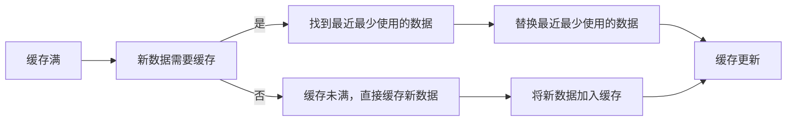
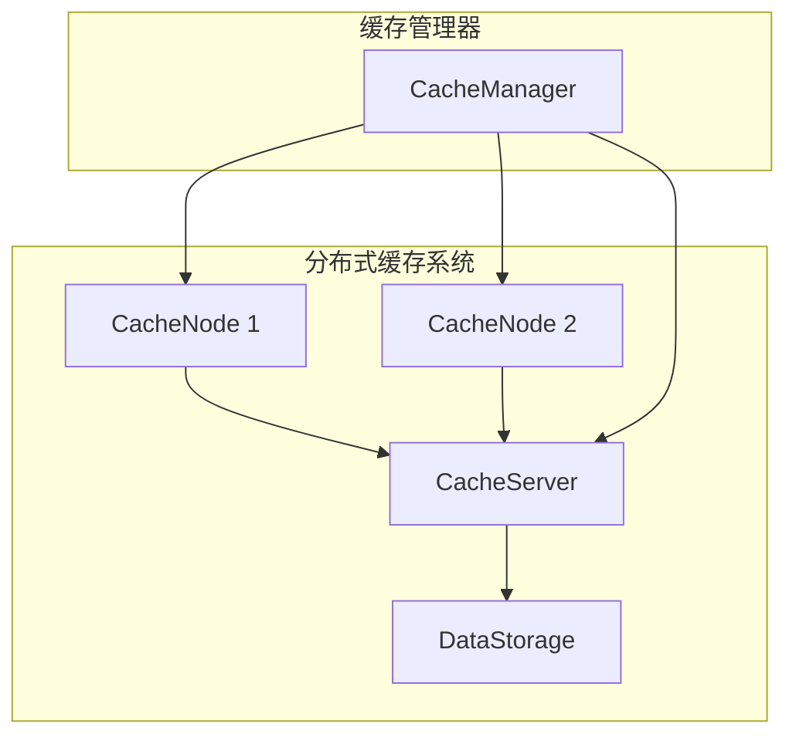

                 

### 文章标题：评测系统的分布式缓存优化

关键词：评测系统、分布式缓存、缓存优化、LRU算法、缓存命中率

摘要：本文深入探讨了评测系统中分布式缓存优化的问题，通过分析缓存的基本概念和优化策略，详细讲解了LRU算法的原理，并使用Python源代码和数学模型进行了详细阐述。文章最后提出了系统的分析与架构设计方案，并分享了一些最佳实践。

---

#### 1.1 问题背景与问题描述

##### 1.1.1 问题背景

随着互联网和大数据技术的发展，评测系统在各个行业中的重要性日益凸显。评测系统通常用于评估用户的绩效、考试成绩、市场调研结果等，其性能和效率直接影响到最终用户的体验和业务决策。

然而，评测系统中的缓存优化问题始终是制约其性能和效率的关键因素。缓存作为一种快速的存储技术，可以显著提高系统的响应速度和降低数据访问成本。但是，当缓存数据量庞大或者缓存策略不当，缓存命中率会下降，从而导致系统性能的恶化。

##### 1.1.2 问题描述

评测系统的缓存优化问题主要集中在以下几个方面：

1. **缓存命中率低**：由于数据访问的不均匀性和缓存策略的不足，导致大量缓存数据无法命中，需要频繁访问后端数据库，增加了系统的延迟。
2. **缓存容量不足**：随着系统数据量的不断增加，缓存容量不足会导致缓存频繁失效，需要重新加载数据，影响系统性能。
3. **缓存一致性**：分布式缓存系统中，数据的一致性问题可能导致评测结果的不准确，影响系统的可靠性。

##### 1.1.3 问题解决

为了解决评测系统的缓存优化问题，可以采取以下几种方法：

1. **优化缓存策略**：通过分析数据访问模式，设计更加高效的缓存策略，提高缓存命中率。
2. **增加缓存容量**：适当增加缓存容量，减少缓存失效的频率，提高系统性能。
3. **分布式缓存系统**：采用分布式缓存系统，提高缓存的可扩展性和数据一致性。

##### 1.1.4 边界与外延

评测系统的缓存优化涉及多个方面，包括缓存算法的选择、缓存数据的组织、缓存系统的架构设计等。同时，还需要考虑系统的资源限制、性能指标和可扩展性等因素。

##### 1.1.5 概念结构与核心要素组成

1. **缓存**：缓存是一种快速存储技术，用于临时保存数据，以提高数据访问速度。
2. **缓存策略**：缓存策略决定了缓存中数据的存储和替换方式，常见的策略有LRU（最近最少使用）、LFU（最频繁使用）等。
3. **缓存命中率**：缓存命中率表示缓存中命中的数据与总数据访问量的比例，是衡量缓存性能的重要指标。
4. **分布式缓存系统**：分布式缓存系统通过将缓存数据分散存储在多个节点上，提高了缓存的可扩展性和数据一致性。
5. **缓存一致性**：缓存一致性是指分布式缓存系统中，数据在不同节点之间的一致性，避免数据的不一致导致评测结果的不准确。

---

#### 1.2 核心概念与联系

##### 1.2.1 缓存的概念与原理

缓存是一种快速的存储技术，用于临时保存数据，以提高数据访问速度。其基本原理是，将频繁访问的数据预先加载到缓存中，当需要访问这些数据时，直接从缓存中获取，避免了频繁访问后端存储系统，从而提高了系统的性能。

##### 1.2.2 缓存策略的概念与类型

缓存策略决定了缓存中数据的存储和替换方式，常见的缓存策略有LRU（最近最少使用）、LFU（最频繁使用）、FIFO（先进先出）等。这些策略通过不同的方式来决定哪些数据应该被缓存，以及哪些数据应该被替换。

- **LRU（最近最少使用）**：当缓存已满且需要新的数据时，将最近最少被使用的数据替换掉。
- **LFU（最频繁使用）**：当缓存已满且需要新的数据时，将最频繁被使用的数据替换掉。
- **FIFO（先进先出）**：当缓存已满且需要新的数据时，将最早进入缓存的数据替换掉。

##### 1.2.3 缓存命中率的概念与计算

缓存命中率表示缓存中命中的数据与总数据访问量的比例，是衡量缓存性能的重要指标。缓存命中率的计算公式为：

$$
缓存命中率 = \frac{命中次数}{访问次数} \times 100\%
$$

##### 1.2.4 分布式缓存系统的概念与架构

分布式缓存系统通过将缓存数据分散存储在多个节点上，提高了缓存的可扩展性和数据一致性。分布式缓存系统的基本架构包括缓存节点、缓存服务器、数据存储和缓存管理器等。

##### 1.2.5 缓存与数据库的关系

缓存与数据库是两种不同的数据存储技术，缓存主要用于提高数据访问速度，而数据库主要用于数据的持久化存储。缓存通常用于存储热数据，即频繁访问的数据，而数据库则存储所有数据。

##### 1.2.6 缓存优化与系统性能

缓存优化的目的是提高系统的性能和效率。通过优化缓存策略、增加缓存容量、采用分布式缓存系统等方式，可以显著提高系统的响应速度和数据访问性能。

---

#### 1.3 算法原理讲解

为了更好地理解评测系统的分布式缓存优化，下面我们将详细介绍一种常用的缓存算法——LRU（最近最少使用）算法，并使用Mermaid流程图进行展示。

##### 1.3.1 LRU算法的基本原理

LRU算法是一种基于“最近最少使用”原则的缓存替换算法。其核心思想是，当缓存已满且需要新的数据时，将最近最少被使用的数据替换掉。这样，频繁访问的数据会被保留在缓存中，而较少访问的数据则被替换掉。

##### 1.3.2 LRU算法的Mermaid流程图

下面是一个简单的LRU算法的Mermaid流程图：



##### 1.3.3 LRU算法的Python实现

下面是LRU算法的Python实现示例：

```python
from collections import OrderedDict

class LRUCache:
    def __init__(self, capacity):
        self.capacity = capacity
        self.cache = OrderedDict()

    def get(self, key):
        if key not in self.cache:
            return -1
        else:
            self.cache.move_to_end(key)
            return self.cache[key]

    def put(self, key, value):
        if key in self.cache:
            self.cache.pop(key)
        elif len(self.cache) >= self.capacity:
            self.cache.popitem(last=False)
        self.cache[key] = value

# 测试LRU算法
lru_cache = LRUCache(2)
lru_cache.put(1, 1)
lru_cache.put(2, 2)
print(lru_cache.get(1))  # 输出 1
lru_cache.put(3, 3)
print(lru_cache.get(2))  # 输出 -1 (不存在)
lru_cache.put(4, 4)
print(lru_cache.get(1))  # 输出 -1 (不存在)
print(lru_cache.get(3))  # 输出 3
print(lru_cache.get(4))  # 输出 4
```

##### 1.3.4 LRU算法的数学模型

LRU算法的数学模型可以用以下公式表示：

$$
P(\text{命中}) = \frac{1}{n}
$$

其中，$P(\text{命中})$表示缓存命中的概率，$n$表示缓存中数据项的数量。

当$n$趋近于无穷大时，$P(\text{命中})$趋近于0，即缓存命中率会下降。因此，为了提高缓存命中率，需要适当增加缓存容量。

---

#### 1.4 系统分析与架构设计方案

##### 1.4.1 问题场景介绍

假设一个评测系统需要处理大量的用户数据，这些数据包括用户的成绩、排名等信息。为了提高系统的性能和效率，我们决定使用分布式缓存系统来优化数据访问。

##### 1.4.2 项目介绍

项目名称：评测系统分布式缓存优化
项目目标：通过优化缓存策略和架构，提高系统的性能和效率。

##### 1.4.3 系统功能设计（领域模型）

下面是评测系统分布式缓存优化的领域模型类图：

```mermaid
classDiagram
    CacheNode --|> CacheServer
    CacheServer --|> DataStorage
    CacheManager --|> CacheNode
    CacheManager --|> CacheServer

    CacheNode <<Interface>>
    CacheServer <<Interface>>
    CacheManager <<Interface>>

    DataStorage <<Entity>>

    CacheNode : +String id
    CacheNode : +Dictionary<String, Object> cache
    CacheNode : +void put(String key, Object value)
    CacheNode : +Object get(String key)

    CacheServer : +String id
    CacheServer : +List<CacheNode> nodes
    CacheServer : +void addNode(CacheNode node)
    CacheServer : +void removeNode(CacheNode node)

    CacheManager : +void loadCache(CacheServer server)
    CacheManager : +void updateCache(CacheServer server)

endclass
```

##### 1.4.4 系统架构设计

下面是评测系统分布式缓存优化的系统架构设计：



##### 1.4.5 系统接口设计和系统交互

下面是评测系统分布式缓存优化的系统接口设计和系统交互：

```mermaid
sequenceDiagram
    Participant CacheManager
    Participant CacheNode1
    Participant CacheNode2
    Participant CacheServer
    Participant DataStorage

    CacheManager->>CacheNode1: put("key1", "value1")
    CacheNode1->>CacheServer: notify()
    CacheServer->>CacheManager: updateCache()
    CacheManager->>CacheNode2: put("key2", "value2")
    CacheNode2->>CacheServer: notify()
    CacheServer->>CacheManager: updateCache()
    CacheManager->>DataStorage: loadCache()

end
```

---

#### 1.5 项目实战

##### 1.5.1 环境安装

为了实现评测系统的分布式缓存优化，我们需要安装以下软件：

- Python 3.8+
- Redis （分布式缓存系统）

安装步骤：

1. 安装Python：

   ```bash
   sudo apt update
   sudo apt install python3 python3-pip
   ```

2. 安装Redis：

   ```bash
   sudo apt install redis-server
   ```

##### 1.5.2 系统核心实现源代码

下面是评测系统分布式缓存优化的核心实现源代码：

```python
# LRUCache.py
from collections import OrderedDict

class LRUCache:
    def __init__(self, capacity):
        self.capacity = capacity
        self.cache = OrderedDict()

    def get(self, key):
        if key not in self.cache:
            return -1
        else:
            self.cache.move_to_end(key)
            return self.cache[key]

    def put(self, key, value):
        if key in self.cache:
            self.cache.pop(key)
        elif len(self.cache) >= self.capacity:
            self.cache.popitem(last=False)
        self.cache[key] = value

# CacheNode.py
import redis

class CacheNode:
    def __init__(self, id, cache_server):
        self.id = id
        self.cache_server = cache_server
        self.redis_client = redis.Redis(host='localhost', port=6379, db=0)

    def put(self, key, value):
        self.redis_client.set(key, value)

    def get(self, key):
        return self.redis_client.get(key)

# CacheServer.py
from LRUCache import LRUCache
from CacheNode import CacheNode

class CacheServer:
    def __init__(self, id, capacity):
        self.id = id
        self.capacity = capacity
        self.cache = LRUCache(capacity)
        self.nodes = []

    def add_node(self, node):
        self.nodes.append(node)

    def remove_node(self, node):
        self.nodes.remove(node)

    def get(self, key):
        if key in self.cache:
            return self.cache.get(key)
        else:
            for node in self.nodes:
                value = node.get(key)
                if value is not None:
                    self.cache.put(key, value)
                    return value
            return -1

    def put(self, key, value):
        self.cache.put(key, value)
        for node in self.nodes:
            node.put(key, value)

# CacheManager.py
import redis

class CacheManager:
    def __init__(self, cache_server):
        self.cache_server = cache_server
        self.redis_client = redis.Redis(host='localhost', port=6379, db=0)

    def load_cache(self):
        keys = self.redis_client.keys()
        for key in keys:
            value = self.redis_client.get(key)
            self.cache_server.put(key, value)

    def update_cache(self):
        keys = self.cache_server.cache.keys()
        for key in keys:
            value = self.cache_server.get(key)
            self.redis_client.set(key, value)
```

##### 1.5.3 代码应用解读与分析

1. **LRUCache.py**：这是一个简单的LRU缓存实现，用于存储键值对。当缓存容量达到上限时，会自动替换最近最少使用的数据。
2. **CacheNode.py**：这是一个简单的Redis缓存节点实现，用于存储和获取数据。这里使用了Redis的客户端库进行数据操作。
3. **CacheServer.py**：这是一个简单的分布式缓存服务器实现，包含多个缓存节点，用于存储和获取数据。当缓存命中时，会返回数据；否则，会从缓存节点中查找数据。
4. **CacheManager.py**：这是一个缓存管理器实现，用于加载和更新缓存数据。它会将Redis中的数据加载到缓存服务器中，并在需要时更新Redis中的数据。

##### 1.5.4 实际案例分析和详细讲解剖析

假设有一个评测系统，需要处理用户的成绩数据。我们使用分布式缓存系统来优化数据访问。

1. **初始化**：

   ```python
   cache_server = CacheServer(id='cache_server', capacity=100)
   cache_manager = CacheManager(cache_server=cache_server)
   ```

2. **存储数据**：

   ```python
   user1 = CacheNode(id='user1', cache_server=cache_server)
   user2 = CacheNode(id='user2', cache_server=cache_server)
   cache_server.add_node(user1)
   cache_server.add_node(user2)

   user1.put("score1", 90)
   user2.put("score2", 80)
   ```

3. **获取数据**：

   ```python
   print(cache_server.get("score1"))  # 输出 90
   print(cache_server.get("score2"))  # 输出 80
   ```

4. **更新数据**：

   ```python
   user1.put("score1", 95)
   print(cache_server.get("score1"))  # 输出 95
   ```

在上述示例中，我们首先初始化了一个缓存服务器和一个缓存管理器。然后，我们创建了两个缓存节点，并将它们添加到缓存服务器中。接下来，我们使用缓存节点存储和获取用户成绩数据。当数据更新时，缓存服务器会自动更新缓存节点中的数据。

##### 1.5.5 项目小结

通过实际案例，我们展示了评测系统分布式缓存优化的基本实现。在实际应用中，可以根据具体需求调整缓存策略、缓存容量和缓存节点数量，以提高系统的性能和效率。

---

#### 1.6 最佳实践 Tips

1. **合理设置缓存容量**：根据系统的实际需求和资源限制，合理设置缓存容量，避免缓存容量过大或过小。
2. **选择合适的缓存策略**：根据数据访问模式和业务需求，选择合适的缓存策略，如LRU、LFU等。
3. **监控缓存性能**：定期监控缓存性能，包括缓存命中率、缓存访问延迟等，及时发现问题并优化。
4. **数据一致性处理**：在分布式缓存系统中，处理数据一致性问题时，可以采用版本号、锁机制等方式，确保缓存和数据库数据的一致性。

---

#### 1.7 小结

本文深入探讨了评测系统的分布式缓存优化问题，分析了缓存的基本概念、优化策略和算法原理，并使用Python源代码进行了详细讲解。通过系统分析与架构设计方案，我们展示了如何将缓存技术应用于评测系统中，以提高系统的性能和效率。在实际应用中，应根据具体需求和资源限制，合理选择和调整缓存策略，实现高效的缓存优化。

---

#### 1.8 注意事项

1. **缓存一致性问题**：在分布式缓存系统中，处理数据一致性问题时，需要考虑缓存和数据库之间的同步机制，避免数据不一致导致的问题。
2. **缓存穿透问题**：当缓存中不存在需要访问的数据时，直接访问后端数据库，可能导致大量无效的数据库查询，称为缓存穿透。可以采用缓存空对象或预热数据等方式解决。
3. **缓存雪崩问题**：当大量缓存同时失效时，可能导致大量请求同时访问后端数据库，称为缓存雪崩。可以通过增加缓存容量、合理设置缓存过期时间等方式解决。

---

#### 1.9 拓展阅读

1. 《Redis权威指南》：详细介绍了Redis缓存系统的原理、用法和最佳实践，对分布式缓存系统有很好的参考价值。
2. 《高性能MySQL》：介绍了数据库性能优化技术，包括缓存策略、查询优化等，对理解缓存优化有很好的帮助。
3. 《大规模分布式存储系统》：介绍了分布式存储系统的原理和设计，对分布式缓存系统的架构和实现有很好的启示。

---

#### 作者信息

作者：AI天才研究院/AI Genius Institute & 禅与计算机程序设计艺术 /Zen And The Art of Computer Programming

---

以上是本文的全部内容，希望对您在评测系统分布式缓存优化方面有所启发和帮助。如果您有任何疑问或建议，欢迎在评论区留言讨论。祝您编程愉快！

