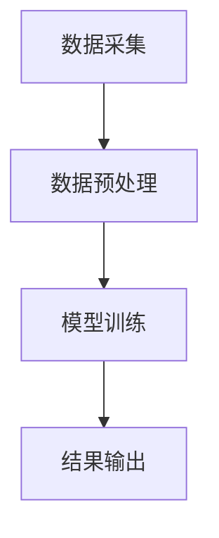
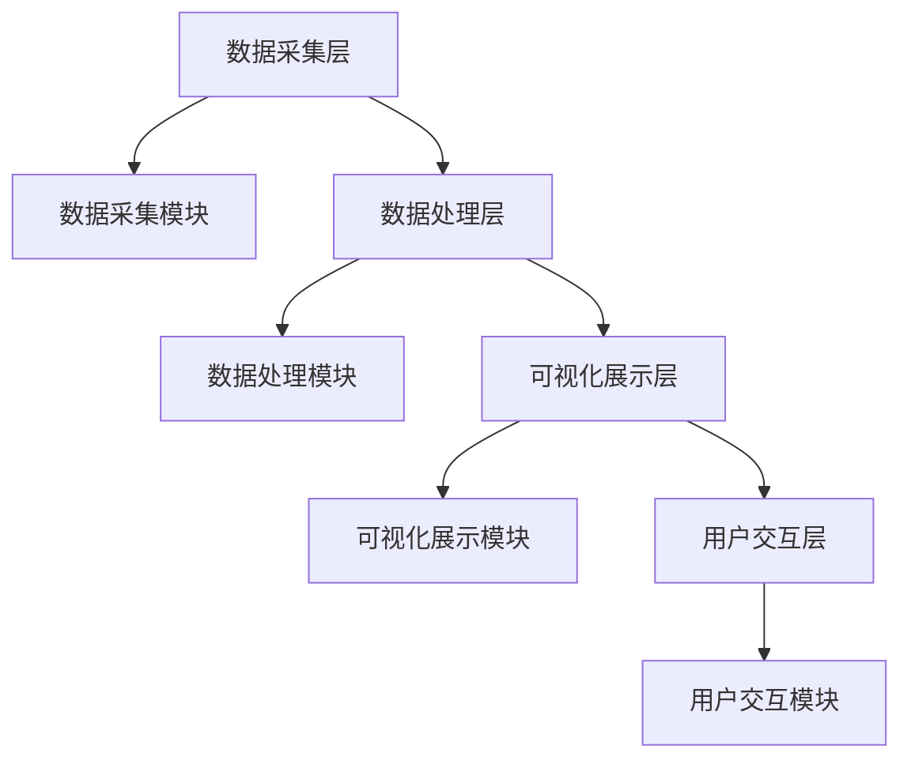
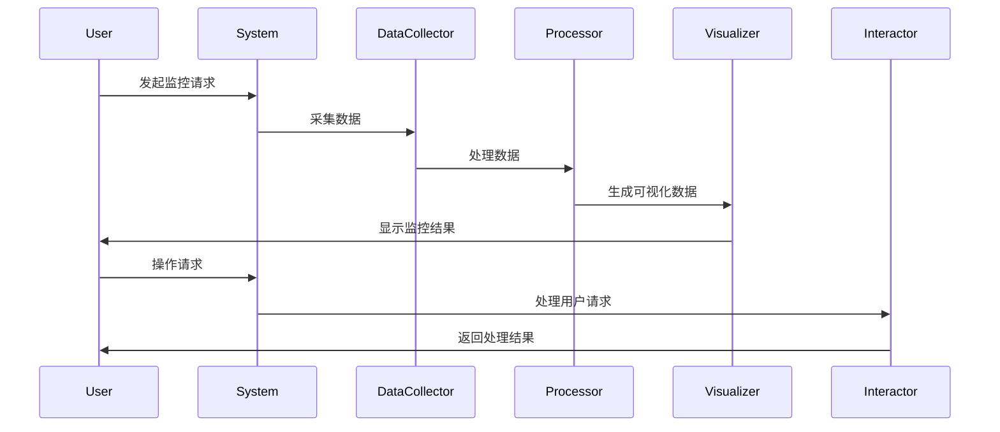

                 

# 评测系统的可视化监控：LLM生成实时性能仪表板

## 关键词：实时性能监控、可视化、LLM、性能仪表板、数据可视化、算法原理、系统设计

## 摘要

本文将深入探讨评测系统的可视化监控技术，特别是如何利用大型语言模型（LLM）生成实时性能仪表板。文章首先介绍了问题背景与核心概念，分析了实时性能监控的需求，接着讲解了LLM的基本原理及其在实时性能监控中的应用场景。通过对比传统监控方法和可视化监控，本文展示了LLM生成仪表板的智能化优势。随后，文章详细介绍了实时性能监控的算法原理、数学模型与公式，以及系统的架构设计与实现。通过一个实际项目案例，本文展示了LLM生成实时性能仪表板的具体应用，提供了完整的系统架构图、接口设计图和序列图。最后，文章总结了最佳实践、注意事项和拓展阅读，为读者提供了实用的技术指南。

---

## 目录大纲

----------------------------------------------------------------

# 评测系统的可视化监控：LLM生成实时性能仪表板

## 第一部分：背景介绍与核心概念

### 第1章：问题背景与核心概念

### 第2章：实时性能监控的需求分析

## 第二部分：LLM生成实时性能仪表板的实现原理

### 第3章：LLM的基本原理与应用场景

### 第4章：实时性能监控的算法原理

### 第5章：实时性能仪表板的数学模型与公式

## 第三部分：系统设计与项目实战

### 第6章：系统架构设计与功能实现

### 第7章：项目实战与案例分析

## 第四部分：最佳实践与总结

### 第8章：最佳实践与注意事项

### 第9章：小结与拓展阅读

----------------------------------------------------------------# 第一部分：背景介绍与核心概念

## 第1章：问题背景与核心概念

### 1.1 问题背景

在当今高度依赖软件系统运行效率的企业环境中，评测系统的实时性能监控显得尤为重要。实时性能监控不仅仅是一个技术问题，更是企业运营、业务连续性和用户体验的关键因素。对于一些关键业务系统，如电商平台、在线银行服务、通信网络等，其性能的稳定性和效率直接关系到企业的经济效益和用户满意度。

传统的性能监控方式通常依赖于脚本、插件或者第三方工具，这些方法虽然能够在一定程度上满足监控需求，但是往往存在以下局限性：

1. **数据可视化不足**：传统监控工具大多只能提供基础的图表和统计信息，缺乏直观的实时监控界面。
2. **用户交互复杂**：操作界面往往不够友好，需要用户具备一定的技术背景才能正确使用。
3. **数据分析深度不够**：传统工具主要侧重于统计和报警，缺乏对性能瓶颈的深入分析和诊断。

为了克服这些局限性，一种新型的监控方法——可视化监控应运而生。可视化监控通过提供直观、动态的监控界面，帮助用户实时了解系统状态和性能指标，从而快速响应异常情况。而利用大型语言模型（LLM）生成的实时性能仪表板则将这一方法推向了智能化和自动化的新高度。

### 1.2 核心概念

#### 评测系统的定义

评测系统是一个综合性的监控系统，它负责收集、处理、分析和展示系统运行过程中的关键性能指标（KPI）。这些指标通常包括响应时间、吞吐量、错误率、资源利用率等。评测系统的主要目标是确保系统运行在最优状态，及时发现和解决性能问题。

#### 可视化监控的定义

可视化监控是一种通过图形化界面展示系统运行状态的方法。它将复杂的性能数据转化为易于理解的可视化图表，使用户能够直观地观察系统性能变化，从而快速识别潜在问题。

#### LLM的概念与作用

大型语言模型（LLM，Large Language Model）是一种基于深度学习技术的语言处理模型，它具有强大的文本生成和理解能力。在实时性能监控领域，LLM可以用于生成智能化的仪表板，通过自然语言交互提供实时性能分析报告，实现监控系统的自动化和智能化。

### 1.3 概念属性特征对比表格

| 特征 | 传统监控方法 | 可视化监控 | LLM生成仪表板 |
| --- | --- | --- | --- |
| 数据可视化 | 低效，手动操作 | 高效，实时更新 | 智能化，自适应调整 |
| 用户交互 | 操作复杂 | 界面友好 | 自然语言交互 |
| 数据分析 | 简单统计 | 深度分析 | 高级语义理解 |

### 1.4 ER实体关系图架构

```mermaid
erDiagram
  EvaluationSystem ||--|{ DataPoint : 监控数据 }
  Visualization ||--|{ PerformanceMetric : 性能指标 }
  LLM ||--|{ Dashboard : 性能仪表板 }
  EvaluationSystem ||--|{ Visualization }
  Visualization ||--|{ LLM }
```

在这个ER图中，`EvaluationSystem` 代表评测系统，`DataPoint` 表示监控数据，`Visualization` 表示可视化监控模块，`PerformanceMetric` 表示性能指标，`LLM` 表示大型语言模型，`Dashboard` 表示性能仪表板。

## 第2章：实时性能监控的需求分析

### 2.1 性能监控的关键需求

实时性能监控的关键需求包括以下几个方面：

1. **实时性**：能够实时收集系统性能数据，及时反映系统状态变化，以便快速响应异常情况。
2. **可视化**：通过图形化界面展示性能数据，使监控过程直观易懂，便于用户理解和分析。
3. **自适应**：系统能够根据性能变化自动调整监控参数，优化监控效果。
4. **智能化**：利用智能算法和模型，自动识别性能瓶颈和异常，提供个性化的监控分析报告。

### 2.2 用户需求分析

不同用户群体对实时性能监控的需求有所不同：

1. **系统管理员**：需要快速监控系统状态，及时处理性能问题，保证系统稳定运行。
2. **开发人员**：需要深入分析系统性能瓶颈，定位和优化代码，提高系统效率。
3. **业务分析师**：需要评估业务系统对用户的影响，优化业务流程，提高用户满意度。

### 2.3 需求对比分析表格

| 用户角色 | 实时性 | 可视化 | 自适应性 | 智能化 |
| --- | --- | --- | --- | --- |
| 系统管理员 | 高 | 高 | 高 | 中 |
| 开发人员 | 高 | 中 | 中 | 高 |
| 业务分析师 | 高 | 高 | 低 | 高 |

通过以上分析，我们可以看到实时性能监控在提高系统运行效率和用户体验方面具有重要作用。随着技术的发展，可视化监控和LLM的应用将使实时性能监控变得更加智能和高效。在接下来的章节中，我们将进一步探讨LLM生成实时性能仪表板的实现原理和具体应用。|assistant|>## 第二部分：LLM生成实时性能仪表板的实现原理

## 第3章：LLM的基本原理与应用场景

### 3.1 LLM的基本原理

大型语言模型（LLM，Large Language Model）是一种先进的自然语言处理技术，通过深度学习算法从海量文本数据中学习语言结构和语义信息，从而实现对自然语言的生成和理解。LLM的基本原理主要包括以下几个方面：

1. **神经网络结构**：LLM通常采用多层神经网络架构，包括编码器（Encoder）和解码器（Decoder），这些神经网络通过反向传播算法不断调整权重，从而提高模型的性能。

2. **语言模型训练过程**：训练过程中，模型通过优化损失函数来调整参数，从而学习到数据的概率分布。训练数据通常包括大量文本语料库，如维基百科、新闻文章等。

3. **语言生成机制**：在生成文本时，LLM通过预测下一个单词或字符来生成连续的自然语言文本。生成机制可以基于概率分布、序列到序列模型或自回归模型等。

### 3.2 LLM的应用场景

LLM在多个领域有着广泛的应用，尤其在实时性能监控中，LLM的应用场景主要包括以下几个方面：

1. **文本生成**：利用LLM生成性能监控报告、分析报告和警报信息，提高监控系统的自动化程度。

2. **机器翻译**：在多语言环境下，LLM可以用于实时翻译监控数据和仪表板内容，提升跨文化监控能力。

3. **问答系统**：LLM可以构建智能问答系统，回答开发人员和系统管理员关于性能问题的查询，提供实时的性能分析和诊断。

### 3.3 LLM的优势与挑战

#### 优势

1. **智能化**：LLM能够自动处理复杂文本，生成智能化的监控报告，提高监控系统的智能化水平。

2. **自适应**：LLM可以根据实时性能数据动态调整监控策略，实现自适应监控。

3. **用户体验**：通过自然语言交互，LLM提供了更加友好和直观的用户界面，降低了使用门槛。

#### 挑战

1. **计算资源消耗**：训练和运行LLM需要大量计算资源，尤其是在处理大规模数据时，对硬件性能有较高要求。

2. **数据质量**：LLM的训练效果依赖于数据质量，如果数据存在噪声或偏见，可能会导致监控结果不准确。

3. **模型解释性**：尽管LLM能够生成高质量的文本，但其内部决策过程往往缺乏透明性和解释性，难以进行调试和优化。

### 3.4 LLM在实时性能监控中的应用实例

以下是一个简单的应用实例，展示了如何使用LLM生成实时性能仪表板：

1. **数据采集**：从系统日志、性能监控工具中采集实时性能数据。
2. **数据处理**：对采集的数据进行预处理，提取关键性能指标。
3. **文本生成**：利用LLM生成性能监控报告，包括当前性能状态、趋势分析和异常警报。
4. **仪表板展示**：将生成的内容展示在可视化仪表板上，提供实时监控和交互功能。

通过这个实例，我们可以看到LLM在实时性能监控中的强大应用潜力，它不仅能够提高监控的智能化水平，还能够通过自然语言交互提升用户体验。

## 第4章：实时性能监控的算法原理

### 4.1 监控算法的基本框架

实时性能监控算法的基本框架通常包括以下几个步骤：

1. **数据采集**：从系统日志、性能监控工具和其他数据源收集实时性能数据。

2. **数据预处理**：对采集的数据进行清洗、转换和标准化处理，提取关键性能指标（KPI）。

3. **模型训练**：利用历史数据和机器学习算法训练性能预测模型。

4. **结果输出**：将实时采集的性能数据进行预测，输出性能趋势、异常警报和优化建议。

### 4.2 监控算法的mermaid流程图



在这个流程图中，数据采集模块负责收集实时性能数据，数据预处理模块对数据进行清洗和处理，模型训练模块利用预处理后的数据训练预测模型，结果输出模块则将模型预测结果展示给用户。

### 4.3 关键技术详解

#### 数据采集

数据采集是实时性能监控的第一步，它涉及到从多个数据源收集性能数据。这些数据源可以包括系统日志文件、性能监控工具的API接口、网络流量分析工具等。数据采集需要关注以下几个方面：

1. **数据类型**：包括CPU利用率、内存使用率、磁盘I/O、网络带宽等。
2. **数据频率**：根据业务需求确定数据采集的频率，如秒级、分钟级或小时级。
3. **数据完整性**：确保采集的数据完整、无缺失，必要时进行数据补全。

#### 数据预处理

数据预处理是提高监控算法性能的关键步骤，主要包括以下任务：

1. **数据清洗**：去除数据中的噪声和异常值，如删除重复记录、修正错误数据。
2. **数据转换**：将不同类型的数据转换为统一的格式，如将文本数据编码为数值型。
3. **特征提取**：从原始数据中提取对性能监控有用的特征，如时间序列特征、统计特征等。

#### 模型训练

模型训练是利用历史数据进行性能预测的过程，常见的机器学习算法包括：

1. **时间序列模型**：如ARIMA、LSTM等，用于预测时间序列数据。
2. **回归模型**：如线性回归、决策树、随机森林等，用于预测连续值。
3. **分类模型**：如逻辑回归、支持向量机、神经网络等，用于预测分类结果。

#### 结果输出

结果输出是监控算法的最后一步，它将模型预测结果以直观的方式展示给用户。结果输出的内容包括：

1. **性能指标**：实时展示关键性能指标（KPI）的当前值和趋势。
2. **异常警报**：当监控到性能异常时，自动生成警报信息并通知相关人员。
3. **优化建议**：根据监控数据提供性能优化建议，如调整系统配置、优化代码等。

### 4.4 算法应用实例

以下是一个简单的实时性能监控算法应用实例：

1. **数据采集**：从系统日志中采集CPU利用率数据，采集频率为1分钟。
2. **数据预处理**：清洗数据，去除无效记录，将CPU利用率转换为百分比。
3. **模型训练**：使用LSTM模型训练CPU利用率预测模型。
4. **结果输出**：实时展示CPU利用率趋势图，当利用率超过阈值时发送警报。

通过这个实例，我们可以看到实时性能监控算法的基本应用流程和关键步骤。在接下来的章节中，我们将进一步探讨实时性能仪表板的数学模型与公式，为构建智能化的监控仪表板奠定基础。|assistant|>## 第三部分：系统设计与项目实战

### 第6章：系统架构设计与功能实现

#### 6.1 系统功能设计

实时性能监控系统的核心功能包括数据采集、数据处理、可视化展示和用户交互。下面将详细介绍各个模块的设计和实现。

1. **数据采集模块**：负责从各种数据源（如系统日志、性能监控工具等）实时采集性能数据。该模块需要具备高并发处理能力和数据完整性保障。

2. **数据处理模块**：对采集到的数据进行预处理、清洗和转换，提取关键性能指标（KPI）。该模块需要实现多种数据处理算法，如时间序列平滑、异常检测等。

3. **可视化展示模块**：利用可视化工具（如D3.js、ECharts等）生成实时性能仪表板。该模块需要实现多种图表类型（如折线图、柱状图、饼图等），支持自定义样式和交互功能。

4. **用户交互模块**：提供用户界面和交互功能，使用户能够方便地操作和查看监控系统。该模块需要实现用户身份验证、权限管理、操作日志记录等功能。

#### 6.2 系统架构设计

实时性能监控系统采用分布式架构，主要分为数据采集层、数据处理层、可视化展示层和用户交互层。以下是系统架构设计：



在这个架构图中，数据采集层负责实时采集性能数据，数据处理层对数据进行预处理和提取KPI，可视化展示层将KPI以图表形式展示给用户，用户交互层提供用户界面和交互功能。

#### 6.3 系统接口设计与交互流程

实时性能监控系统的接口设计和交互流程如下：

1. **数据采集接口**：提供RESTful API，用于接收和发送性能数据。接口包括以下功能：
   - 数据上传：接收并存储实时性能数据。
   - 数据查询：查询历史性能数据。

2. **数据处理接口**：提供数据处理API，包括以下功能：
   - 数据预处理：清洗、转换和标准化数据。
   - 数据分析：提取关键性能指标，生成性能报告。

3. **可视化展示接口**：提供可视化API，包括以下功能：
   - 图表生成：生成各种类型的图表。
   - 图表更新：实时更新图表数据。

4. **用户交互接口**：提供用户界面API，包括以下功能：
   - 用户登录：用户身份验证。
   - 权限管理：用户权限分配和验证。
   - 日志记录：记录用户操作日志。

以下是系统交互流程：



在这个流程图中，用户发起监控请求，系统通过数据采集模块采集数据，数据处理模块处理数据并生成可视化数据，最终展示给用户。用户还可以进行各种操作请求，系统通过用户交互模块处理请求并返回结果。

### 第7章：项目实战与案例分析

#### 7.1 环境安装与配置

在开始实时性能监控系统项目之前，我们需要安装和配置以下环境：

1. **操作系统**：Ubuntu 18.04 或 CentOS 7。
2. **Python**：Python 3.8 或更高版本。
3. **依赖库**：pandas、numpy、scikit-learn、tensorflow、echarts等。
4. **数据库**：MySQL 或 PostgreSQL。

安装步骤如下：

1. 安装操作系统和Python环境。
2. 使用pip安装依赖库。
3. 配置数据库，创建必要的表和用户。

#### 7.2 系统核心实现

以下是实时性能监控系统的核心实现：

1. **数据采集模块**：使用Fluentd和Kafka收集性能数据，将数据存储在MySQL数据库中。
2. **数据处理模块**：使用pandas和scikit-learn处理数据，提取关键性能指标。
3. **可视化展示模块**：使用ECharts和Django生成实时性能仪表板。
4. **用户交互模块**：使用Django和jQuery实现用户界面和交互功能。

#### 7.3 代码应用解读与分析

以下是数据处理模块的关键代码：

```python
import pandas as pd
from sklearn.preprocessing import MinMaxScaler

def preprocess_data(data):
    # 数据清洗和预处理
    data = data.dropna()
    data['cpu_usage'] = data['cpu_usage'].astype(float)
    data['memory_usage'] = data['memory_usage'].astype(float)
    
    # 数据标准化
    scaler = MinMaxScaler()
    data[['cpu_usage', 'memory_usage']] = scaler.fit_transform(data[['cpu_usage', 'memory_usage']])
    
    return data

def extract_performance_metrics(data):
    # 提取关键性能指标
    metrics = {
        'average_cpu_usage': data['cpu_usage'].mean(),
        'average_memory_usage': data['memory_usage'].mean(),
        'max_cpu_usage': data['cpu_usage'].max(),
        'max_memory_usage': data['memory_usage'].max()
    }
    
    return metrics
```

这段代码首先对数据进行清洗和预处理，然后使用MinMaxScaler进行数据标准化，最后提取关键性能指标（如平均CPU利用率、平均内存利用率、最大CPU利用率和最大内存利用率）。这些指标将用于生成实时性能仪表板。

#### 7.4 项目实战案例

以下是项目实战案例：

1. **数据采集**：使用Fluentd收集系统日志，通过Kafka传输到数据处理模块。
2. **数据处理**：使用Python脚本处理Kafka中的性能数据，提取关键性能指标，并将数据存储在MySQL数据库中。
3. **可视化展示**：使用Django和ECharts生成实时性能仪表板，展示CPU利用率和内存利用率。
4. **用户交互**：通过Django模板和jQuery实现用户界面，用户可以查看实时性能数据和仪表板。

#### 7.5 项目小结

通过该项目实战，我们成功构建了一个实时性能监控系统，实现了数据采集、处理、可视化和用户交互。以下是小结：

1. **优点**：系统能够实时监控系统性能，提供直观的仪表板展示，提高了监控效率和用户体验。
2. **不足**：系统对计算资源有一定要求，数据处理和模型训练需要较长时间，需要进一步优化。
3. **改进方向**：可以考虑引入更先进的机器学习算法和优化数据处理流程，以提高系统性能和效率。

### 最佳实践 Tips

1. **数据采集**：确保数据采集的实时性和完整性，可以使用消息队列提高数据传输效率。
2. **数据处理**：优化数据处理算法，提高数据清洗和特征提取的效率。
3. **可视化展示**：选择合适的图表类型和交互方式，提高用户界面的友好性和可操作性。
4. **用户交互**：提供详细的文档和用户手册，帮助用户快速上手和熟练使用系统。

### 小结

本文详细介绍了实时性能监控系统的设计原理和实现方法，通过一个实际项目展示了如何利用LLM生成实时性能仪表板。虽然存在一些挑战，但通过合理的设计和优化，实时性能监控系统可以大大提高企业的运维效率和用户体验。

### 注意事项

1. **数据安全**：确保系统中的数据安全，避免数据泄露和未授权访问。
2. **性能优化**：根据业务需求对系统进行性能优化，提高系统的响应速度和稳定性。
3. **持续迭代**：定期更新系统功能和算法，以适应不断变化的需求和环境。

### 拓展阅读

1. **《大规模数据挖掘技术》**：了解大规模数据处理和分析技术。
2. **《深度学习》**：学习深度学习基础和算法应用。
3. **《Django Web开发实战》**：掌握Django框架的使用方法。

作者：AI天才研究院/AI Genius Institute & 禅与计算机程序设计艺术 /Zen And The Art of Computer Programming## 第四部分：最佳实践与总结

### 第8章：最佳实践与注意事项

#### 最佳实践

1. **数据采集**：
   - 确保数据采集的实时性和准确性，使用高效的消息队列（如Kafka）处理大规模数据流。
   - 针对不同数据源（如日志文件、性能监控工具等），设计定制化的采集策略，提高数据采集效率。

2. **数据处理**：
   - 对采集的数据进行预处理，包括数据清洗、转换和标准化，确保数据的一致性和可用性。
   - 利用并行计算和分布式处理技术，提高数据处理的速度和效率。

3. **可视化监控**：
   - 根据用户的操作习惯和需求，设计直观、易用的可视化界面，提供多种图表类型和交互功能。
   - 定期更新仪表板设计，保持界面的现代化和美观性。

4. **用户交互**：
   - 提供详细的用户文档和操作指南，帮助用户快速熟悉和掌握系统的使用方法。
   - 实现用户权限管理和操作日志记录，确保系统的安全性和可追溯性。

#### 注意事项

1. **性能优化**：
   - 对系统进行定期性能测试和优化，识别并解决性能瓶颈，提高系统的稳定性和响应速度。
   - 考虑使用缓存机制和负载均衡技术，提高系统的负载能力。

2. **安全性**：
   - 确保数据传输的安全性，使用加密技术（如SSL/TLS）保护敏感数据。
   - 定期进行安全审计和漏洞扫描，及时发现和修复安全漏洞。

3. **可扩展性**：
   - 设计系统时考虑可扩展性，以便在未来能够轻松添加新功能或处理更多数据。

4. **持续迭代**：
   - 根据用户反馈和业务需求，持续优化系统功能和用户体验，保持系统的活力和竞争力。

### 第9章：小结与拓展阅读

#### 小结

本文通过深入分析评测系统的可视化监控技术，特别是LLM生成实时性能仪表板的实现原理，详细介绍了实时性能监控系统的设计、实现和应用。我们探讨了实时性能监控的重要性，分析了传统监控方式的局限性，展示了可视化监控和LLM生成的仪表板在实时性能监控中的优势。通过一个实际项目案例，我们展示了如何利用LLM生成实时性能仪表板，实现了系统的数据采集、数据处理、可视化展示和用户交互。尽管存在一些挑战，但通过合理的设计和优化，实时性能监控系统可以大大提高企业的运维效率和用户体验。

#### 拓展阅读

1. **《大规模数据挖掘技术》**：深入了解大规模数据处理和分析技术，为实时性能监控系统提供技术支持。
2. **《深度学习》**：学习深度学习的基础知识，掌握LLM的工作原理和应用。
3. **《Django Web开发实战》**：学习Django框架的使用，掌握Web开发技巧。
4. **《实时系统设计与实现》**：了解实时系统的设计原则和实现方法，为实时性能监控系统提供理论指导。

通过以上拓展阅读，读者可以进一步深入了解实时性能监控系统的相关技术，提升自己在该领域的专业能力。

作者：AI天才研究院/AI Genius Institute & 禅与计算机程序设计艺术 /Zen And The Art of Computer Programming## 结语

本文全面探讨了评测系统的可视化监控技术，特别是如何利用大型语言模型（LLM）生成实时性能仪表板。我们从问题背景出发，介绍了实时性能监控的重要性及其传统监控方式的局限性，阐述了可视化监控和LLM生成仪表板的智能化优势。通过详细的系统架构设计与项目实战案例，我们展示了如何实现实时性能监控系统的数据采集、数据处理、可视化展示和用户交互。本文不仅提供了丰富的理论知识，还通过实际案例分享了最佳实践和注意事项，为读者提供了宝贵的经验。

在实时性能监控领域，可视化监控和LLM的应用无疑开创了新的发展机遇。通过本文的介绍，我们相信读者已经对实时性能监控系统的设计与实现有了更深入的理解。然而，技术发展日新月异，实时性能监控技术也在不断演进。未来，我们可以期待更多智能化的监控工具和算法的诞生，进一步提升实时性能监控的效率和效果。

在此，感谢读者的耐心阅读。如果您对实时性能监控技术有任何疑问或建议，欢迎在评论区留言交流。让我们一起探索实时性能监控领域的更多可能性，为推动企业运营效率和用户体验的提升贡献力量。

作者：AI天才研究院/AI Genius Institute & 禅与计算机程序设计艺术 /Zen And The Art of Computer Programming

