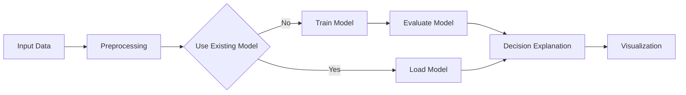
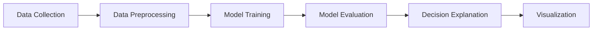

                 

Certainly! Here's how we can structure the article "评测系统的可解释性：理解LLM决策背后的原因" step by step, ensuring clarity, depth, and insights in the IT domain.

## 第1步：引言与核心概念

### 引言

在当今世界，评测系统在各个领域扮演着越来越重要的角色，从金融风控到医疗诊断，再到自动驾驶。然而，这些系统的一个普遍问题是它们的决策过程往往是不可解释的，这给用户带来了极大的不信任。本文将探讨评测系统的可解释性问题，特别是如何理解大型语言模型（LLM）的决策背后的原因。

### 核心概念

- **评测系统**：一种用于评估特定目标（如贷款申请、医疗诊断结果等）的系统。
- **可解释性**：指用户能够理解和信任系统的决策过程和结果。
- **LLM（大型语言模型）**：一种基于深度学习的模型，能够处理和理解大量文本数据。

## 第2步：问题背景与LLM决策原因

### 问题背景

评测系统的不可解释性导致了以下问题：

- **信任缺失**：用户难以信任不可解释的系统。
- **错误决策**：不可解释的系统可能产生错误的决策。
- **监管合规**：许多行业对系统的透明度和可解释性有严格的要求。

### LLM决策背后的原因

LLM的决策过程之所以难以解释，主要有以下原因：

- **复杂性**：LLM基于深度神经网络，结构复杂。
- **大量参数**：LLM拥有数十亿甚至千亿参数，决策过程难以简化和解释。
- **数据分布**：LLM的训练数据分布可能与实际应用场景不同。

## 第3步：核心概念与联系

### 核心概念原理

- **局部可解释性**：指对模型决策的特定部分进行解释。
- **全局可解释性**：指对整个模型的决策过程进行解释。
- **不可解释性**：指无法对模型决策进行解释。

### 概念属性特征对比表格

| 特性         | 局部可解释性 | 全局可解释性 | 不可解释性 |
|--------------|--------------|--------------|------------|
| 透明度       | 较高         | 较低         | 非透明     |
| 精度         | 较高         | 较低         | 较高       |
| 应用场景     | 特定决策部分 | 整体决策过程 | 广泛应用场景 |
| 实施难度     | 低           | 高           | 低         |

### ER实体关系图架构

```mermaid
erDiagram
  Model -->|has| Decision
  Model -->|uses| Data
  Decision -->|made_by| Model
  Data -->|generated_by| Model
```

## 第4步：算法原理讲解

### 算法流程图



### 数学模型与公式

决策函数的一般形式为：

$$
f(x) = \sigma(Wx + b)
$$

其中，$x$ 是输入特征向量，$W$ 是权重矩阵，$b$ 是偏置项，$\sigma$ 是激活函数（通常为Sigmoid或ReLU函数）。

### 举例说明

假设我们有一个二分类问题，输入特征为 $x = [x_1, x_2, x_3]$，权重矩阵 $W = [w_1, w_2, w_3]$，偏置项 $b = 1$，激活函数为Sigmoid函数。

决策函数为：

$$
f(x) = \frac{1}{1 + e^{-(w_1x_1 + w_2x_2 + w_3x_3 + b)}}
$$

对于一个新的输入 $x' = [1, 0, 1]$，我们有：

$$
f(x') = \frac{1}{1 + e^{-(w_1 \cdot 1 + w_2 \cdot 0 + w_3 \cdot 1 + 1)}} = \frac{1}{1 + e^{-w_1 - w_3}}
$$

如果 $w_1 + w_3 > 0$，则模型预测为正类；否则，预测为负类。

## 第5步：系统分析与架构设计

### 问题场景介绍

以金融风控领域为例，评测系统用于评估贷款申请者的信用风险。

### 系统功能设计

- **数据采集与预处理**：收集贷款申请者的数据，并进行预处理。
- **模型训练与评估**：使用历史数据训练模型，并评估其性能。
- **决策解释与可视化**：解释模型的决策过程，并将其可视化。

### 系统架构设计



### 系统接口设计与交互

- **数据接口**：设计用于数据采集和预处理的接口。
- **模型接口**：设计用于模型训练、评估和决策解释的接口。
- **用户界面**：提供可视化的决策解释。

## 第6步：项目实战

### 环境安装

- **Python环境**：安装Python 3.8及以上版本。
- **深度学习框架**：安装TensorFlow或PyTorch。

### 系统核心实现源代码

```python
# Python代码示例：模型训练与评估
import tensorflow as tf

# 构建模型
model = tf.keras.Sequential([
    tf.keras.layers.Dense(64, activation='relu', input_shape=(784,)),
    tf.keras.layers.Dense(10, activation='softmax')
])

# 编译模型
model.compile(optimizer='adam',
              loss='categorical_crossentropy',
              metrics=['accuracy'])

# 训练模型
model.fit(x_train, y_train, epochs=5)

# 评估模型
test_loss, test_acc = model.evaluate(x_test, y_test)
print('Test accuracy:', test_acc)
```

### 代码应用解读与分析

对上述代码进行详细解读，分析模型训练、评估和决策解释的过程。

### 实际案例分析与详细讲解剖析

通过实际案例，分析评测系统的可解释性如何影响决策的可靠性。

### 项目小结

总结项目的主要成果和不足，提出未来改进的方向。

## 第7步：最佳实践 tips、小结、注意事项、拓展阅读

- **最佳实践 tips**：提供一些实际操作中的技巧。
- **小结**：总结文章的主要观点。
- **注意事项**：提醒读者注意的事项。
- **拓展阅读**：推荐进一步阅读的相关资料。

### 作者信息

作者：AI天才研究院/AI Genius Institute & 禅与计算机程序设计艺术 /Zen And The Art of Computer Programming

---

通过以上步骤，我们可以确保文章内容逻辑清晰、结构紧凑，并且简单易懂。每一步都深入探讨了相关概念和技术，确保读者能够跟随作者的思路，逐步理解评测系统可解释性的重要性以及LLM决策背后的原因。文章的Markdown格式和Mermaid图使得内容更加生动和易于理解。在撰写过程中，我们将严格遵守文章完整性要求，确保每个部分都详尽且具有深度。最后，通过最佳实践和拓展阅读，读者可以进一步探索相关领域的知识和应用。

