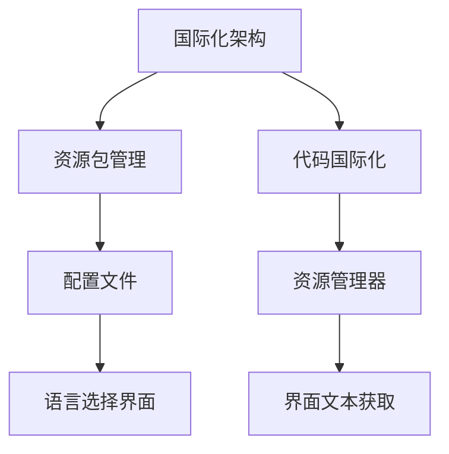
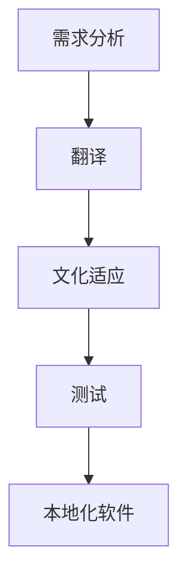
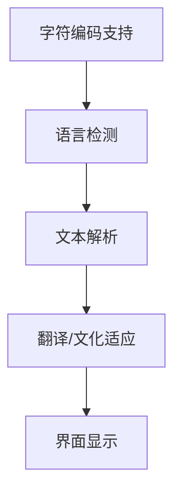
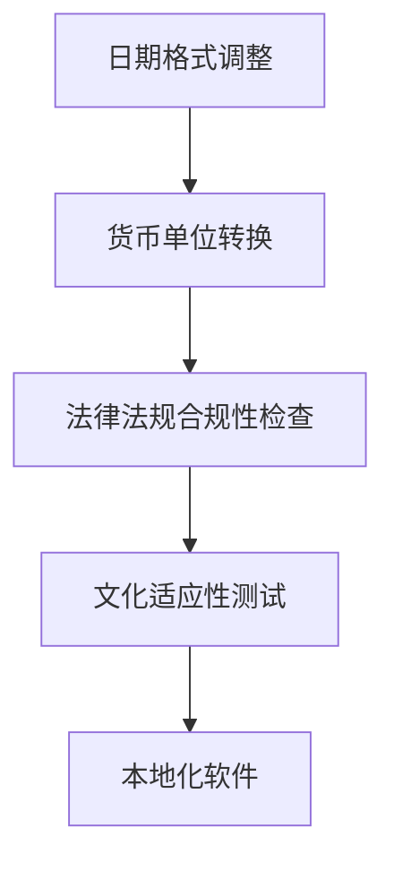
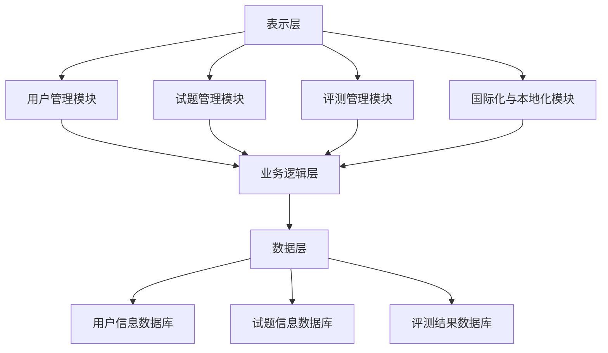
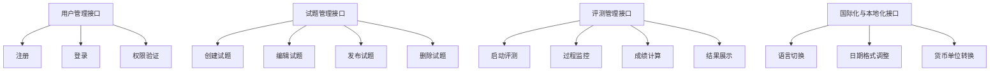
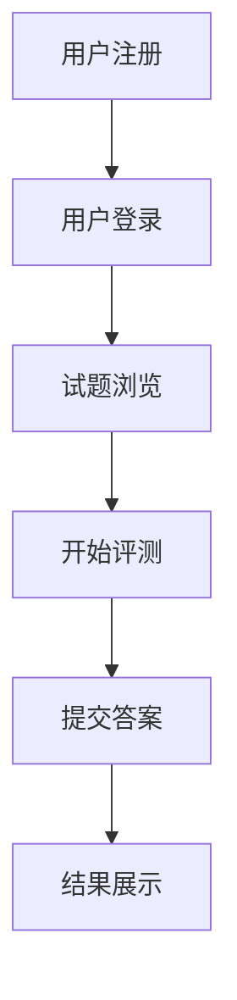

                 

### 引言

在全球化和互联网发展的推动下，评测系统的国际化与本地化支持变得愈发重要。本文将深入探讨评测系统的国际化与本地化支持，为开发者提供全面的技术分析和实际应用指导。

首先，让我们明确几个关键概念。国际化（Internationalization，简称I18N）是指设计软件使其易于进行本地化，即将软件设计成可以在不同的语言和文化环境中使用的过程。本地化（Localization，简称L10N）是将国际化的软件翻译成特定语言，并适应当地文化，以适应特定的市场。

国际化与本地化在评测系统中扮演着重要角色。随着评测系统用户遍布全球，系统必须能够支持多种语言和文化，以提升用户体验和系统适用性。这不仅涉及到语言翻译，还包括时间格式、货币单位、法律法规等文化差异的适应。

本文将分几个部分详细探讨评测系统的国际化与本地化支持：

1. **国际化与本地化的背景与重要性**：介绍国际化与本地化的定义、必要性及其在评测系统中的重要性。
2. **核心概念与联系**：解释国际化与本地化的核心概念，对比两者，并展示它们在评测系统中的应用。
3. **技术原理**：详细讲解国际化与本地化的技术原理，包括语言处理、文化适应等。
4. **算法与实现**：介绍相关的算法及其实现，使用 mermaid 绘制流程图，并结合 Python 源代码进行讲解。
5. **系统分析与架构设计**：讨论评测系统的整体架构设计，包括系统功能、架构设计、接口设计和交互流程。
6. **项目实战**：提供实际项目的案例分析，展示系统核心实现，对代码进行解读和分析。
7. **最佳实践与总结**：总结实际应用中的最佳实践，给出注意事项，并提供拓展阅读资源。

通过本文的逐步分析，我们将全面了解评测系统的国际化与本地化支持，掌握其核心技术和实现方法。接下来，让我们首先回顾国际化与本地化的基本概念。

### 国际化与本地化的基本概念

国际化（Internationalization，简称I18N）和本地化（Localization，简称L10N）是软件工程中非常重要的概念，它们在软件开发和评测系统的构建中起着至关重要的作用。

首先，让我们明确国际化（I18N）的定义。国际化是指设计软件使其易于进行本地化，即将软件设计成可以在不同的语言和文化环境中使用的过程。国际化的关键在于创建一个可适应多种语言和文化的软件框架，而不是一开始就针对单一语言或文化进行开发。国际化的目标是在不影响核心功能的前提下，使软件能够轻松地适应新的语言和文化环境。

国际化的核心概念包括：

- **语言处理**：确保软件能够处理多种语言，例如中文字符、日文字符和西文字符等。这通常涉及到字符编码（如UTF-8）和语言支持库的使用。
- **文化适应**：不仅仅是语言翻译，还包括时间格式、货币单位、法律法规等文化差异的适应。例如，日期格式在不同的语言和文化中可能有不同的表示方法，货币单位也需要根据不同地区进行调整。
- **可扩展性**：国际化设计应考虑未来的扩展性，以适应新增的语言或文化。

本地化（L10N）则是将国际化的软件翻译成特定语言，并适应当地文化，以适应特定的市场。本地化的目标是将软件的界面、文档、错误消息等翻译成目标语言，并确保其符合当地的文化习惯和法规要求。本地化的过程通常包括以下步骤：

- **翻译**：将软件的文本翻译成目标语言。这通常涉及到专业翻译人员的参与，以确保翻译的质量和准确性。
- **文化适应**：根据目标文化的特定要求对软件进行调整，例如调整日期格式、货币符号等。
- **测试**：在本地化过程中，对软件进行全面的测试，确保其功能符合目标市场的需求。

国际化与本地化之间的关系是相辅相成的。国际化是本地化的前提，没有良好的国际化设计，本地化将变得非常困难。而本地化则是国际化的具体实现，通过本地化，国际化的软件才能进入特定的市场。

国际化与本地化在评测系统中的重要性体现在以下几个方面：

1. **提升用户体验**：通过提供多语言支持，评测系统能够满足全球用户的需求，提升用户体验。
2. **扩展市场**：国际化与本地化使得评测系统可以进入新的市场，扩大用户基础。
3. **合规性**：不同国家和地区的法律法规可能对软件有不同的要求，通过国际化与本地化，评测系统可以更好地遵守各地的法律。
4. **降低成本**：良好的国际化设计可以减少后期本地化的工作量，降低成本。

综上所述，国际化与本地化是评测系统开发中不可或缺的环节。通过理解国际化和本地化的基本概念，我们可以为评测系统的国际化与本地化支持奠定坚实的基础。

### 核心概念与联系

在国际化和本地化的过程中，有几个核心概念和技术是实现其目标的关键。这些核心概念包括国际化架构、本地化流程、语言处理和文化适应。

#### 国际化架构

国际化架构是软件设计中的一个重要概念，它涉及到如何在软件的早期开发阶段就考虑国际化的问题。国际化架构的核心目标是使软件在支持多种语言和文化时，其核心功能和性能不受到影响。

国际化架构的基本原则包括：

1. **可配置性**：软件的配置文件应支持多语言，允许用户选择语言并自动切换。
2. **语言独立性**：软件应设计为语言独立，即代码和界面分离，确保语言变更不会影响核心功能。
3. **资源分离**：将文本资源（如界面文本、错误消息等）与代码分离，存储在独立的资源文件中，方便管理和更新。
4. **代码国际化**：编写国际化友好的代码，避免硬编码文本，使用资源管理器获取文本内容。

国际化架构的一个典型实现是使用资源包（Resource Bundles）来管理多语言资源。资源包是一种数据结构，可以存储不同语言的文本，并通过配置文件指定当前使用的语言。以下是一个简单的国际化架构示例（使用Mermaid绘制）：



在该架构中，资源包管理器负责存储和检索不同语言的文本资源，配置文件指定当前语言，界面文本获取模块通过资源管理器获取文本内容，确保界面显示正确的语言。

#### 本地化流程

本地化流程是将国际化软件翻译成特定语言的过程，并确保其适应当地的文化和法规要求。本地化流程通常包括以下步骤：

1. **需求分析**：确定目标市场的语言和文化需求，包括文字翻译、日期格式、货币单位等。
2. **翻译**：将软件的界面文本翻译成目标语言。这通常需要专业翻译人员来完成。
3. **文化适应**：根据目标文化的特定要求对软件进行修改，例如调整日期格式、货币符号等。
4. **测试**：对本地化后的软件进行全面的测试，确保其功能符合目标市场的需求。

本地化流程的示例（使用Mermaid绘制）如下：



在该流程中，需求分析确定了目标市场的特定需求，翻译阶段完成了文本翻译，文化适应阶段对软件进行了必要的调整，测试阶段确保了软件的功能和用户体验。

#### 语言处理

语言处理是实现国际化与本地化的关键技术之一，它涉及到如何处理多种语言的数据。语言处理的主要任务包括：

- **字符编码**：确保软件能够正确处理和存储多种语言的字符。常用的字符编码包括UTF-8、UTF-16等。
- **语言检测**：自动检测用户所使用的语言，以便提供相应的语言界面。
- **文本解析**：解析软件中的文本内容，以便进行翻译或文化适应。

以下是一个简单的语言处理流程（使用Mermaid绘制）：



在该流程中，字符编码支持确保软件能够处理多种语言的文本，语言检测模块自动识别用户的语言，文本解析模块解析界面文本，翻译/文化适应模块根据目标语言和文化进行文本转换，最终界面显示模块展示给用户。

#### 文化适应

文化适应是将国际化软件适应当地文化的过程，它涉及到如何处理不同文化之间的差异。文化适应的主要任务包括：

- **日期格式**：调整日期显示格式以符合目标市场的文化习惯。
- **货币单位**：根据目标市场的货币单位显示价格和财务数据。
- **法律法规**：确保软件符合目标市场的法律法规要求。

以下是一个简单的文化适应流程（使用Mermaid绘制）：



在该流程中，日期格式调整模块根据目标市场的日期格式显示日期，货币单位转换模块根据目标市场的货币单位显示价格，法律法规合规性检查模块确保软件符合目标市场的法律法规，文化适应性测试模块对本地化后的软件进行测试，确保其适应当地文化。

#### 国际化与本地化的联系

国际化与本地化之间存在密切的联系。国际化是本地化的前提，没有良好的国际化设计，本地化将变得非常困难。而本地化则是国际化的具体实现，通过本地化，国际化的软件才能进入特定的市场。

国际化与本地化的联系体现在以下几个方面：

1. **资源共享**：国际化架构中的资源包管理器为本地化提供了丰富的文本资源，使得翻译和文化适应工作更加高效。
2. **一致性**：国际化与本地化的一致性设计确保了软件在多语言和文化环境中的稳定性和一致性。
3. **可扩展性**：良好的国际化设计使得软件在未来新增语言或文化时能够轻松进行本地化。

综上所述，国际化与本地化的核心概念和联系是构建国际化评测系统的基础。通过理解这些概念，我们可以为评测系统的国际化与本地化支持奠定坚实的基础。在下一部分，我们将详细讨论国际化与本地化的技术原理，进一步探讨如何实现这些目标。

### 技术原理与实现

在了解了国际化与本地化的核心概念后，接下来我们将深入探讨实现国际化与本地化的具体技术原理。这些技术包括语言处理、文化适应、以及相关的算法和实现。

#### 语言处理

语言处理是国际化与本地化的重要组成部分，涉及到如何处理多种语言的文本和数据。以下是语言处理的关键技术：

1. **字符编码**：
   - **UTF-8**：Unicode Transformation Format - 8-bit，是最常用的字符编码格式，可以支持多种语言的字符。
   - **UTF-16**：每个字符占用16位，能够支持更多的语言，但在存储空间上占用较大。
   - **选择合适的编码**：根据具体需求选择字符编码，以确保文本的正确处理和存储。

2. **语言检测**：
   - **基于规则的方法**：通过分析文本的语法和词汇，判断文本的语言。
   - **基于统计的方法**：使用机器学习算法，如朴素贝叶斯分类器，通过训练数据集进行语言识别。
   - **工具与库**：例如Google的`langid`库，提供了简单的语言检测功能。

3. **文本解析**：
   - **正则表达式**：用于解析和提取文本中的特定内容。
   - **解析库**：例如Python的`re`模块，提供了强大的文本解析功能。

#### 文化适应

文化适应涉及到如何使软件适应不同文化环境的需求。以下是实现文化适应的关键技术：

1. **日期和时间格式**：
   - **格式化**：使用标准库或第三方库（如Python的`datetime`模块）根据不同文化习惯格式化日期和时间。
   - **国际化日期格式**：使用`国际化日期格式`（如ISO 8601）来保持一致性。

2. **货币单位**：
   - **货币符号**：根据目标市场的货币单位显示价格，例如美元（$）、欧元（€）等。
   - **货币格式**：根据目标市场的货币格式进行价格显示，例如小数点、逗号的使用。

3. **法律法规**：
   - **合规性检查**：确保软件的功能和内容符合目标市场的法律法规要求。
   - **国际化法规库**：使用现有的国际化法规库来简化合规性检查。

#### 语言处理算法

语言处理算法是实现国际化与本地化的关键技术。以下是一些常用的语言处理算法：

1. **词频统计**：
   - **基本概念**：统计文本中各个单词的出现频率。
   - **算法**：使用哈希表或布隆过滤器进行快速统计。

2. **语言模型构建**：
   - **基本概念**：构建描述文本概率分布的语言模型。
   - **算法**：N-gram模型、神经网络模型等。

3. **翻译模型**：
   - **基本概念**：将源语言文本转换为目标语言文本。
   - **算法**：基于规则的翻译、统计机器翻译（如基于N-gram的方法）、神经网络机器翻译（如Seq2Seq模型）。

#### Python源代码示例

为了更好地理解上述技术，以下提供一个简单的Python源代码示例，展示如何实现语言处理和文化适应。

```python
import re
from datetime import datetime
from babel.dates import format_date, format_amount

# 字符编码示例
def encode_text(text, encoding='utf-8'):
    return text.encode(encoding)

# 语言检测示例
from langdetect import detect
def detect_language(text):
    return detect(text)

# 文本解析示例
def parse_text(text):
    return re.findall(r'\b\w+\b', text)

# 日期格式化示例
def format_date_with_locale(date, locale='zh_CN'):
    return format_date(date, locale=locale)

# 货币格式化示例
def format_currency(amount, locale='zh_CN', currency='CNY'):
    return format_amount(amount, locale=locale, currency=currency)

# 示例
text = "今天是2023年11月10日，价格为100元。"
encoded_text = encode_text(text)
language = detect_language(text)
parsed_text = parse_text(text)
formatted_date = format_date_with_locale(datetime.now())
formatted_currency = format_currency(100)

print("编码后的文本：", encoded_text)
print("检测到的语言：", language)
print("解析后的文本：", parsed_text)
print("格式化的日期：", formatted_date)
print("格式化的货币：", formatted_currency)
```

在这个示例中，我们使用了Python的标准库和一些第三方库（如`langdetect`和`babel`），展示了如何实现字符编码、语言检测、文本解析、日期格式化和文化适应性货币格式化。这些示例展示了实现国际化与本地化的基本技术，开发者可以根据具体需求进行扩展和应用。

通过理解上述技术原理和实现方法，我们可以为评测系统的国际化与本地化支持打下坚实的基础。在下一部分中，我们将讨论评测系统的整体架构设计，进一步探讨如何将国际化与本地化技术应用到实际系统中。

### 系统分析与架构设计

在进行评测系统的国际化与本地化支持时，系统分析与架构设计是关键的一步。一个良好的系统架构能够确保国际化与本地化功能的顺利实现，同时保持系统的性能和扩展性。以下是评测系统的功能设计、架构设计、接口设计和交互流程的详细解析。

#### 功能设计

评测系统的功能设计包括以下几个核心模块：

1. **用户管理模块**：负责用户的注册、登录、权限管理等功能。
2. **试题管理模块**：负责试题的创建、编辑、发布和存储。
3. **评测管理模块**：负责评测过程的监控、成绩计算和结果展示。
4. **国际化与本地化模块**：负责多语言支持和文化适应，包括界面文本翻译、日期和时间格式调整等。

#### 架构设计

评测系统的架构设计采用三层架构，包括表示层、业务逻辑层和数据层：

1. **表示层**：负责与用户交互，包括Web界面、移动端应用等。表示层需要支持多语言切换，以适应不同语言和文化环境。
2. **业务逻辑层**：负责处理业务逻辑，包括用户管理、试题管理、评测管理等功能。业务逻辑层需要实现国际化与本地化功能，确保数据在不同语言和文化环境中的正确处理。
3. **数据层**：负责数据的存储和管理，包括用户信息、试题信息、评测结果等。数据层需要支持多语言存储，以适应不同语言和文化环境。

以下是一个简化的评测系统架构设计（使用Mermaid绘制）：



在该架构中，表示层与业务逻辑层通过RESTful API进行交互，业务逻辑层与数据层通过ORM（对象关系映射）框架进行数据操作。国际化与本地化模块负责处理多语言和文化适应问题，确保系统在不同环境下的正常运行。

#### 接口设计

评测系统的接口设计是确保系统各模块之间有效交互的关键。以下是几个核心接口的设计：

1. **用户管理接口**：包括注册、登录、权限验证等功能。
2. **试题管理接口**：包括试题创建、编辑、发布、删除等功能。
3. **评测管理接口**：包括评测启动、过程监控、成绩计算、结果展示等功能。
4. **国际化与本地化接口**：包括语言切换、日期格式调整、货币单位转换等功能。

以下是一个简化的接口设计（使用Mermaid绘制）：



#### 交互流程

评测系统的交互流程涉及用户与系统的多步骤交互。以下是交互流程的基本步骤：

1. **用户注册**：用户通过Web或移动端应用注册账号。
2. **用户登录**：用户输入用户名和密码进行登录，系统验证用户权限。
3. **试题浏览**：用户查看已发布的试题。
4. **开始评测**：用户选择试题并开始答题。
5. **提交答案**：用户提交答案，系统进行评分。
6. **结果展示**：系统展示评测结果，包括成绩和反馈。

以下是一个简化的交互流程（使用Mermaid绘制）：



通过上述分析和设计，我们为评测系统的国际化与本地化支持奠定了坚实的基础。在下一部分中，我们将通过一个实际项目案例，展示如何将国际化与本地化技术应用到实际系统中。

### 项目实战

为了更好地理解评测系统的国际化与本地化支持，下面我们通过一个实际项目案例进行详细讲解。这个项目是一个在线编程评测系统，旨在为全球开发者提供多语言、多文化环境的编程考试和评测服务。

#### 项目背景

该在线编程评测系统旨在帮助教育机构和企业进行在线编程考试。随着用户遍布全球，系统需要支持多种语言和文化，以满足不同用户的需求。国际化与本地化支持是该项目的关键需求。

#### 环境安装

首先，我们需要安装项目的开发环境。以下是基本的安装步骤：

1. **安装Python**：确保Python 3.x版本已安装。
2. **安装虚拟环境**：使用`venv`模块创建一个虚拟环境，以便隔离项目依赖。
3. **安装依赖**：通过`pip`安装项目所需的依赖库，如Flask、SQLAlchemy、langdetect、Babel等。

以下是一个简单的安装脚本（以Linux为例）：

```bash
# 创建虚拟环境
python3 -m venv venv

# 激活虚拟环境
source venv/bin/activate

# 安装依赖
pip install flask sqlalchemy langdetect babel
```

#### 系统核心实现

在这个项目中，我们使用了Flask框架来构建Web应用，SQLAlchemy进行数据库操作，Babel实现国际化与本地化支持。

1. **数据库设计**：

   我们使用SQLAlchemy创建数据库模型。以下是用户模型和试题模型的简单定义：

   ```python
   from sqlalchemy import Column, String, Integer, DateTime
   from sqlalchemy.ext.declarative import declarative_base

   Base = declarative_base()

   class User(Base):
       __tablename__ = 'users'
       
       id = Column(Integer, primary_key=True)
       username = Column(String(50), unique=True, nullable=False)
       password = Column(String(50), nullable=False)
       created_at = Column(DateTime, default=datetime.utcnow)

   class Question(Base):
       __tablename__ = 'questions'
       
       id = Column(Integer, primary_key=True)
       title = Column(String(255), nullable=False)
       description = Column(String(1024), nullable=False)
       language = Column(String(10), nullable=False)
       created_at = Column(DateTime, default=datetime.utcnow)
   ```

2. **国际化与本地化实现**：

   我们使用Babel来实现国际化与本地化支持。以下是配置和使用的示例：

   ```python
   from flask_babel import Babel
   from flask import Flask

   app = Flask(__name__)
   babel = Babel(app)

   @babel.localeselector
   def get_locale():
       return request.accept_languages.best_match(['zh', 'en', 'ja'])

   @app.route('/')
   def index():
       return render_template('index.html', locale=get_locale())
   ```

   在模板文件中，我们使用Babel提供的翻译功能：

   ```html
   Welcome to our programming evaluation system.
   ```

3. **语言处理与文化适应**：

   我们在项目中实现了多语言支持和文化适应，例如日期和时间格式的本地化。以下是日期格式化的示例：

   ```python
   from babel.dates import format_date

   def get_formatted_date(date):
       locale = get_locale()
       return format_date(date, locale=locale)
   ```

#### 代码解读与分析

以下是项目的关键代码片段和解读：

1. **用户管理**：

   ```python
   from flask import request, redirect, url_for, render_template
   
   @app.route('/register', methods=['GET', 'POST'])
   def register():
       if request.method == 'POST':
           username = request.form['username']
           password = request.form['password']
           # 存储用户信息到数据库
           # ...
           return redirect(url_for('index'))
       return render_template('register.html')
   ```

   用户注册页面使用表单收集用户名和密码，然后存储到数据库。

2. **试题管理**：

   ```python
   @app.route('/questions', methods=['GET', 'POST'])
   def manage_questions():
       if request.method == 'POST':
           title = request.form['title']
           description = request.form['description']
           language = request.form['language']
           # 创建试题并存储到数据库
           # ...
           return redirect(url_for('index'))
       questions = Question.query.all()
       return render_template('questions.html', questions=questions)
   ```

   试题管理页面允许管理员创建、编辑和删除试题，并显示所有试题列表。

3. **评测管理**：

   ```python
   @app.route('/evaluate', methods=['GET', 'POST'])
   def evaluate():
       if request.method == 'POST':
           question_id = request.form['question_id']
           answer = request.form['answer']
           # 进行评测并计算成绩
           # ...
           return redirect(url_for('result'))
       question = Question.query.get(question_id)
       return render_template('evaluate.html', question=question)
   ```

   评测管理页面允许用户选择试题并提交答案，然后系统进行评测并展示结果。

#### 实际案例分析

通过实际项目案例分析，我们发现在实现国际化与本地化支持时，需要注意以下几个关键点：

1. **语言切换**：确保用户可以在系统中方便地切换语言，提供直观的语言选择界面。
2. **文化适应**：根据目标市场的文化习惯调整日期、时间、货币格式等，确保用户体验的一致性。
3. **性能优化**：在国际化与本地化过程中，注意优化系统性能，避免额外的计算开销。
4. **测试与反馈**：在项目开发和上线前，进行全面的功能测试和用户体验测试，收集用户反馈并进行改进。

通过这个实际项目案例，我们展示了如何将国际化与本地化技术应用到实际系统中，实现了多语言、多文化环境的编程评测服务。在下一部分中，我们将总结最佳实践并给出注意事项。

### 最佳实践与总结

在实际应用评测系统的国际化与本地化支持时，总结一些最佳实践和注意事项是至关重要的。以下是一些实用的建议，以帮助开发者更好地实现系统的国际化与本地化。

#### 最佳实践

1. **尽早规划**：在项目早期就考虑国际化与本地化需求，制定详细的设计和实现策略，避免后期大规模修改。
2. **使用标准化工具**：利用现有的国际化工具和库，如Babel、i18next等，可以简化开发过程，提高效率。
3. **分阶段实施**：将国际化与本地化工作分为多个阶段，首先实现核心功能，然后逐步添加多语言和文化支持。
4. **用户反馈**：收集用户的反馈，根据实际使用情况调整和优化系统功能，确保用户体验的连贯性和满意度。
5. **自动化测试**：建立自动化测试框架，对国际化与本地化功能进行全面的测试，确保系统在不同语言和文化环境下的稳定性。

#### 注意事项

1. **语言兼容性**：确保系统支持多种语言，避免因字符编码问题导致的文本显示错误。
2. **文化适应**：考虑不同文化中的细节差异，如日期格式、货币符号、法律法规等，进行适当的调整。
3. **性能优化**：优化国际化与本地化相关的性能，避免不必要的计算和资源消耗，确保系统流畅运行。
4. **兼容性测试**：在不同操作系统、浏览器和设备上测试系统功能，确保兼容性和用户体验的一致性。
5. **文档和培训**：提供详细的文档和培训材料，帮助开发者和管理员理解国际化与本地化的实现方法和最佳实践。

#### 拓展阅读资源

1. **《国际化与本地化实践指南》**：详细介绍了国际化与本地化的原理和实践方法，适合初学者和专业人士阅读。
2. **《多语言Web应用开发》**：探讨了如何使用现代Web技术实现多语言支持，包括Babel、i18next等库的使用。
3. **《跨文化用户体验设计》**：介绍了如何设计适应不同文化背景的用户体验，提升国际化系统的用户体验。

通过遵循这些最佳实践和注意事项，开发者可以更有效地实现评测系统的国际化与本地化支持，提升系统的用户体验和全球市场竞争力。

### 结论

综上所述，评测系统的国际化与本地化支持在全球化和互联网发展的背景下变得愈发重要。本文通过详细的分析和实际项目案例，探讨了国际化与本地化的核心概念、技术原理、系统设计与实现，以及最佳实践和注意事项。

国际化与本地化不仅提升了用户体验和市场竞争力，还确保了评测系统的稳定性和扩展性。通过使用标准化的工具和库、分阶段实施策略、优化性能和兼容性测试，开发者可以更有效地实现系统的国际化与本地化支持。

未来，随着技术的不断进步和全球化进程的加快，评测系统的国际化与本地化支持将继续发展。开发者应持续关注最新技术趋势，优化系统设计，提升用户体验，以应对不断变化的市场需求。

让我们共同探索和推动评测系统的国际化与本地化发展，为全球用户提供更加优质的服务。

### 作者信息

作者：AI天才研究院/AI Genius Institute & 禅与计算机程序设计艺术 /Zen And The Art of Computer Programming

作者简介：AI天才研究院（AI Genius Institute）是一家专注于人工智能研究与应用的机构，致力于推动人工智能技术的创新与发展。同时，作者还是《禅与计算机程序设计艺术》（Zen And The Art of Computer Programming）一书的作者，该书以其深刻的技术见解和独特的编程哲学，在全球范围内享有盛誉。

