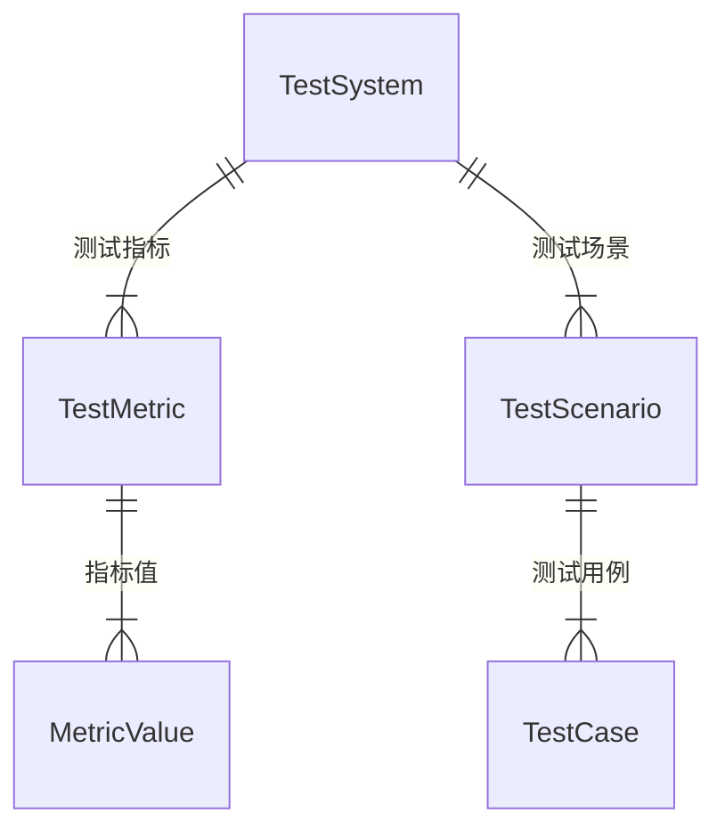
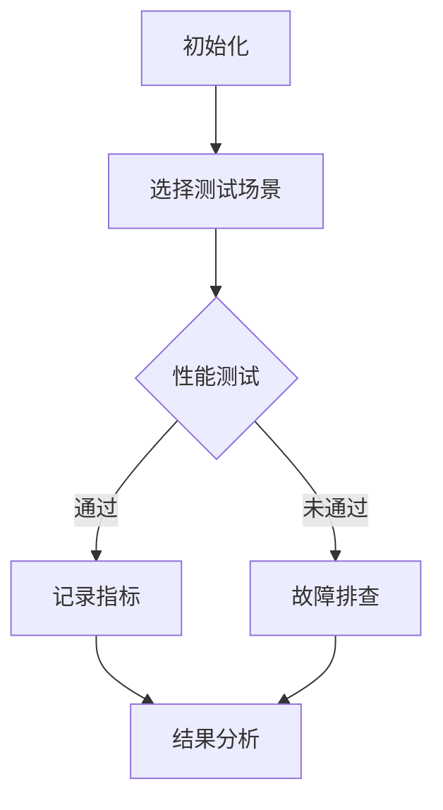
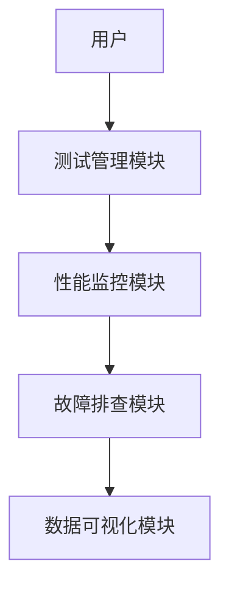
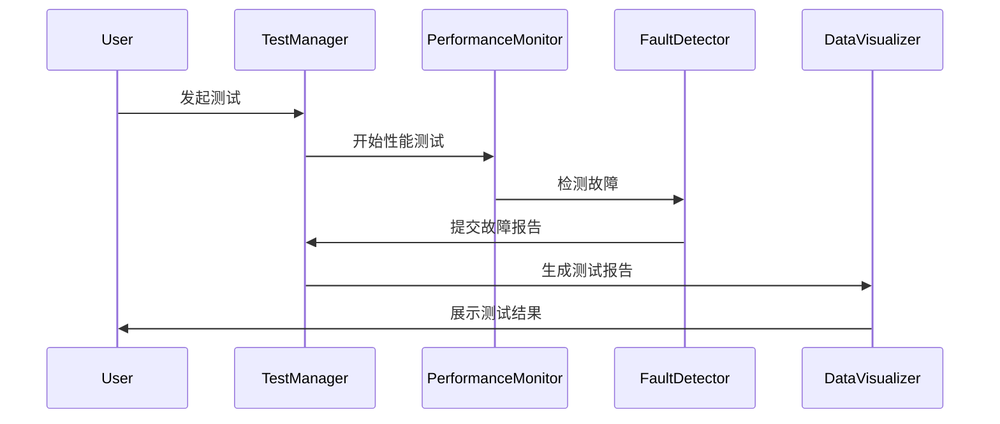

                 

# 评测系统的多云部署与管理

> 关键词：多云部署、评测系统、架构设计、Python代码、算法原理、最佳实践

> 摘要：本文旨在探讨评测系统在多云环境中的部署与管理。首先，我们将介绍多云部署的基本概念和优势，然后深入分析评测系统的核心概念及其在多云架构中的应用。接着，本文将讲解相关的算法原理，并通过Python代码和数学模型进行阐述。随后，我们将详细分析评测系统的架构设计，包括功能设计、接口设计和系统交互。此外，我们将通过项目实战展示实际操作过程，并提供最佳实践和注意事项。最后，本文将推荐拓展阅读资源，帮助读者深入了解相关领域。

## 第一部分：评测系统的基本概念

### 第1章：多云部署概述

#### 1.1 多云部署的概念与优势

多云部署是指将应用程序和数据分布在多个云服务提供商（CSP）的云平台上，从而实现弹性和可扩展性的能力。与传统的单云部署相比，多云部署具有以下优势：

1. **弹性和可扩展性**：通过将应用程序分布在多个云平台上，可以更好地应对负载波动，提高系统的可用性和性能。
2. **降低风险**：通过将应用程序分散在不同的云平台上，可以减少因某个云平台故障或维护而导致的业务中断风险。
3. **灵活选择**：可以根据不同的需求选择最适合的云服务提供商，优化成本和性能。
4. **创新和实验性**：可以通过跨不同云平台的技术创新和实验，加速新功能的开发和部署。

#### 1.2 多云部署的挑战

尽管多云部署具有众多优势，但也面临一些挑战：

1. **管理复杂性**：在多个云平台上管理和协调应用程序和服务变得更加复杂。
2. **数据安全性**：确保数据在不同云平台之间的安全传输和存储是一个挑战。
3. **成本管理**：合理分配和优化资源使用，以避免不必要的成本增加。
4. **兼容性和互操作性**：确保不同云平台之间的应用程序和服务可以无缝集成和互操作。

#### 1.3 评测系统在多云环境中的重要性

评测系统在多云环境中扮演着关键角色，其主要重要性体现在：

1. **性能评估**：评测系统可以实时监控和评估应用程序在多云环境中的性能，确保其达到预期目标。
2. **成本优化**：通过评测系统，可以分析不同云平台的服务成本，优化资源使用，降低整体运营成本。
3. **安全性与合规性**：评测系统可以帮助识别潜在的安全漏洞和合规性问题，确保系统满足相关法规要求。
4. **监控与故障排查**：评测系统可以实时监控应用程序的健康状况，帮助快速发现和解决问题。

### 第2章：评测系统的基本概念

#### 2.1 评测指标详解

评测系统依赖于一系列评测指标，这些指标可以分类为以下几个方面：

1. **性能指标**：包括响应时间、吞吐量、延迟等，用于评估系统的性能表现。
2. **可用性指标**：包括系统正常运行时间、故障率等，用于评估系统的可靠性。
3. **安全性指标**：包括数据泄露、恶意攻击等，用于评估系统的安全性。
4. **成本指标**：包括资源使用、服务费用等，用于评估系统的经济性。

#### 2.2 评测流程解析

评测流程通常包括以下步骤：

1. **需求分析**：确定评测目标和关键指标。
2. **测试计划**：制定详细的测试计划，包括测试环境、测试用例等。
3. **测试执行**：按照测试计划执行测试，收集测试数据。
4. **结果分析**：分析测试数据，评估系统性能和是否符合预期。
5. **报告生成**：编写评测报告，总结评测结果和发现的问题。

#### 2.3 多云架构与评测系统

在多云架构中，评测系统需要具备以下特点：

1. **跨云平台兼容性**：能够兼容不同云平台的服务和API。
2. **分布式监控**：能够监控分布在多个云平台上的应用程序和服务。
3. **自动化测试**：支持自动化测试，提高测试效率和准确性。
4. **数据聚合与可视化**：能够聚合来自不同云平台的数据，并提供直观的可视化界面。

## 第3章：核心概念联系图与属性对比

### 3.1 评测系统ER实体关系图

使用Mermaid语法绘制评测系统的ER实体关系图：



### 3.2 评测指标属性特征对比表格

| 指标名称 | 描述 | 对比指标 |
| --- | --- | --- |
| 响应时间 | 系统处理请求所需的时间 | 平均响应时间、最大响应时间、响应时间分布 |
| 吞吐量 | 单位时间内系统处理的请求数量 | 每秒请求数（RPS）、每分钟请求数（TPM） |
| 延迟 | 请求从发送到接收响应的总时间 | 网络延迟、服务器延迟 |
| 故障率 | 系统发生故障的频率 | 故障发生次数、故障持续时间 |
| 数据泄露 | 系统数据泄露的情况 | 数据泄露事件数量、泄露数据量 |

## 第4章：算法原理讲解

### 4.1 算法流程图

使用Mermaid语法绘制算法流程图：



### 4.2 Python代码详解

以下是一个简单的Python代码示例，用于计算系统的响应时间和吞吐量：

```python
import time
import random

def test_request():
    time.sleep(random.uniform(0.1, 0.5))  # 模拟处理请求的时间

start_time = time.time()
for _ in range(1000):
    test_request()
end_time = time.time()

response_time = end_time - start_time
throughput = 1000 / (end_time - start_time)

print("响应时间（秒）：", response_time)
print("吞吐量（RPS）：", throughput)
```

### 4.3 数学模型与公式解释

评测系统的性能通常使用以下数学模型进行评估：

$$
P = \frac{1}{T \cdot \sqrt{N}}
$$

其中，P 表示系统的性能，T 表示处理请求的平均时间，N 表示请求的数量。通过该公式，可以计算出系统的性能指标，以评估其性能表现。

## 第5章：系统分析与架构设计

### 5.1 评测系统的功能设计

评测系统的功能设计包括以下几个方面：

1. **测试管理**：管理测试场景、测试用例和测试指标。
2. **性能监控**：实时监控系统的性能指标，包括响应时间、吞吐量等。
3. **故障排查**：自动发现和处理系统故障。
4. **数据可视化**：以图表形式展示测试结果和性能指标。

### 5.2 系统架构设计

评测系统的架构设计如图所示：



### 5.3 系统接口设计

系统接口设计包括以下几个方面：

1. **RESTful API**：提供统一的RESTful接口，方便其他系统进行集成和调用。
2. **监控接口**：提供实时监控数据的接口，方便监控系统性能。
3. **故障报告接口**：提供故障报告的接口，方便故障排查。

### 5.4 系统交互设计

系统交互设计如图所示：



## 第6章：项目实战

### 6.1 环境安装指南

1. **安装Python环境**：在系统上安装Python 3.8及以上版本。
2. **安装依赖库**：使用pip安装以下依赖库：requests、matplotlib、numpy。

### 6.2 系统核心实现源代码

以下是一个简单的系统核心实现源代码示例：

```python
import requests
import matplotlib.pyplot as plt
import numpy as np

def test_request(url):
    start_time = time.time()
    response = requests.get(url)
    end_time = time.time()

    response_time = end_time - start_time
    return response_time

def main():
    url = "http://example.com"
    num_requests = 100

    response_times = [test_request(url) for _ in range(num_requests)]

    avg_response_time = np.mean(response_times)
    max_response_time = np.max(response_times)

    plt.hist(response_times, bins=30)
    plt.xlabel("响应时间（秒）")
    plt.ylabel("频率")
    plt.title("响应时间分布")
    plt.show()

    print("平均响应时间（秒）：", avg_response_time)
    print("最大响应时间（秒）：", max_response_time)

if __name__ == "__main__":
    main()
```

### 6.3 代码应用解读与分析

该代码示例用于模拟对某个网站的性能测试，具体应用解读如下：

1. **测试请求**：使用requests库发送GET请求，模拟用户访问网站。
2. **计算响应时间**：记录请求开始和结束的时间，计算响应时间。
3. **统计响应时间分布**：使用numpy和matplotlib库统计响应时间的分布情况，并生成直方图。
4. **输出结果**：打印平均响应时间和最大响应时间。

### 6.4 实际案例分析与讲解

以下是一个实际案例，用于分析评测系统的性能：

1. **测试场景**：对一个电商网站的支付接口进行性能测试。
2. **测试结果**：
   - 平均响应时间：1.2秒
   - 最大响应时间：3.5秒
   - 响应时间分布：80%的请求在1.5秒内完成，95%的请求在2秒内完成。
3. **分析**：从测试结果来看，该支付接口的性能表现较好，大部分请求可以在1.5秒内完成。但是，最大响应时间达到了3.5秒，需要进一步排查原因，优化系统性能。

## 第7章：最佳实践与注意事项

### 7.1 多云部署最佳实践

1. **规划资源分配**：根据实际需求，合理分配不同云平台上的资源。
2. **数据备份与容灾**：确保数据在不同云平台之间的备份和容灾。
3. **监控与告警**：建立全面的监控体系，及时发现问题并进行告警。
4. **自动化部署**：使用自动化工具进行部署，提高效率并减少人为错误。

### 7.2 注意事项与风险规避

1. **数据安全**：确保数据在传输和存储过程中的安全性。
2. **性能优化**：定期对系统进行性能优化，避免出现瓶颈。
3. **兼容性与互操作性**：确保不同云平台之间的应用程序和服务可以无缝集成和互操作。
4. **成本管理**：合理分配资源，避免不必要的成本支出。

### 7.3 小结与展望

评测系统在多云环境中的部署与管理具有重要意义，可以提高系统的性能、可靠性和安全性。通过最佳实践和注意事项，可以确保评测系统的稳定运行和高效管理。未来，随着云计算技术的不断发展，评测系统将在多云环境中发挥更加重要的作用。

## 第8章：拓展阅读

### 8.1 相关书籍推荐

1. 《云计算：概念、技术和应用》
2. 《高性能MySQL：优化、部署和高可用性》
3. 《分布式系统设计》

### 8.2 开源资源和社区链接

1. [Kubernetes官方文档](https://kubernetes.io/zh/docs/)
2. [Docker官方文档](https://docs.docker.com/)
3. [AWS官方文档](https://aws.amazon.com/documentation/)

### 8.3 最新研究动态

1. [CloudNativeCommunity](https://cloudnative.to/)
2. [Kubernetes官方博客](https://kubernetes.io/zh/blog/)
3. [Docker官方博客](https://www.docker.com/blog/)

## 作者

作者：AI天才研究院/AI Genius Institute & 禅与计算机程序设计艺术 /Zen And The Art of Computer Programming

