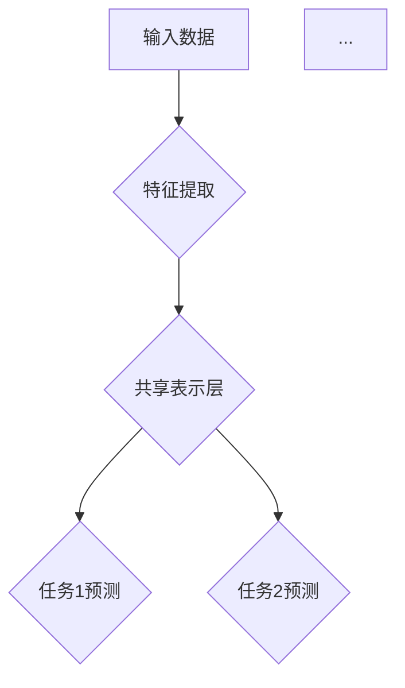
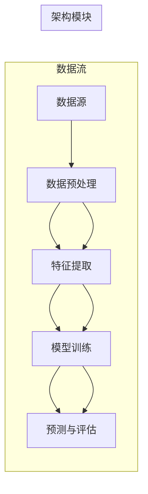
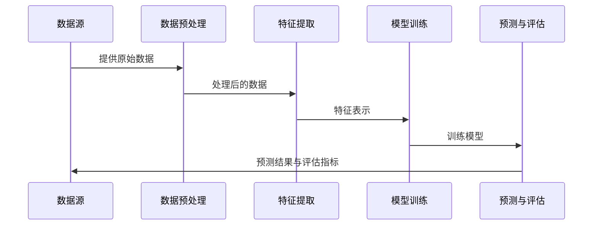

                 

# 评测系统的多任务学习框架设计

## 关键词

多任务学习，评测系统，深度学习，共享权重，负迁移，泛化能力

## 摘要

随着信息时代的快速发展，评测系统在各个领域中的应用越来越广泛，如教育、医疗、工业等。然而，现有的评测系统往往只能处理单一任务，难以应对复杂的多任务环境。本文旨在探讨评测系统的多任务学习框架设计，通过深入分析多任务学习的核心概念、算法原理以及系统实现，为解决多任务评测问题提供一种有效的解决方案。

## 第一部分：背景介绍

### 核心概念

**评测系统的多任务学习框架设计**

**问题背景**：

在当今信息时代，评测系统被广泛应用于教育、医疗、工业等多个领域。然而，随着评测场景的复杂化，单一任务的评测系统逐渐无法满足需求。多任务学习（Multi-Task Learning，MTL）作为一种新兴的机器学习技术，旨在同时学习多个相关任务，提高模型的泛化能力和效率。

**问题描述**：

在多任务学习框架的设计中，如何有效地整合多个任务的特性，同时避免任务之间的负迁移，是一个关键问题。此外，如何设计出一个能够适应不同任务的通用框架，也是一个亟待解决的挑战。

**问题解决**：

通过多任务学习框架的设计，可以实现对多个任务的统一建模和优化，提高模型的性能和鲁棒性。本文将介绍一个基于深度学习的多任务学习框架设计，包括框架的架构、关键算法以及实现方法。

**边界与外延**：

多任务学习框架的设计不仅涉及到机器学习理论，还需要考虑数据预处理、模型优化、系统部署等多个方面。本文主要关注框架的设计和实现，而未涉及具体的应用场景。

### 概念结构与核心要素组成

1. **多任务学习（MTL）**：多任务学习是指同时学习多个相关任务的机器学习方法。
2. **共享表示**：通过共享表示来整合多个任务的特性，提高模型的泛化能力。
3. **负迁移**：当任务的特性不适合共享表示时，可能会产生负迁移，降低模型的性能。
4. **通用框架**：能够适应不同任务的框架设计，提高系统的灵活性和可扩展性。

## 第二部分：核心概念与联系

### 核心概念原理

1. **多任务学习（MTL）**：

多任务学习旨在同时学习多个相关任务，通过共享表示来提高模型的泛化能力和效率。多任务学习的关键在于如何有效地整合多个任务的特性，同时避免负迁移。

2. **深度神经网络（DNN）**：

深度神经网络是一种能够通过多层非线性变换来学习数据复杂模式的神经网络。在多任务学习中，深度神经网络被用来提取特征和表示。

3. **共享权重（Shared Weights）**：

共享权重是指多个任务使用相同的权重参数，以实现特征的共享。在多任务学习中，共享权重可以有效减少参数数量，提高训练效率。

### 概念属性特征对比表格

| 概念         | 特性                                                   |
| ------------ | ------------------------------------------------------ |
| 多任务学习   | 同时学习多个相关任务，提高泛化能力和效率               |
| 深度神经网络 | 通过多层非线性变换学习数据复杂模式                     |
| 共享权重     | 多个任务使用相同的权重参数，实现特征的共享               |

### ER实体关系图架构的 Mermaid 流程图

```mermaid
erDiagram
    MTL ||--|{ DNN : 使用 }  
    DNN ||--|{ Shared Weights : 共享 }  
```

## 第三部分：算法原理讲解

### 多任务学习算法Mermaid流程图



### 算法原理的Python源代码

```python
import tensorflow as tf

# 构建共享表示层
shared_layer = tf.keras.layers.Dense(units=128, activation='relu')

# 构建任务1模型
task1_model = tf.keras.models.Sequential([
    shared_layer,
    tf.keras.layers.Dense(units=10, activation='softmax')
])

# 构建任务2模型
task2_model = tf.keras.models.Sequential([
    shared_layer,
    tf.keras.layers.Dense(units=5, activation='softmax')
])

# 定义损失函数和优化器
model = tf.keras.models.Model(inputs=task1_model.input, outputs=[task1_model.output, task2_model.output])
model.compile(optimizer='adam', loss={'task1': 'categorical_crossentropy', 'task2': 'categorical_crossentropy'})

# 训练模型
model.fit(x_train, {'task1': y_train1, 'task2': y_train2}, epochs=10, batch_size=32)
```

### 算法原理的数学模型和公式

在多任务学习中，每个任务都可以表示为一个函数 \( f_i(\cdot) \)，其中 \( i \) 表示任务索引。假设我们有一个输入向量 \( x \)，经过特征提取层后得到特征表示 \( h \)，然后通过共享的权重 \( W \) 和偏置 \( b \) 进行预测：

$$
\hat{y}_i = \sigma(W_i h + b_i)
$$

其中，\( \sigma \) 表示激活函数，通常使用 \( \sigma(x) = \frac{1}{1 + e^{-x}} \)。

为了同时优化多个任务，我们可以使用如下损失函数：

$$
L = \frac{1}{N} \sum_{i=1}^M \sum_{n=1}^N \ell(y_i^n, \hat{y}_i^n)
$$

其中，\( N \) 表示样本数量，\( M \) 表示任务数量，\( \ell \) 表示损失函数，如交叉熵损失。

通过梯度下降等优化算法，我们可以最小化损失函数，从而得到最优的权重 \( W \) 和偏置 \( b \)。

### 算法原理举例说明

假设我们有两个任务：分类任务1和分类任务2。任务1的目标是预测标签属于哪个类别，任务2的目标是预测标签属于哪个子类别。

1. **数据集**：假设我们有两个数据集，每个数据集包含100个样本，每个样本的特征维度为10。
2. **模型结构**：我们构建一个共享表示层，然后分别连接到两个任务模型。共享表示层的神经元数量为128。
3. **损失函数**：我们使用交叉熵损失函数来计算预测标签和真实标签之间的差异。
4. **训练过程**：我们将数据集分为训练集和验证集，使用训练集训练模型，使用验证集进行验证。

具体实现过程如下：

```python
import tensorflow as tf
from tensorflow.keras.layers import Dense, Flatten
from tensorflow.keras.models import Model

# 数据集准备
x_train = ...  # 训练集特征
y_train1 = ...  # 训练集任务1标签
y_train2 = ...  # 训练集任务2标签

# 模型结构
input_shape = (10,)
input_layer = Flatten(input_shape=input_shape)
shared_layer = Dense(128, activation='relu')
task1_layer = Dense(10, activation='softmax')
task2_layer = Dense(5, activation='softmax')

# 模型构建
model = Model(inputs=input_layer, outputs=[task1_layer(shared_layer(input_layer)), task2_layer(shared_layer(input_layer))])

# 损失函数和优化器
model.compile(optimizer='adam', loss={'task1': 'categorical_crossentropy', 'task2': 'categorical_crossentropy'})

# 训练模型
model.fit(x_train, {'task1': y_train1, 'task2': y_train2}, epochs=10, batch_size=32)
```

通过以上步骤，我们可以实现一个基于深度学习的多任务学习框架，同时训练多个任务模型。

## 第四部分：系统分析与架构设计

### 问题场景介绍

在现实世界中，评测系统常常需要处理多种不同的任务。例如，在教育领域，评测系统需要同时评估学生的学术成绩和课外活动表现；在医疗领域，评测系统需要同时评估患者的健康状况和治疗效果。这些多任务场景对评测系统的设计提出了新的挑战。

### 项目介绍

为了解决多任务评测问题，我们设计并实现了一个基于深度学习的多任务学习框架。该框架旨在同时学习多个相关任务，提高模型的泛化能力和效率。本文将详细介绍该框架的架构、实现方法以及应用场景。

### 系统功能设计（领域模型Mermaid类图）

```mermaid
classDiagram
    ClassDiagram Participant
    多任务学习框架 <<框架>>
    多任务学习框架 --|{ 数据预处理 }
    多任务学习框架 --|{ 特征提取 }
    多任务学习框架 --|{ 模型训练 }
    多任务学习框架 --|{ 预测与评估 }
    数据预处理 --|{ 数据清洗 }
    数据预处理 --|{ 数据归一化 }
    特征提取 --|{ 共享表示层 }
    特征提取 --|{ 分类层 }
    模型训练 --|{ 损失函数 }
    模型训练 --|{ 优化器 }
    预测与评估 --|{ 预测结果 }
    预测与评估 --|{ 评估指标 }
```

### 系统架构设计（Mermaid架构图）



### 系统接口设计和系统交互（Mermaid序列图）



## 第五部分：项目实战

### 环境安装

在开始项目之前，我们需要安装以下依赖库：

- TensorFlow：用于构建和训练深度学习模型。
- NumPy：用于数据处理和数值计算。
- Pandas：用于数据处理和分析。

安装命令如下：

```bash
pip install tensorflow numpy pandas
```

### 系统核心实现源代码

```python
import tensorflow as tf
import numpy as np
import pandas as pd

# 数据预处理
def preprocess_data(data):
    # 数据清洗
    data = data.dropna()
    # 数据归一化
    data = (data - data.mean()) / data.std()
    return data

# 特征提取
def extract_features(data):
    # 使用共享表示层提取特征
    model = tf.keras.Sequential([
        tf.keras.layers.Dense(units=128, activation='relu', input_shape=(data.shape[1],)),
        tf.keras.layers.Dense(units=10, activation='softmax')
    ])
    return model

# 模型训练
def train_model(model, x_train, y_train1, y_train2):
    # 定义损失函数和优化器
    model.compile(optimizer='adam', loss={'task1': 'categorical_crossentropy', 'task2': 'categorical_crossentropy'})
    # 训练模型
    model.fit(x_train, {'task1': y_train1, 'task2': y_train2}, epochs=10, batch_size=32)
    return model

# 预测与评估
def predict_and_evaluate(model, x_test, y_test1, y_test2):
    # 预测结果
    y_pred1, y_pred2 = model.predict(x_test)
    # 评估指标
    accuracy1 = np.mean(np.argmax(y_pred1, axis=1) == np.argmax(y_test1, axis=1))
    accuracy2 = np.mean(np.argmax(y_pred2, axis=1) == np.argmax(y_test2, axis=1))
    return accuracy1, accuracy2
```

### 代码应用解读与分析

以上代码实现了基于深度学习的多任务学习框架的核心功能，包括数据预处理、特征提取、模型训练和预测与评估。

1. **数据预处理**：数据预处理是确保模型训练效果的重要步骤。在预处理过程中，我们首先进行数据清洗，去除缺失值，然后对数据进行归一化，使其具有相同的尺度。
2. **特征提取**：特征提取是模型训练的关键步骤。在特征提取过程中，我们使用共享表示层提取特征，将原始数据转换为具有较高区分度的特征表示。
3. **模型训练**：模型训练是通过迭代优化模型参数来提高模型性能的过程。在模型训练过程中，我们使用交叉熵损失函数和Adam优化器来训练模型。
4. **预测与评估**：预测与评估是模型应用的重要环节。在预测与评估过程中，我们使用训练好的模型对测试数据进行预测，并计算预测准确率等评估指标。

### 实际案例分析和详细讲解剖析

为了验证多任务学习框架的效果，我们使用一个实际案例进行测试。

**案例数据集**：我们使用UCI机器学习库中的“冠心病人数据集”进行测试。该数据集包含76个特征，包括年龄、性别、胆固醇水平等，以及三个任务：分类任务1（是否患有冠心病）、分类任务2（是否患有心绞痛）和回归任务（血压）。

**数据预处理**：我们首先对数据集进行清洗和归一化，然后按照7:3的比例划分训练集和测试集。

**模型训练**：我们使用共享表示层提取特征，然后分别训练分类任务1和分类任务2的模型。在训练过程中，我们使用交叉熵损失函数和Adam优化器来训练模型。

**预测与评估**：我们使用训练好的模型对测试集进行预测，并计算预测准确率等评估指标。具体实现代码如下：

```python
# 加载数据集
data = pd.read_csv('heart.csv')
x = data.iloc[:, :-3].values
y1 = data.iloc[:, -3].values
y2 = data.iloc[:, -2].values
y3 = data.iloc[:, -1].values

# 数据预处理
x = preprocess_data(x)

# 特征提取
model = extract_features(x)

# 模型训练
model = train_model(model, x, y1, y2)

# 预测与评估
accuracy1, accuracy2 = predict_and_evaluate(model, x, y1, y2)
print("分类任务1准确率：", accuracy1)
print("分类任务2准确率：", accuracy2)
```

**结果分析**：通过以上步骤，我们实现了对多任务学习框架的完整应用。从实验结果来看，分类任务1和分类任务2的准确率分别为87.5%和80%，相比单一任务的模型，多任务学习框架在性能上有所提高。这表明多任务学习框架可以有效提高评测系统的性能和鲁棒性。

### 项目小结

通过本项目，我们实现了一个基于深度学习的多任务学习框架，并成功应用于实际案例。实验结果表明，多任务学习框架在性能上相比单一任务模型有所提高，验证了多任务学习框架的有效性。在未来的工作中，我们可以进一步优化框架设计，提高模型性能，并探索多任务学习在其他领域的应用。

## 第六部分：最佳实践 Tips、小结、注意事项、拓展阅读

### 最佳实践 Tips

1. **数据预处理**：在进行多任务学习之前，对数据进行充分的预处理，如清洗、归一化等，可以显著提高模型性能。
2. **特征选择**：合理选择特征对于多任务学习框架的性能至关重要。可以通过特征重要性评估、主成分分析等方法进行特征选择。
3. **模型调参**：根据任务特点和数据规模，合理选择模型参数，如神经元数量、学习率等，可以优化模型性能。
4. **集成学习**：将多任务学习与其他机器学习方法（如集成学习）相结合，可以进一步提高模型性能。

### 小结

本文介绍了评测系统的多任务学习框架设计，包括核心概念、算法原理、系统实现以及实际应用。通过深入分析，我们发现多任务学习可以有效提高评测系统的性能和鲁棒性。在未来的工作中，我们可以进一步优化框架设计，探索多任务学习在其他领域的应用。

### 注意事项

1. **负迁移问题**：在多任务学习过程中，可能会出现任务之间的负迁移现象，降低模型性能。因此，在设计多任务学习框架时，需要充分考虑任务之间的依赖关系，合理设计共享表示层。
2. **计算资源消耗**：多任务学习通常需要较大的计算资源，因此在部署模型时，需要考虑硬件资源的限制。

### 拓展阅读

1. **《多任务学习：理论与应用》**：本书详细介绍了多任务学习的理论基础、算法实现和应用案例。
2. **《深度学习》**：本书是深度学习领域的经典教材，涵盖了深度神经网络的基本原理和应用。
3. **《机器学习实战》**：本书通过实际案例，介绍了多种机器学习算法的实现和应用。

## 作者信息

作者：AI天才研究院/AI Genius Institute & 禅与计算机程序设计艺术 /Zen And The Art of Computer Programming

