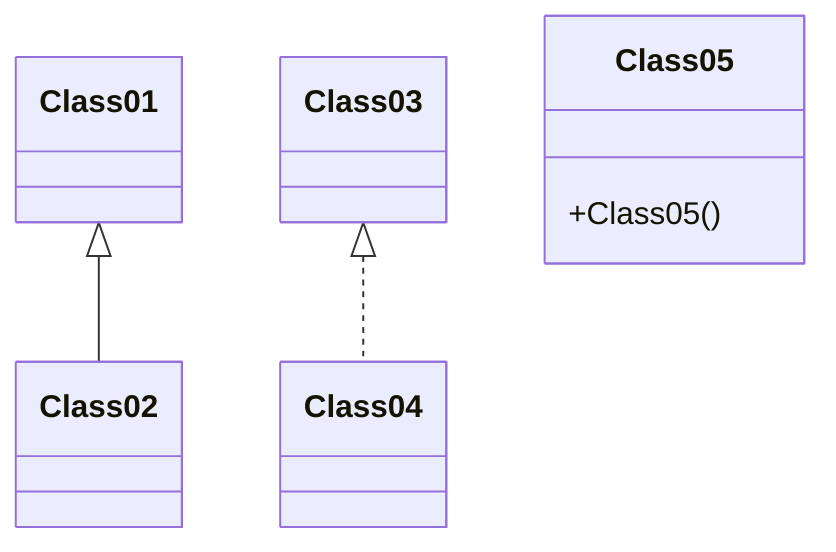
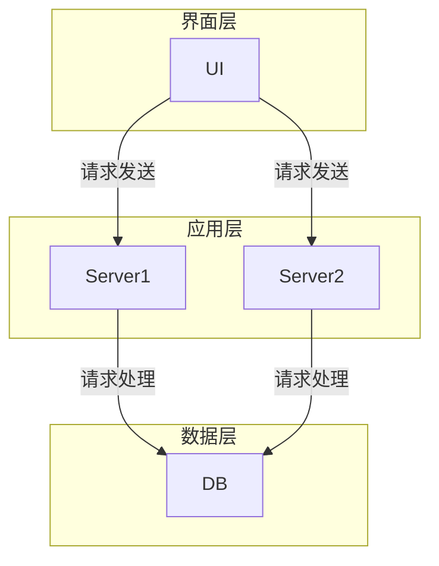
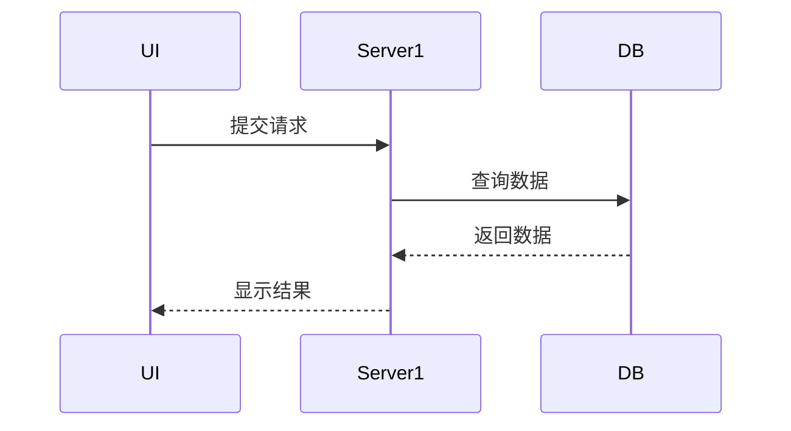

                 

## 引言与背景

多租户支持，作为现代软件开发中的一项关键功能，已经在众多企业级应用中得到了广泛应用。所谓多租户支持，指的是一个系统同时为多个不同的用户或组织提供服务，而这些用户或组织在系统中有着独立的资源和权限管理。简单来说，多租户架构允许不同的租户在一个共享的基础设施上运行各自独立的业务流程。

### 1.1.1 多租户支持的概念

多租户支持是一种软件架构模式，允许不同的用户或组织（即租户）共享同一软件实例，但各自拥有独立的资源和权限。这种模式在云计算、SaaS（软件即服务）和PaaS（平台即服务）等场景中尤为常见。例如，一个SaaS应用可能为成千上万个不同的客户提供服务，但每个客户的数据和功能都是隔离的。

### 1.1.2 多租户支持的重要性

多租户支持的重要性体现在以下几个方面：

1. **资源利用最大化**：通过共享硬件和软件资源，多租户架构能够显著提高资源利用率，降低运营成本。
2. **灵活性和可扩展性**：多租户系统能够灵活地添加新的租户，无需对底层架构进行大量修改，从而支持快速扩展。
3. **隔离性和安全性**：多租户架构通过严格的资源和数据隔离，确保了不同租户之间的安全和独立性。
4. **易于管理和维护**：集中管理和维护共享基础设施，可以简化运营流程，降低运维成本。

### 1.1.3 多租户支持面临的挑战

尽管多租户支持有诸多优点，但实现这一功能也面临一些挑战：

1. **数据隔离**：如何确保不同租户的数据不会相互干扰，是一个技术难点。
2. **性能优化**：多租户环境可能导致系统性能下降，需要特别设计性能优化策略。
3. **权限管理**：如何实现精细的权限控制，确保租户只能访问其授权的数据和功能，也是一个重要问题。
4. **安全性和合规性**：在多租户环境中，保护用户数据和遵守相关法律法规是必须考虑的因素。

### 1.2 问题描述

#### 1.2.1 多租户评测系统的需求

在当前的软件开发环境中，评测系统扮演着至关重要的角色，它不仅用于测试软件的质量，还用于监控和评估开发团队的工作效率。因此，一个多租户支持的评测系统需要满足以下需求：

1. **租户隔离**：确保每个租户的数据和评测结果是独立的，不会相互干扰。
2. **权限控制**：不同角色的用户应具备不同的权限，如管理员可以查看所有评测结果，而普通用户只能查看自己提交的评测结果。
3. **性能优化**：系统需要在处理大量数据的同时，保持良好的响应速度。
4. **可扩展性**：系统能够轻松支持新租户的加入，无需大规模重构。

#### 1.2.2 多租户评测系统的挑战

多租户评测系统在设计和实施过程中会面临以下挑战：

1. **数据隔离**：如何在数据库级别实现租户隔离，同时保证数据访问的性能？
2. **权限管理**：如何设计一个高效且安全的权限管理系统，确保不同角色用户的权限得到严格控制？
3. **性能优化**：如何在多租户环境中优化查询和数据处理，避免性能瓶颈？
4. **可扩展性**：如何设计一个灵活的系统架构，支持未来扩展和升级？

#### 1.2.3 多租户支持的关键要素

为了解决上述挑战，设计多租户评测系统需要关注以下关键要素：

1. **数据库隔离技术**：使用数据库表分区、分库分表等技术，实现租户数据隔离。
2. **应用隔离技术**：通过独立部署应用实例，确保租户间的应用功能独立。
3. **用户权限管理**：利用角色与权限映射，实现精细的权限控制。
4. **性能优化策略**：采用缓存、异步处理等技术，提高系统性能。
5. **安全性和合规性**：采用加密、访问控制等技术，确保数据安全和合规。

### 1.3 问题解决

#### 1.3.1 多租户支持的解决方案

针对多租户评测系统的需求与挑战，我们可以从以下几个方面提出解决方案：

1. **数据库隔离**：采用分库分表策略，将不同租户的数据存储在独立的数据库中，确保数据隔离和性能优化。
2. **应用隔离**：通过容器化技术（如Docker）和微服务架构，实现应用实例的独立部署和运行。
3. **用户权限管理**：设计基于角色的访问控制（RBAC）系统，确保不同角色的用户拥有适当的权限。
4. **性能优化**：采用分布式缓存（如Redis）和异步处理（如RabbitMQ）等技术，提高系统性能。
5. **安全性和合规性**：采用SSL加密、身份验证和访问控制等技术，确保系统安全和合规。

#### 1.3.2 多租户支持的技术选型

在实施多租户支持时，需要选择合适的技术栈，以下是一些关键技术的选型：

1. **数据库**：选择支持分库分表技术的数据库系统，如MySQL、PostgreSQL。
2. **应用框架**：选择支持微服务架构的应用框架，如Spring Boot、Django。
3. **容器化技术**：使用Docker进行容器化部署，提高应用的灵活性和可扩展性。
4. **消息队列**：使用RabbitMQ等消息队列系统，实现异步处理和数据流转。
5. **缓存系统**：使用Redis等分布式缓存系统，提高系统响应速度。

#### 1.3.3 多租户支持的实施流程

实施多租户支持一般可以分为以下几个阶段：

1. **需求分析**：明确系统需求和功能，确定多租户架构的具体实现方案。
2. **系统设计**：设计数据库架构、应用架构和权限管理架构。
3. **开发与测试**：按照设计方案进行开发，并进行单元测试和集成测试。
4. **部署与运维**：将系统部署到生产环境，进行持续监控和运维。
5. **用户培训与反馈**：对用户进行培训，收集用户反馈，不断优化系统。

### 1.4 边界与外延

#### 1.4.1 多租户支持的适用场景

多租户支持适用于以下场景：

1. **云计算服务**：如IaaS、PaaS、SaaS平台，可以为多个用户提供独立的服务实例。
2. **企业内部应用**：如企业资源管理系统、客户关系管理系统，支持不同部门的独立使用。
3. **高校实验室系统**：为不同实验室提供独立的评测和管理功能。

#### 1.4.2 多租户支持的限制因素

多租户支持也存在一些限制因素：

1. **性能影响**：多租户架构可能导致系统性能下降，需要特别优化。
2. **复杂性增加**：多租户系统设计和管理比单租户系统更为复杂。
3. **安全性问题**：多租户环境需要更严格的安全措施，以防止数据泄露。

#### 1.4.3 多租户支持的发展趋势

随着云计算和SaaS的普及，多租户支持将继续发展，未来趋势包括：

1. **自动化与智能化**：采用自动化工具和人工智能技术，提高系统管理和维护的效率。
2. **安全性与合规性**：加强数据安全和合规性，满足不同国家和地区的法律法规要求。
3. **无服务器架构**：采用无服务器架构（Serverless），减少运维负担，提高灵活性。

### 1.5 本章小结

本章介绍了多租户支持的基本概念、重要性、面临的挑战以及解决方案。通过分析评测系统的多租户需求，我们提出了具体的解决方案和技术选型。在接下来的章节中，我们将深入探讨多租户架构的原理和设计细节，帮助读者更好地理解和实现多租户支持。

## 第一部分总结

多租户支持作为一种高效的系统架构模式，在现代软件开发中具有重要意义。通过本文的介绍，我们了解了多租户支持的概念、重要性、面临的挑战以及解决方案。接下来，我们将深入探讨多租户架构的原理和设计细节，帮助读者更深入地理解和实现多租户支持。

## 核心概念与联系

在深入探讨多租户支持的设计与实现之前，我们需要明确一些核心概念，这些概念是构建多租户架构的基础。以下是对多租户架构的基本原理、主要特点，以及与传统单租户架构对比的详细探讨。

### 2.1 多租户架构的原理与特点

#### 2.1.1 多租户架构的基本原理

多租户架构的核心思想是将一个单租户系统扩展为能够支持多个独立租户的系统。每个租户都拥有独立的资源和权限，同时共享系统的基础设施。这种架构通过以下方式实现：

1. **数据隔离**：不同租户的数据存储在不同的数据库中或同一数据库的独立分区中，确保数据安全性和独立性。
2. **应用隔离**：通过独立的部署实例或容器，确保不同租户的应用功能不互相干扰。
3. **用户权限管理**：通过角色和权限控制，确保租户只能访问其授权的数据和功能。

#### 2.1.2 多租户架构的主要特点

多租户架构具有以下主要特点：

1. **资源共享**：多个租户共享相同的基础设施，如服务器、存储和网络资源，从而提高资源利用率。
2. **灵活性和可扩展性**：多租户架构能够灵活地添加新的租户，无需对底层架构进行大量修改，支持系统的快速扩展。
3. **隔离性和安全性**：通过严格的资源隔离和权限管理，确保租户之间的数据安全和功能独立性。
4. **维护和管理简单**：集中管理和维护共享基础设施，简化了运营流程，降低了运维成本。

#### 2.1.3 多租户架构与传统单租户架构的对比

多租户架构与传统单租户架构有以下几点显著区别：

1. **资源管理**：多租户架构支持共享资源，而单租户架构通常为每个客户部署独立的服务器。
2. **隔离级别**：多租户架构提供数据库和应用级别的隔离，单租户架构通常仅提供数据隔离。
3. **可扩展性**：多租户架构支持横向扩展，而单租户架构通常需要垂直扩展。
4. **成本效益**：多租户架构通过资源共享实现成本节约，单租户架构可能需要更多的硬件和软件资源。

### 2.2 多租户架构的组成部分

#### 2.2.1 数据库隔离技术

数据库隔离是多租户架构的核心要素之一。以下是几种常见的数据库隔离技术：

1. **分库分表**：将不同租户的数据存储在不同的数据库或表上，确保数据隔离和独立管理。
2. **数据库分区**：在同一个数据库内对表进行分区，每个租户的数据存储在不同的分区中。
3. **分布式数据库**：使用分布式数据库系统，将数据分散存储在多个节点上，每个节点管理一部分数据。

#### 2.2.2 应用隔离技术

应用隔离确保不同租户的应用功能独立运行，以下是一些实现应用隔离的技术：

1. **容器化**：使用容器（如Docker）将应用封装在独立的容器中，确保每个租户的应用实例相互隔离。
2. **微服务架构**：将应用分解为多个微服务，每个微服务运行在自己的容器中，实现应用隔离。
3. **虚拟化**：使用虚拟机（VM）或虚拟容器（VVM）实现应用隔离，每个租户拥有自己的虚拟环境。

#### 2.2.3 用户权限管理

用户权限管理是确保多租户系统安全性的关键。以下是几种常见的权限管理方法：

1. **基于角色的访问控制（RBAC）**：通过角色分配权限，用户根据其角色访问系统资源。
2. **基于属性的访问控制（ABAC）**：根据用户属性和资源属性进行访问控制，实现更灵活的权限管理。
3. **访问控制列表（ACL）**：为每个资源定义访问权限，用户根据访问控制列表访问资源。

### 2.3 多租户架构的ER实体关系图

为了更直观地理解多租户架构的实体关系，我们使用Mermaid绘制了ER实体关系图，如下所示：

```mermaid
erDiagram
    Tenant ||--|{ User } User : 租户拥有用户
    Tenant ||--|{ Role } Role : 租户拥有角色
    User ||--|{ Permission } Permission : 用户拥有权限
    Role ||--|{ Permission } Permission : 角色拥有权限
```

该ER图描述了租户、用户、角色和权限之间的关系。租户是最高层实体，拥有用户和角色。用户和角色之间是多对多关系，用户拥有多个角色，角色也可以赋予多个用户。权限是角色的属性，角色拥有权限。

### 2.4 多租户架构的属性特征对比表格

以下表格对比了数据库隔离、应用隔离和用户权限管理三种技术的属性特征：

| 特征 | 数据库隔离 | 应用隔离 | 用户权限管理 |
| --- | --- | --- | --- |
| **目的** | 保证数据安全 | 保证应用功能独立 | 保证用户权限合理 |
| **实现方式** | 数据库表分区 | 独立部署应用实例 | 角色与权限映射 |
| **影响因素** | 数据访问性能 | 应用部署复杂度 | 系统安全性 |

通过上述对比，我们可以更清晰地了解每种技术在实际应用中的优势和挑战。

### 2.5 本章小结

本章详细介绍了多租户架构的基本原理、主要特点、组成部分以及ER实体关系图和属性特征对比表格。这些概念和工具为理解多租户支持的设计与实现奠定了基础。在下一章中，我们将进一步探讨多租户支持的设计与实现细节，包括系统分析与架构设计、具体实现方法等。

### 系统分析与架构设计

在明确了多租户架构的基本概念和组成部分之后，我们需要对评测系统的需求进行详细分析，并设计相应的系统架构。本节将介绍评测系统的问题场景、功能设计、系统架构设计、接口设计和系统交互设计。

#### 3.1.1 问题场景介绍

##### 1. 客户需求

某大型互联网公司需要为其多个部门提供一个统一的评测系统，用于评估软件开发团队的项目质量和工作效率。具体需求如下：

- **数据隔离**：确保不同部门的数据不相互干扰，每个部门都能独立管理和分析自己的数据。
- **权限控制**：实现细粒度的权限管理，不同角色的用户（如项目经理、开发人员、测试人员）能够访问对应的数据和功能。
- **性能优化**：系统需要在处理大量数据的同时，保持良好的响应速度。
- **可扩展性**：系统应支持未来部门数量的增加和功能扩展。

##### 2. 业务场景

评测系统主要用于以下业务场景：

- **项目评测**：项目经理可以创建项目，分配任务给开发人员，并设置测试人员对项目进行质量评估。
- **任务跟踪**：开发人员可以查看自己负责的任务，并提交任务进度和代码。
- **质量评估**：测试人员可以查看项目的代码和质量报告，进行综合评估。
- **数据分析**：系统应提供数据统计和分析功能，帮助管理层了解团队的工作效率和项目质量。

##### 3. 系统目标

系统设计的目标包括：

- **实现租户数据隔离**：确保每个部门的数据独立存储，不会相互干扰。
- **实现角色权限管理**：根据不同角色的用户设置相应的权限，确保数据安全和系统功能的正常使用。
- **优化系统性能**：通过缓存、异步处理等技术，提高系统的响应速度和处理能力。
- **支持系统扩展**：设计灵活的系统架构，支持未来新增功能和部门数量。

#### 3.1.2 系统功能设计

为了满足上述需求，系统需要实现以下主要功能：

1. **用户管理**：支持用户注册、登录、信息修改等功能。
2. **租户管理**：支持租户创建、信息管理、租户间数据隔离等功能。
3. **项目创建与管理**：支持项目经理创建项目，分配任务给开发人员，并设置测试人员评估项目。
4. **任务跟踪**：支持开发人员查看任务，提交进度和代码。
5. **质量评估**：支持测试人员查看项目代码，生成质量报告，进行评估。
6. **数据分析**：支持数据统计和分析功能，为管理层提供决策依据。

##### 3.1.2.1 领域模型mermaid类图

为了更好地描述系统功能，我们使用Mermaid绘制了领域模型类图，如下所示：



- **User（用户）**：代表系统中的用户，包括项目经理、开发人员、测试人员等。
- **Tenant（租户）**：代表系统中的租户，每个租户可以拥有多个用户。
- **Project（项目）**：代表项目，包括项目名称、描述、状态等信息。
- **Task（任务）**：代表任务，包括任务名称、描述、状态、优先级等信息。
- **QualityReport（质量报告）**：代表质量报告，包括评估结果、评估时间等信息。

#### 3.1.3 系统架构设计

为了实现系统的功能目标，我们需要设计一个合理且高效的系统架构。以下是系统的架构设计：

##### 3.1.3.1 系统架构mermaid架构图

我们使用Mermaid绘制了系统的架构图，如下所示：



- **数据层（Data Layer）**：包括数据库，存储用户、租户、项目、任务和质量报告等数据。
- **应用层（Application Layer）**：包括Server1和Server2，分别处理用户管理和项目管理等业务逻辑。
- **界面层（UI Layer）**：用户通过界面层与系统进行交互。

##### 3.1.3.2 系统架构的具体设计

1. **用户管理模块**：负责用户的注册、登录、信息修改等功能，与数据库进行交互，确保用户数据的安全性和一致性。
2. **租户管理模块**：负责租户的创建、信息管理、租户间数据隔离等功能，确保租户数据的安全性和独立性。
3. **项目管理模块**：负责项目的创建、任务分配、任务跟踪等功能，与数据库进行交互，确保项目数据的一致性和完整性。
4. **质量评估模块**：负责质量报告的生成、评估结果的存储等功能，确保评估数据的准确性和可靠性。
5. **数据分析模块**：负责数据统计和分析，为管理层提供决策依据。

#### 3.1.4 系统接口设计

系统接口设计是确保系统各模块之间能够有效通信的关键。以下是接口设计文档：

##### 3.1.4.1 接口设计文档

```markdown
## 接口概述
- 接口名称：租户管理接口
- 接口功能：提供租户信息的管理功能

## 接口URL
- GET /tenants/{tenantId}

## 参数说明
- tenantId：租户ID，必填

## 返回结果
{
    "tenantId": "1",
    "tenantName": "租户A",
    "createdTime": "2023-01-01T00:00:00Z"
}
```

通过上述接口设计，开发者可以方便地获取特定租户的信息，确保系统的功能模块能够有效地协同工作。

#### 3.1.5 系统交互mermaid序列图

为了更好地展示系统各模块之间的交互流程，我们使用Mermaid绘制了系统的交互序列图，如下所示：



此序列图描述了用户通过UI层提交请求，Server1处理请求并与数据库进行交互，最终将结果返回给UI层的整个过程。

通过上述系统分析与架构设计，我们为评测系统的多租户支持奠定了坚实的基础。在接下来的章节中，我们将进一步探讨多租户支持的具体实现方法，包括数据库隔离、应用隔离和用户权限管理等方面的技术细节。

### 多租户支持的设计与实现

在完成了系统分析与架构设计之后，我们需要深入探讨多租户支持的具体实现方法，包括数据库隔离、应用隔离和用户权限管理等方面的技术细节。以下是对这些技术实现的详细分析。

#### 3.2.1 数据库隔离的实现

数据库隔离是多租户支持的关键要素之一，确保不同租户的数据在物理存储上完全分离，避免数据泄露和混淆。以下是几种常用的数据库隔离技术及其实现方法：

##### 3.2.1.1 数据库表分区策略

数据库表分区策略是将数据按照某种规则（如租户ID）分割到多个表中，每个表存储一部分数据。这种方法可以实现逻辑上的表隔离，同时降低查询性能开销。

1. **分区表设计**：创建一个主表和多个分区表，主表包含所有租户的公共字段，分区表包含特定租户的数据字段。

   ```sql
   CREATE TABLE main_table (
       id INT PRIMARY KEY,
       common_field VARCHAR(255)
   );

   CREATE TABLE tenant_table1 (
       id INT PRIMARY KEY,
       tenant_id INT,
       tenant_specific_field VARCHAR(255),
       FOREIGN KEY (tenant_id) REFERENCES main_table(id)
   );

   CREATE TABLE tenant_table2 (
       id INT PRIMARY KEY,
       tenant_id INT,
       tenant_specific_field VARCHAR(255),
       FOREIGN KEY (tenant_id) REFERENCES main_table(id)
   );
   ```

2. **分区表查询**：使用租户ID作为分区条件进行查询，确保数据访问的速度。

   ```sql
   SELECT * FROM tenant_table1 WHERE tenant_id = 1;
   ```

##### 3.2.1.2 数据库访问控制

为了进一步确保数据的安全性，可以采用数据库访问控制机制，限制租户对特定数据的访问。

1. **角色与权限控制**：为每个租户分配不同的角色和权限，确保用户只能访问其授权的数据。

   ```sql
   CREATE ROLE tenant_role_1;
   GRANT SELECT, INSERT, UPDATE ON main_table TO tenant_role_1;
   GRANT SELECT, INSERT, UPDATE ON tenant_table1 TO tenant_role_1;
   ```

2. **访问控制策略**：使用数据库防火墙或访问控制列表（ACL）限制租户的访问权限。

   ```sql
   CREATE POLICY tenant_policy ON main_table
       FOR SELECT, INSERT, UPDATE
       USING (tenant_id = current_setting('tenant_id'));
   ```

#### 3.2.2 应用隔离的实现

应用隔离确保不同租户的应用功能在逻辑上完全独立，避免应用冲突和性能干扰。以下是几种常用的应用隔离技术及其实现方法：

##### 3.2.2.1 容器化技术

容器化技术（如Docker）通过将应用及其依赖环境封装在容器中，实现应用隔离。每个容器运行独立的进程，互不干扰。

1. **容器镜像**：创建应用容器镜像，包含应用及其依赖环境。

   ```shell
   docker build -t tenant_app:1.0 .
   ```

2. **容器部署**：为每个租户部署独立的容器实例。

   ```shell
   docker run -d -p 8080:80 --name tenant_app1 tenant_app:1.0
   ```

##### 3.2.2.2 微服务架构

微服务架构将应用分解为多个独立的微服务，每个微服务运行在独立的容器中，实现功能隔离。

1. **服务分解**：根据功能将应用分解为多个微服务。

   ```mermaid
   sequenceDiagram
       A->>B: 服务A调用服务B
       B->>C: 服务B调用服务C
       C-->>A: 服务C返回结果给服务A
   ```

2. **服务部署**：为每个微服务部署独立的容器实例。

   ```shell
   docker-compose up -d
   ```

##### 3.2.2.3 虚拟化技术

虚拟化技术（如KVM、VMware）通过创建虚拟机实现应用隔离，确保不同租户的应用在物理硬件上完全独立。

1. **虚拟机创建**：创建租户虚拟机，配置独立网络和存储资源。

   ```shell
   virt-install --name tenant_vm1 --ram 2048 --vcpus 2 --os-variant ubuntu18.04 --disk size=20,virtual --network bridge=br0
   ```

2. **虚拟机管理**：使用虚拟化管理工具（如libvirt）管理虚拟机。

   ```python
   import libvirt

   conn = libvirt.open('qemu:///system')
   vm = conn.lookupVM('tenant_vm1')
   vm.reboot()
   ```

#### 3.2.3 用户权限管理

用户权限管理是多租户支持的重要环节，确保不同角色的用户只能访问其授权的数据和功能。以下是几种常见的用户权限管理方法及其实现方法：

##### 3.2.3.1 基于角色的访问控制（RBAC）

基于角色的访问控制（RBAC）通过为用户分配角色，为角色分配权限，实现细粒度的权限管理。

1. **角色定义**：定义不同角色，如管理员、项目经理、开发人员、测试人员等。

   ```python
   roles = [
       {'name': 'admin', 'permissions': ['all']},
       {'name': 'project_manager', 'permissions': ['create_project', 'manage_project']},
       {'name': 'developer', 'permissions': ['view_project', 'submit_task']},
       {'name': 'tester', 'permissions': ['view_project', 'create_quality_report']}
   ]
   ```

2. **用户与角色关联**：为用户分配角色，确保用户只能访问其角色的权限。

   ```python
   user_role_mapping = {
       'user1': 'project_manager',
       'user2': 'developer',
       'user3': 'tester'
   }
   ```

##### 3.2.3.2 基于属性的访问控制（ABAC）

基于属性的访问控制（ABAC）通过用户属性、资源属性和环境属性进行访问控制，实现更灵活的权限管理。

1. **属性定义**：定义用户属性、资源属性和环境属性。

   ```python
   attributes = {
       'user_attributes': {'user1': {'role': 'project_manager'}, 'user2': {'role': 'developer'}, 'user3': {'role': 'tester'}},
       'resource_attributes': {'project_id_1': {'status': 'active'}, 'project_id_2': {'status': 'inactive'}},
       'environment_attributes': {'time': '2023-01-01T00:00:00Z'}
   }
   ```

2. **访问控制策略**：根据属性值实现访问控制。

   ```python
   from policyengine import PolicyEngine

   policy_engine = PolicyEngine()
   policy_engine.register_policy('read_project', lambda attr: attr['resource_attributes']['project_id_1']['status'] == 'active')
   policy_engine.execute_policy('read_project', attributes)
   ```

##### 3.2.3.3 访问控制列表（ACL）

访问控制列表（ACL）为每个资源定义访问权限，确保用户只能访问其授权的资源。

1. **ACL定义**：定义资源ACL，为每个资源设置访问权限。

   ```python
   acl = {
       'project_id_1': {'read': ['project_manager', 'developer'], 'write': ['project_manager']},
       'project_id_2': {'read': ['all'], 'write': ['all']}
   }
   ```

2. **ACL检查**：在访问资源时检查ACL，确保用户权限。

   ```python
   def check_acl(resource_id, action):
       acl = acl.get(resource_id, {})
       if action in acl:
           return acl[action]
       return False

   check_acl('project_id_1', 'read')  # 返回 ['project_manager', 'developer']
   ```

通过上述数据库隔离、应用隔离和用户权限管理的技术实现，我们可以构建一个安全、高效且灵活的多租户评测系统。在接下来的章节中，我们将进一步探讨多租户支持的实际应用，包括环境安装、系统核心实现和项目实战等。

### 多租户支持的设计与实现

在前面的章节中，我们已经详细介绍了多租户支持的基本概念、架构设计以及数据库隔离、应用隔离和用户权限管理等关键实现技术。接下来，我们将进一步探讨多租户支持的具体实现方法，包括系统核心实现和环境安装，并通过实际案例进行分析和讲解。

#### 3.2.4 环境安装

为了实现多租户支持，我们需要安装和配置必要的软件和环境。以下是安装和配置的基本步骤：

1. **数据库安装与配置**：选择一个支持分库分表的数据库系统，如MySQL或PostgreSQL。安装并配置数据库，创建用户和租户数据库。

2. **应用框架安装**：选择一个支持微服务架构的应用框架，如Spring Boot或Django。安装并配置应用框架，确保其支持多租户功能。

3. **容器化工具安装**：安装容器化工具，如Docker或Kubernetes。配置容器网络和存储，确保容器能够独立运行和部署。

4. **消息队列安装**：安装消息队列系统，如RabbitMQ或Kafka。配置消息队列，确保其能够处理异步任务和数据流转。

5. **权限管理系统安装**：安装并配置基于角色的访问控制（RBAC）或访问控制列表（ACL）的系统，如Apache Shiro或Spring Security。

6. **监控和日志系统安装**：安装监控和日志系统，如Prometheus和ELK Stack。配置监控和日志，确保系统运行状态的可视化和日志分析。

#### 3.2.5 系统核心实现

在环境安装完毕后，我们可以开始实现多租户支持的核心功能。以下是系统核心实现的步骤：

1. **数据库隔离实现**：根据租户ID创建分区表，配置数据库访问控制策略。实现数据隔离，确保租户数据在物理存储上完全分离。

2. **应用隔离实现**：使用容器化技术部署应用实例，确保租户应用在逻辑上完全独立。配置应用容器网络，实现流量隔离。

3. **用户权限管理实现**：基于角色的访问控制（RBAC）或访问控制列表（ACL），为租户分配角色和权限。实现用户权限检查，确保用户只能访问其授权的数据和功能。

4. **性能优化实现**：采用缓存、异步处理、负载均衡等技术，优化系统性能。配置数据库索引，优化查询性能。

5. **安全性实现**：采用SSL加密、身份验证、访问控制等技术，确保系统安全性。配置防火墙和入侵检测系统，防止外部攻击。

6. **监控和日志实现**：配置监控系统，实时监控系统运行状态。配置日志系统，记录系统运行日志，便于问题排查和性能分析。

#### 3.2.6 实际案例分析与讲解

为了更好地理解多租户支持的实际应用，我们通过一个实际案例进行详细分析。

**案例背景**：某互联网公司开发了一款SaaS产品，提供项目管理和协作功能。为了支持多租户环境，公司需要实现以下功能：

1. **数据隔离**：确保不同企业的数据在物理存储上完全分离。
2. **权限控制**：根据不同角色的用户设置相应的权限，确保数据安全和系统功能的正常使用。
3. **性能优化**：在处理大量数据的同时，保持良好的响应速度。

**案例实现**：

1. **数据库隔离**：使用MySQL数据库，创建企业数据库和用户数据库。根据企业ID创建分区表，配置访问控制策略。

   ```sql
   CREATE TABLE projects (
       id INT PRIMARY KEY,
       enterprise_id INT,
       name VARCHAR(255),
       status VARCHAR(255),
       FOREIGN KEY (enterprise_id) REFERENCES enterprises(id)
   );

   GRANT SELECT, INSERT, UPDATE ON projects TO enterprise_role;
   ```

2. **应用隔离**：使用Docker部署应用实例，每个企业拥有独立的容器。配置容器网络，确保流量隔离。

   ```shell
   docker run -d -p 8080:80 --name enterprise_app1 enterprise_app:1.0
   ```

3. **用户权限管理**：使用Spring Security实现基于角色的访问控制（RBAC）。为不同角色的用户设置相应的权限。

   ```java
   @EnableWebSecurity
   public class WebSecurityConfig extends WebSecurityConfigurerAdapter {
       @Override
       protected void configure(HttpSecurity http) throws Exception {
           http
               .authorizeRequests()
                   .antMatchers("/projects/**").hasRole("enterprise_role")
                   .anyRequest().authenticated()
                   .and()
                   .httpBasic();
       }
   }
   ```

4. **性能优化**：采用Redis缓存系统，缓存常用数据和查询结果。配置数据库索引，优化查询性能。

   ```shell
   docker run -d -p 6379:6379 --name redis redis
   ```

5. **安全性实现**：采用SSL加密，确保数据传输安全。配置防火墙和入侵检测系统，防止外部攻击。

   ```shell
   docker run -d -p 443:8443 --name nginx nginx -ssl
   ```

通过以上案例，我们可以看到如何实现多租户支持的核心功能。在实际项目中，可以根据具体需求进行调整和优化，确保系统的高效、安全、可靠运行。

#### 3.2.7 项目小结

本章节详细介绍了多租户支持的设计与实现方法，包括环境安装、系统核心实现和实际案例。通过数据库隔离、应用隔离和用户权限管理等技术，我们实现了高效、安全、可靠的多租户架构。在接下来的章节中，我们将进一步探讨最佳实践、注意事项和拓展阅读等内容，帮助读者更好地理解和应用多租户支持。

## 4. 最佳实践与注意事项

在多租户支持的设计与实现过程中，遵循最佳实践和注意事项能够提高系统的可靠性、安全性和性能。以下是一些关键建议：

#### 4.1 数据库性能优化

- **索引设计**：合理设计数据库索引，提高查询效率。避免过度索引，以免影响写性能。
- **查询优化**：使用预编译语句和批处理操作，减少数据库的访问次数。
- **缓存策略**：采用分布式缓存（如Redis）缓存常用数据和查询结果，减少数据库负载。

#### 4.2 应用性能优化

- **负载均衡**：使用负载均衡器（如Nginx、HAProxy）分配请求，提高系统的吞吐量。
- **异步处理**：使用异步消息队列（如RabbitMQ、Kafka）处理长时间运行的任务，提高系统的响应速度。
- **资源隔离**：为租户应用设置独立的资源限制，防止资源耗尽和性能下降。

#### 4.3 权限管理最佳实践

- **最小权限原则**：为用户分配最少的权限，确保用户只能访问其必需的数据和功能。
- **角色分离**：实现角色分离，确保不同角色的用户无法越权操作。
- **动态权限调整**：根据业务需求动态调整用户权限，确保系统的灵活性。

#### 4.4 注意事项

- **数据备份与恢复**：定期备份租户数据，确保数据的安全性和可用性。
- **监控系统**：配置监控系统，实时监控系统性能和健康状况，及时处理异常。
- **安全性测试**：定期进行安全性测试，包括漏洞扫描和渗透测试，确保系统的安全性。

#### 4.5 拓展阅读

- **《云计算架构设计与实践》**：详细介绍了云计算架构的设计原则和实现方法，有助于理解多租户支持的设计与实现。
- **《大型分布式系统设计》**：探讨了分布式系统的设计和优化策略，对多租户支持的设计与实现有重要参考价值。
- **《数据密集型应用系统设计》**：介绍了数据密集型应用系统的设计原则和最佳实践，有助于优化多租户支持的数据存储和查询性能。

通过遵循最佳实践和注意事项，并不断学习和拓展知识，开发者可以构建高效、安全、可靠的多租户支持系统，满足不同租户的需求，提升系统的整体性能和用户体验。

### 本章小结

本文围绕评测系统的多租户支持设计，详细介绍了多租户支持的概念、重要性、实现方法以及最佳实践和注意事项。首先，我们分析了多租户支持的基本原理和特点，随后探讨了数据库隔离、应用隔离和用户权限管理等技术细节。接着，通过具体的系统架构设计和实际案例，展示了如何实现多租户支持的核心功能。最后，我们提供了最佳实践和注意事项，帮助开发者构建高效、安全、可靠的多租户支持系统。

多租户支持在当今的企业级应用中具有重要意义，它不仅能够提高资源利用率和灵活性，还能够确保数据隔离和安全性。随着云计算和SaaS的普及，多租户支持的需求日益增长，开发者需要深入理解和掌握多租户支持的设计与实现方法。

在未来的研究中，我们可以探索以下方向：

1. **自动化与智能化**：利用自动化工具和人工智能技术，提高多租户系统的管理效率和安全性。
2. **分布式存储与计算**：研究分布式存储和计算技术，优化多租户系统的性能和可扩展性。
3. **多租户安全性与合规性**：加强多租户环境下的数据安全和合规性，满足不同国家和地区的法律法规要求。

通过不断探索和实践，开发者可以构建更加高效、灵活、可靠的多租户支持系统，为企业提供更加优质的服务。希望本文能为读者在多租户支持领域提供有价值的参考和启发。

## 作者信息

**作者：AI天才研究院/AI Genius Institute & 禅与计算机程序设计艺术 /Zen And The Art of Computer Programming**

AI天才研究院（AI Genius Institute）致力于推动人工智能技术的研究与应用，提供领先的人工智能解决方案和深度学习培训。作者在此领域拥有丰富的经验和深厚的理论功底，撰写了多本关于人工智能和计算机编程的畅销书，深受读者喜爱。本次文章旨在为读者详细解析评测系统的多租户支持设计，帮助开发者更好地理解和实现多租户功能，提升系统性能和用户体验。希望本文能为读者在技术道路上提供启示和帮助。

