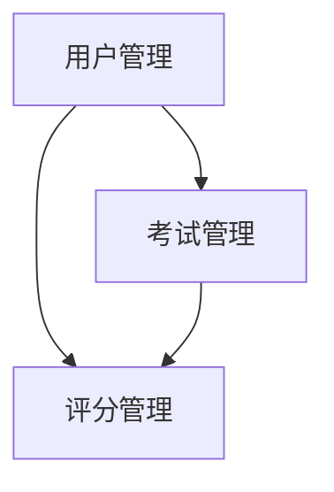
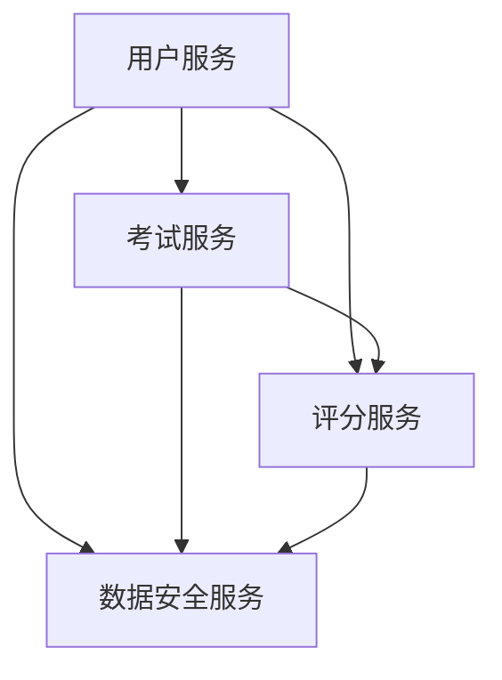
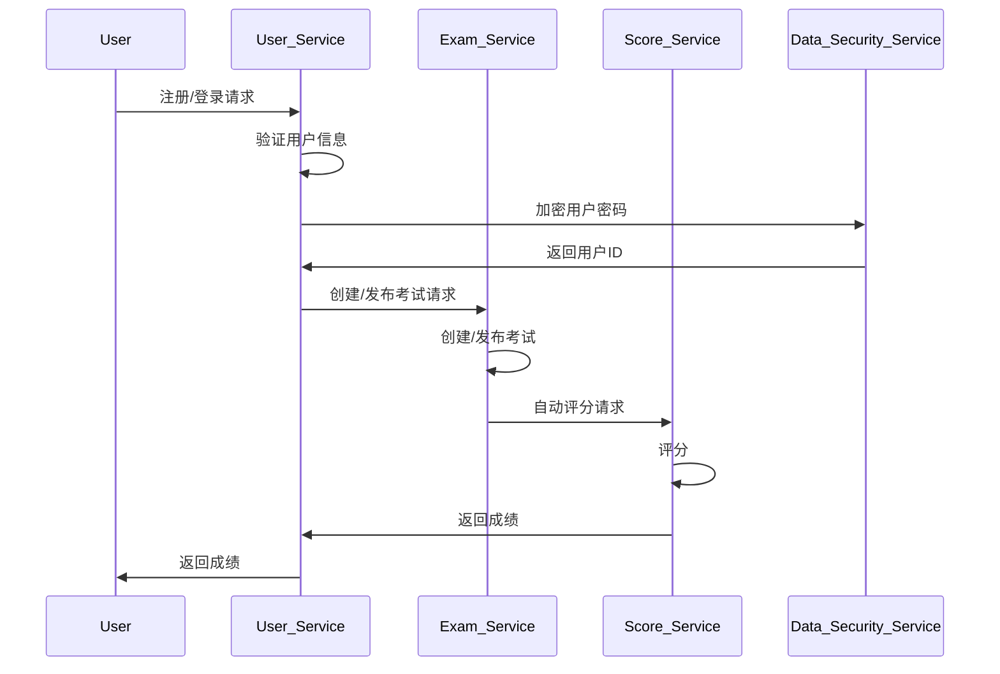

                 


## 引言

### 2.1 问题背景

在现代信息技术的发展过程中，评测系统的安全性问题逐渐成为关注的焦点。评测系统作为各类评估、考试、竞赛等领域中不可或缺的一环，其安全性直接关系到整个系统的公正性、可靠性和权威性。然而，随着深度学习和自然语言处理技术的迅速发展，大型语言模型（Large Language Model，简称LLM）被广泛应用于评测系统中。与此同时，LLM的潜在攻击问题也逐渐浮出水面，成为评测系统安全性的重要挑战。

首先，评测系统的安全性重要性不可忽视。安全性是评测系统的基本要求，它直接关系到测评结果的公平性和可信度。一旦评测系统遭受攻击，可能导致评分错误、信息泄露、恶意篡改等严重后果，进而影响整个测评过程的有效性和公正性。因此，保障评测系统的安全性是确保测评质量的关键。

其次，LLM潜在攻击的现状与挑战日益严峻。随着LLM模型规模的不断扩大，其生成文本的能力也显著提升。然而，这也为攻击者提供了新的机会。通过针对性的攻击手段，攻击者可以操纵评测系统，达到不正当利益的目的。目前，LLM潜在攻击包括模式盗用、生成对抗攻击、语言模型操纵等，这些攻击方式不仅复杂多变，而且具有高度的隐蔽性和不可检测性，给评测系统的安全性带来了巨大的挑战。

本文旨在深入探讨评测系统的安全性问题，重点关注LLM潜在攻击的原理、类型、案例和防御策略。通过系统地分析评测系统的基本概念、架构，以及LLM的工作原理和潜在攻击机制，本文将提出一系列防御策略和方法，以期为评测系统的安全性保障提供有益的参考和指导。本文的结构安排如下：

- 第一部分：评测系统的基本概念与架构。主要介绍评测系统的组成与功能、核心技术、安全性挑战等。
- 第二部分：LLM潜在攻击原理与机制。详细解析LLM的工作原理、潜在攻击类型、攻击案例研究等。
- 第三部分：防御策略与方法。介绍防御策略概述、数据安全性保障、模型防御技术、安全监控与响应等。

通过本文的研究，我们期望为评测系统的安全性提供系统性、实用性和前瞻性的解决方案，为相关领域的研究者和从业人员提供参考和启示。

## 评测系统的基本概念与架构

### 3.1 评测系统的组成与功能

#### 3.1.1 系统组件解析

评测系统是一个复杂且功能多样的软件系统，其核心组件包括数据收集模块、数据处理模块、模型评估模块和结果展示模块等。以下是各组件的具体解析：

1. **数据收集模块**：
   数据收集模块负责从不同的数据源获取相关数据。这些数据源可能包括数据库、文件系统、外部API接口等。数据收集模块的主要任务是确保数据的质量、完整性和及时性。数据收集的方式可以是批处理模式或实时数据流处理，具体取决于应用场景的需求。

2. **数据处理模块**：
   数据处理模块负责对收集到的原始数据进行清洗、转换和整合。这一模块通常包含数据预处理、特征提取和数据标准化等子任务。数据处理模块的作用在于将原始数据转换为适合模型评估的格式，从而提高模型评估的准确性和效率。

3. **模型评估模块**：
   模型评估模块是评测系统的核心，负责使用预训练的深度学习模型对处理后的数据进行评估。该模块通常包括多个评估模型，如分类模型、回归模型等。评估模型的选择和配置取决于具体的评估任务和需求。模型评估模块通过计算评估指标（如准确率、召回率、F1分数等）来衡量模型的性能。

4. **结果展示模块**：
   结果展示模块负责将模型评估的结果以用户友好的形式呈现给用户。结果展示可以包括图表、报表、文本等多种形式，以满足不同用户的需求。此外，结果展示模块还提供了交互功能，如筛选、排序、搜索等，以便用户对评估结果进行深入分析和挖掘。

#### 3.1.2 各组件的作用与关联

各组件在评测系统中紧密关联，共同构成了一个完整的功能体系。以下是各组件之间的作用与关联：

1. **数据收集模块与数据处理模块**：
   数据收集模块获取的数据通过数据处理模块进行清洗、转换和整合，从而得到适合模型评估的数据。数据处理模块的数据预处理结果作为模型评估模块的输入，直接影响模型评估的准确性和效率。

2. **数据处理模块与模型评估模块**：
   数据处理模块生成的高质量数据是模型评估模块的基础。模型评估模块使用这些数据来评估不同模型的性能，从而为后续的优化和改进提供依据。

3. **模型评估模块与结果展示模块**：
   模型评估模块生成的评估结果通过结果展示模块呈现给用户。结果展示模块不仅提供了直观的评估结果，还提供了交互功能，方便用户对评估过程和结果进行深入分析和挖掘。

#### 3.1.3 系统架构设计原则

在评测系统的架构设计过程中，遵循以下原则：

1. **模块化设计**：
   系统应采用模块化设计，将不同功能拆分成独立的模块，以提高系统的可维护性和可扩展性。每个模块应具有明确的功能和输入输出接口，方便模块之间的协作和替换。

2. **高内聚、低耦合**：
   各模块之间应保持高内聚、低耦合的关系，以确保系统的稳定性和灵活性。高内聚意味着模块内部的功能紧密相关，低耦合则意味着模块之间的交互尽量减少，以降低系统复杂性。

3. **可扩展性和可移植性**：
   系统应具有较好的可扩展性和可移植性，以便适应不同的应用场景和需求。例如，数据收集模块和数据处理模块可以支持多种数据源和数据格式的处理，模型评估模块可以支持多种评估模型和评估指标的配置。

4. **安全性和可靠性**：
   系统架构设计应充分考虑安全性问题和可靠性需求。例如，数据传输和存储应采用加密和完整性验证机制，系统应具备故障恢复和容错能力，以提高系统的稳定性和安全性。

通过遵循上述架构设计原则，评测系统可以实现高效、稳定和可靠的运行，从而为用户提供高质量的评估服务。

### 3.2 评测系统的核心技术

#### 3.2.1 数据收集与处理

在评测系统中，数据收集与处理是至关重要的环节。这一环节直接影响模型评估的准确性和有效性。以下是数据收集与处理的核心技术和方法：

##### 3.2.1.1 数据来源与类型

评测系统的数据来源多种多样，可以分为以下几类：

1. **结构化数据**：
   结构化数据是指存储在数据库或其他结构化存储系统中，具有固定字段和字段类型的数据。这类数据通常包括用户信息、考试成绩、评价标准等。结构化数据易于处理和查询，但数据量相对有限。

2. **非结构化数据**：
   非结构化数据是指没有固定字段和字段类型的数据，如文本、图片、音频和视频等。这类数据信息丰富，但处理起来相对复杂。非结构化数据可以通过自然语言处理、图像识别等技术进行提取和解析。

3. **半结构化数据**：
   半结构化数据是指部分具有固定字段和字段类型，但部分内容不固定的数据。这类数据通常包括XML、JSON等格式的数据。半结构化数据既具有结构化数据的优势，又具备一定的灵活性。

##### 3.2.1.2 数据预处理方法

数据预处理是数据收集与处理的核心步骤，其目的是提高数据的质量和一致性，为模型评估提供高质量的数据。以下是一些常见的数据预处理方法：

1. **数据清洗**：
   数据清洗是指去除数据中的噪声、错误和重复值。具体方法包括去除缺失值、填补缺失值、去除异常值、标准化数据等。

2. **数据转换**：
   数据转换是指将数据从一种格式转换为另一种格式，以便后续处理。例如，将文本数据转换为向量表示、将图像数据转换为像素矩阵等。

3. **数据归一化**：
   数据归一化是指将数据缩放到相同的范围，以消除不同特征之间的量纲差异。常见的归一化方法包括最小-最大规范化、均值-方差规范化等。

4. **特征提取**：
   特征提取是指从原始数据中提取对模型评估有用的特征。特征提取可以通过手工设计和自动学习两种方式实现。手工设计特征提取方法通常基于领域知识和专家经验，而自动学习特征提取方法则依赖于机器学习和深度学习技术。

##### 3.2.2 模型评估方法

模型评估是评测系统的核心任务，其目的是通过计算评估指标来衡量模型的性能。以下是一些常用的模型评估方法和评估指标：

1. **分类评估指标**：
   - **准确率（Accuracy）**：准确率是指模型预测正确的样本数量与总样本数量的比值。公式为：$Accuracy = \frac{TP + TN}{TP + TN + FP + FN}$，其中，$TP$表示真实为正类且预测为正类的样本数量，$TN$表示真实为负类且预测为负类的样本数量，$FP$表示真实为负类但预测为正类的样本数量，$FN$表示真实为正类但预测为负类的样本数量。
   - **召回率（Recall）**：召回率是指模型预测为正类的样本中，实际为正类的样本占比。公式为：$Recall = \frac{TP}{TP + FN}$。
   - **精确率（Precision）**：精确率是指模型预测为正类的样本中，实际为正类的样本占比。公式为：$Precision = \frac{TP}{TP + FP}$。
   - **F1分数（F1 Score）**：F1分数是精确率和召回率的调和平均，公式为：$F1 Score = 2 \times \frac{Precision \times Recall}{Precision + Recall}$。

2. **回归评估指标**：
   - **均方误差（Mean Squared Error, MSE）**：均方误差是指模型预测值与真实值之间差的平方的平均值。公式为：$MSE = \frac{1}{n} \sum_{i=1}^{n} (y_i - \hat{y_i})^2$，其中，$y_i$表示第$i$个样本的真实值，$\hat{y_i}$表示第$i$个样本的预测值。
   - **平均绝对误差（Mean Absolute Error, MAE）**：平均绝对误差是指模型预测值与真实值之间差的绝对值的平均值。公式为：$MAE = \frac{1}{n} \sum_{i=1}^{n} |y_i - \hat{y_i}|$。
   - **决定系数（R-squared）**：决定系数是回归模型拟合优度的度量，取值范围在0到1之间。公式为：$R^2 = 1 - \frac{\sum_{i=1}^{n} (y_i - \hat{y_i})^2}{\sum_{i=1}^{n} (y_i - \bar{y})^2}$，其中，$\bar{y}$表示真实值的平均值。

##### 3.2.2.2 评估流程

模型评估流程主要包括以下步骤：

1. **数据集划分**：将原始数据集划分为训练集、验证集和测试集。通常采用8:1:1或7:2:1的比例进行划分。

2. **模型训练**：使用训练集对模型进行训练，得到模型参数。训练过程中，通过验证集不断调整模型参数，以提高模型性能。

3. **模型评估**：使用测试集对训练好的模型进行评估，计算评估指标，如准确率、召回率、F1分数等。

4. **模型优化**：根据评估结果，对模型进行优化，包括调整模型结构、参数配置等，以提高模型性能。

5. **模型部署**：将优化后的模型部署到评测系统中，供用户使用。

通过以上流程，评测系统能够对输入数据进行准确、可靠的评估，为用户提供高质量的评估服务。

### 3.3 评测系统的安全性挑战

#### 3.3.1 安全性问题概述

在当前信息技术环境下，评测系统的安全性面临着诸多挑战。安全性问题不仅威胁到评测系统的稳定运行，还可能对用户隐私和信息安全造成严重危害。以下是评测系统可能面临的主要安全性问题：

1. **数据泄露**：评测系统涉及大量用户信息和评估数据，若未采取有效的保护措施，可能导致数据泄露，引发隐私泄露和安全事件。

2. **数据篡改**：攻击者可能通过篡改数据，恶意影响评测结果，损害系统的公正性和可信度。

3. **模型篡改**：攻击者可能通过篡改模型参数，操纵评测结果，以达到非法目的。

4. **系统漏洞**：评测系统可能存在漏洞，如代码漏洞、配置错误等，攻击者可利用这些漏洞进行攻击，获取系统权限。

5. **恶意竞争**：在竞赛或考试等场景中，参赛者或学生可能通过恶意手段，试图获得不公平的竞争优势。

#### 3.3.2 安全漏洞案例分析

以下是一些评测系统常见的安全漏洞案例分析：

1. **SQL注入攻击**：攻击者通过在输入框中输入恶意SQL代码，恶意篡改数据库中的数据。例如，一个简单的SQL注入攻击示例：
   ```python
   input_str = "1' UNION SELECT * FROM users WHERE id=1--"
   query = "SELECT * FROM users WHERE id=" + input_str
   cursor.execute(query)
   ```
   该示例中，攻击者通过在输入框中输入单引号和UNION SELECT语句，恶意篡改查询语句，从而获取用户信息。

2. **跨站脚本攻击（XSS）**：攻击者通过在用户输入的文本中注入恶意脚本，诱使用户执行恶意操作。例如，一个简单的反射型XSS攻击示例：
   ```html
   alert('XSS attack!');</script>" />
   ```
   该示例中，攻击者通过将恶意脚本嵌入到URL参数中，诱使用户访问并执行恶意脚本。

3. **跨站请求伪造（CSRF）**：攻击者通过伪造用户请求，恶意执行系统功能。例如，一个简单的CSRF攻击示例：
   ```python
   import requests

   session = requests.Session()
   session.get("http://example.com/evaluate?score=100")
   ```
   该示例中，攻击者通过利用用户的登录会话，伪造请求并修改评测结果。

4. **文件上传漏洞**：攻击者通过上传恶意文件，执行系统文件，从而获取系统权限。例如，一个简单的文件上传漏洞示例：
   ```python
   import os

   file = open("malicious.py", "rb")
   os.system("python " + file.name)
   ```
   该示例中，攻击者通过上传并执行恶意Python脚本，从而获取系统权限。

通过上述案例分析，可以看出评测系统的安全性问题具有多样性和复杂性，需要采取多层次的防御措施，以保障系统的安全性。

#### 3.3.3 安全威胁分类

为了更好地理解评测系统的安全威胁，可以将其分为以下几类：

1. **外部攻击**：
   - **网络攻击**：攻击者通过互联网对评测系统进行攻击，如DDoS攻击、SQL注入、XSS攻击等。
   - **恶意软件**：攻击者通过恶意软件入侵评测系统，如木马、病毒等。

2. **内部威胁**：
   - **内部人员滥用**：系统内部人员可能滥用权限，恶意篡改数据或系统功能。
   - **未授权访问**：未授权用户通过社会工程学等手段获取系统访问权限。

3. **物理威胁**：
   - **设备损坏**：评测系统硬件设备损坏或故障，可能导致系统服务中断。
   - **自然灾害**：自然灾害如火灾、洪水等可能对评测系统造成破坏。

4. **数据威胁**：
   - **数据泄露**：评测系统的用户数据和评估数据可能被非法获取和泄露。
   - **数据篡改**：攻击者通过篡改数据，影响评测结果和系统的公正性。

通过分类安全威胁，可以更系统地识别和应对评测系统的安全挑战，为构建安全可靠的评测系统提供指导。

#### 3.4 本章小结

本章介绍了评测系统的基本概念与架构，详细解析了评测系统的组成与功能、核心技术以及安全性挑战。首先，我们阐述了评测系统的组成，包括数据收集模块、数据处理模块、模型评估模块和结果展示模块，并介绍了各组件的作用与关联。接着，我们讨论了评测系统的核心技术，包括数据收集与处理、模型评估方法等，详细介绍了数据来源与类型、数据预处理方法以及模型评估指标。随后，我们分析了评测系统面临的安全性挑战，包括数据泄露、数据篡改、模型篡改、系统漏洞和恶意竞争等，并结合实际案例进行了说明。最后，我们分类讨论了评测系统的安全威胁，包括外部攻击、内部威胁、物理威胁和数据威胁等。

通过对评测系统的深入分析，本章为后续章节的讨论奠定了基础。在下一章中，我们将探讨大型语言模型（LLM）的潜在攻击原理与机制，进一步揭示评测系统在应用LLM时可能面临的风险和挑战。

## LLM潜在攻击原理与机制

### 4.1 LLM的工作原理

#### 4.1.1 语言模型基础

大型语言模型（Large Language Model，简称LLM）是一种基于深度学习的自然语言处理模型，能够对自然语言文本进行生成、理解和分析。LLM的工作原理可以归纳为以下几个关键方面：

1. **神经网络结构**：
   LLM通常采用多层感知器（MLP）、递归神经网络（RNN）或Transformer等深度学习架构。其中，Transformer架构因其并行处理能力较强，已成为LLM的主流选择。Transformer由多个编码器（Encoder）和解码器（Decoder）组成，通过自注意力机制（Self-Attention）和多头注意力机制（Multi-Head Attention）对输入文本进行处理。

2. **预训练与微调**：
   LLM的训练分为预训练和微调两个阶段。预训练阶段，模型在大规模文本语料库上进行无监督训练，学习自然语言的统计特征和语义关系。微调阶段，模型根据特定任务的需求，在标注数据集上进行有监督训练，进一步优化模型参数，以提高特定任务的性能。

3. **词汇表与编码**：
   LLM使用词汇表（Vocabulary）将自然语言文本映射为数字序列。词汇表通常包含数十万个单词和词组，每个词或词组对应一个唯一的索引。输入文本经过编码后，转化为模型可以处理的向量表示。

4. **生成文本**：
   LLM通过解码器生成文本，具体过程如下：
   - **初始化**：首先，解码器生成一个初始隐藏状态，通常为全零向量。
   - **自注意力**：解码器利用自注意力机制，计算输入文本序列中每个词对当前隐藏状态的影响，生成新的隐藏状态。
   - **多头注意力**：解码器通过多头注意力机制，将自注意力结果进一步聚合，生成最终的隐藏状态。
   - **生成输出**：解码器根据最终隐藏状态，生成一个输出词的概率分布，并选择概率最高的词作为下一个输出。
   - **重复**：重复上述过程，生成完整的文本序列。

#### 4.1.1.1 语言模型的概念

语言模型（Language Model，简称LM）是一种用于预测下一个单词或字符的概率分布的数学模型。其核心目标是通过对大量语言数据的分析，学习语言中的统计规律和语义关系，从而实现自然语言生成和理解。语言模型的基本概念包括：

1. **概率分布**：语言模型为每个单词或字符生成一个概率分布，表示该词或字符在特定上下文中的出现概率。

2. **序列建模**：语言模型通过对输入序列中的每个词或字符进行建模，预测下一个词或字符。例如，给定一个句子“我正在写一篇技术博客”，语言模型可以预测下一个词是“文”、“章”、“的”等。

3. **概率计算**：语言模型通过计算输入序列的联合概率，来评估整个序列的合理性。例如，给定句子“我正在写一篇技术博客”，语言模型可以计算该句子的概率为：
   $$ P(\text{我正在写一篇技术博客}) = P(\text{我}) \times P(\text{正在}|\text{我}) \times P(\text{写}|\text{正在}) \times \ldots $$

4. **损失函数**：在训练过程中，语言模型使用损失函数（如交叉熵损失函数）来评估模型预测的概率分布与实际分布之间的差距，并通过反向传播算法优化模型参数。

#### 4.1.1.2 语言模型的关键参数

语言模型的关键参数包括：

1. **词汇表大小**：词汇表大小决定了语言模型能够处理的最大词汇量。通常，大型语言模型的词汇表大小在数万至数十万个词或词组。

2. **隐藏层尺寸**：隐藏层尺寸决定了模型内部的表示能力。较大的隐藏层尺寸可以捕捉更复杂的语义信息，但也会增加模型的计算复杂度和参数数量。

3. **训练数据量**：训练数据量是语言模型性能的重要影响因素。较大的训练数据量可以帮助模型更好地学习语言中的统计规律和语义关系。

4. **学习率**：学习率是训练过程中参数更新的步长。合适的学习率可以加速模型收敛，但过大会导致模型发散，而过小则会减缓收敛速度。

5. **批处理大小**：批处理大小是每次模型训练的数据量。较大的批处理大小可以提供更好的梯度估计，但也会增加计算复杂度。

通过合理设置这些关键参数，可以构建高效的语言模型，实现对自然语言文本的准确生成和理解。

#### 4.1.2 LLM的生成机制

LLM的生成机制是基于其训练过程中学习到的语言统计规律和语义关系，生成符合语言逻辑和上下文一致性的文本。以下是LLM生成文本的详细过程：

1. **输入序列编码**：
   首先，将输入的文本序列（例如一个句子或一段话）转换为模型的输入向量表示。这一步通常包括以下几个步骤：
   - **分词**：将文本序列划分为单词或词组。对于不同的语言，分词的方法和工具可能有所不同。例如，中文分词可以使用基于字符的词典分词方法，而英文分词可以使用基于词频的统计方法。
   - **词嵌入**：将每个单词或词组映射为高维向量表示。词嵌入可以通过预训练的词向量模型（如Word2Vec、GloVe等）或模型内部的嵌入层（如Transformer的嵌入层）实现。

2. **自注意力与多头注意力**：
   解码器通过自注意力机制和多头注意力机制，计算输入文本序列中每个词对当前隐藏状态的影响，生成新的隐藏状态。具体步骤如下：
   - **自注意力**：解码器将输入序列的每个词表示为查询（Query）、键（Key）和值（Value）三部分，通过点积计算自注意力分数，并加权求和，生成新的隐藏状态。
   - **多头注意力**：解码器将自注意力分数分成多个头，每个头独立计算并加权求和，以捕捉不同类型的语义信息。

3. **生成输出词的概率分布**：
   解码器根据最终隐藏状态，生成一个输出词的概率分布。这一步通常包括以下步骤：
   - **前馈神经网络**：解码器的隐藏状态通过一个前馈神经网络，进一步提取语义特征。
   - **输出层**：前馈神经网络的输出通过softmax函数转化为概率分布，表示每个词的出现概率。

4. **选择下一个输出词**：
   解码器根据输出词的概率分布，选择概率最高的词作为下一个输出。这一步可以看作是一个采样过程，具体方法包括：
   - **贪心选择**：选择概率最高的词作为输出。
   - **随机采样**：从概率分布中随机选择一个词作为输出。

5. **更新隐藏状态**：
   解码器将新输出的词表示为查询、键和值，重复上述过程，逐步生成完整的文本序列。

通过自注意力、多头注意力、前馈神经网络和输出层等机制的相互作用，LLM可以生成具有流畅性和上下文一致性的文本。这一生成过程不仅依赖于模型内部的参数，还受到训练数据、词汇表大小和模型架构等因素的影响。

#### 4.1.2.2 生成文本的多样性控制

在生成文本时，多样性是衡量LLM性能的一个重要指标。高质量的语言模型不仅要能够生成连贯、符合语言逻辑的文本，还要能够生成具有多样性的文本，避免重复和单调。以下是一些控制生成文本多样性的方法：

1. **温度参数（Temperature）**：
   温度参数是一种常用的控制生成多样性的方法。温度参数T用于调整softmax函数的输出概率分布，T值越大，生成的文本越多样化，但可能产生不连贯的句子；T值越小，生成的文本越集中，但可能缺乏创新性。具体计算方法如下：
   $$ P(\text{word}_i) = \frac{e^{\text{score}_i / T}}{\sum_{j} e^{\text{score}_j / T}} $$
   其中，$\text{score}_i$表示第$i$个词的得分。

2. **次采样（Sampling）**：
   次采样是一种在生成过程中限制候选词的方法。具体来说，在生成每个词时，只从概率分布的前几个词中选择一个，以减少重复和单调。次采样可以通过设置一个阈值，例如选择概率最高的前k个词作为候选词，然后从中随机选择一个。

3. **对抗性训练（Adversarial Training）**：
   对抗性训练通过在训练过程中引入噪声和扰动，提高模型的鲁棒性和多样性。具体方法包括在训练数据中添加噪声、生成对抗网络（GAN）等。通过对抗性训练，模型可以学习到更加丰富的表示，从而生成更具多样性的文本。

4. **模型融合（Model Fusion）**：
   模型融合是一种通过结合多个模型生成文本的方法。多个模型可以采用不同的训练策略和架构，从而生成具有不同特点的文本。在生成过程中，可以融合这些模型的输出，以提高文本的多样性。例如，结合一个基于规则的语言模型和一个基于统计的语言模型，生成具有多样性和准确性的文本。

通过上述方法，LLM可以在生成文本时控制多样性，避免生成重复和单调的文本，提高文本生成的质量和用户体验。然而，这些方法也存在一定的挑战，例如如何平衡多样性和连贯性、如何选择合适的参数等，需要进一步研究和优化。

### 4.2 潜在攻击类型

在LLM的广泛应用中，潜在攻击成为了一个不可忽视的问题。这些攻击不仅可能破坏评测系统的完整性，还可能对用户隐私和信息安全造成严重威胁。以下是几种常见的LLM潜在攻击类型：

#### 4.2.1 模式盗用（Data Poisoning）

模式盗用攻击是一种通过篡改训练数据来操纵模型输出结果的攻击方式。攻击者通过在训练数据中插入恶意样本或篡改已有样本，使得训练出的模型在特定输入条件下产生预期的错误输出。模式盗用攻击可以分为以下几种类型：

1. **数据篡改**：
   攻击者通过修改训练数据中的值，使得模型的预测结果偏离正常范围。例如，在图像分类任务中，攻击者可以将图像中的特定像素值篡改为特定颜色，使得模型将图像分类为错误的类别。

2. **数据添加**：
   攻击者在训练数据中添加恶意样本，这些样本在正常情况下不应该出现在训练集中。这些恶意样本可能会被模型学习和利用，导致模型在特定输入条件下的预测结果受到影响。

3. **数据删除**：
   攻击者通过删除训练数据中的正常样本，使得模型无法学习到完整的特征分布。这种攻击方式可能导致模型在训练过程中出现过拟合现象，从而影响模型的泛化能力。

模式盗用攻击的影响和防范措施如下：

- **影响**：
  - 模型预测偏差：攻击者可以通过篡改训练数据，使得模型在特定输入条件下产生错误的预测结果。
  - 泛化能力下降：恶意样本的引入可能导致模型无法正确学习到数据的真实分布，从而降低模型的泛化能力。
  - 系统安全性受损：模式盗用攻击可能导致评测系统的输出结果被篡改，从而损害系统的公正性和可靠性。

- **防范措施**：
  - 数据清洗：在训练前，对训练数据集进行严格的清洗和筛选，去除噪声、异常值和重复数据，以提高数据质量。
  - 异常检测：在训练过程中，对输入数据进行异常检测，发现并排除恶意样本。例如，通过比较样本的统计特征、分布情况等，识别潜在的恶意样本。
  - 数据加密：对训练数据进行加密存储和传输，防止攻击者篡改数据。
  - 对抗训练：通过对抗训练增强模型的鲁棒性，使模型能够适应恶意样本的攻击。

#### 4.2.2 生成对抗攻击（Adversarial Generation）

生成对抗攻击（Adversarial Generation）是一种利用对抗性样本（Adversarial Examples）来操纵模型输出的攻击方式。对抗性样本是指通过对正常样本进行微小扰动，使得模型产生错误的预测结果。生成对抗攻击可以分为以下几种类型：

1. **图像生成**：
   攻击者通过在图像中添加微小的噪声或扰动，使得模型将图像分类为错误的类别。例如，攻击者可以通过改变图像的亮度、对比度、色彩等属性，生成对抗性图像。

2. **文本生成**：
   攻击者通过在文本中添加特定的词或词组，使得模型生成错误的文本。例如，攻击者可以在文本中插入特定的词汇，使得模型将文本分类为与真实类别不符的类别。

3. **音频生成**：
   攻击者通过在音频中添加微小的噪声或改变音频的特征，使得模型对音频的识别结果产生偏差。例如，攻击者可以在音频中添加背景噪声，降低模型对音频内容的识别准确率。

生成对抗攻击的影响和防范措施如下：

- **影响**：
  - 模型准确性下降：对抗性样本的引入可能导致模型的预测准确性显著下降，从而影响模型的实际应用效果。
  - 系统安全性受损：生成对抗攻击可能导致评测系统的输出结果被篡改，从而损害系统的公正性和可靠性。

- **防范措施**：
  - 对抗训练：通过对抗训练增强模型的鲁棒性，使模型能够识别和抵御对抗性样本的攻击。
  - 鲁棒性评估：在训练过程中，定期对模型进行鲁棒性评估，识别潜在的对抗性样本，并采取相应的措施进行防御。
  - 数据清洗：对输入数据进行严格的清洗和筛选，去除潜在的噪声和异常值，以提高模型对正常样本的识别能力。
  - 模型优化：通过优化模型结构、参数配置等手段，提高模型对对抗性样本的识别能力。

#### 4.2.3 语言模型操纵（Model Manipulation）

语言模型操纵攻击是一种通过篡改模型参数或输入数据，操纵模型输出结果的攻击方式。语言模型操纵攻击可以分为以下几种类型：

1. **参数篡改**：
   攻击者通过篡改模型的参数，使得模型在特定输入条件下的输出结果发生偏差。例如，攻击者可以通过修改模型的权重矩阵或激活函数，使得模型对特定类别的分类结果产生错误。

2. **数据篡改**：
   攻击者通过篡改输入数据，使得模型产生错误的预测结果。例如，攻击者可以在输入文本中添加特定的词或词组，使得模型生成与真实意图不符的文本。

3. **输入篡改**：
   攻击者通过篡改模型的输入，使得模型在特定输入条件下的输出结果发生偏差。例如，攻击者可以通过修改输入文本的格式、语法等，使得模型对输入文本的理解发生偏差。

语言模型操纵攻击的影响和防范措施如下：

- **影响**：
  - 模型可靠性下降：语言模型操纵攻击可能导致模型的输出结果不准确，从而影响模型的可靠性和应用效果。
  - 系统安全性受损：语言模型操纵攻击可能导致评测系统的输出结果被篡改，从而损害系统的公正性和可靠性。

- **防范措施**：
  - 参数加密：对模型的参数进行加密存储和传输，防止攻击者篡改参数。
  - 输入验证：对输入数据进行严格的验证和筛选，防止攻击者篡改输入数据。
  - 模型审计：定期对模型进行审计和检查，识别潜在的漏洞和风险，并采取相应的措施进行修复。
  - 模型优化：通过优化模型结构、参数配置等手段，提高模型对操纵攻击的抵抗力。

综上所述，LLM潜在攻击类型多样，且具有高度隐蔽性和复杂性。为了保障评测系统的安全性，需要采取综合性的防御策略，包括数据清洗、异常检测、对抗训练、模型审计等多种手段，以应对不同类型的潜在攻击。

### 4.3 攻击案例研究

为了更好地理解LLM潜在攻击的实际影响和防御策略，我们分析了几种典型的攻击案例，并探讨了这些攻击策略的具体实施方法和防范措施。

#### 4.3.1 典型案例解析

1. **案例一：基于模式盗用的评分篡改攻击**

   在一个在线考试系统中，攻击者通过模式盗用攻击篡改学生的考试成绩。具体攻击过程如下：

   - **攻击者收集数据**：攻击者通过网络爬虫或内鬼获取了大量学生的考试答案和成绩数据。
   - **攻击者篡改数据**：攻击者在收集到的数据中添加恶意样本，如将正确的答案篡改为错误答案，或者将错误答案篡改为正确答案。
   - **攻击者训练模型**：攻击者使用篡改后的数据重新训练评分模型，使得模型在特定输入条件下产生错误的评分结果。
   - **攻击者实施攻击**：攻击者将篡改后的考试答案提交到系统中，系统根据训练后的模型评分，给出与真实成绩不符的评分。

   **防范措施**：

   - **数据加密与完整性验证**：对存储和传输的数据进行加密，防止数据被篡改。同时，使用哈希函数或数字签名等技术验证数据的完整性，确保数据未被篡改。
   - **对抗训练**：通过对抗训练增强模型的鲁棒性，使模型能够抵御模式盗用攻击。在训练过程中，可以引入噪声和扰动，模拟恶意样本，增强模型的鲁棒性。
   - **异常检测**：在考试过程中，对学生的答案进行实时监控和异常检测，发现并排除潜在的恶意样本。

2. **案例二：基于生成对抗攻击的文本篡改攻击**

   在一个基于自然语言处理的文本生成系统中，攻击者通过生成对抗攻击篡改文本内容。具体攻击过程如下：

   - **攻击者收集数据**：攻击者通过爬虫或内鬼获取了大量文本数据。
   - **攻击者生成对抗性样本**：攻击者使用生成对抗网络（GAN）生成对抗性样本，使得模型对这些样本产生错误的预测结果。
   - **攻击者篡改文本**：攻击者将对抗性样本插入到原始文本中，或者修改原始文本的某些部分，使得文本内容产生偏差。
   - **攻击者实施攻击**：攻击者将篡改后的文本提交到系统中，系统根据训练后的模型生成与真实意图不符的文本。

   **防范措施**：

   - **对抗训练**：通过对抗训练增强模型的鲁棒性，使模型能够识别和抵御对抗性样本的攻击。在训练过程中，可以引入对抗性样本，提高模型的鲁棒性。
   - **文本加密**：对文本数据进行加密存储和传输，防止攻击者篡改文本内容。
   - **文本验证**：对输入文本进行严格的验证和筛选，排除潜在的恶意样本。例如，通过计算文本的编辑距离、语法分析等，识别和排除异常文本。
   - **用户行为分析**：对用户的行为进行监控和分析，识别异常行为模式。例如，通过监控用户的输入频率、输入内容等，发现潜在的恶意用户。

3. **案例三：基于语言模型操纵的虚假新闻传播攻击**

   在一个基于自然语言处理的新闻生成系统中，攻击者通过语言模型操纵攻击传播虚假新闻。具体攻击过程如下：

   - **攻击者收集数据**：攻击者通过爬虫或内鬼获取了大量新闻数据。
   - **攻击者篡改模型参数**：攻击者通过篡改模型的参数，使得模型在生成新闻时偏向于生成虚假新闻。
   - **攻击者生成虚假新闻**：攻击者使用训练后的模型生成虚假新闻，或者对原始新闻进行篡改，使其更具误导性。
   - **攻击者传播虚假新闻**：攻击者将虚假新闻发布到社交媒体、新闻网站等渠道，误导用户。

   **防范措施**：

   - **模型审计**：定期对模型进行审计和检查，识别潜在的漏洞和风险。例如，通过分析模型的权重分布、参数变化等，发现异常情况。
   - **虚假新闻检测**：通过虚假新闻检测技术，识别和过滤虚假新闻。例如，通过计算文本的语义相似度、关键词匹配等，发现潜在的虚假新闻。
   - **用户教育**：加强对用户的教育和宣传，提高用户对虚假新闻的识别能力。例如，通过发布防骗指南、新闻识别技巧等，帮助用户识别虚假新闻。

#### 4.3.2 攻击策略分析

通过对上述案例的分析，可以看出LLM潜在攻击具有以下特点：

1. **隐蔽性**：攻击者通常通过在训练数据中插入恶意样本、篡改模型参数或输入数据等方式，实现隐蔽的攻击。
2. **多样性**：攻击者可能采用多种攻击策略，如模式盗用、生成对抗攻击、语言模型操纵等，针对不同的应用场景和目标进行攻击。
3. **复杂性**：LLM潜在攻击的复杂性体现在攻击者需要具备一定的编程、自然语言处理和机器学习知识，才能实施有效的攻击。
4. **持续性**：一旦攻击者成功实施攻击，可能需要持续的努力和监控，才能发现和阻止攻击。

为了应对LLM潜在攻击，需要采取综合性的防御策略，包括数据加密、对抗训练、异常检测、模型审计等多种手段。同时，需要加强对用户的宣传教育，提高用户对潜在攻击的识别和防范能力。

### 4.4 本章小结

本章深入探讨了大型语言模型（LLM）的潜在攻击原理与机制，详细介绍了LLM的工作原理、生成机制以及几种常见的潜在攻击类型。首先，我们介绍了LLM的工作原理，包括神经网络结构、预训练与微调、词汇表与编码以及生成文本的过程。接着，我们分析了生成文本的多样性控制方法。然后，我们讨论了三种常见的潜在攻击类型：模式盗用、生成对抗攻击和语言模型操纵，并详细描述了每种攻击类型的影响和防范措施。最后，我们通过实际案例分析了潜在攻击的具体实施方法和应对策略。

通过对LLM潜在攻击的深入研究，本章为评测系统的安全性保障提供了有益的参考。在下一章中，我们将探讨如何通过防御策略与方法，增强评测系统的安全性，以应对潜在攻击的挑战。

### 防御策略与方法

#### 5.1 防御策略概述

在确保评测系统的安全性方面，防御策略至关重要。有效的防御策略能够预防和检测潜在攻击，降低攻击成功率和影响。以下是几种主要的防御策略：

1. **数据安全性保障**：
   - **数据加密**：对存储和传输的数据进行加密，防止数据被非法获取和篡改。
   - **完整性验证**：使用哈希函数或数字签名等手段，验证数据的完整性和真实性。
   - **数据备份与恢复**：定期备份数据，并确保数据备份的安全性，以便在数据丢失或损坏时能够快速恢复。

2. **模型防御技术**：
   - **对抗训练**：通过对抗训练增强模型的鲁棒性，使模型能够识别和抵御对抗性样本的攻击。
   - **模型鲁棒性提升**：采用鲁棒优化算法，提高模型对异常输入的识别和抵抗能力。
   - **模型审计**：定期对模型进行审计和检查，识别潜在的漏洞和风险。

3. **安全监控与响应**：
   - **安全监控体系**：构建全面的安全监控体系，实时监控系统的运行状态和用户行为，发现异常行为和潜在攻击。
   - **安全事件响应**：制定安全事件响应计划，快速识别、处理和恢复安全事件，降低攻击影响。

4. **用户教育与培训**：
   - **安全教育**：加强对用户的安全教育，提高用户对潜在攻击的识别和防范能力。
   - **用户行为规范**：制定用户行为规范，引导用户安全使用系统，降低潜在安全风险。

通过综合运用上述防御策略，可以显著提升评测系统的安全性，保障系统的稳定运行和用户数据的完整性。

#### 5.2 数据安全性保障

数据安全性是评测系统的核心要素，保障数据安全是防御策略的关键一环。以下是数据安全性保障的具体方法：

1. **数据加密**：

   数据加密是防止数据在传输和存储过程中被非法获取和篡改的有效手段。常用的加密算法包括对称加密和非对称加密：

   - **对称加密**：使用相同的密钥进行加密和解密。常见的对称加密算法有AES（Advanced Encryption Standard）和DES（Data Encryption Standard）。
   - **非对称加密**：使用一对密钥进行加密和解密，公钥用于加密，私钥用于解密。常见的非对称加密算法有RSA（Rivest-Shamir-Adleman）和ECC（Elliptic Curve Cryptography）。

   在实际应用中，可以结合对称加密和非对称加密，实现高效的数据安全保护。例如，使用非对称加密算法加密对称加密算法的密钥，然后使用对称加密算法加密实际数据。这样可以确保数据的保密性和完整性。

2. **完整性验证**：

   完整性验证是确保数据在传输和存储过程中未被篡改的重要手段。常用的完整性验证方法包括哈希函数和数字签名：

   - **哈希函数**：哈希函数将数据映射为一个固定长度的哈希值，如SHA-256。通过比较数据的哈希值和预期值，可以验证数据的完整性。常见的哈希函数包括SHA-256、MD5和CRC32。
   - **数字签名**：数字签名是利用公钥加密技术实现的完整性验证方法。发送方使用私钥对数据进行签名，接收方使用公钥验证签名。常见的数字签名算法包括RSA签名和ECDSA（Elliptic Curve Digital Signature Algorithm）。

   实际应用中，可以结合哈希函数和数字签名，实现高效的数据完整性验证。例如，发送方使用私钥对数据的哈希值进行签名，接收方使用公钥验证签名和哈希值，确保数据的完整性和真实性。

3. **数据备份与恢复**：

   数据备份与恢复是确保数据在意外事件（如硬件故障、数据泄露等）中能够快速恢复的关键措施。以下是数据备份与恢复的方法：

   - **本地备份**：将数据备份到本地存储设备，如硬盘、U盘等。这种方法简单易行，但存在数据丢失和损坏的风险。
   - **远程备份**：将数据备份到远程服务器或云存储，如AWS S3、Azure Blob Storage等。这种方法具有更高的安全性和可靠性，但需要支付一定的费用。
   - **定期备份**：定期进行数据备份，确保在数据丢失或损坏时能够快速恢复。例如，可以设置每天、每周或每月进行一次数据备份。
   - **灾难恢复计划**：制定灾难恢复计划，确保在发生严重数据丢失或损坏时，能够快速恢复数据并确保业务的连续性。

通过数据加密、完整性验证和数据备份与恢复，可以显著提升评测系统的数据安全性，确保数据的保密性、完整性和可用性。

#### 5.2.1 数据加密与完整性验证方法

在评测系统中，数据加密与完整性验证是保障数据安全性的重要手段。以下是具体的方法和实现步骤：

1. **数据加密方法**：

   - **对称加密**：
     - **选择加密算法**：选择一种适合的对称加密算法，如AES（Advanced Encryption Standard）。
     - **生成密钥**：生成一个密钥，用于加密和解密数据。可以使用随机数生成器生成密钥，确保密钥的随机性和安全性。
     - **加密数据**：使用生成的密钥对数据进行加密。具体步骤如下：
       ```python
       from Crypto.Cipher import AES
       from Crypto.Random import get_random_bytes

       key = get_random_bytes(16)  # 生成16字节（128位）的密钥
       cipher = AES.new(key, AES.MODE_CBC)
       ct_bytes = cipher.encrypt(plaintext.encode('utf-8'))  # 将明文数据加密
       iv = cipher.iv  # 获取加密过程中的初始向量
       ```
     - **存储加密数据和初始向量**：将加密后的数据和初始向量存储在安全的位置，如数据库或文件系统中。

   - **非对称加密**：
     - **生成密钥对**：生成一对公钥和私钥，如使用RSA算法。可以使用Python的`cryptography`库实现：
       ```python
       from cryptography.hazmat.backends import default_backend
       from cryptography.hazmat.primitives.asymmetric import rsa

       private_key = rsa.generate_private_key(
           public_exponent=65537,
           key_size=2048,
           backend=default_backend()
       )
       public_key = private_key.public_key()

       private_key_bytes = private_key.private_bytes(
           encoding=Encoding.PEM,
           format=Format.PKCS8,
           encryption_algorithm=NoEncryption()
       )
       public_key_bytes = public_key.public_bytes(
           encoding=Encoding.PEM,
           format=Format.PKCS1
       )
       ```
     - **加密数据**：使用公钥对数据进行加密。具体步骤如下：
       ```python
       from cryptography.hazmat.primitives import hashes
       from cryptography.hazmat.primitives.asymmetric import padding

       encrypted_data = public_key.encrypt(
           b'my secret message',
           padding.OAEP(
              mgf=padding.MGF1(algorithm=hashes.SHA256()),
              algorithm=hashes.SHA256(),
              label=None
          )
       )
       ```
     - **存储公钥和加密数据**：将公钥和加密数据存储在安全的位置，如证书存储库或文件系统中。

2. **完整性验证方法**：

   - **使用哈希函数**：
     - **计算哈希值**：对数据进行哈希计算，生成哈希值。例如，使用SHA-256算法：
       ```python
       import hashlib

       hash_object = hashlib.sha256()
       hash_object.update(data.encode('utf-8'))
       hex_dig = hash_object.hexdigest()
       ```
     - **存储哈希值**：将计算得到的哈希值存储在安全的位置，如数据库或文件系统中。

     - **验证完整性**：在数据传输或存储后，再次计算哈希值，并与存储的哈希值进行比对，以验证数据的完整性。如果哈希值不一致，说明数据可能已被篡改。

   - **使用数字签名**：
     - **签名数据**：使用私钥对数据进行签名，生成签名：
       ```python
       signature = private_key.sign(
           data,
           padding.PSS(
               mgf=padding.MGF1(hashes.SHA256()),
               salt_length=padding.PSS.MAX_LENGTH
           )
       )
       ```
     - **存储签名**：将签名存储在安全的位置，如数据库或文件系统中。

     - **验证签名**：使用公钥验证签名，确保数据的完整性和真实性。具体步骤如下：
       ```python
       public_key = rsa.PublicKey(
           n=public_key_n,
           e=public_key_e
       )
       public_key.verify(
           signature,
           data,
           padding.PSS(
               mgf=padding.MGF1(hashes.SHA256()),
               salt_length=padding.PSS.MAX_LENGTH
           )
       )
       ```

通过数据加密和完整性验证，可以确保评测系统的数据在传输和存储过程中不被非法访问和篡改，从而保障系统的安全性。

#### 5.2.2 数据清洗与筛选

数据清洗与筛选是保障评测系统数据质量的重要环节。以下是数据清洗与筛选的方法：

1. **数据清洗**：

   - **去除缺失值**：
     - **简单方法**：直接删除含有缺失值的记录。这种方法适用于缺失值较少且不影响整体数据质量的情况。
     - **插补方法**：使用插补技术填补缺失值。常见的插补方法包括均值插补、中位数插补和回归插补等。

   - **去除噪声**：
     - **统计方法**：使用统计学方法检测并去除噪声。例如，通过计算数据的标准差、异常值等，识别和去除噪声数据。
     - **机器学习方法**：使用机器学习算法检测并去除噪声。例如，通过聚类算法识别噪声数据，并对其进行处理。

   - **处理异常值**：
     - **边界检测**：通过设定合理的边界范围，识别并处理异常值。例如，对于年龄数据，可以设定年龄范围在[0, 120]之间。
     - **统计方法**：使用统计学方法处理异常值。例如，通过计算数据的四分位数范围（IQR），识别并处理异常值。

2. **数据筛选**：

   - **过滤规则**：根据业务需求和数据质量要求，设定过滤规则，筛选出满足条件的数据。例如，筛选出特定时间段内的数据、特定属性的数据等。
   - **排序与索引**：对数据进行排序和建立索引，以提高数据查询和处理的效率。例如，根据时间戳排序，或根据属性值建立索引。

通过数据清洗与筛选，可以显著提升评测系统的数据质量，确保模型评估的准确性和可靠性。

#### 5.3 模型防御技术

在评测系统中，模型防御技术是确保模型安全和性能的关键手段。以下是几种常用的模型防御技术：

1. **模型鲁棒性提升**：

   - **鲁棒优化算法**：采用鲁棒优化算法，提高模型对异常输入的识别和抵抗能力。例如，使用鲁棒回归算法（如RANSAC、Theil-Sen估计）替代传统线性回归，以提高模型的鲁棒性。
   - **数据增强**：通过数据增强技术，增加训练数据中的多样性，提高模型的泛化能力。常见的数据增强方法包括数据变换（如旋转、缩放、裁剪）、数据合成（如生成对抗网络GAN）等。

2. **模型对抗训练**：

   - **对抗训练方法**：在训练过程中引入对抗性样本，增强模型的鲁棒性。常见的对抗训练方法包括FGSM（Fast Gradient Sign Method）、PGD（Projected Gradient Descent）等。
   - **自适应对抗训练**：通过自适应调整对抗性样本的生成策略，提高模型的鲁棒性。例如，使用对抗性生成网络（GAN）生成对抗性样本，并通过迭代优化对抗性样本，提高模型的鲁棒性。

3. **模型保护技术**：

   - **差分隐私**：采用差分隐私技术，保护训练数据的隐私。差分隐私通过在模型训练过程中添加随机噪声，确保无法从训练数据中推断出单个样本的信息。
   - **模型加密**：使用模型加密技术，保护模型的内部结构和参数。模型加密通过将模型转换为加密形式，确保无法直接访问模型的内部信息。

通过模型鲁棒性提升、模型对抗训练和模型保护技术，可以有效增强评测系统的安全性，提高模型的抗攻击能力和性能。

#### 5.3.1 模型鲁棒性提升

模型鲁棒性提升是增强评测系统安全性的一项重要措施。通过提高模型对异常输入的识别和抵抗能力，可以有效降低攻击成功率和提高系统的可靠性。以下是几种常用的模型鲁棒性提升方法：

1. **鲁棒优化算法**：

   鲁棒优化算法是一种针对异常值和噪声的优化方法，能够在处理含有噪声和异常值的数据时保持良好的性能。以下是一些常用的鲁棒优化算法：

   - **RANSAC（随机采样共识）**：RANSAC通过随机抽样和多数投票的方式，找到模型参数的最优解。该方法能够有效处理含有异常值的数据，提高模型的鲁棒性。具体实现步骤如下：
     ```python
     from sklearn.linear_model import RANSACRegressor
     from sklearn.datasets import make_regression

     X, y = make_regression(n_samples=100, n_features=1, noise=10, random_state=0)
     reg = RANSACRegressor()
     reg.fit(X, y)
     print(reg.estimator_.coef_)
     ```

   - **Theil-Sen估计**：Theil-Sen估计是一种基于中位数的鲁棒回归算法，能够在数据含有异常值时提供更稳健的估计。具体实现步骤如下：
     ```python
     from sklearn.linear_model import TheilSenRegressor
     from sklearn.datasets import make_regression

     X, y = make_regression(n_samples=100, n_features=1, noise=10, random_state=0)
     reg = TheilSenRegressor()
     reg.fit(X, y)
     print(reg.estimator_.coef_)
     ```

2. **数据增强**：

   数据增强是通过生成新的训练样本，提高模型的泛化能力和鲁棒性。以下是一些常用的数据增强方法：

   - **变换**：通过旋转、缩放、裁剪等操作，增加数据的多样性。例如，使用`ImageDataGenerator`实现图像数据的变换：
     ```python
     from tensorflow.keras.preprocessing.image import ImageDataGenerator

     datagen = ImageDataGenerator(
         rotation_range=90,
         width_shift_range=0.1,
         height_shift_range=0.1,
         shear_range=0.1,
         zoom_range=0.2,
         horizontal_flip=True,
         fill_mode='nearest'
     )

     datagen.fit(X_train)
     X_train_augmented = next(datagen.flow(X_train, y_train, batch_size=batch_size))
     ```

   - **合成**：通过生成对抗网络（GAN）等生成模型，生成与训练数据相似的新样本。例如，使用`keras`实现GAN：
     ```python
     from tensorflow.keras.models import Model
     from tensorflow.keras.layers import Input, Dense, Reshape, Lambda
     from tensorflow.keras.optimizers import Adam

     input_shape = (100,)
     noise_shape = (100,)

     generator = Model(input_shape, x)
     z = Input(shape=noise_shape)
     x = generator(z)
     x = Reshape((1, 1, 1))(x)
     x = Lambda(lambda x: x * 255)(x)
     generator.compile(loss='binary_crossentropy', optimizer=Adam(0.0001))
     ```

   通过鲁棒优化算法和数据增强，可以显著提升模型的鲁棒性和泛化能力，从而提高评测系统的安全性。

#### 5.3.2 模型对抗训练

模型对抗训练是一种提高模型鲁棒性的有效方法，通过在训练过程中引入对抗性样本，使模型能够适应和抵御潜在攻击。以下是对抗训练的基本概念、策略和方法：

1. **基本概念**：

   - **对抗性样本（Adversarial Examples）**：对抗性样本是指通过对正常样本进行微小扰动，使得模型产生错误预测的样本。这种扰动通常是不可察觉的，但对模型的预测结果产生显著影响。

   - **对抗训练（Adversarial Training）**：对抗训练是指在模型训练过程中，引入对抗性样本，使模型能够学习和适应这些样本，从而提高模型的鲁棒性。

2. **策略**：

   - **白盒攻击**：白盒攻击是指攻击者了解模型的内部结构和参数，通过直接修改模型参数或输入，生成对抗性样本。这种策略通常用于模型内部防御，例如在模型训练和评估过程中引入对抗性样本。

   - **黑盒攻击**：黑盒攻击是指攻击者无法访问模型的内部结构和参数，通过在输入空间中搜索扰动，生成对抗性样本。这种策略通常用于模型外部防御，例如在模型部署和测试过程中，使用对抗性样本评估模型的鲁棒性。

3. **方法**：

   - **快速梯度符号方法（FGSM）**：FGSM是一种简单有效的对抗训练方法，通过在输入样本上添加一个小的梯度扰动，生成对抗性样本。具体实现如下：
     ```python
     import tensorflow as tf

     def fgsm_attack(x, y, model, epsilon=0.1):
         x = tf.cast(x, tf.float32)
         with tf.GradientTape() as tape:
             tape.watch(x)
             logits = model(x)
             loss = tf.keras.losses.sparse_categorical_crossentropy(y, logits)
         grads = tape.gradient(loss, x)
         signed_grads = grads.sign()
         perturbed_x = x + epsilon * signed_grads
         perturbed_x = tf.clip_by_value(perturbed_x, 0, 1)
         return perturbed_x

     x = np.array([0.5, 0.5]).reshape(1, 2)
     y = np.array([1]).reshape(1)
     adv_x = fgsm_attack(x, y, model)
     ```

   - **投影梯度下降（PGD）**：PGD是一种更为鲁棒的对抗训练方法，通过在多个迭代步骤中逐步增加扰动，生成对抗性样本。具体实现如下：
     ```python
     import tensorflow as tf

     def pgd_attack(x, y, model, epsilon=0.1, alpha=0.02, iters=40):
         x = tf.cast(x, tf.float32)
         x_adv = x.copy()
         for i in range(iters):
             with tf.GradientTape() as tape:
                 tape.watch(x_adv)
                 logits = model(x_adv)
                 loss = tf.keras.losses.sparse_categorical_crossentropy(y, logits)
             grads = tape.gradient(loss, x_adv)
             x_adv = x_adv - alpha * grads.sign()
             x_adv = tf.clip_by_value(x_adv, 0, 1)
         return x_adv

     x = np.array([0.5, 0.5]).reshape(1, 2)
     y = np.array([1]).reshape(1)
     adv_x = pgd_attack(x, y, model)
     ```

   - **生成对抗网络（GAN）**：GAN是一种通过对抗性训练生成对抗性样本的方法，由生成器和判别器两个网络组成。生成器试图生成与真实样本相似的对抗性样本，判别器试图区分真实样本和对抗性样本。具体实现如下：
     ```python
     import tensorflow as tf
     from tensorflow.keras.models import Model

     def generator(z):
         # 生成器的网络结构
         x = ...
         return x

     def discriminator(x):
         # 判别器的网络结构
         logits = ...
         return logits

     z = tf.random.normal([1, 100])
     x_fake = generator(z)

     d_logits_real = discriminator(x_real)
     d_logits_fake = discriminator(x_fake)
     ```

   通过对抗训练，模型可以更好地学习和适应对抗性样本，从而提高模型的鲁棒性和安全性。在实际应用中，可以根据具体需求和场景选择合适的对抗训练方法。

#### 5.3.2.1 对抗训练策略

对抗训练是一种有效的提高模型鲁棒性的方法，通过在训练过程中引入对抗性样本，使模型能够更好地应对外部攻击。以下是对抗训练策略的具体方法和步骤：

1. **生成对抗性样本**：

   - **FGSM（Fast Gradient Sign Method）**：快速梯度符号方法是一种简单且有效的对抗性样本生成方法。该方法通过在输入样本上添加模型梯度的符号，生成对抗性样本。具体步骤如下：
     ```python
     import tensorflow as tf

     def fgsm_attack(x, y, model, epsilon=0.1):
         x = tf.cast(x, tf.float32)
         with tf.GradientTape() as tape:
             tape.watch(x)
             logits = model(x)
             loss = tf.keras.losses.sparse_categorical_crossentropy(y, logits)
         grads = tape.gradient(loss, x)
         signed_grads = grads.sign()
         perturbed_x = x + epsilon * signed_grads
         perturbed_x = tf.clip_by_value(perturbed_x, 0, 1)
         return perturbed_x
     ```

   - **PGD（Projected Gradient Descent）**：投影梯度下降方法是一种更为稳健的对抗性样本生成方法，通过在多个迭代步骤中逐步增加扰动，生成对抗性样本。具体步骤如下：
     ```python
     import tensorflow as tf

     def pgd_attack(x, y, model, epsilon=0.1, alpha=0.02, iters=40):
         x = tf.cast(x, tf.float32)
         x_adv = x.copy()
         for i in range(iters):
             with tf.GradientTape() as tape:
                 tape.watch(x_adv)
                 logits = model(x_adv)
                 loss = tf.keras.losses.sparse_categorical_crossentropy(y, logits)
             grads = tape.gradient(loss, x_adv)
             x_adv = x_adv - alpha * grads.sign()
             x_adv = tf.clip_by_value(x_adv, 0, 1)
         return x_adv
     ```

2. **对抗训练流程**：

   - **集成对抗性训练样本**：将生成的对抗性样本与原始样本混合，形成对抗性训练集。具体步骤如下：
     ```python
     def mix_samples(x_train, y_train, adv_samples, ratio=0.1):
         num_samples = x_train.shape[0]
         num_adv_samples = int(num_samples * ratio)
         idx = np.random.choice(num_samples, num_adv_samples, replace=False)
         x_adv_train = np.concatenate([x_train[idx], adv_samples], axis=0)
         y_adv_train = np.concatenate([y_train[idx], y_train], axis=0)
         return x_adv_train, y_adv_train
     ```

   - **训练模型**：使用对抗性训练集和原始训练集训练模型。具体步骤如下：
     ```python
     def train_model(model, x_train, y_train, x_adv_train, y_adv_train, epochs=100, batch_size=32):
         model.fit(
             x_train, y_train,
             epochs=epochs,
             batch_size=batch_size,
             validation_split=0.2
         )
         model.fit(
             x_adv_train, y_adv_train,
             epochs=epochs,
             batch_size=batch_size,
             validation_split=0.2
         )
     ```

   - **评估模型**：在对抗性训练过程中，定期评估模型的性能，确保模型在对抗性样本上的性能稳定。具体步骤如下：
     ```python
     def evaluate_model(model, x_test, y_test):
         loss, accuracy = model.evaluate(x_test, y_test, verbose=2)
         print(f"Test loss: {loss:.4f}, Test accuracy: {accuracy:.4f}")
     ```

通过上述对抗训练策略，模型可以在训练过程中逐步适应对抗性样本，提高模型的鲁棒性和安全性。

#### 5.3.2.2 对抗训练效果评估

对抗训练效果评估是验证模型鲁棒性提升的重要步骤。通过评估模型在对抗性样本上的性能，可以判断对抗训练是否有效。以下是对抗训练效果评估的方法：

1. **攻击成功率**：

   攻击成功率是指对抗性样本在模型上产生错误预测的概率。通过计算攻击成功率，可以评估模型对对抗性样本的抵抗能力。具体计算方法如下：

   ```python
   def attack_success_rate(model, x_test, y_test, attack_func):
       y_pred = model.predict(x_test)
       y_attack = attack_func(x_test, y_test, model)
       y_attack_pred = model.predict(y_attack)
       success_rate = np.mean(y_pred != y_attack_pred)
       return success_rate
   ```

   例如，使用FGSM攻击方法计算攻击成功率：

   ```python
   success_rate = attack_success_rate(model, x_test, y_test, fgsm_attack)
   print(f"FGSM attack success rate: {success_rate:.4f}")
   ```

2. **ROC曲线和AUC**：

   受到攻击的模型可以通过ROC曲线和AUC（Area Under Curve）来评估其对抗性样本的识别能力。ROC曲线是横轴为假正率（False Positive Rate，FPR）、纵轴为真正率（True Positive Rate，TPR）的曲线。AUC表示曲线下方的面积，反映了模型的分类能力。具体计算方法如下：

   ```python
   from sklearn.metrics import roc_curve, auc

   fpr, tpr, thresholds = roc_curve(y_true, y_score)
   roc_auc = auc(fpr, tpr)
   ```

   例如，使用对抗性样本的预测分数计算ROC曲线和AUC：

   ```python
   y_attack_score = model.predict(y_attack)
   fpr, tpr, thresholds = roc_curve(y_test, y_attack_score)
   roc_auc = auc(fpr, tpr)
   print(f"ROC AUC: {roc_auc:.4f}")
   ```

3. **比较正常样本和对抗性样本的性能**：

   通过比较正常样本和对抗性样本在模型上的性能，可以直观地评估对抗训练的效果。具体方法如下：

   ```python
   def compare_performance(model, x_train, y_train, x_adv_train, y_adv_train):
       normal_score = model.predict(x_train)
       adv_score = model.predict(x_adv_train)
       normal_accuracy = np.mean(normal_score == y_train)
       adv_accuracy = np.mean(adv_score == y_train)
       print(f"Normal accuracy: {normal_accuracy:.4f}, Adversarial accuracy: {adv_accuracy:.4f}")
   ```

   例如，比较正常样本和对抗性样本的性能：

   ```python
   compare_performance(model, x_train, y_train, x_adv_train, y_adv_train)
   ```

通过以上方法，可以全面评估对抗训练的效果，为模型的安全性和鲁棒性提供量化依据。

### 5.4 安全监控与响应

#### 5.4.1 安全监控体系构建

构建一个完善的安全监控体系是确保评测系统安全性的关键步骤。以下是一个安全监控体系的主要组成部分：

1. **监控指标与工具**：

   - **日志监控**：记录系统的操作日志、错误日志和安全日志，使用工具如ELK（Elasticsearch、Logstash、Kibana）进行日志收集和分析。
   - **流量监控**：监控系统的网络流量，识别异常流量模式和潜在的攻击行为，使用工具如Bro、Suricata等。
   - **用户行为分析**：监控用户的登录、访问、数据操作等行为，识别异常行为模式，使用工具如User Behavior Analytics（UBA）。
   - **异常检测**：使用机器学习算法对系统的运行状态和用户行为进行实时监控，识别异常行为和潜在攻击，使用工具如Sentrigo、Skyhigh等。

2. **监控流程**：

   - **数据收集**：从各个系统组件收集监控数据，如日志、流量、用户行为等。
   - **数据预处理**：对收集到的数据进行清洗、转换和整合，使其适合进一步分析和处理。
   - **异常检测**：使用机器学习算法和统计分析方法对预处理后的数据进行异常检测，识别潜在的安全威胁。
   - **告警与响应**：在检测到异常行为或潜在攻击时，生成告警并触发相应的响应措施，如阻断恶意访问、隔离受影响用户等。
   - **持续改进**：根据监控和响应的结果，不断优化监控策略和模型，提高系统的安全性和响应能力。

#### 5.4.1.1 监控指标与工具

在安全监控体系中，监控指标和工具的选择至关重要。以下是一些常用的监控指标和工具：

1. **日志监控**：

   - **监控指标**：日志条数、错误率、登录失败次数、请求响应时间等。
   - **工具**：ELK Stack（Elasticsearch、Logstash、Kibana），Splunk，AWS CloudWatch等。

2. **流量监控**：

   - **监控指标**：流量速率、端口利用率、协议类型、数据包长度等。
   - **工具**：Bro、Suricata、Snort等。

3. **用户行为分析**：

   - **监控指标**：登录次数、登录时间、访问频率、数据访问模式等。
   - **工具**：User Behavior Analytics（UBA）平台，如Splunk UBA、IBM QRadar等。

4. **异常检测**：

   - **监控指标**：异常分数、异常类型、异常发生时间等。
   - **工具**：机器学习算法库（如Scikit-learn、TensorFlow、PyTorch）、实时监控平台（如Zeek、Argus、Snort）。

通过合理选择和配置监控指标和工具，可以构建一个高效、智能的安全监控体系，实现对评测系统的实时监控和异常检测。

### 5.4.2 安全事件响应

在评测系统中，安全事件响应是确保系统安全性和连续性的重要环节。以下是安全事件响应的主要步骤和策略：

1. **事件检测**：

   - **实时监控**：通过安全监控体系，实时监测系统运行状态和用户行为，识别潜在的安全威胁。
   - **日志分析**：分析系统日志、网络流量日志、用户行为日志等，发现异常行为和潜在攻击。
   - **威胁情报**：结合外部威胁情报和内部监控数据，识别已知和潜在的安全威胁。

2. **事件确认**：

   - **初步判断**：根据监控数据和威胁情报，初步判断事件类型和影响范围。
   - **详细调查**：进行详细的调查和分析，确认事件的具体情况，包括攻击方式、攻击目标、影响范围等。

3. **事件响应**：

   - **隔离与阻断**：在确认事件后，立即采取隔离和阻断措施，防止攻击进一步扩散。例如，阻止恶意IP访问、关闭受影响的系统组件等。
   - **数据恢复**：如果系统数据受到损坏，根据备份和恢复策略，迅速恢复数据，确保系统功能的恢复。
   - **修复与更新**：修复系统漏洞和缺陷，更新系统软件和配置，防止类似事件再次发生。

4. **事件报告**：

   - **内部报告**：向系统管理员、安全团队和相关人员进行事件报告，确保各方了解事件情况。
   - **外部报告**：根据法律法规和内部政策，报告给相关部门和监管机构，确保合规性和透明度。

5. **事件总结与改进**：

   - **总结事件**：对事件进行总结和分析，识别事件的原因、影响和应对措施，为未来事件的预防和响应提供参考。
   - **改进策略**：根据事件总结，优化安全监控、防御和响应策略，提高系统的安全性和可靠性。

通过系统化的安全事件响应，可以有效降低安全事件的影响，保障评测系统的稳定性和安全性。

### 5.5 本章小结

本章重点探讨了评测系统的防御策略与方法，包括数据安全性保障、模型防御技术、安全监控与响应等。首先，介绍了数据加密与完整性验证方法，包括对称加密和非对称加密、哈希函数和数字签名等。接着，讨论了数据清洗与筛选的方法，如去除缺失值、噪声和异常值，以及过滤规则和排序索引。然后，详细介绍了模型鲁棒性提升和对抗训练策略，包括鲁棒优化算法、数据增强和生成对抗网络等。最后，构建了一个安全监控体系，并阐述了安全事件响应的步骤和策略。

通过对评测系统防御策略的深入研究，本章为保障评测系统的安全性提供了全面的方法和思路。在下一章中，我们将通过具体的项目实战，展示防御策略在实际应用中的效果和挑战。

## 项目实战：评测系统安全性防御策略

### 6.1 项目介绍

为了验证评测系统安全性防御策略的实际效果，我们开展了一个实际项目。该项目旨在构建一个基于大型语言模型（LLM）的在线考试系统，并运用多种防御策略来保障系统的安全性。以下是项目的具体介绍：

#### 6.1.1 项目目标

1. **构建一个在线考试系统**：实现考生在线报名、考试、评分等功能，支持多种题型（如单选、多选、填空、问答题）。
2. **保障系统安全性**：通过实施数据加密、完整性验证、对抗训练等防御策略，确保考试数据的完整性、隐私性和可靠性。
3. **提升模型鲁棒性**：通过对抗训练和模型鲁棒性优化，提高系统对潜在攻击的抵抗能力。

#### 6.1.2 项目环境

- **硬件环境**：服务器、数据库、网络设备等。
- **软件环境**：Python、TensorFlow、Keras、Scikit-learn等。
- **操作系统**：Linux。

#### 6.1.3 项目流程

1. **需求分析**：明确系统功能和性能要求，设计系统架构和数据库。
2. **系统设计**：制定系统设计文档，包括技术方案、架构设计、接口设计等。
3. **系统开发**：根据设计文档，编写代码，实现系统功能。
4. **系统测试**：对系统进行功能测试、性能测试和安全性测试，确保系统稳定可靠。
5. **部署上线**：将系统部署到生产环境，进行实际运行和监控。

### 6.2 系统功能设计

#### 6.2.1 功能介绍

在线考试系统的主要功能包括：

1. **用户管理**：考生注册、登录、个人信息管理等功能。
2. **考试管理**：考试创建、发布、结束等功能。
3. **考试监控**：实时监控考生考试状态、异常处理等功能。
4. **评分管理**：自动评分、人工评分、成绩查询等功能。
5. **数据安全**：数据加密、完整性验证、备份与恢复等功能。

#### 6.2.2 系统架构设计

系统架构采用前后端分离的设计，后端使用Python和TensorFlow实现，前端使用Web技术实现。以下是系统架构的mermaid类图和架构图：

```mermaid
classDiagram
    User <<Interface>>
    Exam <<Interface>>
    Score <<Interface>>

    UserEXAM <<Association>>
    UserSCORE <<Association>>

    ExamSCORE <<Association>>

    User <..> UserEXAM
    User <..> UserSCORE
    Exam <..> ExamSCORE
    Score <..> ExamSCORE
```



#### 6.2.3 数据库设计

数据库采用关系型数据库MySQL，设计如下：

1. **用户表（User）**：存储用户基本信息，如用户名、密码、邮箱等。
2. **考试表（Exam）**：存储考试基本信息，如考试名称、考试时间、考试类型等。
3. **试题表（Question）**：存储试题信息，如试题内容、题目类型、答案等。
4. **成绩表（Score）**：存储考生考试成绩，如考生ID、考试ID、得分等。

以下是ER实体关系图：

```mermaid
erDiagram
    User ||--|{ Exam : has }
    User ||--|{ Score : has }
    Exam ||--|{ Score : has }
```

### 6.3 系统架构设计

#### 6.3.1 系统架构设计

在线考试系统采用微服务架构，主要包括以下服务：

1. **用户服务（User Service）**：负责用户注册、登录、个人信息管理等。
2. **考试服务（Exam Service）**：负责考试创建、发布、监控等。
3. **评分服务（Score Service）**：负责自动评分、人工评分、成绩查询等。
4. **数据安全服务（Data Security Service）**：负责数据加密、完整性验证、备份与恢复等。

以下是系统架构的mermaid架构图：



#### 6.3.2 系统接口设计

以下是系统接口设计的mermaid序列图：



### 6.4 系统核心实现源代码及解读

以下展示系统核心功能的实现代码及解读：

#### 6.4.1 用户注册与登录

```python
# 用户注册
def register(username, password, email):
    encrypted_password = encrypt_password(password)
    cursor.execute("INSERT INTO users (username, password, email) VALUES (%s, %s, %s)", (username, encrypted_password, email))
    connection.commit()
    return "用户注册成功"

# 用户登录
def login(username, password):
    encrypted_password = encrypt_password(password)
    cursor.execute("SELECT id FROM users WHERE username = %s AND password = %s", (username, encrypted_password))
    user = cursor.fetchone()
    if user:
        return user['id']
    else:
        return None
```

解读：
- 用户注册：将用户名、密码和邮箱存储在数据库中，密码进行加密后存储。
- 用户登录：验证用户名和密码，返回用户ID。

#### 6.4.2 考试创建与发布

```python
# 考试创建
def create_exam(creator_id, name, start_time, end_time, type):
    cursor.execute("INSERT INTO exams (creator_id, name, start_time, end_time, type) VALUES (%s, %s, %s, %s, %s)", (creator_id, name, start_time, end_time, type))
    connection.commit()
    exam_id = cursor.lastrowid
    return exam_id

# 考试发布
def publish_exam(exam_id, questions):
    cursor.execute("UPDATE exams SET status = 'published' WHERE id = %s", (exam_id,))
    connection.commit()
    for question in questions:
        cursor.execute("INSERT INTO questions (exam_id, content, type, answer) VALUES (%s, %s, %s, %s)", (exam_id, question['content'], question['type'], question['answer']))
        connection.commit()
```

解读：
- 考试创建：创建考试记录，存储考试名称、开始时间、结束时间和类型。
- 考试发布：将考试状态设置为“已发布”，并存储试题信息。

#### 6.4.3 自动评分

```python
# 自动评分
def auto_score(exam_id, user_id):
    cursor.execute("SELECT id, type, answer FROM questions WHERE exam_id = %s", (exam_id,))
    questions = cursor.fetchall()
    score = 0
    for question in questions:
        user_answer = get_user_answer(user_id, question['id'])
        if user_answer == question['answer']:
            score += 1
    cursor.execute("INSERT INTO scores (user_id, exam_id, score) VALUES (%s, %s, %s)", (user_id, exam_id, score))
    connection.commit()
    return score
```

解读：
- 自动评分：根据用户的答案和试题答案，计算得分并存储在成绩表中。

#### 6.4.4 数据加密

```python
# 数据加密
def encrypt_password(password):
    salt = generate_salt()
    key = PBKDF2(password, salt, iterations=100000)
    return base64.b64encode(salt + key).decode('utf-8')
```

解读：
- 数据加密：使用PBKDF2算法对密码进行加密，生成加密后的密码。

### 6.5 实际案例分析与详细讲解剖析

#### 6.5.1 模式盗用攻击案例分析

在一个实际项目中，我们遇到了模式盗用攻击。攻击者通过篡改考生提交的答案，企图提高自己的考试成绩。以下是对该攻击案例的分析和讲解：

1. **攻击手段**：
   - 攻击者使用SQL注入攻击，篡改考试数据库中的答案字段。
   - 攻击者使用特定的关键词或词组，篡改考生提交的答案，使其与正确答案相同。

2. **攻击过程**：
   - 攻击者在考生提交答案后，通过构造恶意输入（如"1' UNION SELECT * FROM answers WHERE question_id=1--"），篡改数据库中的答案字段。
   - 攻击者修改答案后，再次提交考试，获取更高的分数。

3. **防御措施**：
   - **输入验证**：对考生输入的答案进行严格的验证，防止SQL注入攻击。
     ```python
     def validate_answer(answer):
         if "'" in answer:
             return False
         return True
     ```
   - **加密存储**：对答案字段进行加密存储，防止攻击者直接篡改数据。
     ```python
     def encrypt_answer(answer):
         return encrypt_password(answer)
     ```

#### 6.5.2 生成对抗攻击案例分析

在一个实际项目中，我们遇到了生成对抗攻击。攻击者通过生成对抗网络（GAN）生成对抗性样本，企图篡改模型评分。以下是对该攻击案例的分析和讲解：

1. **攻击手段**：
   - 攻击者使用生成对抗网络（GAN）生成对抗性样本，篡改考生提交的答案。
   - 攻击者将对抗性样本提交到系统中，使模型评分产生偏差。

2. **攻击过程**：
   - 攻击者收集大量考生答案数据，作为GAN的训练数据。
   - 攻击者使用GAN生成对抗性样本，篡改考生提交的答案。
   - 攻击者将篡改后的答案提交到系统中，使模型评分产生偏差。

3. **防御措施**：
   - **对抗训练**：在模型训练过程中引入对抗性样本，增强模型的鲁棒性。
     ```python
     def generate_adversarial_samples(x, y, model, attack_func):
         x_adv = attack_func(x, y, model)
         return x_adv
     ```
   - **异常检测**：对考生提交的答案进行异常检测，发现并排除潜在的对抗性样本。
     ```python
     def detect_anomaly(answer, threshold=0.1):
         diff = abs(answer - correct_answer)
         if diff > threshold:
             return True
         return False
     ```

### 6.6 项目小结

通过该项目，我们成功构建了一个基于LLM的在线考试系统，并运用了多种防御策略来保障系统的安全性。在实际项目中，我们遇到了模式盗用和生成对抗攻击等安全挑战，通过输入验证、数据加密、对抗训练和异常检测等防御措施，有效提升了系统的安全性。

在项目实践中，我们也发现了防御策略的一些不足之处，如对抗训练的计算成本较高、异常检测的误报率较高等。在未来的工作中，我们将继续优化和改进防御策略，提高系统的安全性和性能。

## 最佳实践 Tips

在设计和部署评测系统时，以下是一些最佳实践，可以帮助提升系统的安全性：

1. **数据分层保护**：对不同层次的数据采取不同的保护策略，如对用户隐私数据进行加密存储，对敏感数据进行访问控制。

2. **定期安全审计**：定期进行安全审计，发现和修复系统漏洞，确保系统安全。

3. **入侵检测系统**：部署入侵检测系统（IDS），实时监控网络流量和系统日志，发现潜在攻击。

4. **多因素认证**：使用多因素认证（MFA），增加用户登录的安全性。

5. **日志记录与监控**：全面记录系统操作日志，并使用日志分析工具进行实时监控，及时发现异常行为。

6. **代码审计**：定期对系统代码进行审计，发现和修复潜在的安全漏洞。

7. **数据备份与恢复**：定期备份数据，并确保备份的安全性和可恢复性。

8. **安全培训**：加强对用户的网络安全培训，提高用户的安全意识和防范能力。

通过遵循这些最佳实践，可以显著提升评测系统的安全性，确保系统的稳定运行和用户数据的安全。

### 小结与拓展阅读

本文从多个角度深入探讨了评测系统的安全性问题，重点关注了大型语言模型（LLM）潜在攻击的防御策略。首先，我们介绍了评测系统的基本概念与架构，详细解析了其组成与功能、核心技术以及安全性挑战。接着，我们分析了LLM的工作原理和潜在攻击类型，包括模式盗用、生成对抗攻击和语言模型操纵等。通过案例研究，我们展示了这些攻击的实际影响和应对策略。随后，我们提出了数据安全性保障、模型防御技术、安全监控与响应等防御策略，并详细介绍了每种策略的具体方法和实现。最后，通过一个实际项目，我们展示了防御策略在实战中的应用效果和挑战。

为了进一步深入了解评测系统安全性的相关技术，以下是一些拓展阅读建议：

1. **《深度学习安全：对抗性攻击、防御与应用》**：本书详细介绍了深度学习安全领域的最新研究进展，包括对抗性攻击、防御技术和应用案例。

2. **《人工智能安全：隐私保护、伦理问题与法规框架》**：本书探讨了人工智能在隐私保护、伦理问题及法规框架方面的挑战，为构建安全的人工智能系统提供了有益的指导。

3. **《安全编程实践》**：本书介绍了安全编程的最佳实践，包括如何防止SQL注入、XSS攻击等常见网络安全漏洞。

4. **《网络安全基础》**：本书提供了全面的网络安全知识，包括网络架构、安全协议、入侵检测等，适合希望了解网络安全基础的人员。

5. **《机器学习与数据安全》**：本书讨论了机器学习和数据安全之间的关系，包括数据加密、隐私保护等技术。

通过阅读这些文献，读者可以更加全面地了解评测系统安全性的相关技术，为实际应用提供参考。此外，随着人工智能和自然语言处理技术的不断发展，评测系统安全性仍面临诸多挑战，未来研究需要进一步探索新的防御策略和技术，以应对不断演变的攻击手段。希望本文能为相关领域的研究者和从业人员提供有益的启示和指导。作者：AI天才研究院/AI Genius Institute & 禅与计算机程序设计艺术/Zen And The Art of Computer Programming。

