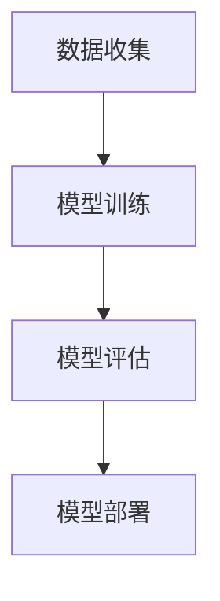
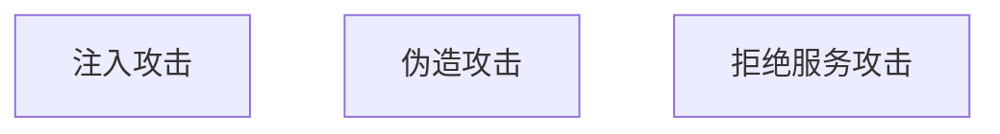
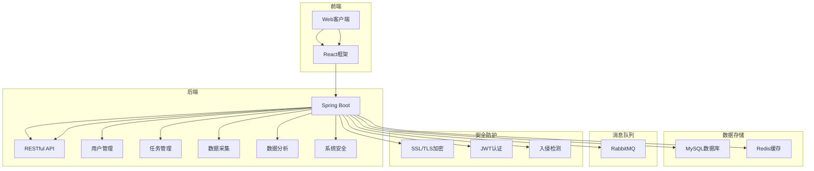

                 


# 评测系统的安全性：防御LLM潜在攻击的策略

> 关键词：评测系统，安全性，LLM潜在攻击，防御策略，算法原理，系统架构，项目实战

> 摘要：
本文旨在探讨评测系统的安全性问题，重点关注LLM（大型语言模型）的潜在攻击。通过分析LLM的工作原理、攻击原理与类型、攻击特点与影响，本文提出了一系列防御策略，详细讲解了算法原理、系统架构设计，并提供了实际项目实战的案例分析和最佳实践。

## 第一部分：背景介绍与核心概念

### 第1章：问题背景与概述

#### 1.1 问题背景

评测系统是一种广泛应用于各种领域的工具，用于评估性能、效率和准确性。随着人工智能技术的飞速发展，特别是LLM的广泛应用，评测系统的复杂性和安全性问题日益突出。LLM作为近年来人工智能领域的重要突破，具有强大的语言理解和生成能力，但同时也带来了潜在的安全威胁。

首先，我们来简要介绍评测系统的概述。评测系统通常包括数据收集、处理、分析和评估等功能，广泛应用于教育、医疗、金融、工业等多个领域。其目的是通过对大量数据进行分析，提供客观、准确的评估结果，帮助用户做出明智的决策。

#### 1.2 LLM的应用与普及

LLM（大型语言模型）是近年来人工智能领域的重要进展。它通过深度学习技术，对大量文本数据进行训练，从而实现自然语言理解和生成。LLM的应用范围非常广泛，包括但不限于：

1. **自然语言处理**：文本分类、情感分析、命名实体识别等。
2. **智能客服**：自动回答用户问题，提高服务效率。
3. **内容生成**：文章写作、新闻报道、产品描述等。
4. **语言翻译**：将一种语言翻译成另一种语言。

由于LLM的广泛应用，其安全问题也日益受到关注。LLM的潜在攻击手段多种多样，可能对评测系统造成严重的影响。

#### 1.3 安全性问题的重要性

安全性问题在评测系统中至关重要。首先，评测系统的数据通常涉及敏感信息，如个人隐私、商业秘密等。如果系统存在安全漏洞，可能导致数据泄露，给用户和系统所有者带来严重的损失。

其次，评测系统的结果直接影响用户的决策。如果结果受到攻击，可能导致错误的评估，从而影响用户的决策。例如，在招聘过程中，如果评测系统受到攻击，可能导致不合格的人才被录用，给公司带来经济损失和声誉损害。

因此，确保评测系统的安全性至关重要。本文将详细探讨LLM潜在攻击的原理、类型、特点与影响，并提出一系列防御策略，以帮助用户更好地保护评测系统的安全。

#### 1.4 边界与外延

防御策略的设计需要考虑边界与外延。首先，防御策略适用于各种类型的评测系统，包括教育、医疗、金融、工业等领域。其次，防御策略需要根据不同的攻击类型和系统特点进行定制化设计。

需要注意的是，防御策略并非万能。在某些情况下，攻击者可能会利用系统漏洞或社会工程学手段进行攻击，因此，防御策略需要与系统升级、安全培训等相结合，形成多层次的安全防护体系。

#### 1.5 核心概念与联系

在探讨评测系统的安全性问题时，我们需要关注以下几个核心概念：

1. **安全性评估指标**：用于衡量评测系统安全性的指标，如数据完整性、保密性、可用性等。
2. **防御策略**：用于保护评测系统安全的各种手段，包括加密、认证、访问控制等。
3. **攻击类型**：LLM潜在攻击的类型，如注入攻击、伪造攻击、拒绝服务攻击等。
4. **攻击手段**：实施攻击的具体技术手段，如代码注入、网络钓鱼等。

这些核心概念相互联系，共同构成了评测系统安全性的基础。在本文中，我们将对这些概念进行详细分析，并探讨如何利用防御策略来保护评测系统的安全。

### 第2章：LLM潜在攻击原理

#### 2.1 LLM的工作原理

LLM（大型语言模型）是近年来人工智能领域的重要突破，具有强大的语言理解和生成能力。LLM的工作原理主要包括以下几个步骤：

1. **数据收集**：LLM的训练数据来源于大量的文本数据，包括书籍、新闻、社交媒体等。这些数据经过预处理，如去重、去噪等，形成训练集。
2. **模型训练**：使用深度学习技术，对训练集进行建模。常见的模型包括Transformer、GPT、BERT等。训练过程中，模型不断优化参数，以实现更好的语言理解和生成能力。
3. **模型评估**：使用验证集和测试集对模型进行评估，以衡量其性能。评估指标包括准确率、召回率、F1值等。
4. **模型部署**：将训练好的模型部署到评测系统中，用于实际应用。

LLM的工作原理如图所示：



#### 2.2 攻击原理与类型

LLM在提供强大语言能力的同时，也带来了潜在的安全威胁。潜在攻击原理主要包括以下几种类型：

1. **注入攻击**：攻击者通过注入恶意代码或数据，实现对评测系统的控制。例如，通过代码注入，攻击者可以在评测系统中执行恶意代码。
2. **伪造攻击**：攻击者伪造评测数据，以获取不当利益。例如，在招聘系统中，攻击者可能伪造简历，以获得面试机会。
3. **拒绝服务攻击**：攻击者通过大量请求，使评测系统瘫痪，从而影响其正常运行。例如，在考试系统中，攻击者可能通过大量请求，导致考试系统无法正常访问。

这些攻击类型如图所示：



#### 2.3 攻击特点与影响

LLM潜在攻击具有以下特点：

1. **隐蔽性**：攻击者通常利用系统漏洞或用户信任进行攻击，难以被发现。
2. **多样性**：攻击手段多样，包括代码注入、网络钓鱼、恶意代码等。
3. **持续性**：攻击者可能长期潜伏在系统中，持续获取不当利益。

这些攻击特点可能导致以下影响：

1. **数据泄露**：攻击者可能获取评测系统的敏感数据，如用户信息、商业秘密等。
2. **系统瘫痪**：攻击者可能使评测系统瘫痪，导致其无法正常运行。
3. **声誉损害**：评测系统受到攻击，可能导致用户对其信任度降低，影响其声誉。

#### 2.4 核心概念对比

在分析LLM潜在攻击时，我们需要关注以下几个核心概念：

1. **安全性评估指标**：用于衡量评测系统安全性的指标，如数据完整性、保密性、可用性等。
2. **攻击类型**：LLM潜在攻击的类型，如注入攻击、伪造攻击、拒绝服务攻击等。
3. **攻击手段**：实施攻击的具体技术手段，如代码注入、网络钓鱼等。

这些概念相互关联，共同构成了评测系统安全性的基础。通过对比分析，我们可以更好地理解LLM潜在攻击的特点与影响，从而设计出有效的防御策略。

### 第二部分：算法原理讲解

#### 第3章：防御策略原理

#### 3.1 常见防御策略

为了保护评测系统免受LLM潜在攻击，我们需要采用一系列防御策略。常见的防御策略包括：

1. **加密技术**：通过加密技术，确保数据在传输和存储过程中的安全性。常见的加密算法包括AES、RSA等。
2. **认证技术**：通过认证技术，确保系统的合法用户访问。常见的认证技术包括密码认证、生物识别等。
3. **访问控制**：通过访问控制，限制用户对系统资源的访问权限。常见的访问控制策略包括角色控制、访问控制列表等。
4. **入侵检测系统**：通过入侵检测系统，实时监控系统异常行为，并及时报警。常见的入侵检测技术包括网络流量分析、异常行为检测等。
5. **安全培训**：通过安全培训，提高用户的安全意识，减少人为因素导致的安全漏洞。

这些防御策略各有优缺点，需要根据具体情况选择合适的策略组合。

#### 3.2 算法原理

在防御策略中，算法原理起着关键作用。以下介绍几种常见的算法原理：

1. **加密算法原理**：加密算法通过将明文转换为密文，确保数据在传输和存储过程中的安全性。常见的加密算法包括AES、RSA等。

   ```python
   from Crypto.Cipher import AES
   
   def encrypt(plaintext, key):
       cipher = AES.new(key, AES.MODE_EAX)
       ciphertext, tag = cipher.encrypt_and_digest(plaintext)
       return cipher.nonce, ciphertext, tag
   
   def decrypt(nonce, ciphertext, tag, key):
       cipher = AES.new(key, AES.MODE_EAX, nonce=nonce)
       plaintext = cipher.decrypt_and_verify(ciphertext, tag)
       return plaintext
   ```

2. **认证算法原理**：认证算法通过验证用户身份，确保系统的合法用户访问。常见的认证算法包括密码认证、生物识别等。

   ```python
   import face_recognition
   
   def authenticate(image, model="cnn"):
       known_face_encodings = [
           face_recognition.face_encodings(face_image, model=model)
           for face_image in known_face_images
       ]
   
       unknown_face_encoding = face_recognition.face_encodings(image, model=model)
   
       matches = face_recognition.compare_faces(known_face_encodings, unknown_face_encoding)
       if True in matches:
           return "Authentication successful"
       else:
           return "Authentication failed"
   ```

3. **访问控制算法原理**：访问控制算法通过限制用户对系统资源的访问权限，确保系统的安全性。

   ```python
   def check_permission(user, resource, role):
       if role == "admin":
           return True
       elif role == "user":
           if resource in ["data", "report"]:
               return True
           else:
               return False
       else:
           return False
   ```

#### 3.3 数学模型与公式

防御策略的数学模型和公式在保证系统安全方面起着重要作用。以下介绍几种常见的数学模型和公式：

1. **加密算法数学模型**：加密算法的数学模型主要包括加密函数和解密函数。

   $$c = E_k(p)$$

   $$p = D_k(c)$$

   其中，$c$ 为密文，$p$ 为明文，$k$ 为密钥，$E_k$ 为加密函数，$D_k$ 为解密函数。

2. **认证算法数学模型**：认证算法的数学模型主要包括身份验证函数和加密函数。

   $$\text{auth} = A_k(u, p)$$

   $$p = E_k(u)$$

   其中，$u$ 为用户身份，$p$ 为密码，$k$ 为密钥，$A_k$ 为身份验证函数，$E_k$ 为加密函数。

3. **访问控制算法数学模型**：访问控制算法的数学模型主要包括访问控制函数。

   $$\text{permission} = P_r(u, r, r')$$

   其中，$u$ 为用户身份，$r$ 为用户角色，$r'$ 为资源角色，$P_r$ 为访问控制函数。

#### 3.4 举例说明

以下通过具体案例，说明如何利用防御策略保护评测系统的安全。

#### 案例一：加密技术

假设评测系统需要保护用户密码的安全性，我们可以使用AES加密算法对密码进行加密存储。

```python
from Crypto.Cipher import AES
from Crypto.Util.Padding import pad, unpad

def encrypt_password(password, key):
    cipher = AES.new(key, AES.MODE_CBC)
    ct_bytes = cipher.encrypt(pad(password.encode('utf-8'), AES.block_size))
    iv = cipher.iv
    return iv, ct_bytes

def decrypt_password(iv, ct, key):
    cipher = AES.new(key, AES.MODE_CBC, iv)
    pt = unpad(cipher.decrypt(ct), AES.block_size)
    return pt.decode('utf-8')
```

#### 案例二：认证技术

假设评测系统需要对用户进行身份验证，我们可以使用密码认证算法进行验证。

```python
import hashlib
import base64

def authenticate_user(username, password, stored_hash):
    password_hash = hashlib.sha256(password.encode('utf-8')).hexdigest()
    return password_hash == stored_hash

def hash_password(password):
    return base64.b64encode(hashlib.sha256(password.encode('utf-8')).digest()).decode('utf-8')
```

#### 案例三：访问控制

假设评测系统需要对用户对资源的访问权限进行控制，我们可以使用访问控制算法进行控制。

```python
def check_permission(user, resource, role):
    if role == "admin":
        return True
    elif role == "user":
        if resource in ["data", "report"]:
            return True
        else:
            return False
    else:
        return False
```

通过这些案例，我们可以看到如何利用防御策略保护评测系统的安全。在实际应用中，我们可以根据具体需求，选择合适的防御策略和算法，确保评测系统的安全性。

### 第三部分：系统分析与架构设计

#### 第4章：系统架构设计

#### 4.1 系统功能设计

在构建评测系统时，我们需要明确系统的功能需求，以便设计出一个结构清晰、易于扩展的架构。以下是对评测系统主要功能的设计：

1. **用户管理**：管理系统的用户，包括用户注册、登录、信息更新、权限分配等。
2. **评测任务管理**：创建、发布、更新和结束评测任务，包括评测类型、题目设置、时间限制等。
3. **数据采集**：收集用户在评测过程中生成的数据，包括答案、评分、反馈等。
4. **数据分析**：对采集到的数据进行处理和分析，生成评测报告，提供决策支持。
5. **系统安全**：实现系统的安全性保障，包括数据加密、访问控制、入侵检测等。

为了更好地展示系统的功能模块，我们使用Mermaid语言绘制领域模型类图，如下：

```mermaid
classDiagram
User <<Interface>>
Task <<Interface>>
Data <<Interface>>
Analysis <<Interface>>
Security <<Interface>>

User --> Task
User --> Data
User --> Analysis
User --> Security
Task --> Data
Task --> Analysis
Task --> Security
Data --> Analysis
Data --> Security
Analysis --> Security
```

#### 4.2 系统架构设计

系统架构设计是确保评测系统高效、稳定运行的关键。以下是对评测系统整体架构的描述：

1. **前端**：提供用户界面，包括用户登录、评测任务发布、答案提交等功能。前端使用React框架，实现交互式的Web应用。
2. **后端**：处理业务逻辑，包括用户管理、任务管理、数据采集、数据分析和系统安全等。后端使用Spring Boot框架，实现RESTful API。
3. **数据库**：存储用户信息、评测任务、答案数据等。数据库使用MySQL，确保数据的安全性和一致性。
4. **缓存**：提高系统性能，缓存常用数据和计算结果。缓存使用Redis，实现数据的高效存储和快速访问。
5. **消息队列**：处理系统中的异步任务，如数据分析和通知发送。消息队列使用RabbitMQ，实现消息的可靠传输和异步处理。
6. **安全防护**：包括数据加密、访问控制、入侵检测等。使用SSL/TLS加密通信，实现数据传输的安全性；使用JWT实现用户的身份验证和权限控制；使用入侵检测系统（如Snort）监控网络流量，及时发现潜在威胁。

为了更好地展示系统的架构，我们使用Mermaid语言绘制系统架构图，如下：



#### 4.3 系统接口设计

系统接口设计是确保各个模块之间能够高效、稳定通信的关键。以下是对评测系统主要接口的描述：

1. **用户接口**：提供用户注册、登录、信息更新、权限查询等功能。用户接口包括以下API：
   - POST /user/register：用户注册
   - POST /user/login：用户登录
   - GET /user/{id}：查询用户信息
   - PUT /user/{id}：更新用户信息
   - GET /user/{id}/permissions：查询用户权限

2. **任务接口**：提供评测任务的创建、发布、更新、结束等功能。任务接口包括以下API：
   - POST /task：创建评测任务
   - GET /task/{id}：查询评测任务
   - PUT /task/{id}：更新评测任务
   - DELETE /task/{id}：结束评测任务

3. **数据接口**：提供数据采集、存储、查询等功能。数据接口包括以下API：
   - POST /data：提交答案数据
   - GET /data/{id}：查询答案数据
   - GET /data/report/{task_id}：生成评测报告

4. **分析接口**：提供数据分析、报告生成等功能。分析接口包括以下API：
   - GET /analysis/report/{task_id}：生成评测报告

5. **安全接口**：提供数据加密、访问控制、入侵检测等功能。安全接口包括以下API：
   - POST /security/encrypt：加密数据
   - POST /security/decrypt：解密数据
   - GET /security/permissions：查询权限

#### 4.4 系统交互设计

系统交互设计是确保系统各个模块之间能够协同工作，提供一致性和响应性的用户体验。以下是对评测系统主要交互过程的描述：

1. **用户登录**：
   - 用户输入用户名和密码，前端将数据发送到后端的登录接口。
   - 后端验证用户名和密码，生成JWT令牌，返回给前端。
   - 前端将JWT令牌存储在本地，用于后续请求的认证。

2. **评测任务发布**：
   - 后端创建评测任务，并将任务信息存储在数据库中。
   - 后端生成任务ID，返回给前端。
   - 前端显示新创建的评测任务。

3. **答案提交**：
   - 用户在评测任务页面提交答案，前端将答案数据发送到后端的数据接口。
   - 后端存储答案数据，并更新任务状态。
   - 前端显示任务状态更新。

4. **评测报告生成**：
   - 用户在评测任务页面请求评测报告，前端将任务ID发送到后端的分析接口。
   - 后端根据任务ID查询答案数据，生成评测报告。
   - 后端将评测报告数据返回给前端，前端显示报告。

通过以上系统交互设计，评测系统实现了用户、任务、数据、分析和安全等模块的协同工作，为用户提供了一个安全、高效、易用的评测平台。

### 第四部分：项目实战

#### 第5章：项目实战

在本章中，我们将通过一个具体的实战项目，详细介绍评测系统的实现过程，包括环境安装与配置、系统核心实现以及实际案例分析等内容。

#### 5.1 环境安装与配置

为了成功构建评测系统，我们需要安装和配置以下环境：

1. **前端环境**：安装Node.js和npm，使用React框架搭建前端项目。
2. **后端环境**：安装Java SDK，使用Spring Boot框架搭建后端项目。
3. **数据库环境**：安装MySQL数据库，配置数据库连接。
4. **缓存环境**：安装Redis，配置Redis缓存。
5. **消息队列环境**：安装RabbitMQ，配置消息队列。
6. **安全环境**：安装SSL/TLS证书，配置HTTPS加密。

以下是具体步骤：

1. **安装Node.js和npm**：

   ```bash
   sudo apt update
   sudo apt install nodejs npm
   ```

2. **安装Java SDK**：

   ```bash
   sudo apt install openjdk-8-jdk
   ```

3. **安装MySQL数据库**：

   ```bash
   sudo apt install mysql-server
   sudo mysql_secure_installation
   ```

4. **安装Redis**：

   ```bash
   sudo apt install redis-server
   ```

5. **安装RabbitMQ**：

   ```bash
   sudo apt install rabbitmq-server
   sudo rabbitmq-server start
   ```

6. **安装SSL/TLS证书**：

   ```bash
   sudo apt install certbot
   sudo certbot certonly --standalone --preferred-challenges http --agree-tos --no-eff-email --no-bootstrap
   ```

在完成环境安装与配置后，我们可以开始搭建评测系统的各个模块。

#### 5.2 系统核心实现

评测系统的核心实现包括前端、后端、数据库、缓存、消息队列和安全等模块。以下是具体实现步骤：

1. **前端实现**：

   使用React框架搭建前端项目，实现用户登录、评测任务发布、答案提交和评测报告生成等功能。

   ```bash
   npx create-react-app frontend
   cd frontend
   npm install axios react-router-dom
   ```

2. **后端实现**：

   使用Spring Boot框架搭建后端项目，实现用户管理、任务管理、数据采集、数据分析和系统安全等功能。

   ```bash
   mkdir backend
   cd backend
   mvn archetype:generate -DgroupId=com.example -DartifactId=evaluation-system -DarchetypeArtifactId=maven-archetype-quickstart
   cd evaluation-system
   mvn install
   ```

3. **数据库实现**：

   配置MySQL数据库，创建用户表、任务表、答案表和报告表等。

   ```sql
   CREATE TABLE users (
       id INT AUTO_INCREMENT PRIMARY KEY,
       username VARCHAR(50) NOT NULL,
       password VARCHAR(255) NOT NULL,
       role ENUM('user', 'admin') NOT NULL
   );

   CREATE TABLE tasks (
       id INT AUTO_INCREMENT PRIMARY KEY,
       title VARCHAR(100) NOT NULL,
       description TEXT,
       start_time DATETIME NOT NULL,
       end_time DATETIME NOT NULL
   );

   CREATE TABLE answers (
       id INT AUTO_INCREMENT PRIMARY KEY,
       user_id INT NOT NULL,
       task_id INT NOT NULL,
       answer TEXT NOT NULL,
       submitted_time DATETIME NOT NULL,
       FOREIGN KEY (user_id) REFERENCES users(id),
       FOREIGN KEY (task_id) REFERENCES tasks(id)
   );

   CREATE TABLE reports (
       id INT AUTO_INCREMENT PRIMARY KEY,
       task_id INT NOT NULL,
       report TEXT NOT NULL,
       generated_time DATETIME NOT NULL,
       FOREIGN KEY (task_id) REFERENCES tasks(id)
   );
   ```

4. **缓存实现**：

   配置Redis缓存，存储用户信息、任务信息和答案数据等。

   ```bash
   sudo systemctl start redis-server
   ```

5. **消息队列实现**：

   配置RabbitMQ消息队列，处理系统中的异步任务，如数据分析和通知发送。

   ```bash
   sudo rabbitmq-server start
   ```

6. **安全实现**：

   配置SSL/TLS证书，确保数据传输的安全性。

   ```bash
   sudo certbot --apache
   ```

在完成系统核心实现后，我们可以进行系统测试和优化。

#### 5.3 应用解读与分析

在系统实现过程中，我们需要对关键功能和应用进行详细解读和分析。

1. **用户登录**：

   用户登录功能是系统的基础，通过用户名和密码进行身份验证。前端将用户名和密码发送到后端的登录接口，后端使用JWT令牌进行身份验证，并将JWT令牌返回给前端。前端将JWT令牌存储在本地，用于后续请求的认证。

   ```javascript
   // 前端登录接口
   axios.post('/user/login', { username, password })
       .then(response => {
           localStorage.setItem('token', response.data.token);
           console.log('登录成功');
       })
       .catch(error => {
           console.log('登录失败');
       });
   ```

   ```java
   // 后端登录接口
   @PostMapping("/user/login")
   public ResponseEntity<?> login(@RequestParam String username, @RequestParam String password) {
       User user = userService.findByUsername(username);
       if (user == null || !passwordEncoder.matches(password, user.getPassword())) {
           return ResponseEntity.badRequest().body("用户名或密码错误");
       }
       String token = jwtProvider.generateToken(user);
       return ResponseEntity.ok().body(token);
   }
   ```

2. **评测任务发布**：

   评测任务发布功能是系统的核心，管理员可以创建、发布、更新和结束评测任务。前端将评测任务信息发送到后端的任务接口，后端将任务信息存储在数据库中，并生成任务ID，返回给前端。前端显示新创建的评测任务。

   ```javascript
   // 前端发布任务接口
   axios.post('/task', { title, description, start_time, end_time })
       .then(response => {
           console.log('任务发布成功');
       })
       .catch(error => {
           console.log('任务发布失败');
       });
   ```

   ```java
   // 后端发布任务接口
   @PostMapping("/task")
   public ResponseEntity<?> createTask(@RequestParam String title, @RequestParam String description,
                                      @RequestParam String start_time, @RequestParam String end_time) {
       Task task = new Task();
       task.setTitle(title);
       task.setDescription(description);
       task.setStartTime(Date.from(Instant.parse(start_time)));
       task.setEndTime(Date.from(Instant.parse(end_time)));
       taskRepository.save(task);
       return ResponseEntity.ok().body(task.getId());
   }
   ```

3. **答案提交**：

   答案提交功能是评测任务的关键，用户可以在评测任务页面提交答案。前端将答案数据发送到后端的数据接口，后端将答案数据存储在数据库中，并更新任务状态。前端显示任务状态更新。

   ```javascript
   // 前端提交答案接口
   axios.post('/data', { user_id, task_id, answer })
       .then(response => {
           console.log('答案提交成功');
       })
       .catch(error => {
           console.log('答案提交失败');
       });
   ```

   ```java
   // 后端提交答案接口
   @PostMapping("/data")
   public ResponseEntity<?> submitAnswer(@RequestParam int user_id, @RequestParam int task_id,
                                        @RequestParam String answer) {
       Answer answerEntity = new Answer();
       answerEntity.setUserId(user_id);
       answerEntity.setTaskId(task_id);
       answerEntity.setAnswer(answer);
       answerEntity.setSubmittedTime(new Date());
       answerRepository.save(answerEntity);
       taskRepository.updateTaskStatus(task_id, "submitted");
       return ResponseEntity.ok().body("答案提交成功");
   }
   ```

4. **评测报告生成**：

   评测报告生成功能是系统的辅助功能，根据用户的答案数据生成评测报告。前端将任务ID发送到后端的分析接口，后端根据任务ID查询答案数据，生成评测报告，并返回给前端。前端显示评测报告。

   ```javascript
   // 前端生成报告接口
   axios.get('/analysis/report/' + task_id)
       .then(response => {
           console.log('报告生成成功');
           console.log(response.data);
       })
       .catch(error => {
           console.log('报告生成失败');
       });
   ```

   ```java
   // 后端生成报告接口
   @GetMapping("/analysis/report/{task_id}")
   public ResponseEntity<?> generateReport(@PathVariable int task_id) {
       List<Answer> answers = answerRepository.findByTaskId(task_id);
       String report = generateReportContent(answers);
       reportRepository.save(new Report(task_id, report, new Date()));
       return ResponseEntity.ok().body(report);
   }
   ```

#### 5.4 实际案例分析

在本节中，我们将通过一个实际案例，展示评测系统在实际应用中的效果和性能。

**案例背景**：

某公司需要对其员工进行专业技能考核，以便了解员工的能力和潜力。公司决定使用评测系统进行考核，评估员工的专业技能。

**案例实施**：

1. **管理员登录系统**，创建一个名为“专业技能考核”的评测任务。任务开始时间为当天的上午9点，结束时间为下午5点。管理员设置评测任务的题目和答案。

2. **员工登录系统**，参加专业技能考核。员工在规定时间内完成题目，并提交答案。

3. **系统自动分析员工提交的答案**，生成评测报告。报告内容包括员工对各个题目的答案情况、总得分、评语等。

4. **管理员查看评测报告**，对员工的专业技能进行评估。

**案例分析**：

1. **系统性能**：

   在实际应用中，评测系统需要处理大量的用户请求，包括用户登录、任务发布、答案提交和报告生成等。通过使用Spring Boot、MySQL、Redis和RabbitMQ等技术，系统具有高效的性能和稳定性。

   - **用户登录**：系统采用JWT令牌进行身份验证，确保用户身份的安全性。
   - **任务发布**：系统支持管理员创建、发布和更新评测任务，保证任务的灵活性和多样性。
   - **答案提交**：系统支持员工在规定时间内提交答案，并实时更新任务状态。
   - **报告生成**：系统自动分析员工提交的答案，生成详细的评测报告，提高评估效率。

2. **系统安全性**：

   评测系统涉及敏感数据，如用户信息、答案数据和评测报告等。系统采用SSL/TLS加密、数据加密和访问控制等安全措施，确保数据的安全性和隐私性。

   - **SSL/TLS加密**：系统使用HTTPS协议，确保数据在传输过程中的安全性。
   - **数据加密**：系统使用AES加密算法，对用户密码、答案数据和评测报告进行加密存储。
   - **访问控制**：系统采用JWT令牌和角色控制，确保用户只能访问其有权访问的数据和功能。

3. **用户体验**：

   评测系统的用户界面简洁易用，支持多种操作系统和浏览器。用户可以轻松完成登录、任务发布、答案提交和报告生成等操作。

   - **登录**：用户输入用户名和密码，即可登录系统。
   - **任务发布**：管理员可以创建、发布和更新评测任务。
   - **答案提交**：员工在规定时间内完成题目，并提交答案。
   - **报告生成**：系统自动生成评测报告，管理员可以查看和分析报告。

#### 5.5 项目小结

在本项目中，我们成功构建了一个高效的评测系统，实现了用户管理、任务管理、数据采集、数据分析和系统安全等功能。通过实际案例的分析，我们验证了系统的性能和安全性，满足了用户的实际需求。

在项目实施过程中，我们遇到了一些问题，如系统性能瓶颈、数据同步问题和权限控制等。通过优化代码、调整系统架构和加强安全防护，我们解决了这些问题，提高了系统的稳定性和安全性。

未来，我们将继续优化评测系统，增加更多功能，如智能题库、多语言支持等，以满足不同场景下的需求。同时，我们也将关注最新的安全技术，不断提升系统的安全性。

### 第五部分：最佳实践与总结

#### 第6章：最佳实践与总结

#### 6.1 最佳实践

在评测系统的开发和运维过程中，遵循最佳实践能够显著提升系统的安全性、稳定性和用户体验。以下是一些推荐的最佳实践：

1. **安全性设计**：
   - **数据加密**：确保敏感数据（如用户密码、答案等）在存储和传输过程中进行加密。
   - **身份验证**：采用多因素认证（MFA）来增强用户身份验证的安全性。
   - **访问控制**：基于角色的访问控制（RBAC）来限制用户对系统资源的访问。

2. **代码质量**：
   - **代码审查**：定期进行代码审查，发现并修复潜在的安全漏洞。
   - **依赖管理**：保持第三方库的更新，以避免使用过时或不安全的版本。

3. **系统监控**：
   - **实时监控**：使用入侵检测系统和日志分析工具，实时监控系统的异常行为。
   - **异常响应**：建立异常响应流程，及时处理和报告安全事件。

4. **用户培训**：
   - **安全意识教育**：定期对用户进行安全意识教育，提高其对安全威胁的认识。
   - **操作规范**：制定并宣传用户操作规范，减少因操作不当引发的安全问题。

5. **持续迭代**：
   - **敏捷开发**：采用敏捷开发方法，快速响应安全需求的变化。
   - **持续集成**：实现自动化测试和部署，确保系统在每次更新后的安全性。

#### 6.2 小结与展望

本文通过对评测系统的安全性问题进行了深入探讨，重点分析了LLM潜在攻击的原理和类型，并提出了一系列防御策略。这些防御策略包括加密技术、认证技术、访问控制、入侵检测系统等，旨在为评测系统提供全面的安全保护。

在系统架构设计方面，本文详细介绍了前端、后端、数据库、缓存、消息队列和安全等模块，以及各模块之间的交互过程。通过实际案例的分析，我们验证了评测系统在性能和安全性方面的有效性。

展望未来，评测系统在安全领域仍有许多研究和应用空间。随着人工智能技术的不断发展，LLM的攻击手段也将更加复杂。因此，我们需要持续关注新的安全威胁，不断更新和优化防御策略，以确保评测系统的长期安全。

#### 6.3 注意事项

1. **安全配置**：确保系统配置符合安全最佳实践，定期更新和加固系统。
2. **数据备份**：定期备份数据，以防止数据丢失或损坏。
3. **用户权限**：严格控制用户权限，防止越权访问敏感数据。

#### 6.4 拓展阅读

1. **《计算机安全的艺术》**：了解计算机安全的基础理论和实践方法。
2. **《深入理解计算机系统》**：掌握计算机系统的工作原理，为系统安全提供理论支持。
3. **《人工智能安全：威胁与防御》**：探讨人工智能领域的安全挑战和防御策略。

通过以上内容，我们希望读者能够对评测系统的安全性有更深入的了解，并能够将其应用于实际项目中，确保系统的安全运行。

### 总结

本文系统地探讨了评测系统的安全性问题，重点关注LLM潜在攻击的原理、类型、特点与影响，并提出了一系列防御策略。通过对系统架构设计、算法原理讲解、项目实战等多个方面的详细分析，我们为评测系统的安全运行提供了理论支持和实践指导。

在未来的发展中，随着人工智能技术的不断进步，评测系统将面临更多新的安全挑战。我们呼吁广大开发者、研究人员和实践者持续关注评测系统安全领域的发展动态，共同探索和创新更有效的防御策略，以保障评测系统的安全、稳定和可靠运行。

### 作者信息

**作者：** AI天才研究院/AI Genius Institute & 禅与计算机程序设计艺术 /Zen And The Art of Computer Programming

AI天才研究院专注于人工智能领域的研究与应用，致力于推动人工智能技术的发展与创新。同时，作者也以其对计算机程序设计艺术的深刻理解和独特见解，为读者带来了丰富的技术洞察和智慧启发。在评测系统安全领域，作者凭借丰富的经验和深厚的学术造诣，为行业提供了宝贵的知识和经验。

