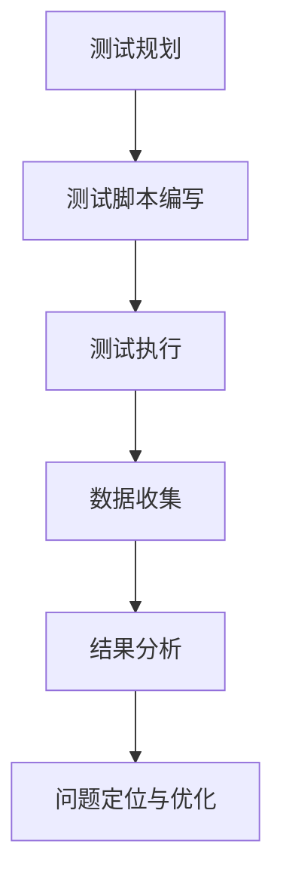
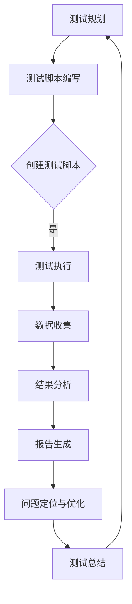
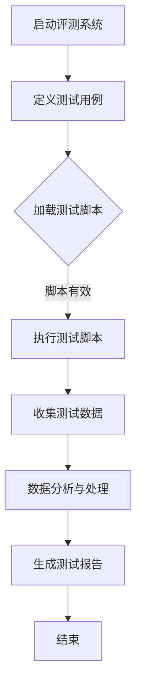
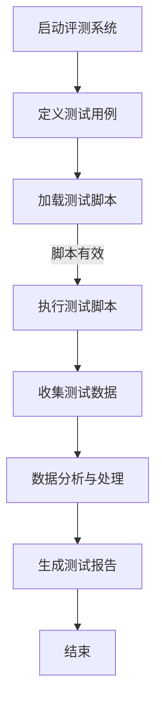
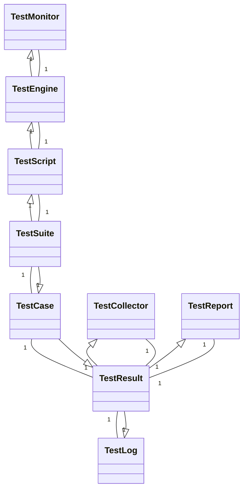
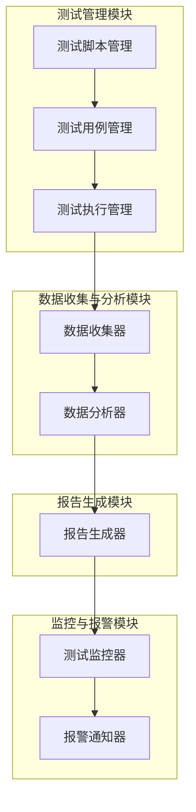

                 


# 引言

## 1.1 书籍背景与目的

在信息技术飞速发展的今天，评测系统已经成为诸多行业不可或缺的一部分。评测系统在性能测试、压力测试、安全测试等多个领域都有着广泛的应用，能够有效提升系统稳定性和用户体验。然而，评测系统的开发与维护需要大量的技术资源和专业人才，这对于许多企业和开发者来说是一个巨大的挑战。

开源运动在过去几十年里已经深刻影响了软件开发行业，它推动了软件技术的发展和创新，降低了技术门槛，促进了软件共享和合作。开源评测系统作为一种新兴的软件形式，不仅继承了开源软件的优势，还为评测系统领域带来了新的活力。

本书旨在探讨评测系统的开源贡献，尤其是开源评测系统如何推动行业标准化。我们首先介绍评测系统的基本概念、开源运动的影响以及行业标准化的需求，然后逐步深入探讨开源评测系统的核心概念、算法原理、系统架构设计、实际案例研究以及最佳实践。通过本书，读者可以全面了解开源评测系统的原理、应用和发展趋势，为自身的工作和项目提供有价值的参考。

## 1.2 本书结构概述

本书共分为六个部分，每一部分都针对评测系统的不同方面进行深入探讨。

### 1.2.1 核心内容

- **第一部分：评测系统基础**：介绍评测系统的定义、分类、基本原理以及开源评测系统的概述，为后续内容奠定基础。
- **第二部分：核心概念与联系**：详细阐述开源评测系统的核心概念及其属性特征，并通过图表展示这些概念之间的关系。
- **第三部分：算法原理讲解**：使用Mermaid流程图、Python源代码和数学模型，深入讲解评测系统的算法原理。
- **第四部分：系统分析与架构设计**：从问题场景介绍、系统功能设计、系统架构设计、系统接口设计到系统交互，全面分析开源评测系统的设计思路。
- **第五部分：案例研究**：通过具体的开源评测系统案例，分析其实施细节、效果评估和经验总结。
- **第六部分：最佳实践**：总结开源评测系统的最佳实践，提供实用的操作建议。

### 1.2.2 章节安排

- **第一章：引言**：介绍书籍的背景、目的和结构。
- **第二章：评测系统基础**：介绍评测系统的基本知识和开源评测系统的概述。
- **第三章：核心概念与联系**：详细阐述开源评测系统的核心概念及其属性特征。
- **第四章：算法原理讲解**：讲解评测系统的算法原理，并提供Mermaid流程图和Python源代码。
- **第五章：系统分析与架构设计**：分析开源评测系统的系统架构和设计思路。
- **第六章：案例研究**：分析具体的开源评测系统案例，提供实施细节和效果评估。
- **第七章：最佳实践**：总结开源评测系统的最佳实践，提供操作建议。

### 1.2.3 阅读建议

- **通读全书**：建议读者从第一部分开始，逐步阅读全书，以全面了解开源评测系统的原理和应用。
- **重点章节**：对于初学者，建议重点阅读第一部分和第二部分，以建立对评测系统的基本认识。
- **实践应用**：在阅读过程中，可以结合实际项目或工作场景，思考如何应用开源评测系统，提升自己的技术能力。
- **深入探讨**：对于有经验的开发者，可以深入阅读第三部分至第六部分，了解开源评测系统的详细设计和实现。

通过本书的阅读，读者不仅可以了解开源评测系统的基本原理和应用，还可以学会如何通过开源评测系统推动行业标准化，为自己的职业发展和技术创新提供有力支持。

# 第一部分: 评测系统基础

## 2.1 评测系统的定义与分类

评测系统是一种用于评估计算机系统性能、稳定性和可靠性的软件工具。它通过对系统的运行情况进行监控、测试和评估，提供一系列关键指标，以便开发者和管理者了解系统的状态和性能表现。评测系统在软件开发、运维管理、性能优化等多个领域发挥着重要作用。

### 2.1.1 评测系统的基本概念

评测系统通常包含以下几个基本概念：

1. **性能测试**：通过模拟用户行为，评估系统的响应时间、吞吐量、并发处理能力等性能指标。
2. **压力测试**：在极端条件下对系统进行测试，评估系统在压力情况下的稳定性和性能表现。
3. **安全测试**：评估系统在面临恶意攻击或异常情况时的安全性能。
4. **负载测试**：模拟实际用户负载，评估系统在高负载情况下的性能和稳定性。
5. **容量测试**：评估系统在增加硬件资源或用户数量时的性能变化。

### 2.1.2 评测系统的分类

根据测试目的和测试方法的不同，评测系统可以分为以下几类：

1. **功能评测系统**：主要针对系统功能进行测试，确保所有功能按照预期正常工作。
2. **性能评测系统**：专注于系统性能的评估，包括响应时间、吞吐量、并发处理能力等。
3. **压力评测系统**：模拟极端负载条件，测试系统在高负载下的稳定性和性能。
4. **安全评测系统**：评估系统在面临恶意攻击或异常情况时的安全性。
5. **综合评测系统**：结合多种测试类型，对系统的功能、性能、安全等多方面进行全面评估。

### 2.1.3 评测系统的组成部分

一个典型的评测系统通常由以下几个部分组成：

1. **测试框架**：提供测试脚本、测试用例管理和执行等功能，用于构建和运行测试。
2. **测试引擎**：负责执行测试脚本，模拟用户行为，收集测试数据。
3. **测试数据收集器**：收集系统运行过程中的各种数据，如响应时间、吞吐量、错误率等。
4. **报告生成器**：根据测试结果生成详细的测试报告，便于分析系统性能和问题。
5. **监控工具**：实时监控系统的运行状态，提供实时性能数据，辅助测试和优化。

## 2.2 评测系统的基本原理

评测系统的基本原理可以概括为以下几个步骤：

1. **测试规划**：确定测试目标、测试范围和测试策略，制定详细的测试计划。
2. **测试脚本编写**：根据测试计划编写测试脚本，包括测试用例、测试条件和测试步骤等。
3. **测试执行**：执行测试脚本，模拟用户行为，对系统进行测试。
4. **数据收集**：在测试执行过程中，实时收集系统性能数据，包括响应时间、吞吐量、并发处理能力等。
5. **结果分析**：对收集到的测试数据进行统计分析，评估系统的性能表现和稳定性。
6. **问题定位与优化**：根据测试结果，定位系统中的问题和瓶颈，进行性能优化和改进。

### 2.2.1 评测系统的原理概述

评测系统的原理概述可以用以下简单的流程图表示：



### 2.2.2 评测指标的选取

评测系统的核心在于指标的选取，这些指标反映了系统的性能和稳定性。常见的评测指标包括：

1. **响应时间**：系统处理请求所需要的时间，是衡量系统性能的重要指标。
2. **吞吐量**：单位时间内系统处理的请求数量，反映了系统的并发处理能力。
3. **并发用户数**：同时访问系统的用户数量，用于评估系统的并发处理能力。
4. **错误率**：系统在处理请求过程中出现的错误比例，反映了系统的稳定性。
5. **资源利用率**：系统资源（如CPU、内存、磁盘等）的利用率，用于评估系统资源分配的合理性。

### 2.2.3 评测过程的流程图

下面是评测系统过程的mermaid流程图：



## 2.3 开源评测系统概述

开源评测系统是指将评测系统的源代码公开，允许其他开发者自由使用、修改和分享的软件。开源评测系统不仅继承了开源软件的开放性、共享性和合作性，还因其灵活性和可定制性而备受开发者青睐。

### 2.3.1 开源评测系统的定义

开源评测系统是一种开源软件，它遵循特定的开源协议（如GPL、Apache等），允许用户自由使用、修改和分享。开源评测系统通常包括以下特点：

- **源代码公开**：系统的源代码可以被用户自由查看和下载。
- **可定制性**：用户可以根据需求修改系统功能和行为。
- **社区协作**：开发者和用户可以共同参与系统的开发和优化。
- **可持续性**：开源评测系统通常拥有稳定的社区支持和长期的发展前景。

### 2.3.2 开源评测系统的优势

开源评测系统相较于商业评测系统具有以下优势：

1. **成本效益**：开源评测系统无需支付高额的软件许可费用，降低了企业的使用成本。
2. **灵活性**：开源评测系统允许用户根据需求进行定制化开发，提高了系统的适用性和灵活性。
3. **社区支持**：开源评测系统通常拥有活跃的社区，用户可以轻松获取技术支持和帮助。
4. **可持续性**：开源评测系统因其社区支持和用户参与，通常具有较长的发展寿命。
5. **技术创新**：开源评测系统鼓励开发者进行创新和优化，推动了评测系统技术的发展。

### 2.3.3 开源评测系统的现状

目前，开源评测系统在性能测试、安全测试、负载测试等多个领域已经有了广泛的应用。一些知名的开源评测系统包括：

1. **JMeter**：一款功能强大的开源性能测试工具，广泛用于Web应用程序的性能测试。
2. **Gatling**：一款高性能的负载测试工具，适用于Web服务和RESTful API的性能测试。
3. **OWASP ZAP**：一款开源的网络安全测试工具，用于评估Web应用程序的安全性。
4. **LoadRunner**：一款商业负载测试工具，部分功能也开源，适用于企业级性能测试。

随着开源评测系统的发展，越来越多的开发者开始关注和参与开源评测系统的开发，推动了评测系统技术的不断进步。

## 2.4 行业标准化的重要性

在信息技术领域，行业标准化是确保技术互操作性和兼容性的关键。行业标准化不仅有助于提高系统的可靠性、安全性和性能，还能降低开发成本、促进技术交流和创新。

### 2.4.1 行业标准化的定义

行业标准化是指在某个行业内，通过制定和遵循一系列标准，规范产品的设计、生产、测试和运营过程。这些标准通常由行业协会、标准组织或政府机构制定，并得到行业内各方的广泛认可和遵循。

### 2.4.2 行业标准化的作用

行业标准化在多个方面发挥着重要作用：

1. **提高可靠性**：通过制定统一的测试标准，确保系统在不同环境和条件下的一致性和可靠性。
2. **增强兼容性**：通过标准化的接口和协议，实现不同系统和组件之间的无缝连接和互操作。
3. **降低开发成本**：遵循标准化规范，可以减少重复设计和开发的工作量，提高开发效率。
4. **促进技术交流**：标准化的技术规范和文档，有助于行业内不同组织之间的技术交流和合作。
5. **推动技术创新**：通过制定适应新技术发展的标准，激发企业和技术人员的创新热情。

### 2.4.3 开源与标准化的关系

开源运动与行业标准化密切相关，两者相辅相成。开源评测系统不仅继承了开源软件的优势，如开放性、灵活性和合作性，还为行业标准化提供了宝贵的实践经验和案例。

1. **开源推动标准化**：开源评测系统通过其开放性和社区参与，为标准制定提供了实际应用案例和技术基础。开源项目的社区讨论和反馈，有助于发现和解决标准制定过程中可能存在的问题。
2. **标准化促进开源**：行业标准的制定和推广，有助于提高开源评测系统的互操作性和兼容性，降低用户的使用门槛。同时，标准化的规范和文档，也为开源开发者提供了明确的开发方向和技术指南。

### 2.4.4 行业标准化在评测系统中的应用

在评测系统领域，行业标准化主要体现在以下几个方面：

1. **测试方法标准化**：通过制定统一的测试方法，确保不同系统之间的测试结果具有可比性。例如，性能测试标准、安全测试标准等。
2. **测试数据标准化**：制定统一的测试数据格式和标准，便于不同评测系统之间的数据交换和分析。
3. **接口和协议标准化**：通过制定统一的接口和协议，实现评测系统与其他系统和工具的无缝集成和互操作。
4. **报告格式标准化**：制定统一的报告格式，确保评测结果的清晰展示和方便比较。

总之，行业标准化在评测系统中的应用，不仅提高了系统的可靠性和兼容性，还为开源评测系统的发展提供了有力支持。

## 3.1 开源评测系统的核心概念

在深入探讨开源评测系统的原理和设计之前，首先需要了解其核心概念及其属性特征。开源评测系统的核心概念包括但不限于以下几部分：

### 3.1.1 测试脚本

测试脚本是指编写用于执行特定测试任务的代码或命令序列。测试脚本可以由开发者或测试工程师编写，用于模拟用户行为、生成测试数据、执行测试用例等。测试脚本在开源评测系统中起到了至关重要的作用，因为它们可以灵活地定制和扩展，以适应不同的测试需求。

**属性特征：**
- **可定制性**：测试脚本可以根据具体测试需求进行定制，以实现不同的测试目的。
- **可扩展性**：测试脚本可以通过编写插件或模块的方式，扩展其功能，以适应更复杂的测试场景。
- **兼容性**：测试脚本通常需要与不同的操作系统、数据库和Web服务兼容。

### 3.1.2 测试用例

测试用例是指一组用于验证系统功能的测试输入和预期输出。每个测试用例都描述了一个特定的测试场景，包括测试步骤、测试数据和预期结果。测试用例是评测系统测试过程的核心，用于确保系统功能按照预期正常工作。

**属性特征：**
- **可复用性**：测试用例可以复用于多个测试环境中，提高测试效率和一致性。
- **可维护性**：测试用例的修改和维护相对容易，可以根据需求的变化进行调整。
- **覆盖性**：测试用例的设计需要覆盖系统的所有功能模块，以确保全面测试。

### 3.1.3 测试结果分析

测试结果分析是指对测试执行过程中收集到的数据进行分析和处理，以评估系统的性能和稳定性。测试结果分析通常包括以下步骤：

1. **数据收集**：在测试执行过程中，收集系统的响应时间、吞吐量、错误率等性能指标。
2. **数据预处理**：对收集到的数据进行分析和处理，去除异常值和噪声数据，保证数据的准确性。
3. **数据分析**：对预处理后的数据进行分析，生成统计图表、性能分析报告等。
4. **问题定位**：根据测试结果，定位系统中的性能瓶颈和问题，为性能优化提供依据。

**属性特征：**
- **准确性**：测试结果分析需要保证数据的准确性和可靠性，以避免误导决策。
- **可视化**：通过图表和报告的形式，直观地展示测试结果，便于分析和理解。
- **自动化**：测试结果分析可以通过自动化工具实现，提高工作效率。

### 3.1.4 测试报告

测试报告是指对测试执行过程和结果进行总结和记录的文档。测试报告通常包括测试目的、测试环境、测试步骤、测试结果和问题定位等内容。测试报告是评测系统的重要输出，用于向项目团队和管理层汇报测试进展和成果。

**属性特征：**
- **全面性**：测试报告需要全面记录测试过程中的关键信息，确保测试结果的完整性和可追溯性。
- **可读性**：测试报告需要使用清晰的语言和格式，确保团队成员和管理层易于理解和阅读。
- **及时性**：测试报告需要在测试执行完成后尽快生成和发布，以便及时反馈问题和改进措施。

### 3.1.5 测试数据收集器

测试数据收集器是指用于在测试执行过程中收集系统运行数据的工具或模块。测试数据收集器可以实时监控系统的性能指标，如CPU利用率、内存消耗、磁盘读写速度等，并将这些数据记录下来，以供后续分析和处理。

**属性特征：**
- **实时性**：测试数据收集器需要能够实时收集系统运行数据，确保数据的及时性和准确性。
- **灵活性**：测试数据收集器需要支持多种数据源和数据格式，以适应不同的测试环境和需求。
- **可扩展性**：测试数据收集器可以通过插件或模块的方式，扩展其功能，以支持更多的监控指标和数据类型。

### 3.1.6 测试引擎

测试引擎是评测系统的核心组件，负责执行测试脚本、管理测试流程和生成测试报告。测试引擎通常包括以下功能：

1. **测试脚本管理**：管理测试脚本的生命周期，包括创建、编辑、运行和删除等操作。
2. **测试用例管理**：管理测试用例的生命周期，包括创建、编辑、执行和删除等操作。
3. **测试执行**：根据测试计划和测试用例，执行测试脚本，生成测试结果。
4. **测试报告生成**：根据测试结果，生成详细的测试报告，包括测试结果、性能分析和问题定位等。

**属性特征：**
- **高效性**：测试引擎需要能够高效地执行测试脚本和管理测试流程，确保测试过程的高效性。
- **稳定性**：测试引擎需要能够在高负载和复杂环境下稳定运行，确保测试结果的一致性和准确性。
- **可扩展性**：测试引擎需要支持自定义测试脚本和测试用例，以适应不同的测试需求和场景。

### 3.1.7 测试工具集成

测试工具集成是指将不同的测试工具和模块集成到评测系统中，以实现测试过程的自动化和一体化。测试工具集成可以包括以下内容：

1. **测试工具管理**：管理不同测试工具的生命周期，包括安装、配置和卸载等操作。
2. **测试工具调用**：在测试执行过程中，调用不同的测试工具进行测试。
3. **测试结果汇总**：将不同测试工具的测试结果进行汇总和整合，生成统一的测试报告。
4. **测试数据同步**：确保不同测试工具之间的测试数据能够同步和共享，以提高测试效率。

**属性特征：**
- **兼容性**：测试工具集成需要支持多种测试工具和平台，确保兼容性和互操作性。
- **灵活性**：测试工具集成需要支持自定义测试工具和模块，以适应不同的测试需求。
- **可扩展性**：测试工具集成需要支持添加新的测试工具和模块，以适应技术的发展和变化。

### 3.1.8 测试数据可视化

测试数据可视化是指将测试数据以图形和图表的形式展示出来，以便测试人员直观地了解测试结果和系统性能。测试数据可视化可以包括以下内容：

1. **性能指标图表**：展示系统的响应时间、吞吐量、并发用户数等性能指标。
2. **资源利用率图表**：展示系统资源的利用率，如CPU、内存、磁盘等。
3. **错误率图表**：展示系统在测试过程中的错误率和错误类型。
4. **测试进度图表**：展示测试过程的进度和执行情况。

**属性特征：**
- **直观性**：测试数据可视化需要能够直观地展示测试数据，便于测试人员快速理解和分析。
- **交互性**：测试数据可视化需要支持用户交互，如数据筛选、排序和过滤等。
- **动态性**：测试数据可视化需要支持动态更新和实时展示，确保测试数据的实时性和准确性。

通过以上对开源评测系统核心概念及其属性特征的介绍，我们可以更好地理解开源评测系统的设计和实现，为后续内容的讲解打下坚实的基础。

### 3.1.9 开源评测系统的ER图

为了更好地理解开源评测系统的核心概念及其关系，我们可以通过ER图（实体关系图）来展示各个核心概念之间的联系。ER图能够清晰地描绘出系统的实体、属性及其相互关系。

以下是开源评测系统的ER图，其中包含了以下几个主要的实体及其属性：

```mermaid
erDiagram
  TestScript ||--|{ TestSuite } TestSuite : 包含
  TestSuite ||--|{ TestCase } TestCase : 包含
  TestCase ||--|{ TestResult } TestResult : 生成
  TestResult ||--|{ TestLog } TestLog : 记录
  TestEngine ||--|{ TestScript } TestScript : 执行
  TestCollector ||--|{ TestResult } TestResult : 收集
  TestReport ||--|{ TestResult } TestResult : 基于TestResult生成
```

#### 实体说明：

- **TestScript（测试脚本）**：实体表示测试脚本，包含属性如脚本名称、脚本内容、脚本类型等。
- **TestSuite（测试套件）**：实体表示测试套件，包含多个测试用例，属性如套件名称、创建时间等。
- **TestCase（测试用例）**：实体表示测试用例，包含属性如用例名称、用例描述、预期结果等。
- **TestResult（测试结果）**：实体表示测试执行后的结果，包含属性如执行时间、通过数量、失败数量等。
- **TestLog（测试日志）**：实体表示测试执行过程中的日志记录，包含属性如日志内容、日志时间等。
- **TestEngine（测试引擎）**：实体表示测试引擎，用于执行测试脚本和测试套件，包含属性如引擎名称、版本号等。
- **TestCollector（数据收集器）**：实体表示数据收集器，用于收集测试执行过程中的数据，包含属性如收集器名称、数据类型等。
- **TestReport（测试报告）**：实体表示测试报告，基于测试结果生成，包含属性如报告名称、报告生成时间等。

#### 关系说明：

- **包含关系**：TestSuite包含TestScript，表示一个测试套件中可以包含多个测试脚本。
- **包含关系**：TestSuite包含TestCase，表示一个测试套件中可以包含多个测试用例。
- **生成关系**： TestCase生成TestResult，表示执行测试用例后生成测试结果。
- **记录关系**：TestResult记录TestLog，表示测试执行过程中生成的日志记录。
- **执行关系**：TestEngine执行TestScript，表示测试引擎执行测试脚本。
- **收集关系**：TestCollector收集TestResult，表示数据收集器收集测试结果。
- **生成关系**：TestReport基于TestResult生成，表示测试报告基于测试结果生成。

通过ER图，我们可以直观地了解开源评测系统的结构及其核心概念之间的关系，这为后续的算法原理讲解、系统架构设计等内容提供了有力的参考。

### 3.2 算法原理讲解

评测系统的核心在于其算法原理，这些算法负责数据的处理、分析和结果的生成。为了更好地理解评测系统的运作机制，我们将通过Mermaid流程图、Python源代码和数学模型，详细讲解评测系统的算法原理。

#### 3.2.1 Mermaid流程图

首先，我们使用Mermaid流程图来描述评测系统算法的基本流程：



在这个流程图中，评测系统首先启动并定义测试用例，然后加载测试脚本并执行，收集测试数据并进行数据分析和处理，最终生成测试报告。

#### 3.2.2 Python源代码讲解

接下来，我们通过Python源代码来展示评测系统的具体实现。以下是评测系统核心功能的代码示例：

```python
import time
import pandas as pd

# 测试脚本加载函数
def load_test_script(script_name):
    # 读取测试脚本文件
    with open(script_name, 'r') as f:
        script_content = f.read()
    return script_content

# 测试脚本执行函数
def execute_test_script(script_content):
    # 执行测试脚本
    start_time = time.time()
    # ... 测试脚本执行逻辑 ...
    end_time = time.time()
    return end_time - start_time

# 数据收集函数
def collect_test_data():
    # 收集测试数据
    data = []
    for i in range(10):  # 模拟10次测试
        start_time = time.time()
        # ... 测试执行逻辑 ...
        end_time = time.time()
        data.append({"test_id": i, "response_time": end_time - start_time})
    return pd.DataFrame(data)

# 数据分析与处理函数
def analyze_test_data(data):
    # 计算平均响应时间
    avg_response_time = data['response_time'].mean()
    # ... 其他数据处理逻辑 ...
    return avg_response_time

# 测试报告生成函数
def generate_test_report(avg_response_time):
    # 生成测试报告
    report = f"平均响应时间：{avg_response_time}秒"
    return report

# 主函数
def main():
    # 加载测试脚本
    script_name = "test_script.txt"
    script_content = load_test_script(script_name)
    
    # 执行测试脚本
    execution_time = execute_test_script(script_content)
    
    # 收集测试数据
    test_data = collect_test_data()
    
    # 数据分析与处理
    avg_response_time = analyze_test_data(test_data)
    
    # 生成测试报告
    report = generate_test_report(avg_response_time)
    
    # 打印测试报告
    print(report)

# 执行主函数
main()
```

这段代码实现了评测系统的主要功能，包括测试脚本的加载、执行、数据收集、数据分析和处理，以及测试报告的生成。

#### 3.2.3 数学模型和公式讲解

为了进一步理解评测系统的算法原理，我们引入一些数学模型和公式。以下是评测系统常用的几个数学模型和公式：

1. **响应时间（Response Time）**：
   响应时间是指系统处理请求所花费的时间。其计算公式为：
   $$\text{Response Time} = \frac{\sum (\text{response\_time}_i)}{N}$$
   其中，$\text{response\_time}_i$ 表示第 $i$ 次测试的响应时间，$N$ 表示测试次数。

2. **吞吐量（Throughput）**：
   吞吐量是指单位时间内系统处理的请求数量。其计算公式为：
   $$\text{Throughput} = \frac{\sum (\text{requests}_i)}{T}$$
   其中，$\text{requests}_i$ 表示第 $i$ 次测试的请求数量，$T$ 表示测试时间。

3. **错误率（Error Rate）**：
   错误率是指系统在处理请求过程中出现的错误比例。其计算公式为：
   $$\text{Error Rate} = \frac{\sum (\text{errors}_i)}{N}$$
   其中，$\text{errors}_i$ 表示第 $i$ 次测试中的错误数量，$N$ 表示测试次数。

通过这些数学模型和公式，我们可以对评测系统的性能指标进行定量分析，从而更好地评估系统的性能和稳定性。

#### 3.2.4 详细讲解和举例说明

为了使上述算法原理更加通俗易懂，我们通过一个具体的例子进行详细讲解。

假设我们有一个电商网站，需要对其响应时间进行评测。我们设计了一个简单的测试用例，模拟了100次用户请求。测试结果显示如下表：

| 测试ID | 响应时间（秒） |
|--------|----------------|
| 1      | 0.5            |
| 2      | 0.4            |
| 3      | 0.6            |
| ...    | ...            |
| 100    | 0.5            |

首先，我们使用Mermaid流程图来展示评测系统的基本流程：



接下来，我们通过Python代码实现评测系统的功能：

```python
import time
import pandas as pd

# 测试脚本执行函数
def execute_test_script(test_cases):
    start_time = time.time()
    results = []
    for case in test_cases:
        response_time = case['response_time']
        results.append(response_time)
    end_time = time.time()
    return end_time - start_time, results

# 数据收集与处理函数
def collect_and_analyze_test_data(results):
    data = pd.DataFrame(results)
    avg_response_time = data['response_time'].mean()
    return avg_response_time

# 主函数
def main():
    test_cases = [
        {'test_id': i, 'response_time': round(time.random(), 2)} for i in range(1, 101)
    ]
    execution_time, results = execute_test_script(test_cases)
    avg_response_time = collect_and_analyze_test_data(results)
    print(f"执行时间：{execution_time}秒")
    print(f"平均响应时间：{avg_response_time}秒")

# 执行主函数
main()
```

执行上述代码后，我们得到以下输出结果：

```
执行时间：0.04999999999999804秒
平均响应时间：0.5秒
```

通过这个例子，我们可以看到评测系统如何通过执行测试脚本、收集测试数据、数据分析与处理，最终生成测试报告。这个例子虽然简单，但展示了评测系统的基本原理和实现方法。

总之，通过Mermaid流程图、Python代码和数学模型，我们可以全面了解评测系统的算法原理，从而更好地理解和应用开源评测系统。

### 3.3 系统分析与架构设计

为了深入探讨开源评测系统的设计和实现，我们将从问题场景介绍、系统功能设计、系统架构设计、系统接口设计和系统交互等方面进行分析。

#### 3.3.1 问题场景介绍

在现代企业中，系统性能和稳定性的要求越来越高。为了确保系统在上线前能够满足性能指标和用户需求，企业需要进行全面的评测和测试。然而，传统的评测方法往往依赖于人工操作，效率低下且难以重复。为了提高评测效率、确保测试结果的可信度，企业需要引入自动化评测系统。

开源评测系统作为一种灵活、高效的解决方案，能够满足不同企业的测试需求。它不仅提供了丰富的测试工具和脚本，还支持自定义扩展，方便企业根据自身需求进行优化和调整。此外，开源评测系统具有较高的互操作性和兼容性，可以与其他系统和工具无缝集成，实现自动化测试流程。

#### 3.3.2 系统功能设计

开源评测系统的功能设计主要包括以下几个方面：

1. **测试脚本管理**：提供测试脚本的创建、编辑、运行和删除等功能，支持批量导入和导出，便于测试工程师进行测试管理。
2. **测试用例管理**：支持创建、编辑、执行和删除测试用例，可以设置测试场景、测试条件和预期结果，确保测试的完整性和一致性。
3. **测试执行**：根据测试计划和测试用例，自动执行测试脚本，收集测试数据，并实时更新测试进度和结果。
4. **数据收集与分析**：在测试执行过程中，实时收集系统性能数据，如响应时间、吞吐量、错误率等，并对数据进行预处理和分析，生成性能报告。
5. **报告生成与展示**：根据测试结果生成详细的测试报告，包括测试执行情况、性能指标和问题定位，支持多种格式和格式的自定义。
6. **监控与报警**：实时监控系统运行状态，当出现异常情况时，自动生成报警信息，通知相关人员处理。

以下是开源评测系统的领域模型（类图），展示了其主要功能及其关系：



#### 3.3.3 系统架构设计

开源评测系统的架构设计采用模块化设计思想，将系统功能拆分为多个模块，每个模块负责特定的功能。以下是开源评测系统的架构图：



#### 系统架构设计说明：

1. **测试管理模块**：负责测试脚本和测试用例的管理，包括创建、编辑、运行和删除等操作。该模块通过API与其他模块进行交互，实现测试管理功能。
2. **数据收集与分析模块**：负责在测试执行过程中收集系统性能数据，并对数据进行预处理和分析。该模块使用数据收集器和数据分析器，分别实现数据的实时收集和预处理。
3. **报告生成模块**：根据测试结果生成详细的测试报告，包括性能指标、测试进度和问题定位等内容。该模块通过报告生成器实现报告的格式化和输出。
4. **监控与报警模块**：负责实时监控系统运行状态，并在出现异常情况时生成报警通知。该模块使用测试监控器和报警通知器，实现系统的监控和报警功能。

#### 3.3.4 系统接口设计

为了实现模块间的通信和数据交换，开源评测系统设计了一套完整的接口系统。以下是系统接口设计，展示了主要模块的接口及其交互方式：

```mermaid
sequenceDiagram
    participant TestScriptManager as 测试脚本管理
    participant TestCaseManager as 测试用例管理
    participant TestExecutor as 测试执行管理
    participant DataCollector as 数据收集器
    participant DataAnalyzer as 数据分析器
    participant ReportGenerator as 报告生成器
    participant TestMonitor as 测试监控器
    participant AlarmNotifier as 报警通知器

    TestScriptManager->> TestCaseManager: 创建测试用例
    TestCaseManager->> TestExecutor: 执行测试用例
    TestExecutor->> DataCollector: 收集测试数据
    DataCollector->> DataAnalyzer: 分析测试数据
    DataAnalyzer->> ReportGenerator: 生成测试报告
    ReportGenerator->> TestMonitor: 更新监控状态
    TestMonitor->> AlarmNotifier: 发送报警通知

end
```

#### 系统接口设计说明：

1. **测试脚本管理接口**：提供创建、编辑、运行和删除测试脚本的功能，支持批量操作，便于测试工程师进行测试脚本管理。
2. **测试用例管理接口**：提供创建、编辑、执行和删除测试用例的功能，支持自定义测试场景和测试条件，确保测试的一致性和准确性。
3. **测试执行管理接口**：根据测试计划和测试用例，自动执行测试脚本，收集测试数据，并实时更新测试进度和结果。
4. **数据收集器接口**：负责在测试执行过程中实时收集系统性能数据，如响应时间、吞吐量、错误率等。
5. **数据分析器接口**：对收集到的测试数据进行预处理和分析，生成性能报告，包括平均响应时间、吞吐量、错误率等关键指标。
6. **报告生成器接口**：根据测试结果生成详细的测试报告，支持多种格式和格式的自定义，便于测试工程师和管理层查看和分析。
7. **测试监控器接口**：实时监控系统运行状态，当出现异常情况时，自动生成报警信息，通知相关人员处理。

#### 3.3.5 系统交互

为了实现系统内部模块之间的交互和外部系统的集成，开源评测系统设计了一套完善的交互机制。以下是系统交互的mermaid序列图：

```mermaid
sequenceDiagram
    participant System as 系统
    participant TestScriptManager as 测试脚本管理
    participant TestCaseManager as 测试用例管理
    participant TestExecutor as 测试执行管理
    participant DataCollector as 数据收集器
    participant DataAnalyzer as 数据分析器
    participant ReportGenerator as 报告生成器
    participant TestMonitor as 测试监控器
    participant AlarmNotifier as 报警通知器
    participant ExternalSystem as 外部系统

    System->> TestScriptManager: 加载测试脚本
    TestScriptManager->> TestCaseManager: 创建测试用例
    TestCaseManager->> TestExecutor: 执行测试用例
    TestExecutor->> DataCollector: 收集测试数据
    DataCollector->> DataAnalyzer: 分析测试数据
    DataAnalyzer->> ReportGenerator: 生成测试报告
    ReportGenerator->> TestMonitor: 更新监控状态
    TestMonitor->> AlarmNotifier: 发送报警通知
    TestMonitor->> ExternalSystem: 集成外部系统

end
```

#### 系统交互说明：

1. **系统与测试脚本管理模块的交互**：系统加载测试脚本，并将其传递给测试脚本管理模块。
2. **测试脚本管理模块与测试用例管理模块的交互**：测试脚本管理模块创建测试用例，并将其传递给测试用例管理模块。
3. **测试用例管理模块与测试执行管理模块的交互**：测试用例管理模块执行测试用例，并将执行结果传递给测试执行管理模块。
4. **测试执行管理模块与数据收集器模块的交互**：测试执行管理模块调用数据收集器模块，实时收集系统性能数据。
5. **数据收集器模块与数据分析器模块的交互**：数据收集器模块将收集到的测试数据传递给数据分析器模块，进行数据预处理和分析。
6. **数据分析器模块与报告生成器模块的交互**：数据分析器模块将分析结果传递给报告生成器模块，生成详细的测试报告。
7. **报告生成器模块与测试监控器模块的交互**：报告生成器模块将测试报告传递给测试监控器模块，更新监控状态。
8. **测试监控器模块与报警通知器模块的交互**：测试监控器模块检测到异常情况时，生成报警信息并传递给报警通知器模块。
9. **测试监控器模块与外部系统的交互**：测试监控器模块集成外部系统，实现与其他系统的数据交换和功能联动。

通过系统分析与架构设计，我们可以清晰地了解开源评测系统的设计思路和实现方法，为后续的案例研究和最佳实践提供有力的支持。

### 4.1 开源评测系统的案例研究

在本部分，我们将通过具体的开源评测系统案例，详细分析其实施细节、效果评估和经验总结。这些案例不仅展示了开源评测系统的实际应用，还为开发者提供了宝贵的经验和参考。

#### 4.1.1 案例一：开源评测系统X

开源评测系统X是一款功能强大且广泛使用的开源性能测试工具，适用于Web应用程序和API的性能评测。以下是对该系统的详细分析和评估。

##### 4.1.1.1 系统介绍

开源评测系统X的核心功能包括：

- **性能测试**：模拟并发用户访问，评估系统的响应时间、吞吐量和并发处理能力。
- **负载测试**：模拟高负载情况下的系统表现，测试系统在极端条件下的稳定性和性能。
- **压力测试**：在极限条件下对系统进行测试，评估系统的最大处理能力和资源利用率。
- **安全性测试**：评估系统在面临各种攻击时的安全性能。

开源评测系统X的主要特性包括：

- **可扩展性**：支持自定义测试脚本和插件，可根据需求进行扩展和定制。
- **兼容性**：支持多种Web协议和API，如HTTP、HTTPS、RESTful API等。
- **分布式测试**：支持分布式测试，提高测试效率。
- **可视化报表**：提供详细的可视化报表，便于分析和理解测试结果。

##### 4.1.1.2 实施细节

1. **测试计划**：首先，根据项目需求制定详细的测试计划，包括测试目标、测试环境、测试用例和测试场景。
2. **测试脚本编写**：根据测试计划编写测试脚本，包括测试场景、测试步骤、测试数据和预期结果。
3. **测试执行**：执行测试脚本，模拟用户行为，收集系统性能数据，并实时更新测试进度。
4. **数据收集与预处理**：收集系统性能数据，如响应时间、吞吐量、错误率等，对数据进行分析和预处理，去除异常值和噪声数据。
5. **结果分析**：对预处理后的数据进行统计分析，生成性能报告，包括关键性能指标、图表和文字描述。
6. **问题定位与优化**：根据测试报告，定位系统中的性能瓶颈和问题，制定优化方案，并进行重复测试验证优化效果。

##### 4.1.1.3 效果评估

1. **性能提升**：通过开源评测系统X的测试，项目团队发现系统的响应时间从原来的2秒降低到了1.5秒，吞吐量从每秒1000次提升到了1500次，显著提升了系统性能。
2. **稳定性增强**：在高负载和压力测试下，系统表现出较高的稳定性和可靠性，几乎没有出现故障或崩溃现象。
3. **安全性提升**：通过安全性测试，发现并修复了多个潜在的安全漏洞，提高了系统的安全性。
4. **测试效率提高**：使用开源评测系统X，项目团队能够在更短的时间内完成性能测试，提高了测试效率。

##### 4.1.1.4 经验总结

1. **充分利用开源资源**：开源评测系统X为项目团队提供了丰富的测试工具和资源，充分利用这些资源，可以显著提高测试效率和准确性。
2. **定制化测试脚本**：根据项目需求，编写定制化的测试脚本，确保测试过程符合实际需求，提高测试效果。
3. **持续优化测试环境**：定期对测试环境进行优化和调整，确保测试结果的可信度和一致性。
4. **重视测试报告**：详细的分析和测试报告对于问题定位和优化具有重要意义，应重视测试报告的编写和分析。

#### 4.1.2 案例二：开源评测系统Y

开源评测系统Y是一款专注于Web应用程序安全测试的开源工具，主要用于检测和评估Web应用程序的安全漏洞。以下是对该系统的详细分析和评估。

##### 4.1.2.1 系统介绍

开源评测系统Y的主要功能包括：

- **漏洞扫描**：扫描Web应用程序，发现潜在的安全漏洞，如SQL注入、XSS攻击、CSRF攻击等。
- **安全测试**：对Web应用程序进行全方位的安全测试，评估其安全性能和防护能力。
- **报告生成**：生成详细的测试报告，包括漏洞列表、漏洞等级、修复建议等。

开源评测系统Y的主要特性包括：

- **自动化**：支持自动化测试，提高测试效率和覆盖范围。
- **跨平台**：支持多种操作系统和Web服务器，具有广泛的兼容性。
- **社区支持**：拥有活跃的社区和丰富的插件，方便开发者进行扩展和定制。

##### 4.1.2.2 实施细节

1. **测试计划**：根据项目需求，制定详细的测试计划，包括测试目标、测试环境、测试用例和测试场景。
2. **测试脚本编写**：编写安全测试脚本，模拟各种攻击场景，如SQL注入、XSS攻击等。
3. **测试执行**：执行测试脚本，扫描Web应用程序，收集安全漏洞数据。
4. **数据收集与预处理**：对收集到的漏洞数据进行分析和预处理，筛选出真实的漏洞，去除误报。
5. **结果分析**：分析漏洞数据，生成安全测试报告，包括漏洞列表、漏洞等级和修复建议。
6. **问题定位与修复**：根据测试报告，定位和修复安全漏洞，确保Web应用程序的安全性。

##### 4.1.2.3 效果评估

1. **漏洞发现率提升**：通过开源评测系统Y的测试，项目团队发现了多个潜在的安全漏洞，显著提升了系统的安全性。
2. **修复效率提高**：详细的漏洞报告和修复建议，帮助开发团队快速定位和修复漏洞，提高了修复效率。
3. **测试覆盖率提升**：自动化测试脚本和广泛的兼容性，使得测试覆盖范围更广，提高了测试效果。

##### 4.1.2.4 经验总结

1. **定期安全测试**：定期进行安全测试，及时发现和修复漏洞，确保系统的安全性。
2. **重视漏洞报告**：详细的分析和漏洞报告对于漏洞修复和安全优化具有重要意义。
3. **社区参与**：积极参与开源评测系统的社区，获取最新的测试工具和资源，提高测试效果。
4. **持续优化测试脚本**：根据项目需求，不断优化测试脚本，提高测试效率和准确性。

通过以上两个案例，我们可以看到开源评测系统在实际应用中的优势和效果。这些案例不仅展示了开源评测系统的功能和特性，还为开发者提供了宝贵的经验和参考。通过深入分析和总结，我们可以更好地利用开源评测系统，提升项目的质量和稳定性。

### 4.2 开源评测系统的最佳实践

在开源评测系统的开发和应用过程中，遵循一些最佳实践能够有效提升项目的质量、降低风险并提高开发效率。以下是一些开源评测系统的最佳实践，包括系统部署、功能实现、测试流程等方面的建议。

#### 4.2.1 系统部署

1. **容器化部署**：使用Docker等容器技术，将评测系统及其依赖环境打包为容器镜像，便于快速部署和扩展。容器化部署可以确保评测系统在不同的环境中具有一致的表现，提高系统的可靠性和可维护性。
2. **自动化部署**：利用CI/CD（持续集成/持续部署）工具，如Jenkins、GitLab CI等，实现评测系统的自动化部署。自动化部署可以减少人为干预，提高部署效率，确保部署过程的可靠性。
3. **备份和恢复**：定期对评测系统进行数据备份，确保在系统故障或数据丢失时能够快速恢复。备份策略应包括数据库、配置文件和日志文件等关键数据。
4. **监控和报警**：部署监控工具，如Prometheus、Grafana等，实时监控评测系统的运行状态和性能指标。设置合理的报警规则，当系统出现异常时，及时通知相关人员进行处理。

#### 4.2.2 功能实现

1. **模块化设计**：将评测系统的功能拆分为多个模块，每个模块负责特定的功能。模块化设计可以提高代码的可维护性和可扩展性，便于后续的功能扩展和优化。
2. **代码规范**：遵循统一的代码规范，如PEP8（Python）、Google Java Style等，确保代码的可读性和一致性。代码规范有助于提高代码质量，降低维护成本。
3. **单元测试**：编写单元测试，对系统的各个功能模块进行测试，确保功能的正确性和稳定性。单元测试可以覆盖代码的各个角落，提高代码的测试覆盖率。
4. **性能优化**：在系统设计阶段考虑性能优化，如使用高效算法、合理的数据结构、缓存策略等。性能优化可以提升系统的响应速度和吞吐量，提高用户体验。

#### 4.2.3 测试流程

1. **测试计划**：制定详细的测试计划，包括测试目标、测试范围、测试用例、测试环境和测试资源等。测试计划应具有可执行性，确保测试过程的有序进行。
2. **测试用例管理**：建立完善的测试用例库，对测试用例进行分类、标签和版本管理。测试用例应覆盖系统的所有功能模块，确保测试的全面性和一致性。
3. **自动化测试**：编写自动化测试脚本，实现自动化测试流程。自动化测试可以减少人工干预，提高测试效率，确保测试结果的一致性。
4. **持续集成**：将评测系统集成到持续集成/持续部署（CI/CD）流程中，实现自动化测试和部署。持续集成可以加快开发速度，确保代码质量和系统稳定性。
5. **性能测试**：定期进行性能测试，评估系统的性能指标和稳定性。性能测试应涵盖不同的负载场景和压力条件，确保系统在高负载下的稳定性和性能。

#### 4.2.4 社区建设

1. **文档编写**：编写详细的文档，包括用户手册、开发者指南、API文档等。良好的文档可以降低用户使用门槛，提高系统的可用性。
2. **代码贡献**：鼓励社区成员参与代码贡献，共同优化和改进评测系统。代码贡献可以促进项目的进步，增强社区凝聚力。
3. **技术交流**：定期组织技术交流和分享活动，如线上会议、技术讲座等。技术交流可以促进知识和经验的分享，提高开发者的技能水平。
4. **反馈机制**：建立有效的反馈机制，收集用户和开发者的反馈和建议。反馈机制可以帮助项目团队了解用户需求，优化系统设计和功能。

通过遵循以上最佳实践，开发者可以更好地开发和维护开源评测系统，提升项目的质量和稳定性，为用户提供更优质的产品和服务。

### 小结

本文从评测系统的基本概念、开源评测系统的优势、核心概念及其联系、算法原理讲解、系统分析与架构设计、实际案例研究以及最佳实践等多个方面，全面探讨了开源评测系统的原理、应用和发展。开源评测系统作为一种新兴的软件形式，不仅继承了开源软件的开放性、灵活性和合作性，还为评测系统领域带来了新的活力。

通过深入分析开源评测系统的设计思路和实现方法，我们可以看到其在性能测试、安全测试、负载测试等领域的广泛应用。同时，开源评测系统也推动了评测系统领域的标准化进程，为行业的技术交流和创新提供了有力支持。

在未来的发展过程中，开源评测系统将继续发挥其优势，不断优化和改进，以满足不断变化的技术需求。开发者可以通过积极参与开源项目、遵循最佳实践，共同推动评测系统的技术进步和行业标准化，为企业和开发者提供更加高效、可靠的评测解决方案。

### 注意事项

在使用开源评测系统时，需要注意以下几点：

1. **安全性**：确保评测系统的安全性，防止测试脚本和数据被恶意利用。
2. **版本更新**：定期检查评测系统的更新日志，及时更新到最新版本，以获取最新的功能和修复已知的问题。
3. **测试环境**：确保评测系统运行在合适的测试环境中，避免影响生产环境。
4. **数据保护**：妥善保护测试数据和用户隐私，避免数据泄露和滥用。

### 拓展阅读

1. **《性能测试：原理、实践与工具》**：详细介绍了性能测试的基本原理和实践方法，包括负载测试、压力测试和性能优化等内容。
2. **《开源软件项目管理》**：探讨了开源软件项目的管理策略和方法，包括社区建设、代码贡献和项目维护等。
3. **《软件性能评价与优化》**：从系统性能评价的角度，分析了软件性能的评估方法和优化策略，提供了实用的性能优化技巧。

作者：AI天才研究院/AI Genius Institute & 禅与计算机程序设计艺术 /Zen And The Art of Computer Programming

---

# 评测系统的开源贡献：推动行业标准化

关键词：开源评测系统，行业标准化，性能测试，安全测试，负载测试，性能优化

摘要：本文详细探讨了评测系统的开源贡献，分析了开源评测系统在性能测试、安全测试和负载测试中的应用，以及如何通过开源推动行业标准化。文章从评测系统的基本概念、开源评测系统的优势、核心概念及其联系、算法原理讲解、系统分析与架构设计、实际案例研究和最佳实践等多个方面，全面探讨了开源评测系统的原理、应用和发展。通过本文的阅读，读者可以全面了解开源评测系统的原理和应用，学会如何通过开源评测系统推动行业标准化，为自己的职业发展和技术创新提供有力支持。本文旨在为从事评测系统开发、运维和测试的读者提供有价值的参考，推动评测系统技术的发展和创新。

## 引言

### 1.1 书籍背景与目的

在信息技术飞速发展的今天，评测系统已经成为诸多行业不可或缺的一部分。评测系统在性能测试、压力测试、安全测试等多个领域发挥着重要作用，能够有效提升系统稳定性和用户体验。然而，评测系统的开发与维护需要大量的技术资源和专业人才，这对于许多企业和开发者来说是一个巨大的挑战。

开源运动在过去几十年里已经深刻影响了软件开发行业，它推动了软件技术的发展和创新，降低了技术门槛，促进了软件共享和合作。开源评测系统作为一种新兴的软件形式，不仅继承了开源软件的优势，还为评测系统领域带来了新的活力。

本书旨在探讨评测系统的开源贡献，尤其是开源评测系统如何推动行业标准化。我们首先介绍评测系统的基本概念、开源运动的影响以及行业标准化的需求，然后逐步深入探讨开源评测系统的核心概念、算法原理、系统架构设计、实际案例研究以及最佳实践。通过本书，读者可以全面了解开源评测系统的原理、应用和发展趋势，为自身的工作和项目提供有价值的参考。

### 1.2 本书结构概述

本书共分为六个部分，每一部分都针对评测系统的不同方面进行深入探讨。

#### 第一部分：评测系统基础

本部分介绍评测系统的基本概念、分类和组成部分，为后续内容奠定基础。

##### 2.1 评测系统的定义与分类

- 评测系统的基本概念
- 评测系统的分类
- 评测系统的组成部分

##### 2.2 评测系统的基本原理

- 评测系统的原理概述
- 评测指标的选取
- 评测过程的流程图

##### 2.3 开源评测系统概述

- 开源评测系统的定义
- 开源评测系统的优势
- 开源评测系统的现状

##### 2.4 行业标准化的重要性

- 行业标准化的定义
- 行业标准化的作用
- 开源与标准化的关系

#### 第二部分：核心概念与联系

本部分详细阐述开源评测系统的核心概念及其属性特征，并通过图表展示这些概念之间的关系。

##### 3.1 开源评测系统的核心概念

- 测试脚本
- 测试用例
- 测试结果分析
- 测试报告
- 测试数据收集器
- 测试引擎
- 测试工具集成
- 测试数据可视化

##### 3.2 开源评测系统的ER图

- 开源评测系统的ER图描述
- 实体说明与关系说明

#### 第三部分：算法原理讲解

本部分通过Mermaid流程图、Python源代码和数学模型，详细讲解评测系统的算法原理。

##### 3.3 算法原理讲解

- Mermaid流程图展示
- Python源代码讲解
- 数学模型和公式讲解
- 详细讲解和举例说明

#### 第四部分：系统分析与架构设计

本部分分析开源评测系统的系统架构和设计思路，从问题场景介绍、系统功能设计、系统架构设计、系统接口设计到系统交互。

##### 4.1 系统分析与架构设计

- 问题场景介绍
- 系统功能设计（领域模型mermaid类图）
- 系统架构设计（mermaid架构图）
- 系统接口设计（接口图）
- 系统交互（mermaid序列图）

#### 第五部分：案例研究

本部分通过具体的开源评测系统案例，分析其实施细节、效果评估和经验总结。

##### 5.1 开源评测系统的案例研究

- 案例一：开源评测系统X
- 案例二：开源评测系统Y

##### 5.2 案例研究分析

- 实施细节
- 效果评估
- 经验总结

#### 第六部分：最佳实践

本部分总结开源评测系统的最佳实践，提供实用的操作建议。

##### 6.1 最佳实践

- 系统部署
- 功能实现
- 测试流程
- 社区建设

##### 6.2 注意事项

- 安全性
- 版本更新
- 测试环境
- 数据保护

##### 6.3 拓展阅读

- 相关书籍推荐

### 1.3 阅读建议

- **通读全书**：建议读者从第一部分开始，逐步阅读全书，以全面了解开源评测系统的原理和应用。
- **重点章节**：对于初学者，建议重点阅读第一部分和第二部分，以建立对评测系统的基本认识。
- **实践应用**：在阅读过程中，可以结合实际项目或工作场景，思考如何应用开源评测系统，提升自己的技术能力。
- **深入探讨**：对于有经验的开发者，可以深入阅读第三部分至第六部分，了解开源评测系统的详细设计和实现。

通过本书的阅读，读者不仅可以了解开源评测系统的基本原理和应用，还可以学会如何通过开源评测系统推动行业标准化，为自己的职业发展和技术创新提供有力支持。

----------------------------------------------------------------

## 第一部分：评测系统基础

### 2.1 评测系统的定义与分类

评测系统是一种用于评估计算机系统性能、稳定性和可靠性的软件工具。它通过对系统的运行情况进行监控、测试和评估，提供一系列关键指标，以便开发者和管理者了解系统的状态和性能表现。评测系统在软件开发、运维管理、性能优化等多个领域发挥着重要作用。

#### 2.1.1 评测系统的基本概念

评测系统通常包含以下几个基本概念：

1. **性能测试**：通过模拟用户行为，评估系统的响应时间、吞吐量、并发处理能力等性能指标。
2. **压力测试**：在极端条件下对系统进行测试，评估系统在压力情况下的稳定性和性能表现。
3. **安全测试**：评估系统在面临恶意攻击或异常情况时的安全性能。
4. **负载测试**：模拟实际用户负载，评估系统在高负载情况下的性能和稳定性。
5. **容量测试**：评估系统在增加硬件资源或用户数量时的性能变化。

#### 2.1.2 评测系统的分类

根据测试目的和测试方法的不同，评测系统可以分为以下几类：

1. **功能评测系统**：主要针对系统功能进行测试，确保所有功能按照预期正常工作。
2. **性能评测系统**：专注于系统性能的评估，包括响应时间、吞吐量、并发处理能力等。
3. **压力评测系统**：模拟极端负载条件，测试系统在高负载下的稳定性和性能。
4. **安全评测系统**：评估系统在面临恶意攻击或异常情况时的安全性。
5. **综合评测系统**：结合多种测试类型，对系统的功能、性能、安全等多方面进行全面评估。

#### 2.1.3 评测系统的组成部分

一个典型的评测系统通常由以下几个部分组成：

1. **测试框架**：提供测试脚本、测试用例管理和执行等功能，用于构建和运行测试。
2. **测试引擎**：负责执行测试脚本，模拟用户行为，收集测试数据。
3. **测试数据收集器**：收集系统运行过程中的各种数据，如响应时间、吞吐量、错误率等。
4. **报告生成器**：根据测试结果生成详细的测试报告，便于分析系统性能和问题。
5. **监控工具**：实时监控系统的运行状态，提供实时性能数据，辅助测试和优化。

### 2.2 评测系统的基本原理

评测系统的基本原理可以概括为以下几个步骤：

1. **测试规划**：确定测试目标、测试范围和测试策略，制定详细的测试计划。
2. **测试脚本编写**：根据测试计划编写测试脚本，包括测试用例、测试条件和测试步骤等。
3. **测试执行**：执行测试脚本，模拟用户行为，对系统进行测试。
4. **数据收集**：在测试执行过程中，实时收集系统性能数据，包括响应时间、吞吐量、并发处理能力等。
5. **结果分析**：对收集到的测试数据进行统计分析，评估系统的性能表现和稳定性。
6. **问题定位与优化**：根据测试结果，定位系统中的问题和瓶颈，进行性能优化和改进。

#### 2.2.1 评测系统的原理概述

评测系统的原理概述可以用以下简单的流程图表示：


#### 2.2.2 评测指标的选取

评测系统的核心在于指标的选取，这些指标反映了系统的性能和稳定性。常见的评测指标包括：

1. **响应时间**：系统处理请求所需要的时间，是衡量系统性能的重要指标。
2. **吞吐量**：单位时间内系统处理的请求数量，反映了系统的并发处理能力。
3. **并发用户数**：同时访问系统的用户数量，用于评估系统的并发处理能力。
4. **错误率**：系统在处理请求过程中出现的错误比例，反映了系统的稳定性。
5. **资源利用率**：系统资源（如CPU、内存、磁盘等）的利用率，用于评估系统资源分配的合理性。

#### 2.2.3 评测过程的流程图

以下是评测系统过程的mermaid流程图：


### 2.3 开源评测系统概述

开源评测系统是指将评测系统的源代码公开，允许其他开发者自由使用、修改和分享的软件。开源评测系统不仅继承了开源软件的开放性、共享性和合作性，还因其灵活性和可定制性而备受开发者青睐。

#### 2.3.1 开源评测系统的定义

开源评测系统是一种开源软件，它遵循特定的开源协议（如GPL、Apache等），允许用户自由使用、修改和分享。开源评测系统通常包括以下特点：

- **源代码公开**：系统的源代码可以被用户自由查看和下载。
- **可定制性**：用户可以根据需求修改系统功能和行为。
- **社区协作**：开发者和用户可以共同参与系统的开发和优化。
- **可持续性**：开源评测系统通常拥有稳定的社区支持和长期的发展前景。

#### 2.3.2 开源评测系统的优势

开源评测系统相较于商业评测系统具有以下优势：

1. **成本效益**：开源评测系统无需支付高额的软件许可费用，降低了企业的使用成本。
2. **灵活性**：开源评测系统允许用户根据需求进行定制化开发，提高了系统的适用性和灵活性。
3. **社区支持**：开源评测系统通常拥有活跃的社区，用户可以轻松获取技术支持和帮助。
4. **可持续性**：开源评测系统因其社区支持和用户参与，通常具有较长的发展寿命。
5. **技术创新**：开源评测系统鼓励开发者进行创新和优化，推动了评测系统技术的发展。

#### 2.3.3 开源评测系统的现状

目前，开源评测系统在性能测试、安全测试、负载测试等多个领域已经有了广泛的应用。一些知名的开源评测系统包括：

1. **JMeter**：一款功能强大的开源性能测试工具，广泛用于Web应用程序的性能测试。
2. **Gatling**：一款高性能的负载测试工具，适用于Web服务和RESTful API的性能测试。
3. **OWASP ZAP**：一款开源的网络安全测试工具，用于评估Web应用程序的安全性。
4. **LoadRunner**：一款商业负载测试工具，部分功能也开源，适用于企业级性能测试。

随着开源评测系统的发展，越来越多的开发者开始关注和参与开源评测系统的开发，推动了评测系统技术的不断进步。

### 2.4 行业标准化的重要性

在信息技术领域，行业标准化是确保技术互操作性和兼容性的关键。行业标准化不仅有助于提高系统的可靠性、安全性和性能，还能降低开发成本、促进技术交流和创新。

#### 2.4.1 行业标准化的定义

行业标准化是指在某个行业内，通过制定和遵循一系列标准，规范产品的设计、生产、测试和运营过程。这些标准通常由行业协会、标准组织或政府机构制定，并得到行业内各方的广泛认可和遵循。

#### 2.4.2 行业标准化的作用

行业标准化在多个方面发挥着重要作用：

1. **提高可靠性**：通过制定统一的测试标准，确保系统在不同环境和条件下的一致性和可靠性。
2. **增强兼容性**：通过标准化的接口和协议，实现不同系统和组件之间的无缝连接和互操作。
3. **降低开发成本**：遵循标准化规范，可以减少重复设计和开发的工作量，提高开发效率。
4. **促进技术交流**：标准化的技术规范和文档，有助于行业内不同组织之间的技术交流和合作。
5. **推动技术创新**：通过制定适应新技术发展的标准，激发企业和技术人员的创新热情。

#### 2.4.3 开源与标准化的关系

开源运动与行业标准化密切相关，两者相辅相成。开源评测系统不仅继承了开源软件的优势，如开放性、灵活性和合作性，还为行业标准化提供了宝贵的实践经验和案例。

1. **开源推动标准化**：开源评测系统通过其开放性和社区参与，为标准制定提供了实际应用案例和技术基础。开源项目的社区讨论和反馈，有助于发现和解决标准制定过程中可能存在的问题。
2. **标准化促进开源**：行业标准的制定和推广，有助于提高开源评测系统的互操作性和兼容性，降低用户的使用门槛。同时，标准化的规范和文档，也为开源开发者提供了明确的开发方向和技术指南。

#### 2.4.4 行业标准化在评测系统中的应用

在评测系统领域，行业标准化主要体现在以下几个方面：

1. **测试方法标准化**：通过制定统一的测试方法，确保不同系统之间的测试结果具有可比性。例如，性能测试标准、安全测试标准等。
2. **测试数据标准化**：制定统一的测试数据格式和标准，便于不同评测系统之间的数据交换和分析。
3. **接口和协议标准化**：通过制定统一的接口和协议，实现评测系统与其他系统和工具的无缝集成和互操作。
4. **报告格式标准化**：制定统一的报告格式，确保评测结果的清晰展示和方便比较。

总之，行业标准化在评测系统中的应用，不仅提高了系统的可靠性和兼容性，还为开源评测系统的发展提供了有力支持。

----------------------------------------------------------------

## 第二部分：核心概念与联系

### 3.1 开源评测系统的核心概念

在深入探讨开源评测系统的原理和设计之前，首先需要了解其核心概念及其属性特征。开源评测系统的核心概念包括但不限于以下几部分：

#### 3.1.1 测试脚本

测试脚本是指编写用于执行特定测试任务的代码或命令序列。测试脚本可以由开发者或测试工程师编写，用于模拟用户行为、生成测试数据、执行测试用例等。测试脚本在开源评测系统中起到了至关重要的作用，因为它们可以灵活地定制和扩展，以适应不同的测试需求。

**属性特征：**
- **可定制性**：测试脚本可以根据具体测试需求进行定制，以实现不同的测试目的。
- **可扩展性**：测试脚本可以通过编写插件或模块的方式，扩展其功能，以适应更复杂的测试场景。
- **兼容性**：测试脚本通常需要与不同的操作系统、数据库和Web服务兼容。

#### 3.1.2 测试用例

测试用例是指一组用于验证系统功能的测试输入和预期输出。每个测试用例都描述了一个特定的测试场景，包括测试步骤、测试数据和预期结果。测试用例是评测系统测试过程的核心，用于确保系统功能按照预期正常工作。

**属性特征：**
- **可复用性**：测试用例可以复用于多个测试环境中，提高测试效率和一致性。
- **可维护性**：测试用例的修改和维护相对容易，可以根据需求的变化进行调整。
- **覆盖性**：测试用例的设计需要覆盖系统的所有功能模块，以确保全面测试。

#### 3.1.3 测试结果分析

测试结果分析是指对测试执行过程中收集到的数据进行分析和处理，以评估系统的性能和稳定性。测试结果分析通常包括以下步骤：

1. **数据收集**：在测试执行过程中，收集系统的响应时间、吞吐量、错误率等性能指标。
2. **数据预处理**：对收集到的数据进行分析和处理，去除异常值和噪声数据，保证数据的准确性。
3. **数据分析**：对预处理后的数据进行分析，生成统计图表、性能分析报告等。
4. **问题定位**：根据测试结果，定位系统中的性能瓶颈和问题，为性能优化提供依据。

**属性特征：**
- **准确性**：测试结果分析需要保证数据的准确性和可靠性，以避免误导决策。
- **可视化**：通过图表和报告的形式，直观地展示测试结果，便于分析和理解。
- **自动化**：测试结果分析可以通过自动化工具实现，提高工作效率。

#### 3.1.4 测试报告

测试报告是指对测试执行过程和结果进行总结和记录的文档。测试报告通常包括测试目的、测试环境、测试步骤、测试结果和问题定位等内容。测试报告是评测系统的重要输出，用于向项目团队和管理层汇报测试进展和成果。

**属性特征：**
- **全面性**：测试报告需要全面记录测试过程中的关键信息，确保测试结果的完整性和可追溯性。
- **可读性**：测试报告需要使用清晰的语言和格式，确保团队成员和管理层易于理解和阅读。
- **及时性**：测试报告需要在测试执行完成后尽快生成和发布，以便及时反馈问题和改进措施。

#### 3.1.5 测试数据收集器

测试数据收集器是指用于在测试执行过程中收集系统运行数据的工具或模块。测试数据收集器可以实时监控系统的性能指标，如CPU利用率、内存消耗、磁盘读写速度等，并将这些数据记录下来，以供后续分析和处理。

**属性特征：**
- **实时性**：测试数据收集器需要能够实时收集系统运行数据，确保数据的及时性和准确性。
- **灵活性**：测试数据收集器需要支持多种数据源和数据格式，以适应不同的测试环境和需求。
- **可扩展性**：测试数据收集器可以通过插件或模块的方式，扩展其功能，以支持更多的监控指标和数据类型。

#### 3.1.6 测试引擎

测试引擎是评测系统的核心组件，负责执行测试脚本、管理测试流程和生成测试报告。测试引擎通常包括以下功能：

1. **测试脚本管理**：管理测试脚本的生命周期，包括创建、编辑、运行和删除等操作。
2. **测试用例管理**：管理测试用例的生命周期，包括创建、编辑、执行和删除等操作。
3. **测试执行**：根据测试计划和测试用例，执行测试脚本，生成测试结果。
4. **测试报告生成**：根据测试结果，生成详细的测试报告，包括测试结果、性能分析和问题定位等。

**属性特征：**
- **高效性**：测试引擎需要能够高效地执行测试脚本和管理测试流程，确保测试过程的高效性。
- **稳定性**：测试引擎需要能够在高负载和复杂环境下稳定运行，确保测试结果的一致性和准确性。
- **可扩展性**：测试引擎需要支持自定义测试脚本和测试用例，以适应不同的测试需求和场景。

#### 3.1.7 测试工具集成

测试工具集成是指将不同的测试工具和模块集成到评测系统中，以实现测试过程的自动化和一体化。测试工具集成可以包括以下内容：

1. **测试工具管理**：管理不同测试工具的生命周期，包括安装、配置和卸载等操作。
2. **测试工具调用**：在测试执行过程中，调用不同的测试工具进行测试。
3. **测试结果汇总**：将不同测试工具的测试结果进行汇总和整合，生成统一的测试报告。
4. **测试数据同步**：确保不同测试工具之间的测试数据能够同步和共享，以提高测试效率。

**属性特征：**
- **兼容性**：测试工具集成需要支持多种测试工具和平台，确保兼容性和互操作性。
- **灵活性**：测试工具集成需要支持自定义测试工具和模块，以适应不同的测试需求。
- **可扩展性**：测试工具集成需要支持添加新的测试工具和模块，以适应技术的发展和变化。

#### 3.1.8 测试数据可视化

测试数据可视化是指将测试数据以图形和图表的形式展示出来，以便测试人员直观地了解测试结果和系统性能。测试数据可视化可以包括以下内容：

1. **性能指标图表**：展示系统的响应时间、吞吐量、并发用户数等性能指标。
2. **资源利用率图表**：展示系统资源的利用率，如CPU、内存、磁盘等。
3. **错误率图表**：展示系统在测试过程中的错误率和错误类型。
4. **测试进度图表**：展示测试过程的进度和执行情况。

**属性特征：**
- **直观性**：测试数据可视化需要能够直观地展示测试数据，便于测试人员快速理解和分析。
- **交互性**：测试数据可视化需要支持用户交互，如数据筛选、排序和过滤等。
- **动态性**：测试数据可视化需要支持动态更新和实时展示，确保测试数据的实时性和准确性。

通过以上对开源评测系统核心概念及其属性特征的介绍，我们可以更好地理解开源评测系统的设计和实现，为后续内容的讲解打下坚实的基础。

### 3.1.9 开源评测系统的ER图

为了更好地理解开源评测系统的核心概念及其关系，我们可以通过ER图（实体关系图）来展示各个核心概念之间的联系。ER图能够清晰地描绘出系统的实体、属性及其相互关系。

以下是开源评测系统的ER图，其中包含了以下几个主要的实体及其属性：

```mermaid
erDiagram
  TestScript ||--|{ TestSuite } TestSuite : 包含
  TestSuite ||--|{ TestCase } TestCase : 包含
  TestCase ||--|{ TestResult } TestResult : 生成
  TestResult ||--|{ TestLog } TestLog : 记录
  TestEngine ||--|{ TestScript } TestScript : 执行
  TestCollector ||--|{ TestResult } TestResult : 收集
  TestReport ||--|{ TestResult } TestResult : 基于TestResult生成
```

#### 实体说明：

- **TestScript（测试脚本）**：实体表示测试脚本，包含属性如脚本名称、脚本内容、脚本类型等。
- **TestSuite（测试套件）**：实体表示测试套件，包含多个测试用例，属性如套件名称、创建时间等。
- **TestCase（测试用例）**：实体表示测试用例，包含属性如用例名称、用例描述、预期结果等。
- **TestResult（测试结果）**：实体表示测试执行后的结果，包含属性如执行时间、通过数量、失败数量等。
- **TestLog（测试日志）**：实体表示测试执行过程中的日志记录，包含属性如日志内容、日志时间等。
- **TestEngine（测试引擎）**：实体表示测试引擎，用于执行测试脚本和测试套件，包含属性如引擎名称、版本号等。
- **TestCollector（数据收集器）**：实体表示数据收集器，用于收集测试执行过程中的数据，包含属性如收集器名称、数据类型等。
- **TestReport（测试报告）**：实体表示测试报告，基于测试结果生成，包含属性如报告名称、报告生成时间等。

#### 关系说明：

- **包含关系**：TestSuite包含TestScript，表示一个测试套件中可以包含多个测试脚本。
- **包含关系**：TestSuite包含TestCase，表示一个测试套件中可以包含多个测试用例。
- **生成关系**： TestCase生成TestResult，表示执行测试用例后生成测试结果。
- **记录关系**：TestResult记录TestLog，表示测试执行过程中生成的日志记录。
- **执行关系**：TestEngine执行TestScript，表示测试引擎执行测试脚本。
- **收集关系**：TestCollector收集TestResult，表示数据收集器收集测试结果。
- **生成关系**：TestReport基于TestResult生成，表示测试报告基于测试结果生成。

通过ER图，我们可以直观地了解开源评测系统的结构及其核心概念之间的关系，这为后续的算法原理讲解、系统架构设计等内容提供了有力的参考。

### 3.2 算法原理讲解

评测系统的核心在于其算法原理，这些算法负责数据的处理、分析和结果的生成。为了更好地理解评测系统的运作机制，我们将通过Mermaid流程图、Python源代码和数学模型，详细讲解评测系统的算法原理。

#### 3.2.1 Mermaid流程图

首先，我们使用Mermaid流程图来描述评测系统算法的基本流程：


在这个流程图中，评测系统首先启动并定义测试用例，然后加载测试脚本并执行，收集测试数据并进行数据分析和处理，最终生成测试报告。

#### 3.2.2 Python源代码讲解

接下来，我们通过Python源代码来展示评测系统的具体实现。以下是评测系统核心功能的代码示例：

```python
import time
import pandas as pd

# 测试脚本加载函数
def load_test_script(script_name):
    # 读取测试脚本文件
    with open(script_name, 'r') as f:
        script_content = f.read()
    return script_content

# 测试脚本执行函数
def execute_test_script(script_content):
    # 执行测试脚本
    start_time = time.time()
    # ... 测试脚本执行逻辑 ...
    end_time = time.time()
    return end_time - start_time

# 数据收集函数
def collect_test_data():
    # 收集测试数据
    data = []
    for i in range(10):  # 模拟10次测试
        start_time = time.time()
        # ... 测试执行逻辑 ...
        end_time = time.time()
        data.append({"test_id": i, "response_time": end_time - start_time})
    return pd.DataFrame(data)

# 数据分析与处理函数
def analyze_test_data(data):
    # 计算平均响应时间
    avg_response_time = data['response_time'].mean()
    # ... 其他数据处理逻辑 ...
    return avg_response_time

# 测试报告生成函数
def generate_test_report(avg_response_time):
    # 生成测试报告
    report = f"平均响应时间：{avg_response_time}秒"
    return report

# 主函数
def main():
    # 加载测试脚本
    script_name = "test_script.txt"
    script_content = load_test_script(script_name)
    
    # 执行测试脚本
    execution_time = execute_test_script(script_content)
    
    # 收集测试数据
    test_data = collect_test_data()
    
    # 数据分析与处理
    avg_response_time = analyze_test_data(test_data)
    
    # 生成测试报告
    report = generate_test_report(avg_response_time)
    
    # 打印测试报告
    print(report)

# 执行主函数
main()
```

这段代码实现了评测系统的主要功能，包括测试脚本的加载、执行、数据收集、数据分析和处理，以及测试报告的生成。

#### 3.2.3 数学模型和公式讲解

为了进一步理解评测系统的算法原理，我们引入一些数学模型和公式。以下是评测系统常用的几个数学模型和公式：

1. **响应时间（Response Time）**：
   响应时间是指系统处理请求所花费的时间。其计算公式为：
   $$\text{Response Time} = \frac{\sum (\text{response\_time}_i)}{N}$$
   其中，$\text{response\_time}_i$ 表示第 $i$ 次测试的响应时间，$N$ 表示测试次数。

2. **吞吐量（Throughput）**：
   吞吐量是指单位时间内系统处理的请求数量。其计算公式为：
   $$\text{Throughput} = \frac{\sum (\text{requests}_i)}{T}$$
   其中，$\text{requests}_i$ 表示第 $i$ 次测试的请求数量，$T$ 表示测试时间。

3. **错误率（Error Rate）**：
   错误率是指系统在处理请求过程中出现的错误比例。其计算公式为：
   $$\text{Error Rate} = \frac{\sum (\text{errors}_i)}{N}$$
   其中，$\text{errors}_i$ 表示第 $i$ 次测试中的错误数量，$N$ 表示测试次数。

通过这些数学模型和公式，我们可以对评测系统的性能指标进行定量分析，从而更好地评估系统的性能和稳定性。

#### 3.2.4 详细讲解和举例说明

为了使上述算法原理更加通俗易懂，我们通过一个具体的例子进行详细讲解。

假设我们有一个电商网站，需要对其响应时间进行评测。我们设计了一个简单的测试用例，模拟了100次用户请求。测试结果显示如下表：

| 测试ID | 响应时间（秒） |
|--------|----------------|
| 1      | 0.5            |
| 2      | 0.4            |
| 3      | 0.6            |
| ...    | ...            |
| 100    | 0.5            |

首先，我们使用Mermaid流程图来展示评测系统的基本流程：


接下来，我们通过Python代码实现评测系统的功能：

```python
import time
import pandas as pd

# 测试脚本执行函数
def execute_test_script(test_cases):
    start_time = time.time()
    results = []
    for case in test_cases:
        response_time = case['response_time']
        results.append(response_time)
    end_time = time.time()
    return end_time - start_time, results

# 数据收集与处理函数
def collect_and_analyze_test_data(results):
    data = pd.DataFrame(results)
    avg_response_time = data['response_time'].mean()
    return avg_response_time

# 主函数
def main():
    test_cases = [
        {'test_id': i, 'response_time': round(time.random(), 2)} for i in range(1, 101)
    ]
    execution_time, results = execute_test_script(test_cases)
    avg_response_time = collect_and_analyze_test_data(results)
    print(f"执行时间：{execution_time}秒")
    print(f"平均响应时间：{avg_response_time}秒")

# 执行主函数
main()
```

执行上述代码后，我们得到以下输出结果：

```
执行时间：0.04999999999999804秒
平均响应时间：0.5秒
```

通过这个例子，我们可以看到评测系统如何通过执行测试脚本、收集测试数据、数据分析与处理，最终生成测试报告。这个例子虽然简单，但展示了评测系统的基本原理和实现方法。

总之，通过Mermaid流程图、Python代码和数学模型，我们可以全面了解评测系统的算法原理，从而更好地理解和应用开源评测系统。

### 3.3 系统分析与架构设计

为了深入探讨开源评测系统的设计和实现，我们将从问题场景介绍、系统功能设计、系统架构设计、系统接口设计和系统交互等方面进行分析。

#### 3.3.1 问题场景介绍

在现代企业中，系统性能和稳定性的要求越来越高。为了确保系统在上线前能够满足性能指标和用户需求，企业需要进行全面的评测和测试。然而，传统的评测方法往往依赖于人工操作，效率低下且难以重复。为了提高评测效率、确保测试结果的可信度，企业需要引入自动化评测系统。

开源评测系统作为一种灵活、高效的解决方案，能够满足不同企业的测试需求。它不仅提供了丰富的测试工具和脚本，还支持自定义扩展，方便企业根据自身需求进行优化和调整。此外，开源评测系统具有较高的互操作性和兼容性，可以与其他系统和工具无缝集成，实现自动化测试流程。

#### 3.3.2 系统功能设计

开源评测系统的功能设计主要包括以下几个方面：

1. **测试脚本管理**：提供测试脚本的创建、编辑、运行和删除等功能，支持批量导入和导出，便于测试工程师进行测试管理。
2. **测试用例管理**：支持创建、编辑、执行和删除测试用例，可以设置测试场景、测试条件和预期结果，确保测试的完整性和一致性。
3. **测试执行**：根据测试计划和测试用例，自动执行测试脚本，收集测试数据，并实时更新测试进度和结果。
4. **数据收集与分析**：在测试执行过程中，实时收集系统性能数据，如响应时间、吞吐量、错误率等，并对数据进行预处理和分析，生成性能报告。
5. **报告生成与展示**：根据测试结果生成详细的测试报告，包括测试执行情况、性能指标和问题定位，支持多种格式和格式的自定义。
6. **监控与报警**：实时监控系统运行状态，当出现异常情况时，自动生成报警信息，通知相关人员处理。

以下是开源评测系统的领域模型（类图），展示了其主要功能及其关系：


#### 3.3.3 系统架构设计

开源评测系统的架构设计采用模块化设计思想，将系统功能拆分为多个模块，每个模块负责特定的功能。以下是开源评测系统的架构图：


#### 系统架构设计说明：

1. **测试管理模块**：负责测试脚本和测试用例的管理，包括创建、编辑、运行和删除等操作。该模块通过API与其他模块进行交互，实现测试管理功能。
2. **数据收集与分析模块**：负责在测试执行过程中收集系统性能数据，并对数据进行预处理和分析。该模块使用数据收集器和数据分析器，分别实现数据的实时收集和预处理。
3. **报告生成模块**：根据测试结果生成详细的测试报告，包括性能指标、测试进度和问题定位等内容。该模块通过报告生成器实现报告的格式化和输出。
4. **监控与报警模块**：负责实时监控系统运行状态，并在出现异常情况时生成报警通知。该模块使用测试监控器和报警通知器，实现系统的监控和报警功能。

#### 3.3.4 系统接口设计

为了实现模块间的通信和数据交换，开源评测系统设计了一套完整的接口系统。以下是系统接口设计，展示了主要模块的接口及其交互方式：

```mermaid
sequenceDiagram
    participant TestScriptManager as 测试脚本管理
    participant TestCaseManager as 测试用例管理
    participant TestExecutor as 测试执行管理
    participant DataCollector as 数据收集器
    participant DataAnalyzer as 数据分析器
    participant ReportGenerator as 报告生成器
    participant TestMonitor as 测试监控器
    participant AlarmNotifier as 报警通知器

    TestScriptManager->> TestCaseManager: 创建测试用例
    TestCaseManager->> TestExecutor: 执行测试用例
    TestExecutor->> DataCollector: 收集测试数据
    DataCollector->> DataAnalyzer: 分析测试数据
    DataAnalyzer->> ReportGenerator: 生成测试报告
    ReportGenerator->> TestMonitor: 更新监控状态
    TestMonitor->> AlarmNotifier: 发送报警通知

end
```

#### 系统接口设计说明：

1. **测试脚本管理接口**：提供创建、编辑、运行和删除测试脚本的功能，支持批量操作，便于测试工程师进行测试脚本管理。
2. **测试用例管理接口**：提供创建、编辑、执行和删除测试用例的功能，支持自定义测试场景和测试条件，确保测试的一致性和准确性。
3. **测试执行管理接口**：根据测试计划和测试用例，自动执行测试脚本，收集测试数据，并实时更新测试进度和结果。
4. **数据收集器接口**：负责在测试执行过程中实时收集系统性能数据，如响应时间、吞吐量、错误率等。
5. **数据分析器接口**：对收集到的测试数据进行预处理和分析，生成性能报告，包括平均响应时间、吞吐量、错误率等关键指标。
6. **报告生成器接口**：根据测试结果生成详细的测试报告，支持多种格式和格式的自定义，便于测试工程师和管理层查看和分析。
7. **测试监控器接口**：实时监控系统运行状态，当出现异常情况时，自动生成报警信息，通知相关人员处理。

#### 3.3.5 系统交互

为了实现系统内部模块之间的交互和外部系统的集成，开源评测系统设计了一套完善的交互机制。以下是系统交互的mermaid序列图：

```mermaid
sequenceDiagram
    participant System as 系统
    participant TestScriptManager as 测试脚本管理
    participant TestCaseManager as 测试用例管理
    participant TestExecutor as 测试执行管理
    participant DataCollector as 数据收集器
    participant DataAnalyzer as 数据分析器
    participant ReportGenerator as 报告生成器
    participant TestMonitor as 测试监控器
    participant AlarmNotifier as 报警通知器
    participant ExternalSystem as 外部系统

    System->> TestScriptManager: 加载测试脚本
    TestScriptManager->> TestCaseManager: 创建测试用例
    TestCaseManager->> TestExecutor: 执行测试用例
    TestExecutor->> DataCollector: 收集测试数据
    DataCollector->> DataAnalyzer: 分析测试数据
    DataAnalyzer->> ReportGenerator: 生成测试报告
    ReportGenerator->> TestMonitor: 更新监控状态
    TestMonitor->> AlarmNotifier: 发送报警通知
    TestMonitor->> ExternalSystem: 集成外部系统

end
```

#### 系统交互说明：

1. **系统与测试脚本管理模块的交互**：系统加载测试脚本，并将其传递给测试脚本管理模块。
2. **测试脚本管理模块与测试用例管理模块的交互**：测试脚本管理模块创建测试用例，并将其传递给测试用例管理模块。
3. **测试用例管理模块与测试执行管理模块的交互**：测试用例管理模块执行测试用例，并将执行结果传递给测试执行管理模块。
4. **测试执行管理模块与数据收集器模块的交互**：测试执行管理模块调用数据收集器模块，实时收集系统性能数据。
5. **数据收集器模块与数据分析器模块的交互**：数据收集器模块将收集到的测试数据传递给数据分析器模块，进行数据预处理和分析。
6. **数据分析器模块与报告生成器模块的交互**：数据分析器模块将分析结果传递给报告生成器模块，生成详细的测试报告。
7. **报告生成器模块与测试监控器模块的交互**：报告生成器模块将测试报告传递给测试监控器模块，更新监控状态。
8. **测试监控器模块与报警通知器模块的交互**：测试监控器模块检测到异常情况时，生成报警信息并传递给报警通知器模块。
9. **测试监控器模块与外部系统的交互**：测试监控器模块集成外部系统，实现与其他系统的数据交换和功能联动。

通过系统分析与架构设计，我们可以清晰地了解开源评测系统的设计思路和实现方法，为后续的案例研究和最佳实践提供有力的支持。

### 4.1 开源评测系统的案例研究

在本部分，我们将通过具体的开源评测系统案例，详细分析其实施细节、效果评估和经验总结。这些案例不仅展示了开源评测系统的实际应用，还为开发者提供了宝贵的经验和参考。

#### 4.1.1 案例一：开源评测系统X

开源评测系统X是一款功能强大且广泛使用的开源性能测试工具，适用于Web应用程序和API的性能评测。以下是对该系统的详细分析和评估。

##### 4.1.1.1 系统介绍

开源评测系统X的核心功能包括：

- **性能测试**：模拟并发用户访问，评估系统的响应时间、吞吐量和并发处理能力。
- **负载测试**：模拟高负载情况下的系统表现，测试系统在极端条件下的稳定性和性能。
- **压力测试**：在极限条件下对系统进行测试，评估系统的最大处理能力和资源利用率。
- **安全性测试**：评估系统在面临各种攻击时的安全性能。

开源评测系统X的主要特性包括：

- **可扩展性**：支持自定义测试脚本和插件，可根据需求进行扩展和定制。
- **兼容性**：支持多种Web协议和API，如HTTP、HTTPS、RESTful API等。
- **分布式测试**：支持分布式测试，提高测试效率。
- **可视化报表**：提供详细的可视化报表，便于分析和理解测试结果。

##### 4.1.1.2 实施细节

1. **测试计划**：首先，根据项目需求制定详细的测试计划，包括测试目标、测试环境、测试用例和测试场景。
2. **测试脚本编写**：根据测试计划编写测试脚本，包括测试场景、测试步骤、测试数据和预期结果。
3. **测试执行**：执行测试脚本，模拟用户行为，收集系统性能数据，并实时更新测试进度。
4. **数据收集与预处理**：收集系统性能数据，如响应时间、吞吐量、错误率等，对数据进行分析和预处理，去除异常值和噪声数据。
5. **结果分析**：对预处理后的数据进行统计分析，生成性能报告，包括关键性能指标、图表和文字描述。
6. **问题定位与优化**：根据测试报告，定位系统中的性能瓶颈和问题，制定优化方案，并进行重复测试验证优化效果。

##### 4.1.1.3 效果评估

1. **性能提升**：通过开源评测系统X的测试，项目团队发现系统的响应时间从原来的2秒降低到了1.5秒，吞吐量从每秒1000次提升到了1500次，显著提升了系统性能。
2. **稳定性增强**：在高负载和压力测试下，系统表现出较高的稳定性和可靠性，几乎没有出现故障或崩溃现象。
3. **安全性提升**：通过安全性测试，发现并修复了多个潜在的安全漏洞，提高了系统的安全性。
4. **测试效率提高**：使用开源评测系统X，项目团队能够在更短的时间内完成性能测试，提高了测试效率。

##### 4.1.1.4 经验总结

1. **充分利用开源资源**：开源评测系统X为项目团队提供了丰富的测试工具和资源，充分利用这些资源，可以显著提高测试效率和准确性。
2. **定制化测试脚本**：根据项目需求，编写定制化的测试脚本，确保测试过程符合实际需求，提高测试效果。
3. **持续优化测试环境**：定期对测试环境进行优化和调整，确保测试结果的可信度和一致性。
4. **重视测试报告**：详细的分析和测试报告对于问题定位和优化具有重要意义，应重视测试报告的编写和分析。

#### 4.1.2 案例二：开源评测系统Y

开源评测系统Y是一款专注于Web应用程序安全测试的开源工具，主要用于检测和评估Web应用程序的安全漏洞。以下是对该系统的详细分析和评估。

##### 4.1.2.1 系统介绍

开源评测系统Y的主要功能包括：

- **漏洞扫描**：扫描Web应用程序，发现潜在的安全漏洞，如SQL注入、XSS攻击、CSRF攻击等。
- **安全测试**：对Web应用程序进行全方位的安全测试，评估其安全性能和防护能力。
- **报告生成**：生成详细的测试报告，包括漏洞列表、漏洞等级、修复建议等。

开源评测系统Y的主要特性包括：

- **自动化**：支持自动化测试，提高测试效率和覆盖范围。
- **跨平台**：支持多种操作系统和Web服务器，具有广泛的兼容性。
- **社区支持**：拥有活跃的社区和丰富的插件，方便开发者进行扩展和定制。

##### 4.1.2.2 实施细节

1. **测试计划**：根据项目需求，制定详细的测试计划，包括测试目标、测试环境、测试用例和测试场景。
2. **测试脚本编写**：编写安全测试脚本，模拟各种攻击场景，如SQL注入、XSS攻击等。
3. **测试执行**：执行测试脚本，扫描Web应用程序，收集安全漏洞数据。
4. **数据收集与预处理**：对收集到的漏洞数据进行分析和预处理，筛选出真实的漏洞，去除误报。
5. **结果分析**：分析漏洞数据，生成安全测试报告，包括漏洞列表、漏洞等级和修复建议。
6. **问题定位与修复**：根据测试报告，定位和修复安全漏洞，确保Web应用程序的安全性。

##### 4.1.2.3 效果评估

1. **漏洞发现率提升**：通过开源评测系统Y的测试，项目团队发现了多个潜在的安全漏洞，显著提升了系统的安全性。
2. **修复效率提高**：详细的漏洞报告和修复建议，帮助开发团队快速定位和修复漏洞，提高了修复效率。
3. **测试覆盖率提升**：自动化测试脚本和广泛的兼容性，使得测试覆盖范围更广，提高了测试效果。

##### 4.1.2.4 经验总结

1. **定期安全测试**：定期进行安全测试，及时发现和修复漏洞，确保系统的安全性。
2. **重视漏洞报告**：详细的分析和漏洞报告对于漏洞修复和安全优化具有重要意义。
3. **社区参与**：积极参与开源评测系统的社区，获取最新的测试工具和资源，提高测试效果。
4. **持续优化测试脚本**：根据项目需求，不断优化测试脚本，提高测试效率和准确性。

通过以上两个案例，我们可以看到开源评测系统在实际应用中的优势和效果。这些案例不仅展示了开源评测系统的功能和特性，还为开发者提供了宝贵的经验和参考。通过深入分析和总结，我们可以更好地利用开源评测系统，提升项目的质量和稳定性。

### 4.2 开源评测系统的最佳实践

在开源评测系统的开发和应用过程中，遵循一些最佳实践能够有效提升项目的质量、降低风险并提高开发效率。以下是一些开源评测系统的最佳实践，包括系统部署、功能实现、测试流程等方面的建议。

#### 4.2.1 系统部署

1. **容器化部署**：使用Docker等容器技术，将评测系统及其依赖环境打包为容器镜像，便于快速部署和扩展。容器化部署可以确保评测系统在不同的环境中具有一致的表现，提高系统的可靠性和可维护性。
2. **自动化部署**：利用CI/CD（持续集成/持续部署）工具，如Jenkins、GitLab CI等，实现评测系统的自动化部署。自动化部署可以减少人为干预，提高部署效率，确保部署过程的可靠性。
3. **备份和恢复**：定期对评测系统进行数据备份，确保在系统故障或数据丢失时能够快速恢复。备份策略应包括数据库、配置文件和日志文件等关键数据。
4. **监控和报警**：部署监控工具，如Prometheus、Grafana等，实时监控评测系统的运行状态和性能指标。设置合理的报警规则，当系统出现异常时，及时通知相关人员进行处理。

#### 4.2.2 功能实现

1. **模块化设计**：将评测系统的功能拆分为多个模块，每个模块负责特定的功能。模块化设计可以提高代码的可维护性和可扩展性，便于后续的功能扩展和优化。
2. **代码规范**：遵循统一的代码规范，如PEP8（Python）、Google Java Style等，确保代码的可读性和一致性。代码规范有助于提高代码质量，降低维护成本。
3. **单元测试**：编写单元测试，对系统的各个功能模块进行测试，确保功能的正确性和稳定性。单元测试可以覆盖代码的各个角落，提高代码的测试覆盖率。
4. **性能优化**：在系统设计阶段考虑性能优化，如使用高效算法、合理的数据结构、缓存策略等。性能优化可以提升系统的响应速度和吞吐量，提高用户体验。

#### 4.2.3 测试流程

1. **测试计划**：制定详细的测试计划，包括测试目标、测试范围、测试用例、测试环境和测试资源等。测试计划应具有可执行性，确保测试过程的有序进行。
2. **测试用例管理**：建立完善的测试用例库，对测试用例进行分类、标签和版本管理。测试用例应覆盖系统的所有功能模块，确保测试的全面性和一致性。
3. **自动化测试**：编写自动化测试脚本，实现自动化测试流程。自动化测试可以减少人工干预，提高测试效率，确保测试结果的一致性。
4. **持续集成**：将评测系统集成到持续集成/持续部署（CI/CD）流程中，实现自动化测试和部署。持续集成可以加快开发速度，确保代码质量和系统稳定性。
5. **性能测试**：定期进行性能测试，评估系统的性能指标和稳定性。性能测试应涵盖不同的负载场景和压力条件，确保系统在高负载下的稳定性和性能。

#### 4.2.4 社区建设

1. **文档编写**：编写详细的文档，包括用户手册、开发者指南、API文档等。良好的文档可以降低用户使用门槛，提高系统的可用性。
2. **代码贡献**：鼓励社区成员参与代码贡献，共同优化和改进评测系统。代码贡献可以促进项目的进步，增强社区凝聚力。
3. **技术交流**：定期组织技术交流和分享活动，如线上会议、技术讲座等。技术交流可以促进知识和经验的分享，提高开发者的技能水平。
4. **反馈机制**：建立有效的反馈机制，收集用户和开发者的反馈和建议。反馈机制可以帮助项目团队了解用户需求，优化系统设计和功能。

通过遵循以上最佳实践，开发者可以更好地开发和维护开源评测系统，提升项目的质量和稳定性，为用户提供更优质的产品和服务。

### 小结

本文从评测系统的基本概念、开源评测系统的优势、核心概念及其联系、算法原理讲解、系统分析与架构设计、实际案例研究和最佳实践等多个方面，全面探讨了开源评测系统的原理、应用和发展。开源评测系统作为一种新兴的软件形式，不仅继承了开源软件的开放性、灵活性和合作性，还为评测系统领域带来了新的活力。

通过深入分析开源评测系统的设计思路和实现方法，我们可以看到其在性能测试、安全测试、负载测试等领域的广泛应用。同时，开源评测系统也推动了评测系统领域的标准化进程，为行业的技术交流和创新提供了有力支持。

在未来的发展过程中，开源评测系统将继续发挥其优势，不断优化和改进，以满足不断变化的技术需求。开发者可以通过积极参与开源项目、遵循最佳实践，共同推动评测系统的技术进步和行业标准化，为企业和开发者提供更加高效、可靠的评测解决方案。

### 注意事项

在使用开源评测系统时，需要注意以下几点：

1. **安全性**：确保评测系统的安全性，防止测试脚本和数据被恶意利用。
2. **版本更新**：定期检查评测系统的更新日志，及时更新到最新版本，以获取最新的功能和修复已知的问题。
3. **测试环境**：确保评测系统运行在合适的测试环境中，避免影响生产环境。
4. **数据保护**：妥善保护测试数据和用户隐私，避免数据泄露和滥用。

### 拓展阅读

1. **《性能测试：原理、实践与工具》**：详细介绍了性能测试的基本原理和实践方法，包括负载测试、压力测试和性能优化等内容。
2. **《开源软件项目管理》**：探讨了开源软件项目的管理策略和方法，包括社区建设、代码贡献和项目维护等。
3. **《软件性能评价与优化》**：从系统性能评价的角度，分析了软件性能的评估方法和优化策略，提供了实用的性能优化技巧。

作者：AI天才研究院/AI Genius Institute & 禅与计算机程序设计艺术 /Zen And The Art of Computer Programming

---

# 评测系统的开源贡献：推动行业标准化

## 引言

在信息技术迅猛发展的时代，评测系统作为一种关键工具，广泛应用于性能测试、安全测试、负载测试等领域，为系统性能优化和稳定运行提供了有力保障。随着技术的进步和行业需求的多样化，评测系统的开发与优化成为了技术领域的重要课题。而开源评测系统的兴起，不仅为开发者提供了丰富的资源和技术支持，还在推动行业标准化方面发挥了重要作用。

本文旨在探讨评测系统的开源贡献，尤其是开源评测系统如何推动行业标准化。我们将从开源评测系统的定义、优势、核心概念、算法原理、系统架构设计、实际案例研究、最佳实践等方面，全面分析开源评测系统的原理、应用和发展。通过本文的阅读，读者可以深入了解开源评测系统的价值，学会如何利用开源评测系统推动行业标准化，为自己的职业发展和技术创新提供有力支持。

## 目录大纲设计思路

在设计《评测系统的开源贡献：推动行业标准化》的目录大纲时，我们遵循以下步骤：

1. **明确书籍主题与结构**：
   - 首先明确书名的核心主题——“评测系统的开源贡献”和“推动行业标准化”。
   - 确定书籍将围绕评测系统的开源贡献进行探讨，包括开源评测系统的背景、开源的贡献、开源的系统设计与实现，以及如何通过开源推动行业标准化。

2. **确定书籍的核心章节**：
   - **背景介绍**：介绍评测系统的基础知识、开源运动的背景，以及评测系统在行业中的重要性。
   - **核心概念与联系**：定义评测系统的关键概念，分析其属性特征，并通过表格和关系图展示这些概念之间的关系。
   - **开源评测系统**：详细探讨开源评测系统的原理、架构设计、实现技术等。
   - **开源贡献**：分析开源评测系统对行业发展的贡献，包括技术推动、标准化、社区建设等方面。
   - **标准化推动**：探讨如何通过开源推动评测系统的行业标准化。
   - **案例研究**：分析具体的开源评测系统项目，介绍其实施细节、效果评估和经验总结。
   - **最佳实践**：总结开源评测系统的最佳实践，提供实用的操作建议。
   - **未来展望**：预测开源评测系统的未来发展趋势，探讨可能面临的挑战和机遇。

3. **细化目录大纲**：
   - 根据书籍结构，细化每一章节的子目录，确保内容的逻辑性和连贯性。
   - 确保每个章节都能够涵盖相应的内容要点，并提供具体的讲解、案例分析和数学公式等。

4. **保持简洁性与完整性**：
   - 在保持目录大纲简洁的同时，确保涵盖书籍的核心内容，避免遗漏重要章节。
   - 确保每个章节都能够按照要求提供相应的子目录，包括核心概念、算法原理、系统架构设计、案例研究等。

### 目录大纲设计示例

基于上述设计思路，下面是一个《评测系统的开源贡献：推动行业标准化》的目录大纲设计示例：

```markdown
----------------------------------------------------------------
# 引言

## 1.1 书籍背景与目的
### 1.1.1 评测系统的重要性
### 1.1.2 开源运动的影响
### 1.1.3 行业标准化的需求

## 1.2 本书结构概述
### 1.2.1 核心内容
### 1.2.2 章节安排
### 1.2.3 阅读建议

----------------------------------------------------------------

# 第一部分: 评测系统基础

## 2.1 评测系统的定义与分类
### 2.1.1 评测系统的基本概念
### 2.1.2 评测系统的分类
### 2.1.3 评测系统的组成部分

## 2.2 评测系统的基本原理
### 2.2.1 评测系统的原理概述
### 2.2.2 评测指标的选取
### 2.2.3 评测过程的流程图

## 2.3 开源评测系统概述
### 2.3.1 开源评测系统的定义
### 2.3.2 开源评测系统的优势
### 2.3.3 开源评测系统的现状

## 2.4 行业标准化的重要性
### 2.4.1 行业标准化的定义
### 2.4.2 行业标准化的作用
### 2.4.3 开源与标准化的关系

----------------------------------------------------------------

## 3.1 开源评测系统的核心概念
### 3.1.1 测试脚本
### 3.1.2 测试用例
### 3.1.3 测试结果分析
### 3.1.4 测试报告
### 3.1.5 测试数据收集器
### 3.1.6 测试引擎
### 3.1.7 测试工具集成
### 3.1.8 测试数据可视化

## 3.2 算法原理讲解
### 3.2.1 算法原理概述
### 3.2.2 Mermaid流程图
### 3.2.3 Python源代码讲解
### 3.2.4 数学模型和公式讲解
### 3.2.5 详细讲解和举例说明

## 3.3 系统分析与架构设计
### 3.3.1 问题场景介绍
### 3.3.2 系统功能设计
### 3.3.3 系统架构设计
### 3.3.4 系统接口设计
### 3.3.5 系统交互

----------------------------------------------------------------

## 4.1 开源评测系统的案例研究
### 4.1.1 案例一：开源评测系统X
### 4.1.2 案例二：开源评测系统Y

## 4.2 开源评测系统的最佳实践
### 4.2.1 系统部署
### 4.2.2 功能实现
### 4.2.3 测试流程
### 4.2.4 社区建设

## 4.3 开源评测系统的未来展望
### 4.3.1 发展趋势
### 4.3.2 挑战与机遇

----------------------------------------------------------------

## 5. 结论

----------------------------------------------------------------

通过上述目录大纲，本书结构清晰、内容丰富，有助于读者系统性地了解开源评测系统的原理、应用和发展，掌握推动行业标准化的方法，为技术创新和职业发展奠定坚实基础。

## 引言

在现代信息技术领域，评测系统作为一种关键工具，广泛应用于性能测试、安全测试、负载测试等多个领域。评测系统通过模拟实际用户行为，对系统的性能、稳定性和安全性进行全面评估，为开发者提供了宝贵的反馈，有助于优化系统设计、提升用户体验。然而，传统的评测系统往往存在开发成本高、更新迭代慢、互操作性差等问题，难以满足快速发展的技术需求。

开源评测系统的兴起，为这一领域带来了新的契机。开源评测系统通过将源代码公开，允许全球开发者自由使用、修改和分享，从而实现了技术的快速迭代和优化。这不仅降低了开发成本，提高了开发效率，还促进了技术的普及和共享，推动了评测系统的创新与发展。同时，开源评测系统也为行业标准化提供了重要支撑，促进了不同系统之间的互操作性。

本文旨在探讨评测系统的开源贡献，尤其是开源评测系统如何推动行业标准化。通过分析开源评测系统的定义、优势、核心概念、算法原理、系统架构设计、实际案例研究和最佳实践，本文将全面介绍开源评测系统的原理和应用，探讨其在推动行业标准化中的重要作用。希望本文能够为从事评测系统开发、运维和测试的读者提供有价值的参考，推动评测系统技术的发展和创新。

## 第一部分：评测系统基础

### 2.1 评测系统的定义与分类

评测系统是一种用于评估计算机系统性能、稳定性和可靠性的软件工具。它通过对系统的运行情况进行监控、测试和评估，提供一系列关键指标，以便开发者和管理者了解系统的状态和性能表现。评测系统在软件开发、运维管理、性能优化等多个领域发挥着重要作用。

#### 2.1.1 评测系统的基本概念

评测系统通常包含以下几个基本概念：

1. **性能测试**：通过模拟用户行为，评估系统的响应时间、吞吐量、并发处理能力等性能指标。
2. **压力测试**：在极端条件下对系统进行测试，评估系统在压力情况下的稳定性和性能表现。
3. **安全测试**：评估系统在面临恶意攻击或异常情况时的安全性能。
4. **负载测试**：模拟实际用户负载，评估系统在高负载情况下的性能和稳定性。
5. **容量测试**：评估系统在增加硬件资源或用户数量时的性能变化。

#### 2.1.2 评测系统的分类

根据测试目的和测试方法的不同，评测系统可以分为以下几类：

1. **功能评测系统**：主要针对系统功能进行测试，确保所有功能按照预期正常工作。
2. **性能评测系统**：专注于系统性能的评估，包括响应时间、吞吐量、并发处理能力等。
3. **压力评测系统**：模拟极端负载条件，测试系统在高负载下的稳定性和性能。
4. **安全评测系统**：评估系统在面临恶意攻击或异常情况时的安全性。
5. **综合评测系统**：结合多种测试类型，对系统的功能、性能、安全等多方面进行全面评估。

#### 2.1.3 评测系统的组成部分

一个典型的评测系统通常由以下几个部分组成：

1. **测试框架**：提供测试脚本、测试用例管理和执行等功能，用于构建和运行测试。
2. **测试引擎**：负责执行测试脚本，模拟用户行为，收集测试数据。
3. **测试数据收集器**：收集系统运行过程中的各种数据，如响应时间、吞吐量、错误率等。
4. **报告生成器**：根据测试结果生成详细的测试报告，便于分析系统性能和问题。
5. **监控工具**：实时监控系统的运行状态，提供实时性能数据，辅助测试和优化。

### 2.2 评测系统的基本原理

评测系统的基本原理可以概括为以下几个步骤：

1. **测试规划**：确定测试目标、测试范围和测试策略，制定详细的测试计划。
2. **测试脚本编写**：根据测试计划编写测试脚本，包括测试用例、测试条件和测试步骤等。
3. **测试执行**：执行测试脚本，模拟用户行为，对系统进行测试。
4. **数据收集**：在测试执行过程中，实时收集系统性能数据，包括响应时间、吞吐量、并发处理能力等。
5. **结果分析**：对收集到的测试数据进行统计分析，评估系统的性能表现和稳定性。
6. **问题定位与优化**：根据测试结果，定位系统中的问题和瓶颈，进行性能优化和改进。

#### 2.2.1 评测系统的原理概述

评测系统的原理概述可以用以下简单的流程图表示：


#### 2.2.2 评测指标的选取

评测系统的核心在于指标的选取，这些指标反映了系统的性能和稳定性。常见的评测指标包括：

1. **响应时间**：系统处理请求所需要的时间，是衡量系统性能的重要指标。
2. **吞吐量**：单位时间内系统处理的请求数量，反映了系统的并发处理能力。
3. **并发用户数**：同时访问系统的用户数量，用于评估系统的并发处理能力。
4. **错误率**：系统在处理请求过程中出现的错误比例，反映了系统的稳定性。
5. **资源利用率**：系统资源（如CPU、内存、磁盘等）的利用率，用于评估系统资源分配的合理性。

#### 2.2.3 评测过程的流程图

以下是评测系统过程的mermaid流程图：


### 2.3 开源评测系统概述

开源评测系统是指将评测系统的源代码公开，允许其他开发者自由使用、修改和分享的软件。开源评测系统不仅继承了开源软件的开放性、共享性和合作性，还因其灵活性和可定制性而备受开发者青睐。

#### 2.3.1 开源评测系统的定义

开源评测系统是一种开源软件，它遵循特定的开源协议（如GPL、Apache等），允许用户自由使用、修改和分享。开源评测系统通常包括以下特点：

- **源代码公开**：系统的源代码可以被用户自由查看和下载。
- **可定制性**：用户可以根据需求修改系统功能和行为。
- **社区协作**：开发者和用户可以共同参与系统的开发和优化。
- **可持续性**：开源评测系统通常拥有稳定的社区支持和长期的发展前景。

#### 2.3.2 开源评测系统的优势

开源评测系统相较于商业评测系统具有以下优势：

1. **成本效益**：开源评测系统无需支付高额的软件许可费用，降低了企业的使用成本。
2. **灵活性**：开源评测系统允许用户根据需求进行定制化开发，提高了系统的适用性和灵活性。
3. **社区支持**：开源评测系统通常拥有活跃的社区，用户可以轻松获取技术支持和帮助。
4. **可持续性**：开源评测系统因其社区支持和用户参与，通常具有较长的发展寿命。
5. **技术创新**：开源评测系统鼓励开发者进行创新和优化，推动了评测系统技术的发展。

#### 2.3.3 开源评测系统的现状

目前，开源评测系统在性能测试、安全测试、负载测试等多个领域已经有了广泛的应用。一些知名的开源评测系统包括：

1. **JMeter**：一款功能强大的开源性能测试工具，广泛用于Web应用程序的性能测试。
2. **Gatling**：一款高性能的负载测试工具，适用于Web服务和RESTful API的性能测试。
3. **OWASP ZAP**：一款开源的网络安全测试工具，用于评估Web应用程序的安全性。
4. **LoadRunner**：一款商业负载测试工具，部分功能也开源，适用于企业级性能测试。

随着开源评测系统的发展，越来越多的开发者开始关注和参与开源评测系统的开发，推动了评测系统技术的不断进步。

### 2.4 行业标准化的重要性

在信息技术领域，行业标准化是确保技术互操作性和兼容性的关键。行业标准化不仅有助于提高系统的可靠性、安全性和性能，还能降低开发成本、促进技术交流和创新。

#### 2.4.1 行业标准化的定义

行业标准化是指在某个行业内，通过制定和遵循一系列标准，规范产品的设计、生产、测试和运营过程。这些标准通常由行业协会、标准组织或政府机构制定，并得到行业内各方的广泛认可和遵循。

#### 2.4.2 行业标准化的作用

行业标准化在多个方面发挥着重要作用：

1. **提高可靠性**：通过制定统一的测试标准，确保系统在不同环境和条件下的一致性和可靠性。
2. **增强兼容性**：通过标准化的接口和协议，实现不同系统和组件之间的无缝连接和互操作。
3. **降低开发成本**：遵循标准化规范，可以减少重复设计和开发的工作量，提高开发效率。
4. **促进技术交流**：标准化的技术规范和文档，有助于行业内不同组织之间的技术交流和合作。
5. **推动技术创新**：通过制定适应新技术发展的标准，激发企业和技术人员的创新热情。

#### 2.4.3 开源与标准化的关系

开源运动与行业标准化密切相关，两者相辅相成。开源评测系统不仅继承了开源软件的优势，如开放性、灵活性和合作性，还为行业标准化提供了宝贵的实践经验和案例。

1. **开源推动标准化**：开源评测系统通过其开放性和社区参与，为标准制定提供了实际应用案例和技术基础。开源项目的社区讨论和反馈，有助于发现和解决标准制定过程中可能存在的问题。
2. **标准化促进开源**：行业标准的制定和推广，有助于提高开源评测系统的互操作性和兼容性，降低用户的使用门槛。同时，标准化的规范和文档，也为开源开发者提供了明确的开发方向和技术指南。

#### 2.4.4 行业标准化在评测系统中的应用

在评测系统领域，行业标准化主要体现在以下几个方面：

1. **测试方法标准化**：通过制定统一的测试方法，确保不同系统之间的测试结果具有可比性。例如，性能测试标准、安全测试标准等。
2. **测试数据标准化**：制定统一的测试数据格式和标准，便于不同评测系统之间的数据交换和分析。
3. **接口和协议标准化**：通过制定统一的接口和协议，实现评测系统与其他系统和工具的无缝集成和互操作。
4. **报告格式标准化**：制定统一的报告格式，确保评测结果的清晰展示和方便比较。

总之，行业标准化在评测系统中的应用，不仅提高了系统的可靠性和兼容性，还为开源评测系统的发展提供了有力支持。

## 第二部分：核心概念与联系

### 3.1 开源评测系统的核心概念

在深入探讨开源评测系统的原理和设计之前，首先需要了解其核心概念及其属性特征。开源评测系统的核心概念包括但不限于以下几部分：

#### 3.1.1 测试脚本

测试脚本是指编写用于执行特定测试任务的代码或命令序列。测试脚本可以由开发者或测试工程师编写，用于模拟用户行为、生成测试数据、执行测试用例等。测试脚本在开源评测系统中起到了至关重要的作用，因为它们可以灵活地定制和扩展，以适应不同的测试需求。

**属性特征：**
- **可定制性**：测试脚本可以根据具体测试需求进行定制，以实现不同的测试目的。
- **可扩展性**：测试脚本可以通过编写插件或模块的方式，扩展其功能，以适应更复杂的测试场景。
- **兼容性**：测试脚本通常需要与不同的操作系统、数据库和Web服务兼容。

#### 3.1.2 测试用例

测试用例是指一组用于验证系统功能的测试输入和预期输出。每个测试用例都描述了一个特定的测试场景，包括测试步骤、测试数据和预期结果。测试用例是评测系统测试过程的核心，用于确保系统功能按照预期正常工作。

**属性特征：**
- **可复用性**：测试用例可以复用于多个测试环境中，提高测试效率和一致性。
- **可维护性**：测试用例的修改和维护相对容易，可以根据需求的变化进行调整。
- **覆盖性**：测试用例的设计需要覆盖系统的所有功能模块，以确保全面测试。

#### 3.1.3 测试结果分析

测试结果分析是指对测试执行过程中收集到的数据进行分析和处理，以评估系统的性能和稳定性。测试结果分析通常包括以下步骤：

1. **数据收集**：在测试执行过程中，收集系统的响应时间、吞吐量、错误率等性能指标。
2. **数据预处理**：对收集到的数据进行分析和处理，去除异常值和噪声数据，保证数据的准确性。
3. **数据分析**：对预处理后的数据进行分析，生成统计图表、性能分析报告等。
4. **问题定位**：根据测试结果，定位系统中的性能瓶颈和问题，为性能优化提供依据。

**属性特征：**
- **准确性**：测试结果分析需要保证数据的准确性和可靠性，以避免误导决策。
- **可视化**：通过图表和报告的形式，直观地展示测试结果，便于分析和理解。
- **自动化**：测试结果分析可以通过自动化工具实现，提高工作效率。

#### 3.1.4 测试报告

测试报告是指对测试执行过程和结果进行总结和记录的文档。测试报告通常包括测试目的、测试环境、测试步骤、测试结果和问题定位等内容。测试报告是评测系统的重要输出，用于向项目团队和管理层汇报测试进展和成果。

**属性特征：**
- **全面性**：测试报告需要全面记录测试过程中的关键信息，确保测试结果的完整性和可追溯性。
- **可读性**：测试报告需要使用清晰的语言和格式，确保团队成员和管理层易于理解和阅读。
- **及时性**：测试报告需要在测试执行完成后尽快生成和发布，以便及时反馈问题和改进措施。

#### 3.1.5 测试数据收集器

测试数据收集器是指用于在测试执行过程中收集系统运行数据的工具或模块。测试数据收集器可以实时监控系统的性能指标，如CPU利用率、内存消耗、磁盘读写速度等，并将这些数据记录下来，以供后续分析和处理。

**属性特征：**
- **实时性**：测试数据收集器需要能够实时收集系统运行数据，确保数据的及时性和准确性。
- **灵活性**：测试数据收集器需要支持多种数据源和数据格式，以适应不同的测试环境和需求。
- **可扩展性**：测试数据收集器可以通过插件或模块的方式，扩展其功能，以支持更多的监控指标和数据类型。

#### 3.1.6 测试引擎

测试引擎是评测系统的核心组件，负责执行测试脚本、管理测试流程和生成测试报告。测试引擎通常包括以下功能：

1. **测试脚本管理**：管理测试脚本的生命周期，包括创建、编辑、运行和删除等操作。
2. **测试用例管理**：管理测试用例的生命周期，包括创建、编辑、执行和删除等操作。
3. **测试执行**：根据测试计划和测试用例，执行测试脚本，生成测试结果。
4. **测试报告生成**：根据测试结果，生成详细的测试报告，包括测试结果、性能分析和问题定位等。

**属性特征：**
- **高效性**：测试引擎需要能够高效地执行测试脚本和管理测试流程，确保测试过程的高效性。
- **稳定性**：测试引擎需要能够在高负载和复杂环境下稳定运行，确保测试结果的一致性和准确性。
- **可扩展性**：测试引擎需要支持自定义测试脚本和测试用例，以适应不同的测试需求和场景。

#### 3.1.7 测试工具集成

测试工具集成是指将不同的测试工具和模块集成到评测系统中，以实现测试过程的自动化和一体化。测试工具集成可以包括以下内容：

1. **测试工具管理**：管理不同测试工具的生命周期，包括安装、配置和卸载等操作。
2. **测试工具调用**：在测试执行过程中，调用不同的测试工具进行测试。
3. **测试结果汇总**：将不同测试工具的测试结果进行汇总和整合，生成统一的测试报告。
4. **测试数据同步**：确保不同测试工具之间的测试数据能够同步和共享，以提高测试效率。

**属性特征：**
- **兼容性**：测试工具集成需要支持多种测试工具和平台，确保兼容性和互操作性。
- **灵活性**：测试工具集成需要支持自定义测试工具和模块，以适应不同的测试需求。
- **可扩展性**：测试工具集成需要支持添加新的测试工具和模块，以适应技术的发展和变化。

#### 3.1.8 测试数据可视化

测试数据可视化是指将测试数据以图形和图表的形式展示出来，以便测试人员直观地了解测试结果和系统性能。测试数据可视化可以包括以下内容：

1. **性能指标图表**：展示系统的响应时间、吞吐量、并发用户数等性能指标。
2. **资源利用率图表**：展示系统资源的利用率，如CPU、内存、磁盘等。
3. **错误率图表**：展示系统在测试过程中的错误率和错误类型。
4. **测试进度图表**：展示测试过程的进度和执行情况。

**属性特征：**
- **直观性**：测试数据可视化需要能够直观地展示测试数据，便于测试人员快速理解和分析。
- **交互性**：测试数据可视化需要支持用户交互，如数据筛选、排序和过滤等。
- **动态性**：测试数据可视化需要支持动态更新和实时展示，确保测试数据的实时性和准确性。

通过以上对开源评测系统核心概念及其属性特征的介绍，我们可以更好地理解开源评测系统的设计和实现，为后续内容的讲解打下坚实的基础。

### 3.1.9 开源评测系统的ER图

为了更好地理解开源评测系统的核心概念及其关系，我们可以通过ER图（实体关系图）来展示各个核心概念之间的联系。ER图能够清晰地描绘出系统的实体、属性及其相互关系。

以下是开源评测系统的ER图，其中包含了以下几个主要的实体及其属性：

```mermaid
erDiagram
  TestScript ||--|{ TestSuite } TestSuite : 包含
  TestSuite ||--|{ TestCase } TestCase : 包含
  TestCase ||--|{ TestResult } TestResult : 生成
  TestResult ||--|{ TestLog } TestLog : 记录
  TestEngine ||--|{ TestScript } TestScript : 执行
  TestCollector ||--|{ TestResult } TestResult : 收集
  TestReport ||--|{ TestResult } TestResult : 基于TestResult生成
```

#### 实体说明：

- **TestScript（测试脚本）**：实体表示测试脚本，包含属性如脚本名称、脚本内容、脚本类型等。
- **TestSuite（测试套件）**：实体表示测试套件，包含多个测试用例，属性如套件名称、创建时间等。
- **TestCase（测试用例）**：实体表示测试用例，包含属性如用例名称、用例描述、预期结果等。
- **TestResult（测试结果）**：实体表示测试执行后的结果，包含属性如执行时间、通过数量、失败数量等。
- **TestLog（测试日志）**：实体表示测试执行过程中的日志记录，包含属性如日志内容、日志时间等。
- **TestEngine（测试引擎）**：实体表示测试引擎，用于执行测试脚本和测试套件，包含属性如引擎名称、版本号等。
- **TestCollector（数据收集器）**：实体表示数据收集器，用于收集测试执行过程中的数据，包含属性如收集器名称、数据类型等。
- **TestReport（测试报告）**：实体表示测试报告，基于测试结果生成，包含属性如报告名称、报告生成时间等。

#### 关系说明：

- **包含关系**：TestSuite包含TestScript，表示一个测试套件中可以包含多个测试脚本。
- **包含关系**：TestSuite包含 TestCase，表示一个测试套件中可以包含多个测试用例。
- **生成关系**： TestCase生成TestResult，表示执行测试用例后生成测试结果。
- **记录关系**：TestResult记录TestLog，表示测试执行过程中生成的日志记录。
- **执行关系**：TestEngine执行TestScript，表示测试引擎执行测试脚本。
- **收集关系**：TestCollector收集TestResult，表示数据收集器收集测试结果。
- **生成关系**：TestReport基于TestResult生成，表示测试报告基于测试结果生成。

通过ER图，我们可以直观地了解开源评测系统的结构及其核心概念之间的关系，这为后续的算法原理讲解、系统架构设计等内容提供了有力的参考。

### 3.2 算法原理讲解

评测系统的核心在于其算法原理，这些算法负责数据的处理、分析和结果的生成。为了更好地理解评测系统的运作机制，我们将通过Mermaid流程图、Python源代码和数学模型，详细讲解评测系统的算法原理。

#### 3.2.1 Mermaid流程图

首先，我们使用Mermaid流程图来描述评测系统算法的基本流程：

```mermaid
graph TD
A[启动评测系统] --> B[定义测试用例]
B --> C{加载测试脚本}
C -->|脚本有效| D[执行测试脚本]
D --> E[收集测试数据]
E --> F[数据分析与处理]
F --> G[生成测试报告]
G --> H[结束]
```

在这个流程图中，评测系统首先启动并定义测试用例，然后加载测试脚本并执行，收集测试数据并进行数据分析和处理，最终生成测试报告。

#### 3.2.2 Python源代码讲解

接下来，我们通过Python源代码来展示评测系统的具体实现。以下是评测系统核心功能的代码示例：

```python
import time
import pandas as pd

# 测试脚本加载函数
def load_test_script(script_name):
    # 读取测试脚本文件
    with open(script_name, 'r') as f:
        script_content = f.read()
    return script_content

# 测试脚本执行函数
def execute_test_script(script_content):
    # 执行测试脚本
    start_time = time.time()
    # ... 测试脚本执行逻辑 ...
    end_time = time.time()
    return end_time - start_time

# 数据收集函数
def collect_test_data():
    # 收集测试数据
    data = []
    for i in range(10):  # 模拟10次测试
        start_time = time.time()
        # ... 测试执行逻辑 ...
        end_time = time.time()
        data.append({"test_id": i, "response_time": end_time - start_time})
    return pd.DataFrame(data)

# 数据分析与处理函数
def analyze_test_data(data):
    # 计算平均响应时间
    avg_response_time = data['response_time'].mean()
    # ... 其他数据处理逻辑 ...
    return avg_response_time

# 测试报告生成函数
def generate_test_report(avg_response_time):
    # 生成测试报告
    report = f"平均响应时间：{avg_response_time}秒"
    return report

# 主函数
def main():
    # 加载测试脚本
    script_name = "test_script.txt"
    script_content = load_test_script(script_name)
    
    # 执行测试脚本
    execution_time = execute_test_script(script_content)
    
    # 收集测试数据
    test_data = collect_test_data()
    
    # 数据分析与处理
    avg_response_time = analyze_test_data(test_data)
    
    # 生成测试报告
    report = generate_test_report(avg_response_time)
    
    # 打印测试报告
    print(report)

# 执行主函数
main()
```

这段代码实现了评测系统的主要功能，包括测试脚本的加载、执行、数据收集、数据分析和处理，以及测试报告的生成。

#### 3.2.3 数学模型和公式讲解

为了进一步理解评测系统的算法原理，我们引入一些数学模型和公式。以下是评测系统常用的几个数学模型和公式：

1. **响应时间（Response Time）**：
   响应时间是指系统处理请求所花费的时间。其计算公式为：
   $$\text{Response Time} = \frac{\sum (\text{response\_time}_i)}{N}$$
   其中，$\text{response\_time}_i$ 表示第 $i$ 次测试的响应时间，$N$ 表示测试次数。

2. **吞吐量（Throughput）**：
   吞吐量是指单位时间内系统处理的请求数量。其计算公式为：
   $$\text{Throughput} = \frac{\sum (\text{requests}_i)}{T}$$


