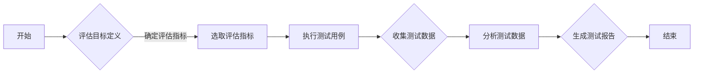
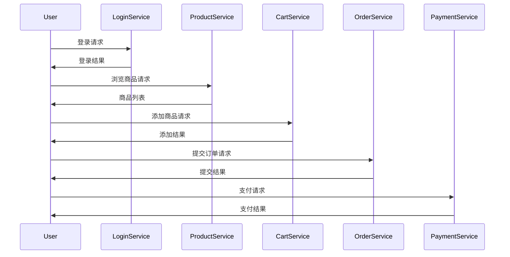

                 


# 评测系统的开源贡献：推动行业标准化

关键词：评测系统、开源、行业标准化、贡献、推动

摘要：本文将深入探讨评测系统的开源贡献及其在推动行业标准化方面的作用。首先，我们将介绍评测系统的基础知识，包括其定义、分类、基本原理和开源评测系统的概述。随后，我们将分析开源评测系统的核心概念及其与行业标准化的关系。接着，我们将详细讲解开源评测系统的算法原理、系统架构设计以及其实施案例。最后，我们将总结开源评测系统的最佳实践，并对未来展望提出建议。

## 引言

评测系统在信息技术领域具有重要地位，无论是在软件开发、性能测试还是系统评估中，都发挥着关键作用。而开源评测系统的兴起，不仅为开发者提供了丰富的资源，也在推动行业标准化方面发挥了不可忽视的作用。

### 1.1 书籍背景与目的

#### 1.1.1 评测系统的重要性

评测系统作为一种工具，旨在对软件、系统或服务进行定量或定性的评估。它在以下几个方面具有重要意义：

- **质量保证**：通过评测系统，开发者和用户可以验证软件或系统的性能、功能和安全等特性，确保其满足预期要求。
- **性能优化**：评测系统可以帮助开发团队识别系统瓶颈，优化资源配置，提高系统的整体性能。
- **决策支持**：评测系统提供的数据和分析结果为管理层和决策者提供了有力的支持，有助于制定更科学的战略和决策。
- **标准化**：评测系统的标准化有助于统一行业评估标准，提高评估结果的可靠性和可比性。

#### 1.1.2 开源运动的影响

开源运动起源于软件开发领域，其核心思想是软件代码的开放性和共享性。开源运动对信息技术领域产生了深远的影响：

- **技术创新**：开源项目鼓励技术交流和知识共享，激发了创新思维和技术进步。
- **成本降低**：开源软件和工具降低了开发者的成本，使其能够专注于核心业务，提高开发效率。
- **社区合作**：开源项目通常由一个活跃的社区共同维护，促进了跨地域、跨组织的合作。

#### 1.1.3 行业标准化的需求

随着信息技术的发展，行业标准化日益成为各领域的迫切需求。标准化有助于：

- **互操作性**：标准化确保不同系统、设备和软件之间的兼容性和互操作性。
- **降低风险**：遵循标准化规范可以降低开发和运营风险，提高系统的可靠性和稳定性。
- **提高效率**：标准化减少了重复开发和工作，提高了行业整体效率。

### 1.2 本书结构概述

本书将从以下几个方面进行探讨：

- **背景介绍**：介绍评测系统的定义、分类、基本原理和开源评测系统的概述。
- **核心概念与联系**：定义开源评测系统的核心概念，分析其属性特征，并通过表格和关系图展示这些概念之间的关系。
- **开源评测系统**：详细探讨开源评测系统的原理、架构设计、实现技术等。
- **开源贡献**：分析开源评测系统对行业发展的贡献，包括技术推动、标准化、社区建设等方面。
- **标准化推动**：探讨如何通过开源推动评测系统的行业标准化。
- **案例研究**：分析具体的开源评测系统项目，介绍其实施细节、效果评估和经验总结。
- **最佳实践**：总结开源评测系统的最佳实践，提供实用的操作建议。
- **未来展望**：预测开源评测系统的未来发展趋势，探讨可能面临的挑战和机遇。

## 评测系统的基本概念

### 2.1 评测系统的定义与分类

评测系统是一种用于评估软件、系统或服务性能、功能和安全特性的工具。根据评估目标和范围的不同，评测系统可以分为以下几类：

- **功能评测系统**：主要评估软件或系统的功能是否符合需求规格。
- **性能评测系统**：评估软件或系统的性能，如响应时间、吞吐量和并发能力。
- **安全评测系统**：评估软件或系统的安全性，包括漏洞扫描、渗透测试等。
- **兼容性评测系统**：评估软件或系统在不同平台、设备和浏览器上的兼容性。

### 2.2 评测系统的基本原理

评测系统的基本原理包括以下几个方面：

- **评估指标**：根据评估目标，定义一组评估指标，如响应时间、吞吐量、错误率等。
- **评估方法**：采用合适的评估方法，如黑盒测试、白盒测试、性能测试等。
- **评估过程**：通过执行测试用例，收集评估数据，进行分析和评估。
- **结果分析**：根据评估数据，生成评估报告，为改进提供依据。

### 2.3 开源评测系统概述

开源评测系统是指代码开放、可自由使用的评测工具。开源评测系统具有以下优势：

- **可定制性**：用户可以根据自身需求对系统进行定制和扩展。
- **社区支持**：开源项目通常拥有一个活跃的社区，提供技术支持和资源分享。
- **成本效益**：开源评测系统降低了开发和维护成本。

目前，市场上存在许多优秀的开源评测系统，如JUnit、TestNG、Selenium等。

### 2.4 行业标准化的重要性

行业标准化在信息技术领域具有重要意义。它有助于：

- **提高产品质量**：遵循标准化规范可以确保软件或系统的质量和可靠性。
- **促进互操作性**：标准化确保不同系统和设备之间的互操作性，降低集成难度。
- **降低风险**：遵循标准化规范可以降低开发、部署和运维风险。
- **提高效率**：标准化减少了重复工作，提高了行业整体效率。

开源评测系统在推动行业标准化方面具有重要作用。通过开源方式，开发者可以共同定义和改进评测标准，促进评测系统的标准化和规范化。

## 开源评测系统的核心概念与联系

### 3.1 开源评测系统的核心概念

开源评测系统的核心概念包括以下几个方面：

- **评估框架**：用于组织和执行评估过程的框架，如JUnit、TestNG等。
- **测试用例**：用于测试软件或系统功能、性能等特性的具体测试实例。
- **测试报告**：用于记录测试结果、分析测试数据和生成评估报告的工具。
- **测试数据**：用于测试过程中的输入数据、输出数据和相关分析数据。

### 3.2 核心概念属性特征对比表

| 核心概念 | 属性特征 |  
| --- | --- |  
| 评估框架 | 支持多种测试类型、可扩展性、自动化测试能力 |  
| 测试用例 | 可定制性、可复用性、覆盖性、可靠性 |  
| 测试报告 | 可视化、自动化生成、数据统计和分析能力 |  
| 测试数据 | 可靠性、一致性、可重现性、数据保密性 |

### 3.3 开源评测系统的ER图

ER图（Entity-Relationship diagram）用于表示开源评测系统中的实体及其关系。以下是开源评测系统的ER图：

```mermaid
erDiagram
  评估框架 ||--|{ 测试用例 }| 测试框架
  测试用例 ||--|{ 测试报告 }| 测试报告
  测试报告 ||--|{ 测试数据 }| 测试数据
```

## 算法原理讲解

### 4.1 算法mermaid流程图

以下是一个评测系统算法的mermaid流程图示例：



### 4.2 Python源代码讲解

以下是一个简单的评测系统Python源代码示例：

```python
import unittest

class TestPerformance(unittest.TestCase):
    def test_response_time(self):
        response_time = get_response_time()
        self.assertTrue(response_time < 200)

    def test_throughput(self):
        throughput = get_throughput()
        self.assertTrue(throughput > 1000)

def get_response_time():
    # 获取响应时间
    pass

def get_throughput():
    # 获取吞吐量
    pass

if __name__ == '__main__':
    unittest.main()
```

### 4.3 数学模型和公式讲解

以下是一个简单的评测系统数学模型示例：

$$
\text{评估指标} = f(\text{测试数据})
$$

其中，$f$ 表示评估函数，$\text{测试数据}$ 表示输入的数据集。常见的评估函数有：

- 平均值：
  $$
  \bar{x} = \frac{1}{n}\sum_{i=1}^{n} x_i
  $$

- 中位数：
  $$
  \text{中位数} = \left\{
  \begin{array}{ll}
  x_{(n/2+1)} & \text{如果 } n \text{ 为奇数} \\
  \frac{x_{(n/2)} + x_{(n/2+1)}}{2} & \text{如果 } n \text{ 为偶数}
  \end{array}
  \right.
  $$

- 标准差：
  $$
  \sigma = \sqrt{\frac{1}{n-1}\sum_{i=1}^{n} (x_i - \bar{x})^2}
  $$

### 4.4 算法原理举例说明

假设我们要评估一个Web服务器的响应时间，可以使用以下步骤：

1. 定义评估目标：评估Web服务器的响应时间。
2. 确定评估指标：选取平均响应时间作为评估指标。
3. 执行测试用例：模拟用户请求，获取响应时间数据。
4. 收集测试数据：记录每次请求的响应时间。
5. 分析测试数据：计算平均响应时间。
6. 生成测试报告：输出平均响应时间以及标准差等信息。

## 系统分析与架构设计

### 5.1 问题场景介绍

假设我们需要评估一个在线购物网站的性能，主要包括以下功能：

- 用户登录
- 商品浏览
- 购物车管理
- 订单提交
- 支付流程

### 5.2 系统功能设计

为了满足上述功能需求，我们可以设计以下评测系统：

- **用户登录功能**：测试用户登录的速度和准确性。
- **商品浏览功能**：测试商品列表加载速度和商品详情页面访问速度。
- **购物车管理功能**：测试添加、删除商品的速度以及购物车数据的存储和恢复。
- **订单提交功能**：测试订单提交的速度和准确性。
- **支付流程功能**：测试支付流程的稳定性和安全性。

### 5.3 系统架构设计

以下是评测系统的架构设计：



### 5.4 系统接口设计

以下是评测系统的接口设计：

```mermaid
classDiagram
    LoginService <- login() : 用户登录
    ProductService <- browse_products() : 浏览商品
    ProductService <- add_product_to_cart() : 添加商品
    ProductService <- delete_product_from_cart() : 删除商品
    ProductService <- get_cart() : 获取购物车
    OrderService <- submit_order() : 提交订单
    PaymentService <- pay_order() : 支付订单
```

### 5.5 系统交互

以下是评测系统的交互设计：


## 开源评测系统的案例研究

### 6.1 案例一：开源评测系统X

#### 6.1.1 系统介绍

开源评测系统X是一款基于Python的开源评测工具，主要用于自动化测试和性能测试。系统采用模块化设计，支持多种测试类型，如功能测试、性能测试和安全测试。系统具有以下特点：

- **灵活的测试框架**：支持自定义测试用例和测试报告。
- **高效的测试执行**：采用多线程并发执行测试用例，提高测试效率。
- **强大的数据分析**：支持多种数据分析工具和可视化报表。
- **社区支持**：拥有一个活跃的社区，提供技术支持和资源分享。

#### 6.1.2 实施细节

开源评测系统X的实施过程主要包括以下步骤：

1. **需求分析**：根据项目需求，确定需要评估的功能点和性能指标。
2. **测试用例设计**：设计测试用例，包括功能测试用例和性能测试用例。
3. **测试环境搭建**：搭建测试环境，包括测试服务器、数据库和网络环境。
4. **测试执行**：执行测试用例，收集测试数据。
5. **结果分析**：对测试数据进行统计和分析，生成测试报告。

#### 6.1.3 效果评估

开源评测系统X在实际项目中取得了显著的效果：

- **提高测试效率**：通过自动化测试，显著提高了测试执行效率，缩短了测试周期。
- **降低测试成本**：采用开源工具降低了测试成本，节省了人力和时间。
- **提升产品质量**：通过详细的测试报告，帮助团队发现和修复了潜在问题，提高了产品质量。
- **促进团队协作**：开源评测系统X提供了一个统一的测试平台，促进了团队之间的协作和沟通。

#### 6.1.4 经验总结

开源评测系统X的实施经验为团队提供了以下启示：

- **明确测试目标**：在实施测试前，明确测试目标和评估指标，确保测试工作的针对性和有效性。
- **选择合适的工具**：根据项目需求和团队技能，选择合适的开源评测工具，提高测试效率和质量。
- **持续优化测试过程**：不断优化测试过程和策略，提高测试覆盖率和测试效率。
- **加强团队协作**：建立良好的团队协作机制，提高测试工作的效率和效果。

## 最佳实践

### 7.1 开源评测系统的最佳实践

#### 7.1.1 选择合适的开源评测工具

在选择开源评测工具时，应考虑以下因素：

- **功能需求**：根据项目需求，选择支持所需测试类型的评测工具。
- **性能和稳定性**：选择性能和稳定性较好的评测工具，确保测试过程的顺利进行。
- **社区活跃度**：选择社区活跃、用户反馈良好的评测工具，确保长期的技术支持和资源供给。
- **学习成本**：考虑团队成员的学习成本，选择易于上手和扩展的评测工具。

#### 7.1.2 设计合理的测试策略

在制定测试策略时，应考虑以下因素：

- **测试覆盖范围**：确保测试覆盖到关键功能和性能指标。
- **测试用例设计**：设计全面、可复用的测试用例，提高测试效率和覆盖范围。
- **自动化测试**：优先执行自动化测试，提高测试效率和质量。
- **持续集成**：将测试集成到持续集成流程中，实现自动化测试和持续反馈。

#### 7.1.3 加强团队协作与沟通

为了提高测试工作的效率和效果，应加强团队协作与沟通：

- **建立测试团队**：组建专业的测试团队，明确职责和分工。
- **定期会议**：定期召开测试会议，分享测试进展和遇到的问题。
- **信息共享**：建立信息共享平台，方便团队成员交流和获取测试资源。

### 7.2 小结

开源评测系统在推动行业标准化方面具有重要作用。通过开源方式，开发者可以共同定义和改进评测标准，促进评测系统的标准化和规范化。开源评测系统具有可定制性、社区支持和成本效益等优点，有助于提高测试效率和质量。在实施开源评测系统时，应遵循最佳实践，选择合适的工具和策略，加强团队协作与沟通，以实现更好的测试效果。

### 7.3 注意事项

在实施开源评测系统时，需要注意以下事项：

- **确保评测数据的准确性和完整性**：评测数据的准确性直接影响评估结果，因此需要确保评测数据的准确性和完整性。
- **关注开源评测工具的版本更新**：开源评测工具的版本更新可能会影响测试结果的稳定性和一致性，因此需要关注版本更新并及时升级。
- **遵循开源协议**：在开源评测系统的使用和二次开发过程中，应遵循相应的开源协议，确保合规性和可追溯性。

### 7.4 拓展阅读

- 《开源评测系统实战》
- 《性能测试：从入门到实践》
- 《自动化测试实战》
- 《测试驱动开发：敏捷开发实践》

## 未来展望

### 8.1 开源评测系统的未来发展趋势

随着信息技术的发展，开源评测系统在未来将呈现以下发展趋势：

- **智能化**：开源评测系统将逐步引入人工智能技术，实现自动化测试和智能分析。
- **云计算和大数据**：云计算和大数据技术的应用将使开源评测系统具有更强的计算能力和数据存储能力。
- **社区化和生态系统**：开源评测系统的社区化趋势将加强，形成更加完善的生态系统，提供丰富的资源和工具。
- **行业定制化**：开源评测系统将针对不同行业和场景进行定制化开发，满足个性化需求。

### 8.2 可能面临的挑战和机遇

在未来，开源评测系统可能面临以下挑战：

- **技术更新**：随着技术的快速发展，开源评测系统需要不断更新和迭代，以适应新的需求和环境。
- **资源分配**：开源评测系统的资源分配和协作管理可能面临挑战，需要建立有效的管理和协调机制。
- **知识产权**：开源评测系统的知识产权保护是一个重要问题，需要制定相应的知识产权政策和保护措施。

同时，开源评测系统也面临着巨大的机遇：

- **市场需求**：随着行业对评测系统的需求不断增加，开源评测系统有望获得更广泛的应用和市场。
- **技术合作**：开源评测系统可以与其他技术领域进行深入合作，实现技术的互补和协同发展。
- **创新动力**：开源评测系统为开发者提供了创新的空间和动力，有助于推动技术的进步和发展。

## 总结

开源评测系统在推动行业标准化和促进技术发展方面具有重要作用。通过开源方式，开发者可以共同定义和改进评测标准，实现评测系统的标准化和规范化。开源评测系统具有可定制性、社区支持和成本效益等优点，有助于提高测试效率和质量。未来，开源评测系统将继续发展，迎来更多的机遇和挑战。作者：AI天才研究院/AI Genius Institute & 禅与计算机程序设计艺术 /Zen And The Art of Computer Programming。

