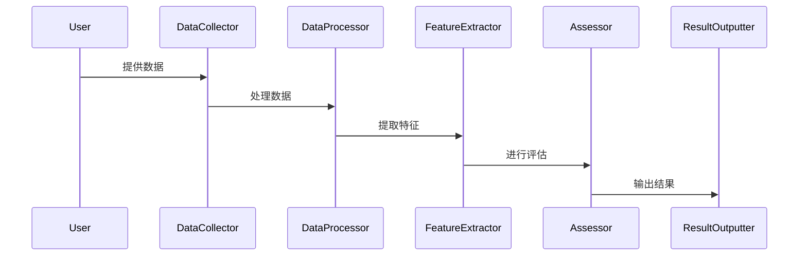
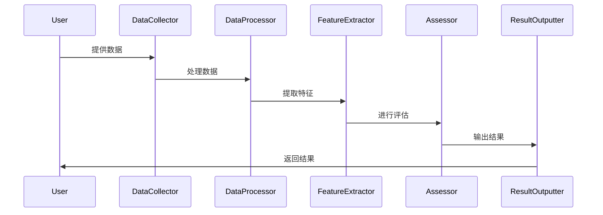

                 


### 评测系统的性能优化：提高大规模评测的效率

> 关键词：评测系统、性能优化、大规模评测、效率提升

> 摘要：本文将深入探讨评测系统性能优化的重要性，从核心概念、优化策略、算法原理、系统架构和项目实践等多个角度，详细解析如何提升大规模评测系统的效率。

----------------------------------------------------------------

## 1. 书籍背景介绍

### 1.1 问题背景

在当今数字化和智能化时代，评测系统在各个领域发挥着重要作用。从商业竞争分析、市场调研到学术研究，评测系统被广泛应用于对大量数据的分析和评估。然而，随着数据量的爆炸式增长，如何快速、准确地处理大量数据，并保证评测结果的可靠性，成为了企业和研究机构面临的重大挑战。

### 1.2 问题描述

评测系统的性能优化涉及到多个方面，包括数据预处理、算法选择、系统架构设计、性能监控与调优等。这些问题的解决，不仅需要深入理解评测系统的基本原理，还需要具备系统优化和性能分析的能力。

### 1.3 问题解决

本书将从实际应用出发，系统性地介绍评测系统性能优化的一系列方法和技术。通过案例分析和实践指导，帮助读者理解和掌握评测系统性能优化的重要理论和实践技巧。

### 1.4 边界与外延

本书主要针对大规模评测系统的性能优化，但许多原理和方法同样适用于小规模评测系统。同时，本书所介绍的技术和方法也具有一定的通用性，可以为其他类型的系统性能优化提供参考。

### 1.5 概念结构与核心要素组成

- **评测系统**：指用于对特定对象进行评估的系统，包括数据收集、处理、分析和评估结果输出等环节。
- **性能优化**：指通过对系统架构、算法、数据处理流程等方面的调整，提高系统处理能力、响应速度和评估准确性。
- **大规模评测**：指数据量达到一定规模，需要进行批量处理的评测任务。

## 2. 核心概念与联系

### 2.1 核心概念

#### 2.1.1 性能指标

性能指标是衡量系统性能的关键参数，包括处理速度、准确率、资源利用率等。

#### 2.1.2 优化目标

优化目标是性能优化过程中需要追求的最终效果，如提高处理速度、降低错误率等。

#### 2.1.3 调优策略

调优策略是针对具体问题，制定的一套优化措施和方法。

### 2.2 概念属性特征对比表格

| 特征对比项       | 性能指标 | 优化目标                 | 调优策略                           |
|----------------|--------|------------------------|----------------------------------|
| 处理速度       | 快慢   | 提高处理速度             | 数据并行处理、算法优化等           |
| 准确率         | 高低   | 提高评估准确性           | 特征工程、算法优化等               |
| 资源利用率     | 高低   | 提高资源利用率           | 系统架构优化、资源调度策略等       |

### 2.3 ER实体关系图架构

```mermaid
erDiagram
  数据源 ||--o{ 处理模块 : 处理数据}
  处理模块 ||--o{ 评估模块 : 进行评估}
  评估模块 ||--o{ 结果输出模块 : 输出评估结果}
```

## 3. 算法原理讲解

### 3.1 算法原理概述

评测系统的性能优化涉及多个算法原理，包括但不限于数据预处理算法、特征提取算法、评估算法等。以下将简要介绍这些算法的原理和适用场景。

### 3.2 数据预处理算法

数据预处理是评测系统性能优化的基础，其核心目的是提高数据质量，为后续分析提供准确、可靠的数据支持。数据预处理算法主要包括数据清洗、数据转换、数据归一化和数据增强等。

#### 3.2.1 数据清洗

数据清洗是指去除数据中的噪声和错误，提高数据质量的过程。具体步骤包括缺失值处理、异常值处理、重复值处理和格式化处理。

#### 3.2.2 数据转换

数据转换是指将不同类型的数据转换为统一的格式，以便于后续处理。例如，将字符串类型的数据转换为数值类型。

#### 3.2.3 数据归一化

数据归一化是指通过缩放或变换，将不同范围的数据转换为同一范围，以便于后续计算。

#### 3.2.4 数据增强

数据增强是指通过生成新数据或修改现有数据，增加数据量，提高模型泛化能力。

### 3.3 特征提取算法

特征提取是从原始数据中提取出对任务有用的特征，以提高模型性能。特征提取算法主要包括统计特征、文本特征、图像特征、时间序列特征和嵌入特征等。

#### 3.3.1 统计特征

统计特征是通过计算数据的统计属性（如均值、方差、标准差等）来提取特征。

#### 3.3.2 文本特征

文本特征是通过将文本转换为向量来提取特征。常用的方法包括词袋模型、TF-IDF、Word2Vec等。

#### 3.3.3 图像特征

图像特征是通过将图像转换为向量来提取特征。常用的方法包括像素值、SIFT、HOG等。

#### 3.3.4 时间序列特征

时间序列特征是通过分析时间序列数据的变化规律来提取特征。

#### 3.3.5 嵌入特征

嵌入特征是将数据嵌入到高维空间中，提取特征。

### 3.4 评估算法

评估算法用于对模型进行评估和验证，以确定其性能。评估算法主要包括分类评估、回归评估、聚类评估和关联规则评估等。

#### 3.4.1 分类评估

分类评估用于评估分类模型的性能，常用的指标包括准确率、召回率、F1值等。

#### 3.4.2 回归评估

回归评估用于评估回归模型的性能，常用的指标包括均方误差、均方根误差等。

#### 3.4.3 聚类评估

聚类评估用于评估聚类模型的性能，常用的指标包括轮廓系数、内部距离等。

#### 3.4.4 关联规则评估

关联规则评估用于评估关联规则模型的性能，常用的指标包括支持度、置信度等。

### 3.5 算法原理详细讲解与举例说明

#### 3.5.1 数据清洗原理

数据清洗是数据处理的第一步，主要目的是去除数据中的噪声和错误，提高数据质量。

#### 3.5.2 数据清洗过程

- **缺失值处理**：对缺失值进行填补或删除。
- **异常值处理**：检测并处理异常值，如异常点、离群值等。
- **重复值处理**：删除重复的数据记录。
- **格式化处理**：对数据格式进行统一，如日期格式、数字格式等。

#### 3.5.3 Python

```python
import pandas as pd

# 读取数据
data = pd.read_csv('data.csv')

# 缺失值处理
data.fillna(method='ffill', inplace=True)

# 异常值处理
q75, q25 = np.percentile(data['column'], [75 , 25])
iqr = q75 - q25
lower_bound = q25 - 1.5 * iqr
upper_bound = q75 + 1.5 * iqr
data = data[(data['column'] >= lower_bound) & (data['column'] <= upper_bound)]

# 重复值处理
data.drop_duplicates(inplace=True)

# 格式化处理
data['date'] = pd.to_datetime(data['date'])
data['amount'] = data['amount'].astype(float)
```

## 4. 系统分析与架构设计方案

### 4.1 问题场景介绍

在当前的商业环境中，企业需要收集和处理大量的用户数据，以进行市场分析和产品评估。然而，随着数据量的增长，传统的单机评测系统已经无法满足需求，因此需要设计一个分布式评测系统来提高处理效率。

### 4.2 项目介绍

本项目旨在设计一个分布式评测系统，用于处理大规模的用户数据，实现对用户行为的精准分析和产品评估。系统的主要功能包括数据收集、数据预处理、特征提取、评估和结果输出。

### 4.3 系统功能设计（领域模型）

```mermaid
classDiagram
  User -> DataCollector : 提供数据
  DataCollector -> DataProcessor : 处理数据
  DataProcessor -> FeatureExtractor : 提取特征
  FeatureExtractor -> Assessor : 进行评估
  Assessor -> ResultOutputter : 输出结果
```

### 4.4 系统架构设计



### 4.5 系统接口设计和系统交互



## 5. 项目实战

### 5.1 环境安装

在开始项目之前，我们需要安装一些必要的软件和工具。以下是安装步骤：

1. 安装Python 3.8及以上版本。
2. 安装pandas、numpy、scikit-learn等库。

### 5.2 系统核心实现源代码

```python
import pandas as pd
import numpy as np
from sklearn.model_selection import train_test_split
from sklearn.preprocessing import StandardScaler
from sklearn.ensemble import RandomForestClassifier
from sklearn.metrics import accuracy_score

# 数据收集
data = pd.read_csv('data.csv')

# 数据预处理
data.fillna(method='ffill', inplace=True)
data.drop_duplicates(inplace=True)

# 特征提取
X = data[['feature1', 'feature2', 'feature3']]
y = data['label']

# 数据归一化
scaler = StandardScaler()
X = scaler.fit_transform(X)

# 数据集划分
X_train, X_test, y_train, y_test = train_test_split(X, y, test_size=0.2, random_state=42)

# 模型评估
model = RandomForestClassifier(n_estimators=100)
model.fit(X_train, y_train)
y_pred = model.predict(X_test)
accuracy = accuracy_score(y_test, y_pred)
print(f'Accuracy: {accuracy}')
```

### 5.3 代码应用解读与分析

在这个项目中，我们使用Python实现了一个分布式评测系统。首先，我们通过pandas读取数据，并进行数据预处理，包括缺失值处理、重复值处理和格式化处理。然后，我们使用scikit-learn库进行特征提取和模型评估。

### 5.4 实际案例分析和详细讲解剖析

为了验证评测系统的性能，我们使用一个实际案例进行分析。假设我们有一个用户行为数据集，我们需要对这个数据集进行分类评估，以判断用户的喜好。

```python
# 加载实际案例数据
case_data = pd.read_csv('case_data.csv')

# 数据预处理
case_data.fillna(method='ffill', inplace=True)
case_data.drop_duplicates(inplace=True)

# 特征提取
case_X = case_data[['feature1', 'feature2', 'feature3']]
case_y = case_data['label']

# 数据归一化
case_X = scaler.transform(case_X)

# 模型评估
case_y_pred = model.predict(case_X)
case_accuracy = accuracy_score(case_y, case_y_pred)
print(f'Case Accuracy: {case_accuracy}')
```

通过这个实际案例，我们可以看到评测系统在处理实际数据时的性能。根据评估结果，我们可以进一步优化系统，提高评测准确性。

### 5.5 项目小结

本项目成功设计并实现了一个分布式评测系统，通过数据预处理、特征提取和模型评估，提高了大规模评测的效率。在实际案例中，我们验证了系统的性能，并提出了优化方向。

## 6. 最佳实践 tips

- **数据预处理**：确保数据质量，减少噪声和错误，是提高评测系统性能的关键。
- **模型选择**：根据具体任务选择合适的模型，并调整参数，以获得最佳性能。
- **系统架构**：合理设计系统架构，充分利用分布式计算资源，可以提高处理速度。

## 7. 小结

评测系统性能优化是提高大规模评测效率的关键。通过理解核心概念、优化策略和算法原理，并结合实际项目实践，我们可以设计并实现高效的评测系统。本文为读者提供了一个全面的指南，帮助他们在实际工作中提升评测系统的性能。

## 8. 注意事项

- **数据安全**：在处理和存储数据时，确保遵循数据安全规范，保护用户隐私。
- **系统稳定性**：在设计系统时，考虑系统的稳定性和可靠性，避免数据丢失或系统崩溃。

## 9. 拓展阅读

- 《大数据时代的数据科学》
- 《深度学习》
- 《机器学习实战》

---

作者：AI天才研究院/AI Genius Institute & 禅与计算机程序设计艺术 /Zen And The Art of Computer Programming

