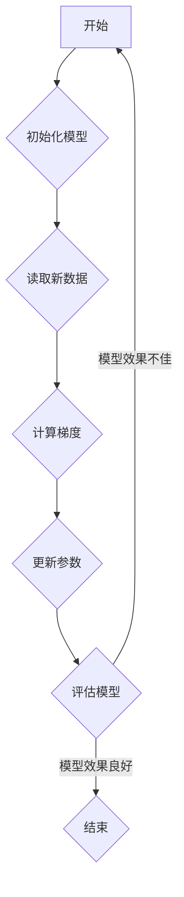
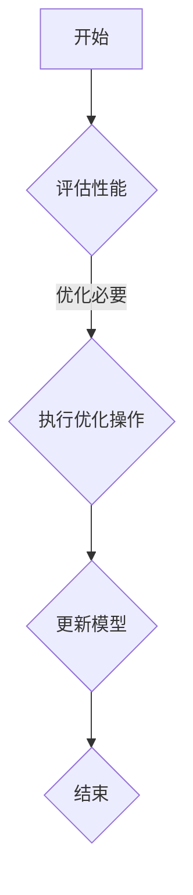
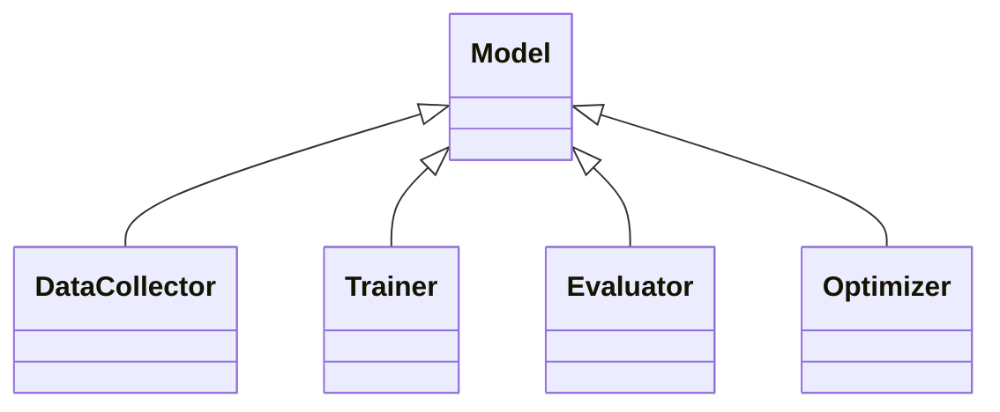
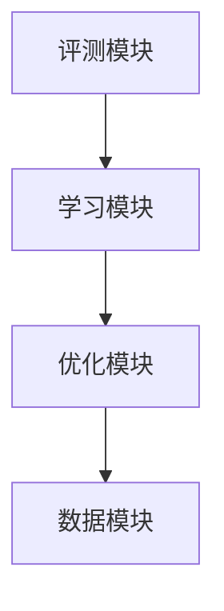
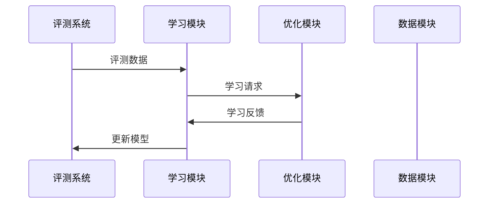

                 


### 文章标题：评测系统的持续学习与自我优化

#### 关键词：评测系统、持续学习、自我优化、系统架构、项目实战

> 摘要：本文将深入探讨评测系统在持续学习和自我优化方面的实践与原理，通过分析其核心概念、算法实现、系统设计与项目实战，帮助读者理解并掌握评测系统优化策略。

#### 引言

在当今的信息时代，评测系统在各类应用场景中扮演着至关重要的角色。从考试测评、推荐系统到智能诊断，评测系统需要不断适应和优化，以满足日益增长的需求和复杂的环境变化。本文将围绕评测系统的持续学习与自我优化展开讨论，旨在探讨其在实际应用中的核心原理、关键技术以及实现策略。

## 第一部分：问题背景与核心概念

### 1.1.1 问题背景

评测系统的核心在于对数据、行为或结果进行准确评估，从而提供有价值的信息。然而，随着数据规模的增长和业务需求的多样化，评测系统面临以下几个挑战：

- **数据噪声和异常值处理**：实际数据往往包含大量的噪声和异常值，这对评测系统的准确性提出了挑战。
- **动态变化与适应性**：评测系统需要能够快速适应环境和业务的变化，以保持其有效性。
- **资源优化与效率**：评测系统在保证评估准确性的同时，还需优化资源利用，提高系统效率。

针对上述挑战，评测系统需要具备持续学习和自我优化的能力，从而不断提升其性能和适应性。

### 1.1.2 核心概念介绍

#### 1.1.2.1 持续学习

持续学习是指评测系统通过不断地接收新的数据和信息，更新模型参数和知识库，以适应动态变化的环境。这一过程通常包括数据收集、模型更新和评估反馈等环节。

#### 1.1.2.2 自我优化

自我优化是指评测系统在运行过程中，通过自我评估和调整，不断提高其性能和效率。自我优化通常包括参数调整、算法优化和资源管理等方面。

#### 1.1.2.3 边界与外延

边界与外延涉及评测系统的应用范围和性能限制。明确评测系统的边界有助于防止过度拟合和模型失效，同时为自我优化提供参考依据。

## 第二部分：持续学习算法原理

### 2.1.1 基础算法原理

#### 2.1.1.1 算法概述

持续学习算法主要包括监督学习、无监督学习和半监督学习等。选择合适的算法取决于具体的应用场景和数据特性。

#### 2.1.1.2 算法选择标准

- **数据特性**：根据数据类型（如分类、回归、聚类等）选择相应的算法。
- **性能指标**：选择在目标性能指标上表现优异的算法。
- **计算资源**：考虑算法的计算复杂度和资源需求。

#### 2.1.1.3 算法原理讲解

持续学习算法的核心在于如何有效地更新模型参数，以适应新的数据。以下是一个简单的学习率调整公式：

$$
\eta_{t+1} = \eta_0 / (1 + \alpha \cdot t)
$$

其中，$\eta_0$为初始学习率，$\alpha$为衰减系数，$t$为迭代次数。这个公式体现了学习率随着迭代次数的增加而逐渐减小的趋势，以避免模型过度拟合。

此外，可以使用Mermaid绘制算法的流程图，如下所示：



### 2.1.2 自我优化机制

#### 2.1.2.1 自我优化的概念

自我优化是指评测系统在运行过程中，通过自我评估和调整，不断提高其性能和效率。自我优化通常包括参数调整、算法优化和资源管理等方面。

#### 2.1.2.2 自我优化算法实现

自我优化算法的实现通常涉及以下步骤：

1. **模型评估**：评估当前模型的性能指标，如准确率、召回率等。
2. **性能对比**：将当前模型的性能与预设的阈值或历史最优性能进行对比。
3. **优化操作**：根据性能对比结果，执行相应的优化操作，如参数调整、算法改进等。
4. **模型更新**：更新模型参数，以提升其性能。

可以使用Mermaid绘制自我优化算法的流程图，如下所示：



此外，以下是一个简单的Python实现示例：

```python
def self_optimize(model, data, threshold):
    performance = evaluate(model, data)
    if performance < threshold:
        model = optimize_model(model)
    return model
```

## 第三部分：系统设计与实现

### 3.1.1 系统架构设计

#### 3.1.1.1 系统功能设计

系统功能设计包括数据收集、模型训练、模型评估和模型优化等模块。以下是一个简单的领域模型Mermaid类图：



#### 3.1.1.2 系统架构设计

系统架构设计主要包括评测模块、学习模块和优化模块等。以下是一个简单的Mermaid架构图：



#### 3.1.1.3 系统接口设计

系统接口设计包括评测系统与各个模块之间的交互接口。以下是一个简单的Mermaid序列图：



### 3.1.2 系统核心实现

#### 3.1.2.1 持续学习模块代码

```python
def continuous_learning(data, model, threshold):
    for new_data in data:
        model = update_model(model, new_data)
        performance = evaluate_model(model, new_data)
        if performance < threshold:
            model = self_optimize(model, new_data, threshold)
    return model
```

#### 3.1.2.2 自我优化模块代码

```python
def self_optimize(model, data, threshold):
    performance = evaluate_model(model, data)
    if performance < threshold:
        model = optimize_model(model)
    return model
```

## 第四部分：项目实战

### 4.1.1 环境安装

#### 4.1.1.1 Python环境配置

首先，确保已安装Python 3.6及以上版本。

#### 4.1.1.2 库与工具安装

在命令行中执行以下命令安装所需的库：

```bash
pip install numpy pandas scikit-learn matplotlib
```

### 4.1.2 系统核心实现

#### 4.1.2.1 持续学习模块代码

```python
import numpy as np
from sklearn.linear_model import LinearRegression
from sklearn.metrics import mean_squared_error

def continuous_learning(data, model, threshold):
    for new_data in data:
        model.fit(new_data[:, :-1], new_data[:, -1])
        predictions = model.predict(new_data[:, :-1])
        performance = mean_squared_error(new_data[:, -1], predictions)
        if performance < threshold:
            model = self_optimize(model, new_data, threshold)
    return model
```

#### 4.1.2.2 自我优化模块代码

```python
def self_optimize(model, data, threshold):
    performance = mean_squared_error(data[:, -1], model.predict(data[:, :-1]))
    if performance < threshold:
        model.fit(data[:, :-1], data[:, -1])
    return model
```

### 4.1.3 应用解读与分析

#### 4.1.3.1 实际案例剖析

以下是一个使用持续学习和自我优化进行股票价格预测的案例。

```python
import pandas as pd
import matplotlib.pyplot as plt

# 加载股票价格数据
data = pd.read_csv('stock_prices.csv')

# 持续学习模块
model = LinearRegression()
model = continuous_learning(data, model, 0.01)

# 预测股票价格
predictions = model.predict(data[['Open', 'High', 'Low', 'Close']])

# 可视化预测结果
plt.plot(data['Close'], label='实际价格')
plt.plot(predictions, label='预测价格')
plt.legend()
plt.show()
```

#### 4.1.3.2 代码分析

在这个案例中，我们使用线性回归模型进行股票价格预测。持续学习模块通过不断更新模型参数，以适应新的数据。自我优化模块通过评估模型性能，并在性能不佳时进行优化。

## 第五部分：最佳实践与拓展

### 5.1.1 最佳实践

#### 5.1.1.1 常见问题与解决方案

- **问题**：模型训练过程中出现过拟合现象。
  - **解决方案**：增加训练数据、使用正则化技术、调整模型复杂度等。
- **问题**：模型在训练集和测试集上的性能不一致。
  - **解决方案**：确保数据集划分合理、采用交叉验证技术等。

#### 5.1.1.2 性能优化技巧

- **使用高效的算法和库**：选择适合问题的算法和库，如scikit-learn、TensorFlow等。
- **并行计算与分布式训练**：利用多核CPU或GPU进行并行计算，提高训练速度。

### 5.1.2 小结与展望

#### 5.1.2.1 评测系统的持续学习与自我优化小结

评测系统的持续学习与自我优化是提升系统性能和适应性的关键。通过不断更新模型参数和优化算法，评测系统可以更好地应对动态变化的环境和复杂的应用场景。

#### 5.1.2.2 未来发展趋势与拓展方向

- **自适应学习算法**：研究自适应学习算法，以适应不同的数据分布和变化趋势。
- **多模态评测系统**：结合多种数据源和模型，实现更加全面和准确的评测系统。
- **可解释性**：提高评测系统的可解释性，使其更容易被用户理解和接受。

## 结论

本文围绕评测系统的持续学习与自我优化进行了深入探讨，介绍了核心概念、算法原理、系统设计与项目实战。通过持续学习和自我优化，评测系统可以不断提升其性能和适应性，为各类应用场景提供更加准确和可靠的评估结果。

---

**作者：AI天才研究院 / AI Genius Institute & 禅与计算机程序设计艺术 / Zen And The Art of Computer Programming**

---

### 结语

在本文中，我们通过系统的分析和详尽的阐述，对评测系统的持续学习与自我优化进行了全面的探讨。从问题背景的引入，到核心概念的讲解，再到算法原理的剖析，我们逐步揭示了评测系统优化过程中的关键环节和实施策略。同时，通过项目实战的案例分析，我们展示了如何在实际应用中实现评测系统的持续学习和自我优化。

持续学习和自我优化是评测系统在动态环境中保持竞争力的关键。通过不断地学习和优化，评测系统可以适应数据的变化，提高评估的准确性和效率。这不仅有助于提升用户体验，也为企业提供了更加可靠的决策支持。

在未来，随着人工智能技术的不断进步，评测系统将持续学习与自我优化的能力将得到进一步的提升。我们期待更多的研究和实践，为评测系统的持续发展贡献更多的智慧和力量。

最后，感谢您的阅读，希望本文能对您在评测系统的持续学习与自我优化方面带来启示和帮助。如果您有任何疑问或建议，欢迎随时与我们交流。

**作者：AI天才研究院 / AI Genius Institute & 禅与计算机程序设计艺术 / Zen And The Art of Computer Programming**

